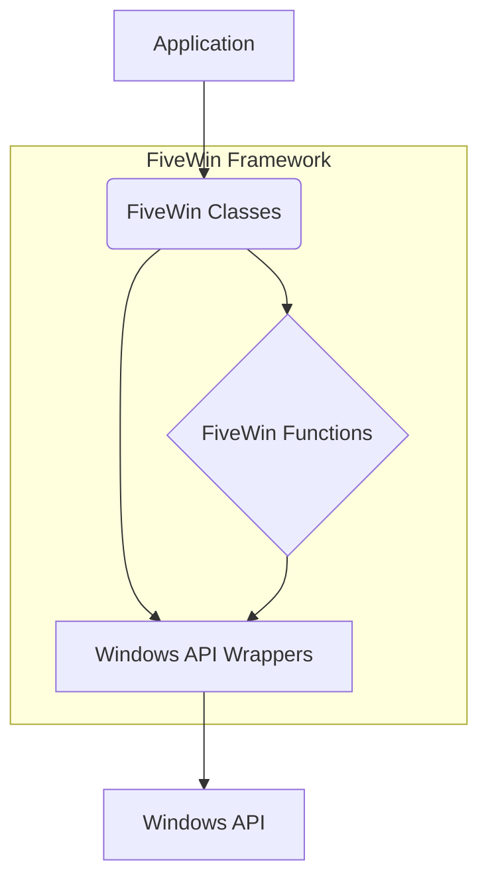

# FiveWin Architecture

This document provides a high-level overview of the FiveWin framework's architecture.

## Core Concepts

FiveWin is built on a layered architecture that abstracts the complexities of the Windows API and provides a simpler, more productive development experience. The main components of the framework are:

*   **Core Classes:** A rich set of classes that represent GUI elements and other system objects.
*   **Functions:** A library of functions that provide utility and helper services.
*   **Windows API Wrappers:** A thin layer of wrappers around the Windows API, providing direct access to the underlying system functionality when needed.

## Architectural Diagram

The following diagram illustrates the high-level architecture of the FiveWin framework:

### Components

*   **Application:** The user's application code, written in Harbour.
*   **FiveWin Classes:** The object-oriented layer of the framework, providing high-level abstractions for GUI elements (e.g., `TWindow`, `TButton`, `TListBox`).
*   **FiveWin Functions:** A collection of utility functions that simplify common programming tasks.
*   **Windows API Wrappers:** Low-level wrappers that provide direct access to the Windows API. This layer is used by the higher-level components of the framework and can also be used directly by the application for advanced scenarios.
*   **Windows API:** The underlying operating system API.

## Design Philosophy

The design of FiveWin is guided by the following principles:

*   **Simplicity:** To provide a simple and intuitive API that is easy to learn and use.
*   **Productivity:** To enable rapid application development by providing a rich set of pre-built components and tools.
*   **Flexibility:** To allow developers to access the full power of the Windows API when needed.
*   **Compatibility:** To maintain compatibility with the xBase language and its ecosystem.
