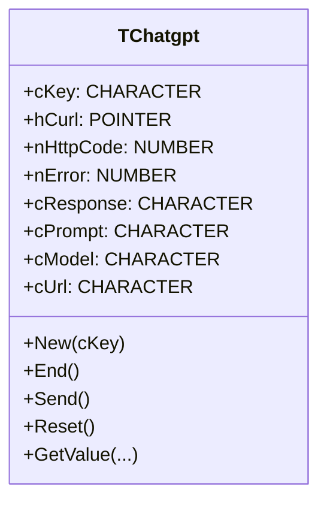
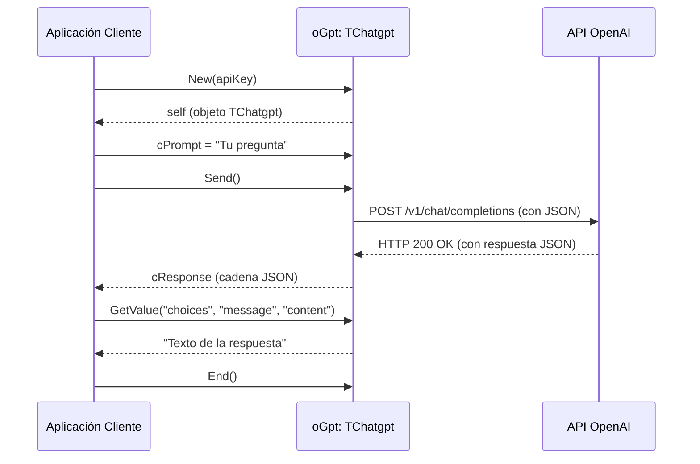

# Análisis del archivo: chatgpt.prg

## 1. Descripción general del archivo

El archivo `chatgpt.prg` es un módulo de código fuente escrito en **Harbour (un dialecto de xBase/Clipper)**. Su propósito principal es encapsular la interacción con la API de OpenAI, específicamente con el modelo de chat (actualmente `gpt-4o-mini`), en una clase llamada `TChatgpt`. Esta clase facilita el envío de `prompts` y la recepción de respuestas del servicio de OpenAI.

## 2. Explicación línea por línea

```harbour
#include "FiveWin.ch"
#include "hbcurl.ch"
```
- **Líneas 1-2**: Se incluyen los archivos de cabecera `FiveWin.ch` y `hbcurl.ch`. `FiveWin.ch` es una librería de interfaz gráfica para Harbour, y `hbcurl.ch` proporciona las definiciones para usar la librería `libcurl`, que permite realizar peticiones HTTP.

```harbour
#ifdef __XHARBOUR__
   #xtranslate hb_HSet( [<x,...>] ) => HSet( <x> )
#endif
```
- **Líneas 4-6**: Es una directiva de preprocesador para compatibilidad. Si se está compilando con `xHarbour`, se traduce la sintaxis de la función `hb_HSet` a `HSet`.

```harbour
CLASS TChatgpt
```
- **Línea 10**: Se define la clase `TChatgpt`.

```harbour
    DATA   cKey AS CHARACTER  INIT ""
    DATA   hCurl
    DATA   nHttpCode
    DATA   nError             INIT 0
    DATA   cResponse
    DATA   cPrompt
    DATA   cModel             INIT "gpt-4o-mini"
    DATA   cUrl               INIT "https://api.openai.com/v1/chat/completions"
```
- **Líneas 12-19**: Se declaran las propiedades (variables de instancia) de la clase:
    - `cKey`: Almacena la clave de la API de OpenAI.
    - `hCurl`: Manejador (handle) para la sesión de `libcurl`.
    - `nHttpCode`: Almacena el código de estado HTTP de la respuesta.
    - `nError`: Almacena el código de error de la operación `curl`.
    - `cResponse`: Almacena la respuesta JSON recibida de la API.
    - `cPrompt`: Almacena el texto del `prompt` que se enviará a la API.
    - `cModel`: El modelo de OpenAI a utilizar, inicializado a `gpt-4o-mini`.
    - `cUrl`: La URL del endpoint de la API de OpenAI, inicializada a `https://api.openai.com/v1/chat/completions`.

```harbour
    METHOD New( cKey )
    METHOD End()
    METHOD Send()
    METHOD Reset()
    METHOD GetValue
```
- **Líneas 21-25**: Se declaran los métodos de la clase:
    - `New`: El constructor de la clase.
    - `End`: El destructor de la clase, para liberar recursos.
    - `Send`: Envía la petición a la API de OpenAI.
    - `Reset`: Reinicia la sesión de `curl`.
    - `GetValue`: Procesa la respuesta JSON para extraer un valor específico.

```harbour
 METHOD New( cKey ) CLASS TChatgpt
    ::cKey := cKey
    ::hCurl := curl_easy_init()
 return Self
```
- **Líneas 29-34**: Implementación del constructor `New`.
    - Asigna la `cKey` proporcionada a la propiedad de la clase.
    - Inicializa una nueva sesión de `curl` y almacena el manejador en `hCurl`.
    - Devuelve la propia instancia del objeto (`Self`).

```harbour
METHOD Send() CLASS TChatgpt
    local aheaders, nHttpCode, cJson, h := { => }, hMessage := { => }
```
- **Líneas 38-39**: Implementación del método `Send`.
    - Declara variables locales: `aheaders` para las cabeceras HTTP, `nHttpCode` para el código de respuesta, `cJson` para el cuerpo de la petición en formato JSON, y `h` y `hMessage` como hashes (arrays asociativos) para construir el JSON.

```harbour
    curl_easy_setopt( ::hCurl, HB_CURLOPT_POST, .T. )
    curl_easy_setopt( ::hCurl, HB_CURLOPT_URL, ::cUrl )
```
- **Líneas 41-42**: Configura las opciones de `curl`:
    - `HB_CURLOPT_POST, .T.`: Especifica que la petición será de tipo `POST`.
    - `HB_CURLOPT_URL, ::cUrl`: Establece la URL a la que se enviará la petición.

```harbour
    aheaders := { "Content-Type: application/json", ;
                  "Authorization: Bearer " + ::cKey }
```
- **Líneas 44-45**: Define las cabeceras HTTP:
    - `Content-Type: application/json`: Indica que el cuerpo de la petición es JSON.
    - `Authorization: Bearer ...`: Proporciona la clave de la API para la autenticación.

```harbour
    curl_easy_setopt( ::hCurl, HB_CURLOPT_HTTPHEADER, aheaders )
    curl_easy_setopt( ::hCurl, HB_CURLOPT_USERNAME, '' )
    curl_easy_setopt( ::hCurl, HB_CURLOPT_DL_BUFF_SETUP )
    curl_easy_setopt( ::hCurl, HB_CURLOPT_SSL_VERIFYPEER, .F. )
```
- **Líneas 47-50**: Más configuraciones de `curl`:
    - `HB_CURLOPT_HTTPHEADER`: Asigna las cabeceras.
    - `HB_CURLOPT_USERNAME`: Se establece un nombre de usuario vacío.
    - `HB_CURLOPT_DL_BUFF_SETUP`: Prepara un búfer para descargar la respuesta.
    - `HB_CURLOPT_SSL_VERIFYPEER, .F.`: Deshabilita la verificación del certificado SSL del peer. **(Nota: Esto es una mala práctica en producción, ya que es inseguro)**.

```harbour
    hb_HSet( h, "model", ::cModel )
    hb_HSet( hMessage, "role", "user" )
    hb_HSet( hMessage, "content", ::cPrompt )
    h["messages"] = { hMessage }
```
- **Líneas 52-55**: Construye el cuerpo de la petición JSON:
    - Se establece el modelo a usar.
    - Se crea un mensaje con el rol `user` y el contenido del `prompt`.
    - Se añade el mensaje al array `messages` del cuerpo principal.

```harbour
    cJson = hb_jsonEncode( h )  
    curl_easy_setopt( ::hcurl, HB_CURLOPT_POSTFIELDS, cJson )
```
- **Líneas 57-58**:
    - `hb_jsonEncode( h )`: Convierte el hash `h` a una cadena de texto en formato JSON.
    - `HB_CURLOPT_POSTFIELDS`: Asigna la cadena JSON como cuerpo de la petición `POST`.

```harbour
    ::nError = curl_easy_perform( ::hCurl )
    curl_easy_getinfo( ::hCurl, HB_CURLINFO_RESPONSE_CODE, @nHttpCode )
    ::nHttpCode = nHttpCode
```
- **Líneas 60-63**: Ejecuta la petición y obtiene información:
    - `curl_easy_perform`: Realiza la petición HTTP. El resultado (código de error de curl) se guarda en `::nError`.
    - `curl_easy_getinfo`: Obtiene el código de respuesta HTTP y lo guarda en `nHttpCode`.
    - Se asigna el código a la propiedad `::nHttpCode`.

```harbour
    if ::nError == HB_CURLE_OK
       ::cResponse = curl_easy_dl_buff_get( ::hCurl )
    else
    endif
```
- **Líneas 65-69**: Manejo de la respuesta:
    - Si la petición se completó sin errores (`HB_CURLE_OK`), se obtiene la respuesta del búfer de descarga y se guarda en `::cResponse`.

```harbour
return ::cResponse
```
- **Línea 71**: El método devuelve la respuesta JSON como una cadena de texto.

```harbour
 METHOD Reset() CLASS TChatgpt
    curl_easy_reset( ::hCurl )
    ::nError := HB_CURLE_OK
    ::cResponse := nil
 return nil
```
- **Líneas 75-80**: Implementación del método `Reset`.
    - `curl_easy_reset`: Reinicia la sesión de `curl` a su estado por defecto, pero mantiene la conexión viva si es posible.
    - Se resetean las propiedades `nError` y `cResponse`.

```harbour
 METHOD End() CLASS TChatgpt
    curl_easy_cleanup( ::hCurl )
    ::hCurl := nil  
 return nil
```
- **Líneas 84-89**: Implementación del método `End`.
    - `curl_easy_cleanup`: Libera todos los recursos asociados a la sesión de `curl`.
    - Se establece `::hCurl` a `nil`.

```harbour
METHOD GetValue() CLASS TChatgpt
   local aKeys  := hb_AParams(), cKey
   local uValue := hb_jsonDecode( ::cResponse )
```
- **Líneas 93-95**: Implementación del método `GetValue`.
    - `hb_AParams()`: Obtiene los parámetros pasados al método como un array.
    - `hb_jsonDecode( ::cResponse )`: Decodifica la respuesta JSON en una estructura de datos de Harbour (hashes y arrays).

```harbour
   TRY
      for each cKey in aKeys 
         if ValType( uValue[ cKey ] ) == "A"
            uValue = uValue[ cKey ][ 1 ]
         else    
            uValue = uValue[ cKey ]
         endif  
      next   
   CATCH 
      ? ::cResponse, ::cPrompt
   END
```
- **Líneas 97-107**: Procesa la estructura de datos decodificada.
    - Itera sobre las claves (`aKeys`) pasadas como parámetros al método.
    - Para cada clave, navega dentro de la estructura `uValue`.
    - Si un valor es un array (`"A"`), asume que el dato de interés está en el primer elemento (`[1]`).
    - Si ocurre un error (por ejemplo, una clave no existe), el bloque `CATCH` imprime la respuesta JSON completa y el prompt original.

```harbour
return uValue
```
- **Línea 109**: Devuelve el valor extraído de la respuesta JSON.

## 3. Funcionalidad principal

El archivo `chatgpt.prg` define una clase `TChatgpt` que actúa como un cliente para la API de chat de OpenAI. Su funcionalidad se puede resumir en los siguientes pasos:

1.  **Inicialización**: Se crea una instancia de `TChatgpt` pasándole una clave de API de OpenAI. El constructor inicializa `libcurl`.
2.  **Envío de Petición**:
    - Se establece el `prompt` (la pregunta o instrucción) en la propiedad `cPrompt`.
    - Se llama al método `Send()`. Este método construye una petición `POST` a la URL de la API de OpenAI.
    - El cuerpo de la petición es un JSON que contiene el modelo a usar y el `prompt` del usuario.
    - La petición se envía usando `libcurl`.
3.  **Recepción de Respuesta**:
    - El método `Send()` almacena la respuesta JSON de la API en la propiedad `cResponse` y el código de estado HTTP en `nHttpCode`.
4.  **Extracción de Datos**:
    - Se puede llamar al método `GetValue()` con una o más claves como parámetros para navegar por la respuesta JSON y extraer un valor específico. Por ejemplo, para obtener el contenido del mensaje de respuesta, se podría llamar como `oGpt:GetValue( "choices", "message", "content" )`.
5.  **Finalización**: Se llama al método `End()` para liberar los recursos de `libcurl` cuando el objeto ya no es necesario.

**Ejemplo de uso:**

```harbour
local oGpt := TChatgpt():New( "MI_API_KEY_SECRETA" )
local cRespuesta

oGpt:cPrompt := "Explica la computación cuántica en términos sencillos."
oGpt:Send()

if oGpt:nHttpCode == 200
   cRespuesta := oGpt:GetValue( "choices", "message", "content" )
   ? "Respuesta de ChatGPT:", cRespuesta
else
   ? "Error:", oGpt:nError, oGpt:nHttpCode
endif

oGpt:End()
```

## 4. Diagramas Mermaid

### Diagrama de Flujo (Flowchart) del método `Send()`

```mermaid
flowchart TD
    A[Inicio del método Send] --> B{Configurar opciones de cURL};
    B --> C{Construir cabeceras HTTP (Authorization, Content-Type)};
    C --> D{Asignar cabeceras a cURL};
    D --> E{Construir cuerpo JSON con modelo y prompt};
    E --> F{Codificar cuerpo a string JSON};
    F --> G{Asignar cuerpo JSON a cURL};
    G --> H{Ejecutar petición cURL (curl_easy_perform)};
    H --> I{Obtener código de estado HTTP};
    I --> J{¿Petición exitosa? (nError == HB_CURLE_OK)};
    J -- Sí --> K{Obtener respuesta del buffer};
    J -- No --> L[Fin con error];
    K --> M{Almacenar respuesta en cResponse};
    M --> N[Fin del método];
    L --> N;
```

### Diagrama de Clases (Class Diagram)



### Diagrama de Secuencia (Sequence Diagram)

Este diagrama muestra la interacción entre una aplicación cliente, el objeto `TChatgpt` y la API de OpenAI.



## 5. Relaciones con otros módulos

- **Dependencias**:
    - **`FiveWin.ch`**: Aunque se incluye, no se utiliza directamente ninguna función de `FiveWin` en este archivo. Es probable que sea una inclusión estándar en todo el proyecto.
    - **`hbcurl.ch`**: Es una dependencia **crítica**. Este archivo depende completamente de las funciones de `libcurl` (expuestas a través de `hbcurl`) para realizar las comunicaciones HTTP. Funciones como `curl_easy_init`, `curl_easy_setopt`, `curl_easy_perform`, `curl_easy_getinfo` y `curl_easy_cleanup` son el núcleo de la funcionalidad de este módulo.
    - **Funciones JSON de Harbour**: El código utiliza `hb_jsonEncode` y `hb_jsonDecode` para manejar el formato de datos de la API. Estas funciones son parte de la librería extendida de Harbour.

- **Módulos que lo llaman**:
    - Cualquier parte de la aplicación que necesite interactuar con ChatGPT importará y utilizará esta clase. Por ejemplo, un módulo de "asistente virtual", un generador de texto o una herramienta de análisis de datos podrían crear una instancia de `TChatgpt`.

- **Módulos que él llama**:
    - Este módulo no llama directamente a otros módulos del repositorio. Su principal interacción es externa, a través de la red, con el **endpoint de la API de OpenAI**.

- **Integración en la arquitectura**:
    - La clase `TChatgpt` está diseñada como un **servicio o cliente de API autocontenido**. Abstrae los detalles de la comunicación HTTP y el formato JSON, permitiendo que otras partes del sistema accedan a la funcionalidad de OpenAI de una manera simple y orientada a objetos. Su diseño promueve la reutilización de código y la separación de responsabilidades (la lógica de negocio no necesita saber cómo se comunica con OpenAI).
