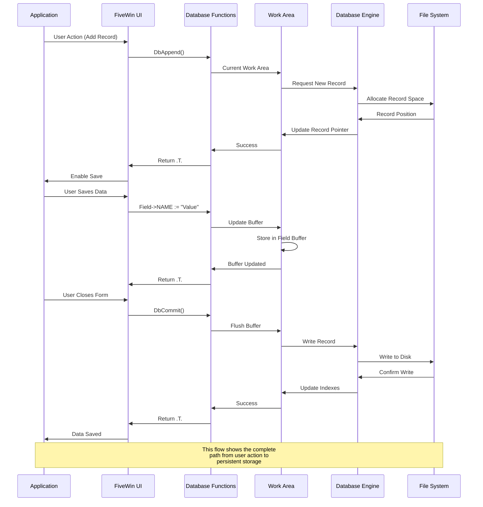
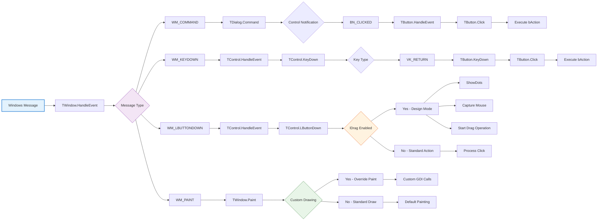
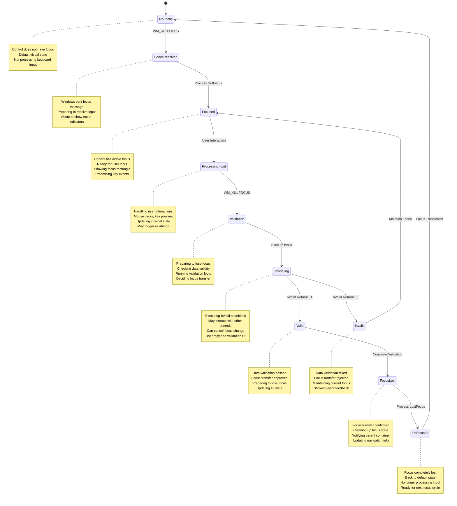
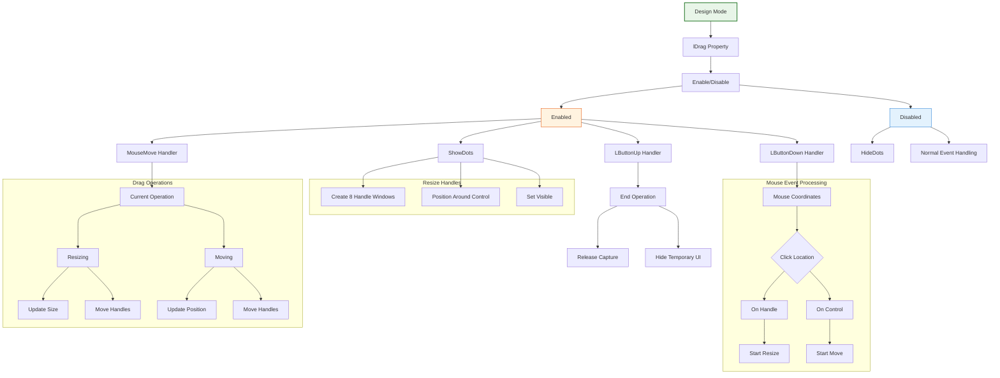
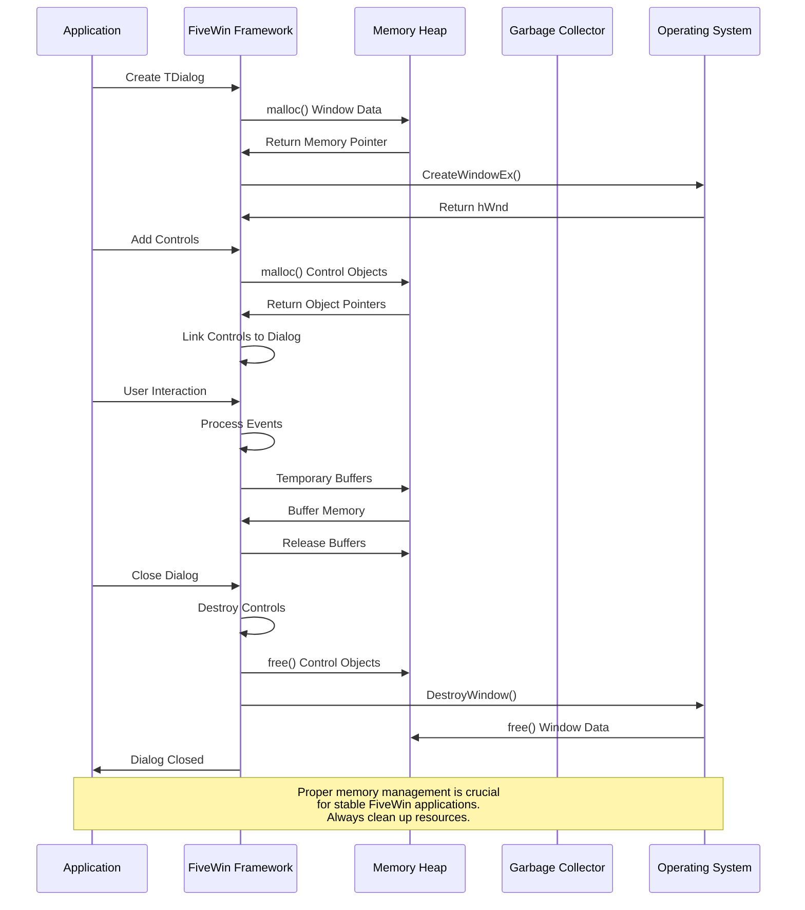

# Advanced FiveWin Interaction Diagrams

This document provides detailed Mermaid diagrams illustrating complex interactions within the FiveWin framework.

## Complete Application Lifecycle

```mermaid
graph TD
    A[Application Start] --> B[Initialize FiveWin]
    B --> C[Create Main Window]
    C --> D[TWindow.New()]
    D --> E[Create Window Handle]
    E --> F[WM_CREATE]
    F --> G[Initialize Components]
    G --> H[Show Window]
    H --> I[Message Loop Start]
    
    I --> J{Message Received}
    J --> K[WM_COMMAND]
    K --> L[Route to Dialog]
    L --> M[Dialog.Command()]
    M --> N[Process Control Event]
    N --> O[Execute bAction]
    
    J --> P[WM_KEYDOWN]
    P --> Q[Route to Control]
    Q --> R[TControl.KeyDown()]
    R --> S[Process Key]
    S --> T[Update Control State]
    
    J --> U[WM_LBUTTONDOWN]
    U --> V[Route to Control]
    V --> W[TControl.LButtonDown()]
    W --> X[Handle Mouse Event]
    X --> Y[Design Mode Logic]
    X --> Z[Standard Action]
    
    J --> AA[WM_PAINT]
    AA --> AB[Route to Component]
    AB --> AC[TWindow.Paint()]
    AC --> AD[Custom Drawing]
    AD --> AE[Windows GDI]
    
    I --> AF{Application End}
    AF --> AG[Close Windows]
    AG --> AH[TWindow.End()]
    AH --> AI[WM_DESTROY]
    AI --> AJ[Cleanup Resources]
    AJ --> AK[Application Exit]
    
    style A fill:#e8f5e8,stroke:#2e7d32,stroke-width:2px
    style I fill:#fff3e0,stroke:#e65100,stroke-width:2px
    style AF fill:#ffebee,stroke:#c62828,stroke-width:2px
```

## Database Integration Flow



## Event Propagation System



## Focus Management System



## Design Mode Architecture



## Multi-threading Considerations

```mermaid
graph LR
    A[Main Thread] --> B[UI Message Loop]
    B --> C[Process Windows Messages]
    C --> D[Route to FiveWin Objects]
    D --> E[Execute Methods]
    
    F[Background Thread] --> G[Database Operations]
    G --> H[File I/O]
    H --> I[Network Requests]
    I --> J[Long-running Tasks]
    
    J --> K{Thread Communication}
    K --> L[PostMessage]
    K --> M[Synchronize]
    K --> N[Thread-safe Queues]
    
    L --> B
    M --> O[Critical Sections]
    M --> P[Mutexes]
    N --> Q[Message Queue]
    Q --> B
    
    subgraph "Thread Safety"
        M
        O
        P
        N
        Q
    end
    
    note over A,F: FiveWin is primarily single-threaded<br/>UI applications but can integrate<br/>with background operations
    
    style A fill:#e8f5e8,stroke:#2e7d32,stroke-width:2px
    style F fill:#fff3e0,stroke:#e65100,stroke-width:2px
    style K fill:#e3f2fd,stroke:#1976d2,stroke-width:1px
```

## Memory Management Flow



These advanced diagrams illustrate the complex interactions and systems within FiveWin, providing a deeper understanding of how the framework operates and how different components interact with each other.