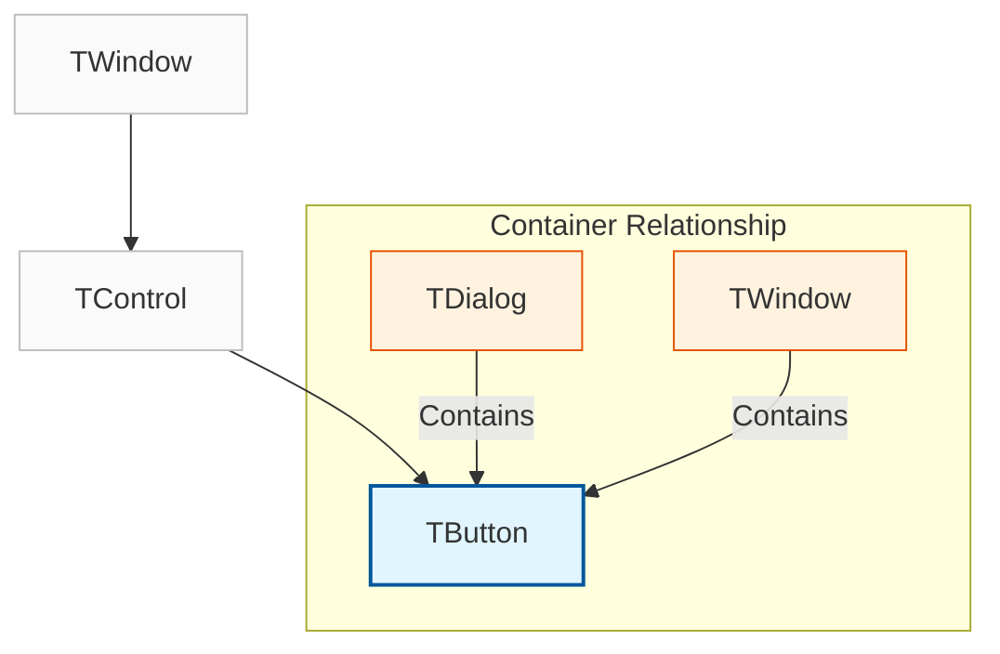
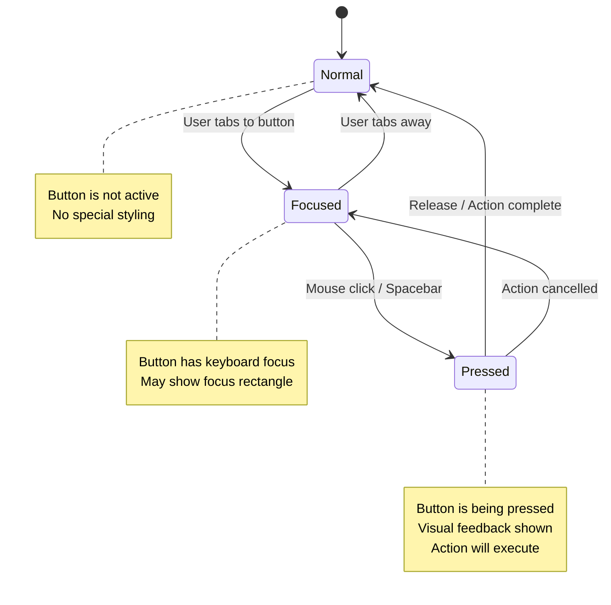
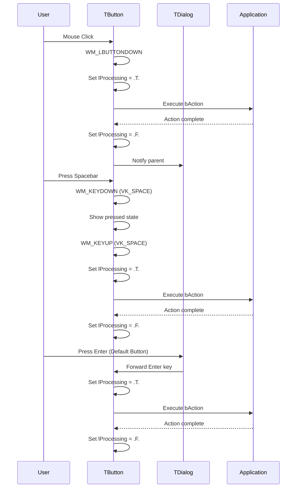

# TButton Class

The `TButton` class represents a standard Windows push button control that users can click to trigger actions in your application.

**Source File:** [source/classes/button.prg](../../../../source/classes/button.prg)

## Overview

The `TButton` class provides a comprehensive interface for creating and managing push button controls in FiveWin applications. As a subclass of `TControl`, it inherits all the standard control functionality while adding specialized behavior for button interactions.

Buttons are fundamental UI elements that allow users to initiate actions, make choices, and navigate through applications. The `TButton` class supports various button styles including standard push buttons, default buttons, and cancel buttons.

## Class Hierarchy



## Key Properties

| Property | Type | Description |
|----------|------|-------------|
| `bAction` | `Codeblock` | Code block executed when button is clicked |
| `lDefault` | `Logical` | If `.T.`, button is the default button (activated with Enter) |
| `lCancel` | `Logical` | If `.T.`, button is the cancel button (activated with Escape) |
| `lProcessing` | `Logical` | Internal flag to prevent reentrancy during click processing |
| `cCaption` | `String` | Text displayed on the button face |

## Key Methods

| Method | Description |
|--------|-------------|
| `New()` | Constructor for creating a new button instance |
| `ReDefine()` | Associates with an existing button control from dialog resources |
| `Click()` | Programmatically triggers the button's action |
| `KeyDown()` | Handles keyboard input for button activation |

## Button States and Behavior



## Event Flow



## Usage Patterns

### Basic Button Creation

```harbour
#include "FiveWin.ch"

function Main()
   local oDlg, oButton

   DEFINE DIALOG oDlg TITLE "Button Example" ;
      FROM 0, 0 TO 100, 200

   @ 20, 10 BUTTON oButton PROMPT "Click Me!" ;
      OF oDlg ;
      ACTION MsgInfo( "Button was clicked!" )

   ACTIVATE DIALOG oDlg CENTERED

return nil
```

### Default and Cancel Buttons

```harbour
#include "FiveWin.ch"

function Main()
   local oDlg, oOk, oCancel

   DEFINE DIALOG oDlg TITLE "Confirmation" ;
      FROM 0, 0 TO 120, 250

   @ 20, 10 SAY "Do you want to proceed?" OF oDlg

   // Default button (activated with Enter)
   @ 60, 10 BUTTON oOk PROMPT "&OK" ;
      OF oDlg ;
      ACTION ( oDlg:nResult := IDOK, oDlg:End() ) ;
      DEFAULT

   // Cancel button (activated with Escape)
   @ 60, 80 BUTTON oCancel PROMPT "&Cancel" ;
      OF oDlg ;
      ACTION ( oDlg:nResult := IDCANCEL, oDlg:End() ) ;
      CANCEL

   ACTIVATE DIALOG oDlg CENTERED

   if oDlg:nResult == IDOK
      MsgInfo( "User confirmed action" )
   else
      MsgInfo( "User cancelled action" )
   endif

return nil
```

### Button with Complex Actions

```harbour
#include "FiveWin.ch"

function Main()
   local oDlg, cName := Space(30)

   DEFINE DIALOG oDlg TITLE "User Registration" ;
      FROM 0, 0 TO 150, 300

   @ 10, 10 SAY "Name:" OF oDlg
   @ 10, 30 GET cName OF oDlg SIZE 100, 12

   @ 40, 10 BUTTON "Register" ;
      OF oDlg ;
      ACTION ( ValidateAndRegister( cName ), oDlg:End() )

   @ 40, 80 BUTTON "Cancel" ;
      OF oDlg ;
      ACTION oDlg:End()

   ACTIVATE DIALOG oDlg CENTERED

return nil

static function ValidateAndRegister( cName )
   if Empty( cName )
      MsgStop( "Please enter a name" )
      return .F.
   endif
   
   // Registration logic here
   MsgInfo( "Registered: " + AllTrim( cName ) )
return .T.
```

## Advanced Features

### Custom Button Styling

```harbour
#include "FiveWin.ch"

function Main()
   local oDlg, oButton

   DEFINE DIALOG oDlg TITLE "Styled Button" ;
      FROM 0, 0 TO 100, 200

   @ 20, 10 BUTTON oButton PROMPT "Styled Button" ;
      OF oDlg ;
      ACTION MsgInfo( "Custom styled button clicked!" )

   // Apply custom colors
   oButton:SetColor( CLR_WHITE, CLR_BLUE )

   ACTIVATE DIALOG oDlg CENTERED

return nil
```

### Button with Validation

```harbour
#include "FiveWin.ch"

function Main()
   local oDlg, oSubmit
   local cEmail := Space(50)

   DEFINE DIALOG oDlg TITLE "Email Form" ;
      FROM 0, 0 TO 120, 300

   @ 10, 10 SAY "Email:" OF oDlg
   @ 10, 30 GET cEmail OF oDlg SIZE 150, 12

   @ 50, 10 BUTTON oSubmit PROMPT "Submit" ;
      OF oDlg ;
      ACTION ( ValidateEmail( cEmail ), ProcessSubmission() )

   ACTIVATE DIALOG oDlg CENTERED

return nil

static function ValidateEmail( cEmail )
   local isValid := .F.
   
   // Simple email validation
   isValid = ( At( "@", cEmail ) > 1 .and. ;
               At( ".", cEmail ) > At( "@", cEmail ) )
   
   if !isValid
      MsgStop( "Please enter a valid email address" )
   endif
   
return isValid

static function ProcessSubmission()
   MsgInfo( "Form submitted successfully!" )
return nil
```

## Related Components

* [TControl Class](TControl.md) - Base control class that TButton inherits from
* [TDialog Class](TDialog.md) - Common container for button controls
* [TEdit Class](TEdit.md) - Text input control that often works with buttons

## Windows API References

* [Button Control Documentation](https://docs.microsoft.com/en-us/windows/win32/controls/buttons)
* [Button Styles](https://docs.microsoft.com/en-us/windows/win32/controls/button-styles)
* [BM_* Messages](https://docs.microsoft.com/en-us/windows/win32/controls/bm-messages)

## Best Practices

1. **Use Descriptive Captions**: Button text should clearly indicate the action that will occur
2. **Provide Keyboard Access**: Use mnemonics (e.g., "&OK") for keyboard navigation
3. **Implement Default/Cancel**: Use `DEFAULT` and `CANCEL` keywords for standard dialog behavior
4. **Handle Validation**: Perform validation in button actions before proceeding
5. **Prevent Reentrancy**: The `lProcessing` flag helps prevent multiple rapid clicks
6. **Use Appropriate Sizing**: Ensure buttons are large enough for touch interfaces
7. **Maintain Consistency**: Follow platform conventions for button placement and styling

## Performance Considerations

* Button creation is lightweight but should still be done efficiently
* Complex `bAction` code blocks can impact responsiveness
* Consider using separate functions for complex actions rather than inline code blocks
* The `lProcessing` flag helps prevent performance issues from rapid repeated clicks