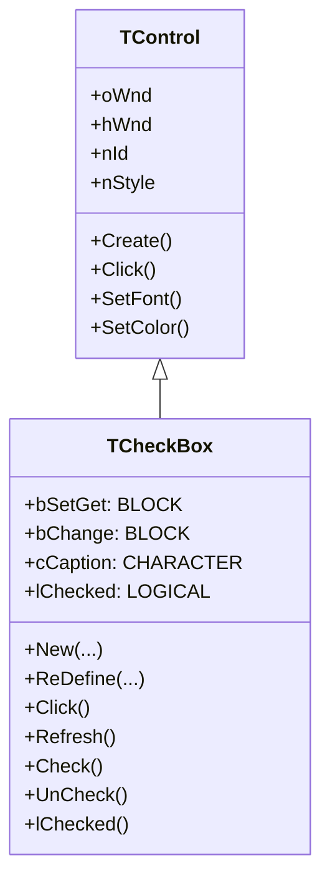
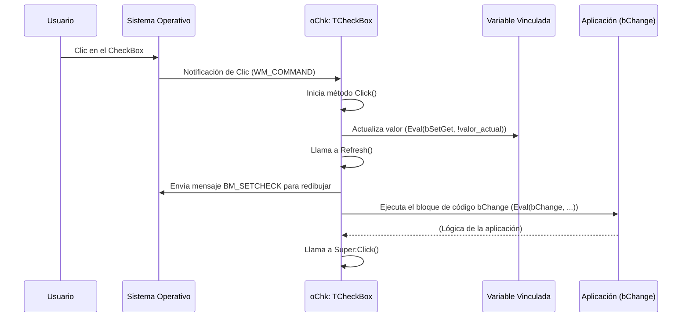

# Análisis del archivo: checkbox.prg

## 1. Descripción general del archivo

El archivo `checkbox.prg` define la clase `TCheckBox`, que encapsula la funcionalidad de un control de casilla de verificación (checkbox) en la biblioteca de interfaz gráfica FiveWin para Harbour/xHarbour. Esta clase hereda de `TControl`, la clase base para todos los controles visuales, y proporciona los métodos y propiedades necesarios para crear, manipular y gestionar un control de checkbox en una ventana.

El lenguaje de programación utilizado es **Harbour**, un compilador compatible con Clipper que soporta extensiones orientadas a objetos.

## 2. Explicación línea por línea

```harbour
#include "FiveWin.ch"
#include "Constant.ch"
```
- **Líneas 1-2**: Inclusión de archivos de cabecera. `FiveWin.ch` contiene las definiciones principales de la biblioteca FiveWin, y `Constant.ch` define varias constantes, como los códigos de teclas (`VK_*`) y estilos de ventana (`WS_*`).

```harbour
#define BM_SETCHECK   241
#define CB_RESETCONTENT   ( WM_USER + 11 )
#define GWL_EXSTYLE       (-20)
```
- **Líneas 4-6**: Definición de constantes específicas de la API de Windows que no están en `Constant.ch`. `BM_SETCHECK` es el mensaje para marcar o desmarcar un botón (como un checkbox).

```harbour
CLASS TCheckBox FROM TControl
```
- **Línea 10**: Se define la clase `TCheckBox`, que hereda de `TControl`.

```harbour
   CLASSDATA aProperties INIT { ... }
```
- **Líneas 12-13**: `aProperties` es una propiedad de clase (estática) que contiene una lista de nombres de propiedades. Esta lista se usa probablemente para funcionalidades de introspección o serialización, como un diseñador de formularios.

```harbour
   METHOD New(...) CONSTRUCTOR
   METHOD ReDefine(...) CONSTRUCTOR
```
- **Líneas 15-19**: Se declaran dos constructores. `New` se usa para crear un checkbox dinámicamente en tiempo de ejecución, mientras que `ReDefine` se usa para asociar un objeto `TCheckBox` a un control ya definido en un recurso de diálogo (RC).

```harbour
   METHOD Click()
   METHOD Refresh()
   METHOD Check()
   METHOD UnCheck()
   METHOD SetCheck( lOnOff )
   METHOD lChecked()
```
- **Líneas 21, 41, 51, 53, 57, 61**: Métodos para gestionar el estado del checkbox. `Click` maneja el evento de clic, `Refresh` actualiza su estado visual, `Check`/`UnCheck` lo marcan/desmarcan, `SetCheck` establece su estado y `lChecked` devuelve si está marcado o no.

```harbour
   METHOD cToChar() INLINE ::Super:cToChar( "BUTTON" )
```
- **Línea 25**: Este método devuelve una representación en cadena de la clase de ventana de Windows para este control, que es `"BUTTON"`.

```harbour
   METHOD EraseBkGnd( hDC )
```
- **Línea 27**: Maneja el mensaje `WM_ERASEBKGND` para el borrado del fondo, especialmente para soportar temas visuales de Windows.

```harbour
   METHOD KeyChar( nKey, nFlags )
   METHOD KeyDown( nKey, nFlags )
```
- **Líneas 29, 31**: Métodos para manejar eventos de teclado. `KeyChar` se dispara cuando se presiona una tecla de carácter, y `KeyDown` cuando se presiona cualquier tecla.

```harbour
   METHOD GenLocals()
   METHOD cGenPrg()
   METHOD SaveToRC( nIndent )
```
- **Líneas 47, 49, 55**: Métodos utilizados por el diseñador de formularios para generar código fuente (`.prg`) o definiciones de recursos (`.rc`) que representan el control.

```harbour
METHOD New(...) CLASS TCheckBox
   ...
   ::nStyle = nOR( WS_CHILD, WS_VISIBLE, BS_AUTOCHECKBOX, WS_TABSTOP, ... )
   ...
   ::Create( "BUTTON" )
   ...
```
- **Líneas 77-132**: Implementación del constructor `New`. 
    - Establece valores por defecto para los parámetros.
    - Calcula las coordenadas y el tamaño.
    - Define el estilo (`::nStyle`) del control. `BS_AUTOCHECKBOX` es clave, ya que hace que Windows gestione automáticamente el cambio de estado del checkbox cuando el usuario hace clic en él.
    - Llama a `::Create("BUTTON")` para crear el control de ventana de Windows.
    - Añade el control a la lista de controles de la ventana contenedora (`oWnd`).

```harbour
METHOD Click() CLASS TCheckBox
   Eval( ::bSetGet, ! Eval( ::bSetGet ) )
   ::Refresh()
   if ::bChange != nil
      Eval( ::bChange, Eval( ::bSetGet ), Self )
   endif
   ::Super:Click()
```
- **Líneas 136-146**: Implementación del método `Click`.
    - `Eval( ::bSetGet, ! Eval( ::bSetGet ) )`: Invierte el valor lógico de la variable asociada al checkbox. `bSetGet` es un bloque de código que actúa como *getter* y *setter*.
    - `::Refresh()`: Envía el mensaje `BM_SETCHECK` para actualizar visualmente el control.
    - `Eval( ::bChange, ... )`: Si se ha definido un bloque de código `bChange`, se ejecuta para notificar que el valor ha cambiado.
    - `::Super:Click()`: Llama al método `Click` de la clase padre (`TControl`).

```harbour
METHOD KeyDown(...) CLASS TCheckBox
   do case
      case nKey == VK_UP
         ::oWnd:GoPrevCtrl( ::hWnd )
      case nKey == VK_DOWN
         ::oWnd:GoNextCtrl( ::hWnd )
   endcase
```
- **Líneas 198-208**: Implementación de `KeyDown`. Permite la navegación entre controles usando las teclas de flecha arriba y abajo, moviendo el foco al control anterior o siguiente en la ventana.

## 3. Funcionalidad principal

La clase `TCheckBox` proporciona una abstracción orientada a objetos sobre el control de checkbox nativo de Windows. Su funcionalidad principal incluye:

- **Creación y Configuración**: Permite crear un checkbox en una ventana, especificando su posición, tamaño, texto (caption) y la variable lógica que controlará.
- **Vinculación de Datos (Data Binding)**: A través de la propiedad `bSetGet`, el estado del checkbox (marcado/desmarcado) se vincula directamente a una variable del programa. Cuando el usuario hace clic en el checkbox, la variable se actualiza automáticamente, y viceversa.
- **Manejo de Eventos**: Proporciona ganchos (hooks) para responder a eventos, como `bChange` (cuando el valor cambia) y `bWhen` (antes de que el control se active).
- **Navegación por Teclado**: Implementa una navegación intuitiva entre controles usando las teclas de flecha.
- **Soporte para Diseñador Visual**: Incluye métodos (`cGenPrg`, `SaveToRC`) que permiten a una herramienta de diseño visual generar el código o los recursos necesarios para recrear el control.
- **Personalización Visual**: Permite cambiar los colores de texto y fondo, así como la fuente.

## 4. Diagramas Mermaid

### Diagrama de Clases (Class Diagram)



### Diagrama de Flujo del Constructor `New()`

```mermaid
flowchart TD
    A[Inicio: New(...)] --> B{Establecer valores por defecto para parámetros};
    B --> C{¿La variable de control no es lógica?};
    C -- Sí --> D[Inicializarla a .F.];
    C -- No --> E[Calcular coordenadas y tamaño];
    D --> E;
    E --> F{Definir estilo del control (WS_*, BS_AUTOCHECKBOX)};
    F --> G{Asignar propiedades (ID, bSetGet, bChange, etc.)};
    G --> H{¿La ventana contenedora (oWnd) ya existe?};
    H -- Sí --> I[Crear control de ventana con ::Create("BUTTON")];
    I --> J[Añadir control a la ventana con oWnd:AddControl(Self)];
    H -- No --> K[Definir control para creación posterior con oWnd:DefControl(Self)];
    J --> L{Asignar nombre de variable (cVarName)};
    K --> L;
    L --> M[Fin: Devolver Self];
```

### Diagrama de Secuencia de un Clic de Usuario



## 5. Relaciones con otros módulos

- **Dependencias**:
    - **`TControl` (clase base)**: `TCheckBox` hereda una gran parte de su funcionalidad de `TControl`, como el manejo del `hWnd` (handle de ventana), la creación básica del control, el manejo de fuentes y colores, y la interacción con la ventana contenedora.
    - **`TWindow` (a través de `oWnd`)**: El checkbox está contenido dentro de un objeto `TWindow` (o una de sus clases derivadas). Interactúa constantemente con él para registrarse (`AddControl`), para la navegación (`GoNextCtrl`, `GoPrevCtrl`) y para obtener propiedades por defecto (colores, fuente).
    - **`FiveWin.ch` y `Constant.ch`**: Proporcionan las constantes y funciones de bajo nivel de la API de Windows necesarias para crear y manipular el control.
    - **Funciones del compilador Harbour**: Utiliza `Eval()` para ejecutar bloques de código (`bSetGet`, `bChange`), `ValType()` para introspección de tipos, y otras funciones intrínsecas del lenguaje.

- **Módulos que lo llaman**:
    - Cualquier programa (`.prg`) que defina una interfaz de usuario con checkboxes creará instancias de `TCheckBox`. Por ejemplo, un diálogo de configuración, un formulario de entrada de datos, etc.
    - Un **diseñador de formularios** (si existe en el proyecto) llamaría a los métodos `cGenPrg()` y `SaveToRC()` para generar código a partir de una representación visual del checkbox.

- **Módulos que él llama**:
    - Llama a funciones de la **API de Windows** (a través de las envolturas de FiveWin/Harbour) como `CreateWindowEx`, `SendMessage`, `SetWindowText`, etc., para realizar las operaciones a bajo nivel.
    - Llama a métodos de su objeto contenedor `oWnd` (de clase `TWindow`) para integrarse en la jerarquía de controles de la ventana.

- **Integración en la arquitectura**:
    - `TCheckBox` es un componente fundamental del framework de UI. Se integra en el modelo de composición de `TWindow`, que gestiona un array de controles (`aControls`). El bucle de mensajes principal de la aplicación despacha los eventos a la ventana `TWindow` correspondiente, la cual a su vez los delega al `TCheckBox` apropiado si el evento le concierne (por ejemplo, un clic dentro de sus límites).
