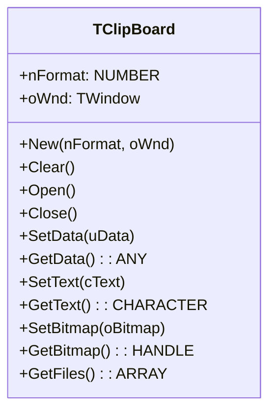
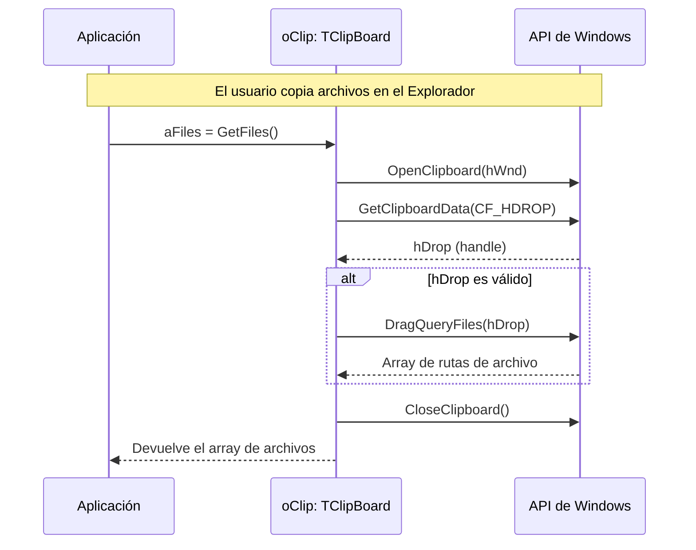

# Análisis del archivo: clipbrd.prg

## 1. Descripción general del archivo

El archivo `clipbrd.prg` implementa la clase `TClipBoard`, una abstracción orientada a objetos para interactuar con el portapapeles del sistema operativo Windows. Está escrito en **Harbour** y utiliza la biblioteca FiveWin para acceder a las funciones de la API de Windows. La clase facilita operaciones comunes como copiar y pegar diferentes formatos de datos, como texto (ANSI y Unicode), mapas de bits (bitmaps), metarchivos (metafiles) y listas de archivos.

## 2. Explicación línea por línea

```harbour
#include "FiveWin.ch"
```
- **Línea 1**: Incluye el archivo de cabecera principal de FiveWin, que contiene las definiciones de funciones y constantes de la API de Windows.

```harbour
#define CF_TEXT              1
#define CF_BITMAP            2
// ... (y otros formatos estándar del portapapeles)
#define CF_HDROP            15
```
- **Líneas 3-18**: Se definen constantes numéricas que representan los formatos estándar del portapapeles de Windows (`CF_*`). Estos valores son cruciales para especificar qué tipo de dato se está escribiendo o leyendo.

```harbour
CLASS TClipBoard
   DATA   nFormat, oWnd
```
- **Líneas 22-23**: Se define la clase `TClipBoard` con dos propiedades:
    - `nFormat`: El formato de datos por defecto con el que trabajará el objeto (ej. `CF_TEXT`).
    - `oWnd`: Una referencia al objeto ventana que "posee" el portapapeles. Es necesario para las funciones `OpenClipboard`.

```harbour
   METHOD New( nFormat, oWnd ) CONSTRUCTOR
```
- **Línea 25**: El constructor, que inicializa las propiedades `nFormat` y `oWnd`.

```harbour
   METHOD Clear()   INLINE  ::Open(), ::Empty(), ::Close()
   METHOD Open()    INLINE  OpenClipboard( ... )
   METHOD Empty()   INLINE  EmptyClipboard()
   METHOD Close()   INLINE  CloseClipboard()
```
- **Líneas 27-30**: Métodos `INLINE` para las operaciones básicas del portapapeles. El patrón es siempre: 1) Abrir, 2) Realizar operación, 3) Cerrar.
    - `Open()`: Llama a `OpenClipboard`, dando a la aplicación acceso exclusivo al portapapeles.
    - `Empty()`: Llama a `EmptyClipboard` para borrar el contenido actual.
    - `Close()`: Llama a `CloseClipboard` para liberar el portapapeles.
    - `Clear()`: Encadena las tres operaciones para limpiar el portapapeles de forma segura.

```harbour
   METHOD SetData( uData ) INLINE  SetClipboardData( ::nFormat, uData )
   METHOD GetData()        INLINE  GetClpData( ::nFormat )
```
- **Líneas 34, 36**: Métodos genéricos para escribir (`SetData`) y leer (`GetData`) datos en el formato especificado por `::nFormat`.

```harbour
   METHOD SetText( cText )
   METHOD SetWideText( cText )
   METHOD GetText()
   METHOD GetUnicodeText()
```
- **Líneas 38, 40, 50, 54**: Métodos especializados para manejar texto. `SetText` es inteligente y detecta si el texto es UTF-8 para guardarlo como `CF_UNICODETEXT`; de lo contrario, lo guarda como `CF_TEXT`. `GetText` hace la operación inversa.

```harbour
   METHOD GetFiles()
```
- **Línea 52**: Método para obtener una lista de nombres de archivos copiados al portapapeles (formato `CF_HDROP`), por ejemplo, desde el Explorador de Windows.

```harbour
   ACCESS lUnicode INLINE If( Empty( ::ownd ), FW_SetUnicode(), ::oWnd:lUnicode )
```
- **Línea 58**: Una propiedad de acceso (`ACCESS`) que determina si la aplicación está en modo Unicode, basándose en la configuración de la ventana asociada (`oWnd`).

```harbour
METHOD SetText( cText ) CLASS TClipBoard
   if ::Open()
      EmptyClipboard()
      if FW_IsUTF8( cText )
         cText    := utf8toutf16( cText )
         // ... se asegura de que termine en doble nulo
         lResult = SetClipboardData( CF_UNICODETEXT, cText )
      else
         lResult = SetClipboardData( CF_TEXT, cText )
      endif
      lResult := ::Close() .and. lResult
   endif
```
- **Líneas 90-105**: Implementación de `SetText`. Abre el portapapeles, lo vacía, y luego comprueba si la cadena de entrada es UTF-8. Si lo es, la convierte a UTF-16 (el formato nativo de Unicode en Windows) y la establece usando `CF_UNICODETEXT`. Si no, la establece como texto plano ANSI (`CF_TEXT`). Finalmente, cierra el portapapeles.

```harbour
METHOD GetFiles() CLASS TClipBoard
   local aFiles   := {}
   if ::Open()
      hDrop    := GetClpData( CF_HDROP )
      if !Empty( hDrop )
         aFiles   := DragQueryFiles( hDrop )
      endif
      ::Close()
   endif
return aFiles
```
- **Líneas 168-180**: Implementación de `GetFiles`. Abre el portapapeles, solicita los datos en formato `CF_HDROP` (que devuelve un handle a una estructura de datos de archivos). Si el handle es válido, llama a la función `DragQueryFiles` (una función de la API de Windows) para extraer la lista de rutas de archivo en un array.

```harbour
#pragma BEGINDUMP
#include <windows.h>
#include <hbapi.h>
HB_FUNC_STATIC (ISTEXT8BIT) // ( cString )
{ ... }
#pragma ENDDUMP
```
- **Líneas 230-249**: Esta sección contiene código C embebido directamente en el archivo `.prg`. La función `ISTEXT8BIT` es una función auxiliar escrita en C que se compila junto con el código Harbour. Su propósito es examinar una cadena de bytes y determinar si es texto ANSI de 8 bits o si podría ser una cadena Unicode (UTF-16), comprobando los bytes nulos en posiciones alternas. Se usa en `GetUnicodeText` para decidir si es necesario convertir el formato.

## 3. Funcionalidad principal

La clase `TClipBoard` abstrae la complejidad de la API del portapapeles de Windows en un objeto fácil de usar. Su flujo de trabajo típico es:

1.  **Crear una instancia**: `oClip := TClipBoard():New()`.
2.  **Escribir datos**: Llamar a un método `Set...`, como `oClip:SetText("Hola")` o `oClip:SetBitmap(oBitmap)`. Estos métodos se encargan de abrir el portapapeles, limpiarlo, establecer los datos en el formato correcto y cerrarlo.
3.  **Leer datos**: Llamar a un método `Get...`, como `cTexto := oClip:GetText()` o `aArchivos := oClip:GetFiles()`. Estos métodos abren el portapapeles, leen los datos en el formato solicitado, los convierten a un tipo de Harbour conveniente (como cadena o array) y cierran el portapapeles.

La clase maneja de forma transparente la conversión entre formatos de texto (ANSI/UTF-8/UTF-16) y la extracción de diferentes tipos de datos, simplificando enormemente el trabajo del programador.

## 4. Diagramas Mermaid

### Diagrama de Clases (Class Diagram)



### Diagrama de Flujo para `SetText()`

```mermaid
flowchart TD
    A[Inicio: SetText(cText)] --> B{Llamar a ::Open() para bloquear el portapapeles};
    B -- Éxito --> C{Llamar a EmptyClipboard() para borrar contenido anterior};
    C --> D{¿El texto es UTF-8? (FW_IsUTF8)};
    D -- Sí --> E[Convertir texto de UTF-8 a UTF-16];
    E --> F[Asegurar que la cadena termina en doble nulo];
    F --> G[Llamar a SetClipboardData(CF_UNICODETEXT, ...)];
    D -- No --> H[Llamar a SetClipboardData(CF_TEXT, ...)];
    G --> I{Llamar a ::Close() para liberar el portapapeles};
    H --> I;
    B -- Fallo --> J[Fin con error];
    I --> K[Fin];
```

### Diagrama de Secuencia para Copiar y Pegar Archivos



## 5. Relaciones con otros módulos

- **Dependencias**:
    - **`FiveWin.ch`**: Es la dependencia principal. Proporciona las envolturas de Harbour para las funciones de la API de Windows relacionadas con el portapapeles (`OpenClipboard`, `CloseClipboard`, `SetClipboardData`, `GetClipboardData`, `DragQueryFiles`).
    - **`TWindow`**: La clase `TClipBoard` necesita una referencia a un objeto `TWindow` (`oWnd`) para poder llamar a `OpenClipboard`, ya que esta función de la API requiere un handle de ventana (`hWnd`).
    - **Funciones de conversión de cadenas**: Utiliza funciones como `FW_IsUTF8`, `utf8toutf16`, y `UTF16TOUTF8` para manejar la codificación de texto, que probablemente se encuentren en otro módulo de utilidades de FiveWin.
    - **Código C embebido**: El archivo contiene una función C (`ISTEXT8BIT`) que se compila directamente. Esto crea una dependencia con el compilador de C y las librerías de Harbour (`hbapi.h`).

- **Módulos que lo llaman**:
    - Cualquier módulo de la aplicación que implemente funciones de **Copiar/Pegar**. Por ejemplo:
        - Un editor de texto llamaría a `oClip:SetText()` y `oClip:GetText()`.
        - Un visor de imágenes llamaría a `oClip:SetBitmap()` y `oClip:GetBitmap()`.
        - Un gestor de archivos o una función de "arrastrar y soltar" podría usar `oClip:GetFiles()`.

- **Módulos que él llama**:
    - No llama a otros módulos de la aplicación directamente. Su única interacción es con las **funciones de la API de Windows** a través de las envolturas proporcionadas por FiveWin.

- **Integración en la arquitectura**:
    - `TClipBoard` es una clase de utilidad o de servicio. No es un componente visual, sino una herramienta que los componentes visuales (como `TEdit`, `TSay`) o la lógica de la aplicación pueden usar para interactuar con un recurso global del sistema operativo (el portapapeles). Su diseño encapsula una funcionalidad de bajo nivel, haciendo que el resto del código sea más limpio y fácil de mantener.
