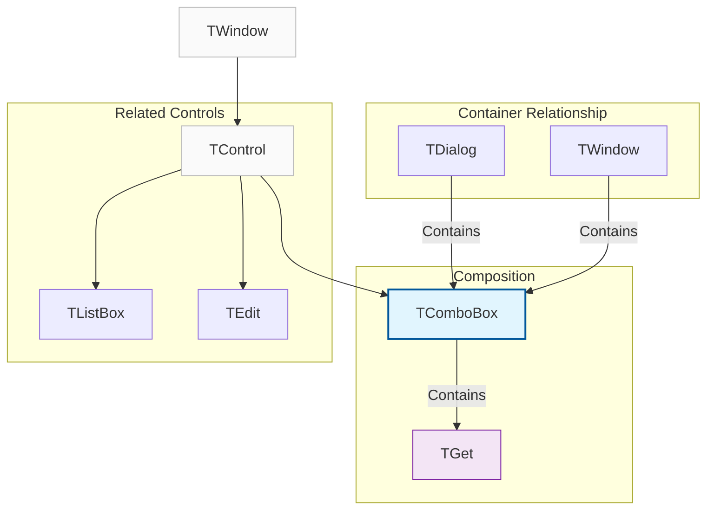
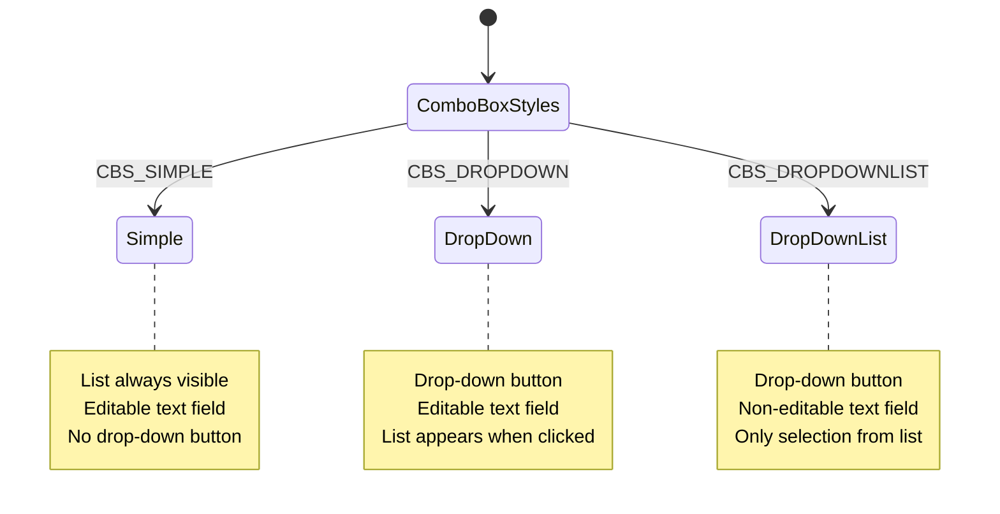
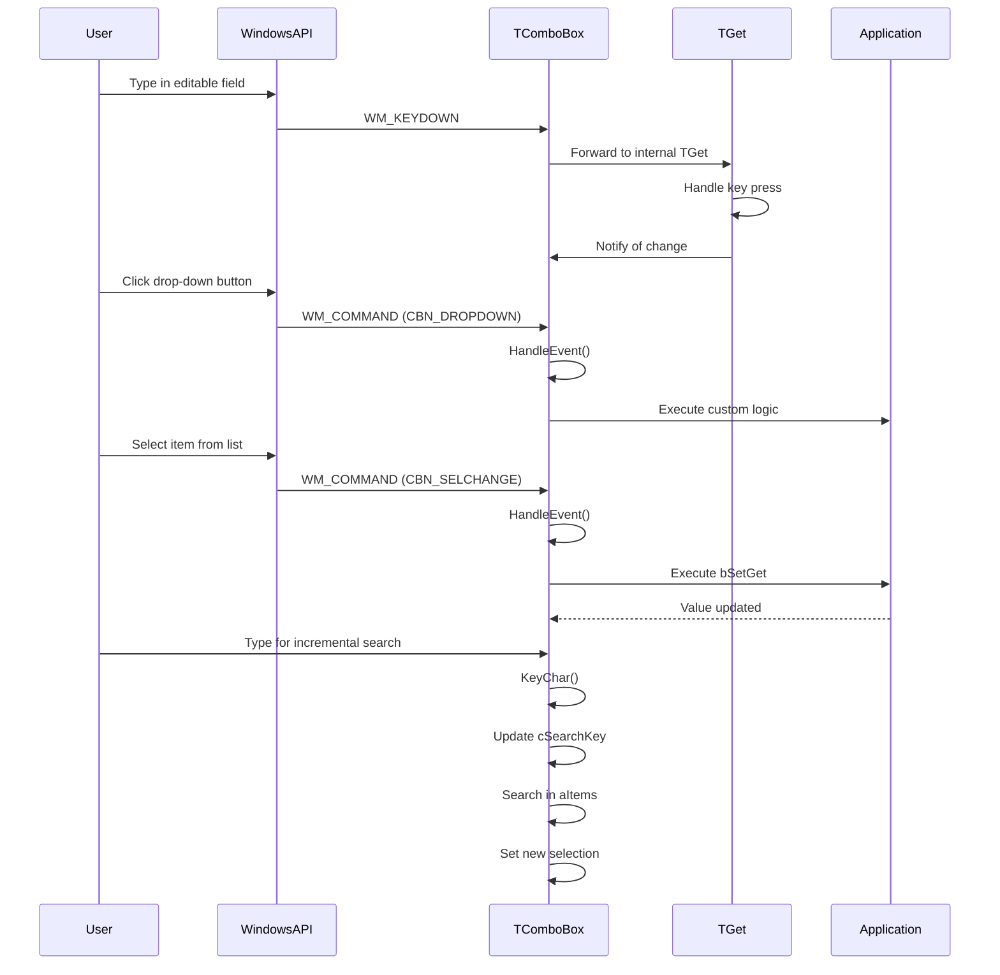

# TComboBox Class

The `TComboBox` class provides a comprehensive implementation of a combo box control that combines a drop-down list with an editable text field. It offers advanced functionality including data binding, incremental search, custom drawing, and sophisticated event handling.

**Source File:** [source/classes/combobox.prg](../../../source/classes/combobox.prg)

## Overview

The `TComboBox` class encapsulates the Windows ComboBox native control, providing a high-level interface for manipulation. As a subclass of `TControl`, it inherits all standard control functionality while adding specialized behavior for combo box interactions.

Combo boxes are versatile UI controls that allow users to either select from a predefined list of options or enter custom values. They support multiple styles including simple drop-down lists, editable combo boxes, and forced selection lists.

## Class Hierarchy



## Combo Box Styles



## Key Properties

| Property | Type | Description |
|----------|------|-------------|
| `aItems` | `Array` | Array of strings representing combo box items |
| `aBitmaps` | `Array` | Array of bitmap handles for owner-draw items |
| `nValue` | `Numeric` | Index of currently selected item |
| `bSetGet` | `Codeblock` | Data binding mechanism for value synchronization |
| `lOwnerDraw` | `Logical` | If `.T.`, enables custom item drawing |
| `lIncSearch` | `Logical` | If `.T.`, enables incremental search functionality |
| `cSearchKey` | `String` | Current search string for incremental search |
| `bDrawItem` | `Codeblock` | Custom drawing function for items |
| `oGet` | `TGet` | Internal TGet object for editable portion |

## Key Methods

| Method | Description |
|--------|-------------|
| `New()` | Constructor for creating a new combo box |
| `ReDefine()` | Associates with existing combo box from dialog resources |
| `Add(cItem, nAt)` | Adds an item at specified position |
| `Del(nAt)` | Deletes item at specified position |
| `Insert(cItem, nAt)` | Inserts an item at specified position |
| `Modify(cItem, nAt)` | Modifies item at specified position |
| `Set(cNewItem)` | Sets the current selection |
| `Get()` | Gets the current selection |
| `Clear()` | Removes all items from combo box |
| `Find(cItem)` | Finds index of specified item |

## Event Processing Flow



## Usage Patterns

### Basic Drop-Down Combo Box

```harbour
#include "FiveWin.ch"

function Main()
   local oDlg, oComboBox
   local aCountries := { "USA", "Canada", "Mexico", "Brazil", "Argentina" }
   local cSelection := "USA"

   DEFINE DIALOG oDlg TITLE "Country Selector" ;
      FROM 0, 0 TO 150, 300

   @ 10, 10 SAY "Select a country:" OF oDlg

   @ 30, 10 COMBOBOX oComboBox ;
      VAR cSelection ;
      ITEMS aCountries ;
      OF oDlg ;
      SIZE 150, 100 ;
      ON CHANGE MsgInfo( "Selected: " + cSelection )

   @ 70, 10 BUTTON "Show Selection" OF oDlg ;
      ACTION MsgInfo( "Current selection: " + cSelection )

   @ 70, 80 BUTTON "Close" OF oDlg ;
      ACTION oDlg:End()

   ACTIVATE DIALOG oDlg CENTERED

return nil
```

### Drop-Down List (Forced Selection)

```harbour
#include "FiveWin.ch"

function Main()
   local oDlg, oComboBox
   local aStates := { "New York", "California", "Texas", "Florida", "Illinois" }
   local nSelection := 1

   DEFINE DIALOG oDlg TITLE "State Selector" ;
      FROM 0, 0 TO 150, 300

   @ 10, 10 SAY "Select a state:" OF oDlg

   @ 30, 10 COMBOBOX oComboBox ;
      VAR nSelection ;
      ITEMS aStates ;
      OF oDlg ;
      SIZE 150, 100 ;
      DROPDOWNLIST ;
      ON CHANGE MsgInfo( "Selected: " + aStates[nSelection] )

   @ 70, 10 BUTTON "Show Selection" OF oDlg ;
      ACTION MsgInfo( "Current selection: " + aStates[nSelection] )

   @ 70, 80 BUTTON "Close" OF oDlg ;
      ACTION oDlg:End()

   ACTIVATE DIALOG oDlg CENTERED

return nil
```

### Dynamic Combo Box Management

```harbour
#include "FiveWin.ch"

function Main()
   local oDlg, oComboBox
   local aProducts := { "Laptop", "Desktop", "Tablet", "Smartphone" }

   DEFINE DIALOG oDlg TITLE "Product Manager" ;
      FROM 0, 0 TO 250, 350

   @ 10, 10 SAY "Product List:" OF oDlg

   @ 30, 10 COMBOBOX oComboBox ;
      ITEMS aProducts ;
      OF oDlg ;
      SIZE 150, 100

   @ 60, 10 EDIT oEdit OF oDlg SIZE 150, 12

   @ 80, 10 BUTTON "Add Product" OF oDlg ;
      ACTION AddProduct( oComboBox, oEdit )

   @ 80, 80 BUTTON "Remove Product" OF oDlg ;
      ACTION RemoveProduct( oComboBox )

   @ 80, 150 BUTTON "Clear All" OF oDlg ;
      ACTION ( oComboBox:Clear(), MsgInfo( "All products cleared" ) )

   @ 120, 10 BUTTON "Sort Items" OF oDlg ;
      ACTION SortProducts( oComboBox )

   @ 120, 80 BUTTON "Close" OF oDlg ;
      ACTION oDlg:End()

   ACTIVATE DIALOG oDlg CENTERED

return nil

static function AddProduct( oComboBox, oEdit )
   local cProduct := AllTrim( oEdit:VarGet() )
   
   if Empty( cProduct )
      MsgAlert( "Please enter a product name" )
      return .F.
   endif
   
   oComboBox:Add( cProduct )
   oEdit:VarPut( "" )
   MsgInfo( "Product added: " + cProduct )
return .T.

static function RemoveProduct( oComboBox )
   local nIndex := oComboBox:nValue
   
   if nIndex <= 0
      MsgAlert( "Please select a product to remove" )
      return .F.
   endif
   
   local cProduct := oComboBox:GetItem( nIndex )
   oComboBox:Del( nIndex )
   MsgInfo( "Product removed: " + cProduct )
return .T.

static function SortProducts( oComboBox )
   local aItems := oComboBox:aItems
   ASort( aItems )
   oComboBox:SetItems( aItems )
   MsgInfo( "Products sorted alphabetically" )
return nil
```

### Incremental Search Combo Box

```harbour
#include "FiveWin.ch"

function Main()
   local oDlg, oComboBox
   local aCities := { "New York", "Los Angeles", "Chicago", "Houston", "Phoenix", ;
                     "Philadelphia", "San Antonio", "San Diego", "Dallas", "San Jose" }

   DEFINE DIALOG oDlg TITLE "City Finder" ;
      FROM 0, 0 TO 150, 300

   @ 10, 10 SAY "Select a city (type to search):" OF oDlg

   @ 30, 10 COMBOBOX oComboBox ;
      ITEMS aCities ;
      OF oDlg ;
      SIZE 150, 100 ;
      INCSEARCH ;
      ON CHANGE MsgInfo( "Selected: " + oComboBox:Get() )

   @ 70, 10 BUTTON "Close" OF oDlg ;
      ACTION oDlg:End()

   ACTIVATE DIALOG oDlg CENTERED

return nil
```

## Advanced Features

### Owner-Draw Combo Box with Images

```harbour
#include "FiveWin.ch"

function Main()
   local oDlg, oComboBox
   local aItems := { "Error", "Warning", "Info", "Success" }
   local aBitmaps := { LoadBitmap( "error.bmp" ), LoadBitmap( "warning.bmp" ), ;
                      LoadBitmap( "info.bmp" ), LoadBitmap( "success.bmp" ) }

   DEFINE DIALOG oDlg TITLE "Owner-Draw ComboBox" ;
      FROM 0, 0 TO 150, 300

   @ 10, 10 SAY "Select with images:" OF oDlg

   @ 30, 10 COMBOBOX oComboBox ;
      ITEMS aItems ;
      OF oDlg ;
      SIZE 150, 100 ;
      OWNERDRAW ;
      BITMAPS aBitmaps ;
      ON DRAW DrawComboBoxItem

   @ 70, 10 BUTTON "Close" OF oDlg ;
      ACTION oDlg:End()

   ACTIVATE DIALOG oDlg CENTERED

return nil

static function DrawComboBoxItem( oComboBox, hDC, nItem, nState, aRect )
   local cText := oComboBox:GetItem( nItem )
   local hBitmap := oComboBox:aBitmaps[ nItem ]
   
   // Draw background
   if HB_BITAND( nState, ODS_SELECTED ) != 0
      FillRect( hDC, aRect[1], aRect[2], aRect[3], aRect[4], RGB( 200, 200, 200 ) )
   else
      FillRect( hDC, aRect[1], aRect[2], aRect[3], aRect[4], CLR_WHITE )
   endif
   
   // Draw bitmap
   if hBitmap != nil
      DrawBitmap( hDC, aRect[1] + 2, aRect[2] + 2, hBitmap )
   endif
   
   // Draw text
   SetTextColor( hDC, CLR_BLACK )
   SetBkMode( hDC, TRANSPARENT )
   TextOut( hDC, aRect[1] + 22, aRect[2] + 2, cText )
   
return .T.
```

### Data Binding with Validation

```harbour
#include "FiveWin.ch"

function Main()
   local oDlg, oComboBox
   local cEmailDomain := "gmail.com"
   local aDomains := { "gmail.com", "yahoo.com", "hotmail.com", "outlook.com" }

   DEFINE DIALOG oDlg TITLE "Email Domain Selector" ;
      FROM 0, 0 TO 150, 300

   @ 10, 10 SAY "Email domain:" OF oDlg

   @ 30, 10 COMBOBOX oComboBox ;
      VAR cEmailDomain ;
      ITEMS aDomains ;
      OF oDlg ;
      SIZE 150, 100 ;
      VALID { |cDomain| ValidateDomain( cDomain ) } ;
      MESSAGE "Please select a valid email domain"

   @ 70, 10 BUTTON "Show Domain" OF oDlg ;
      ACTION MsgInfo( "Selected domain: " + cEmailDomain )

   @ 70, 80 BUTTON "Close" OF oDlg ;
      ACTION oDlg:End()

   ACTIVATE DIALOG oDlg CENTERED

return nil

static function ValidateDomain( cDomain )
   local aValidDomains := { "gmail.com", "yahoo.com", "hotmail.com", "outlook.com" }
   return AScan( aValidDomains, cDomain ) > 0
```

## Related Components

* [TControl Class](TControl.md) - Base control class that TComboBox inherits from
* [TListBox Class](TListBox.md) - List box control
* [TEdit Class](TEdit.md) - Text editing control
* [TGet Class](TGet.md) - Data entry control used internally

## Windows API References

* [Combo Box Control](https://docs.microsoft.com/en-us/windows/win32/controls/combo-boxes)
* [ComboBox Messages](https://docs.microsoft.com/en-us/windows/win32/controls/bumper-combo-box-control-reference-messages)
* [CBN_* Notifications](https://docs.microsoft.com/en-us/windows/win32/controls/bumper-combo-box-control-reference-notifications)
* [CBS_* Styles](https://docs.microsoft.com/en-us/windows/win32/controls/combo-box-styles)

## Best Practices

1. **Style Selection**: Choose appropriate combo box style for your use case
2. **Data Binding**: Use `bSetGet` for clean separation between UI and data
3. **Incremental Search**: Enable `INCSEARCH` for large item lists
4. **Validation**: Implement `VALID` clause for data integrity
5. **Memory Management**: Clear combo boxes when no longer needed
6. **User Experience**: Provide clear visual feedback for selections
7. **Performance**: Consider virtual lists for very large datasets
8. **Accessibility**: Ensure keyboard navigation works properly

## Performance Considerations

* Large item lists (>1000 items) may impact performance
* Owner-draw mode adds overhead for custom drawing
* Frequent `SetItems()` calls can be expensive
* Incremental search requires string comparisons
* Bitmap handling in owner-draw mode uses additional memory
* Consider lazy loading for dynamic content
* Virtual lists can improve performance for large datasets