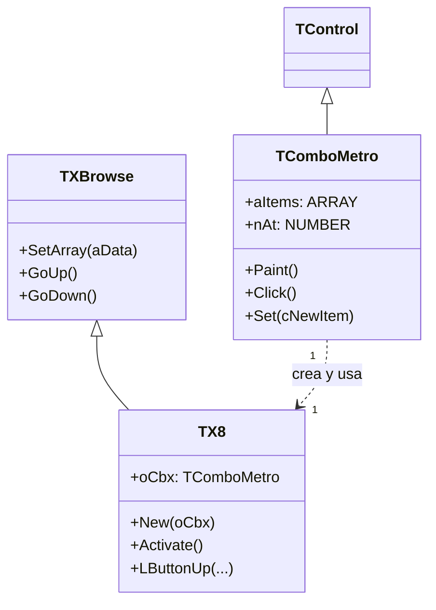
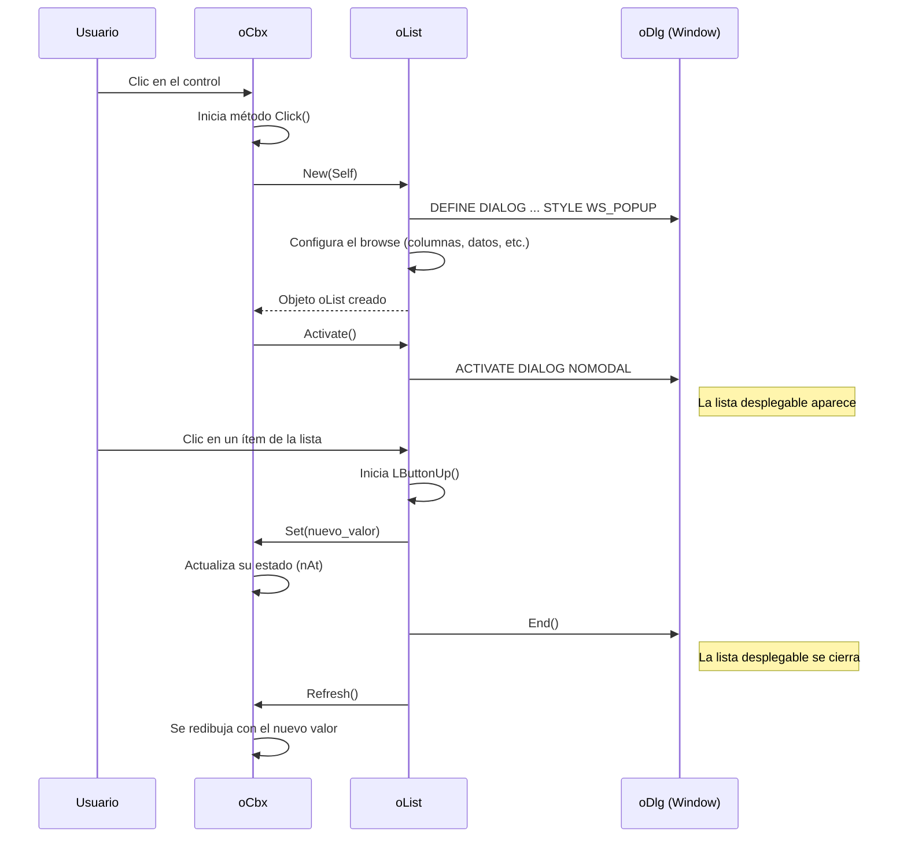

# Análisis del archivo: combom.prg

## 1. Descripción general del archivo

El archivo `combom.prg` define la clase `TComboMetro`, una reimplementación completa de un control ComboBox con una estética "Metro" (moderna, plana). A diferencia de `TComboBox` que encapsula el control nativo de Windows, `TComboMetro` es un control **totalmente personalizado (owner-drawn)**. No utiliza el control ComboBox de Windows en absoluto, sino que dibuja su propia apariencia y, lo más importante, implementa la lista desplegable como una ventana emergente (`DIALOG`) separada que contiene un objeto `TXBrowse` (una clase de browse/grid muy potente).

Está escrito en **Harbour** y es un ejemplo avanzado de creación de controles personalizados en FiveWin.

## 2. Explicación línea por línea

### Parte 1: La clase `TComboMetro`

```harbour
CLASS TComboMetro FROM TControl
```
- **Línea 25**: Define la clase principal, que hereda de `TControl`.

```harbour
   DATA  nClrBorder  INIT CLR_GRAY
   DATA  hPenButton
   DATA  nAt, aItems
```
- **Líneas 29-36**: Propiedades de la clase:
    - `nClrBorder`: Color del borde del control.
    - `hPenButton`: Handle a un `pen` de GDI para dibujar la flecha del botón.
    - `nAt`, `aItems`: El array de ítems y el índice del ítem actualmente seleccionado.

```harbour
   METHOD New(...) CONSTRUCTOR
```
- **Línea 38**: El constructor, que inicializa y crea el control.

```harbour
   METHOD Paint()
   METHOD LButtonDown(...)
   METHOD Click()
```
- **Líneas 50, 52, 54**: Métodos clave para la interacción y el dibujado. `Paint` se encarga de dibujar toda la apariencia del control. `LButtonDown` y `Click` manejan la interacción del usuario.

```harbour
METHOD New(...) CLASS TComboMetro
   ...
   ::nStyle    = nOR( WS_CHILD, WS_VISIBLE, WS_TABSTOP )
   ::Register( nOR( CS_VREDRAW, CS_HREDRAW ) )
   ::Create()
   ...
   ::hPenButton   := CreatePen( PS_SOLID, 3, CLR_BLACK )
```
- **Líneas 60-110**: Implementación del constructor `New`.
    - A diferencia de `TComboBox`, **no usa un `className` de "COMBOBOX"**. Llama a `::Create()` sin parámetros, lo que registra una clase de ventana personalizada para este control.
    - `::Register(...)`: Registra la clase de ventana con estilos que aseguran que se redibuje si cambia de tamaño (`CS_VREDRAW`, `CS_HREDRAW`).
    - Crea recursos GDI, como el `hPenButton`, que se usarán en el método `Paint`.

```harbour
METHOD Click() CLASS TComboMetro
   ...
   DialogList( Self )
```
- **Líneas 296-307**: Implementación de `Click`. Cuando el usuario hace clic en el control, no despliega una lista nativa. En su lugar, llama a la función estática `DialogList( Self )`, que es la responsable de crear y mostrar la ventana emergente con la lista de ítems.

```harbour
METHOD Paint() CLASS TComboMetro
   ...
   FillRect( ::hDC, aRect, ::oBrush:hBrush )
   WndBox2007( ::hDC, ..., ::nClrBorder )
   MoveTo( ::hDC, nBtnLeft, nBtnTop )
   LineTo( ::hDC, nBtnLeft + 5,  nBtnTop + 5, ::hPenButton )
   LineTo( ::hDC, nBtnLeft + 10, nBtnTop,     ::hPenButton )
   DrawTextTransparent( ::hDC, ::aItems[ ::nAt ], ... )
```
- **Líneas 317-343**: Implementación de `Paint`. Este método es el corazón visual del control. Realiza las siguientes acciones en secuencia:
    1.  Dibuja el fondo.
    2.  Dibuja el borde (`WndBox2007`).
    3.  Dibuja la flecha hacia abajo usando primitivas de GDI (`MoveTo`, `LineTo`).
    4.  Dibuja el texto del ítem seleccionado (`DrawTextTransparent`).

### Parte 2: La clase `TX8` (La lista desplegable)

```harbour
CLASS TX8 FROM TXBrowse STATIC
```
- **Línea 347**: Se define una clase `TX8` que hereda de `TXBrowse`. Es `STATIC`, lo que significa que solo es visible dentro de este archivo `.prg`. Esta clase **es** la lista desplegable.

```harbour
   DATA oCbx
```
- **Línea 351**: `oCbx` es una referencia al objeto `TComboMetro` que la creó. Es su enlace de vuelta al control principal.

```harbour
METHOD New( oCbx ) CLASS TX8
   ...
   DEFINE DIALOG oDlg STYLE WS_POPUP ...
   ::Super:New( oDlg )
   ::SetArray( aData, ... )
   ...
   WITH OBJECT oDlg
      :nTop    := ...
      :nLeft   := ...
   END
```
- **Líneas 368-440**: El constructor de la lista desplegable.
    1.  Recibe el objeto `TComboMetro` (`oCbx`) como parámetro.
    2.  Calcula dinámicamente la posición y el tamaño que debe tener la ventana emergente para aparecer justo debajo del `TComboMetro`.
    3.  Crea una ventana sin bordes (`STYLE WS_POPUP`) usando `DEFINE DIALOG`.
    4.  Llama al constructor de su clase padre, `TXBrowse` (`::Super:New(oDlg)`), para crear un grid dentro de esa ventana emergente.
    5.  Usa `::SetArray()` para poblar el grid con los `aItems` del `TComboMetro`.

```harbour
METHOD Activate() CLASS TX8
   ACTIVATE DIALOG ::oWnd NOMODAL ON INIT ...
   oBrw:bLostFocus := { || ::oWnd:End() }
```
- **Líneas 444-450**: El método `Activate` muestra la ventana emergente (`ACTIVATE DIALOG ... NOMODAL`). Es `NOMODAL` para que no bloquee el resto de la aplicación. Define un `bLostFocus` que cierra automáticamente la lista desplegable (`::oWnd:End()`) si el usuario hace clic en otro lugar.

```harbour
METHOD LButtonUp(...) CLASS TX8
   if ::nMouseDnRow == nRow .and. ::nArrayAt > ::nBlankRows
      ::oCbx:Set( ::nArrayAt - ::nBlankRows )
      ::oWnd:End()
      ::oCbx:Refresh()
      return 0
   endif
```
- **Líneas 508-518**: Maneja el clic del usuario en un ítem de la lista. Cuando ocurre:
    1.  Llama a `::oCbx:Set(...)` para actualizar el valor en el control `TComboMetro` principal.
    2.  Cierra la ventana emergente (`::oWnd:End()`).
    3.  Refresca el `TComboMetro` para que muestre el nuevo valor seleccionado.

## 3. Funcionalidad principal

`TComboMetro` es un control ComboBox personalizado desde cero que no depende del control nativo de Windows. Su funcionalidad se basa en la **composición y la orquestación de dos objetos**: `TComboMetro` (la parte visible y estática) y `TX8` (la lista desplegable emergente).

1.  **Dibujado Personalizado**: `TComboMetro` dibuja su propia apariencia, incluyendo el borde, el fondo, el texto y la flecha, dándole un control total sobre su estética.
2.  **Ventana Emergente Personalizada**: Al hacer clic, en lugar de enviar un mensaje para que el sistema operativo muestre la lista, crea y muestra una ventana emergente (`DIALOG`) propia.
3.  **Grid como Lista**: Dentro de la ventana emergente, utiliza la potente clase `TXBrowse` para mostrar los ítems. Esto permite funcionalidades avanzadas en la lista que un ComboBox nativo no podría tener fácilmente, como múltiples columnas, colores por fila, etc. (aunque en esta implementación es una lista simple).
4.  **Comunicación entre Objetos**: El `TComboMetro` (`oCbx`) y la lista (`TX8`) se comunican entre sí. El `TComboMetro` crea el `TX8` y le pasa los ítems. El `TX8` a su vez, cuando se selecciona un ítem, notifica al `TComboMetro` del cambio y le ordena cerrarse.

## 4. Diagramas Mermaid

### Diagrama de Clases (Composición y Herencia)



### Diagrama de Secuencia de un Clic de Usuario



### Diagrama de Flujo del Método `Paint()` de `TComboMetro`

```mermaid
flowchart TD
    A[Inicio: Paint()] --> B[Obtener contexto de dispositivo (hDC)];
    B --> C{¿El control tiene el foco?};
    C -- Sí --> D[Dibujar fondo con color de foco];
    C -- No --> E[Dibujar fondo con color normal];
    D --> F;
    E --> F;
    F[Dibujar borde del control] --> G[Calcular posición de la flecha];
    G --> H[Dibujar la flecha (MoveTo, LineTo)];
    H --> I[Ajustar rectángulo para el texto];
    I --> J[Activar la fuente del control];
    J --> K[Dibujar el texto del ítem seleccionado];
    K --> L[Liberar contexto de dispositivo];
    L --> M[Fin];
```

## 5. Relaciones con otros módulos

- **Dependencias**:
    - **`TControl`**: Clase base para la infraestructura del control.
    - **`TXBrowse` (`xbrowse.ch`)**: Dependencia **crítica y fundamental**. La clase `TX8`, que actúa como la lista desplegable, hereda toda su funcionalidad de `TXBrowse`. Sin `TXBrowse`, este control no funcionaría.
    - **`FiveWin.ch`, `Constant.ch`**: Para las funciones de la API de GDI (`CreatePen`, `FillRect`, `LineTo`, etc.), manejo de ventanas (`DEFINE DIALOG`, `ACTIVATE DIALOG`) y constantes.

- **Módulos que lo llaman**:
    - Cualquier programa que desee un ComboBox con una apariencia moderna y personalizada, en lugar del control nativo de Windows.

- **Módulos que él llama**:
    - Llama a funciones de la **API de GDI de Windows** para todo su dibujado.
    - Llama a funciones de la **API de ventanas de Windows** para crear y gestionar la ventana emergente.
    - **No llama al control ComboBox nativo en absoluto**.

- **Integración en la arquitectura**:
    - `TComboMetro` es un ejemplo de un control de UI de alto nivel construido a partir de componentes más primitivos. Demuestra cómo se puede eludir por completo un control nativo de Windows para lograr una apariencia y comportamiento únicos.
    - La arquitectura se basa en la **orquestación de dos clases distintas**: `TComboMetro` para la visualización estática y `TX8` para la interacción de la lista. La comunicación entre ellas es clave para el funcionamiento del conjunto.
    - El uso de una ventana `DIALOG` `NOMODAL` con un `bLostFocus` que la cierra es un patrón común en FiveWin para crear menús emergentes, listas personalizadas y otras ventanas temporales que no deben bloquear la aplicación principal.
