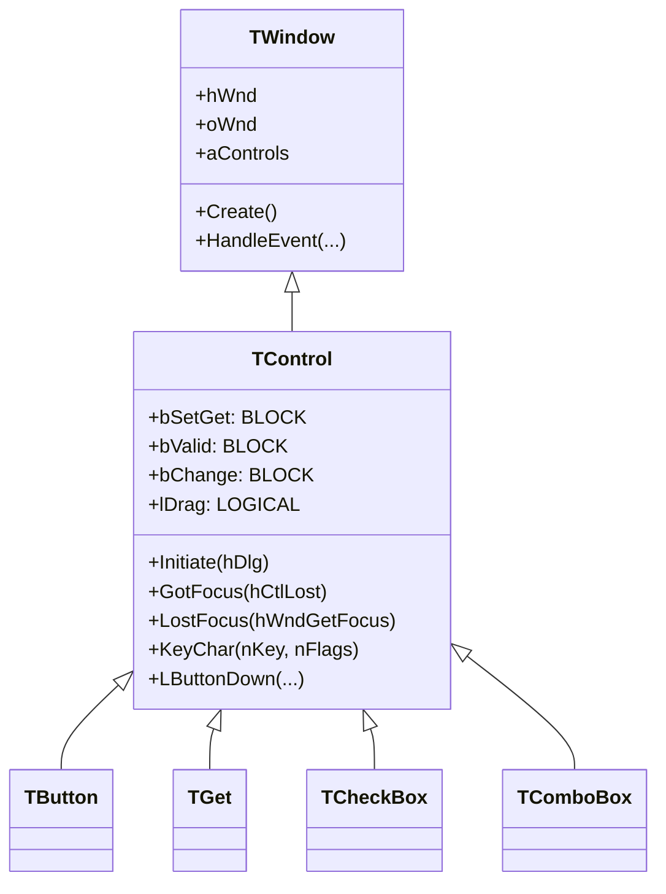
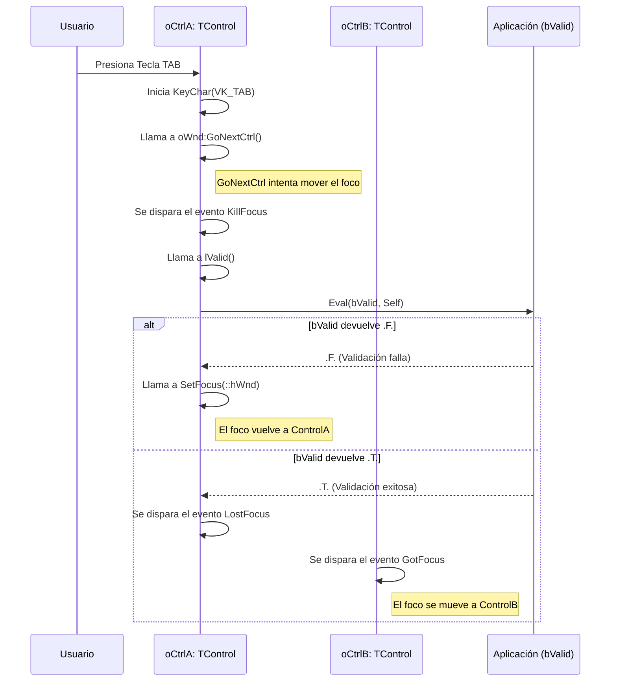
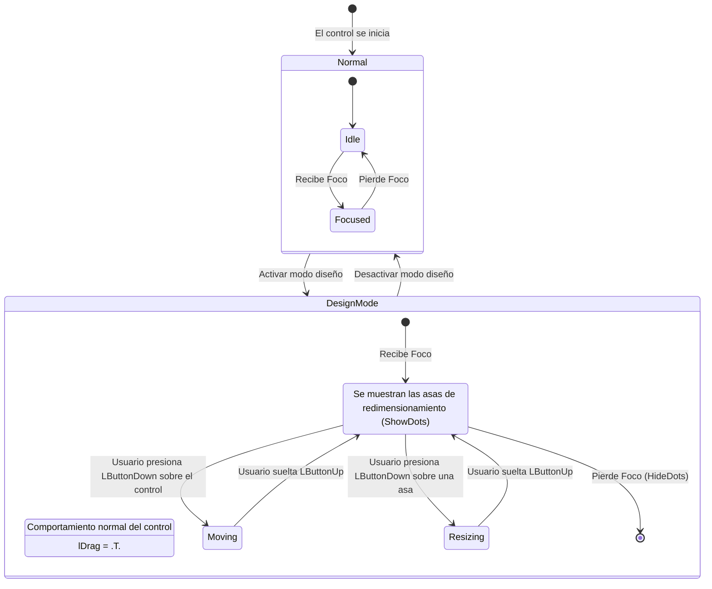

# Análisis del archivo: control.prg

## 1. Descripción general del archivo

El archivo `control.prg` es uno de los archivos más importantes en la arquitectura de la biblioteca FiveWin. Define la clase `TControl`, que sirve como la **clase base abstracta** para todos los controles de interfaz de usuario (widgets) como botones, campos de entrada, checkboxes, etc. Hereda de `TWindow`, lo que significa que, en esencia, cada control *es* una ventana de Windows con su propio `hWnd` (handle de ventana).

`TControl` implementa la funcionalidad común y la infraestructura que todo control necesita: manejo de foco, vinculación de datos, eventos de teclado y ratón, posicionamiento, y un mecanismo para el modo de diseño visual. Está escrito en **Harbour**.

## 2. Explicación línea por línea

```harbour
CLASS TControl FROM TWindow
```
- **Línea 71**: Define la clase `TControl` heredando de `TWindow`. Esta es la decisión de diseño más fundamental: un control es una especialización de una ventana.

```harbour
   DATA   bSetGet, bChange, bValid, bWhen
   DATA   lCaptured, lDrag, lMouseDown
```
- **Líneas 73-75**: Propiedades (DATA) esenciales para la interacción y vinculación de datos:
    - `bSetGet`: Un bloque de código (`CODEBLOCK`) que actúa como *getter* y *setter* para vincular el valor del control a una variable de la aplicación. Es el corazón del mecanismo de vinculación de datos de FiveWin.
    - `bChange`: Bloque de código que se ejecuta cuando el valor del control cambia.
    - `bValid`: Bloque de código que se ejecuta para validar el valor del control antes de perder el foco. Si devuelve `.F.`, el foco no puede salir del control.
    - `bWhen`: Bloque de código que se ejecuta antes de que el control gane el foco. Si devuelve `.F.`, el control no puede recibir el foco.
    - `lDrag`, `lCaptured`, `lMouseDown`: Flags para gestionar el modo de diseño (arrastrar y redimensionar controles).

```harbour
   CLASSDATA nInitID INIT 100
   CLASSDATA aDots
```
- **Líneas 95-97**: Propiedades de clase (estáticas).
    - `nInitID`: Un contador estático para generar IDs únicos para nuevos controles.
    - `aDots`: Un array que contendrá los 8 pequeños cuadrados (puntos de redimensionamiento) que aparecen alrededor de un control cuando está seleccionado en el modo de diseño.

```harbour
   ACCESS lChanged INLINE !( ::uOriginalValue == ::VarGet() )
```
- **Líneas 110-112**: Una propiedad de acceso (`ACCESS`) que compara el valor original del control (`uOriginalValue`) con el actual (`VarGet()`) para determinar si ha cambiado. Es una forma limpia de consultar el estado "modificado".

```harbour
   METHOD Initiate( hDlg )
```
- **Línea 161**: Método crucial para los controles definidos en recursos de diálogo. Cuando se carga un diálogo, se llama a `Initiate` para cada control. Este método obtiene el `hWnd` del control a partir de su ID (`GetDlgItem`) y lo enlaza al objeto `TControl` (`::Link()`).

```harbour
   METHOD HandleEvent( nMsg, nWParam, nLParam )
```
- **Línea 217**: El despachador de mensajes principal del control. Intercepta los mensajes de Windows (`WM_*`) y los traduce en llamadas a métodos más específicos y de más alto nivel (ej. `WM_LBUTTONDOWN` se convierte en una llamada a `::LButtonDown(...)`). Este es el núcleo del sistema de eventos.

```harbour
   METHOD LButtonDown( nRow, nCol, nKeyFlags, lTouch )
      if ::lDrag
         // ... lógica para iniciar el arrastre/redimensionamiento
         ::Capture()
         ::lCaptured = .t.
      else
         return ::Super:LButtonDown(...)
      endif
```
- **Líneas 648-671**: Implementación de `LButtonDown`. Muestra una bifurcación clave en el comportamiento del control: si está en modo diseño (`lDrag == .T.`), inicia la lógica para mover o redimensionar el control, capturando el ratón. Si no, pasa el evento a la clase padre (`TWindow`) para el comportamiento normal.

```harbour
   METHOD KeyChar( nKey, nFlags )
      do case
         case nKey == VK_TAB .and. GetKeyState( VK_SHIFT )
              ::oWnd:GoPrevCtrl( ::hWnd )
         case nKey == VK_TAB
              ::oWnd:GoNextCtrl( ::hWnd )
         // ...
      endcase
```
- **Líneas 900-939**: Implementación de `KeyChar`. Centraliza el manejo de la navegación por teclado. Intercepta la tecla `TAB` para mover el foco al control siguiente (`GoNextCtrl`) o anterior (`GoPrevCtrl`), y la tecla `ENTER` para activar el botón por defecto del diálogo.

```harbour
   METHOD CheckDots()
   METHOD ShowDots()
   METHOD HideDots()
   METHOD MResize(...)
```
- **Líneas 1388, 1475, 157, 241**: Métodos que implementan la funcionalidad del **diseñador visual**. `CheckDots` crea las 8 pequeñas ventanas que sirven como asas de redimensionamiento. `ShowDots` y `HideDots` las muestran u ocultan. `MResize` y la lógica en `LButtonUp` y `MouseMove` manejan el cambio de tamaño del control cuando el usuario arrastra estas asas.

## 3. Funcionalidad principal

`TControl` no es una clase que se use directamente, sino que es la base sobre la que se construye todo el sistema de controles. Su funcionalidad principal es proporcionar un **framework común** para todos sus descendientes.

- **Ciclo de Vida del Control**: Gestiona la creación (`Create`), inicialización (`Initiate`) y destrucción (`End`) del control como una ventana de Windows.
- **Sistema de Eventos**: Proporciona un modelo de eventos de alto nivel (ej. `Click`, `GotFocus`, `LostFocus`) al abstraer los mensajes de bajo nivel de Windows a través de `HandleEvent`.
- **Vinculación de Datos y Validación**: Implementa el patrón `bWhen`/`bValid`/`bSetGet`/`bChange`, que es el mecanismo estándar en FiveWin para la interacción de la UI con los datos de la aplicación.
- **Modo Diseño (Visual)**: Contiene toda la lógica para permitir que los controles sean movidos y redimensionados en tiempo de ejecución, como en un diseñador de formularios. Esto incluye dibujar las asas de redimensionamiento y manejar los eventos del ratón para actualizar la posición y el tamaño.
- **Navegación y Foco**: Centraliza el manejo del foco (`SetFocus`, `GotFocus`, `LostFocus`) y la navegación por teclado (`TAB`, `ENTER`, flechas).
- **Alineación (Layout)**: Proporciona un sistema básico de layout (`AdjClient`, `AdjTop`, etc.) que permite a los controles anclarse a los bordes de su ventana contenedora.

## 4. Diagramas Mermaid

### Diagrama de Clases (Jerarquía)



### Diagrama de Secuencia del Ciclo de Foco y Validación

Este diagrama muestra lo que sucede cuando un usuario intenta salir de un control (ej. presionando TAB).



### Diagrama de Estado para el Modo Diseño (`lDrag`)



## 5. Relaciones con otros módulos

- **Dependencias**:
    - **`TWindow`**: Es su clase padre. `TControl` depende de `TWindow` para su existencia fundamental como una ventana y para su relación con una ventana contenedora (`oWnd`).

- **Módulos que lo llaman (Dependientes de él)**:
    - **Prácticamente todas las clases de control de FiveWin**: `TButton`, `TGet`, `TCheckBox`, `TComboBox`, `TRadio`, `TListBox`, `TSay`, etc., **heredan** de `TControl`. Es la base de toda la jerarquía de controles.
    - **`TWindow` y `TDialog`**: Estas clases de ventanas contienen y gestionan una colección de objetos `TControl` en su array `aControls`. Orquestan la navegación entre ellos (`GoNextCtrl`, `GoPrevCtrl`).

- **Módulos que él llama**:
    - Llama a una gran cantidad de funciones de la **API de Windows** para el manejo de ventanas, mensajes, foco, cursores, etc.
    - Llama a métodos de su ventana contenedora (`::oWnd`), que es típicamente un objeto `TDialog` o `TWindow`, para coordinar acciones como la navegación por TAB.

- **Integración en la arquitectura**:
    - `TControl` es la **piedra angular del framework de UI de FiveWin**. Establece el contrato y la implementación base que todos los controles deben seguir. Gracias a que todos los controles heredan de `TControl`, la clase `TWindow` puede gestionarlos de manera polimórfica (tratarlos a todos como si fueran simplemente `TControl`s) al iterar sobre su array `aControls`.
    - El mecanismo de `HandleEvent` que traduce mensajes de bajo nivel en métodos de alto nivel es un ejemplo clásico del **Patrón de Diseño Template Method**. La clase base (`TWindow`/`TControl`) define el esqueleto del algoritmo (el bucle de mensajes), pero permite a las subclases (`TButton`, etc.) redefinir pasos específicos de ese algoritmo (qué hacer en un `WM_LBUTTONDOWN`).
