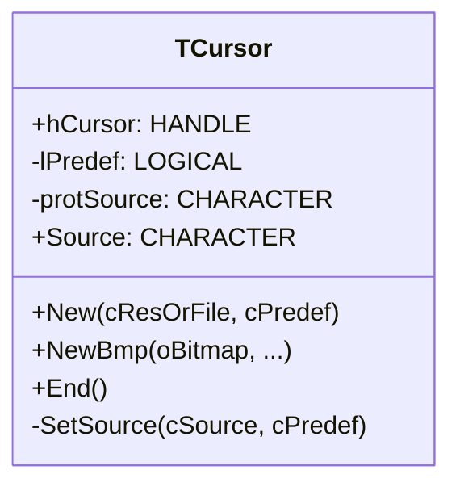
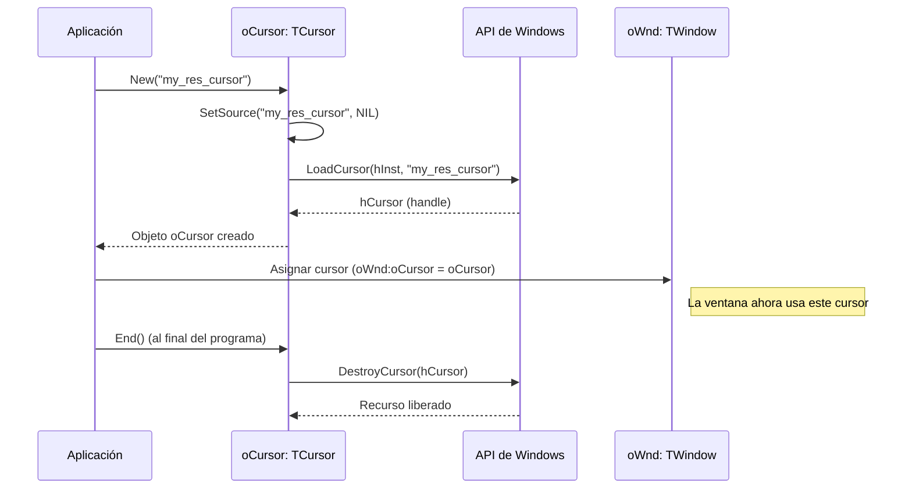

# Análisis del archivo: cursor.prg

## 1. Descripción general del archivo

El archivo `cursor.prg` define la clase `TCursor`, una envoltura (wrapper) orientada a objetos para la creación y gestión de cursores del ratón en Windows. La clase simplifica la carga de cursores, ya sea desde los recursos predefinidos del sistema, desde archivos (`.cur`, `.ico`) o a partir de un mapa de bits (`.bmp`).

El propósito principal es abstraer las llamadas a la API de Windows (`LoadCursor`, `LoadCursorFromFile`, `DestroyCursor`) en un objeto fácil de manejar. El lenguaje utilizado es **Harbour**.

## 2. Explicación línea por línea

```harbour
#include "FiveWin.ch"
```
- **Línea 1**: Incluye las definiciones estándar de FiveWin.

```harbour
#define IDC_ARROW     32512
#define IDC_IBEAM     32513
// ... y otros cursores estándar
```
- **Líneas 3-15**: Se definen las constantes de la API de Windows para los cursores de sistema predefinidos. `IDC_ARROW` es la flecha estándar, `IDC_IBEAM` es el cursor de texto, `IDC_WAIT` es el reloj de arena, etc.

```harbour
CLASS TCursor
   DATA   hCursor    INIT 0
   DATA   lPredef AS LOGICAL INIT .f.
   DATA  protSource INIT "" PROTECTED
```
- **Líneas 19-23**: Definición de la clase `TCursor` y sus propiedades:
    - `hCursor`: Almacena el handle (`HCURSOR`) del cursor de Windows una vez cargado. Es el dato más importante.
    - `lPredef`: Un flag lógico que indica si el cursor es uno de los predefinidos del sistema (`.T.`) o si fue cargado desde un recurso o archivo (`.F.`). Esto es importante para saber si se debe llamar a `DestroyCursor` al final.
    - `protSource`: Una propiedad protegida para almacenar el origen del cursor (nombre del archivo o recurso).

```harbour
   ACCESS Source INLINE ::protSource
   ASSIGN Source( c ) INLINE ( ::SetSource( c ), ::protSource )
```
- **Líneas 25-26**: Definen una propiedad virtual `Source`. Leerla (`ACCESS`) devuelve la propiedad interna. Escribirla (`ASSIGN`) llama al método `::SetSource(c)`, que realiza la carga del cursor, y luego actualiza la propiedad interna.

```harbour
   METHOD New( cResOrFile, cPredef ) CONSTRUCTOR
   METHOD NewBmp(...) CONSTRUCTOR
```
- **Líneas 28, 30**: Dos constructores. `New` es el principal y carga un cursor a partir de un nombre de recurso, un archivo o un tipo predefinido. `NewBmp` es un constructor alternativo para crear un cursor a partir de un objeto `TBitmap`.

```harbour
   METHOD End() INLINE If( ::hCursor != 0,;
                       If( ! ::lPredef, DestroyCursor( ::hCursor ),),),;
                           ::hCursor := 0
```
- **Líneas 34-36**: El método `End` (destructor). Si el cursor existe (`hCursor != 0`) y **no es** predefinido (`! ::lPredef`), llama a `DestroyCursor` para liberar los recursos. Los cursores predefinidos son recursos del sistema y no deben ser destruidos. Finalmente, resetea el handle a 0.

```harbour
METHOD New( cResOrFile, cPredef ) CLASS TCursor
   ::SetSource( cResOrFile, cPreDef )
return Self
```
- **Líneas 40-44**: El constructor `New` simplemente delega todo el trabajo al método `SetSource`.

```harbour
METHOD SetSource( cSource, cPredef ) CLASS TCursor
   // ...
   if ! Empty( cPredef )
      // ... Lógica para cursores predefinidos
      hCursor = LoadCursor( 0, aTypes[ nAt ] )
      lPredef = .T.
   elseif ( ... cExt == "cur" .or. cExt == "ico" ) .and. File( cSource )
      hCursor = LoadCursorFromFile( cSource )
   elseif !Empty( cSource )
      hCursor = LoadCursor( GetResources(), cSource )
   endif

   if !Empty( hCursor )
      ::End() // Libera cualquier cursor anterior
      ::hCursor   := hCursor
      ::lPreDef   := lPreDef
      ::protSource:= cSource
   endif
```
- **Líneas 48-108**: El método `SetSource` contiene la lógica principal de carga:
    1.  **Cursores Predefinidos**: Si se especifica `cPredef` (ej. "ARROW", "WAIT"), busca el ID correspondiente (`IDC_*`) y llama a `LoadCursor(0, id)`. El `0` como primer parámetro indica que se cargue un cursor del sistema.
    2.  **Cursores desde Archivo**: Si `cSource` es un archivo con extensión `.cur` o `.ico` que existe en el disco, llama a `LoadCursorFromFile(cSource)`.
    3.  **Cursores desde Recurso**: Si `cSource` no es un archivo pero no está vacío, asume que es el nombre de un recurso de cursor compilado en el ejecutable y llama a `LoadCursor(GetResources(), cSource)`.
    4.  Si la carga es exitosa, llama a `::End()` para liberar cualquier cursor que el objeto pudiera tener previamente, y luego almacena el nuevo `hCursor` y la información de origen.

```harbour
DLL32 STATIC FUNCTION LoadCursorFromFile( lpFileName AS LPSTR ) AS LONG PASCAL FROM "LoadCursorFromFileA" LIB "user32.dll"
```
- **Línea 158**: Declaración de una función externa de la API de Windows. `LoadCursorFromFileA` no está en las librerías estándar de Harbour/FiveWin, por lo que se declara aquí explícitamente para poder ser llamada desde el código, especificando su nombre en la DLL (`user32.dll`).

## 3. Funcionalidad principal

La clase `TCursor` es una abstracción simple para manejar un recurso de cursor de Windows. Su funcionalidad se centra en la carga y liberación de cursores.

- **Carga Flexible**: Puede cargar un cursor de tres maneras diferentes:
    1.  **Por tipo predefinido**: `oCursor := TCursor():New(NIL, "WAIT")`
    2.  **Desde un archivo**: `oCursor := TCursor():New("c:\cursores\mi_cursor.cur")`
    3.  **Desde un recurso**: `oCursor := TCursor():New("MI_CURSOR_RES")`
- **Gestión de Memoria**: El método `End()` se encarga de liberar la memoria del cursor (si es necesario), evitando fugas de recursos (resource leaks). Esto es crucial porque los cursores creados por el usuario deben ser destruidos explícitamente.
- **Encapsulación**: Oculta los detalles de las diferentes funciones de la API (`LoadCursor`, `LoadCursorFromFile`) y la lógica de si un cursor debe ser destruido o no, bajo una interfaz de objeto simple.

**Ejemplo de uso:**

```harbour
// Crear un cursor de espera
DEFINE CURSOR oWaitCursor TYPE "WAIT"

// Crear un cursor desde un archivo
DEFINE CURSOR oMyCursor FILE "mycursor.cur"

// Aplicar el cursor a una ventana
@ 10,10 WINDOW oWnd ... CURSOR oMyCursor

// Cambiar el cursor temporalmente
SetCursor( oWaitCursor:hCursor )
SysWait(2) // Esperar 2 segundos
SetCursor( oMyCursor:hCursor ) // Restaurar

// Al final, los objetos se destruyen y End() es llamado
// liberando la memoria de oMyCursor.
```

## 4. Diagramas Mermaid

### Diagrama de Clases (Class Diagram)



### Diagrama de Flujo del Método `SetSource()`

```mermaid
flowchart TD
    A[Inicio: SetSource(cSource, cPredef)] --> B{¿cPredef no está vacío?};
    B -- Sí --> C{Buscar tipo predefinido (ARROW, WAIT, etc.)};
    C -- Encontrado --> D[hCursor = LoadCursor(0, IDC_*)];
    C -- No Encontrado --> E[MsgAlert("Tipo incorrecto")];
    D --> F{¿cSource es un archivo .cur o .ico existente?};
    B -- No --> F;
    F -- Sí --> G[hCursor = LoadCursorFromFile(cSource)];
    F -- No --> H{¿cSource no está vacío?};
    H -- Sí --> I[hCursor = LoadCursor(GetResources(), cSource)];
    H -- No --> J{¿hCursor se cargó correctamente?};
    G --> J;
    I --> J;
    E --> J;
    J -- Sí --> K[Llamar a ::End() para limpiar cursor anterior];
    K --> L[Almacenar nuevo hCursor y datos de origen];
    L --> M[Devolver .T.];
    J -- No --> N[Devolver .F.];
```

### Diagrama de Secuencia para la Creación y Uso



## 5. Relaciones con otros módulos

- **Dependencias**:
    - **`FiveWin.ch`**: Proporciona las declaraciones de las funciones de la API de Windows como `LoadCursor`, `DestroyCursor`, `GetResources`.
    - **`user32.dll`**: Dependencia externa y explícita para la función `LoadCursorFromFileA`, que no forma parte del conjunto estándar de funciones importadas por FiveWin.
    - **`TBitmap` / `TBtnBmp`**: El constructor `NewBmp` depende de estas clases para poder crear un cursor a partir de una imagen de mapa de bits.

- **Módulos que lo llaman**:
    - **`TWindow` y `TControl`**: Estas clases tienen una propiedad `oCursor`. Se puede asignar un objeto `TCursor` a esta propiedad para definir el cursor del ratón que se mostrará cuando el puntero esté sobre la ventana o el control.
    - El comando `DEFINE CURSOR` del preprocesador de FiveWin es una sintaxis de alto nivel que se traduce en la creación de una instancia de `TCursor`.
    - Cualquier parte de la aplicación que necesite cambiar el cursor globalmente (ej. `SetCursor(oWaitCursor:hCursor)`) o manejar cursores personalizados.

- **Módulos que él llama**:
    - Llama directamente a funciones de la **API de Windows** (`user32.dll`) para realizar todas sus operaciones de carga y destrucción.

- **Integración en la arquitectura**:
    - `TCursor` es una clase de utilidad simple y fundamental. Se integra en el framework de UI a través de la **composición**: las ventanas y controles *tienen un* (`has-a`) `TCursor` (`oCursor`).
    - Su diseño sigue el principio de **RAII (Resource Acquisition Is Initialization)**. El recurso (el `hCursor`) se adquiere en el constructor (`New`) y se libera en el destructor (`End`). Esto asegura que los recursos se gestionen correctamente y previene fugas de memoria, ya que la destrucción del objeto `TCursor` garantiza la liberación del handle del cursor de Windows.
