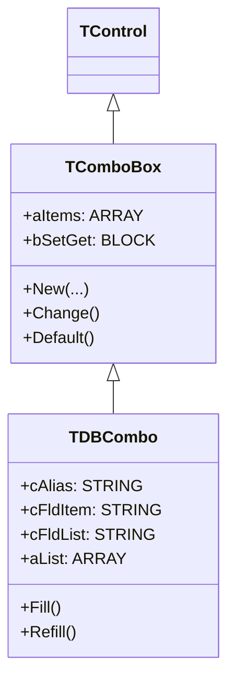
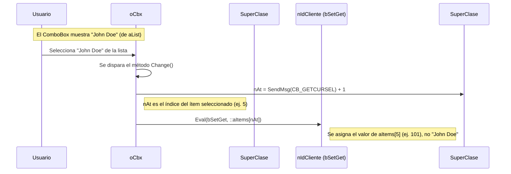

# Análisis del archivo: dbcombo.prg

## 1. Descripción general del archivo

El archivo `dbcombo.prg` define la clase `TDBCombo`, una subclase de `TComboBox` diseñada para crear cuadros combinados (ComboBox) vinculados a una fuente de datos, típicamente una tabla de base de datos (`.dbf`). Su característica principal y distintiva es la capacidad de mostrar una lista de valores de un campo de la tabla (ej. nombres de clientes) mientras que el valor real que se almacena en la variable vinculada proviene de otro campo (ej. el ID del cliente).

Es una herramienta de UI muy común y potente para crear relaciones "lookup" o de búsqueda, donde el usuario ve un texto descriptivo pero el programa trabaja con un identificador numérico o un código. El lenguaje utilizado es **Harbour**.

## 2. Explicación línea por línea

```harbour
CLASS TDBCombo FROM TComboBox
```
- **Línea 80**: Se define la clase `TDBCombo` heredando de `TComboBox`. Esto significa que `TDBCombo` obtiene toda la funcionalidad de un ComboBox estándar y le añade capacidades de vinculación a datos.

```harbour
   DATA  cAlias      // Workarea alias for fields to display.
   DATA  cFldList    // Field to display in the ComboBox.
   DATA  cFldItem    // Field to return in the bound variable.
   DATA  aList       // Array of display items corresponding to aItems.
```
- **Líneas 82-87**: Propiedades clave que definen el comportamiento de la vinculación a datos:
    - `cAlias`: El alias del área de trabajo de la tabla que se usará como fuente.
    - `cFldList`: El nombre del campo cuyos valores se **mostrarán** en la lista desplegable (ej. `"CustomerName"`).
    - `cFldItem`: El nombre del campo cuyo valor se **almacenará** en la variable vinculada (`bSetGet`) (ej. `"CustomerID"`).
    - `aList`: Un array que contiene los valores de `cFldList`. Este array se pasa a la clase padre (`TComboBox`) para que los muestre.
    - La clase padre `TComboBox` ya tiene una propiedad `aItems`, que `TDBCombo` utiliza para almacenar los valores de `cFldItem`.

```harbour
   METHOD New(...) CONSTRUCTOR
   METHOD ReDefine(...) CONSTRUCTOR
```
- **Líneas 91, 95**: Los constructores. Reciben los parámetros estándar de un `TComboBox` y adicionalmente los parámetros específicos de `TDBCombo` (`cAlias`, `cFldItem`, `cFldList`).

```harbour
   METHOD Fill()  // Fill aItems, aList from database. Used internally only.
   METHOD Refill() // Refill aItems and aList from cFldItem and cFldList
```
- **Líneas 107, 119**: Métodos para poblar los arrays internos desde la base de datos.
    - `Fill()`: Itera sobre la tabla especificada en `cAlias`, leyendo cada registro. Extrae el valor del campo `cFldItem` y lo añade a `::aItems`, y el valor de `cFldList` y lo añade a `::aList`.
    - `Refill()`: Es un método de más alto nivel que resetea el control y luego llama a `Fill()` para recargarlo, por si los datos de la tabla han cambiado.

```harbour
METHOD New(...) CLASS TDBCombo
   ...
   ::cAlias   := cAlias
   ::cFldList := cFldList
   ::cFldItem := cFldItem
   if empty(::aItems) .and. empty(::aList)
      ::Fill()
   endif
   ::Super:New( ..., ::aItems, ... )
```
- **Líneas 127-145**: Implementación del constructor `New`.
    1.  Asigna las propiedades específicas de `TDBCombo` (`cAlias`, etc.).
    2.  Llama a `::Fill()` para poblar los arrays `aItems` y `aList` desde la base de datos.
    3.  Llama al constructor de la clase padre (`::Super:New(...)`), pasándole el array `::aItems` (los valores a devolver) para que `TComboBox` lo gestione internamente.

```harbour
METHOD Fill() CLASS TDBCombo
   (::cAlias)->(DBGOTOP())
   DO WHILE ! (::cAlias)->(EOF())
      AADD( ::aItems, (::cAlias)->(FIELDGET( nItem )) )
      AADD( ::aList, (::cAlias)->(FIELDGET( nList )) )
      (::cAlias)->(DBSKIP())
   ENDDO
```
- **Líneas 478-538**: Implementación simplificada de `Fill()`. Este es el núcleo de la clase. El código se posiciona al principio de la tabla, recorre todos los registros hasta el final, y en cada registro, añade los valores de los dos campos de interés a los dos arrays correspondientes.

```harbour
METHOD Change() CLASS TDBCombo
   nAt = ::SendMsg( CB_GETCURSEL ) + 1
   ...
   if ::nAt != 0 .and. ::nAt <= Len( ::aItems )
      Eval( ::bSetGet, ::aItems[ ::nAt ] )
   endif
```
- **Líneas 245-265**: Sobrescribe el método `Change` de `TComboBox`. Cuando el usuario selecciona un ítem, este método se asegura de que el valor que se guarda en la variable vinculada (`bSetGet`) es el del array `::aItems` (los IDs), no el del array `::aList` (los textos mostrados).

```harbour
METHOD Default() CLASS TDBCombo
   ...
   AEval( ::aList, { | cList, nAt | ::SendMsg( CB_ADDSTRING, nAt, cList ) } )
   ...
   ::Set( cStart )
```
- **Líneas 269-301**: Sobrescribe el método `Default`. La línea clave es `AEval( ::aList, ... )`, que itera sobre el array de los textos a mostrar (`aList`) y los añade al control ComboBox nativo. Luego, llama a `::Set()` para establecer la selección inicial basándose en el valor de la variable vinculada.

## 3. Funcionalidad principal

`TDBCombo` extiende `TComboBox` para crear un control de "búsqueda" (lookup) de base de datos. Su funcionalidad se puede resumir así:

1.  **Configuración**: Se especifica una tabla (`cAlias`), un campo de valor (`cFldItem`, ej. `ID_CLIENTE`) y un campo de visualización (`cFldList`, ej. `NOMBRE_CLIENTE`).
2.  **Poblado Automático**: Al crearse, el control recorre la tabla especificada y construye dos arrays en memoria: uno con los valores (`aItems`) y otro con los textos a mostrar (`aList`).
3.  **Visualización y Devolución Separadas**: El control se configura para mostrar al usuario los valores de `aList` (los nombres). Sin embargo, cuando el usuario hace una selección, el valor que se almacena en la variable del programa es el elemento correspondiente del array `aItems` (los IDs).
4.  **Búsqueda Incremental**: Incluye una lógica en `KeyChar` que permite al usuario escribir las primeras letras del texto que busca, y el ComboBox salta automáticamente al ítem correspondiente en la lista.

**Ejemplo de uso:**

Supongamos una tabla `clientes.dbf` con campos `ID_CLIENTE` y `NOMBRE`.

```harbour
// nIdCliente es la variable que queremos actualizar
local nIdCliente := 105

USE clientes ALIAS "cli" INDEX clientes

@ 10,10 DBCOMBO oCbx VAR nIdCliente ALIAS "cli" ;
   ITEMFIELD "ID_CLIENTE" LISTFIELD "NOMBRE"
```

- El `DBCOMBO` recorrerá la tabla `cli`.
- Llenará su lista desplegable con los valores del campo `NOMBRE`.
- Cuando el usuario seleccione un nombre, el `DBCOMBO` encontrará el `ID_CLIENTE` correspondiente y lo guardará en la variable `nIdCliente`.

## 4. Diagramas Mermaid

### Diagrama de Clases (Herencia)



### Diagrama de Flujo del Método `Fill()`

```mermaid
flowchart TD
    A[Inicio: Fill()] --> B{¿Existe el alias (cAlias)?};
    B -- No --> Z[Fin];
    B -- Sí --> C[Obtener punteros a los campos cFldItem y cFldList];
    C --> D[Guardar posición actual del registro];
    D --> E[Limpiar arrays internos aItems y aList];
    E --> F[Añadir un registro en blanco a los arrays];
    F --> G[Ir al primer registro de la tabla (DBGoTop)];
    G --> H{Loop: Mientras no sea fin de archivo (EOF)};
    H -- Sí --> I[Leer valor de cFldItem];
    I --> J[Añadir valor a ::aItems];
    J --> K[Leer valor de cFldList];
    K --> L[Añadir valor a ::aList];
    L --> M[Avanzar al siguiente registro (DBSkip)];
    M --> H;
    H -- No --> N[Restaurar posición original del registro];
    N --> Z;
```

### Diagrama de Secuencia de Selección de Usuario



## 5. Relaciones con otros módulos

- **Dependencias**:
    - **`TComboBox` (`combobox.prg`)**: Es su clase padre. `TDBCombo` depende completamente de `TComboBox` para toda la funcionalidad básica de un cuadro combinado (creación de la ventana, manejo del `TGet` interno, dibujado, etc.). `TDBCombo` se especializa en la parte de la gestión de los datos.
    - **`TDataBase` (`database.prg`) o Funciones DBF**: Aunque no contiene un objeto `TDataBase`, depende conceptualmente de la capa de acceso a datos. Llama directamente a funciones de base de datos de Harbour (`FIELDPOS`, `RECNO`, `DBGOTOP`, `DBSKIP`, `EOF`, `FIELDGET`) sobre el alias especificado.

- **Módulos que lo llaman**:
    - Cualquier programa que necesite un ComboBox para buscar y seleccionar valores de una tabla de referencia. Es extremadamente común en formularios de entrada de datos para campos que son claves foráneas (foreign keys).
    - El comando de preprocesador `DBCOMBO` se traduce en la creación de una instancia de `TDBCombo`.

- **Módulos que él llama**:
    - Llama a métodos de su clase padre `TComboBox` (`Super:New`, `Super:ReDefine`, `Super:LostFocus`).
    - Llama a funciones de base de datos de bajo nivel de Harbour.

- **Integración en la arquitectura**:
    - `TDBCombo` es un ejemplo perfecto de **herencia para especialización**. Toma una clase genérica (`TComboBox`) y la especializa para un caso de uso muy concreto y común: la vinculación a datos de una tabla con valores de visualización y de retorno separados.
    - Se integra perfectamente en el sistema de `bSetGet`/`bChange`/`bValid` de `TControl`, comportándose como cualquier otro control de entrada de datos desde la perspectiva del programador de la aplicación, a pesar de su compleja lógica interna de acceso a datos.
