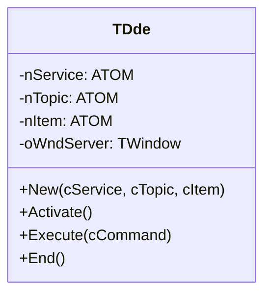
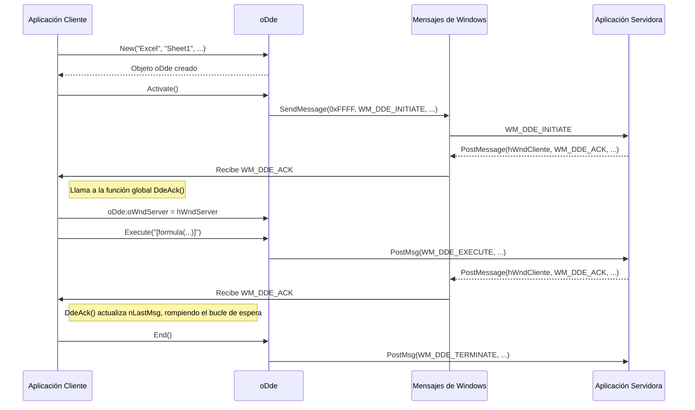
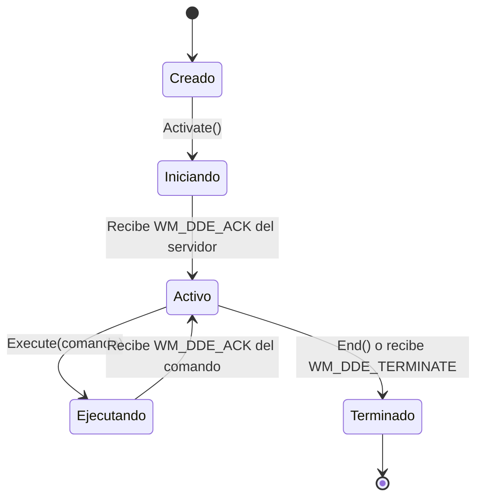

# Análisis del archivo: dde.prg

## 1. Descripción general del archivo

El archivo `dde.prg` implementa la clase `TDde`, que actúa como un cliente de **DDE (Dynamic Data Exchange)**. DDE es un mecanismo de comunicación entre procesos (IPC) de Windows, anterior a tecnologías como OLE y COM. Permite que las aplicaciones intercambien datos y se envíen comandos entre sí.

Esta clase en particular parece estar diseñada para iniciar una conversación DDE con una aplicación servidora, enviarle comandos y terminar la conexión. El ejemplo clásico de uso de DDE era controlar otras aplicaciones, como Microsoft Excel o Word, desde un programa externo. El lenguaje utilizado es **Harbour**.

## 2. Explicación línea por línea

```harbour
static aDDEs := {}
static nLastMsg := 0
```
- **Líneas 3-5**: Variables estáticas a nivel de módulo.
    - `aDDEs`: Un array que actúa como un repositorio global para todas las instancias de `TDde` creadas. Esto es necesario porque los mensajes DDE de Windows son asíncronos y llegan a la ventana principal de la aplicación, que necesita una forma de encontrar el objeto `TDde` correspondiente.
    - `nLastMsg`: Una variable de estado para seguir la secuencia de mensajes en la conversación DDE (ej. `WM_DDE_INITIATE`, `WM_DDE_ACK`).

```harbour
CLASS TDde
   DATA   nService, nTopic, nItem
   DATA   bAction, bEnd
   DATA   oWndServer
```
- **Líneas 9-15**: Definición de la clase `TDde`.
    - `nService`, `nTopic`, `nItem`: Estos son los tres componentes que definen un "enlace" DDE. No son strings, sino **átomos globales** de Windows. Un átomo es un identificador numérico único para una cadena, lo que permite una comparación más rápida. `Service` es el nombre de la aplicación servidora (ej. "Excel"), `Topic` es el tema (ej. un archivo, como "Sheet1"), y `Item` es el dato específico (ej. "R1C1").
    - `bAction`, `bEnd`: Bloques de código para manejar eventos.
    - `oWndServer`: Un objeto `TWindow` que encapsula el `hWnd` (handle de ventana) de la aplicación servidora DDE. Es el destino al que se enviarán los mensajes.

```harbour
METHOD New( cService, cTopic, cItem, bAction, bEnd ) CONSTRUCTOR
   ::nService = GlobalAddAtom( cService )
   ::nTopic   = GlobalAddAtom( cTopic )
   ::nItem    = GlobalAddAtom( cItem )
   ...
   AAdd( aDDEs, Self )
```
- **Líneas 30-39**: El constructor. Toma los nombres de servicio, tema e ítem como cadenas, los convierte en átomos globales usando `GlobalAddAtom()`, y los almacena. Luego, se añade a sí mismo al array estático `aDDEs`.

```harbour
METHOD Activate() CLASS TDde
   nLastMsg = WM_DDE_INITIATE
   SendMessage( 0xFFFF, WM_DDE_INITIATE, GetWndApp(), ... )
```
- **Líneas 43-48**: Inicia la conversación DDE. Envía un mensaje `WM_DDE_INITIATE` a **todas** las ventanas de nivel superior del sistema (`SendMessage(0xFFFF, ...)`). Las aplicaciones servidoras DDE que reconozcan el `Service` y `Topic` responderán con un mensaje `WM_DDE_ACK`.

```harbour
METHOD Execute( cCommand ) CLASS TDde
   ::oWndServer:PostMsg( WM_DDE_EXECUTE, GetWndApp(), DdeCommand( cCommand ) )
   while nLastMsg != WM_DDE_ACK
      SysRefresh()
   end
```
- **Líneas 52-64**: Envía un comando a la aplicación servidora. 
    1.  Envía un mensaje `WM_DDE_EXECUTE` a la ventana del servidor (`oWndServer`).
    2.  Entra en un bucle de espera (`while nLastMsg != WM_DDE_ACK`), procesando otros mensajes de Windows (`SysRefresh()`) hasta que se reciba la confirmación (`WM_DDE_ACK`) del servidor. **Nota: Este bucle de espera activa (busy-wait) es una práctica de programación deficiente y puede congelar la UI.**

```harbour
function DdeAck( hWndServer, nLParam )
   do case
      case nLastMsg == WM_DDE_INITIATE
         ATail( aDDEs ):oWndServer = TWindow()
         ATail( aDDEs ):oWndServer:hWnd = hWndServer
         ATail( aDDEs ):lActive = .t.
   // ...
   nLastMsg = WM_DDE_ACK
```
- **Líneas 68-83**: Esta es una función global, no un método. Se llama desde el bucle de eventos principal de la aplicación cuando se recibe un mensaje `WM_DDE_ACK`. 
    - Si el último mensaje enviado fue `WM_DDE_INITIATE`, significa que un servidor ha respondido. El código asume que el último objeto `TDde` creado (`ATail(aDDEs)`) es el que inició la conversación, y almacena el `hWndServer` del servidor en la propiedad `oWndServer` de ese objeto. Marca la conexión como activa.
    - Actualiza la variable de estado `nLastMsg` a `WM_DDE_ACK` para romper el bucle de espera en `::Execute()`.

```harbour
function DdeTerminate( hWndServer )
   local nAt := AScan( aDDEs, { | oDDE | oDDE:oWndServer:hWnd == hWndServer } )
   if nAt != 0
      aDDEs[ nAt ]:End()
      // ... elimina el objeto del array aDDEs
   endif
```
- **Líneas 87-101**: Otra función global que se llama cuando se recibe un `WM_DDE_TERMINATE` del servidor. Busca en el array `aDDEs` el objeto `TDde` que corresponde a la ventana del servidor que se está cerrando, y lo finaliza y elimina de la lista.

## 3. Funcionalidad principal

La clase `TDde` implementa el protocolo de un cliente DDE para ejecutar comandos en una aplicación servidora. El flujo de trabajo es el siguiente:

1.  **Creación**: Se crea una instancia de `TDde` especificando el `Service` (aplicación), `Topic` (documento/tema) y, opcionalmente, un `Item`.
2.  **Activación/Conexión**: Se llama al método `::Activate()`. Esto emite un `WM_DDE_INITIATE` para encontrar un servidor compatible. La función global `DdeAck` maneja la respuesta y establece la conexión almacenando el `hWnd` del servidor.
3.  **Ejecución de Comandos**: Se llama al método `::Execute(cCommand)`. Esto envía un `WM_DDE_EXECUTE` al servidor y espera una confirmación (`WM_DDE_ACK`).
4.  **Terminación**: Se llama a `::End()` para enviar un `WM_DDE_TERMINATE` al servidor, o el servidor puede enviar un `WM_DDE_TERMINATE` a la aplicación cliente (manejado por `DdeTerminate()`), para cerrar la conexión y liberar los recursos (átomos globales).

Es una implementación muy básica y algo frágil de un cliente DDE, con problemas potenciales como el bucle de espera activa y la gestión de múltiples conversaciones DDE simultáneas (que depende de `ATail(aDDEs)` y podría no ser robusta).

## 4. Diagramas Mermaid

### Diagrama de Clases (Class Diagram)



### Diagrama de Secuencia de una Conversación DDE



### Diagrama de Estado de la Conversación DDE



## 5. Relaciones con otros módulos

- **Dependencias**:
    - **`FiveWin.ch`**: Proporciona las declaraciones de las funciones de la API de Windows (`SendMessage`, `PostMessage`, `GlobalAddAtom`, `GlobalDelAtom`) y las constantes de mensajes (`WM_*`).
    - **`TWindow`**: La clase `TDde` crea una instancia de `TWindow` para encapsular el `hWnd` de la aplicación servidora, con el fin de usar el método `PostMsg` de una manera orientada a objetos.

- **Módulos que lo llaman**:
    - Cualquier módulo de la aplicación que necesite interactuar con otra aplicación a través de DDE. Por ejemplo, un módulo que exporta datos a una hoja de cálculo de Excel podría usar `TDde` para abrir Excel, crear una nueva hoja y transferir los datos.

- **Módulos que él llama**:
    - Llama directamente a funciones de la **API de Windows** para la gestión de átomos y el envío de mensajes.
    - **No llama a otros módulos de la aplicación directamente**. Su interacción es puramente a través del sistema de mensajería de Windows con procesos externos.

- **Integración en la arquitectura**:
    - `TDde` es una clase de utilidad para la comunicación entre procesos. No es un componente de UI.
    - Su diseño depende de un **array estático global (`aDDEs`) y funciones globales (`DdeAck`, `DdeTerminate`)** para funcionar. Esto acopla fuertemente la implementación a la estructura del módulo y hace que sea difícil de usar en escenarios más complejos (multihilo, múltiples conversaciones simultáneas).
    - El bucle de eventos principal de la aplicación (no mostrado en este archivo) debe ser modificado para interceptar los mensajes `WM_DDE_ACK` y `WM_DDE_TERMINATE` y llamar a las funciones `DdeAck()` y `DdeTerminate()` respectivamente. Sin esa modificación en el bucle de eventos, esta clase no funcionaría.
