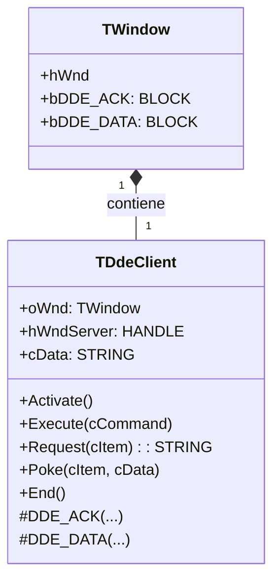
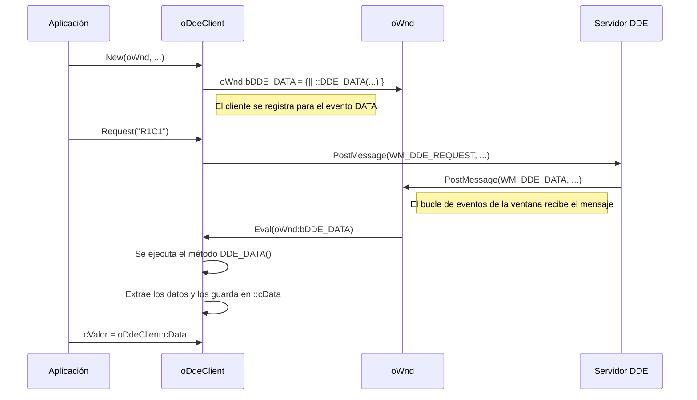

# Análisis del archivo: ddeclien.prg

## 1. Descripción general del archivo

El archivo `ddeclien.prg` define la clase `TDdeClient`, una implementación más completa y robusta de un cliente de **DDE (Dynamic Data Exchange)** que la vista en `dde.prg`. Esta clase está diseñada para ser propiedad de un objeto de ventana (`TWindow`) y utiliza un enfoque basado en codeblocks para manejar los mensajes DDE entrantes, lo que la integra mejor en la arquitectura de FiveWin.

Además de ejecutar comandos, `TDdeClient` soporta explícitamente las operaciones de `REQUEST` (solicitar datos de un servidor) y `POKE` (enviar datos a un servidor), que son fundamentales en DDE. El lenguaje utilizado es **Harbour**.

## 2. Explicación línea por línea

```harbour
CLASS TDdeClient
   DATA   oWnd
   DATA   hService, hTopic, hItem
   DATA   hWndServer
   DATA   cData, hData
```
- **Líneas 25-48**: Definición de la clase `TDdeClient`.
    - `oWnd`: Una referencia al objeto de ventana principal de la aplicación cliente. Esta ventana será la que reciba los mensajes de respuesta del servidor DDE.
    - `hService`, `hTopic`, `hItem`: Handles a los átomos globales para el servicio, tema e ítem de la conversación DDE.
    - `hWndServer`: El handle de la ventana de la aplicación servidora.
    - `cData`: Una propiedad para almacenar los datos de texto recibidos en una operación `REQUEST`.
    - `hData`: Un handle a un bloque de memoria global utilizado para enviar datos en una operación `POKE`.

```harbour
METHOD New( oWnd, cService, cTopic ) CONSTRUCTOR
   ::oWnd     = oWnd
   ::hService = GlobalAddAtom( cService )
   ::hTopic   = GlobalAddAtom( cTopic )
   ...
   ::oWnd:bDDE_ACK  = { | nWParam, nLParam | ::DDE_ACK( nWParam, nLParam ) }
   ::oWnd:bDDE_DATA = { | nWParam, nLParam | ::DDE_DATA( nWParam, nLParam ) }
```
- **Líneas 58-69**: El constructor.
    1.  Almacena la referencia a la ventana propietaria (`oWnd`).
    2.  Crea los átomos para el servicio y el tema.
    3.  **Inyección de Codeblocks**: Asigna dos codeblocks a propiedades del objeto `oWnd` (`bDDE_ACK` y `bDDE_DATA`). Esto es un mecanismo de FiveWin para que la ventana `oWnd`, al recibir los mensajes `WM_DDE_ACK` o `WM_DDE_DATA`, ejecute el código contenido en estos bloques. El código, a su vez, llama a los métodos `::DDE_ACK` y `::DDE_DATA` del propio objeto `TDdeClient`. Así es como los mensajes DDE se enrutan al objeto cliente correcto.

```harbour
METHOD Activate( nWait ) CLASS TDdeClient
   SendMessage( -1, WM_DDE_INITIATE, ::oWnd:hWnd, ... )
```
- **Líneas 73-93**: Inicia la conversación DDE, de forma similar a `TDde`, emitiendo un `WM_DDE_INITIATE` a todas las ventanas.

```harbour
METHOD Request( nType, cCommand, nWaitOk ) CLASS TDdeClient
   ::hItem = GlobalAddAtom( cCommand )
   postmessage(::hWndServer, WM_DDE_REQUEST, ::oWnd:hWnd, nMakeLong( nType , ::hItem ) )
```
- **Líneas 121-150**: Implementa la solicitud de datos. Crea un átomo para el `cCommand` (que aquí actúa como el "Item" que se solicita) y envía un mensaje `WM_DDE_REQUEST` al servidor. La respuesta del servidor será un mensaje `WM_DDE_DATA`.

```harbour
METHOD Poke( nType, cItem, cData, nWaitOk ) CLASS TDdeClient
   ::hItem = GlobalAddAtom( cItem )
   ::hData = CrDdePoke( cData )
   PostMessage(::hWndServer, WM_DDE_POKE, ::oWnd:hWnd, nMakeLong( ::hData , ::hItem ) )
```
- **Líneas 156-184**: Implementa el envío de datos. Crea un átomo para el `cItem` y, lo más importante, utiliza una función (`CrDdePoke`) para crear un objeto de memoria global compartida que contiene `cData`. El handle a este objeto de memoria (`hData`) se envía al servidor en el mensaje `WM_DDE_POKE`.

```harbour
METHOD DDE_ACK (nWParam,nLParam) CLASS TDdeClient
   if nLastMsg = WM_DDE_INITIATE
      ::hWndServer = nWParam
      ::lActive=.t.
   elseif nLastMsg = WM_DDE_EXECUTE
      GlobalFree( nHiWord(nLParam) )
      ::lCommand = .t.
   // ... y otros casos
```
- **Líneas 207-240**: Este método es el **manejador de eventos para los mensajes `WM_DDE_ACK`**. Se ejecuta cuando la ventana principal recibe esa notificación. Su lógica depende del último mensaje que se envió (`nLastMsg`):
    - Si fue un `INITIATE`, guarda el `hWnd` del servidor.
    - Si fue un `EXECUTE`, libera la memoria del comando.
    - Si fue un `REQUEST` o `POKE`, procesa la estructura de acknowledge para ver si la operación fue exitosa, si el servidor está ocupado, etc.

```harbour
METHOD DDE_DATA (nWParam,nLParam) CLASS TDdeClient
   ::cData=GetDdeData(nLoWord(nLParam))
   GlobalFree( nLoWord(nLParam) )
   ::lCommand=.t.
```
- **Líneas 246-254**: Este es el **manejador de eventos para los mensajes `WM_DDE_DATA`**. Se dispara cuando el servidor responde a un `REQUEST`. Extrae los datos del objeto de memoria compartida (`GetDdeData`), los guarda en `::cData`, y libera la memoria.

## 3. Funcionalidad principal

`TDdeClient` es un cliente DDE más completo que `TDde`. En lugar de depender de un array global, se asocia directamente a una ventana (`TWindow`), lo que permite un manejo más limpio de múltiples instancias. Soporta el ciclo de vida completo de una conversación DDE, incluyendo no solo la ejecución de comandos, sino también la solicitud y el envío de datos.

- **Ciclo de vida**: `Activate()` inicia la conexión, `Execute()`, `Request()` y `Poke()` realizan las operaciones, y `End()` termina la conexión.
- **Manejo de Eventos por Codeblocks**: Se integra con el bucle de mensajes de FiveWin de una manera más elegante, asignando sus propios métodos como manejadores de eventos a la ventana propietaria.
- **Soporte para `REQUEST` y `POKE`**: Implementa la lógica para solicitar datos de un servidor (y recibirlos en `DDE_DATA`) y para enviar datos a un servidor (y recibir la confirmación en `DDE_ACK`).
- **Manejo de Estado**: Utiliza una variable de estado (`nLastMsg`) y flags (`lCommand`) para gestionar la naturaleza asíncrona de la comunicación DDE, aunque todavía recurre a bucles de espera activa (`busy-wait`) que son problemáticos.

## 4. Diagramas Mermaid

### Diagrama de Clases (Composición)



### Diagrama de Secuencia para un `REQUEST` de Datos



### Diagrama de Flujo del Manejador `DDE_ACK`

```mermaid
flowchart TD
    A[Inicio: Método DDE_ACK(nWParam, nLParam)] --> B{¿Cuál fue el último mensaje enviado (nLastMsg)?};
    B -- WM_DDE_INITIATE --> C[Guardar hWnd del servidor (nWParam) en ::hWndServer];
    C --> C1[Marcar conexión como activa (::lActive = .T.)];
    B -- WM_DDE_EXECUTE --> D[Liberar memoria del comando (GlobalFree)];
    D --> D1[Marcar comando como completado (::lCommand = .T.)];
    B -- WM_DDE_REQUEST --> E[Solicitud fallida, ::cData = NIL];
    E --> E1[Procesar estructura ACK para ver si fue OK, BUSY, etc.];
    E1 --> D1;
    B -- WM_DDE_POKE --> F[Procesar estructura ACK para ver si fue OK, BUSY, etc.];
    F --> F1[Liberar memoria de los datos enviados (GlobalFree)];
    F1 --> D1;
    C1 --> Z[Fin];
    D1 --> Z;
```

## 5. Relaciones con otros módulos

- **Dependencias**:
    - **`TWindow`**: Es una dependencia **crítica**. La clase `TDdeClient` está diseñada para ser propiedad de un objeto `TWindow` y depende de él para recibir los mensajes DDE de respuesta a través de los codeblocks `bDDE_ACK` y `bDDE_DATA`.
    - **`FiveWin.ch`**: Proporciona las constantes y funciones de la API de Windows.

- **Módulos que lo llaman**:
    - Módulos de aplicación que necesiten una comunicación DDE más sofisticada que la simple ejecución de comandos, como solicitar el contenido de una celda de Excel o "pokear" (insertar) datos en un documento de Word.

- **Módulos que él llama**:
    - Al igual que `TDde`, solo llama a funciones de la **API de Windows**.

- **Integración en la arquitectura**:
    - `TDdeClient` representa un patrón de diseño más avanzado que `TDde`. En lugar de usar variables y arrays globales, se encapsula y se asocia a una instancia de ventana específica. Esto es **composición** (`TWindow` *tiene un* `TDdeClient`).
    - El mecanismo de **inyección de dependencias** a través de codeblocks (`oWnd:bDDE_ACK = { ... }`) es una técnica de programación muy potente en Harbour/FiveWin. Permite que el objeto `TWindow` (que no sabe nada de DDE) notifique a su objeto `TDdeClient` contenido cuando llegan los mensajes relevantes. Esto desacopla la lógica de la ventana de la lógica del cliente DDE, lo que resulta en un código más limpio y modular.
