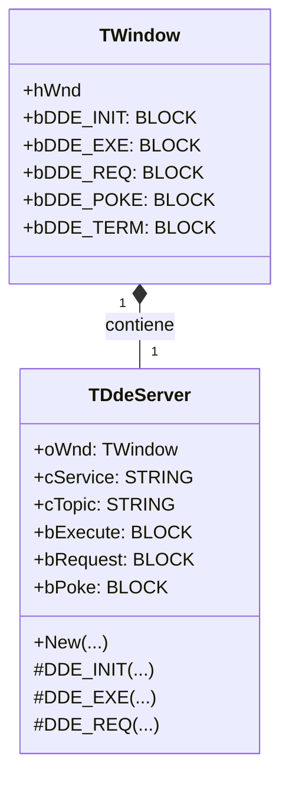
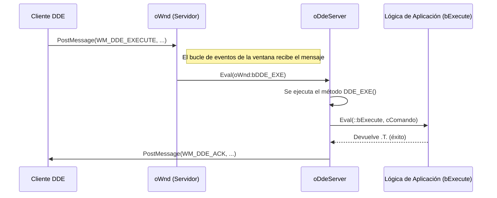

# Análisis del archivo: ddeserv.prg

## 1. Descripción general del archivo

El archivo `ddeserv.prg` define la clase `TDdeServer`, que permite a una aplicación FiveWin actuar como un **servidor DDE (Dynamic Data Exchange)**. Es la contraparte de las clases de cliente DDE (`TDde`, `TDdeClient`). Su función es registrar un "servicio" y un "tema" y responder a las solicitudes de conexión, ejecución de comandos, petición de datos (`REQUEST`) y envío de datos (`POKE`) de aplicaciones cliente DDE.

Esta clase se integra con el bucle de mensajes de una ventana `TWindow` para interceptar y manejar los mensajes del protocolo DDE entrantes. El lenguaje utilizado es **Harbour**.

## 2. Explicación línea por línea

```harbour
CLASS TDdeServer
   DATA   oWnd
   DATA   cService, cTopic
   DATA   bInit, bExecute, bRequest, bPoke, bTerminate
   DATA   lActive
   DATA   hClientHandle
```
- **Líneas 28-40**: Definición de la clase `TDdeServer`.
    - `oWnd`: El objeto de ventana que actuará como servidor y recibirá los mensajes DDE.
    - `cService`, `cTopic`: Cadenas de texto que identifican el nombre del servicio y el tema que este servidor ofrece. Por ejemplo, `cService` podría ser "MIAPP" y `cTopic` podría ser "System".
    - `bInit`, `bExecute`, `bRequest`, `bPoke`, `bTerminate`: **Bloques de código (codeblocks)** que el programador proporciona para definir el comportamiento del servidor. Cada bloque corresponde a un mensaje DDE específico.
    - `lActive`: Un flag que indica si hay una conversación DDE activa.
    - `hClientHandle`: El handle de la ventana (`hWnd`) de la aplicación cliente que está actualmente conectada.

```harbour
METHOD New( oWnd, cService, cTopic, bInit, bExecute, ... ) CONSTRUCTOR
   ...
   ::oWnd:bDDE_INIT={|nWParam,nLParam|::DDE_Initiate(nWParam,nLParam)}
   ::oWnd:bDDE_EXE={|nWParam,nLParam|::DDE_EXE(nWParam,nLParam)}
   // ... y así para REQ, POKE, TERM
```
- **Líneas 48-64**: El constructor.
    1.  Almacena la ventana propietaria (`oWnd`), los nombres de servicio/tema y los codeblocks de eventos.
    2.  Al igual que `TDdeClient`, utiliza la **inyección de codeblocks** en el objeto `oWnd`. Asigna sus propios métodos (`::DDE_Initiate`, `::DDE_EXE`, etc.) como manejadores para los mensajes DDE que la ventana `oWnd` recibirá. Esto conecta eficazmente el bucle de eventos de la ventana con la lógica del servidor DDE.

```harbour
METHOD DDE_INIT (nWParam,nLParam) CLASS TDdeServer
   cService=upper(GlobalGetAtom(nLoWord(nLParam)))
   cTopic=upper(GlobalGetAtom(nHiWord(nLParam)))
   if cService==::cService .and. cTopic==::cTopic
      ::hClientHandle=nWParam
      if eval(::bInit,cService,cTopic)=.f.
         // No aceptar la conexión
      else
         PostMessage(::hClientHandle, WM_DDE_ACK, ::oWnd:hWnd, nLParam )
         ::lActive=.t.
      endif
   endif
```
- **Líneas 76-98**: El manejador para `WM_DDE_INITIATE`.
    1.  Un cliente ha enviado una solicitud de conexión. El método extrae el servicio y el tema de los átomos en `nLParam`.
    2.  Comprueba si coinciden con el servicio y tema que este servidor ofrece.
    3.  Si coinciden, guarda el `hWnd` del cliente (`nWParam`) en `::hClientHandle`.
    4.  Ejecuta el codeblock `bInit` proporcionado por el usuario. Si `bInit` devuelve `.F.`, la conexión se rechaza.
    5.  Si la conexión se acepta, envía un mensaje `WM_DDE_ACK` de vuelta al cliente para confirmar la conexión y se marca como activa (`::lActive = .t.`).

```harbour
METHOD DDE_EXE (nWParam,nLParam) CLASS TDdeServer
   cData=DdeGetCommand( nLParam )
   if valtype(::bExecute)="B"
      if eval(::bExecute,cData)=.t.
         lAck=.t.
      else
         lBusy=.t.
      endif
   endif
   hAck=CrDdeAck( nRetCode,lBusy,lAck )
   PostMessage( ::hClientHandle, WM_DDE_ACK, ... )
```
- **Líneas 102-122**: El manejador para `WM_DDE_EXECUTE`.
    1.  Extrae la cadena de comando del mensaje (`DdeGetCommand`).
    2.  Ejecuta el codeblock `bExecute` del usuario, pasándole el comando recibido.
    3.  Basándose en el resultado de `bExecute`, construye una respuesta `ACK` indicando si el comando fue aceptado (`lAck=.t.`) u ocupado (`lBusy=.t.`).
    4.  Envía el `WM_DDE_ACK` de vuelta al cliente.

```harbour
METHOD DDE_REQ (nWParam,nLParam) CLASS TDdeServer
   cItem=GlobalGetAtom(nHiWord(nLParam))
   if valtype(::bRequest)="B"
      cData=eval(::bRequest,cItem)
      if valtype(cData)="C"
         hData=CrDdeData(cData)
         PostMessage(::hClientHandle, WM_DDE_DATA, ...)
         lOk=.t.
      endif
   endif
   if lOk=.f.
      // Enviar ACK negativo
   endif
```
- **Líneas 126-153**: El manejador para `WM_DDE_REQUEST`.
    1.  Extrae el "Item" (el dato que se solicita) del mensaje.
    2.  Ejecuta el codeblock `bRequest` del usuario, pasándole el nombre del ítem.
    3.  Se espera que `bRequest` devuelva una cadena de texto con los datos solicitados.
    4.  Si se devuelve una cadena, la empaqueta en un objeto de memoria global (`CrDdeData`) y la envía al cliente a través de un mensaje `WM_DDE_DATA`.
    5.  Si `bRequest` no devuelve una cadena, se envía un `WM_DDE_ACK` negativo para indicar que la solicitud falló.

## 3. Funcionalidad principal

`TDdeServer` permite que una aplicación FiveWin exponga una interfaz DDE para ser controlada por otras aplicaciones. Su funcionalidad se basa en un modelo de **eventos definidos por el usuario a través de codeblocks**.

1.  **Registro del Servidor**: Al crear una instancia de `TDdeServer`, la aplicación comienza a escuchar las solicitudes de conexión DDE que coincidan con el servicio y tema especificados.
2.  **Manejo de Conexiones**: Gestiona el handshake de conexión (`INITIATE`/`ACK`) con los clientes.
3.  **Despacho de Comandos**: Cuando recibe un mensaje DDE (`EXECUTE`, `REQUEST`, `POKE`, `TERMINATE`), lo despacha al codeblock correspondiente (`bExecute`, `bRequest`, etc.) que ha sido proporcionado por el programador de la aplicación.
4.  **Respuesta al Cliente**: Se encarga de formular y enviar los mensajes de respuesta apropiados (`ACK` o `DATA`) al cliente DDE.

En resumen, `TDdeServer` actúa como un **adaptador** entre el protocolo de mensajería de bajo nivel de DDE y un modelo de eventos de alto nivel basado en codeblocks, que es idiomático en Harbour/xBase.

## 4. Diagramas Mermaid

### Diagrama de Clases (Composición)



### Diagrama de Secuencia de una Solicitud `EXECUTE`



### Diagrama de Flujo del Manejador `DDE_INIT`

```mermaid
flowchart TD
    A[Inicio: Método DDE_INIT(nWParam, nLParam)] --> B[Extraer Service y Topic de los átomos];
    B --> C{¿Coinciden con ::cService y ::cTopic?};
    C -- No --> Z[Fin, ignorar mensaje];
    C -- Sí --> D[Guardar hWnd del cliente (nWParam)];
    D --> E{¿Existe un codeblock bInit?};
    E -- Sí --> F{Eval(::bInit)};
    F -- Devuelve .F. --> Z;
    F -- Devuelve .T. / No existe bInit --> G[Enviar WM_DDE_ACK al cliente];
    G --> H[Marcar conexión como activa (::lActive = .T.)];
    H --> Z;
```

## 5. Relaciones con otros módulos

- **Dependencias**:
    - **`TWindow`**: Es una dependencia **crítica**. La clase `TDdeServer` debe estar asociada a un objeto `TWindow` para poder interceptar los mensajes DDE entrantes.
    - **`FiveWin.ch`**: Proporciona las constantes de mensajes DDE y las declaraciones de funciones de la API de Windows.

- **Módulos que lo llaman**:
    - El código de inicialización de la aplicación. Típicamente, se crea una instancia de `TDdeServer` al inicio del programa y se asocia a la ventana principal para que la aplicación esté lista para recibir conexiones DDE durante toda su vida útil.

- **Módulos que él llama**:
    - Llama a funciones de la **API de Windows** para gestionar átomos y enviar mensajes.
    - Llama a los **codeblocks** (`bInit`, `bExecute`, etc.) que le proporciona el programador de la aplicación. Estos codeblocks son la puerta de entrada para que DDE interactúe con la lógica de negocio de la aplicación.

- **Integración en la arquitectura**:
    - `TDdeServer` se integra en la aplicación a través de la **composición** y la **inyección de dependencias (en forma de codeblocks)**. La ventana principal *tiene un* `TDdeServer`, y el programador le *inyecta* la lógica de negocio a través de los codeblocks en el constructor.
    - Este diseño separa claramente las responsabilidades: la clase `TDdeServer` se encarga del protocolo DDE de bajo nivel, mientras que los codeblocks se encargan de la lógica específica de la aplicación. Esto hace que el código sea modular y que la clase `TDdeServer` sea reutilizable en diferentes aplicaciones con diferentes necesidades de servidor DDE.
