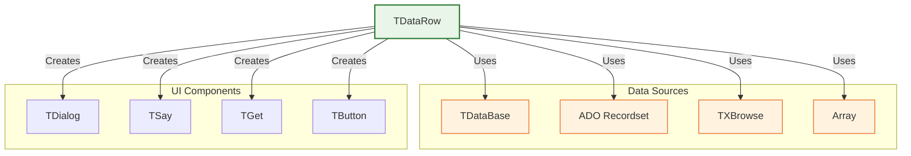
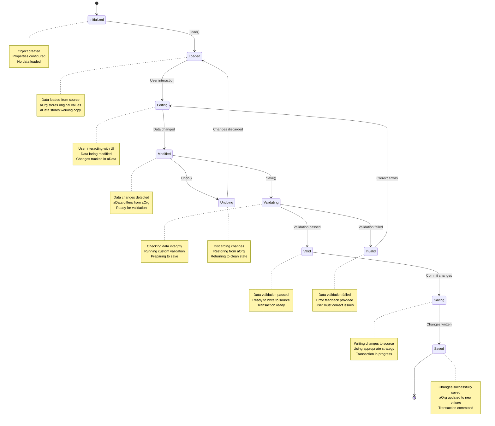

# TDataRow Class

The `TDataRow` class provides a comprehensive abstraction for managing a single data record, serving as an intermediary between various data sources and user interfaces for data editing. It implements the core functionality for loading, editing, and saving individual records.

**Source File:** [source/classes/datarow.prg](../../../source/classes/datarow.prg)

## Overview

The `TDataRow` class is designed to decouple user interface logic from underlying data sources by providing a uniform interface for record-level data operations. It supports multiple data source types including DBF files, SQL databases via ADO, arrays, and other FiveWin data components.

As a key component in FiveWin's data architecture, `TDataRow` enables developers to create consistent data editing experiences regardless of the underlying data storage mechanism.

## Class Hierarchy



## Data Editing Lifecycle



## Key Properties

| Property | Type | Description |
|----------|------|-------------|
| `aData` | `Array` | Working copy of record data with field information |
| `aOrg` | `Array` | Original copy of record data for change tracking |
| `uSource` | `Any` | Reference to original data source (DBF, ADO, array, etc.) |
| `cSrcType` | `String` | Type identifier for data source ("DBF", "ADO", "ARR", etc.) |
| `bSave` | `Codeblock` | Custom save logic override |
| `bEdit` | `Codeblock` | Custom edit logic override |
| `bValid` | `Codeblock` | Record-level validation logic |
| `bTrigger` | `Codeblock` | Trigger logic for field changes |
| `bGoTop` | `Codeblock` | Custom first record navigation |
| `bGoBottom` | `Codeblock` | Custom last record navigation |
| `bGoUp` | `Codeblock` | Custom previous record navigation |
| `bGoDown` | `Codeblock` | Custom next record navigation |

## Key Methods

| Method | Description |
|--------|-------------|
| `New(uSource, cFieldList, lBlank, aInitVals)` | Constructor for creating a new data row |
| `Load(lBlank)` | Loads data from source into working buffer |
| `Save(lCheckValid, lSilent)` | Saves changes from working buffer to source |
| `Undo(fld)` | Discards changes and restores original values |
| `Modified(fld)` | Checks if data has been modified |
| `Edit(lReadOnly, lNavigate, cTitle, cMsg)` | Automatically creates edit dialog |
| `FieldGet(cField)` | Gets value of specified field |
| `FieldPut(cField, uValue)` | Sets value of specified field |
| `FieldBlock(cField)` | Returns codeblock for field binding |
| `CommitTrans()` | Commits database transaction |
| `RollBack()` | Rolls back database transaction |

## Strategy Pattern Implementation

```mermaid
graph TD
    A[Save()] --> B{Has Changes?}
    B -- No --> C[Return .F.]
    B -- Yes --> D{Validate Data}
    D -- Invalid --> E[Show Error]
    D -- Valid --> F{Determine Source Type}
    F --> G{Switch cSrcType}
    
    subgraph "Source-Specific Save Strategies"
        G --> H["DBF: SaveDBF()"]
        G --> I["ADO: SaveADO()"]
        G --> J["XBR: SaveXBR()"]
        G --> K["ARR: SaveARR()"]
        G --> L["...: Save...()"]
    end
    
    H --> M{Save Successful?}
    I --> M
    J --> M
    K --> M
    L --> M
    
    M -- Yes --> N[Commit Transaction]
    M -- No --> O[Rollback Transaction]
    N --> P[Return .T.]
    O --> Q[Return .F.]
    E --> R[Return .F.]
    C --> S[Return .F.]
```

## Usage Patterns

### Basic Record Editing with DBF Source

```harbour
#include "FiveWin.ch"

function Main()
   local oDb, oDataRow
   
   // Open database
   oDb := TDataBase():New( "customers.dbf" )
   if !oDb:Open()
      MsgStop( "Cannot open database" )
      return .F.
   endif
   
   // Create data row for current record
   oDataRow := TDataRow():New( oDb )
   
   // Load current record data
   oDataRow:Load()
   
   // Edit record in automatic dialog
   if oDataRow:Edit( .F., .T., "Edit Customer" )
      MsgInfo( "Record updated successfully" )
   endif
   
   // Clean up
   oDb:Close()
   
return .T.
```

### Custom Data Row with Array Source

```harbour
#include "FiveWin.ch"

function Main()
   local aSource, oDataRow
   local aFieldData := { ;
      { "Name", "John Doe", .T., "@!" }, ;
      { "Age", 30, .T., "999" }, ;
      { "Email", "john@example.com", .T., "@!" }, ;
      { "Active", .T., .T., "L" } ;
   }
   
   // Create array data source
   aSource := { ;
      { "Name", "Age", "Email", "Active" }, ;  // Field names
      { "John Doe", 30, "john@example.com", .T. }, ;  // Record data
      { "Jane Smith", 25, "jane@example.com", .T. } ;
   }
   
   // Create data row with array source
   oDataRow := TDataRow():New( aSource )
   oDataRow:Load()  // Load first record
   
   // Add custom validation
   oDataRow:bValid := { || ValidateCustomerData( oDataRow ) }
   
   // Edit with custom dialog
   if oDataRow:Edit( .F., .F., "Customer Information" )
      MsgInfo( "Customer data saved" )
   endif
   
return nil

static function ValidateCustomerData( oDataRow )
   local cName := oDataRow:FieldGet( "Name" )
   local nAge := oDataRow:FieldGet( "Age" )
   local cEmail := oDataRow:FieldGet( "Email" )
   
   if Empty( AllTrim( cName ) )
      MsgAlert( "Name is required" )
      return .F.
   endif
   
   if nAge < 18 .or. nAge > 120
      MsgAlert( "Age must be between 18 and 120" )
      return .F.
   endif
   
   if !IsValidEmail( cEmail )
      MsgAlert( "Please enter a valid email address" )
      return .F.
   endif
   
return .T.

static function IsValidEmail( cEmail )
   return ( At( "@", cEmail ) > 1 .and. ;
            At( ".", cEmail ) > At( "@", cEmail ) )
```

### Manual Record Editing with Custom UI

```harbour
#include "FiveWin.ch"

function EditEmployee( oEmployeeDb )
   local oDlg, oDataRow
   local cName, nSalary, dHireDate, lActive
   
   // Create data row from database
   oDataRow := TDataRow():New( oEmployeeDb )
   oDataRow:Load()
   
   // Get field values for binding
   cName := oDataRow:FieldGet( "Name" )
   nSalary := oDataRow:FieldGet( "Salary" )
   dHireDate := oDataRow:FieldGet( "HireDate" )
   lActive := oDataRow:FieldGet( "Active" )
   
   // Create custom dialog
   DEFINE DIALOG oDlg TITLE "Edit Employee" ;
      FROM 0, 0 TO 200, 300
   
   @ 10, 10 SAY "Name:" OF oDlg
   @ 10, 30 GET cName OF oDlg SIZE 150, 12 ;
      VALID { || !Empty( AllTrim( cName ) ) } ;
      MESSAGE "Name is required"
   
   @ 30, 10 SAY "Salary:" OF oDlg
   @ 30, 30 GET nSalary OF oDlg SIZE 100, 12 ;
      PICTURE "@E 999,999.99" ;
      VALID { || nSalary > 0 } ;
      MESSAGE "Salary must be greater than zero"
   
   @ 50, 10 SAY "Hire Date:" OF oDlg
   @ 50, 30 GET dHireDate OF oDlg SIZE 80, 12 ;
      PICTURE "@D"
   
   @ 70, 10 CHECKBOX lActive OF oDlg ;
      PROMPT "Active Employee"
   
   @ 100, 30 BUTTON "Save" OF oDlg ;
      ACTION ( SaveEmployee( oDataRow, cName, nSalary, dHireDate, lActive ), oDlg:End() )
   
   @ 100, 90 BUTTON "Cancel" OF oDlg ;
      ACTION oDlg:End()
   
   ACTIVATE DIALOG oDlg CENTERED
   
return nil

static function SaveEmployee( oDataRow, cName, nSalary, dHireDate, lActive )
   // Update data row with new values
   oDataRow:FieldPut( "Name", cName )
   oDataRow:FieldPut( "Salary", nSalary )
   oDataRow:FieldPut( "HireDate", dHireDate )
   oDataRow:FieldPut( "Active", lActive )
   
   // Add custom validation
   oDataRow:bValid := { || ValidateEmployee( oDataRow ) }
   
   // Save changes
   if oDataRow:Save()
      MsgInfo( "Employee record updated successfully" )
      return .T.
   else
      MsgAlert( "Failed to update employee record" )
      return .F.
   endif
   
return .T.

static function ValidateEmployee( oDataRow )
   local cName := oDataRow:FieldGet( "Name" )
   local nSalary := oDataRow:FieldGet( "Salary" )
   
   if Empty( AllTrim( cName ) )
      return .F.
   endif
   
   if nSalary <= 0
      return .F.
   endif
   
return .T.
```

### Record Navigation with Custom Buttons

```harbour
#include "FiveWin.ch"

function BrowseCustomers( oCustomerDb )
   local oDlg, oDataRow
   
   // Create data row with navigation support
   oDataRow := TDataRow():New( oCustomerDb )
   oDataRow:Load()
   
   // Set up navigation handlers
   oDataRow:bGoTop := { || NavigateToTop( oDataRow ) }
   oDataRow:bGoBottom := { || NavigateToBottom( oDataRow ) }
   oDataRow:bGoUp := { || NavigateUp( oDataRow ) }
   oDataRow:bGoDown := { || NavigateDown( oDataRow ) }
   
   // Create navigation dialog
   DEFINE DIALOG oDlg TITLE "Customer Browser" ;
      FROM 0, 0 TO 250, 350
   
   // Display current record data
   @ 10, 10 SAY "ID:" OF oDlg
   @ 10, 30 SAY oDataRow:FieldGet( "ID" ) OF oDlg SIZE 100, 12
   
   @ 30, 10 SAY "Name:" OF oDlg
   @ 30, 30 SAY oDataRow:FieldGet( "Name" ) OF oDlg SIZE 150, 12
   
   @ 50, 10 SAY "Email:" OF oDlg
   @ 50, 30 SAY oDataRow:FieldGet( "Email" ) OF oDlg SIZE 150, 12
   
   // Navigation buttons
   @ 80, 10 BUTTON "|<" OF oDlg ;
      ACTION NavigateToTop( oDataRow )
   
   @ 80, 40 BUTTON "<" OF oDlg ;
      ACTION NavigateUp( oDataRow )
   
   @ 80, 70 BUTTON ">" OF oDlg ;
      ACTION NavigateDown( oDataRow )
   
   @ 80, 100 BUTTON ">|" OF oDlg ;
      ACTION NavigateToBottom( oDataRow )
   
   @ 120, 10 BUTTON "Edit" OF oDlg ;
      ACTION EditCurrentRecord( oDataRow )
   
   @ 120, 70 BUTTON "Close" OF oDlg ;
      ACTION oDlg:End()
   
   ACTIVATE DIALOG oDlg CENTERED
   
return nil

static function NavigateToTop( oDataRow )
   oDataRow:uSource:GoTop()
   oDataRow:Load()
   RefreshDisplay( oDataRow:oWnd )
return nil

static function NavigateToBottom( oDataRow )
   oDataRow:uSource:GoBottom()
   oDataRow:Load()
   RefreshDisplay( oDataRow:oWnd )
return nil

static function NavigateUp( oDataRow )
   if !oDataRow:uSource:BOF()
      oDataRow:uSource:Skip( -1 )
      oDataRow:Load()
      RefreshDisplay( oDataRow:oWnd )
   endif
return nil

static function NavigateDown( oDataRow )
   if !oDataRow:uSource:EOF()
      oDataRow:uSource:Skip( 1 )
      oDataRow:Load()
      RefreshDisplay( oDataRow:oWnd )
   endif
return nil

static function RefreshDisplay( oDlg )
   // Refresh all SAY controls with current data
   oDlg:Refresh()
return nil

static function EditCurrentRecord( oDataRow )
   if oDataRow:Edit( .F., .F., "Edit Customer" )
      RefreshDisplay( oDataRow:oWnd )
   endif
return nil
```

## Advanced Features

### Transaction Management

```harbour
#include "FiveWin.ch"

function UpdateCustomerWithTransaction( oCustomerDb, nCustomerId )
   local oDataRow
   
   // Create data row
   oDataRow := TDataRow():New( oCustomerDb )
   oDataRow:Load()
   
   // Start transaction
   if oDataRow:uSource:StartTrans()
      try
         // Make changes
         oDataRow:FieldPut( "LastUpdated", Date() )
         oDataRow:FieldPut( "UpdatedBy", "SYSTEM" )
         
         // Add custom save logic
         oDataRow:bSave := { || CustomSaveLogic( oDataRow ) }
         
         // Save with transaction
         if oDataRow:Save()
            oDataRow:CommitTrans()
            MsgInfo( "Customer updated successfully" )
            return .T.
         else
            oDataRow:RollBack()
            MsgAlert( "Failed to update customer" )
            return .F.
         endif
      catch
         oDataRow:RollBack()
         MsgAlert( "Error updating customer: " + hb_errorDesc() )
         return .F.
      endtry
   else
      MsgAlert( "Cannot start transaction" )
      return .F.
   endif
   
return .T.

static function CustomSaveLogic( oDataRow )
   // Custom save logic here
   // This could include logging, audit trails, etc.
   LogCustomerUpdate( oDataRow )
return .T.

static function LogCustomerUpdate( oDataRow )
   local cLogEntry := "Customer " + AllTrim( oDataRow:FieldGet( "Name" ) ) + ;
                     " updated on " + DToC( Date() )
   // Write to log file or database
   ? cLogEntry
return nil
```

### Field-Level Validation and Triggers

```harbour
#include "FiveWin.ch"

function CreateValidatedCustomerRow( oCustomerDb )
   local oDataRow
   
   // Create data row
   oDataRow := TDataRow():New( oCustomerDb )
   oDataRow:Load()
   
   // Add field-level validation
   oDataRow:bValid := { || ValidateCustomerRecord( oDataRow ) }
   
   // Add field triggers
   oDataRow:bTrigger := { |cField, uOldVal, uNewVal| ;
                         FieldChanged( oDataRow, cField, uOldVal, uNewVal ) }
   
   // Edit with validation
   if oDataRow:Edit( .F., .F., "Customer Information" )
      MsgInfo( "Customer saved with validation" )
   endif
   
return nil

static function ValidateCustomerRecord( oDataRow )
   local cEmail := oDataRow:FieldGet( "Email" )
   local cPhone := oDataRow:FieldGet( "Phone" )
   
   // Validate email format
   if !Empty( cEmail ) .and. !IsValidEmail( cEmail )
      MsgAlert( "Please enter a valid email address" )
      return .F.
   endif
   
   // Validate phone format
   if !Empty( cPhone ) .and. !IsValidPhone( cPhone )
      MsgAlert( "Please enter a valid phone number" )
      return .F.
   endif
   
return .T.

static function FieldChanged( oDataRow, cField, uOldVal, uNewVal )
   local cLogEntry := "Field " + cField + " changed from " + ;
                     ValToStr( uOldVal ) + " to " + ValToStr( uNewVal )
   ? cLogEntry
   
   // Special handling for specific fields
   switch cField
   case "Status"
      if uNewVal == "INACTIVE"
         // Send notification when customer becomes inactive
         SendInactivationNotice( oDataRow )
      endif
      exit
   endswitch
   
return .T.

static function IsValidEmail( cEmail )
   return ( At( "@", cEmail ) > 1 .and. ;
            At( ".", cEmail ) > At( "@", cEmail ) )
   
return .T.

static function IsValidPhone( cPhone )
   // Simple phone validation
   return ( Len( AllTrim( cPhone ) ) >= 10 )
   
return .T.

static function SendInactivationNotice( oDataRow )
   local cName := oDataRow:FieldGet( "Name" )
   local cEmail := oDataRow:FieldGet( "Email" )
   
   if !Empty( cEmail )
      // Send email notification
      ? "Sending inactivation notice to " + cName + " at " + cEmail
   endif
   
return nil
```

## Related Components

* [TDataBase Class](TDataBase.md) - Database management class
* [TXBrowse Class](TXBrowse.md) - Data browsing component
* [TDialog Class](TDialog.md) - Dialog window for UI creation
* [TGet Class](TGet.md) - Data entry control
* [ADO Classes](ADO.md) - ActiveX Data Objects integration

## Best Practices

1. **Data Source Selection**: Choose appropriate data source type for your needs
2. **Validation**: Implement comprehensive data validation before saving
3. **Transaction Management**: Use transactions for critical data operations
4. **Error Handling**: Implement proper error handling with try/catch blocks
5. **Memory Management**: Clean up data row objects when no longer needed
6. **User Feedback**: Provide clear feedback for validation errors
7. **Navigation**: Implement proper record navigation for multi-record sources
8. **Customization**: Use codeblocks to customize behavior without subclassing

## Performance Considerations

* Large data rows consume more memory for `aData` and `aOrg` arrays
* Frequent `Load()` and `Save()` operations can impact performance
* Complex validation logic in `bValid` can slow down save operations
* Transaction management adds overhead but ensures data integrity
* Custom save logic in `bSave` should be optimized for performance
* Consider lazy loading for very large records
* Field-level triggers in `bTrigger` should be lightweight
* Array-based data sources are faster than database sources for simple operations