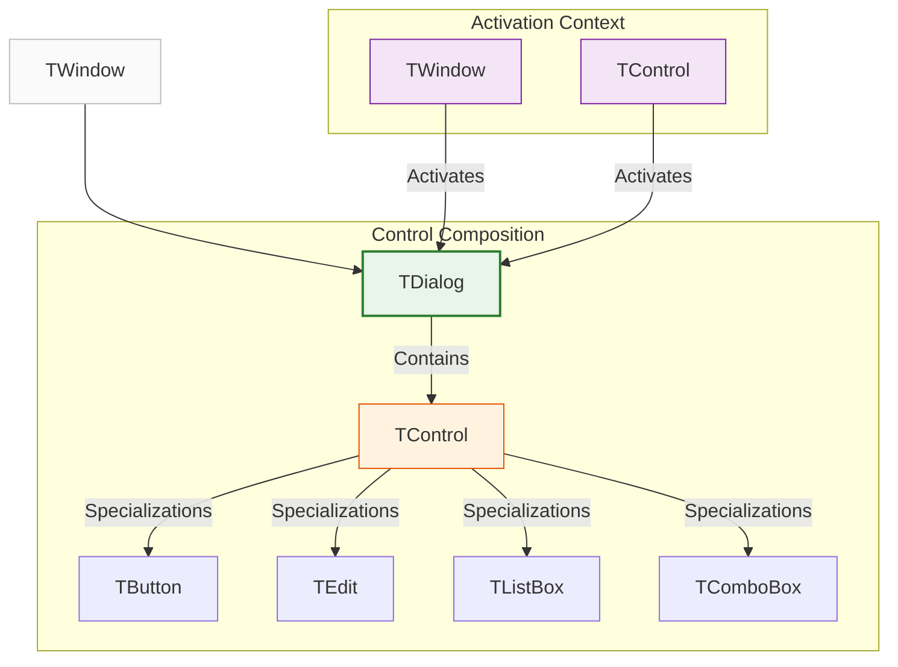
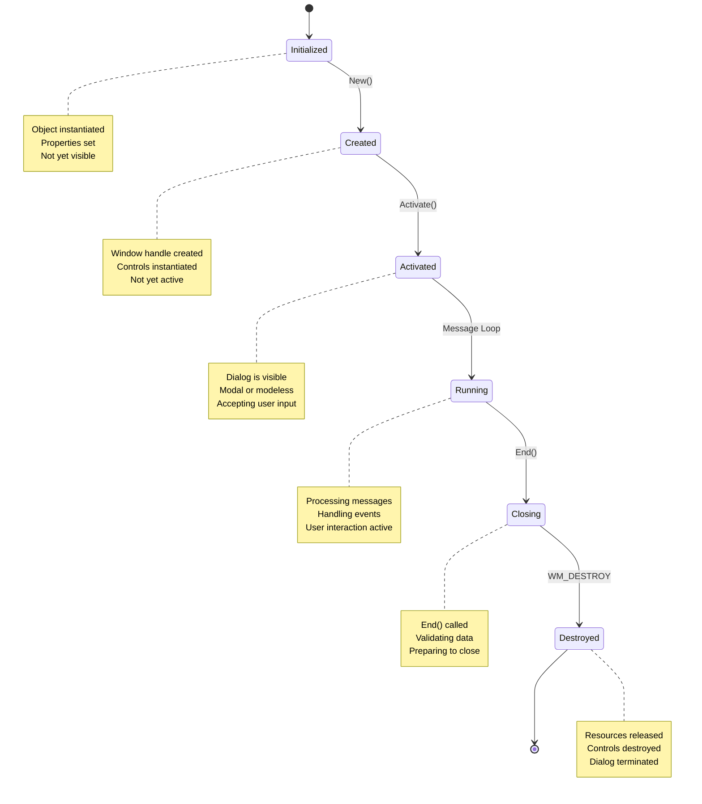
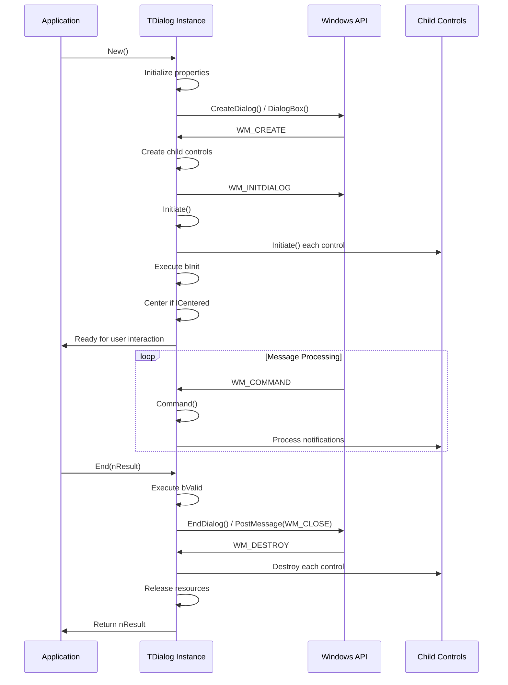

# TDialog Class

The `TDialog` class provides comprehensive functionality for creating dialog windows in FiveWin applications. It serves as a specialized container for UI controls and manages the complete lifecycle of dialog interactions.

**Source File:** [source/classes/dialog.prg](../../../../source/classes/dialog.prg)

## Overview

The `TDialog` class is the cornerstone of FiveWin's dialog system, inheriting from `TWindow` to provide an enhanced container specifically designed for user interactions. It manages:

* Dialog creation and activation
* Control containment and lifecycle management
* Message loop processing for user interactions
* Focus navigation between controls
* Modal and modeless dialog support
* MDI child window transformation
* HTML generation for web compatibility

Dialogs are fundamental UI components that facilitate user interactions through collections of controls organized in a purposeful layout.

## Class Hierarchy



## Dialog Lifecycle



## Key Properties

| Property | Type | Description |
|----------|------|-------------|
| `aControls` | `Array` | Collection of all child controls contained in the dialog |
| `lModal` | `Logical` | If `.T.`, dialog blocks parent window interaction |
| `lCentered` | `Logical` | If `.T.`, dialog automatically centers on screen or parent |
| `cResName` | `String` | Name of Windows dialog resource for resource-based dialogs |
| `bInit` | `Codeblock` | Executed after dialog and controls are initialized |
| `bValid` | `Codeblock` | Executed to validate dialog before closing |
| `nResult` | `Numeric` | Return value when dialog closes (e.g., `IDOK`, `IDCANCEL`) |
| `lMdiChild` | `Logical` | If `.T.`, dialog becomes MDI child window when activated |

## Key Methods

| Method | Description |
|--------|-------------|
| `New()` | Constructor for creating a new dialog instance |
| `Activate()` | Starts the dialog lifecycle and message processing |
| `End(nResult)` | Closes the dialog with specified result code |
| `DefControl(oCtrl)` | Adds a control object to the dialog's control collection |
| `HandleEvent()` | Main Windows message dispatcher |
| `Initiate()` | Initializes controls and executes `bInit` codeblock |
| `Command()` | Processes control notifications |
| `Html()` | Generates HTML/JavaScript representation of dialog |
| `SetAsMdiChild()` | Transforms dialog into MDI child window |

## Dialog Activation Flow



## Usage Patterns

### Basic Modal Dialog

This is the most common usage pattern for dialogs:

```harbour
#include "FiveWin.ch"

function Main()
   local oDlg, cName := Space(30), cEmail := Space(50)
   local nResult

   DEFINE DIALOG oDlg TITLE "User Information" ;
      FROM 0, 0 TO 150, 300

   @ 10, 10 SAY "Name:" OF oDlg
   @ 10, 30 GET cName OF oDlg SIZE 100, 12

   @ 30, 10 SAY "Email:" OF oDlg
   @ 30, 30 GET cEmail OF oDlg SIZE 100, 12

   @ 60, 30 BUTTON "OK" ;
      OF oDlg ;
      ACTION ( nResult := IDOK, oDlg:End() )

   @ 60, 90 BUTTON "Cancel" ;
      OF oDlg ;
      ACTION ( nResult := IDCANCEL, oDlg:End() )

   ACTIVATE DIALOG oDlg CENTERED

   if nResult == IDOK
      MsgInfo( "Name: " + AllTrim(cName) + ", Email: " + AllTrim(cEmail) )
   endif

return nil
```

### Modeless Dialog

A modeless dialog doesn't block the parent window:

```harbour
#include "FiveWin.ch"

function Main()
   local oMainWnd, oToolbox

   DEFINE WINDOW oMainWnd TITLE "Main Application" ;
      FROM 0, 0 TO 300, 400

   @ 10, 10 BUTTON "Show Toolbox" ;
      OF oMainWnd ;
      ACTION ShowToolbox( oMainWnd )

   ACTIVATE WINDOW oMainWnd

return nil

function ShowToolbox( oParent )
   local oDlg

   DEFINE DIALOG oDlg TITLE "Toolbox" ;
      FROM 0, 0 TO 150, 200 ;
      OF oParent

   @ 10, 10 BUTTON "Tool 1" OF oDlg ACTION MsgInfo("Tool 1 selected")
   @ 30, 10 BUTTON "Tool 2" OF oDlg ACTION MsgInfo("Tool 2 selected")
   @ 50, 10 BUTTON "Tool 3" OF oDlg ACTION MsgInfo("Tool 3 selected")

   // Modeless dialog - doesn't block parent
   ACTIVATE DIALOG oDlg MODAL .F. CENTERED

return nil
```

### Resource-Based Dialog

Creating a dialog from Windows resources:

```c
// In a .rc file
USER_DIALOG DIALOG 10, 10, 250, 150
CAPTION "User Registration"
STYLE DS_MODALFRAME | WS_POPUP | WS_CAPTION | WS_SYSMENU
{
    LTEXT "Name:", -1, 10, 10, 30, 12
    EDITTEXT IDC_NAME, 45, 10, 100, 12
    LTEXT "Email:", -1, 10, 30, 30, 12
    EDITTEXT IDC_EMAIL, 45, 30, 100, 12
    PUSHBUTTON "OK", IDOK, 50, 60, 40, 14
    PUSHBUTTON "Cancel", IDCANCEL, 100, 60, 40, 14
}
```

```harbour
#include "FiveWin.ch"

function Main()
   local oDlg, cName, cEmail

   // Create dialog from resource
   DEFINE DIALOG oDlg RESOURCE "USER_DIALOG"

   // Associate controls with variables
   REDEFINE GET IDC_NAME OF oDlg VAR cName
   REDEFINE GET IDC_EMAIL OF oDlg VAR cEmail

   // Associate actions with buttons
   REDEFINE BUTTON IDOK OF oDlg ;
      ACTION ( ValidateAndProcess( cName, cEmail ), oDlg:End(IDOK) )
   
   REDEFINE BUTTON IDCANCEL OF oDlg ;
      ACTION oDlg:End(IDCANCEL)

   ACTIVATE DIALOG oDlg

return nil

static function ValidateAndProcess( cName, cEmail )
   if Empty( cName ) .or. Empty( cEmail )
      MsgStop( "Please fill in all fields" )
      return .F.
   endif
   
   // Process registration
   MsgInfo( "Registered: " + AllTrim(cName) + " (" + AllTrim(cEmail) + ")" )
return .T.
```

### Dialog with Validation

```harbour
#include "FiveWin.ch"

function Main()
   local oDlg, cUsername := Space(20), cPassword := Space(20)

   DEFINE DIALOG oDlg TITLE "Login" ;
      FROM 0, 0 TO 120, 250

   @ 10, 10 SAY "Username:" OF oDlg
   @ 10, 40 GET cUsername OF oDlg SIZE 80, 12

   @ 30, 10 SAY "Password:" OF oDlg
   @ 30, 40 GET cPassword OF oDlg PASSWORD SIZE 80, 12

   @ 60, 40 BUTTON "Login" ;
      OF oDlg ;
      ACTION AttemptLogin( oDlg, cUsername, cPassword )

   @ 60, 100 BUTTON "Cancel" ;
      OF oDlg ;
      ACTION oDlg:End(IDCANCEL)

   // Set validation codeblock
   oDlg:bValid = {|| ValidateDialog( cUsername, cPassword ) }

   ACTIVATE DIALOG oDlg CENTERED

return nil

static function ValidateDialog( cUsername, cPassword )
   return !Empty( cUsername ) .and. !Empty( cPassword )

static function AttemptLogin( oDlg, cUsername, cPassword )
   if AuthenticateUser( cUsername, cPassword )
      oDlg:nResult = IDOK
      oDlg:End()
   else
      MsgStop( "Invalid username or password" )
   endif
return nil

static function AuthenticateUser( cUsername, cPassword )
   // Simulate authentication
   return ( AllTrim(cUsername) == "admin" .and. AllTrim(cPassword) == "password" )
```

## Advanced Features

### MDI Child Dialog

```harbour
#include "FiveWin.ch"

function Main()
   local oMainWnd

   DEFINE WINDOW oMainWnd TITLE "MDI Application" ;
      FROM 0, 0 TO 400, 600 ;
      MDI

   @ 10, 10 BUTTON "New Document" ;
      OF oMainWnd ;
      ACTION CreateDocument( oMainWnd )

   ACTIVATE WINDOW oMainWnd

return nil

function CreateDocument( oParent )
   local oDlg

   DEFINE DIALOG oDlg TITLE "Document " + hb_ntos( Seconds() ) ;
      FROM 0, 0 TO 200, 300 ;
      OF oParent

   @ 10, 10 EDITBOX "Document content" ;
      OF oDlg ;
      SIZE 150, 100

   // Transform to MDI child
   oDlg:lMdiChild = .T.

   ACTIVATE DIALOG oDlg

return nil
```

### HTML Generation

```harbour
#include "FiveWin.ch"

function Main()
   local oDlg, cHtml

   DEFINE DIALOG oDlg TITLE "HTML Generator" ;
      FROM 0, 0 TO 150, 300

   @ 10, 10 SAY "Name:" OF oDlg
   @ 10, 30 GET ::cName OF oDlg SIZE 100, 12

   @ 30, 10 BUTTON "Generate HTML" ;
      OF oDlg ;
      ACTION ( cHtml := oDlg:Html(), ShowHtml( cHtml ) )

   @ 30, 80 BUTTON "Close" ;
      OF oDlg ;
      ACTION oDlg:End()

   ACTIVATE DIALOG oDlg

return nil

function ShowHtml( cHtml )
   local oWnd

   DEFINE WINDOW oWnd TITLE "Generated HTML" ;
      FROM 0, 0 TO 300, 500

   @ 10, 10 EDITBOX cHtml OF oWnd SIZE 250, 200

   ACTIVATE WINDOW oWnd

return nil
```

## Related Components

* [TWindow Class](TWindow.md) - Base window class that TDialog inherits from
* [TControl Class](TControl.md) - Base class for all dialog controls
* [TButton Class](TButton.md) - Common control used in dialogs
* [TEdit Class](TEdit.md) - Text input control frequently used in dialogs

## Windows API References

* [Dialog Boxes](https://docs.microsoft.com/en-us/windows/win32/dlgbox/dialog-boxes)
* [Dialog Procedures](https://docs.microsoft.com/en-us/windows/win32/dlgbox/dialog-procedures)
* [Dialog Box Messages](https://docs.microsoft.com/en-us/windows/win32/dlgbox/dialog-box-messages)

## Best Practices

1. **Use Appropriate Dialog Types**: Choose modal dialogs for critical operations and modeless for tool palettes
2. **Implement Validation**: Use the `bValid` codeblock to ensure data integrity before closing
3. **Provide Clear Navigation**: Ensure Tab key navigation works logically between controls
4. **Set Default Buttons**: Designate an obvious default action with the `DEFAULT` keyword
5. **Handle Cancel Operations**: Always provide a clear way to cancel dialog operations
6. **Center Important Dialogs**: Use `CENTERED` for dialogs that require user attention
7. **Use Resource-Based Dialogs**: For complex layouts, consider using Windows resources
8. **Clean Up Resources**: Ensure all controls and resources are properly destroyed

## Performance Considerations

* Dialog creation is relatively expensive - reuse dialogs when possible
* Complex `bInit` and `bValid` codeblocks can impact responsiveness
* Modeless dialogs consume more system resources than modal dialogs
* HTML generation is processor-intensive for complex dialogs
* Consider lazy initialization for dialogs that aren't always used