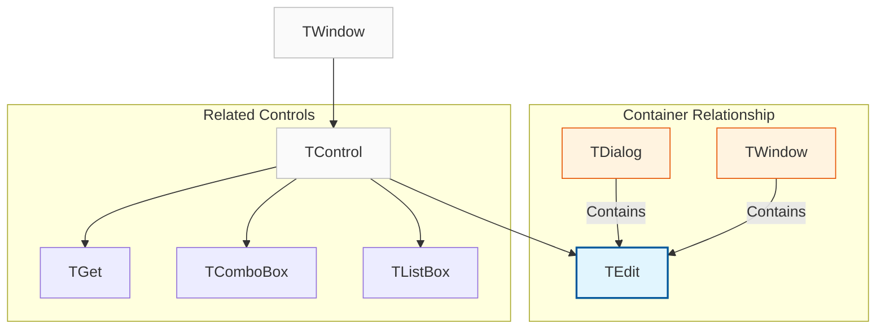
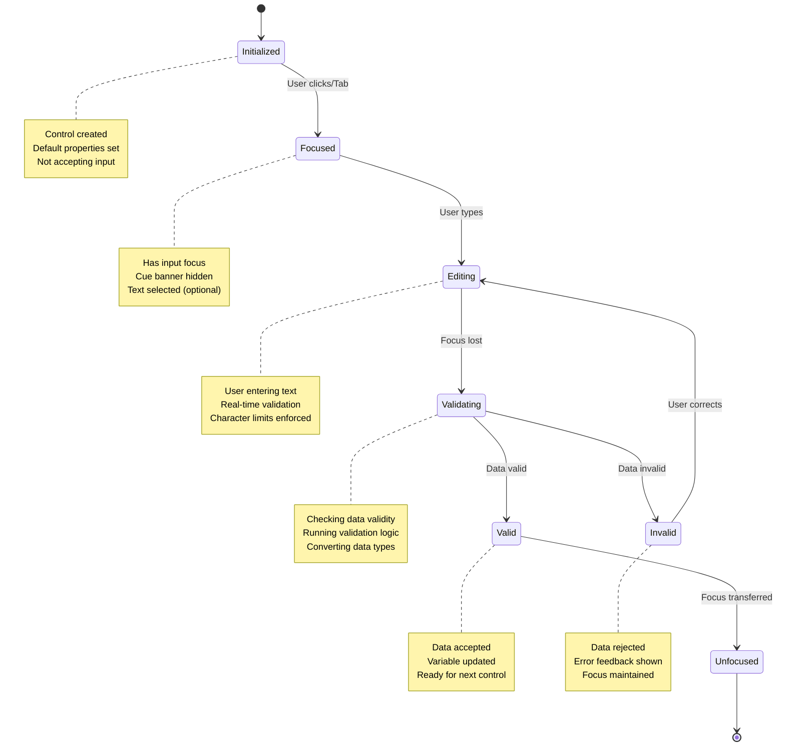
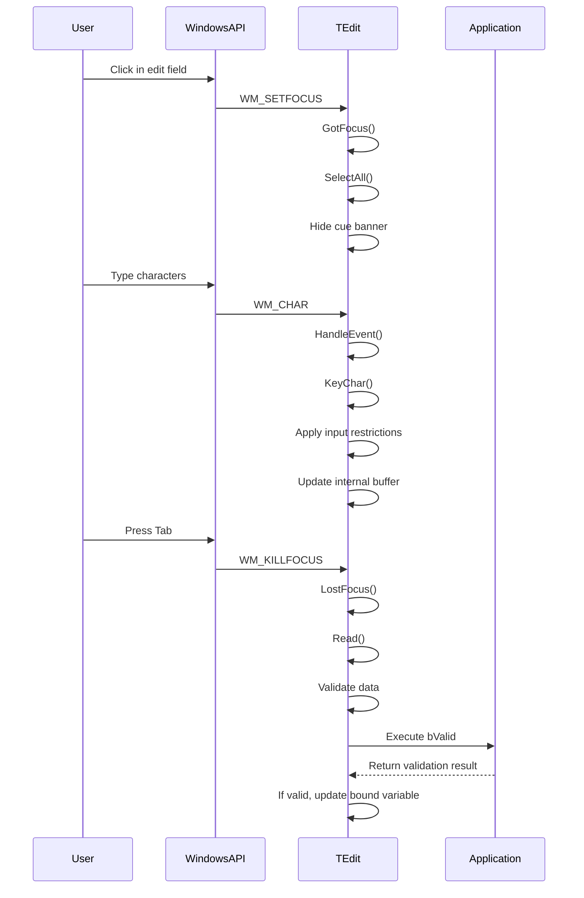

# TEdit Class

The `TEdit` class implements a standard text editing control that allows users to input and modify text data. It serves as the foundation for the `GET` functionality in the FiveWin framework.

**Source File:** [source/classes/edit.prg](../../../source/classes/edit.prg)

## Overview

The `TEdit` class provides a comprehensive interface for text input and manipulation, inheriting from `TControl` to offer all standard control functionality with specialized text editing capabilities. It supports various text formats, validation, and advanced features like password masking and multiline editing.

As one of the most fundamental UI controls, `TEdit` is extensively used throughout FiveWin applications for data entry and user interaction.

## Class Hierarchy



## Text Input States



## Key Properties

| Property | Type | Description |
|----------|------|-------------|
| `cPicture` | `String` | Format string (similar to `Transform()`) defining display and input format |
| `cType` | `String` | Data type of bound variable ('C', 'N', 'D', 'L') for proper conversion |
| `lPassword` | `Logical` | If `.T.`, displays asterisks instead of actual characters |
| `lReadOnly` | `Logical` | If `.T.`, prevents user from modifying text |
| `lMultiLine` | `Logical` | If `.T.`, allows multiple lines of text |
| `cCueText` | `String` | Placeholder text displayed when control is empty |
| `nLimitChars` | `Numeric` | Maximum number of characters allowed |
| `lNumber` | `Logical` | If `.T.`, restricts input to numeric characters only |
| `lUpper` | `Logical` | If `.T.`, converts input to uppercase automatically |

## Key Methods

| Method | Description |
|--------|-------------|
| `New()` | Constructor for creating a new edit control |
| `ReDefine()` | Associates with existing edit control from dialog resources |
| `Initiate(hDlg)` | Initializes control state after creation |
| `Refresh()` | Updates displayed text from bound variable |
| `Read()` | Reads text and updates bound variable |
| `LostFocus()` | Handles focus loss and data validation |
| `GotFocus()` | Handles focus gain and text selection |
| `SelectAll()` | Selects all text in the control |
| `SetCueBanner(cText)` | Sets placeholder text |
| `GetText()` | Retrieves current text content |
| `SetText(cText)` | Sets text content |

## Event Processing Flow



## Usage Patterns

### Basic Text Input

```harbour
#include "FiveWin.ch"

function Main()
   local oDlg, oEdit
   local cName := Space(50)

   DEFINE DIALOG oDlg TITLE "User Information" ;
      FROM 0, 0 TO 150, 300

   @ 10, 10 SAY "Name:" OF oDlg
   @ 10, 30 EDIT oEdit VAR cName OF oDlg ;
      SIZE 150, 12 ;
      CUEBANNER "Enter your full name"

   @ 30, 10 SAY "Email:" OF oDlg
   @ 30, 30 EDIT oEmail OF oDlg ;
      SIZE 150, 12 ;
      CUEBANNER "user@example.com"

   @ 60, 30 BUTTON "Submit" OF oDlg ;
      ACTION MsgInfo( "Name: " + AllTrim(cName) )

   @ 60, 90 BUTTON "Close" OF oDlg ;
      ACTION oDlg:End()

   ACTIVATE DIALOG oDlg CENTERED

return nil
```

### Password Input

```harbour
#include "FiveWin.ch"

function Main()
   local oDlg, oPassword
   local cPassword := Space(20)

   DEFINE DIALOG oDlg TITLE "Login" ;
      FROM 0, 0 TO 120, 250

   @ 10, 10 SAY "Password:" OF oDlg
   @ 10, 30 EDIT oPassword VAR cPassword OF oDlg ;
      SIZE 100, 12 ;
      PASSWORD ;
      CUEBANNER "Enter password"

   @ 40, 30 BUTTON "Login" OF oDlg ;
      ACTION ValidateLogin( cPassword )

   @ 40, 90 BUTTON "Cancel" OF oDlg ;
      ACTION oDlg:End()

   ACTIVATE DIALOG oDlg CENTERED

return nil

static function ValidateLogin( cPassword )
   if Empty( AllTrim(cPassword) )
      MsgAlert( "Please enter a password" )
      return .F.
   endif
   
   MsgInfo( "Login successful" )
return .T.
```

### Numeric Input with Validation

```harbour
#include "FiveWin.ch"

function Main()
   local oDlg, oAge, oSalary
   local nAge := 0
   local nSalary := 0

   DEFINE DIALOG oDlg TITLE "Employee Data" ;
      FROM 0, 0 TO 150, 300

   @ 10, 10 SAY "Age:" OF oDlg
   @ 10, 30 EDIT oAge VAR nAge OF oDlg ;
      SIZE 50, 12 ;
      NUMERIC ;
      CUEBANNER "25" ;
      VALID { |nVal| nVal >= 18 .and. nVal <= 100 } ;
      MESSAGE "Age must be between 18 and 100"

   @ 30, 10 SAY "Salary:" OF oDlg
   @ 30, 30 EDIT oSalary VAR nSalary OF oDlg ;
      SIZE 100, 12 ;
      PICTURE "@E 999,999.99" ;
      CUEBANNER "50000.00" ;
      VALID { |nVal| nVal > 0 } ;
      MESSAGE "Salary must be greater than zero"

   @ 60, 30 BUTTON "Calculate" OF oDlg ;
      ACTION CalculateAnnualSalary( nSalary )

   @ 60, 100 BUTTON "Close" OF oDlg ;
      ACTION oDlg:End()

   ACTIVATE DIALOG oDlg CENTERED

return nil

static function CalculateAnnualSalary( nMonthly )
   local nAnnual := nMonthly * 12
   MsgInfo( "Annual salary: " + Transform( nAnnual, "@E 999,999.99" ) )
return nil
```

### Multiline Text Input

```harbour
#include "FiveWin.ch"

function Main()
   local oDlg, oNotes
   local cNotes := Space(500)

   DEFINE DIALOG oDlg TITLE "Notes" ;
      FROM 0, 0 TO 250, 350

   @ 10, 10 SAY "Notes:" OF oDlg

   @ 30, 10 EDIT oNotes VAR cNotes OF oDlg ;
      SIZE 200, 150 ;
      MULTILINE ;
      VSCROLL ;
      CUEBANNER "Enter your notes here..."

   @ 190, 10 BUTTON "Save" OF oDlg ;
      ACTION SaveNotes( cNotes )

   @ 190, 70 BUTTON "Clear" OF oDlg ;
      ACTION ( cNotes := Space(500), oNotes:Refresh() )

   @ 190, 130 BUTTON "Close" OF oDlg ;
      ACTION oDlg:End()

   ACTIVATE DIALOG oDlg CENTERED

return nil

static function SaveNotes( cNotes )
   local cTrimmed := AllTrim( cNotes )
   
   if Empty( cTrimmed )
      MsgAlert( "No notes to save" )
      return .F.
   endif
   
   MsgInfo( "Notes saved: " + cTrimmed )
return .T.
```

## Advanced Features

### Character Limiting

```harbour
#include "FiveWin.ch"

function Main()
   local oDlg, oZipCode
   local cZipCode := Space(10)

   DEFINE DIALOG oDlg TITLE "Address Information" ;
      FROM 0, 0 TO 120, 250

   @ 10, 10 SAY "Zip Code:" OF oDlg
   @ 10, 30 EDIT oZipCode VAR cZipCode OF oDlg ;
      SIZE 80, 12 ;
      LIMIT 5 ;
      CUEBANNER "12345" ;
      VALID { |cVal| Len( AllTrim(cVal) ) == 5 .and. IsDigit(cVal) } ;
      MESSAGE "Zip code must be 5 digits"

   @ 40, 30 BUTTON "Validate" OF oDlg ;
      ACTION MsgInfo( "Zip code: " + AllTrim(cZipCode) )

   @ 40, 90 BUTTON "Close" OF oDlg ;
      ACTION oDlg:End()

   ACTIVATE DIALOG oDlg CENTERED

return nil

static function IsDigit( cString )
   for local i := 1 to Len( cString )
      if !IsDigit( SubStr( cString, i, 1 ) )
         return .F.
      endif
   next
return .T.
```

### Custom Validation with Real-time Feedback

```harbour
#include "FiveWin.ch"

function Main()
   local oDlg, oEmail
   local cEmail := Space(100)

   DEFINE DIALOG oDlg TITLE "Email Validator" ;
      FROM 0, 0 TO 150, 300

   @ 10, 10 SAY "Email:" OF oDlg
   @ 10, 30 EDIT oEmail VAR cEmail OF oDlg ;
      SIZE 150, 12 ;
      CUEBANNER "user@example.com" ;
      ON CHANGE { || ValidateEmailFormat( oEmail ) }

   @ 30, 30 SAY "" ID ID_EMAIL_STATUS OF oDlg ;
      SIZE 150, 12

   @ 50, 30 BUTTON "Submit" OF oDlg ;
      ACTION SubmitEmail( cEmail )

   @ 50, 90 BUTTON "Close" OF oDlg ;
      ACTION oDlg:End()

   ACTIVATE DIALOG oDlg CENTERED

return nil

static function ValidateEmailFormat( oEmail )
   local cEmail := AllTrim( oEmail:VarGet() )
   local oStatus := oEmail:oWnd:FindControl( ID_EMAIL_STATUS )
   
   if Empty( cEmail )
      oStatus:cText := ""
      oStatus:Refresh()
      return .T.
   endif
   
   if IsValidEmail( cEmail )
      oStatus:cText := "✓ Valid email format"
      oStatus:SetColor( CLR_BLACK, CLR_GREEN )
   else
      oStatus:cText := "✗ Invalid email format"
      oStatus:SetColor( CLR_WHITE, CLR_RED )
   endif
   
   oStatus:Refresh()
return nil

static function IsValidEmail( cEmail )
   return ( At( "@", cEmail ) > 1 .and. ;
            At( ".", cEmail ) > At( "@", cEmail ) .and. ;
            At( "@", cEmail ) < Len( cEmail ) - 1 )
   
return .T.

static function SubmitEmail( cEmail )
   if IsValidEmail( AllTrim(cEmail) )
      MsgInfo( "Email submitted: " + AllTrim(cEmail) )
      return .T.
   else
      MsgAlert( "Please enter a valid email address" )
      return .F.
   endif
```

## Related Components

* [TControl Class](TControl.md) - Base control class that TEdit inherits from
* [TGet Class](TGet.md) - High-level data entry control
* [TComboBox Class](TComboBox.md) - Drop-down list with text input
* [TDialog Class](TDialog.md) - Container for edit controls

## Windows API References

* [Edit Control](https://docs.microsoft.com/en-us/windows/win32/controls/edit-controls)
* [Edit Control Messages](https://docs.microsoft.com/en-us/windows/win32/controls/bumper-edit-control-reference-messages)
* [EN_* Notifications](https://docs.microsoft.com/en-us/windows/win32/controls/bumper-edit-control-reference-notifications)
* [EM_* Messages](https://docs.microsoft.com/en-us/windows/win32/controls/bumper-edit-control-reference-messages)

## Best Practices

1. **Input Validation**: Always validate user input before processing
2. **Placeholder Text**: Use `CUEBANNER` to guide users on expected input
3. **Character Limits**: Set appropriate limits with `LIMIT` to prevent buffer overflows
4. **Data Binding**: Use `VAR` or `bSetGet` for clean data synchronization
5. **Password Security**: Use `PASSWORD` style for sensitive information
6. **User Feedback**: Provide real-time validation feedback
7. **Accessibility**: Ensure proper tab navigation and keyboard support
8. **Formatting**: Use `PICTURE` clauses for consistent data presentation

## Performance Considerations

* Large text buffers consume more memory
* Real-time validation can impact typing responsiveness
* Multiline controls with scrollbars require more processing
* Frequent `Refresh()` calls can be expensive
* Character limiting helps prevent memory issues
* Consider using `ON CHANGE` events sparingly for performance
* Password masking adds minimal overhead
* Cue banners are lightweight but should be used appropriately