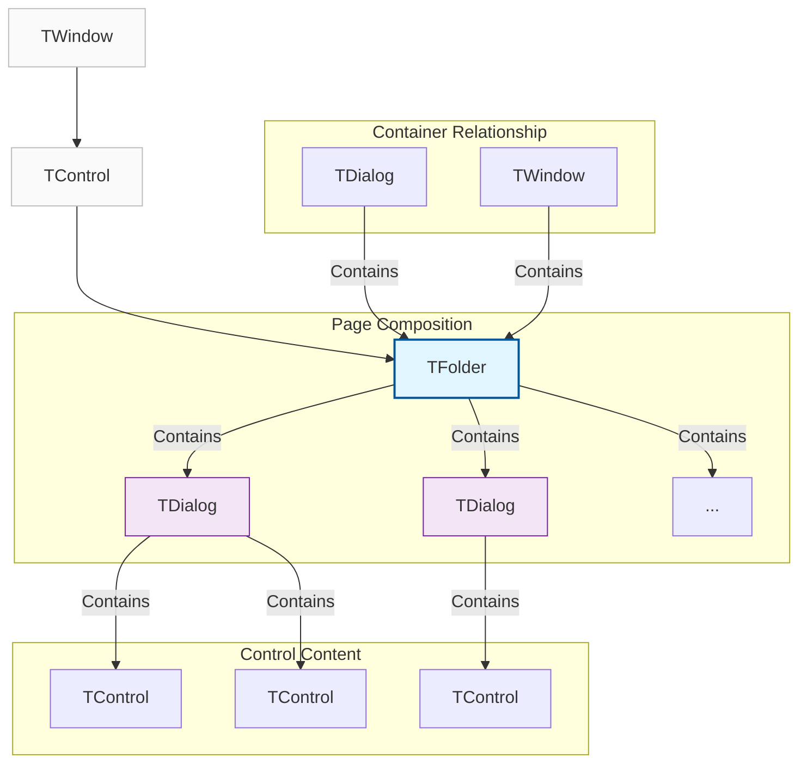
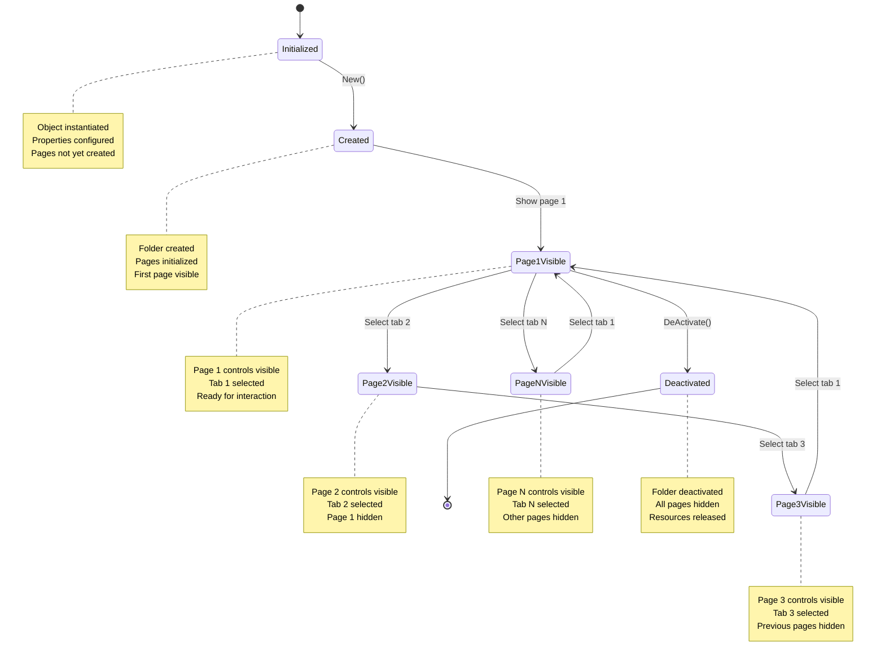
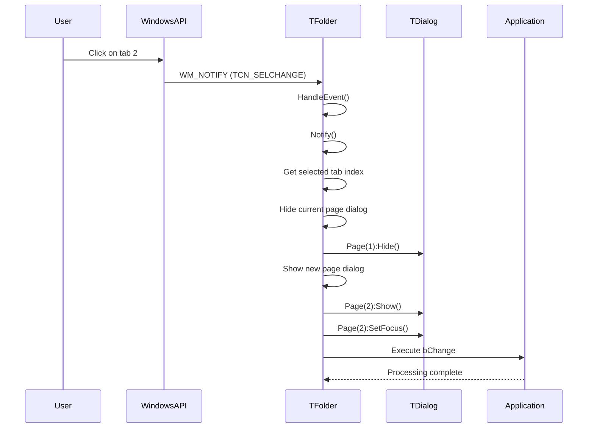

# TFolder Class

The `TFolder` class implements a tab folder control that provides one of the most common ways to organize complex user interfaces. It inherits from `TControl` and acts as a container that manages multiple pages, where each page is an independent `TDialog` object.

**Source File:** [source/classes/folder.prg](../../../source/classes/folder.prg)

## Overview

The `TFolder` class enables users to navigate between different views or sections of data within the same window area by selecting the corresponding tab. It provides a clean, organized way to present related but distinct sets of functionality or data.

As a fundamental UI organization pattern, tab folders help reduce window clutter and improve user experience by grouping related content into logical sections.

## Class Hierarchy



## Tab Navigation Flow



## Key Properties

| Property | Type | Description |
|----------|------|-------------|
| `aPrompts` | `Array` | Array of strings, each is the title of a tab |
| `aDialogs` | `Array` | Array of `TDialog` objects, one for each page |
| `nOption` | `Numeric` | Index (1-based) of currently selected tab/page |
| `aEnable` | `Array` | Array of logical values indicating if each tab is enabled |
| `lMultiLine` | `Logical` | If `.T.`, tabs can span multiple lines |
| `lOwnerDraw` | `Logical` | If `.T.`, enables custom tab drawing |
| `bChange` | `Codeblock` | Executed when tab selection changes |

## Key Methods

| Method | Description |
|--------|-------------|
| `New(aPrompts, oWnd, ...)` | Constructor for creating a new folder |
| `SetOption(nOption)` | Changes to specified page, hiding previous page |
| `AddItem(cItem, ...)` | Dynamically adds new tab and corresponding dialog page |
| `DelItem(nIndex)` | Removes specified tab and dialog page |
| `Page(nIndex)` | Returns `TDialog` for specified page index |
| `EnableTab(nIndex, lEnable)` | Enables or disables specified tab |
| `Notify(...)` | Handles Windows tab control notifications |
| `Html()` | Generates HTML/JavaScript representation using jQuery UI Tabs |
| `GetSelected()` | Returns currently selected page index |
| `SetSelected(nIndex)` | Sets currently selected page |

## Event Processing Flow



## Usage Patterns

### Basic Tab Folder

```harbour
#include "FiveWin.ch"

function Main()
   local oDlg, oFolder
   
   DEFINE DIALOG oDlg TITLE "Configuration Settings" ;
      FROM 0, 0 TO 300, 400

   // Create folder with tab prompts
   @ 10, 10 FOLDER oFolder OF oDlg ;
      PROMPTS "General", "Display", "Security", "Advanced" ;
      SIZE 350, 200

   // Page 1: General Settings
   local cAppName := Space(50)
   local nVersion := 1.0
   @ 20, 20 SAY "Application Name:" OF oFolder:Page(1)
   @ 20, 60 GET cAppName OF oFolder:Page(1) SIZE 150, 12
   @ 40, 20 SAY "Version:" OF oFolder:Page(1)
   @ 40, 60 GET nVersion OF oFolder:Page(1) SIZE 50, 12 ;
      PICTURE "99.99"

   // Page 2: Display Settings
   local cTheme := "Light"
   local nFontSize := 12
   local lShowToolbar := .T.
   @ 20, 20 SAY "Theme:" OF oFolder:Page(2)
   @ 20, 60 COMBOBOX oTheme OF oFolder:Page(2) ;
      ITEMS { "Light", "Dark", "Blue" } ;
      VALUE cTheme ;
      SIZE 100, 100
   @ 40, 20 SAY "Font Size:" OF oFolder:Page(2)
   @ 40, 60 GET nFontSize OF oFolder:Page(2) SIZE 50, 12
   @ 60, 20 CHECKBOX lShowToolbar OF oFolder:Page(2) ;
      PROMPT "Show Toolbar"

   // Page 3: Security Settings
   local lRequireLogin := .F.
   local nMaxAttempts := 3
   @ 20, 20 CHECKBOX lRequireLogin OF oFolder:Page(3) ;
      PROMPT "Require Login"
   @ 40, 20 SAY "Max Login Attempts:" OF oFolder:Page(3)
   @ 40, 60 GET nMaxAttempts OF oFolder:Page(3) SIZE 50, 12

   // Page 4: Advanced Settings
   local lDebugMode := .F.
   local nTimeout := 30
   @ 20, 20 CHECKBOX lDebugMode OF oFolder:Page(4) ;
      PROMPT "Debug Mode"
   @ 40, 20 SAY "Timeout (seconds):" OF oFolder:Page(4)
   @ 40, 60 GET nTimeout OF oFolder:Page(4) SIZE 50, 12

   @ 240, 10 BUTTON "Save" OF oDlg ;
      ACTION SaveAllSettings( oFolder, cAppName, nVersion, oTheme, nFontSize, ;
                            lShowToolbar, lRequireLogin, nMaxAttempts, ;
                            lDebugMode, nTimeout )

   @ 240, 70 BUTTON "Reset" OF oDlg ;
      ACTION ResetAllSettings( oFolder )

   @ 240, 130 BUTTON "Close" OF oDlg ;
      ACTION oDlg:End()

   ACTIVATE DIALOG oDlg

return nil

static function SaveAllSettings( oFolder, cAppName, nVersion, oTheme, nFontSize, ;
                               lShowToolbar, lRequireLogin, nMaxAttempts, ;
                               lDebugMode, nTimeout )
   local cMessage := "Settings saved:" + hb_osNewLine()
   cMessage += "App: " + AllTrim( cAppName ) + hb_osNewLine()
   cMessage += "Version: " + hb_ntos( nVersion ) + hb_osNewLine()
   cMessage += "Theme: " + oTheme:Get() + hb_osNewLine()
   cMessage += "Font Size: " + hb_ntos( nFontSize ) + hb_osNewLine()
   cMessage += "Toolbar: " + iif( lShowToolbar, "Shown", "Hidden" ) + hb_osNewLine()
   cMessage += "Login Required: " + iif( lRequireLogin, "Yes", "No" ) + hb_osNewLine()
   cMessage += "Max Attempts: " + hb_ntos( nMaxAttempts ) + hb_osNewLine()
   cMessage += "Debug Mode: " + iif( lDebugMode, "On", "Off" ) + hb_osNewLine()
   cMessage += "Timeout: " + hb_ntos( nTimeout ) + " seconds"
   
   MsgInfo( cMessage )
   
return nil

static function ResetAllSettings( oFolder )
   if MsgYesNo( "Reset all settings to defaults?" )
      MsgInfo( "Settings reset to defaults" )
   endif
   
return nil
```

### Dynamic Tab Management

```harbour
#include "FiveWin.ch"

function Main()
   local oDlg, oFolder, nPageCounter := 0
   
   DEFINE DIALOG oDlg TITLE "Dynamic Tab Manager" ;
      FROM 0, 0 TO 350, 500

   // Create folder with initial tabs
   @ 10, 10 FOLDER oFolder OF oDlg ;
      PROMPTS "Home", "Documents" ;
      SIZE 400, 250

   // Home page content
   @ 20, 20 SAY "Welcome to Dynamic Tab Manager" OF oFolder:Page(1) SIZE 200, 20
   @ 50, 20 SAY "Use buttons below to manage tabs dynamically" OF oFolder:Page(1) SIZE 250, 20

   // Documents page content
   @ 20, 20 LISTBOX oDocList OF oFolder:Page(2) ;
      ITEMS { "Document1.txt", "Document2.txt", "Document3.txt" } ;
      SIZE 200, 100

   @ 280, 10 BUTTON "Add Tab" OF oDlg ;
      ACTION AddNewTab( oFolder, @nPageCounter )

   @ 280, 70 BUTTON "Remove Tab" OF oDlg ;
      ACTION RemoveCurrentTab( oFolder )

   @ 280, 130 BUTTON "Enable/Disable" OF oDlg ;
      ACTION ToggleTabState( oFolder )

   @ 280, 190 BUTTON "Rename Tab" OF oDlg ;
      ACTION RenameCurrentTab( oFolder )

   @ 310, 10 BUTTON "Close" OF oDlg ;
      ACTION oDlg:End()

   ACTIVATE DIALOG oDlg

return nil

static function AddNewTab( oFolder, nPageCounter )
   nPageCounter++
   local cTabName := "New Tab " + hb_ntos( nPageCounter )
   
   // Add new tab
   local nIndex := oFolder:AddItem( cTabName )
   
   // Add content to new tab
   local nPage := oFolder:Page( nIndex )
   @ 20, 20 SAY "This is " + cTabName OF nPage SIZE 150, 20
   @ 50, 20 EDIT oEdit OF nPage SIZE 150, 80 ;
      VALUE "Content for " + cTabName ;
      MULTILINE
   
   MsgInfo( "Tab '" + cTabName + "' added" )
   
return nil

static function RemoveCurrentTab( oFolder )
   local nCurrent := oFolder:GetSelected()
   
   // Don't remove the first two tabs (Home and Documents)
   if nCurrent <= 2
      MsgAlert( "Cannot remove Home or Documents tabs" )
      return .F.
   endif
   
   local cTabName := oFolder:aPrompts[nCurrent]
   
   if MsgYesNo( "Remove tab '" + cTabName + "'?" )
      oFolder:DelItem( nCurrent )
      MsgInfo( "Tab '" + cTabName + "' removed" )
   endif
   
return nil

static function ToggleTabState( oFolder )
   local nCurrent := oFolder:GetSelected()
   local lCurrentState := oFolder:aEnable[nCurrent]
   
   oFolder:EnableTab( nCurrent, !lCurrentState )
   
   MsgInfo( "Tab " + iif( lCurrentState, "disabled", "enabled" ) )
   
return nil

static function RenameCurrentTab( oFolder )
   local nCurrent := oFolder:GetSelected()
   local cCurrentName := oFolder:aPrompts[nCurrent]
   local cNewName := Space(30)
   
   DEFINE DIALOG oDlg TITLE "Rename Tab" ;
      FROM 0, 0 TO 100, 250
   
   @ 10, 10 SAY "New name:" OF oDlg
   @ 10, 40 GET cNewName OF oDlg SIZE 100, 12 ;
      VALUE cCurrentName
   
   @ 40, 40 BUTTON "Rename" OF oDlg ;
      ACTION ( ApplyTabRename( oFolder, nCurrent, cNewName ), oDlg:End() )
   
   @ 40, 100 BUTTON "Cancel" OF oDlg ;
      ACTION oDlg:End()
   
   ACTIVATE DIALOG oDlg CENTERED
   
return nil

static function ApplyTabRename( oFolder, nTabIndex, cNewName )
   local cTrimmed := AllTrim( cNewName )
   
   if Empty( cTrimmed )
      MsgAlert( "Please enter a tab name" )
      return .F.
   endif
   
   // Update tab prompt
   oFolder:aPrompts[nTabIndex] := cTrimmed
   oFolder:Refresh()
   
   MsgInfo( "Tab renamed to '" + cTrimmed + "'" )
   
return .T.
```

### Wizard Interface

```harbour
#include "FiveWin.ch"

function Main()
   local oDlg, oFolder
   
   ShowWizardDialog()
   
return nil

static function ShowWizardDialog()
   local oDlg, oFolder
   local cName := Space(50)
   local cEmail := Space(100)
   local lAgree := .F.
   
   DEFINE DIALOG oDlg TITLE "Setup Wizard" ;
      FROM 0, 0 TO 300, 400

   // Create wizard folder
   @ 10, 10 FOLDER oFolder OF oDlg ;
      PROMPTS "Welcome", "User Info", "Terms", "Complete" ;
      SIZE 350, 200

   // Page 1: Welcome
   @ 20, 20 SAY "Welcome to the Setup Wizard" OF oFolder:Page(1) SIZE 200, 20
   @ 50, 20 SAY "This wizard will guide you through the setup process." OF oFolder:Page(1) SIZE 250, 40
   @ 100, 20 SAY "Click Next to continue." OF oFolder:Page(1) SIZE 150, 20

   // Page 2: User Information
   @ 20, 20 SAY "Please enter your information:" OF oFolder:Page(2) SIZE 200, 20
   @ 50, 20 SAY "Name:" OF oFolder:Page(2)
   @ 50, 60 GET cName OF oFolder:Page(2) SIZE 150, 12
   @ 70, 20 SAY "Email:" OF oFolder:Page(2)
   @ 70, 60 GET cEmail OF oFolder:Page(2) SIZE 150, 12

   // Page 3: Terms and Conditions
   @ 20, 20 SAY "Please read and agree to the terms:" OF oFolder:Page(3) SIZE 200, 20
   @ 50, 20 EDIT oTerms OF oFolder:Page(3) ;
      VALUE "Terms and conditions text would go here..." ;
      SIZE 250, 80 ;
      MULTILINE ;
      READONLY
   @ 140, 20 CHECKBOX lAgree OF oFolder:Page(3) ;
      PROMPT "I agree to the terms and conditions"

   // Page 4: Complete
   @ 20, 20 SAY "Setup Complete!" OF oFolder:Page(4) SIZE 150, 20
   @ 50, 20 SAY "The setup process has been completed successfully." OF oFolder:Page(4) SIZE 250, 40
   @ 100, 20 SAY "Click Finish to close the wizard." OF oFolder:Page(4) SIZE 200, 20

   // Navigation buttons
   @ 240, 10 BUTTON "Back" ID ID_BACK OF oDlg ;
      ACTION NavigateWizard( oFolder, -1 ) ;
      DISABLED

   @ 240, 70 BUTTON "Next" ID ID_NEXT OF oDlg ;
      ACTION NavigateWizard( oFolder, 1 )

   @ 240, 130 BUTTON "Finish" ID ID_FINISH OF oDlg ;
      ACTION ( MsgInfo( "Setup completed!" ), oDlg:End() ) ;
      DISABLED

   @ 240, 190 BUTTON "Cancel" OF oDlg ;
      ACTION ( if( MsgYesNo( "Cancel setup?" ), oDlg:End(), nil ) )

   // Set up tab change handler
   oFolder:bChange := { || UpdateWizardButtons( oFolder, oDlg ) }
   
   // Initialize button states
   UpdateWizardButtons( oFolder, oDlg )

   ACTIVATE DIALOG oDlg

return nil

static function NavigateWizard( oFolder, nDirection )
   local nCurrent := oFolder:GetSelected()
   local nNewPage := nCurrent + nDirection
   
   // Validate page navigation
   if nNewPage >= 1 .and. nNewPage <= Len( oFolder:aDialogs )
      // Special validation for Terms page
      if nCurrent == 3 .and. nDirection == 1  // Moving from Terms to Complete
         local oAgree := oFolder:Page(3):FindControl( lAgree )  // This would need proper reference
         if oAgree != nil .and. !oAgree:VarGet()
            MsgAlert( "You must agree to the terms to continue" )
            return .F.
         endif
      endif
      
      oFolder:SetOption( nNewPage )
   endif
   
return nil

static function UpdateWizardButtons( oFolder, oDlg )
   local nCurrent := oFolder:GetSelected()
   local nTotal := Len( oFolder:aDialogs )
   
   // Update Back button
   local oBack := oDlg:FindControl( ID_BACK )
   if oBack != nil
      oBack:lEnabled := ( nCurrent > 1 )
      oBack:Refresh()
   endif
   
   // Update Next button
   local oNext := oDlg:FindControl( ID_NEXT )
   if oNext != nil
      oNext:lEnabled := ( nCurrent < nTotal )
      oNext:Refresh()
   endif
   
   // Update Finish button
   local oFinish := oDlg:FindControl( ID_FINISH )
   if oFinish != nil
      oFinish:lEnabled := ( nCurrent == nTotal )
      oFinish:Refresh()
   endif
   
return nil
```

## Advanced Features

### Custom Tab Drawing

```harbour
#include "FiveWin.ch"

function Main()
   local oDlg, oFolder
   
   DEFINE DIALOG oDlg TITLE "Custom Tab Drawing" ;
      FROM 0, 0 TO 250, 400

   // Create folder with owner-draw tabs
   @ 10, 10 FOLDER oFolder OF oDlg ;
      PROMPTS "Red Tab", "Green Tab", "Blue Tab" ;
      SIZE 350, 150 ;
      OWNERDRAW

   // Set custom drawing function
   oFolder:bDrawItem := { |oFolder, hDC, nIndex, nState, aRect| ;
                         DrawCustomTab( oFolder, hDC, nIndex, nState, aRect ) }

   // Page content
   @ 20, 20 SAY "This tab has custom drawing" OF oFolder:Page(1) SIZE 200, 20
   @ 20, 20 SAY "This tab has custom drawing" OF oFolder:Page(2) SIZE 200, 20
   @ 20, 20 SAY "This tab has custom drawing" OF oFolder:Page(3) SIZE 200, 20

   @ 190, 10 BUTTON "Close" OF oDlg ;
      ACTION oDlg:End()

   ACTIVATE DIALOG oDlg

return nil

static function DrawCustomTab( oFolder, hDC, nIndex, nState, aRect )
   local cText := oFolder:aPrompts[nIndex]
   local nColor := CLR_WHITE
   
   // Set background color based on tab index
   switch nIndex
   case 1  // Red tab
      nColor := RGB( 255, 100, 100 )
      break
   case 2  // Green tab
      nColor := RGB( 100, 255, 100 )
      break
   case 3  // Blue tab
      nColor := RGB( 100, 100, 255 )
      break
   endswitch
   
   // Draw background
   if HB_BITAND( nState, ODS_SELECTED ) != 0
      // Selected tab - slightly darker
      local nR := Int( ( Red( nColor ) * 0.8 ) )
      local nG := Int( ( Green( nColor ) * 0.8 ) )
      local nB := Int( ( Blue( nColor ) * 0.8 ) )
      nColor := RGB( nR, nG, nB )
   endif
   
   FillRect( hDC, aRect[1], aRect[2], aRect[3], aRect[4], nColor )
   
   // Draw border
   DrawEdge( hDC, aRect[1], aRect[2], aRect[3], aRect[4], EDGE_RAISED, BF_RECT )
   
   // Draw text
   SetTextColor( hDC, CLR_BLACK )
   SetBkMode( hDC, TRANSPARENT )
   local nTextWidth := GetTextWidth( hDC, cText )
   local nTextHeight := GetTextHeight( hDC, cText )
   local nX := aRect[1] + Int( ( ( aRect[3] - aRect[1] ) - nTextWidth ) / 2 )
   local nY := aRect[2] + Int( ( ( aRect[4] - aRect[2] ) - nTextHeight ) / 2 )
   TextOut( hDC, nX, nY, cText )
   
return .T.
```

### Multi-Line Tabs

```harbour
#include "FiveWin.ch"

function Main()
   local oDlg, oFolder
   
   DEFINE DIALOG oDlg TITLE "Multi-Line Tabs" ;
      FROM 0, 0 TO 300, 500

   // Create folder with many tabs that will wrap to multiple lines
   @ 10, 10 FOLDER oFolder OF oDlg ;
      PROMPTS "Tab 1", "Tab 2", "Tab 3", "Tab 4", "Tab 5", ;
              "Tab 6", "Tab 7", "Tab 8", "Tab 9", "Tab 10", ;
              "Tab 11", "Tab 12", "Tab 13", "Tab 14", "Tab 15" ;
      SIZE 450, 200 ;
      MULTILINE

   // Add content to a few tabs to demonstrate
   for local i := 1 to 5
      @ 20, 20 SAY "Content for " + oFolder:aPrompts[i] OF oFolder:Page(i) SIZE 150, 20
   next

   @ 240, 10 BUTTON "Add More Tabs" OF oDlg ;
      ACTION AddMoreTabs( oFolder )

   @ 240, 80 BUTTON "Close" OF oDlg ;
      ACTION oDlg:End()

   ACTIVATE DIALOG oDlg

return nil

static function AddMoreTabs( oFolder )
   static nCounter := 15
   
   for local i := 1 to 5
      nCounter++
      local nIndex := oFolder:AddItem( "Tab " + hb_ntos( nCounter ) )
      @ 20, 20 SAY "Content for Tab " + hb_ntos( nCounter ) OF oFolder:Page( nIndex ) SIZE 150, 20
   next
   
   MsgInfo( "5 more tabs added" )
   
return nil
```

## Related Components

* [TControl Class](TControl.md) - Base control class that TFolder inherits from
* [TDialog Class](TDialog.md) - Dialog windows used for folder pages
* [TTabControl Class](TTabControl.md) - Lower-level tab control
* [TNotebook Class](TNotebook.md) - Alternative tab interface

## Windows API References

* [Tab Controls](https://docs.microsoft.com/en-us/windows/win32/controls/tab-controls)
* [TCM_* Messages](https://docs.microsoft.com/en-us/windows/win32/controls/bumper-tab-control-reference-messages)
* [TCN_* Notifications](https://docs.microsoft.com/en-us/windows/win32/controls/bumper-tab-control-reference-notifications)
* [SysTabControl32](https://docs.microsoft.com/en-us/windows/win32/controls/create-a-tab-control)

## Best Practices

1. **Tab Organization**: Group related functionality into logical tabs
2. **Tab Naming**: Use clear, concise tab names that describe the content
3. **Page Content**: Keep tab page content focused and not overly complex
4. **Default Selection**: Set a sensible default tab for initial display
5. **Navigation**: Provide clear navigation between tabs
6. **Validation**: Implement validation when moving between tabs if needed
7. **Memory Management**: Clean up tab pages when no longer needed
8. **Accessibility**: Ensure keyboard navigation works properly

## Performance Considerations

* Creating many tab pages can consume memory for dialog objects
* Complex content on hidden tabs still consumes resources
* Consider lazy loading for tab content that's not immediately needed
* Custom drawing can impact performance with many tabs
* Multi-line tabs require more processing for layout
* Large numbers of tabs can make the interface confusing
* Consider using dynamic tab management for variable content
* Monitor tab switching performance for smooth user experience