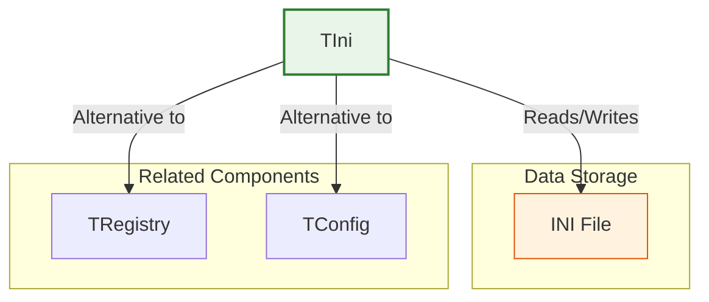
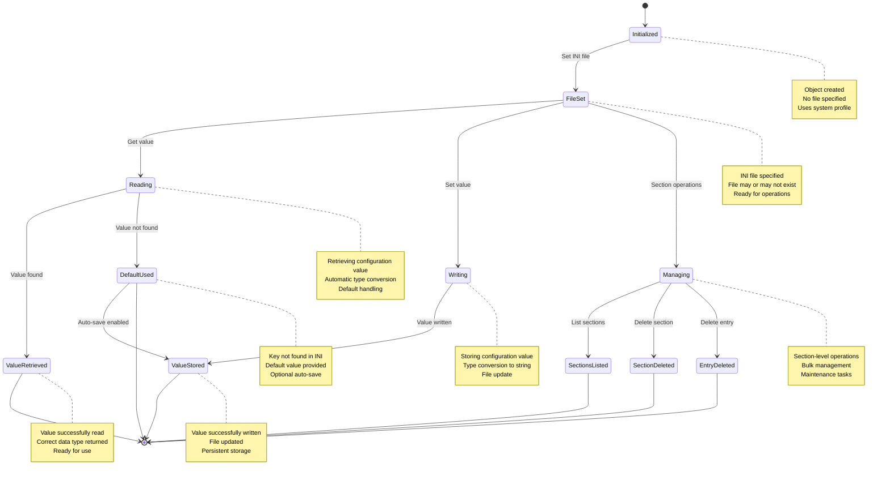

# TIni Class

The `TIni` class provides a comprehensive interface for reading from and writing to INI (Initialization) files, which are simple text files used to store configuration settings in a structured format. It supports reading and writing various data types including strings, numbers, dates, and logical values.

**Source File:** [source/classes/ini.prg](../../../source/classes/ini.prg)

## Overview

The `TIni` class encapsulates the Windows API functions for working with INI files, providing a high-level, object-oriented interface for configuration management. It automatically handles data type conversion and provides convenient methods for managing configuration sections and entries.

INI files are commonly used for storing application settings, user preferences, and other configuration data in a human-readable format with sections and key-value pairs.

## Class Structure



## Configuration Management Flow



## Key Properties

| Property | Type | Description |
|----------|------|-------------|
| `cIniFile` | `String` | Path to the INI file being managed |
| `lAutoSet` | `Logical` | If `.T.`, automatically saves default values |

## Key Methods

| Method | Description |
|--------|-------------|
| `New(cIniFile)` | Constructor for creating a new INI manager |
| `Get(cSection, cEntry, uDefault, uVar)` | Reads a value from the INI file |
| `Set(cSection, cEntry, uValue)` | Writes a value to the INI file |
| `Sections()` | Returns array of all section names |
| `DelSection(cSection)` | Deletes an entire section |
| `DelEntry(cSection, cEntry)` | Deletes a specific entry |

## Usage Patterns

### Basic INI File Operations

```harbour
#include "FiveWin.ch"

function Main()
   local oIni, cAppName, nVersion, lDebugMode, dInstallDate
   
   // Create INI manager for application settings
   oIni := TIni():New( "myapp.ini" )
   
   // Read configuration values with defaults
   cAppName := oIni:Get( "Application", "Name", "My Application" )
   nVersion := oIni:Get( "Application", "Version", 1.0 )
   lDebugMode := oIni:Get( "Debug", "Enabled", .F. )
   dInstallDate := oIni:Get( "Installation", "Date", Date() )
   
   // Display current settings
   ShowCurrentSettings( cAppName, nVersion, lDebugMode, dInstallDate )
   
   // Update settings
   UpdateApplicationSettings( oIni )
   
   // Show updated settings
   cAppName := oIni:Get( "Application", "Name", "My Application" )
   nVersion := oIni:Get( "Application", "Version", 1.0 )
   lDebugMode := oIni:Get( "Debug", "Enabled", .F. )
   dInstallDate := oIni:Get( "Installation", "Date", Date() )
   
   ShowCurrentSettings( cAppName, nVersion, lDebugMode, dInstallDate )
   
return nil

static function ShowCurrentSettings( cAppName, nVersion, lDebugMode, dInstallDate )
   local cMessage := "Current Settings:" + hb_osNewLine()
   cMessage += "Application Name: " + cAppName + hb_osNewLine()
   cMessage += "Version: " + hb_ntos( nVersion ) + hb_osNewLine()
   cMessage += "Debug Mode: " + iif( lDebugMode, "Enabled", "Disabled" ) + hb_osNewLine()
   cMessage += "Install Date: " + DToC( dInstallDate )
   
   MsgInfo( cMessage )
   
return nil

static function UpdateApplicationSettings( oIni )
   local cNewName := Space(50)
   local nNewVersion := 0
   local lNewDebug := .F.
   
   DEFINE DIALOG oDlg TITLE "Update Settings" ;
      FROM 0, 0 TO 180, 300
   
   @ 10, 10 SAY "Application Name:" OF oDlg
   @ 10, 50 GET cNewName OF oDlg SIZE 100, 12 ;
      VALUE oIni:Get( "Application", "Name", "My Application" )
   
   @ 30, 10 SAY "Version:" OF oDlg
   @ 30, 50 GET nNewVersion OF oDlg SIZE 100, 12 ;
      VALUE oIni:Get( "Application", "Version", 1.0 ) ;
      PICTURE "99.99"
   
   @ 50, 10 CHECKBOX lNewDebug OF oDlg ;
      PROMPT "Enable Debug Mode" ;
      VALUE oIni:Get( "Debug", "Enabled", .F. )
   
   @ 80, 50 BUTTON "Save" OF oDlg ;
      ACTION ( SaveSettings( oIni, cNewName, nNewVersion, lNewDebug ), oDlg:End() )
   
   @ 80, 110 BUTTON "Cancel" OF oDlg ;
      ACTION oDlg:End()
   
   ACTIVATE DIALOG oDlg CENTERED
   
return nil

static function SaveSettings( oIni, cName, nVersion, lDebug )
   local cTrimmedName := AllTrim( cName )
   
   if Empty( cTrimmedName )
      MsgAlert( "Please enter an application name" )
      return .F.
   endif
   
   // Save settings to INI file
   oIni:Set( "Application", "Name", cTrimmedName )
   oIni:Set( "Application", "Version", nVersion )
   oIni:Set( "Debug", "Enabled", lDebug )
   oIni:Set( "Installation", "Date", Date() )
   
   MsgInfo( "Settings saved successfully" )
   
return .T.
```

### User Preferences Management

```harbour
#include "FiveWin.ch"

function Main()
   local oIni, oUserPrefs
   
   // Create INI manager for user preferences
   oIni := TIni():New( "userprefs.ini" )
   
   // Load user preferences
   oUserPrefs := LoadUserPreferences( oIni )
   
   // Show main application window with user preferences
   ShowMainWindow( oUserPrefs, oIni )
   
return nil

static function LoadUserPreferences( oIni )
   local oPrefs := TUserPrefs():New()
   
   // Window settings
   oPrefs:nWindowWidth := oIni:Get( "Window", "Width", 800 )
   oPrefs:nWindowHeight := oIni:Get( "Window", "Height", 600 )
   oPrefs:nWindowLeft := oIni:Get( "Window", "Left", 100 )
   oPrefs:nWindowTop := oIni:Get( "Window", "Top", 100 )
   
   // Display settings
   oPrefs:cTheme := oIni:Get( "Display", "Theme", "Light" )
   oPrefs:nFontSize := oIni:Get( "Display", "FontSize", 12 )
   oPrefs:lShowToolbar := oIni:Get( "Display", "ShowToolbar", .T. )
   
   // Behavior settings
   oPrefs:lAutoSave := oIni:Get( "Behavior", "AutoSave", .T. )
   oPrefs:nAutoSaveInterval := oIni:Get( "Behavior", "AutoSaveInterval", 300 )  // 5 minutes
   oPrefs:lConfirmExit := oIni:Get( "Behavior", "ConfirmExit", .T. )
   
return oPrefs

static function ShowMainWindow( oUserPrefs, oIni )
   local oDlg
   
   DEFINE DIALOG oDlg TITLE "Application with Preferences" ;
      FROM oUserPrefs:nWindowTop, oUserPrefs:nWindowLeft ;
      TO oUserPrefs:nWindowTop + oUserPrefs:nWindowHeight, ;
         oUserPrefs:nWindowLeft + oUserPrefs:nWindowWidth

   // Apply theme
   ApplyTheme( oDlg, oUserPrefs:cTheme )
   
   // Add toolbar if enabled
   if oUserPrefs:lShowToolbar
      AddToolbar( oDlg )
   endif
   
   @ 50, 10 SAY "Application Content" OF oDlg SIZE 200, 100

   @ oUserPrefs:nWindowHeight - 60, 10 BUTTON "Preferences" OF oDlg ;
      ACTION ShowPreferencesDialog( oIni )

   @ oUserPrefs:nWindowHeight - 60, 80 BUTTON "Save Layout" OF oDlg ;
      ACTION SaveWindowLayout( oIni, oDlg )

   @ oUserPrefs:nWindowHeight - 60, 150 BUTTON "Close" OF oDlg ;
      ACTION CloseApplication( oDlg, oIni, oUserPrefs )

   ACTIVATE DIALOG oDlg

return nil

static function ApplyTheme( oDlg, cTheme )
   switch cTheme
   case "Light"
      oDlg:SetColor( CLR_BLACK, RGB( 240, 240, 240 ) )
      exit
   case "Dark"
      oDlg:SetColor( CLR_WHITE, RGB( 40, 40, 40 ) )
      exit
   case "Blue"
      oDlg:SetColor( CLR_WHITE, RGB( 0, 100, 200 ) )
      exit
   endswitch
   
return nil

static function ShowPreferencesDialog( oIni )
   local oPrefs := LoadUserPreferences( oIni )
   
   DEFINE DIALOG oDlg TITLE "Preferences" ;
      FROM 0, 0 TO 250, 350
   
   // Window settings group
   @ 10, 10 GROUP "Window Settings" OF oDlg SIZE 150, 80
   
   @ 25, 20 SAY "Width:" OF oDlg
   @ 25, 60 GET oPrefs:nWindowWidth OF oDlg SIZE 50, 12
   
   @ 45, 20 SAY "Height:" OF oDlg
   @ 45, 60 GET oPrefs:nWindowHeight OF oDlg SIZE 50, 12
   
   // Display settings group
   @ 100, 10 GROUP "Display Settings" OF oDlg SIZE 150, 100
   
   @ 115, 20 SAY "Theme:" OF oDlg
   @ 115, 60 COMBOBOX oTheme OF oDlg ;
      ITEMS { "Light", "Dark", "Blue" } ;
      VALUE oIni:Get( "Display", "Theme", "Light" )
   
   @ 135, 20 SAY "Font Size:" OF oDlg
   @ 135, 60 GET oPrefs:nFontSize OF oDlg SIZE 50, 12
   
   @ 155, 20 CHECKBOX oPrefs:lShowToolbar OF oDlg ;
      PROMPT "Show Toolbar"
   
   // Behavior settings group
   @ 210, 10 GROUP "Behavior Settings" OF oDlg SIZE 150, 80
   
   @ 225, 20 CHECKBOX oPrefs:lAutoSave OF oDlg ;
      PROMPT "Auto Save"
   
   @ 245, 20 CHECKBOX oPrefs:lConfirmExit OF oDlg ;
      PROMPT "Confirm Exit"
   
   @ 300, 60 BUTTON "Save" OF oDlg ;
      ACTION ( SavePreferences( oIni, oPrefs, oTheme ), oDlg:End() )
   
   @ 300, 120 BUTTON "Cancel" OF oDlg ;
      ACTION oDlg:End()
   
   ACTIVATE DIALOG oDlg CENTERED
   
return nil

static function SavePreferences( oIni, oPrefs, oTheme )
   // Save window settings
   oIni:Set( "Window", "Width", oPrefs:nWindowWidth )
   oIni:Set( "Window", "Height", oPrefs:nWindowHeight )
   oIni:Set( "Window", "Left", GetWndDefault():nLeft )
   oIni:Set( "Window", "Top", GetWndDefault():nTop )
   
   // Save display settings
   oIni:Set( "Display", "Theme", oTheme:Get() )
   oIni:Set( "Display", "FontSize", oPrefs:nFontSize )
   oIni:Set( "Display", "ShowToolbar", oPrefs:lShowToolbar )
   
   // Save behavior settings
   oIni:Set( "Behavior", "AutoSave", oPrefs:lAutoSave )
   oIni:Set( "Behavior", "AutoSaveInterval", 300 )  // Fixed value for demo
   oIni:Set( "Behavior", "ConfirmExit", oPrefs:lConfirmExit )
   
   MsgInfo( "Preferences saved successfully" )
   
return nil

static function SaveWindowLayout( oIni, oDlg )
   oIni:Set( "Window", "Width", oDlg:nRight - oDlg:nLeft )
   oIni:Set( "Window", "Height", oDlg:nBottom - oDlg:nTop )
   oIni:Set( "Window", "Left", oDlg:nLeft )
   oIni:Set( "Window", "Top", oDlg:nTop )
   
   MsgInfo( "Window layout saved" )
   
return nil

static function CloseApplication( oDlg, oIni, oUserPrefs )
   if oUserPrefs:lConfirmExit
      if !MsgYesNo( "Are you sure you want to exit?" )
         return .F.
      endif
   endif
   
   // Save current window layout
   SaveWindowLayout( oIni, oDlg )
   
   oDlg:End()
   
return nil

// Simple class to hold user preferences
CLASS TUserPrefs
   DATA nWindowWidth INIT 800
   DATA nWindowHeight INIT 600
   DATA nWindowLeft INIT 100
   DATA nWindowTop INIT 100
   DATA cTheme INIT "Light"
   DATA nFontSize INIT 12
   DATA lShowToolbar INIT .T.
   DATA lAutoSave INIT .T.
   DATA nAutoSaveInterval INIT 300
   DATA lConfirmExit INIT .T.
END CLASS
```

### Configuration Migration and Backup

```harbour
#include "FiveWin.ch"

function Main()
   local oIni
   
   // Create INI manager
   oIni := TIni():New( "appconfig.ini" )
   
   // Check if this is first run
   if IsFirstRun( oIni )
      InitializeDefaultConfiguration( oIni )
      MsgInfo( "Default configuration initialized" )
   else
      // Check for configuration version updates
      UpdateConfigurationIfNeeded( oIni )
   endif
   
   // Show configuration management dialog
   ShowConfigurationManager( oIni )
   
return nil

static function IsFirstRun( oIni )
   // Check if application name exists in INI
   local cAppName := oIni:Get( "Application", "Name", "" )
   return Empty( cAppName )
   
return .T.

static function InitializeDefaultConfiguration( oIni )
   // Set application metadata
   oIni:Set( "Application", "Name", "My Application" )
   oIni:Set( "Application", "Version", "1.0.0" )
   oIni:Set( "Application", "FirstRun", DToC( Date() ) )
   
   // Set default user settings
   oIni:Set( "User", "Language", "English" )
   oIni:Set( "User", "LastUser", "" )
   
   // Set default system settings
   oIni:Set( "System", "MaxRecentFiles", 10 )
   oIni:Set( "System", "AutoBackup", .T. )
   oIni:Set( "System", "BackupInterval", 300 )  // 5 minutes
   
   // Set default window settings
   oIni:Set( "Window", "Width", 800 )
   oIni:Set( "Window", "Height", 600 )
   oIni:Set( "Window", "Left", 100 )
   oIni:Set( "Window", "Top", 100 )
   
   // Create backup of initial configuration
   BackupConfiguration( "appconfig.ini", "appconfig_initial.ini" )
   
return nil

static function UpdateConfigurationIfNeeded( oIni )
   local cCurrentVersion := oIni:Get( "Application", "Version", "1.0.0" )
   
   // Check if update is needed
   if cCurrentVersion == "1.0.0"
      // Update from 1.0.0 to 1.1.0
      UpdateToVersion110( oIni )
   endif
   
   if cCurrentVersion == "1.1.0"
      // Update from 1.1.0 to 1.2.0
      UpdateToVersion120( oIni )
   endif
   
return nil

static function UpdateToVersion110( oIni )
   // Add new settings introduced in version 1.1.0
   oIni:Set( "Security", "RequireLogin", .F. )
   oIni:Set( "Security", "MaxLoginAttempts", 3 )
   
   // Update version number
   oIni:Set( "Application", "Version", "1.1.0" )
   
   MsgInfo( "Configuration updated to version 1.1.0" )
   
return nil

static function UpdateToVersion120( oIni )
   // Add new settings introduced in version 1.2.0
   oIni:Set( "Network", "ProxyEnabled", .F. )
   oIni:Set( "Network", "ProxyServer", "" )
   oIni:Set( "Network", "ProxyPort", 8080 )
   
   // Update version number
   oIni:Set( "Application", "Version", "1.2.0" )
   
   MsgInfo( "Configuration updated to version 1.2.0" )
   
return nil

static function ShowConfigurationManager( oIni )
   DEFINE DIALOG oDlg TITLE "Configuration Manager" ;
      FROM 0, 0 TO 300, 400
   
   @ 10, 10 LISTBOX oSections OF oDlg ;
      ITEMS oIni:Sections() ;
      SIZE 150, 100 ;
      ON CHANGE { || ShowSectionEntries( oIni, oSections, oEntries ) }
   
   @ 10, 170 LISTBOX oEntries OF oDlg ;
      SIZE 150, 100
   
   @ 120, 10 BUTTON "Add Section" OF oDlg ;
      ACTION AddNewSection( oIni, oSections )
   
   @ 120, 70 BUTTON "Delete Section" OF oDlg ;
      ACTION DeleteSelectedSection( oIni, oSections )
   
   @ 120, 170 BUTTON "Add Entry" OF oDlg ;
      ACTION AddNewEntry( oIni, oSections, oEntries )
   
   @ 120, 230 BUTTON "Delete Entry" OF oDlg ;
      ACTION DeleteSelectedEntry( oIni, oSections, oEntries )
   
   @ 150, 10 BUTTON "Backup Config" OF oDlg ;
      ACTION BackupCurrentConfig( oIni )
   
   @ 150, 70 BUTTON "Restore Config" OF oDlg ;
      ACTION RestoreConfigBackup( oIni )
   
   @ 240, 10 BUTTON "Refresh" OF oDlg ;
      ACTION RefreshConfigurationView( oIni, oSections, oEntries )
   
   @ 240, 70 BUTTON "Close" OF oDlg ;
      ACTION oDlg:End()
   
   ACTIVATE DIALOG oDlg CENTERED
   
return nil

static function ShowSectionEntries( oIni, oSections, oEntries )
   local nSelected := oSections:nValue
   
   if nSelected <= 0
      return .F.
   endif
   
   local cSection := oSections:GetItem( nSelected )
   
   // In a real implementation, you would enumerate entries in the section
   // This is a simplified example
   local aEntries := { "Entry1=Value1", "Entry2=Value2", "Entry3=Value3" }
   oEntries:SetItems( aEntries )
   
return nil

static function AddNewSection( oIni, oSections )
   local cSectionName := Space(50)
   
   DEFINE DIALOG oDlg TITLE "Add New Section" ;
      FROM 0, 0 TO 100, 250
   
   @ 10, 10 SAY "Section Name:" OF oDlg
   @ 10, 40 GET cSectionName OF oDlg SIZE 100, 12
   
   @ 40, 40 BUTTON "Add" OF oDlg ;
      ACTION ( CreateNewSection( oIni, cSectionName, oSections ), oDlg:End() )
   
   @ 40, 100 BUTTON "Cancel" OF oDlg ;
      ACTION oDlg:End()
   
   ACTIVATE DIALOG oDlg CENTERED
   
return nil

static function CreateNewSection( oIni, cName, oSections )
   local cTrimmed := AllTrim( cName )
   
   if Empty( cTrimmed )
      MsgAlert( "Please enter a section name" )
      return .F.
   endif
   
   // Add a dummy entry to create the section
   oIni:Set( cTrimmed, "Created", DToC( Date() ) )
   
   // Refresh sections list
   oSections:SetItems( oIni:Sections() )
   
   MsgInfo( "Section '" + cTrimmed + "' created" )
   
return .T.

static function DeleteSelectedSection( oIni, oSections )
   local nSelected := oSections:nValue
   
   if nSelected <= 0
      MsgAlert( "Please select a section to delete" )
      return .F.
   endif
   
   local cSection := oSections:GetItem( nSelected )
   
   if MsgYesNo( "Delete section '" + cSection + "' and all its entries?" )
      oIni:DelSection( cSection )
      
      // Refresh sections list
      oSections:SetItems( oIni:Sections() )
      
      MsgInfo( "Section deleted" )
   endif
   
return nil

static function AddNewEntry( oIni, oSections, oEntries )
   local nSelected := oSections:nValue
   
   if nSelected <= 0
      MsgAlert( "Please select a section first" )
      return .F.
   endif
   
   local cSection := oSections:GetItem( nSelected )
   local cEntryName := Space(50)
   local cEntryValue := Space(100)
   
   DEFINE DIALOG oDlg TITLE "Add New Entry" ;
      FROM 0, 0 TO 120, 300
   
   @ 10, 10 SAY "Entry Name:" OF oDlg
   @ 10, 40 GET cEntryName OF oDlg SIZE 100, 12
   
   @ 30, 10 SAY "Entry Value:" OF oDlg
   @ 30, 40 GET cEntryValue OF oDlg SIZE 150, 12
   
   @ 60, 40 BUTTON "Add" OF oDlg ;
      ACTION ( CreateNewEntry( oIni, cSection, cEntryName, cEntryValue, oEntries ), oDlg:End() )
   
   @ 60, 100 BUTTON "Cancel" OF oDlg ;
      ACTION oDlg:End()
   
   ACTIVATE DIALOG oDlg CENTERED
   
return nil

static function CreateNewEntry( oIni, cSection, cName, cValue, oEntries )
   local cTrimmedName := AllTrim( cName )
   local cTrimmedValue := AllTrim( cValue )
   
   if Empty( cTrimmedName )
      MsgAlert( "Please enter an entry name" )
      return .F.
   endif
   
   oIni:Set( cSection, cTrimmedName, cTrimmedValue )
   
   // Refresh entries list
   ShowSectionEntries( oIni, GetWndDefault():FindControl( oSections ), oEntries )
   
   MsgInfo( "Entry added" )
   
return .T.

static function DeleteSelectedEntry( oIni, oSections, oEntries )
   local nSelected := oSections:nValue
   
   if nSelected <= 0
      MsgAlert( "Please select a section first" )
      return .F.
   endif
   
   local nEntrySelected := oEntries:nValue
   
   if nEntrySelected <= 0
      MsgAlert( "Please select an entry to delete" )
      return .F.
   endif
   
   local cSection := oSections:GetItem( nSelected )
   local cEntry := oEntries:GetItem( nEntrySelected )
   
   // Extract entry name from "name=value" format
   local nEquals := At( "=", cEntry )
   if nEquals > 0
      cEntry := Left( cEntry, nEquals - 1 )
   endif
   
   if MsgYesNo( "Delete entry '" + cEntry + "'?" )
      oIni:DelEntry( cSection, cEntry )
      
      // Refresh entries list
      ShowSectionEntries( oIni, oSections, oEntries )
      
      MsgInfo( "Entry deleted" )
   endif
   
return nil

static function BackupCurrentConfig( oIni )
   local cBackupFile := "appconfig_backup_" + DToC( Date() ) + ".ini"
   cBackupFile := StrTran( cBackupFile, "/", "-" )
   
   if BackupConfiguration( "appconfig.ini", cBackupFile )
      MsgInfo( "Configuration backed up to: " + cBackupFile )
   else
      MsgAlert( "Failed to create backup" )
   endif
   
return nil

static function BackupConfiguration( cSource, cDestination )
   return hb_FileCopy( cSource, cDestination )
   
return .F.

static function RestoreConfigBackup( oIni )
   MsgInfo( "Restore configuration functionality would be implemented here" )
   
return nil

static function RefreshConfigurationView( oIni, oSections, oEntries )
   oSections:SetItems( oIni:Sections() )
   oEntries:SetItems( {} )
   
return nil
```

## Advanced Features

### Type-Safe Configuration Management

```harbour
#include "FiveWin.ch"

function Main()
   local oTypedIni
   
   // Create typed INI manager
   oTypedIni := TTypedIni():New( "typed_config.ini" )
   
   // Demonstrate type-safe operations
   DemonstrateTypedOperations( oTypedIni )
   
return nil

static function DemonstrateTypedOperations( oIni )
   // String operations
   local cAppName := oIni:GetString( "Application", "Name", "Default App" )
   oIni:SetString( "Application", "Name", "My Typed Application" )
   
   // Integer operations
   local nMaxUsers := oIni:GetInteger( "System", "MaxUsers", 100 )
   oIni:SetInteger( "System", "MaxUsers", 250 )
   
   // Floating-point operations
   local nVersion := oIni:GetFloat( "Application", "Version", 1.0 )
   oIni:SetFloat( "Application", "Version", 2.5 )
   
   // Boolean operations
   local lDebugEnabled := oIni:GetBoolean( "Debug", "Enabled", .F. )
   oIni:SetBoolean( "Debug", "Enabled", .T. )
   
   // Date operations
   local dInstallDate := oIni:GetDate( "Installation", "Date", Date() )
   oIni:SetDate( "Installation", "Date", Date() )
   
   // Show results
   local cMessage := "Typed Configuration Values:" + hb_osNewLine()
   cMessage += "App Name: " + cAppName + hb_osNewLine()
   cMessage += "Max Users: " + hb_ntos( nMaxUsers ) + hb_osNewLine()
   cMessage += "Version: " + hb_ntos( nVersion ) + hb_osNewLine()
   cMessage += "Debug Enabled: " + iif( lDebugEnabled, "Yes", "No" ) + hb_osNewLine()
   cMessage += "Install Date: " + DToC( dInstallDate )
   
   MsgInfo( cMessage )
   
return nil

// Enhanced INI class with type safety
CLASS TTypedIni FROM TIni
END CLASS

METHOD GetString( cSection, cEntry, cDefault ) CLASS TTypedIni
   return ::Get( cSection, cEntry, cDefault )
   
return ""

METHOD SetString( cSection, cEntry, cValue ) CLASS TTypedIni
   ::Set( cSection, cEntry, cValue )
   
return nil

METHOD GetInteger( cSection, cEntry, nDefault ) CLASS TTypedIni
   local cValue := ::Get( cSection, cEntry, hb_ntos( nDefault ) )
   return Val( cValue )
   
return 0

METHOD SetInteger( cSection, cEntry, nValue ) CLASS TTypedIni
   ::Set( cSection, cEntry, hb_ntos( nValue ) )
   
return nil

METHOD GetFloat( cSection, cEntry, nDefault ) CLASS TTypedIni
   local cValue := ::Get( cSection, cEntry, hb_ntos( nDefault ) )
   return Val( cValue )
   
return 0.0

METHOD SetFloat( cSection, cEntry, nValue ) CLASS TTypedIni
   ::Set( cSection, cEntry, hb_ntos( nValue ) )
   
return nil

METHOD GetBoolean( cSection, cEntry, lDefault ) CLASS TTypedIni
   local cValue := ::Get( cSection, cEntry, iif( lDefault, ".T.", ".F." ) )
   return ( Upper( AllTrim( cValue ) ) == ".T." )
   
return .F.

METHOD SetBoolean( cSection, cEntry, lValue ) CLASS TTypedIni
   ::Set( cSection, cEntry, iif( lValue, ".T.", ".F." ) )
   
return nil

METHOD GetDate( cSection, cEntry, dDefault ) CLASS TTypedIni
   local cValue := ::Get( cSection, cEntry, DToC( dDefault ) )
   return CToD( cValue )
   
return CToD( "" )

METHOD SetDate( cSection, cEntry, dValue ) CLASS TTypedIni
   ::Set( cSection, cEntry, DToC( dValue ) )
   
return nil
```

### Configuration Validation and Error Handling

```harbour
#include "FiveWin.ch"

function Main()
   local oIni, lValid
   
   // Create INI manager
   oIni := TValidatedIni():New( "validated_config.ini" )
   
   // Validate existing configuration
   lValid := oIni:ValidateConfiguration()
   
   if !lValid
      MsgAlert( "Configuration validation failed. Using defaults." )
   endif
   
   // Demonstrate robust configuration handling
   DemonstrateRobustConfiguration( oIni )
   
return nil

static function DemonstrateRobustConfiguration( oIni )
   begin sequence
      // Attempt to read configuration with validation
      local cAppName := oIni:GetValidated( "Application", "Name", "Default App", ;
                                          { |cVal| Len( AllTrim( cVal ) ) > 0 } )
      
      local nPort := oIni:GetValidated( "Network", "Port", 8080, ;
                                       { |nVal| nVal >= 1 .and. nVal <= 65535 } )
      
      local lSecure := oIni:GetValidated( "Security", "SSL", .F., ;
                                         { |lVal| ValType( lVal ) == "L" } )
      
      // Use configuration values
      local cMessage := "Application: " + cAppName + hb_osNewLine()
      cMessage += "Port: " + hb_ntos( nPort ) + hb_osNewLine()
      cMessage += "SSL: " + iif( lSecure, "Enabled", "Disabled" )
      
      MsgInfo( cMessage )
      
   recover using oError
      MsgAlert( "Configuration error: " + oError:Description )
   end sequence
   
return nil

// Enhanced INI class with validation
CLASS TValidatedIni FROM TIni
END CLASS

METHOD ValidateConfiguration() CLASS TValidatedIni
   local lValid := .T.
   local aErrors := {}
   
   // Validate required sections and entries
   try
      // Check application name
      local cAppName := ::Get( "Application", "Name", "" )
      if Empty( cAppName )
         AAdd( aErrors, "Application name is required" )
         lValid := .F.
      endif
      
      // Check port number
      local nPort := ::Get( "Network", "Port", 0 )
      if nPort < 1 .or. nPort > 65535
         AAdd( aErrors, "Port must be between 1 and 65535" )
         lValid := .F.
      endif
      
      // Check boolean values
      local cSSL := ::Get( "Security", "SSL", "" )
      if !Empty( cSSL ) .and. !( cSSL == ".T." .or. cSSL == ".F." )
         AAdd( aErrors, "SSL must be .T. or .F." )
         lValid := .F.
      endif
      
   catch
      AAdd( aErrors, "Error validating configuration: " + hb_errorDesc() )
      lValid := .F.
   endtry
   
   // Report validation errors
   if !lValid
      local cErrorReport := "Configuration validation errors:" + hb_osNewLine()
      for local i := 1 to Len( aErrors )
         cErrorReport += "- " + aErrors[i] + hb_osNewLine()
      next
      ? cErrorReport
   endif
   
return lValid

METHOD GetValidated( cSection, cEntry, uDefault, bValidator ) CLASS TValidatedIni
   local uValue := ::Get( cSection, cEntry, uDefault )
   
   // Apply validation
   if bValidator != nil .and. !Eval( bValidator, uValue )
      // Validation failed, use default and optionally log error
      ? "Validation failed for " + cSection + "." + cEntry + ", using default"
      uValue := uDefault
      
      // Optionally save the default value
      if ::lAutoSet
         ::Set( cSection, cEntry, uDefault )
      endif
   endif
   
return uValue
```

## Related Components

* [TRegistry Class](TRegistry.md) - Windows Registry interface
* [TConfig Class](TConfig.md) - Alternative configuration management
* [TFile Class](TFile.md) - File I/O operations
* [TApplication Class](TApplication.md) - Application-level management

## Windows API References

* [GetPrivateProfileString](https://docs.microsoft.com/en-us/windows/win32/api/winbase/nf-winbase-getprivateprofilestring)
* [WritePrivateProfileString](https://docs.microsoft.com/en-us/windows/win32/api/winbase/nf-winbase-writeprivateprofilestring)
* [GetPrivateProfileInt](https://docs.microsoft.com/en-us/windows/win32/api/winbase/nf-winbase-getprivateprofileint)
* [GetPrivateProfileSectionNames](https://docs.microsoft.com/en-us/windows/win32/api/winbase/nf-winbase-getprivateprofilesectionnames)

## Best Practices

1. **File Location**: Store INI files in appropriate locations (user profile, application directory)
2. **Default Values**: Always provide sensible default values for configuration entries
3. **Validation**: Validate configuration values to ensure they meet expected criteria
4. **Error Handling**: Implement proper error handling for file I/O operations
5. **Backup**: Create backups of configuration files before making changes
6. **Documentation**: Document all configuration options and their valid values
7. **Migration**: Implement configuration versioning and migration strategies
8. **Security**: Be cautious with sensitive data in INI files (consider encryption)

## Performance Considerations

* INI file operations are generally fast for small to medium-sized files
* Large INI files can impact performance due to parsing overhead
* Frequent read/write operations should be minimized
* Consider caching frequently accessed values in memory
* Use appropriate file paths to avoid network latency
* Implement lazy loading for non-critical configuration sections
* Consider alternative storage mechanisms for very large configurations