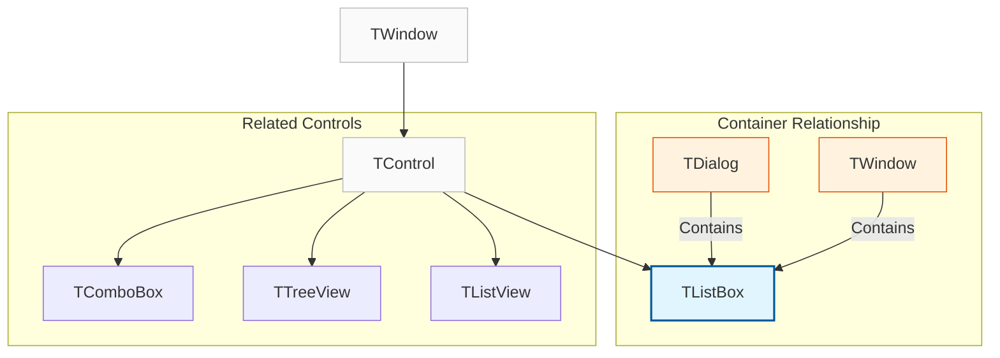
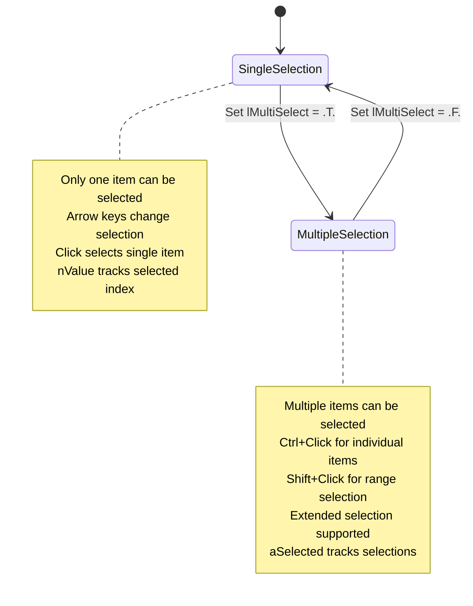
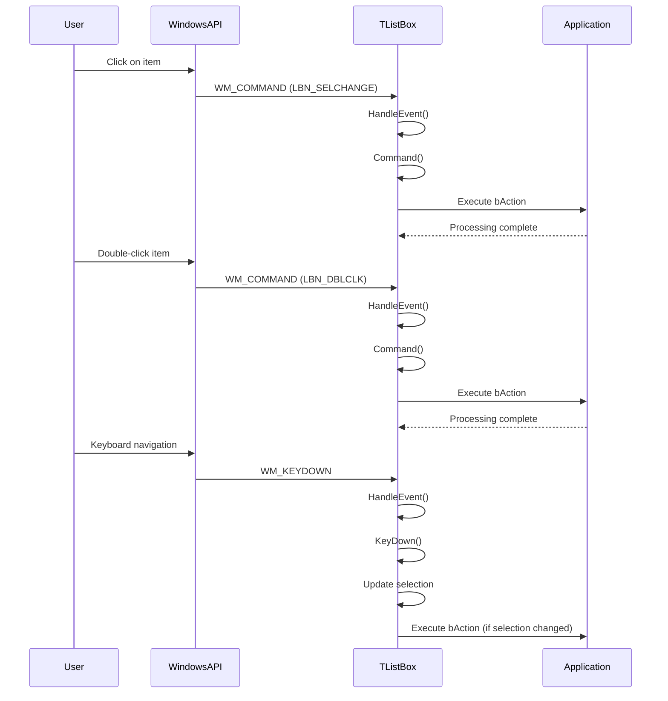

# TListBox Class

The `TListBox` class represents a list box control that displays a list of items from which users can select one or more items. It provides a versatile interface for presenting choices and handling user selections.

**Source File:** [source/classes/listbox.prg](../../../../source/classes/listbox.prg)

## Overview

The `TListBox` class is a fundamental UI control that inherits from `TControl`, providing a comprehensive interface for displaying and managing lists of items. It supports both single and multiple selection modes, sorting capabilities, and various customization options.

List boxes are essential components in user interfaces where users need to choose from a set of predefined options. They can display simple text items or be extended to show complex data with custom drawing.

## Class Hierarchy



## Selection Modes



## Key Properties

| Property | Type | Description |
|----------|------|-------------|
| `aItems` | `Array` | Array of strings representing list items |
| `nValue` | `Numeric` | Index of currently selected item (single selection) |
| `aSelected` | `Array` | Array of selected indices (multiple selection) |
| `bAction` | `Codeblock` | Executed when selection changes |
| `lMultiSelect` | `Logical` | If `.T.`, allows multiple item selection |
| `lSorted` | `Logical` | If `.T.`, items are sorted alphabetically |
| `lOwnerDraw` | `Logical` | If `.T.`, enables custom item drawing |
| `nTopIndex` | `Numeric` | Index of first visible item |
| `nItemCount` | `Numeric` | Read-only: Total number of items |

## Key Methods

| Method | Description |
|--------|-------------|
| `New()` | Constructor for creating a new list box |
| `AddItem(cItem, nIndex)` | Adds an item at specified position |
| `DelItem(nIndex)` | Deletes item at specified position |
| `GetItem(nIndex)` | Retrieves item at specified position |
| `SetItems(aItems)` | Replaces all items with new array |
| `Clear()` | Removes all items from list |
| `Find(cItem)` | Finds index of specified item |
| `Select(nIndex)` | Selects item at specified position |
| `Deselect(nIndex)` | Deselects item at specified position |
| `GetText()` | Gets text of currently selected item |
| `SetText(cText)` | Sets text of currently selected item |

## Event Processing Flow



## Usage Patterns

### Basic Single-Selection List Box

```harbour
#include "FiveWin.ch"

function Main()
   local oDlg, oListBox
   local aFruits := { "Apple", "Banana", "Orange", "Pear", "Grape" }
   local nSelection := 1

   DEFINE DIALOG oDlg TITLE "Fruit Selector" ;
      FROM 0, 0 TO 200, 250

   @ 10, 10 SAY "Select a fruit:" OF oDlg

   @ 30, 10 LISTBOX oListBox VAR nSelection ;
      ITEMS aFruits ;
      OF oDlg ;
      SIZE 150, 100 ;
      ON CHANGE MsgInfo( "You selected: " + aFruits[nSelection] )

   @ 140, 10 BUTTON "Show Selection" OF oDlg ;
      ACTION MsgInfo( "Current selection: " + aFruits[nSelection] )

   @ 140, 80 BUTTON "Close" OF oDlg ;
      ACTION oDlg:End()

   ACTIVATE DIALOG oDlg CENTERED

return nil
```

### Multiple-Selection List Box

```harbour
#include "FiveWin.ch"

function Main()
   local oDlg, oListBox
   local aColors := { "Red", "Green", "Blue", "Yellow", "Purple", "Orange", "Black", "White" }
   local aSelected := { 1, 3, 5 }  // Initially select Red, Blue, Orange

   DEFINE DIALOG oDlg TITLE "Color Selector" ;
      FROM 0, 0 TO 250, 300

   @ 10, 10 SAY "Select multiple colors (Ctrl+Click):" OF oDlg

   @ 30, 10 LISTBOX oListBox ;
      ITEMS aColors ;
      OF oDlg ;
      SIZE 150, 120 ;
      MULTISELECT ;
      ON CHANGE ShowSelectedColors( oListBox, aColors )

   @ 160, 10 BUTTON "Show Selected" OF oDlg ;
      ACTION ShowSelectedColors( oListBox, aColors )

   @ 160, 80 BUTTON "Select All" OF oDlg ;
      ACTION SelectAllColors( oListBox )

   @ 160, 150 BUTTON "Close" OF oDlg ;
      ACTION oDlg:End()

   // Initialize selections
   for local i := 1 to Len( aSelected )
      oListBox:Select( aSelected[i] )
   next

   ACTIVATE DIALOG oDlg CENTERED

return nil

static function ShowSelectedColors( oListBox, aColors )
   local aSel := oListBox:aSelected
   local cMessage := "Selected colors:" + hb_osNewLine()
   
   if Empty( aSel )
      cMessage += "None"
   else
      for local i := 1 to Len( aSel )
         cMessage += aColors[ aSel[i] ] + hb_osNewLine()
      next
   endif
   
   MsgInfo( cMessage )
return nil

static function SelectAllColors( oListBox )
   for local i := 1 to oListBox:nItemCount
      oListBox:Select( i )
   next
   MsgInfo( "All colors selected" )
return nil
```

### Dynamic List Box Management

```harbour
#include "FiveWin.ch"

function Main()
   local oDlg, oListBox
   local aTasks := { "Complete documentation", "Write unit tests", "Fix bug reports" }

   DEFINE DIALOG oDlg TITLE "Task Manager" ;
      FROM 0, 0 TO 300, 400

   @ 10, 10 SAY "Task List:" OF oDlg

   @ 30, 10 LISTBOX oListBox ;
      ITEMS aTasks ;
      OF oDlg ;
      SIZE 200, 150

   @ 190, 10 EDIT oEdit OF oDlg SIZE 150, 12

   @ 210, 10 BUTTON "Add Task" OF oDlg ;
      ACTION AddTask( oListBox, oEdit )

   @ 210, 70 BUTTON "Remove Task" OF oDlg ;
      ACTION RemoveTask( oListBox )

   @ 210, 130 BUTTON "Clear All" OF oDlg ;
      ACTION ( oListBox:Clear(), MsgInfo( "All tasks cleared" ) )

   @ 210, 190 BUTTON "Close" OF oDlg ;
      ACTION oDlg:End()

   ACTIVATE DIALOG oDlg CENTERED

return nil

static function AddTask( oListBox, oEdit )
   local cTask := AllTrim( oEdit:VarGet() )
   
   if Empty( cTask )
      MsgAlert( "Please enter a task description" )
      return .F.
   endif
   
   oListBox:AddItem( cTask )
   oEdit:VarPut( "" )
   MsgInfo( "Task added: " + cTask )
return .T.

static function RemoveTask( oListBox )
   local nIndex := oListBox:nValue
   
   if nIndex <= 0
      MsgAlert( "Please select a task to remove" )
      return .F.
   endif
   
   local cTask := oListBox:GetItem( nIndex )
   oListBox:DelItem( nIndex )
   MsgInfo( "Task removed: " + cTask )
return .T.
```

### Sorted List Box

```harbour
#include "FiveWin.ch"

function Main()
   local oDlg, oListBox
   local aNames := { "John", "Alice", "Bob", "Charlie", "Diana" }

   DEFINE DIALOG oDlg TITLE "Sorted Names" ;
      FROM 0, 0 TO 200, 250

   @ 10, 10 CHECKBOX oSort OF oDlg ;
      PROMPT "Sort names alphabetically" ;
      VALUE .T. ;
      ACTION ToggleSort( oListBox, oSort:VarGet() )

   @ 40, 10 LISTBOX oListBox ;
      ITEMS aNames ;
      OF oDlg ;
      SIZE 150, 120 ;
      SORT

   @ 170, 10 BUTTON "Add Name" OF oDlg ;
      ACTION AddRandomName( oListBox )

   @ 170, 80 BUTTON "Close" OF oDlg ;
      ACTION oDlg:End()

   ACTIVATE DIALOG oDlg CENTERED

return nil

static function ToggleSort( oListBox, lSort )
   oListBox:lSorted = lSort
   if lSort
      MsgInfo( "Names will be sorted alphabetically" )
   else
      MsgInfo( "Names will maintain insertion order" )
   endif
return nil

static function AddRandomName( oListBox )
   local aNames := { "Eve", "Frank", "Grace", "Henry", "Iris", "Jack" }
   local cName := aNames[ hb_RandomInt( 1, Len( aNames ) ) ]
   
   oListBox:AddItem( cName )
   MsgInfo( "Added: " + cName )
return nil
```

## Advanced Features

### Custom Drawing (Owner-Draw)

```harbour
#include "FiveWin.ch"

function Main()
   local oDlg, oListBox
   local aItems := { "Error", "Warning", "Info", "Success" }

   DEFINE DIALOG oDlg TITLE "Owner-Draw ListBox" ;
      FROM 0, 0 TO 200, 250

   @ 10, 10 LISTBOX oListBox ;
      ITEMS aItems ;
      OF oDlg ;
      SIZE 150, 120 ;
      OWNERDRAW ;
      ON DRAW DrawListBoxItem

   ACTIVATE DIALOG oDlg CENTERED

return nil

static function DrawListBoxItem( oListBox, hDC, nItem, nState, aRect )
   local cText := oListBox:GetItem( nItem )
   local nColor := CLR_BLACK
   
   // Set color based on item text
   switch cText
   case "Error"
      nColor := CLR_RED
      exit
   case "Warning"
      nColor := RGB( 255, 165, 0 )  // Orange
      exit
   case "Info"
      nColor := CLR_BLUE
      exit
   case "Success"
      nColor := CLR_GREEN
      exit
   endswitch
   
   // Draw background
   if HB_BITAND( nState, ODS_SELECTED ) != 0
      FillRect( hDC, aRect[1], aRect[2], aRect[3], aRect[4], RGB( 200, 200, 200 ) )
   else
      FillRect( hDC, aRect[1], aRect[2], aRect[3], aRect[4], CLR_WHITE )
   endif
   
   // Draw text
   SetTextColor( hDC, nColor )
   SetBkMode( hDC, TRANSPARENT )
   TextOut( hDC, aRect[1] + 5, aRect[2] + 2, cText )
   
return .T.
```

### Search and Filter

```harbour
#include "FiveWin.ch"

function Main()
   local oDlg, oListBox, oSearch
   local aAllItems := { "Apple", "Apricot", "Banana", "Blueberry", "Cherry", "Coconut", ;
                       "Grape", "Grapefruit", "Kiwi", "Lemon", "Lime", "Mango", ;
                       "Orange", "Peach", "Pear", "Pineapple", "Plum", "Strawberry" }

   DEFINE DIALOG oDlg TITLE "Fruit Finder" ;
      FROM 0, 0 TO 250, 300

   @ 10, 10 SAY "Search:" OF oDlg
   @ 10, 30 GET oSearch OF oDlg ;
      SIZE 100, 12 ;
      ON CHANGE { || FilterItems( oListBox, oSearch:VarGet(), aAllItems ) }

   @ 30, 10 LISTBOX oListBox ;
      ITEMS aAllItems ;
      OF oDlg ;
      SIZE 150, 150

   @ 190, 10 BUTTON "Show All" OF oDlg ;
      ACTION ( oSearch:VarPut( "" ), oListBox:SetItems( aAllItems ) )

   @ 190, 80 BUTTON "Close" OF oDlg ;
      ACTION oDlg:End()

   ACTIVATE DIALOG oDlg CENTERED

return nil

static function FilterItems( oListBox, cSearch, aAllItems )
   local aFiltered := {}
   
   if Empty( cSearch )
      oListBox:SetItems( aAllItems )
      return .T.
   endif
   
   cSearch := Upper( AllTrim( cSearch ) )
   
   for local i := 1 to Len( aAllItems )
      if At( cSearch, Upper( aAllItems[i] ) ) > 0
         AAdd( aFiltered, aAllItems[i] )
      endif
   next
   
   oListBox:SetItems( aFiltered )
return nil
```

## Related Components

* [TControl Class](TControl.md) - Base control class that TListBox inherits from
* [TComboBox Class](TComboBox.md) - Drop-down list control
* [TTreeView Class](TTreeView.md) - Hierarchical tree control
* [TListView Class](TListView.md) - Multi-column list control

## Windows API References

* [List Box Control](https://docs.microsoft.com/en-us/windows/win32/controls/list-boxes)
* [ListBox Messages](https://docs.microsoft.com/en-us/windows/win32/controls/bumper-list-box-control-reference-messages)
* [LBN_* Notifications](https://docs.microsoft.com/en-us/windows/win32/controls/bumper-list-box-control-reference-notifications)

## Best Practices

1. **Item Management**: Use `AddItem()` and `DelItem()` for dynamic list management
2. **Selection Handling**: Implement `bAction` for responsive selection changes
3. **Memory Efficiency**: Clear lists when no longer needed to free memory
4. **User Experience**: Provide visual feedback for selection changes
5. **Sorting**: Use `lSorted` property for automatic alphabetical sorting
6. **Multiple Selection**: Enable with `MULTISELECT` for complex selection scenarios
7. **Search Capability**: Implement filtering for large item lists
8. **Custom Drawing**: Use `OWNERDRAW` for specialized visual presentations

## Performance Considerations

* Large lists (>1000 items) may impact performance; consider virtual lists
* Frequent `SetItems()` calls can be expensive; batch updates when possible
* Custom drawing (`OWNERDRAW`) adds overhead; optimize drawing code
* Multiple selection mode uses more memory to track selections
* Sorting large lists can be processor-intensive
* Consider lazy loading for very large datasets