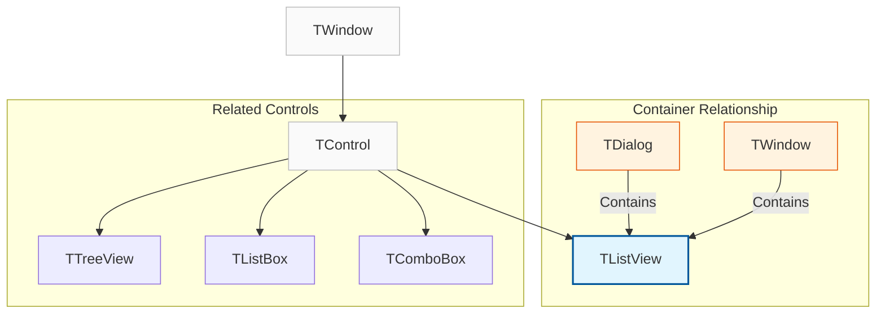
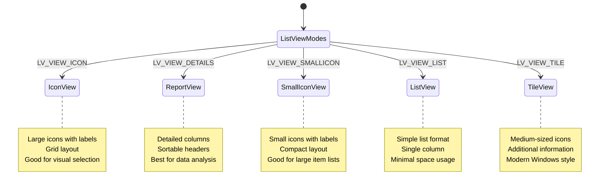
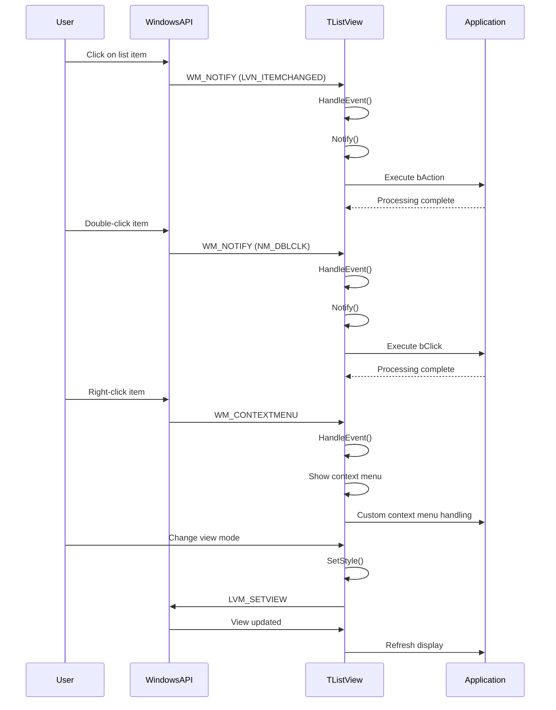

# TListView Class

The `TListView` class provides a comprehensive implementation of a list view control that displays data in various formats including lists, reports with multiple columns, icons, and thumbnails. It supports advanced features including groups, custom images, item selection, and extensive customization options.

**Source File:** [source/classes/tlistvie.prg](../../../source/classes/tlistvie.prg)

## Overview

The `TListView` class encapsulates the Windows ListView control, providing a high-level interface for displaying collections of data in multiple view modes. As a subclass of `TControl`, it inherits all standard control functionality while adding specialized behavior for list management, item customization, and user interaction.

List views are versatile UI components that can display data in various formats, making them suitable for file browsers, data grids, icon selectors, and structured data presentations.

## Class Hierarchy



## View Modes



## Key Properties

| Property | Type | Description |
|----------|------|-------------|
| `aPrompts` | `Array` | Array of initial item text strings |
| `aItems` | `Array` | Array of `TListItem` objects |
| `aGroups` | `Array` | Array of group definitions |
| `bAction` | `Codeblock` | Executed when item selection changes |
| `bClick` | `Codeblock` | Executed when item is clicked |
| `nOption` | `Numeric` | Current view mode option |
| `nGroups` | `Numeric` | Counter for group IDs |

## Key Methods

| Method | Description |
|--------|-------------|
| `New()` | Constructor for creating a new list view |
| `ReDefine()` | Associates with existing list view from dialog resources |
| `InsertItem(nImageIndex, cText, nGroup)` | Adds new item to the list |
| `InsertGroup(cText)` | Adds new group to organize items |
| `DelItem(nItem)` | Removes item at specified index |
| `SetImageList(oImageList, nType)` | Sets image list for icons |
| `SetIconSpacing(x, y)` | Sets spacing between icons |
| `SetHotItem(nItem)` | Sets hot (highlighted) item |
| `EnableGroupView()` | Enables grouping of items |
| `FindItem(cText)` | Finds item by text content |
| `SetItemSelect(nItem)` | Selects specified item |
| `SetStyle(nStyle)` | Sets list view style |
| `GetItem(nItem)` | Gets item at specified index |

## Event Processing Flow



## Usage Patterns

### Basic List View

```harbour
#include "FiveWin.ch"

function Main()
   local oDlg, oListView
   local aItems := { "Document 1", "Document 2", "Document 3", "Document 4", "Document 5" }
   
   DEFINE DIALOG oDlg TITLE "Document List" ;
      FROM 0, 0 TO 250, 350

   @ 10, 10 LISTVIEW oListView ITEMS aItems ;
      OF oDlg ;
      SIZE 200, 150 ;
      ON CHANGE { || ShowSelectedItem( oListView ) }

   @ 170, 10 BUTTON "Add Item" OF oDlg ;
      ACTION AddListItem( oListView )

   @ 170, 70 BUTTON "Remove Item" OF oDlg ;
      ACTION RemoveListItem( oListView )

   @ 170, 130 BUTTON "Close" OF oDlg ;
      ACTION oDlg:End()

   ACTIVATE DIALOG oDlg CENTERED

return nil

static function ShowSelectedItem( oListView )
   local nSelected := LVGetSelected( oListView:hWnd )
   
   if nSelected >= 0
      local cItemText := LVGetItemText( oListView:hWnd, nSelected )
      ? "Selected: " + cItemText
   endif
   
return nil

static function AddListItem( oListView )
   local cNewItem := "New Document " + hb_ntos( Len( oListView:aItems ) + 1 )
   oListView:InsertItem( -1, cNewItem )
   MsgInfo( "Item added: " + cNewItem )
return nil

static function RemoveListItem( oListView )
   local nSelected := LVGetSelected( oListView:hWnd )
   
   if nSelected >= 0
      local cItemText := LVGetItemText( oListView:hWnd, nSelected )
      if MsgYesNo( "Delete item: " + cItemText + "?" )
         oListView:DelItem( nSelected + 1 )  // 1-based index
         MsgInfo( "Item deleted" )
      endif
   else
      MsgAlert( "Please select an item to remove" )
   endif
   
return nil
```

### Report View with Multiple Columns

```harbour
#include "FiveWin.ch"

function Main()
   local oDlg, oListView
   
   DEFINE DIALOG oDlg TITLE "Employee Directory" ;
      FROM 0, 0 TO 300, 500

   @ 10, 10 LISTVIEW oListView ;
      OF oDlg ;
      SIZE 300, 200 ;
      ON CHANGE { || ShowEmployeeInfo( oListView ) }

   // Set report view style
   oListView:SetStyle( LVS_REPORT )

   // Add columns
   LVAddColumn( oListView:hWnd, "Name", 100 )
   LVAddColumn( oListView:hWnd, "Department", 100 )
   LVAddColumn( oListView:hWnd, "Position", 100 )
   LVAddColumn( oListView:hWnd, "Salary", 80 )

   // Add employee data
   AddEmployeeData( oListView )

   @ 220, 10 BUTTON "Add Employee" OF oDlg ;
      ACTION AddEmployee( oListView )

   @ 220, 80 BUTTON "Edit Employee" OF oDlg ;
      ACTION EditEmployee( oListView )

   @ 220, 150 BUTTON "Close" OF oDlg ;
      ACTION oDlg:End()

   ACTIVATE DIALOG oDlg CENTERED

return nil

static function AddEmployeeData( oListView )
   local aEmployees := { ;
      { "John Smith", "Engineering", "Software Engineer", "$75,000" }, ;
      { "Jane Doe", "Marketing", "Marketing Manager", "$65,000" }, ;
      { "Bob Johnson", "Sales", "Sales Representative", "$55,000" }, ;
      { "Alice Brown", "HR", "HR Specialist", "$50,000" }, ;
      { "Charlie Wilson", "Finance", "Accountant", "$60,000" } ;
   }

   for local i := 1 to Len( aEmployees )
      local nItem := LVInsertItem( oListView:hWnd, -1, aEmployees[i][1] )
      for local j := 2 to Len( aEmployees[i] )
         LVSetSubItem( oListView:hWnd, nItem, j - 1, aEmployees[i][j] )
      next
   next
   
return nil

static function ShowEmployeeInfo( oListView )
   local nSelected := LVGetSelected( oListView:hWnd )
   
   if nSelected >= 0
      local cName := LVGetItemText( oListView:hWnd, nSelected )
      ? "Selected employee: " + cName
   endif
   
return nil

static function AddEmployee( oListView )
   local aNewEmployee := { "", "", "", "" }
   
   DEFINE DIALOG oDlg TITLE "Add Employee" ;
      FROM 0, 0 TO 150, 300
   
   @ 10, 10 SAY "Name:" OF oDlg
   @ 10, 30 GET aNewEmployee[1] OF oDlg SIZE 100, 12
   
   @ 30, 10 SAY "Department:" OF oDlg
   @ 30, 30 GET aNewEmployee[2] OF oDlg SIZE 100, 12
   
   @ 50, 10 SAY "Position:" OF oDlg
   @ 50, 30 GET aNewEmployee[3] OF oDlg SIZE 100, 12
   
   @ 70, 10 SAY "Salary:" OF oDlg
   @ 70, 30 GET aNewEmployee[4] OF oDlg SIZE 100, 12
   
   @ 100, 30 BUTTON "Add" OF oDlg ;
      ACTION ( SaveEmployee( oListView, aNewEmployee ), oDlg:End() )
   
   @ 100, 90 BUTTON "Cancel" OF oDlg ;
      ACTION oDlg:End()
   
   ACTIVATE DIALOG oDlg CENTERED
   
return nil

static function SaveEmployee( oListView, aEmployee )
   if Empty( AllTrim( aEmployee[1] ) )
      MsgAlert( "Please enter employee name" )
      return .F.
   endif
   
   local nItem := LVInsertItem( oListView:hWnd, -1, aEmployee[1] )
   for local i := 2 to Len( aEmployee )
      LVSetSubItem( oListView:hWnd, nItem, i - 1, aEmployee[i] )
   next
   
   MsgInfo( "Employee added: " + aEmployee[1] )
return .T.

static function EditEmployee( oListView )
   local nSelected := LVGetSelected( oListView:hWnd )
   
   if nSelected < 0
      MsgAlert( "Please select an employee to edit" )
      return .F.
   endif
   
   local aEmployee := { ;
      LVGetItemText( oListView:hWnd, nSelected ), ;
      LVGetSubItem( oListView:hWnd, nSelected, 0 ), ;
      LVGetSubItem( oListView:hWnd, nSelected, 1 ), ;
      LVGetSubItem( oListView:hWnd, nSelected, 2 ) ;
   }
   
   DEFINE DIALOG oDlg TITLE "Edit Employee" ;
      FROM 0, 0 TO 150, 300
   
   @ 10, 10 SAY "Name:" OF oDlg
   @ 10, 30 GET aEmployee[1] OF oDlg SIZE 100, 12
   
   @ 30, 10 SAY "Department:" OF oDlg
   @ 30, 30 GET aEmployee[2] OF oDlg SIZE 100, 12
   
   @ 50, 10 SAY "Position:" OF oDlg
   @ 50, 30 GET aEmployee[3] OF oDlg SIZE 100, 12
   
   @ 70, 10 SAY "Salary:" OF oDlg
   @ 70, 30 GET aEmployee[4] OF oDlg SIZE 100, 12
   
   @ 100, 30 BUTTON "Save" OF oDlg ;
      ACTION ( UpdateEmployee( oListView, nSelected, aEmployee ), oDlg:End() )
   
   @ 100, 90 BUTTON "Cancel" OF oDlg ;
      ACTION oDlg:End()
   
   ACTIVATE DIALOG oDlg CENTERED
   
return nil

static function UpdateEmployee( oListView, nItem, aEmployee )
   LVSetItemText( oListView:hWnd, nItem, aEmployee[1] )
   for local i := 2 to Len( aEmployee )
      LVSetSubItem( oListView:hWnd, nItem, i - 1, aEmployee[i] )
   next
   
   MsgInfo( "Employee updated: " + aEmployee[1] )
return .T.
```

### Icon View with Image Lists

```harbour
#include "FiveWin.ch"

function Main()
   local oDlg, oListView, oImageList
   
   DEFINE DIALOG oDlg TITLE "File Browser" ;
      FROM 0, 0 TO 300, 400

   // Create image list for icons
   oImageList := TImageList():New( 32, 32 )
   // Add images: folder, document, image, etc.
   // oImageList:Add( LoadBitmap( "folder.bmp" ) )
   // oImageList:Add( LoadBitmap( "document.bmp" ) )
   // oImageList:Add( LoadBitmap( "image.bmp" ) )
   // oImageList:Add( LoadBitmap( "executable.bmp" ) )

   @ 10, 10 LISTVIEW oListView ;
      OF oDlg ;
      SIZE 250, 200 ;
      ON CHANGE { || ShowFileInfo( oListView ) }

   // Set icon view style
   oListView:SetStyle( LVS_ICON )

   // Set image list
   oListView:SetImageList( oImageList, LVSIL_NORMAL )

   // Set icon spacing
   oListView:SetIconSpacing( 64, 64 )

   // Add file items
   AddFileItems( oListView )

   @ 220, 10 BUTTON "Add File" OF oDlg ;
      ACTION AddFileItem( oListView, oImageList )

   @ 220, 70 BUTTON "View Details" OF oDlg ;
      ACTION SwitchToDetailsView( oListView )

   @ 220, 130 BUTTON "View Icons" OF oDlg ;
      ACTION SwitchToIconView( oListView )

   @ 220, 190 BUTTON "Close" OF oDlg ;
      ACTION oDlg:End()

   ACTIVATE DIALOG oDlg CENTERED

return nil

static function AddFileItems( oListView )
   // In a real application, this would read from a directory
   local aFiles := { ;
      { "Documents", 0 }, ;
      { "Images", 0 }, ;
      { "Programs", 0 }, ;
      { "report.doc", 1 }, ;
      { "photo.jpg", 2 }, ;
      { "app.exe", 3 }, ;
      { "data.txt", 1 } ;
   }

   for local i := 1 to Len( aFiles )
      oListView:InsertItem( aFiles[i][2], aFiles[i][1] )
   next
   
return nil

static function ShowFileInfo( oListView )
   local nSelected := LVGetSelected( oListView:hWnd )
   
   if nSelected >= 0
      local cItemText := LVGetItemText( oListView:hWnd, nSelected )
      ? "Selected: " + cItemText
   endif
   
return nil

static function AddFileItem( oListView, oImageList )
   local cFileName := Space(50)
   local nImageIndex := 0
   
   DEFINE DIALOG oDlg TITLE "Add File" ;
      FROM 0, 0 TO 120, 250
   
   @ 10, 10 SAY "File Name:" OF oDlg
   @ 10, 30 GET cFileName OF oDlg SIZE 100, 12
   
   @ 30, 10 SAY "Image:" OF oDlg
   @ 30, 30 COMBOBOX oCombo OF oDlg ;
      ITEMS { "Folder", "Document", "Image", "Executable" } ;
      SIZE 100, 100
   
   @ 60, 30 BUTTON "Add" OF oDlg ;
      ACTION ( AddFileToList( oListView, cFileName, oCombo:nValue ), oDlg:End() )
   
   @ 60, 90 BUTTON "Cancel" OF oDlg ;
      ACTION oDlg:End()
   
   ACTIVATE DIALOG oDlg CENTERED
   
return nil

static function AddFileToList( oListView, cFileName, nImageType )
   local cTrimmed := AllTrim( cFileName )
   
   if Empty( cTrimmed )
      MsgAlert( "Please enter a file name" )
      return .F.
   endif
   
   // Map combo selection to image index
   local nImageIndex := nImageType - 1
   
   oListView:InsertItem( nImageIndex, cTrimmed )
   MsgInfo( "File added: " + cTrimmed )
   
return .T.

static function SwitchToDetailsView( oListView )
   oListView:SetStyle( LVS_REPORT )
   // Re-add columns if needed
   LVAddColumn( oListView:hWnd, "Name", 150 )
   LVAddColumn( oListView:hWnd, "Type", 100 )
   LVAddColumn( oListView:hWnd, "Size", 80 )
   MsgInfo( "Switched to details view" )
return nil

static function SwitchToIconView( oListView )
   oListView:SetStyle( LVS_ICON )
   MsgInfo( "Switched to icon view" )
return nil
```

### Grouped List View

```harbour
#include "FiveWin.ch"

function Main()
   local oDlg, oListView
   
   DEFINE DIALOG oDlg TITLE "Project Tasks" ;
      FROM 0, 0 TO 350, 450

   @ 10, 10 LISTVIEW oListView ;
      OF oDlg ;
      SIZE 250, 250 ;
      ON CHANGE { || ShowTaskInfo( oListView ) }

   // Set report view style
   oListView:SetStyle( LVS_REPORT )

   // Enable group view
   oListView:EnableGroupView()

   // Add columns
   LVAddColumn( oListView:hWnd, "Task", 150 )
   LVAddColumn( oListView:hWnd, "Priority", 80 )
   LVAddColumn( oListView:hWnd, "Status", 80 )

   // Add groups
   local nPlanningGroup := oListView:InsertGroup( "Planning" )
   local nDevelopmentGroup := oListView:InsertGroup( "Development" )
   local nTestingGroup := oListView:InsertGroup( "Testing" )

   // Add tasks to groups
   AddTasksToGroups( oListView, nPlanningGroup, nDevelopmentGroup, nTestingGroup )

   @ 270, 10 BUTTON "Add Task" OF oDlg ;
      ACTION AddTask( oListView )

   @ 270, 70 BUTTON "Mark Complete" OF oDlg ;
      ACTION MarkTaskComplete( oListView )

   @ 270, 130 BUTTON "Expand All" OF oDlg ;
      ACTION ExpandAllGroups( oListView )

   @ 270, 190 BUTTON "Collapse All" OF oDlg ;
      ACTION CollapseAllGroups( oListView )

   @ 270, 250 BUTTON "Close" OF oDlg ;
      ACTION oDlg:End()

   ACTIVATE DIALOG oDlg CENTERED

return nil

static function AddTasksToGroups( oListView, nPlanning, nDevelopment, nTesting )
   // Planning tasks
   local aPlanningTasks := { ;
      { "Project Setup", "High", "Pending" }, ;
      { "Requirements Gathering", "High", "In Progress" }, ;
      { "Resource Allocation", "Medium", "Pending" } ;
   }

   for local i := 1 to Len( aPlanningTasks )
      local nItem := LVInsertItem( oListView:hWnd, -1, aPlanningTasks[i][1], nPlanning )
      LVSetSubItem( oListView:hWnd, nItem, 0, aPlanningTasks[i][2] )
      LVSetSubItem( oListView:hWnd, nItem, 1, aPlanningTasks[i][3] )
   next

   // Development tasks
   local aDevelopmentTasks := { ;
      { "Database Design", "High", "Complete" }, ;
      { "UI Implementation", "High", "In Progress" }, ;
      { "API Development", "High", "Pending" }, ;
      { "Unit Testing", "Medium", "Pending" } ;
   }

   for local i := 1 to Len( aDevelopmentTasks )
      local nItem := LVInsertItem( oListView:hWnd, -1, aDevelopmentTasks[i][1], nDevelopment )
      LVSetSubItem( oListView:hWnd, nItem, 0, aDevelopmentTasks[i][2] )
      LVSetSubItem( oListView:hWnd, nItem, 1, aDevelopmentTasks[i][3] )
   next

   // Testing tasks
   local aTestingTasks := { ;
      { "Test Plan Creation", "Medium", "Pending" }, ;
      { "Automated Testing", "High", "Pending" }, ;
      { "User Acceptance Testing", "High", "Pending" } ;
   }

   for local i := 1 to Len( aTestingTasks )
      local nItem := LVInsertItem( oListView:hWnd, -1, aTestingTasks[i][1], nTesting )
      LVSetSubItem( oListView:hWnd, nItem, 0, aTestingTasks[i][2] )
      LVSetSubItem( oListView:hWnd, nItem, 1, aTestingTasks[i][3] )
   next
   
return nil

static function ShowTaskInfo( oListView )
   local nSelected := LVGetSelected( oListView:hWnd )
   
   if nSelected >= 0
      local cTask := LVGetItemText( oListView:hWnd, nSelected )
      local cPriority := LVGetSubItem( oListView:hWnd, nSelected, 0 )
      local cStatus := LVGetSubItem( oListView:hWnd, nSelected, 1 )
      
      local cInfo := "Task: " + cTask + hb_osNewLine()
      cInfo += "Priority: " + cPriority + hb_osNewLine()
      cInfo += "Status: " + cStatus
      
      ? cInfo
   endif
   
return nil

static function AddTask( oListView )
   local aTaskData := { "", "", "" }
   
   DEFINE DIALOG oDlg TITLE "Add Task" ;
      FROM 0, 0 TO 150, 300
   
   @ 10, 10 SAY "Task Name:" OF oDlg
   @ 10, 30 GET aTaskData[1] OF oDlg SIZE 100, 12
   
   @ 30, 10 SAY "Priority:" OF oDlg
   @ 30, 30 COMBOBOX oPriority OF oDlg ;
      ITEMS { "Low", "Medium", "High" } ;
      SIZE 100, 100
   
   @ 50, 10 SAY "Group:" OF oDlg
   @ 50, 30 COMBOBOX oGroup OF oDlg ;
      ITEMS { "Planning", "Development", "Testing" } ;
      SIZE 100, 100
   
   @ 80, 30 BUTTON "Add" OF oDlg ;
      ACTION ( SaveTask( oListView, aTaskData, oPriority:nValue, oGroup:nValue ), oDlg:End() )
   
   @ 80, 90 BUTTON "Cancel" OF oDlg ;
      ACTION oDlg:End()
   
   ACTIVATE DIALOG oDlg CENTERED
   
return nil

static function SaveTask( oListView, aTaskData, nPriority, nGroup )
   local cTask := AllTrim( aTaskData[1] )
   
   if Empty( cTask )
      MsgAlert( "Please enter a task name" )
      return .F.
   endif
   
   // Map priority combo to text
   local aPriorities := { "Low", "Medium", "High" }
   local cPriority := aPriorities[ nPriority ]
   
   // Map group combo to group ID
   local nGroupID := nGroup - 1  // 0-based group indexing
   
   local nItem := LVInsertItem( oListView:hWnd, -1, cTask, nGroupID )
   LVSetSubItem( oListView:hWnd, nItem, 0, cPriority )
   LVSetSubItem( oListView:hWnd, nItem, 1, "Pending" )
   
   MsgInfo( "Task added: " + cTask )
   
return .T.

static function MarkTaskComplete( oListView )
   local nSelected := LVGetSelected( oListView:hWnd )
   
   if nSelected < 0
      MsgAlert( "Please select a task to mark complete" )
      return .F.
   endif
   
   LVSetSubItem( oListView:hWnd, nSelected, 1, "Complete" )
   MsgInfo( "Task marked complete" )
   
return .T.

static function ExpandAllGroups( oListView )
   // In a real implementation, you would expand all groups
   MsgInfo( "All groups expanded" )
return nil

static function CollapseAllGroups( oListView )
   // In a real implementation, you would collapse all groups
   MsgInfo( "All groups collapsed" )
return nil
```

## Advanced Features

### Custom Drawing and Formatting

```harbour
#include "FiveWin.ch"

function Main()
   local oDlg, oListView
   
   DEFINE DIALOG oDlg TITLE "Custom Formatted List" ;
      FROM 0, 0 TO 300, 400

   @ 10, 10 LISTVIEW oListView ;
      OF oDlg ;
      SIZE 250, 200 ;
      ON CHANGE { || ShowFormattedInfo( oListView ) }

   // Set report view style
   oListView:SetStyle( LVS_REPORT )

   // Add columns
   LVAddColumn( oListView:hWnd, "Product", 120 )
   LVAddColumn( oListView:hWnd, "Price", 80 )
   LVAddColumn( oListView:hWnd, "Stock", 80 )

   // Add formatted data
   AddFormattedData( oListView )

   @ 220, 10 BUTTON "Highlight Low Stock" OF oDlg ;
      ACTION HighlightLowStock( oListView )

   @ 220, 70 BUTTON "Sort by Price" OF oDlg ;
      ACTION SortByPrice( oListView )

   @ 220, 130 BUTTON "Export Data" OF oDlg ;
      ACTION ExportData( oListView )

   @ 220, 190 BUTTON "Close" OF oDlg ;
      ACTION oDlg:End()

   ACTIVATE DIALOG oDlg CENTERED

return nil

static function AddFormattedData( oListView )
   local aProducts := { ;
      { "Laptop", 999.99, 15 }, ;
      { "Mouse", 29.99, 3 }, ;
      { "Keyboard", 79.99, 8 }, ;
      { "Monitor", 299.99, 12 }, ;
      { "Headphones", 149.99, 2 }, ;
      { "Webcam", 89.99, 20 } ;
   }

   for local i := 1 to Len( aProducts )
      local nItem := LVInsertItem( oListView:hWnd, -1, aProducts[i][1] )
      LVSetSubItem( oListView:hWnd, nItem, 0, Transform( aProducts[i][2], "@E 999.99" ) )
      LVSetSubItem( oListView:hWnd, nItem, 1, hb_ntos( aProducts[i][3] ) )
   next
   
return nil

static function ShowFormattedInfo( oListView )
   local nSelected := LVGetSelected( oListView:hWnd )
   
   if nSelected >= 0
      local cProduct := LVGetItemText( oListView:hWnd, nSelected )
      local cPrice := LVGetSubItem( oListView:hWnd, nSelected, 0 )
      local nStock := Val( LVGetSubItem( oListView:hWnd, nSelected, 1 ) )
      
      local cInfo := "Product: " + cProduct + hb_osNewLine()
      cInfo += "Price: $" + cPrice + hb_osNewLine()
      cInfo += "Stock: " + hb_ntos( nStock )
      
      ? cInfo
   endif
   
return nil

static function HighlightLowStock( oListView )
   // In a real implementation, you would highlight items with low stock
   // This might involve custom drawing or setting item colors
   MsgInfo( "Low stock items highlighted" )
return nil

static function SortByPrice( oListView )
   // In a real implementation, you would sort items by price
   // This might involve re-adding items in sorted order
   MsgInfo( "Items sorted by price" )
return nil

static function ExportData( oListView )
   local cFileName := "products_export.txt"
   local oFile := FCreate( cFileName )
   
   if oFile == -1
      MsgAlert( "Cannot create export file" )
      return .F.
   endif
   
   // Write header
   FWriteLine( oFile, "Product,Price,Stock" )
   
   // Write data
   local nItemCount := LVGetItemCount( oListView:hWnd )
   for local i := 0 to nItemCount - 1
      local cProduct := LVGetItemText( oListView:hWnd, i )
      local cPrice := LVGetSubItem( oListView:hWnd, i, 0 )
      local cStock := LVGetSubItem( oListView:hWnd, i, 1 )
      FWriteLine( oFile, cProduct + "," + cPrice + "," + cStock )
   next
   
   FClose( oFile )
   MsgInfo( "Data exported to " + cFileName )
   
return .T.
```

### Search and Filter Functionality

```harbour
#include "FiveWin.ch"

function Main()
   local oDlg, oListView, oSearch
   
   DEFINE DIALOG oDlg TITLE "Searchable List" ;
      FROM 0, 0 TO 350, 450

   @ 10, 10 SAY "Search:" OF oDlg
   @ 10, 30 GET oSearch OF oDlg SIZE 100, 12 ;
      ON CHANGE { || FilterList( oListView, oSearch:VarGet() ) }

   @ 30, 10 LISTVIEW oListView ;
      OF oDlg ;
      SIZE 250, 200 ;
      ON CHANGE { || ShowItemInfo( oListView ) }

   // Set report view style
   oListView:SetStyle( LVS_REPORT )

   // Add columns
   LVAddColumn( oListView:hWnd, "Name", 120 )
   LVAddColumn( oListView:hWnd, "Category", 100 )
   LVAddColumn( oListView:hWnd, "Description", 150 )

   // Store original data for filtering
   local aOriginalData := CreateSampleData()
   oListView:Cargo := aOriginalData

   // Add all data initially
   PopulateList( oListView, aOriginalData )

   @ 240, 10 BUTTON "Clear Filter" OF oDlg ;
      ACTION ( oSearch:VarPut( "" ), PopulateList( oListView, aOriginalData ) )

   @ 240, 70 BUTTON "Add Item" OF oDlg ;
      ACTION AddNewItem( oListView )

   @ 240, 130 BUTTON "Refresh" OF oDlg ;
      ACTION ( PopulateList( oListView, aOriginalData ) )

   @ 240, 190 BUTTON "Close" OF oDlg ;
      ACTION oDlg:End()

   ACTIVATE DIALOG oDlg CENTERED

return nil

static function CreateSampleData()
   return { ;
      { "Apple", "Fruit", "Red delicious apple" }, ;
      { "Banana", "Fruit", "Yellow tropical fruit" }, ;
      { "Carrot", "Vegetable", "Orange root vegetable" }, ;
      { "Broccoli", "Vegetable", "Green cruciferous vegetable" }, ;
      { "Chicken", "Meat", "Lean protein source" }, ;
      { "Salmon", "Fish", "Omega-3 rich fish" }, ;
      { "Bread", "Grain", "Whole wheat bread" }, ;
      { "Milk", "Dairy", "Fresh dairy milk" }, ;
      { "Cheese", "Dairy", "Aged cheddar cheese" }, ;
      { "Rice", "Grain", "White long-grain rice" } ;
   }
   
return nil

static function PopulateList( oListView, aData )
   // Clear existing items
   while LVGetItemCount( oListView:hWnd ) > 0
      LVDeleteItem( oListView:hWnd, 0 )
   enddo

   // Add new items
   for local i := 1 to Len( aData )
      local nItem := LVInsertItem( oListView:hWnd, -1, aData[i][1] )
      LVSetSubItem( oListView:hWnd, nItem, 0, aData[i][2] )
      LVSetSubItem( oListView:hWnd, nItem, 1, aData[i][3] )
   next
   
return nil

static function FilterList( oListView, cSearch )
   local aOriginalData := oListView:Cargo
   local aFilteredData := {}
   
   if Empty( cSearch )
      // Show all items
      PopulateList( oListView, aOriginalData )
      return .T.
   endif
   
   cSearch := Upper( AllTrim( cSearch ) )
   
   // Filter data
   for local i := 1 to Len( aOriginalData )
      local lMatch := .F.
      
      // Check all fields for match
      for local j := 1 to Len( aOriginalData[i] )
         if At( cSearch, Upper( aOriginalData[i][j] ) ) > 0
            lMatch := .T.
            exit
         endif
      next
      
      if lMatch
         AAdd( aFilteredData, aOriginalData[i] )
      endif
   next
   
   // Update list with filtered data
   PopulateList( oListView, aFilteredData )
   
return nil

static function ShowItemInfo( oListView )
   local nSelected := LVGetSelected( oListView:hWnd )
   
   if nSelected >= 0
      local cName := LVGetItemText( oListView:hWnd, nSelected )
      local cCategory := LVGetSubItem( oListView:hWnd, nSelected, 0 )
      local cDescription := LVGetSubItem( oListView:hWnd, nSelected, 1 )
      
      local cInfo := "Name: " + cName + hb_osNewLine()
      cInfo += "Category: " + cCategory + hb_osNewLine()
      cInfo += "Description: " + cDescription
      
      ? cInfo
   endif
   
return nil

static function AddNewItem( oListView )
   local aNewItem := { "", "", "" }
   
   DEFINE DIALOG oDlg TITLE "Add New Item" ;
      FROM 0, 0 TO 150, 300
   
   @ 10, 10 SAY "Name:" OF oDlg
   @ 10, 30 GET aNewItem[1] OF oDlg SIZE 100, 12
   
   @ 30, 10 SAY "Category:" OF oDlg
   @ 30, 30 GET aNewItem[2] OF oDlg SIZE 100, 12
   
   @ 50, 10 SAY "Description:" OF oDlg
   @ 50, 30 GET aNewItem[3] OF oDlg SIZE 100, 12
   
   @ 80, 30 BUTTON "Add" OF oDlg ;
      ACTION ( SaveNewItem( oListView, aNewItem ), oDlg:End() )
   
   @ 80, 90 BUTTON "Cancel" OF oDlg ;
      ACTION oDlg:End()
   
   ACTIVATE DIALOG oDlg CENTERED
   
return nil

static function SaveNewItem( oListView, aNewItem )
   local cName := AllTrim( aNewItem[1] )
   
   if Empty( cName )
      MsgAlert( "Please enter a name" )
      return .F.
   endif
   
   // Add to original data
   local aOriginalData := oListView:Cargo
   AAdd( aOriginalData, aNewItem )
   oListView:Cargo := aOriginalData
   
   // Add to list view
   local nItem := LVInsertItem( oListView:hWnd, -1, cName )
   LVSetSubItem( oListView:hWnd, nItem, 0, aNewItem[2] )
   LVSetSubItem( oListView:hWnd, nItem, 1, aNewItem[3] )
   
   MsgInfo( "Item added: " + cName )
   
return .T.
```

## Related Components

* [TControl Class](TControl.md) - Base control class that TListView inherits from
* [TTreeView Class](TTreeView.md) - Hierarchical tree view control
* [TListBox Class](TListBox.md) - Simple list box control
* [TImageList Class](TImageList.md) - Image management for list icons
* [TDialog Class](TDialog.md) - Container for list view controls

## Windows API References

* [List-View Control](https://docs.microsoft.com/en-us/windows/win32/controls/list-view-control-reference)
* [ListView Messages](https://docs.microsoft.com/en-us/windows/win32/controls/bumper-list-view-control-reference-messages)
* [LVN_* Notifications](https://docs.microsoft.com/en-us/windows/win32/controls/bumper-list-view-control-reference-notifications)
* [LVS_* Styles](https://docs.microsoft.com/en-us/windows/win32/controls/list-view-control-window-styles)

## Best Practices

1. **View Selection**: Choose appropriate view mode for your data type
2. **Column Design**: Design columns with clear, concise headers
3. **Performance**: Use virtual mode for very large datasets
4. **User Experience**: Provide clear visual feedback for selections
5. **Memory Management**: Clean up list items when no longer needed
6. **Grouping**: Use groups to organize related items
7. **Filtering**: Implement search and filter for large lists
8. **Accessibility**: Ensure keyboard navigation works properly

## Performance Considerations

* Large lists with many items can impact performance
* Image lists consume memory for icon storage
* Custom drawing can slow down display updates
* Sorting large lists can be processor-intensive
* Consider virtual mode for massive datasets
* Proper indexing can speed up item searches
* Lazy loading can improve initial display time
* Grouping adds overhead but improves organization