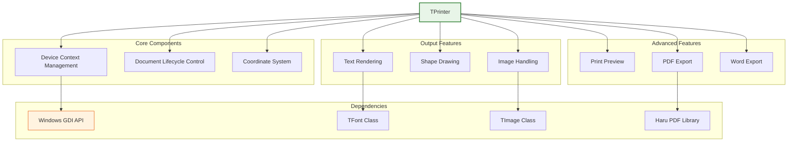
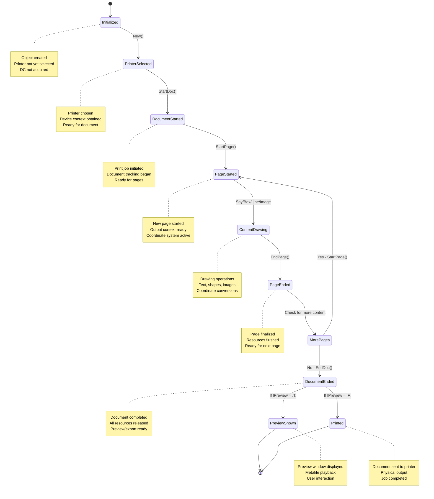
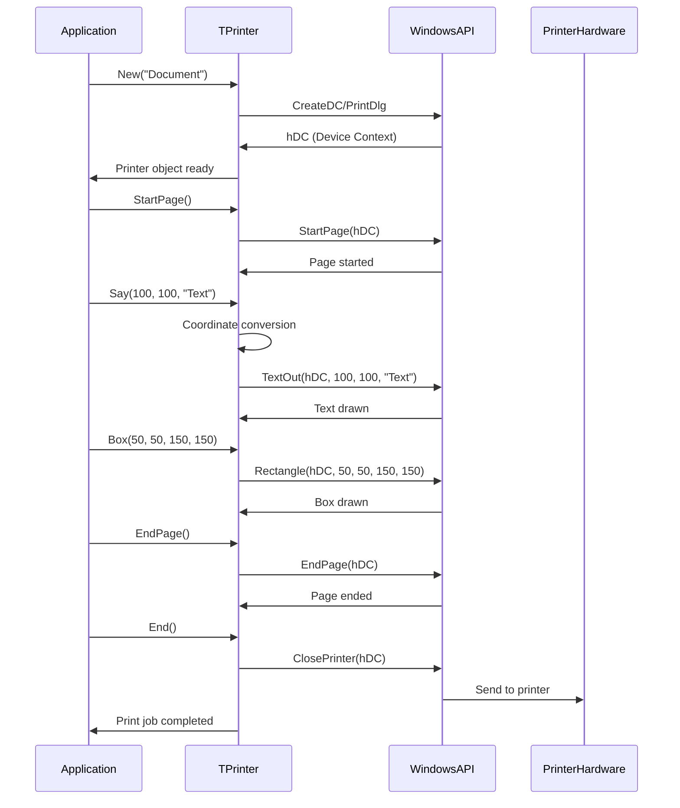

# TPrinter Class

The `TPrinter` class provides a comprehensive abstraction of the Windows printing subsystem. It dramatically simplifies the creation of reports and documents by allowing developers to draw text, shapes, and images on a page without directly handling the complexity of the Windows GDI API.

**Source File:** [source/classes/printer.prg](../../../../source/classes/printer.prg)

## Overview

The `TPrinter` class serves as a complete printing solution that encapsulates all aspects of document creation, from printer selection and device context management to output rendering and preview functionality. 

Its key features include:
* **Printer Management**: Handles printer selection, device context creation and release
* **Document Control**: Manages the complete document lifecycle from start to finish
* **Coordinate Abstraction**: Works in multiple units (pixels, millimeters, inches) with automatic conversions
* **High-Level Drawing API**: Provides intuitive methods for common elements like text, boxes, lines, and images
* **Print Preview**: Includes a powerful preview system that captures print output and displays it in a window
* **Export Capabilities**: Can redirect output to generate PDF documents or Microsoft Word files

## Class Architecture



## Printing Workflow



## Key Properties

| Property | Type | Description |
|----------|------|-------------|
| `hDC` | `Numeric` | Handle to the base printer Device Context |
| `hDCOut` | `Numeric` | Output Device Context (printer DC or metafile DC) |
| `lPreview` | `Logical` | If `.T.`, activates preview mode |
| `lStarted` | `Logical` | Indicates if document has started |
| `nPage` | `Numeric` | Current page number |
| `oFont` | `Object` | Currently selected TFont for text operations |
| `aMeta` | `Array` | Array of temporary metafile paths for preview |
| `nOrientation` | `Numeric` | Page orientation (portrait/landscape) |
| `nCopies` | `Numeric` | Number of copies to print |
| `cDocumentName` | `String` | Name of the print document |
| `lLandscape` | `Logical` | If `.T.`, landscape orientation |

## Key Methods

| Method | Description |
|--------|-------------|
| `New(cDocumentName, lUser, lPreview)` | Constructor for creating printer object |
| `StartPage()` | Initiates a new page for printing |
| `EndPage()` | Finalizes current page |
| `End()` | Completes entire print job |
| `Say(nRow, nCol, cText)` | Prints text at specified pixel coordinates |
| `CmSay(nRow, nCol, cText)` | Prints text at specified centimeter coordinates |
| `InchSay(nRow, nCol, cText)` | Prints text at specified inch coordinates |
| `Box(nTop, nLeft, nBottom, nRight)` | Draws rectangle on page |
| `Line(nRow1, nCol1, nRow2, nCol2)` | Draws line between two points |
| `PrintImage(nRow, nCol, uImage)` | Prints image at specified position |
| `SetFont(oFont)` | Sets font for text operations |
| `SetLandscape()` | Sets page to landscape orientation |
| `SetPortrait()` | Sets page to portrait orientation |
| `PageWidth(cUnits)` | Returns page width in specified units |
| `PageHeight(cUnits)` | Returns page height in specified units |
| `Cmtr2Pix(nValue)` | Converts centimeters to pixels |
| `Inch2Pix(nValue)` | Converts inches to pixels |

## Coordinate System

```mermaid
graph TD
    A[Coordinate System]
    
    subgraph "Origin Points"
        B[Absolute Origin<br>Paper corner (0,0)]
        C[Relative Origin<br>Printable area (0,0)]
    end
    
    subgraph "Measurement Units"
        D[Pixels<br>Device dots]
        E[Centimeters<br>Metric units]
        F[Inches<br>Imperial units]
    end
    
    subgraph "Coordinate Mapping"
        G[X-Axis<br>Horizontal position]
        H[Y-Axis<br>Vertical position]
    end
    
    A --> B
    A --> C
    A --> D
    A --> E
    A --> F
    A --> G
    A --> H
    
    style A fill:#e1f5fe,stroke:#01579b,stroke-width:2px
    style B fill:#fff3e0,stroke:#e65100,stroke-width:1px
    style C fill:#fff3e0,stroke:#e65100,stroke-width:1px
```

## Event Processing Flow



## Usage Patterns

### Basic Text Printing

```harbour
#include "FiveWin.ch"

function Main()
   local oPrn, oFont
   
   // Create printer object
   oPrn := TPrinter():New( "Basic Text Document" )
   
   if oPrn:hDC != 0  // Check if printer is valid
      // Create font
      DEFINE FONT oFont NAME "Arial" SIZE 0, -12
      
      // Set font
      oPrn:SetFont( oFont )
      
      // Start document page
      oPrn:StartPage()
      
      // Print text at various positions
      oPrn:Say( 100, 100, "Hello, World!" )
      oPrn:Say( 150, 100, "This is a basic text printing example" )
      oPrn:Say( 200, 100, "Current date: " + DToC( Date() ) )
      oPrn:Say( 250, 100, "Current time: " + Time() )
      
      // Draw a box around the text
      oPrn:Box( 90, 90, 280, 400 )
      
      // End page and document
      oPrn:EndPage()
      oPrn:End()
      
      // Release font
      RELEASE FONT oFont
      
      MsgInfo( "Document printed successfully" )
   else
      MsgAlert( "Could not initialize printer" )
   endif
   
return nil
```

### Metric Unit Printing with Preview

```harbour
#include "FiveWin.ch"

function Main()
   local oPrn, oFont
   
   // Create printer object with preview enabled
   oPrn := TPrinter():New( "Metric Document", .F., .T. )  // lPreview = .T.
   
   if oPrn:hDC != 0
      // Create font
      DEFINE FONT oFont NAME "Times New Roman" SIZE 0, -14
      
      // Set font
      oPrn:SetFont( oFont )
      
      // Start first page
      oPrn:StartPage()
      
      // Use centimeter coordinates
      oPrn:CmSay( 1, 1, "Document Title" )
      oPrn:CmSay( 2, 1, "Using metric units for positioning" )
      oPrn:CmSay( 3, 1, "Page size: " + ;
                 hb_ntos( oPrn:PageWidth( "CM" ), 2 ) + " x " + ;
                 hb_ntos( oPrn:PageHeight( "CM" ), 2 ) + " cm" )
      
      // Draw horizontal line
      oPrn:CmLine( 3.5, 1, 3.5, 15 )
      
      // Add some content
      for local i := 1 to 20
         local nY := 4 + ( i * 0.7 )
         oPrn:CmSay( nY, 1, "Line " + hb_ntos( i ) + ": Sample content for line " + hb_ntos( i ) )
      next
      
      oPrn:EndPage()
      
      // Start second page
      oPrn:StartPage()
      
      oPrn:CmSay( 1, 1, "Second Page" )
      oPrn:CmSay( 2, 1, "This is content on the second page" )
      
      // Draw a box
      oPrn:CmBox( 3, 1, 10, 15 )
      
      oPrn:EndPage()
      
      // End document - this will show preview window
      oPrn:End()
      
      RELEASE FONT oFont
      
      MsgInfo( "Document preview completed" )
   endif
   
return nil
```

### Landscape Orientation Printing

```harbour
#include "FiveWin.ch"

function Main()
   local oPrn, oFont
   
   // Create printer object
   oPrn := TPrinter():New( "Landscape Document" )
   
   if oPrn:hDC != 0
      // Set landscape orientation
      oPrn:SetLandscape()
      
      // Create bold font
      DEFINE FONT oFont NAME "Arial" SIZE 0, -16 BOLD
      
      oPrn:SetFont( oFont )
      
      oPrn:StartPage()
      
      // Print header in landscape
      oPrn:Say( 50, 100, "LANDSCAPE ORIENTATION DOCUMENT" )
      oPrn:Say( 100, 100, "Page dimensions: " + ;
               hb_ntos( oPrn:PageWidth( "CM" ), 2 ) + " x " + ;
               hb_ntos( oPrn:PageHeight( "CM" ), 2 ) + " cm" )
      
      // Draw decorative elements
      oPrn:Box( 40, 90, 150, 600 )
      
      // Print table-like content
      local aHeaders := { "Item", "Description", "Quantity", "Price" }
      local aData := { ;
         { "1", "Product A", "10", "$25.00" }, ;
         { "2", "Product B", "5", "$15.50" }, ;
         { "3", "Product C", "8", "$32.75" }, ;
         { "4", "Product D", "12", "$18.90" } ;
      }
      
      // Print headers
      local nStartY := 200
      local nStartX := 100
      local nColWidth := 120
      
      for local i := 1 to Len( aHeaders )
         oPrn:Say( nStartY, nStartX + ( ( i - 1 ) * nColWidth ), aHeaders[i] )
      next
      
      // Draw header underline
      oPrn:Line( nStartY + 20, nStartX, nStartY + 20, nStartX + ( Len( aHeaders ) * nColWidth ) )
      
      // Print data rows
      for local i := 1 to Len( aData )
         local nY := nStartY + 30 + ( ( i - 1 ) * 25 )
         for local j := 1 to Len( aData[i] )
            oPrn:Say( nY, nStartX + ( ( j - 1 ) * nColWidth ), aData[i][j] )
         next
      next
      
      oPrn:EndPage()
      oPrn:End()
      
      RELEASE FONT oFont
      
      MsgInfo( "Landscape document printed" )
   endif
   
return nil
```

## Advanced Features

### Multi-Page Reports with Headers/Footers

```harbour
#include "FiveWin.ch"

function Main()
   local oPrn, oFont, oHeaderFont, oFooterFont
   local nPageNumber := 0
   
   // Create printer object with preview
   oPrn := TPrinter():New( "Multi-Page Report", .F., .T. )
   
   if oPrn:hDC != 0
      // Create fonts
      DEFINE FONT oHeaderFont NAME "Arial" SIZE 0, -16 BOLD
      DEFINE FONT oFont NAME "Arial" SIZE 0, -12
      DEFINE FONT oFooterFont NAME "Arial" SIZE 0, -10 ITALIC
      
      // Generate report with multiple pages
      GenerateMultiPageReport( oPrn, oHeaderFont, oFont, oFooterFont, @nPageNumber )
      
      // End document to show preview
      oPrn:End()
      
      RELEASE FONT oHeaderFont
      RELEASE FONT oFont
      RELEASE FONT oFooterFont
      
      MsgInfo( "Multi-page report completed with " + hb_ntos( nPageNumber ) + " pages" )
   endif
   
return nil

static function GenerateMultiPageReport( oPrn, oHeaderFont, oFont, oFooterFont, nPageNumber )
   local nTotalRecords := 150
   local nRecordsPerPage := 25
   local nTotalPages := Int( ( nTotalRecords + nRecordsPerPage - 1 ) / nRecordsPerPage )
   
   // Print each page
   for local nPage := 1 to nTotalPages
      nPageNumber++
      
      oPrn:StartPage()
      
      // Print header
      PrintPageHeader( oPrn, oHeaderFont, nPageNumber, nTotalPages )
      
      // Print content
      local nStartRecord := ( ( nPage - 1 ) * nRecordsPerPage ) + 1
      local nEndRecord := Min( nStartRecord + nRecordsPerPage - 1, nTotalRecords )
      PrintPageContent( oPrn, oFont, nStartRecord, nEndRecord, nTotalRecords )
      
      // Print footer
      PrintPageFooter( oPrn, oFooterFont, nPageNumber, Date(), Time() )
      
      oPrn:EndPage()
   next
   
return nil

static function PrintPageHeader( oPrn, oHeaderFont, nPage, nTotalPages )
   // Set header font
   oPrn:SetFont( oHeaderFont )
   
   // Print report title
   local cTitle := "SALES REPORT"
   local nTitleWidth := GetTextWidth( oPrn:hDCOut, cTitle )
   local nPageWidth := oPrn:PageWidth( "PIXEL" )
   local nXPosition := Int( ( nPageWidth - nTitleWidth ) / 2 )
   
   oPrn:Say( 50, nXPosition, cTitle )
   
   // Print page information
   oPrn:SetFont( oHeaderFont )  // Assuming we have access to standard font methods
   oPrn:Say( 50, nPageWidth - 150, "Page " + hb_ntos( nPage ) + " of " + hb_ntos( nTotalPages ) )
   
   // Draw separator line
   oPrn:Line( 80, 50, 80, nPageWidth - 50 )
   
return nil

static function PrintPageContent( oPrn, oFont, nStartRecord, nEndRecord, nTotalRecords )
   // Set content font
   oPrn:SetFont( oFont )
   
   // Print column headers
   local aColumns := { "Record", "Date", "Customer", "Amount", "Status" }
   local nStartY := 100
   local nStartX := 50
   local nColWidth := 120
   
   for local i := 1 to Len( aColumns )
      oPrn:Say( nStartY, nStartX + ( ( i - 1 ) * nColWidth ), aColumns[i] )
   next
   
   // Draw header underline
   local nLineWidth := Len( aColumns ) * nColWidth
   oPrn:Line( nStartY + 20, nStartX, nStartY + 20, nStartX + nLineWidth )
   
   // Print data rows
   for local i := nStartRecord to nEndRecord
      local nY := nStartY + 30 + ( ( i - nStartRecord ) * 20 )
      
      // Generate sample data
      local dDate := Date() - ( nTotalRecords - i )
      local cCustomer := "Customer " + hb_ntos( i )
      local nAmount := ( i * 12.50 ) + ( ( i % 7 ) * 5.25 )
      local cStatus := iif( ( i % 3 ) == 0, "Pending", iif( ( i % 3 ) == 1, "Shipped", "Delivered" ) )
      
      oPrn:Say( nY, nStartX, hb_ntos( i ) )
      oPrn:Say( nY, nStartX + nColWidth, DToC( dDate ) )
      oPrn:Say( nY, nStartX + ( 2 * nColWidth ), cCustomer )
      oPrn:Say( nY, nStartX + ( 3 * nColWidth ), "$" + hb_ntos( nAmount, 2 ) )
      oPrn:Say( nY, nStartX + ( 4 * nColWidth ), cStatus )
   next
   
return nil

static function PrintPageFooter( oPrn, oFooterFont, nPage, dDate, cTime )
   local nPageHeight := oPrn:PageHeight( "PIXEL" )
   
   // Set footer font
   oPrn:SetFont( oFooterFont )
   
   // Print footer information
   oPrn:Say( nPageHeight - 50, 50, "Report Generated: " + DToC( dDate ) + " " + cTime )
   oPrn:Say( nPageHeight - 50, 300, "Confidential - For Internal Use Only" )
   
   // Draw footer line
   oPrn:Line( nPageHeight - 70, 50, nPageHeight - 70, oPrn:PageWidth( "PIXEL" ) - 50 )
   
return nil
```

### Image Printing with Scaling

```harbour
#include "FiveWin.ch"

function Main()
   local oPrn, oFont
   
   // Create printer object with preview
   oPrn := TPrinter():New( "Image Document", .F., .T. )
   
   if oPrn:hDC != 0
      DEFINE FONT oFont NAME "Arial" SIZE 0, -14
      
      oPrn:SetFont( oFont )
      
      oPrn:StartPage()
      
      // Print title
      oPrn:Say( 50, 100, "IMAGE PRINTING EXAMPLE" )
      
      // Print explanation
      oPrn:Say( 100, 100, "This document demonstrates image printing capabilities" )
      
      // Try to print an image (if available)
      if File( "sample_image.bmp" )
         // Print image at specified position
         oPrn:PrintImage( 150, 100, "sample_image.bmp" )
         oPrn:Say( 300, 100, "Original size image" )
         
         // Print scaled image
         // Note: This would require additional parameters for scaling in actual implementation
         // oPrn:PrintImage( 350, 100, "sample_image.bmp", 200, 150 )  // width, height
         oPrn:Say( 500, 100, "Scaled image (example)" )
      else
         oPrn:Say( 150, 100, "Sample image file not found" )
         oPrn:Say( 170, 100, "Please provide a valid image file for testing" )
         
         // Draw placeholder box
         oPrn:Box( 200, 100, 300, 300 )
         oPrn:Say( 230, 120, "IMAGE PLACEHOLDER" )
         oPrn:Say( 250, 120, "(Image would appear here)" )
      endif
      
      // Print chart-like graphics
      PrintChartExample( oPrn )
      
      oPrn:EndPage()
      oPrn:End()
      
      RELEASE FONT oFont
      
      MsgInfo( "Image document completed" )
   endif
   
return nil

static function PrintChartExample( oPrn )
   // Print chart title
   oPrn:Say( 350, 100, "SALES CHART EXAMPLE" )
   
   // Draw chart axes
   local nChartX := 100
   local nChartY := 400
   local nChartWidth := 300
   local nChartHeight := 200
   
   // Y-axis
   oPrn:Line( nChartY - nChartHeight, nChartX, nChartY, nChartX )
   
   // X-axis
   oPrn:Line( nChartY, nChartX, nChartY, nChartX + nChartWidth )
   
   // Draw sample data points (bar chart)
   local aSalesData := { 45, 67, 32, 89, 56, 78, 43, 65, 52, 71 }
   local nBarWidth := 20
   local nMaxValue := 100
   
   for local i := 1 to Len( aSalesData )
      local nBarHeight := Int( ( aSalesData[i] / nMaxValue ) * nChartHeight )
      local nBarX := nChartX + 10 + ( ( i - 1 ) * ( nBarWidth + 5 ) )
      local nBarY := nChartY - nBarHeight
      
      // Draw bar
      oPrn:Box( nBarY, nBarX, nChartY, nBarX + nBarWidth )
      
      // Label bars
      oPrn:Say( nChartY + 10, nBarX, hb_ntos( i ) )
   next
   
   // Axis labels
   oPrn:Say( nChartY + 30, nChartX, "Months" )
   oPrn:Say( nChartY - nChartHeight - 20, nChartX - 30, "Sales ($)" )
   
return nil
```

## Related Components

* [TFont Class](TFont.md) - Font management for text rendering
* [TImage Class](TImage.md) - Image handling and manipulation
* [TPreview Class](TPreview.md) - Print preview functionality
* [Windows GDI Functions](https://docs.microsoft.com/en-us/windows/win32/gdi/windows-gdi) - Underlying Windows graphics API
* [Haru PDF Library](http://libharu.org/) - PDF generation library

## Windows API References

* [PrintDlg](https://docs.microsoft.com/en-us/windows/win32/api/commdlg/ns-commdlg-printdlgw)
* [StartDoc](https://docs.microsoft.com/en-us/windows/win32/api/wingdi/nf-wingdi-startdoca)
* [StartPage](https://docs.microsoft.com/en-us/windows/win32/api/wingdi/nf-wingdi-startpage)
* [EndPage](https://docs.microsoft.com/en-us/windows/win32/api/wingdi/nf-wingdi-endpage)
* [EndDoc](https://docs.microsoft.com/en-us/windows/win32/api/wingdi/nf-wingdi-enddoc)
* [TextOut](https://docs.microsoft.com/en-us/windows/win32/api/wingdi/nf-wingdi-textouta)
* [Rectangle](https://docs.microsoft.com/en-us/windows/win32/api/wingdi/nf-wingdi-rectangle)
* [MoveToEx](https://docs.microsoft.com/en-us/windows/win32/api/wingdi/nf-wingdi-movetoex)
* [LineTo](https://docs.microsoft.com/en-us/windows/win32/api/wingdi/nf-wingdi-lineto)

## Best Practices

1. **Printer Validation**: Always check if `hDC` is valid before printing
2. **Resource Management**: Properly release fonts and other resources
3. **Error Handling**: Implement proper error handling for print operations
4. **Preview First**: Use preview mode during development and testing
5. **Page Orientation**: Set orientation before starting document
6. **Coordinate System**: Choose appropriate measurement units for your content
7. **Font Management**: Use appropriate fonts for readability and consistency
8. **Memory Management**: Clean up temporary files and resources after printing

## Performance Considerations

* Complex graphics and images can slow down print operations
* Large documents with many pages consume memory for metafile storage
* Font operations can impact performance with many text elements
* Image scaling and processing adds overhead
* Preview mode requires additional memory for metafile creation
* Consider progressive printing for very large documents
* Optimize coordinate calculations for repeated operations
* Batch similar drawing operations when possible