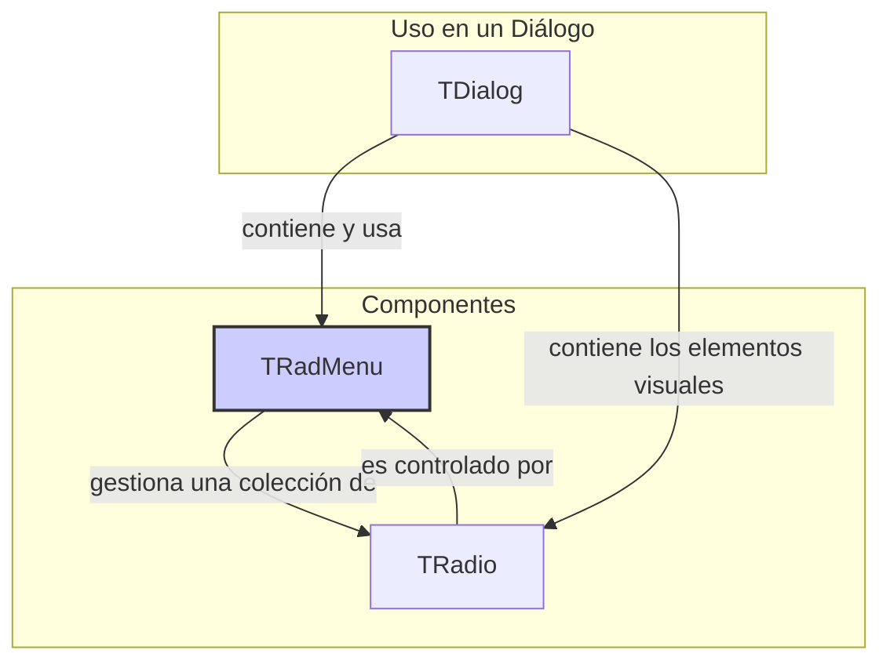

# Clase `TRadMenu`

**Archivo Fuente:** [source/classes/radmenu.prg](..\..\..\source\classes\radmenu.prg)

## 1. Propósito y Alcance

La clase `TRadMenu` es un control no visual que actúa como un gestor o controlador para un grupo de objetos `TRadio`. Su propósito es asegurar el comportamiento de exclusión mutua característico de los grupos de botones de opción: solo un `TRadio` del grupo puede estar seleccionado a la vez.

Se vincula a una variable, típicamente numérica, a través de su propiedad `bSetGet`. El valor de esta variable corresponde a la propiedad `nPos` (posición) del `TRadio` que está seleccionado.

## 2. Arquitectura y Relaciones

`TRadMenu` es una clase lógica, no visual, que no hereda de `TControl`. Su rol es de **controlador** en un patrón de composición. Contiene una colección de objetos `TRadio` y coordina su estado.

### Diagrama de Composición



## 3. Propiedades (Data) Clave

| Propiedad     | Tipo        | Línea | Descripción                                                                                             |
|---------------|-------------|-------|---------------------------------------------------------------------------------------------------------|
| `aItems`      | `ARRAY`     | 9     | Un array que contiene todos los objetos `TRadio` que pertenecen a este grupo.                           |
| `bSetGet`     | `CODEBLOCK` | 10    | El bloque de código para obtener/establecer el valor numérico que indica la opción seleccionada.        |
| `bChange`     | `CODEBLOCK` | 10    | Bloque de código que se ejecuta cuando la selección cambia.                                             |
| `nOption`     | `NUMERIC`   | N/A   | **(SETGET)** Propiedad de acceso para obtener o establecer la opción seleccionada.                      |

## 4. Métodos Clave

| Método                  | Línea | Descripción                                                                                                                            |
|-------------------------|-------|----------------------------------------------------------------------------------------------------------------------------------------|
| `New(...)`              | 88    | **(CONSTRUCTOR)** Crea el `TRadMenu` y, a su vez, instancia todos los objetos `TRadio` a partir de un array de cadenas (`acItems`).      |
| `Define(...)`           | 200   | **(CONSTRUCTOR)** Permite crear un `TRadMenu` vacío para luego añadirle objetos `TRadio` manualmente con `AddRadio()`.             |
| `AddRadio(oRadio)`      | 210   | Añade un objeto `TRadio` existente al grupo.                                                                                           |
| `Select(oRadio)`        | 65    | **(MESSAGE)** Se invoca desde el `TRadio` que recibe el clic. Identifica la posición del `oRadio` y llama a `SetOption()`.           |
| `SetOption(nNewOption)` | 290   | El núcleo de la lógica. Desmarca la opción anterior, marca la nueva opción (`nNewOption`) y actualiza el estado interno.          |
| `Refresh()`             | 260   | Sincroniza el estado visual de todos los `TRadio` en `aItems` con el valor actual de la variable vinculada.                        |
| `GoNext()` / `GoPrev()` | 71, 69| Métodos para la navegación con teclado, que cambian la selección al siguiente o anterior `TRadio` del grupo.                         |
| `Enable()` / `Disable()`| 50-55 | Habilita o deshabilita todos los `TRadio` del grupo a la vez.                                                                          |

## 5. Patrones de Uso y Ejemplos

El uso de `TRadMenu` se demuestra mejor en el ejemplo de la documentación de `TRadio`, ya que ambas clases son interdependientes. El patrón general es:

1.  **Crear el `TRadMenu`:** Se usa `DEFINE RADIOMENU` y se vincula a una variable numérica con `VAR`.
2.  **Crear los `TRadio`:** Se usa `RADIO` o `RADIOITEM` para cada opción.
3.  **Asociar:** Cada `TRadio` se asocia al `TRadMenu` con la cláusula `RADIOMENU`.

```harbour
#include "FiveWin.ch"

FUNCTION Main()
   LOCAL oDlg, oRadMenu
   LOCAL nOpcion := 2 // La segunda opción estará seleccionada por defecto

   DEFINE DIALOG oDlg TITLE "Ejemplo de TRadMenu"

   // 1. El TRadMenu gestiona la variable nOpcion
   DEFINE RADIOMENU oRadMenu VAR nOpcion OF oDlg

   // 2. Cada RADIOITEM se añade al TRadMenu
   @ 20, 10 RADIOITEM "Opción 1" OF oDlg RADIOMENU oRadMenu
   @ 40, 10 RADIOITEM "Opción 2" OF oDlg RADIOMENU oRadMenu
   @ 60, 10 RADIOITEM "Opción 3" OF oDlg RADIOMENU oRadMenu

   ACTIVATE DIALOG oDlg

RETURN NIL
```

*   El `TRadMenu` (`oRadMenu`) es el objeto central que mantiene el estado (`nOpcion`).
*   Los `TRadio` (creados por `RADIOITEM`) son los elementos visuales que delegan su lógica de clic al `TRadMenu`.
*   Cuando el usuario selecciona "Opción 3", el `TRadio` correspondiente llama a `oRadMenu:Select()`. `TRadMenu` actualiza `nOpcion` a `3` y se encarga de desmarcar la "Opción 2" y marcar la "Opción 3".

