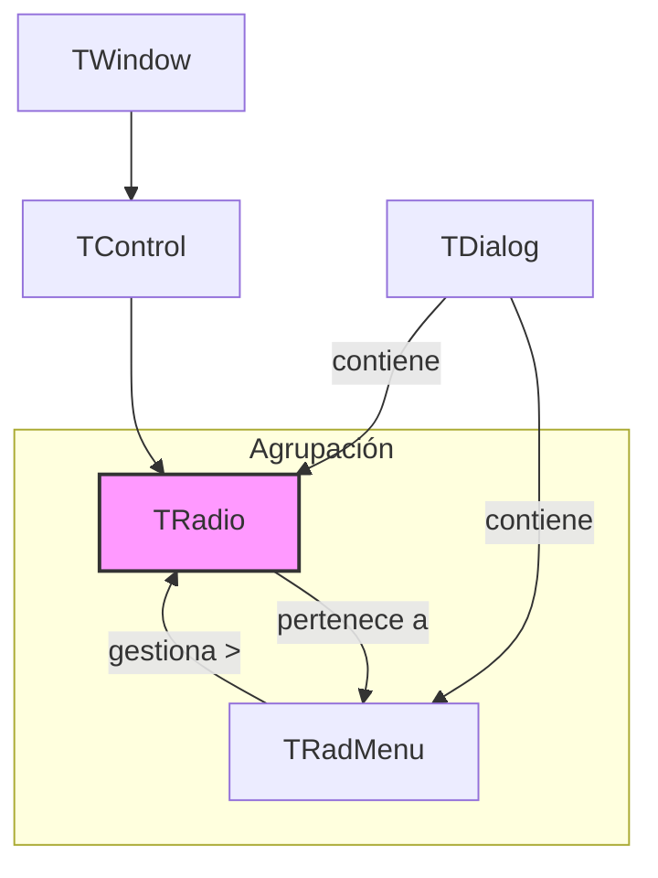

# Clase `TRadio`

**Archivo Fuente:** [source/classes/radio.prg](..\..\..\source\classes\radio.prg)

## 1. Propósito y Alcance

La clase `TRadio` implementa un único botón de opción (RADIOBUTTON). Hereda de `TControl` y está diseñada para trabajar en conjunto con un objeto `TRadMenu` para crear grupos de opciones mutuamente excluyentes, donde solo una opción del grupo puede estar seleccionada a la vez.

El propósito de un `TRadio` no es gestionar su estado de forma aislada, sino representar una de las posibles opciones dentro de un grupo. La gestión del estado (qué opción está seleccionada) es responsabilidad del `TRadMenu` contenedor.

## 2. Arquitectura y Relaciones

`TRadio` es un descendiente de `TControl`. Su característica arquitectónica clave es la composición: varios objetos `TRadio` son gestionados por un objeto `TRadMenu`. El `TRadMenu` se vincula a una variable (generalmente numérica) que almacena la opción seleccionada.

### Diagrama de Herencia y Composición



## 3. Propiedades (Data) Clave

| Propiedad     | Tipo        | Línea | Descripción                                                                                             |
|---------------|-------------|-------|---------------------------------------------------------------------------------------------------------|
| `oRadMenu`    | `OBJECT`    | 15    | Una referencia al objeto `TRadMenu` que gestiona este `TRadio`. Es la propiedad más importante.         |
| `nPos`        | `NUMERIC`   | 16    | La posición (índice) de este botón dentro del grupo `TRadMenu`. El valor del `TRadMenu` coincidirá con este `nPos` cuando esté seleccionado. | 
| `lChecked`    | `LOGICAL`   | 14    | Almacena el estado de selección inicial del botón. Durante la ejecución, el estado real lo determina el `TRadMenu`. |

## 4. Métodos Clave

| Método                  | Línea | Descripción                                                                                                                            |
|-------------------------|-------|----------------------------------------------------------------------------------------------------------------------------------------|
| `New(...)`              | 65    | **(CONSTRUCTOR)** Crea una instancia de `TRadio` y la asocia a un `TRadMenu`.                                                          |
| `Click()`               | 30    | Anula el método de `TControl`. Delega la lógica de selección al `TRadMenu` (`::oRadMenu:Select(Self)`) y luego refresca el grupo.      |
| `Refresh()`             | 260   | Actualiza el estado visual del botón (marcado/desmarcado) preguntando al `TRadMenu` cuál es la opción actualmente seleccionada.      |
| `KeyDown(...)`          | 250   | Anula el método de `TControl` para permitir la navegación entre los botones del mismo grupo usando las teclas de flecha.             |
| `SetCheck(lOnOff)`      | 45    | Establece el estado visual del botón, pero no actualiza la lógica del grupo. Usado internamente por `TRadMenu`.                     |
| `lIsChecked()`          | 48    | Devuelve el estado visual actual del control consultando directamente a la API de Windows.                                            |

## 5. Patrones de Uso y Ejemplos

### Ejemplo: Crear un grupo de opciones de RadioButton

El uso de `TRadio` está intrínsecamente ligado a `TRadMenu`. El siguiente ejemplo muestra cómo crear un grupo para seleccionar un método de envío.

```harbour
#include "FiveWin.ch"

FUNCTION Main()
   LOCAL oDlg, oRadMenu
   LOCAL nMetodoEnvio := 1 // Variable numérica que almacena la opción seleccionada

   DEFINE DIALOG oDlg TITLE "Método de Envío"

   // 1. Definir el objeto que gestionará el grupo
   // La cláusula VAR lo vincula a la variable nMetodoEnvio
   DEFINE RADIOMENU oRadMenu VAR nMetodoEnvio OF oDlg

   // 2. Definir cada botón de radio y asociarlo al RADIOMENU
   @ 20, 10 RADIO oRadio1 OF oDlg ;
      PROMPT "Estándar" ; 
      RADIOMENU oRadMenu

   @ 40, 10 RADIO oRadio2 OF oDlg ;
      PROMPT "Urgente" ; 
      RADIOMENU oRadMenu

   @ 60, 10 RADIO oRadio3 OF oDlg ;
      PROMPT "Recogida en tienda" ; 
      RADIOMENU oRadMenu

   @ 80, 20 BUTTON oBtn PROMPT "Confirmar" ACTION (MsgInfo("Opción seleccionada: " + LTrim(Str(nMetodoEnvio))))

   ACTIVATE DIALOG oDlg

RETURN NIL
```

*   `DEFINE RADIOMENU` crea el objeto `TRadMenu` y lo vincula a `nMetodoEnvio`.
*   Cada comando `RADIO` crea un objeto `TRadio`.
*   La cláusula `RADIOMENU oRadMenu` en cada `RADIO` es crucial, ya que asigna el `oRadMenu` a la propiedad `TRadio:oRadMenu`.
*   Cuando el usuario hace clic en una opción, el método `TRadio:Click()` llama a `oRadMenu:Select()`, que actualiza `nMetodoEnvio` al `nPos` del `TRadio` seleccionado y refresca todos los demás botones del grupo para desmarcarlos.

```