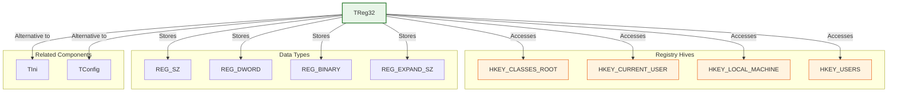
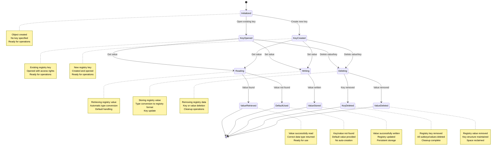

# TReg32 Class

The `TReg32` class provides a comprehensive interface for reading from and writing to the Windows Registry, which is a hierarchical database that stores configuration settings and options for the Windows operating system and installed applications. It supports various data types including strings, numbers, dates, logical values, and binary data.

**Source File:** [source/classes/reg32.prg](../../../../source/classes/reg32.prg)

## Overview

The `TReg32` class encapsulates the Windows API functions for working with the Registry, providing a high-level, object-oriented interface for registry management. It automatically handles data type conversion and provides convenient methods for managing registry keys and values.

The Windows Registry is used to store system-wide and user-specific configuration data, making it essential for applications that need to persist settings across sessions or integrate with Windows system functionality.

## Class Structure



## Registry Access Flow



## Key Properties

| Property | Type | Description |
|----------|------|-------------|
| `cRegKey` | `String` | Path to the registry key being managed |
| `nKey` | `Numeric` | Handle to the registry hive (HKEY_*) |
| `nHandle` | `Numeric` | Handle to the opened registry key |
| `nError` | `Numeric` | Last error code from registry operations |
| `lError` | `Logical` | Flag indicating if an error occurred |

## Key Methods

| Method | Description |
|--------|-------------|
| `New(nKey, cRegKey)` | Constructor for opening an existing registry key |
| `Create(nKey, cRegKey)` | Constructor for creating a new registry key |
| `Get(cSubKey, uVar)` | Reads a value from the registry key |
| `GetBinary(cSubKey)` | Reads binary data from the registry key |
| `Set(cSubKey, uVar, nType)` | Writes a value to the registry key |
| `Close()` | Closes the registry key handle |
| `Delete(cSubKey)` | Deletes a subkey from the registry |

## Registry Hives

| Hive | Description | Typical Use |
|------|-------------|-------------|
| `HKEY_CLASSES_ROOT` | File extension associations and COM class registration | Application file associations |
| `HKEY_CURRENT_USER` | Current user's settings and preferences | User-specific application settings |
| `HKEY_LOCAL_MACHINE` | System-wide settings and installed software | Application installation data |
| `HKEY_USERS` | All user profiles on the computer | Multi-user configuration |
| `HKEY_CURRENT_CONFIG` | Hardware profile for current configuration | Hardware settings |

## Registry Value Types

| Type | Constant | Description |
|------|----------|-------------|
| `REG_SZ` | 1 | Null-terminated string |
| `REG_EXPAND_SZ` | 2 | String with unexpanded references to environment variables |
| `REG_BINARY` | 3 | Binary data in any form |
| `REG_DWORD` | 4 | 32-bit number |

## Usage Patterns

### Basic Registry Operations

```harbour
#include "FiveWin.ch"

function Main()
   local oReg, cAppName, nVersion, lDebugMode, dInstallDate
   
   // Create registry manager for application settings
   // Using HKEY_CURRENT_USER for user-specific settings
   oReg := TReg32():New( HKEY_CURRENT_USER, "Software\\MyApplication" )
   
   // Read configuration values with defaults
   cAppName := oReg:Get( "ApplicationName", "My Application" )
   nVersion := oReg:Get( "Version", 1.0 )
   lDebugMode := oReg:Get( "DebugMode", .F. )
   dInstallDate := oReg:Get( "InstallDate", Date() )
   
   // Display current settings
   ShowCurrentSettings( cAppName, nVersion, lDebugMode, dInstallDate )
   
   // Update settings
   UpdateApplicationSettings( oReg )
   
   // Show updated settings
   cAppName := oReg:Get( "ApplicationName", "My Application" )
   nVersion := oReg:Get( "Version", 1.0 )
   lDebugMode := oReg:Get( "DebugMode", .F. )
   dInstallDate := oReg:Get( "InstallDate", Date() )
   
   ShowCurrentSettings( cAppName, nVersion, lDebugMode, dInstallDate )
   
   // Close registry handle
   oReg:Close()
   
return nil

static function ShowCurrentSettings( cAppName, nVersion, lDebugMode, dInstallDate )
   local cMessage := "Current Settings:" + hb_osNewLine()
   cMessage += "Application Name: " + cAppName + hb_osNewLine()
   cMessage += "Version: " + hb_ntos( nVersion ) + hb_osNewLine()
   cMessage += "Debug Mode: " + iif( lDebugMode, "Enabled", "Disabled" ) + hb_osNewLine()
   cMessage += "Install Date: " + DToC( dInstallDate )
   
   MsgInfo( cMessage )
   
return nil

static function UpdateApplicationSettings( oReg )
   local cNewName := Space(50)
   local nNewVersion := 0
   local lNewDebug := .F.
   
   DEFINE DIALOG oDlg TITLE "Update Settings" ;
      FROM 0, 0 TO 180, 300
   
   @ 10, 10 SAY "Application Name:" OF oDlg
   @ 10, 50 GET cNewName OF oDlg SIZE 100, 12 ;
      VALUE oReg:Get( "ApplicationName", "My Application" )
   
   @ 30, 10 SAY "Version:" OF oDlg
   @ 30, 50 GET nNewVersion OF oDlg SIZE 100, 12 ;
      VALUE oReg:Get( "Version", 1.0 ) ;
      PICTURE "99.99"
   
   @ 50, 10 CHECKBOX lNewDebug OF oDlg ;
      PROMPT "Enable Debug Mode" ;
      VALUE oReg:Get( "DebugMode", .F. )
   
   @ 80, 50 BUTTON "Save" OF oDlg ;
      ACTION ( SaveSettings( oReg, cNewName, nNewVersion, lNewDebug ), oDlg:End() )
   
   @ 80, 110 BUTTON "Cancel" OF oDlg ;
      ACTION oDlg:End()
   
   ACTIVATE DIALOG oDlg CENTERED
   
return nil

static function SaveSettings( oReg, cName, nVersion, lDebug )
   local cTrimmedName := AllTrim( cName )
   
   if Empty( cTrimmedName )
      MsgAlert( "Please enter an application name" )
      return .F.
   endif
   
   // Save settings to registry
   oReg:Set( "ApplicationName", cTrimmedName )
   oReg:Set( "Version", nVersion )
   oReg:Set( "DebugMode", lDebug )
   oReg:Set( "InstallDate", Date() )
   
   MsgInfo( "Settings saved successfully" )
   
return .T.
```

### Application Installation Registration

```harbour
#include "FiveWin.ch"

function Main()
   local oReg
   
   // Demonstrate application installation registration
   if MsgYesNo( "Register application in Windows Registry?" )
      RegisterApplication()
   endif
   
   if MsgYesNo( "Unregister application from Windows Registry?" )
      UnregisterApplication()
   endif
   
return nil

static function RegisterApplication()
   local oReg
   
   try
      // Register application in HKEY_LOCAL_MACHINE (requires admin rights)
      // This makes it available system-wide
      
      // Register file associations
      RegisterFileAssociation( ".myapp", "MyApp.Document" )
      
      // Register application capabilities
      RegisterApplicationCapabilities()
      
      // Register uninstall information
      RegisterUninstallInfo()
      
      MsgInfo( "Application registered successfully" )
      
   catch using oError
      MsgAlert( "Failed to register application: " + oError:Description )
   endtry
   
return nil

static function RegisterFileAssociation( cExtension, cProgId )
   local oReg
   
   // Register file extension
   oReg := TReg32():New( HKEY_CLASSES_ROOT, cExtension )
   if oReg:nError == ERROR_SUCCESS
      oReg:Set( "", cProgId )  // Default value
      oReg:Close()
   endif
   
   // Register ProgID
   oReg := TReg32():New( HKEY_CLASSES_ROOT, cProgId )
   if oReg:nError == ERROR_SUCCESS
      oReg:Set( "", "My Application Document" )
      oReg:Close()
   endif
   
   // Register shell commands
   local cShellPath := cProgId + "\\shell\\open\\command"
   oReg := TReg32():New( HKEY_CLASSES_ROOT, cShellPath )
   if oReg:nError == ERROR_SUCCESS
      oReg:Set( "", '"C:\Program Files\MyApp\MyApp.exe" "%1"' )
      oReg:Close()
   endif
   
return nil

static function RegisterApplicationCapabilities()
   local oReg
   local cAppPath := "Software\\MyApplication"
   
   // Register application details
   oReg := TReg32():New( HKEY_LOCAL_MACHINE, cAppPath )
   if oReg:nError == ERROR_SUCCESS
      oReg:Set( "ApplicationName", "My Application" )
      oReg:Set( "ApplicationDescription", "A sample FiveWin application" )
      oReg:Set( "ApplicationCompany", "My Company" )
      oReg:Set( "Version", "1.0.0" )
      oReg:Close()
   endif
   
   // Register capabilities
   local cCapabilitiesPath := cAppPath + "\\Capabilities"
   oReg := TReg32():New( HKEY_LOCAL_MACHINE, cCapabilitiesPath )
   if oReg:nError == ERROR_SUCCESS
      oReg:Set( "ApplicationName", "My Application" )
      oReg:Set( "ApplicationDescription", "A sample FiveWin application" )
      oReg:Close()
   endif
   
return nil

static function RegisterUninstallInfo()
   local oReg
   local cUninstallPath := "Software\\Microsoft\\Windows\\CurrentVersion\\Uninstall\\MyApplication"
   
   oReg := TReg32():New( HKEY_LOCAL_MACHINE, cUninstallPath )
   if oReg:nError == ERROR_SUCCESS
      oReg:Set( "DisplayName", "My Application" )
      oReg:Set( "DisplayVersion", "1.0.0" )
      oReg:Set( "Publisher", "My Company" )
      oReg:Set( "InstallDate", DToC( Date() ) )
      oReg:Set( "UninstallString", '"C:\Program Files\MyApp\uninstall.exe"' )
      oReg:Set( "InstallLocation", "C:\Program Files\MyApp" )
      oReg:Set( "DisplayIcon", "C:\Program Files\MyApp\MyApp.exe,0" )
      oReg:Close()
   endif
   
return nil

static function UnregisterApplication()
   local oReg
   
   try
      // Remove file associations
      oReg := TReg32():New( HKEY_CLASSES_ROOT, ".myapp" )
      if oReg:nError == ERROR_SUCCESS
         oReg:Delete( "" )  // Delete default value
         oReg:Close()
      endif
      
      // Remove ProgID
      oReg := TReg32():New( HKEY_CLASSES_ROOT, "MyApp.Document" )
      if oReg:nError == ERROR_SUCCESS
         oReg:Delete( "" )
         oReg:Close()
      endif
      
      // Remove shell commands
      oReg := TReg32():New( HKEY_CLASSES_ROOT, "MyApp.Document\\shell" )
      if oReg:nError == ERROR_SUCCESS
         oReg:Delete( "open" )
         oReg:Close()
      endif
      
      // Remove application capabilities
      oReg := TReg32():New( HKEY_LOCAL_MACHINE, "Software\\MyApplication" )
      if oReg:nError == ERROR_SUCCESS
         oReg:Delete( "" )
         oReg:Close()
      endif
      
      // Remove uninstall information
      oReg := TReg32():New( HKEY_LOCAL_MACHINE, ;
                           "Software\\Microsoft\\Windows\\CurrentVersion\\Uninstall\\MyApplication" )
      if oReg:nError == ERROR_SUCCESS
         oReg:Delete( "" )
         oReg:Close()
      endif
      
      MsgInfo( "Application unregistered successfully" )
      
   catch using oError
      MsgAlert( "Failed to unregister application: " + oError:Description )
   endtry
   
return nil
```

### User Preferences Management

```harbour
#include "FiveWin.ch"

function Main()
   local oReg, oUserPrefs
   
   // Create registry manager for user preferences
   oReg := TReg32():New( HKEY_CURRENT_USER, "Software\\MyApplication\\Preferences" )
   
   // Load user preferences
   oUserPrefs := LoadUserPreferences( oReg )
   
   // Show main application window with user preferences
   ShowMainWindow( oUserPrefs, oReg )
   
   // Close registry handle
   oReg:Close()
   
return nil

static function LoadUserPreferences( oReg )
   local oPrefs := TUserPrefs():New()
   
   // Window settings
   oPrefs:nWindowWidth := oReg:Get( "WindowWidth", 800 )
   oPrefs:nWindowHeight := oReg:Get( "WindowHeight", 600 )
   oPrefs:nWindowLeft := oReg:Get( "WindowLeft", 100 )
   oPrefs:nWindowTop := oReg:Get( "WindowTop", 100 )
   
   // Display settings
   oPrefs:cTheme := oReg:Get( "Theme", "Light" )
   oPrefs:nFontSize := oReg:Get( "FontSize", 12 )
   oPrefs:lShowToolbar := oReg:Get( "ShowToolbar", .T. )
   
   // Behavior settings
   oPrefs:lAutoSave := oReg:Get( "AutoSave", .T. )
   oPrefs:nAutoSaveInterval := oReg:Get( "AutoSaveInterval", 300 )  // 5 minutes
   oPrefs:lConfirmExit := oReg:Get( "ConfirmExit", .T. )
   
return oPrefs

static function ShowMainWindow( oUserPrefs, oReg )
   local oDlg
   
   DEFINE DIALOG oDlg TITLE "Application with Preferences" ;
      FROM oUserPrefs:nWindowTop, oUserPrefs:nWindowLeft ;
      TO oUserPrefs:nWindowTop + oUserPrefs:nWindowHeight, ;
         oUserPrefs:nWindowLeft + oUserPrefs:nWindowWidth

   // Apply theme
   ApplyTheme( oDlg, oUserPrefs:cTheme )
   
   // Add toolbar if enabled
   if oUserPrefs:lShowToolbar
      AddToolbar( oDlg )
   endif
   
   @ 50, 10 SAY "Application Content" OF oDlg SIZE 200, 100

   @ oUserPrefs:nWindowHeight - 60, 10 BUTTON "Preferences" OF oDlg ;
      ACTION ShowPreferencesDialog( oReg )

   @ oUserPrefs:nWindowHeight - 60, 80 BUTTON "Save Layout" OF oDlg ;
      ACTION SaveWindowLayout( oReg, oDlg )

   @ oUserPrefs:nWindowHeight - 60, 150 BUTTON "Close" OF oDlg ;
      ACTION CloseApplication( oDlg, oReg, oUserPrefs )

   ACTIVATE DIALOG oDlg

return nil

static function ApplyTheme( oDlg, cTheme )
   switch cTheme
   case "Light"
      oDlg:SetColor( CLR_BLACK, RGB( 240, 240, 240 ) )
      exit
   case "Dark"
      oDlg:SetColor( CLR_WHITE, RGB( 40, 40, 40 ) )
      exit
   case "Blue"
      oDlg:SetColor( CLR_WHITE, RGB( 0, 100, 200 ) )
      exit
   endswitch
   
return nil

static function ShowPreferencesDialog( oReg )
   local oPrefs := LoadUserPreferences( oReg )
   
   DEFINE DIALOG oDlg TITLE "Preferences" ;
      FROM 0, 0 TO 250, 350
   
   // Window settings group
   @ 10, 10 GROUP "Window Settings" OF oDlg SIZE 150, 80
   
   @ 25, 20 SAY "Width:" OF oDlg
   @ 25, 60 GET oPrefs:nWindowWidth OF oDlg SIZE 50, 12
   
   @ 45, 20 SAY "Height:" OF oDlg
   @ 45, 60 GET oPrefs:nWindowHeight OF oDlg SIZE 50, 12
   
   // Display settings group
   @ 100, 10 GROUP "Display Settings" OF oDlg SIZE 150, 100
   
   @ 115, 20 SAY "Theme:" OF oDlg
   @ 115, 60 COMBOBOX oTheme OF oDlg ;
      ITEMS { "Light", "Dark", "Blue" } ;
      VALUE oReg:Get( "Theme", "Light" )
   
   @ 135, 20 SAY "Font Size:" OF oDlg
   @ 135, 60 GET oPrefs:nFontSize OF oDlg SIZE 50, 12
   
   @ 155, 20 CHECKBOX oPrefs:lShowToolbar OF oDlg ;
      PROMPT "Show Toolbar"
   
   // Behavior settings group
   @ 210, 10 GROUP "Behavior Settings" OF oDlg SIZE 150, 80
   
   @ 225, 20 CHECKBOX oPrefs:lAutoSave OF oDlg ;
      PROMPT "Auto Save"
   
   @ 245, 20 CHECKBOX oPrefs:lConfirmExit OF oDlg ;
      PROMPT "Confirm Exit"
   
   @ 300, 60 BUTTON "Save" OF oDlg ;
      ACTION ( SavePreferences( oReg, oPrefs, oTheme ), oDlg:End() )
   
   @ 300, 120 BUTTON "Cancel" OF oDlg ;
      ACTION oDlg:End()
   
   ACTIVATE DIALOG oDlg CENTERED
   
return nil

static function SavePreferences( oReg, oPrefs, oTheme )
   // Save window settings
   oReg:Set( "WindowWidth", oPrefs:nWindowWidth )
   oReg:Set( "WindowHeight", oPrefs:nWindowHeight )
   oReg:Set( "WindowLeft", GetWndDefault():nLeft )
   oReg:Set( "WindowTop", GetWndDefault():nTop )
   
   // Save display settings
   oReg:Set( "Theme", oTheme:Get() )
   oReg:Set( "FontSize", oPrefs:nFontSize )
   oReg:Set( "ShowToolbar", oPrefs:lShowToolbar )
   
   // Save behavior settings
   oReg:Set( "AutoSave", oPrefs:lAutoSave )
   oReg:Set( "AutoSaveInterval", 300 )  // Fixed value for demo
   oReg:Set( "ConfirmExit", oPrefs:lConfirmExit )
   
   MsgInfo( "Preferences saved successfully" )
   
return nil

static function SaveWindowLayout( oReg, oDlg )
   oReg:Set( "WindowWidth", oDlg:nRight - oDlg:nLeft )
   oReg:Set( "WindowHeight", oDlg:nBottom - oDlg:nTop )
   oReg:Set( "WindowLeft", oDlg:nLeft )
   oReg:Set( "WindowTop", oDlg:nTop )
   
   MsgInfo( "Window layout saved" )
   
return nil

static function CloseApplication( oDlg, oReg, oUserPrefs )
   if oUserPrefs:lConfirmExit
      if !MsgYesNo( "Are you sure you want to exit?" )
         return .F.
      endif
   endif
   
   // Save current window layout
   SaveWindowLayout( oReg, oDlg )
   
   oDlg:End()
   
return nil

// Simple class to hold user preferences
CLASS TUserPrefs
   DATA nWindowWidth INIT 800
   DATA nWindowHeight INIT 600
   DATA nWindowLeft INIT 100
   DATA nWindowTop INIT 100
   DATA cTheme INIT "Light"
   DATA nFontSize INIT 12
   DATA lShowToolbar INIT .T.
   DATA lAutoSave INIT .T.
   DATA nAutoSaveInterval INIT 300
   DATA lConfirmExit INIT .T.
END CLASS
```

## Advanced Features

### Binary Data Storage

```harbour
#include "FiveWin.ch"

function Main()
   local oReg
   
   // Create registry manager
   oReg := TReg32():New( HKEY_CURRENT_USER, "Software\\MyApplication\\BinaryData" )
   
   // Demonstrate binary data operations
   DemonstrateBinaryOperations( oReg )
   
   // Close registry handle
   oReg:Close()
   
return nil

static function DemonstrateBinaryOperations( oReg )
   // Store binary data (e.g., encrypted settings)
   local cEncryptedData := EncryptData( "Secret Settings Data" )
   oReg:Set( "EncryptedSettings", cEncryptedData, REG_BINARY )
   
   // Store structured binary data
   local cUserData := CreateUserDataStructure()
   oReg:Set( "UserData", cUserData, REG_BINARY )
   
   // Retrieve binary data
   local cRetrievedData := oReg:GetBinary( "EncryptedSettings" )
   local cDecryptedData := DecryptData( cRetrievedData )
   
   local cRetrievedUserData := oReg:GetBinary( "UserData" )
   local aUserData := ParseUserDataStructure( cRetrievedUserData )
   
   // Show results
   local cMessage := "Binary Data Operations:" + hb_osNewLine()
   cMessage += "Original: Secret Settings Data" + hb_osNewLine()
   cMessage += "Encrypted: " + hb_Base64Encode( cEncryptedData ) + hb_osNewLine()
   cMessage += "Decrypted: " + cDecryptedData + hb_osNewLine()
   cMessage += "User Data: " + hb_ValToStr( aUserData )
   
   MsgInfo( cMessage )
   
return nil

static function EncryptData( cData )
   // Simple encryption for demonstration (not for real use)
   local cEncrypted := ""
   for local i := 1 to Len( cData )
      cEncrypted += Chr( Asc( SubStr( cData, i, 1 ) ) + 1 )
   next
   return cEncrypted
   
return ""

static function DecryptData( cData )
   // Simple decryption for demonstration (not for real use)
   local cDecrypted := ""
   for local i := 1 to Len( cData )
      cDecrypted += Chr( Asc( SubStr( cData, i, 1 ) ) - 1 )
   next
   return cDecrypted
   
return ""

static function CreateUserDataStructure()
   // Create a simple binary structure for user data
   // In practice, you might use a more complex structure
   local aUserData := { "John Doe", 30, Date(), .T. }
   local cBinaryData := ""
   
   // Convert to binary format
   for local i := 1 to Len( aUserData )
      local uItem := aUserData[i]
      local cType := ValType( uItem )
      cBinaryData += cType  // Store type
      switch cType
      case "C"
         cBinaryData += hb_BinToNum( Len( uItem ), 4 ) + uItem
         exit
      case "N"
         cBinaryData += hb_BinToNum( uItem, 8 )
         exit
      case "D"
         cBinaryData += DToCDX( uItem )
         exit
      case "L"
         cBinaryData += iif( uItem, Chr(1), Chr(0) )
         exit
      endswitch
   next
   
   return cBinaryData
   
return ""

static function ParseUserDataStructure( cBinaryData )
   local aUserData := {}
   local nPos := 1
   
   while nPos <= Len( cBinaryData )
      local cType := SubStr( cBinaryData, nPos, 1 )
      nPos++
      
      switch cType
      case "C"
         local nLen := hb_NumToBin( SubStr( cBinaryData, nPos, 4 ), 4 )
         nPos += 4
         local cString := SubStr( cBinaryData, nPos, nLen )
         nPos += nLen
         AAdd( aUserData, cString )
         exit
      case "N"
         local nNumber := hb_NumToBin( SubStr( cBinaryData, nPos, 8 ), 8 )
         nPos += 8
         AAdd( aUserData, nNumber )
         exit
      case "D"
         local dDate := DXToD( SubStr( cBinaryData, nPos, 8 ) )
         nPos += 8
         AAdd( aUserData, dDate )
         exit
      case "L"
         local lLogical := ( Asc( SubStr( cBinaryData, nPos, 1 ) ) == 1 )
         nPos++
         AAdd( aUserData, lLogical )
         exit
      endswitch
   enddo
   
   return aUserData
   
return {}
```

### Registry Security and Permissions

```harbour
#include "FiveWin.ch"

function Main()
   local oReg
   
   // Demonstrate registry security considerations
   DemonstrateSecurityFeatures()
   
return nil

static function DemonstrateSecurityFeatures()
   // Check if we have sufficient privileges
   if !HasAdminPrivileges()
      MsgInfo( "This application requires administrator privileges for some registry operations" )
   endif
   
   // Demonstrate safe registry operations
   SafeRegistryOperations()
   
   // Demonstrate error handling
   HandleRegistryErrors()
   
return nil

static function HasAdminPrivileges()
   // Check if running with administrator privileges
   // This is a simplified check
   local oReg := TReg32():New( HKEY_LOCAL_MACHINE, "SOFTWARE" )
   local lHasAccess := ( oReg:nError == ERROR_SUCCESS )
   oReg:Close()
   
   return lHasAccess
   
return .F.

static function SafeRegistryOperations()
   local oReg
   local cUserPath := "Software\\MyApplication"
   
   try
      // Use HKEY_CURRENT_USER for user-specific settings (safer)
      oReg := TReg32():New( HKEY_CURRENT_USER, cUserPath )
      if oReg:nError == ERROR_SUCCESS
         oReg:Set( "LastRun", DToC( Date() ) )
         oReg:Set( "RunCount", oReg:Get( "RunCount", 0 ) + 1 )
         oReg:Close()
         ? "User settings updated successfully"
      else
         ? "Failed to access user registry: " + hb_ntos( oReg:nError )
      endif
      
   catch using oError
      ? "Error in safe registry operations: " + oError:Description
   endtry
   
   // Try system-wide settings (may require admin rights)
   try
      oReg := TReg32():New( HKEY_LOCAL_MACHINE, "SOFTWARE\\MyApplication" )
      if oReg:nError == ERROR_SUCCESS
         oReg:Set( "InstallPath", GetExePath() )
         oReg:Close()
         ? "System settings updated successfully"
      else
         ? "No permission to write to system registry (normal for non-admin users)"
      endif
      
   catch using oError
      ? "Error in system registry operations: " + oError:Description
   endtry
   
return nil

static function HandleRegistryErrors()
   local oReg
   local cInvalidPath := "Invalid\\Registry\\Path\\That\\Does\\Not\\Exist"
   
   // Demonstrate error handling
   oReg := TReg32():New( HKEY_CURRENT_USER, cInvalidPath )
   
   if oReg:nError != ERROR_SUCCESS
      ? "Registry error occurred: " + hb_ntos( oReg:nError )
      ? "This is normal when trying to access non-existent keys"
      
      // Try to create the key instead
      oReg := TReg32():Create( HKEY_CURRENT_USER, cInvalidPath )
      if oReg:nError == ERROR_SUCCESS
         ? "Key created successfully"
         oReg:Set( "TestValue", "Test Data" )
         oReg:Close()
      else
         ? "Failed to create key: " + hb_ntos( oReg:nError )
      endif
   else
      oReg:Close()
   endif
   
return nil

static function GetExePath()
   // Get current executable path
   return hb_FNamePath( hb_ArgV( 0 ) )
   
return ""
```

## Related Components

* [TIni Class](TIni.md) - INI file configuration management
* [TConfig Class](TConfig.md) - Alternative configuration management
* [TApplication Class](TApplication.md) - Application-level management
* [Windows API Registry Functions](https://docs.microsoft.com/en-us/windows/win32/sysinfo/registry-functions)

## Windows API References

* [RegOpenKeyEx](https://docs.microsoft.com/en-us/windows/win32/api/winreg/nf-winreg-regopenkeyexa)
* [RegCreateKey](https://docs.microsoft.com/en-us/windows/win32/api/winreg/nf-winreg-regcreatekeya)
* [RegQueryValueEx](https://docs.microsoft.com/en-us/windows/win32/api/winreg/nf-winreg-regqueryvalueexa)
* [RegSetValueEx](https://docs.microsoft.com/en-us/windows/win32/api/winreg/nf-winreg-regsetvalueexa)
* [RegDeleteKey](https://docs.microsoft.com/en-us/windows/win32/api/winreg/nf-winreg-regdeletekeya)
* [RegCloseKey](https://docs.microsoft.com/en-us/windows/win32/api/winreg/nf-winreg-regclosekey)

## Best Practices

1. **Privilege Management**: Use HKEY_CURRENT_USER for user settings, HKEY_LOCAL_MACHINE for system settings
2. **Error Handling**: Always check error codes after registry operations
3. **Resource Management**: Close registry handles when finished
4. **Path Organization**: Use organized registry paths (e.g., "Software\\CompanyName\\ApplicationName")
5. **Data Validation**: Validate data before storing in registry
6. **Backup**: Consider backing up registry keys before major changes
7. **Documentation**: Document all registry keys and values used by your application
8. **Security**: Be cautious with sensitive data in registry (consider encryption)

## Performance Considerations

* Registry operations are generally fast but should be minimized
* Frequent registry access can impact application performance
* Consider caching frequently accessed values in memory
* Use appropriate registry hives for optimal performance
* Batch multiple registry operations when possible
* Avoid storing large amounts of data in registry values
* Use binary data format for complex structured data
* Monitor registry size to prevent bloat
```