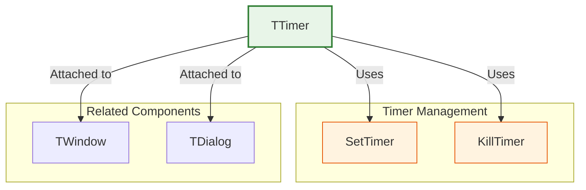
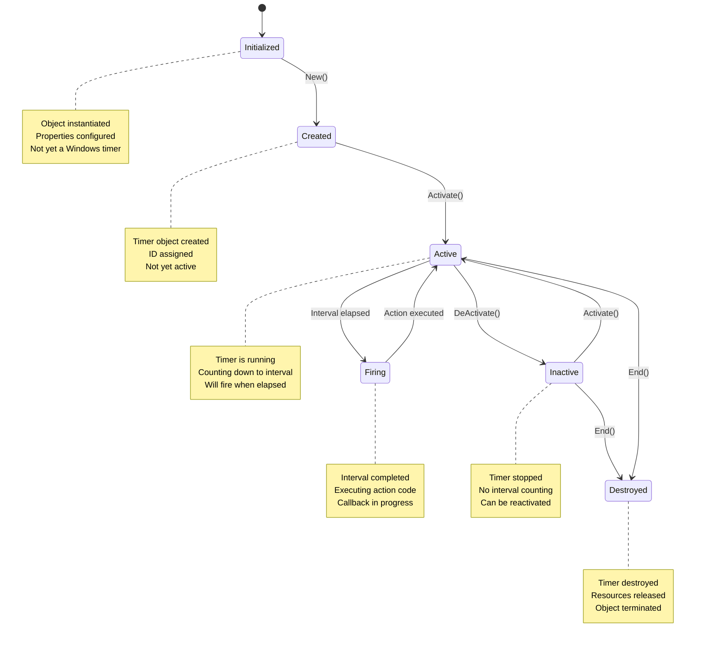
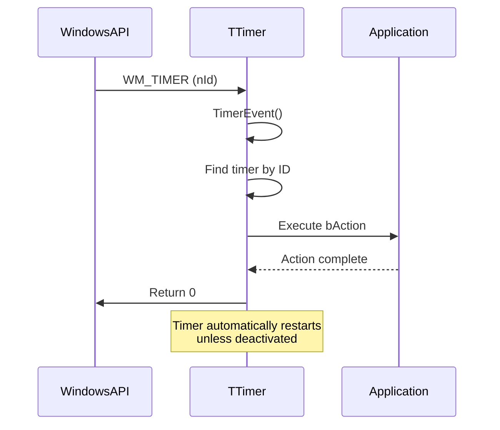

# TTimer Class

The `TTimer` class provides a comprehensive interface for creating and managing timer events in FiveWin applications. It allows you to execute code at regular intervals, enabling features like periodic updates, animations, timeouts, and background processing.

**Source File:** [source/classes/timer.prg](../../../source/classes/timer.prg)

## Overview

The `TTimer` class encapsulates the Windows timer functionality, providing a high-level, object-oriented interface for timer management. It automatically handles timer creation, activation, deactivation, and cleanup, while allowing you to specify custom actions to be executed at regular intervals.

Timers are essential for creating responsive applications that need to perform periodic tasks without blocking the user interface, such as updating displays, checking for data changes, implementing animations, or managing timeouts.

## Class Structure



## Timer Lifecycle



## Key Properties

| Property | Type | Description |
|----------|------|-------------|
| `bAction` | `Codeblock` | Codeblock to execute when timer fires |
| `lActive` | `Logical` | If `.T.`, timer is currently active |
| `nId` | `Numeric` | Unique identifier for the timer |
| `nInterval` | `Numeric` | Interval in milliseconds between timer events |
| `hWndOwner` | `Handle` | Handle to the window that owns the timer |
| `Cargo` | `Any` | User-defined data storage |

## Key Methods

| Method | Description |
|--------|-------------|
| `New(nInterval, bAction, oWnd)` | Constructor for creating a new timer |
| `Activate()` | Starts the timer |
| `DeActivate()` | Stops the timer |
| `End()` | Destroys the timer and releases resources |

## Timer Event Flow



## Usage Patterns

### Basic Timer Operations

```harbour
#include "FiveWin.ch"

function Main()
   local oDlg, oTimer, nCounter := 0
   
   DEFINE DIALOG oDlg TITLE "Timer Demo" ;
      FROM 0, 0 TO 200, 300

   @ 10, 10 SAY "Timer Counter:" ID ID_COUNTER OF oDlg SIZE 100, 20

   @ 40, 10 BUTTON "Start Timer" OF oDlg ;
      ACTION StartDemoTimer( oDlg, @oTimer, @nCounter )

   @ 40, 80 BUTTON "Stop Timer" OF oDlg ;
      ACTION StopDemoTimer( oTimer )

   @ 40, 150 BUTTON "Reset Counter" OF oDlg ;
      ACTION ResetCounter( oDlg, @nCounter )

   @ 70, 10 BUTTON "One-Shot Timer" OF oDlg ;
      ACTION StartOneShotTimer( oDlg )

   @ 70, 80 BUTTON "Delayed Action" OF oDlg ;
      ACTION StartDelayedAction( oDlg )

   @ 100, 10 BUTTON "Close" OF oDlg ;
      ACTION ( StopDemoTimer( oTimer ), oDlg:End() )

   ACTIVATE DIALOG oDlg

return nil

static function StartDemoTimer( oDlg, oTimer, nCounter )
   // Create and start a timer that fires every 1000ms (1 second)
   oTimer := TTimer():New( 1000, { || UpdateCounter( oDlg, nCounter ) } )
   oTimer:Activate()
   
   MsgInfo( "Timer started - updating counter every second" )
   
return nil

static function UpdateCounter( oDlg, nCounter )
   nCounter++
   local oCounter := oDlg:FindControl( ID_COUNTER )
   if oCounter != nil
      oCounter:cText := "Count: " + hb_ntos( nCounter )
      oCounter:Refresh()
   endif
   
return nil

static function StopDemoTimer( oTimer )
   if oTimer != nil
      oTimer:DeActivate()
      MsgInfo( "Timer stopped" )
   endif
   
return nil

static function ResetCounter( oDlg, nCounter )
   nCounter := 0
   local oCounter := oDlg:FindControl( ID_COUNTER )
   if oCounter != nil
      oCounter:cText := "Count: 0"
      oCounter:Refresh()
   endif
   
return nil

static function StartOneShotTimer( oDlg )
   // Create a one-shot timer that fires once after 3 seconds
   local oTimer := TTimer():New( 3000, { || OneShotAction( oDlg ) } )
   oTimer:Activate()
   
   MsgInfo( "One-shot timer started - will fire in 3 seconds" )
   
return nil

static function OneShotTimer( oDlg, oTimer )
   // Stop the timer after it fires (one-shot behavior)
   oTimer:DeActivate()
   oTimer:End()
   
   MsgInfo( "One-shot timer fired and destroyed" )
   
return nil

static function StartDelayedAction( oDlg )
   // Create a timer for delayed execution
   local oTimer := TTimer():New( 2000, { || DelayedAction( oDlg ) } )
   oTimer:Activate()
   
   MsgInfo( "Delayed action scheduled - will execute in 2 seconds" )
   
return nil

static function DelayedAction( oDlg )
   MsgInfo( "Delayed action executed!" )
   
return nil

static function OneShotAction( oDlg )
   MsgInfo( "One-shot timer fired!" )
   
return nil
```

### Progress Bar Animation

```harbour
#include "FiveWin.ch"

function Main()
   local oDlg, oProgressBar, oTimer
   
   DEFINE DIALOG oDlg TITLE "Progress Animation" ;
      FROM 0, 0 TO 150, 300

   @ 10, 10 PROGRESSBAR oProgressBar OF oDlg ;
      SIZE 200, 20 ;
      RANGE 0, 100 ;
      VALUE 0

   @ 40, 10 BUTTON "Start Progress" OF oDlg ;
      ACTION StartProgressAnimation( oDlg, oProgressBar, @oTimer )

   @ 40, 80 BUTTON "Stop Progress" OF oDlg ;
      ACTION StopProgressAnimation( oTimer )

   @ 40, 150 BUTTON "Reset Progress" OF oDlg ;
      ACTION ResetProgressBar( oProgressBar )

   @ 70, 10 BUTTON "Close" OF oDlg ;
      ACTION ( StopProgressAnimation( oTimer ), oDlg:End() )

   ACTIVATE DIALOG oDlg

return nil

static function StartProgressAnimation( oDlg, oProgressBar, oTimer )
   // Create timer that updates progress every 100ms
   oTimer := TTimer():New( 100, { || UpdateProgress( oProgressBar ) } )
   oTimer:Activate()
   
   MsgInfo( "Progress animation started" )
   
return nil

static function UpdateProgress( oProgressBar )
   local nCurrent := oProgressBar:nValue
   local nMax := oProgressBar:nMax
   
   if nCurrent < nMax
      oProgressBar:Set( nCurrent + 1 )
   else
      // Reset to beginning
      oProgressBar:Set( 0 )
   endif
   
return nil

static function StopProgressAnimation( oTimer )
   if oTimer != nil
      oTimer:DeActivate()
      MsgInfo( "Progress animation stopped" )
   endif
   
return nil

static function ResetProgressBar( oProgressBar )
   oProgressBar:Set( 0 )
   MsgInfo( "Progress bar reset" )
   
return nil
```

### Auto-Save Feature

```harbour
#include "FiveWin.ch"

function Main()
   local oDlg, oTimer, cDocument := Space(200)
   
   DEFINE DIALOG oDlg TITLE "Auto-Save Demo" ;
      FROM 0, 0 TO 250, 400

   @ 10, 10 SAY "Document Content:" OF oDlg

   @ 30, 10 EDIT oEdit OF oDlg VAR cDocument ;
      SIZE 250, 100 ;
      MULTILINE

   @ 140, 10 SAY "Auto-save status:" ID ID_STATUS OF oDlg SIZE 200, 20

   @ 170, 10 BUTTON "Enable Auto-Save" OF oDlg ;
      ACTION EnableAutoSave( oDlg, cDocument, @oTimer )

   @ 170, 80 BUTTON "Disable Auto-Save" OF oDlg ;
      ACTION DisableAutoSave( oTimer )

   @ 170, 150 BUTTON "Manual Save" OF oDlg ;
      ACTION ManualSave( cDocument )

   @ 200, 10 BUTTON "Close" OF oDlg ;
      ACTION ( DisableAutoSave( oTimer ), oDlg:End() )

   ACTIVATE DIALOG oDlg

return nil

static function EnableAutoSave( oDlg, cDocument, oTimer )
   // Create timer that auto-saves every 30 seconds
   oTimer := TTimer():New( 30000, { || AutoSaveDocument( oDlg, cDocument ) } )
   oTimer:Activate()
   
   UpdateStatus( oDlg, "Auto-save enabled (30s intervals)" )
   MsgInfo( "Auto-save enabled - document will be saved every 30 seconds" )
   
return nil

static function DisableAutoSave( oTimer )
   if oTimer != nil
      oTimer:DeActivate()
      MsgInfo( "Auto-save disabled" )
   endif
   
return nil

static function ManualSave( cDocument )
   // Perform manual save
   SaveDocument( cDocument )
   MsgInfo( "Document saved manually" )
   
return nil

static function AutoSaveDocument( oDlg, cDocument )
   // Auto-save the document
   if SaveDocument( cDocument )
      UpdateStatus( oDlg, "Document auto-saved at " + Time() )
   else
      UpdateStatus( oDlg, "Auto-save failed at " + Time() )
   endif
   
return nil

static function SaveDocument( cDocument )
   local cFileName := "autosave.txt"
   local oFile := FCreate( cFileName )
   
   if oFile == -1
      return .F.
   endif
   
   FWrite( oFile, AllTrim( cDocument ) )
   FClose( oFile )
   
   ? "Document auto-saved to " + cFileName
   return .T.
   
return .F.

static function UpdateStatus( oDlg, cMessage )
   local oStatus := oDlg:FindControl( ID_STATUS )
   if oStatus != nil
      oStatus:cText := cMessage
      oStatus:Refresh()
   endif
   
return nil
```

## Advanced Features

### Timer-Based Animation System

```harbour
#include "FiveWin.ch"

function Main()
   local oDlg, oAnimationTimer, oBall, nDirection := 1
   
   DEFINE DIALOG oDlg TITLE "Animation Demo" ;
      FROM 0, 0 TO 300, 400

   // Create a simple "ball" for animation
   @ 50, 10 SAY "O" ID ID_BALL OF oDlg SIZE 20, 20

   @ 250, 10 BUTTON "Start Animation" OF oDlg ;
      ACTION StartAnimation( oDlg, @oAnimationTimer, @oBall, @nDirection )

   @ 250, 80 BUTTON "Stop Animation" OF oDlg ;
      ACTION StopAnimation( oAnimationTimer )

   @ 250, 150 BUTTON "Change Speed" OF oDlg ;
      ACTION ChangeAnimationSpeed( oAnimationTimer )

   @ 250, 220 BUTTON "Close" OF oDlg ;
      ACTION ( StopAnimation( oAnimationTimer ), oDlg:End() )

   ACTIVATE DIALOG oDlg

return nil

static function StartAnimation( oDlg, oAnimationTimer, oBall, nDirection )
   // Create animation timer (60 FPS = ~16.67ms)
   oAnimationTimer := TTimer():New( 17, { || AnimateBall( oDlg, oBall, nDirection ) } )
   oAnimationTimer:Activate()
   
   MsgInfo( "Animation started at 60 FPS" )
   
return nil

static function StopAnimation( oAnimationTimer )
   if oAnimationTimer != nil
      oAnimationTimer:DeActivate()
      MsgInfo( "Animation stopped" )
   endif
   
return nil

static function ChangeAnimationSpeed( oAnimationTimer )
   static nSpeed := 17  // 60 FPS
   
   if oAnimationTimer != nil
      // Cycle through different speeds
      switch nSpeed
      case 17   // 60 FPS
         nSpeed := 33  // 30 FPS
         break
      case 33   // 30 FPS
         nSpeed := 100 // 10 FPS
         break
      case 100  // 10 FPS
         nSpeed := 17  // Back to 60 FPS
         break
      endswitch
      
      // Update timer interval
      oAnimationTimer:DeActivate()
      oAnimationTimer:nInterval := nSpeed
      oAnimationTimer:Activate()
      
      MsgInfo( "Animation speed changed to " + hb_ntos( 1000 / nSpeed ) + " FPS" )
   endif
   
return nil

static function AnimateBall( oDlg, oBall, nDirection )
   static nPosition := 10
   
   // Move the ball
   nPosition += nDirection * 2
   
   // Check boundaries and reverse direction
   if nPosition >= 300
      nDirection := -1
   elseif nPosition <= 10
      nDirection := 1
   endif
   
   // Update ball position
   oBall:nLeft := nPosition
   oBall:Refresh()
   
return nil
```

### Timer Pool Management

```harbour
#include "FiveWin.ch"

function Main()
   local oDlg, oTimerManager
   
   // Create timer manager
   oTimerManager := TTimerManager():New()
   
   DEFINE DIALOG oDlg TITLE "Timer Manager Demo" ;
      FROM 0, 0 TO 300, 400

   @ 10, 10 LISTBOX oTimerList OF oDlg ;
      SIZE 200, 100

   @ 120, 10 BUTTON "Add Timer" OF oDlg ;
      ACTION AddNewTimer( oTimerManager, oTimerList )

   @ 120, 70 BUTTON "Remove Timer" OF oDlg ;
      ACTION RemoveSelectedTimer( oTimerManager, oTimerList )

   @ 120, 130 BUTTON "Start All" OF oDlg ;
      ACTION StartAllTimers( oTimerManager )

   @ 120, 190 BUTTON "Stop All" OF oDlg ;
      ACTION StopAllTimers( oTimerManager )

   @ 150, 10 BUTTON "Show Status" OF oDlg ;
      ACTION ShowTimerStatus( oTimerManager )

   @ 150, 70 BUTTON "Clear All" OF oDlg ;
      ACTION ClearAllTimers( oTimerManager, oTimerList )

   @ 200, 10 BUTTON "Close" OF oDlg ;
      ACTION ( StopAllTimers( oTimerManager ), oDlg:End() )

   ACTIVATE DIALOG oDlg

return nil

static function AddNewTimer( oTimerManager, oTimerList )
   local nInterval := 1000  // 1 second default
   local cName := "Timer_" + hb_ntos( Seconds() )
   
   // Create new timer with unique action
   local oTimer := oTimerManager:AddTimer( nInterval, ;
                                          { || TimerAction( cName ) }, ;
                                          cName )
   
   if oTimer != nil
      UpdateTimerList( oTimerManager, oTimerList )
      MsgInfo( "Timer '" + cName + "' added" )
   endif
   
return nil

static function RemoveSelectedTimer( oTimerManager, oTimerList )
   local nSelected := oTimerList:nValue
   
   if nSelected > 0
      local cTimerName := oTimerList:GetItem( nSelected )
      // Extract name from "Name (Interval ms)"
      local nSpace := At( " ", cTimerName )
      if nSpace > 0
         cTimerName := Left( cTimerName, nSpace - 1 )
      endif
      
      if oTimerManager:RemoveTimer( cTimerName )
         UpdateTimerList( oTimerManager, oTimerList )
         MsgInfo( "Timer '" + cTimerName + "' removed" )
      endif
   endif
   
return nil

static function StartAllTimers( oTimerManager )
   local nStarted := oTimerManager:StartAllTimers()
   MsgInfo( hb_ntos( nStarted ) + " timers started" )
   
return nil

static function StopAllTimers( oTimerManager )
   local nStopped := oTimerManager:StopAllTimers()
   MsgInfo( hb_ntos( nStopped ) + " timers stopped" )
   
return nil

static function ShowTimerStatus( oTimerManager )
   local aStatus := oTimerManager:GetStatus()
   local cMessage := "Timer Status:" + hb_osNewLine()
   
   for local i := 1 to Len( aStatus )
      cMessage += aStatus[i] + hb_osNewLine()
   next
   
   MsgInfo( cMessage )
   
return nil

static function ClearAllTimers( oTimerManager, oTimerList )
   if MsgYesNo( "Remove all timers?" )
      oTimerManager:ClearAllTimers()
      UpdateTimerList( oTimerManager, oTimerList )
      MsgInfo( "All timers cleared" )
   endif
   
return nil

static function UpdateTimerList( oTimerManager, oTimerList )
   local aTimers := oTimerManager:GetTimerList()
   local aDisplay := {}
   
   for local i := 1 to Len( aTimers )
      local oTimer := aTimers[i]
      local cName := oTimer:Cargo  // Store name in Cargo
      local cEntry := cName + " (" + hb_ntos( oTimer:nInterval ) + " ms)"
      AAdd( aDisplay, cEntry )
   next
   
   oTimerList:SetItems( aDisplay )
   
return nil

static function TimerAction( cName )
   ? "Timer '" + cName + "' fired at " + Time()
   
return nil

// Timer manager class for handling multiple timers
CLASS TTimerManager
   DATA aTimers INIT {}
   
   METHOD AddTimer( nInterval, bAction, cName )
   METHOD RemoveTimer( cName )
   METHOD StartAllTimers()
   METHOD StopAllTimers()
   METHOD ClearAllTimers()
   METHOD GetTimerList()
   METHOD GetStatus()
END CLASS

METHOD AddTimer( nInterval, bAction, cName ) CLASS TTimerManager
   local oTimer := TTimer():New( nInterval, bAction )
   oTimer:Cargo := cName  // Store name for identification
   AAdd( ::aTimers, oTimer )
   
return oTimer

METHOD RemoveTimer( cName ) CLASS TTimerManager
   for local i := Len( ::aTimers ) to 1 step -1
      local oTimer := ::aTimers[i]
      if oTimer:Cargo == cName
         oTimer:End()
         ADel( ::aTimers, i )
         ASize( ::aTimers, Len( ::aTimers ) - 1 )
         return .T.
      endif
   next
   
return .F.

METHOD StartAllTimers() CLASS TTimerManager
   local nCount := 0
   
   for local i := 1 to Len( ::aTimers )
      local oTimer := ::aTimers[i]
      if !oTimer:lActive
         oTimer:Activate()
         nCount++
      endif
   next
   
return nCount

METHOD StopAllTimers() CLASS TTimerManager
   local nCount := 0
   
   for local i := 1 to Len( ::aTimers )
      local oTimer := ::aTimers[i]
      if oTimer:lActive
         oTimer:DeActivate()
         nCount++
      endif
   next
   
return nCount

METHOD ClearAllTimers() CLASS TTimerManager
   for local i := Len( ::aTimers ) to 1 step -1
      local oTimer := ::aTimers[i]
      oTimer:End()
   next
   
   ::aTimers := {}
   
return nil

METHOD GetTimerList() CLASS TTimerManager
   return ::aTimers
   
return {}

METHOD GetStatus() CLASS TTimerManager
   local aStatus := {}
   
   for local i := 1 to Len( ::aTimers )
      local oTimer := ::aTimers[i]
      local cStatus := oTimer:Cargo + ": " + ;
                      iif( oTimer:lActive, "Active", "Inactive" ) + ;
                      " (" + hb_ntos( oTimer:nInterval ) + "ms)"
      AAdd( aStatus, cStatus )
   next
   
return aStatus
   
return {}
```

## Related Components

* [TWindow Class](TWindow.md) - Base window class that timers can be attached to
* [TDialog Class](TDialog.md) - Dialog windows that can host timers
* [Windows API Timer Functions](https://docs.microsoft.com/en-us/windows/win32/winmsg/timers)
* [TApplication Class](TApplication.md) - Application-level timer management

## Windows API References

* [SetTimer](https://docs.microsoft.com/en-us/windows/win32/winmsg/settimer)
* [KillTimer](https://docs.microsoft.com/en-us/windows/win32/winmsg/killtimer)
* [WM_TIMER](https://docs.microsoft.com/en-us/windows/win32/winmsg/wm-timer)
* [TimerProc](https://docs.microsoft.com/en-us/windows/win32/winmsg/timerproc)

## Best Practices

1. **Interval Selection**: Choose appropriate intervals for your needs (avoid too frequent timers)
2. **Resource Management**: Always deactivate and end timers when no longer needed
3. **Error Handling**: Implement proper error handling for timer actions
4. **Performance**: Keep timer actions lightweight to avoid blocking the UI
5. **Uniqueness**: Use unique timer IDs to avoid conflicts
6. **Owner Windows**: Attach timers to appropriate owner windows
7. **Memory Management**: Store user data in Cargo property for timer-specific data
8. **Cleanup**: Implement proper cleanup in application shutdown

## Performance Considerations

* Very short intervals (< 10ms) can impact system performance
* Too many active timers can consume system resources
* Heavy processing in timer actions can block the UI thread
* Consider using longer intervals and checking elapsed time for precision timing
* Use timer pooling for applications with many periodic tasks
* Deactivate timers when windows are minimized or inactive
* Monitor timer performance and adjust intervals as needed
* Consider using high-resolution timers for precise timing requirements