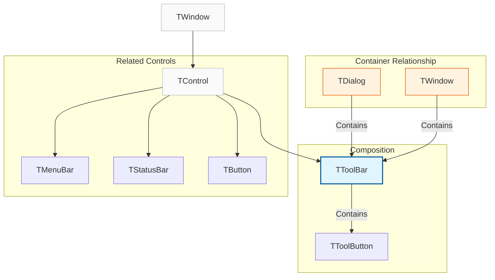
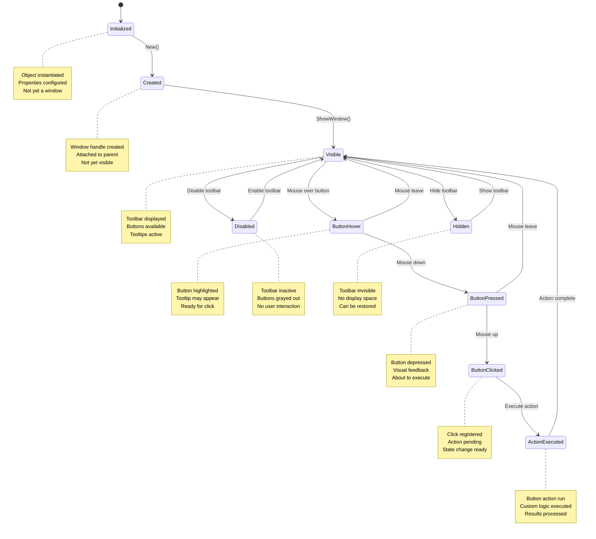
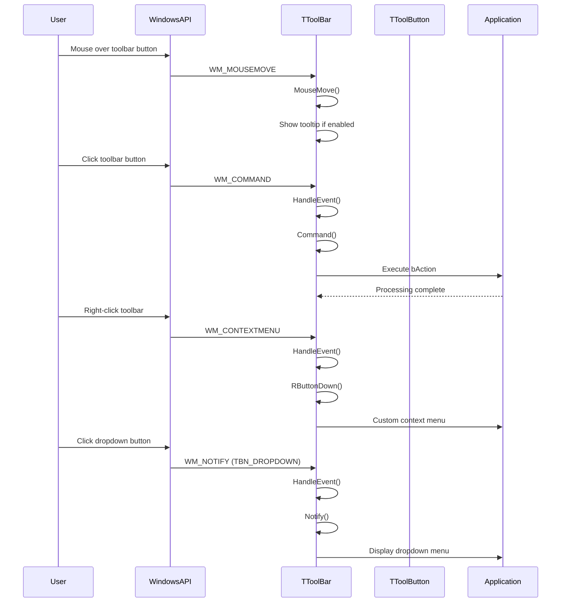

# TToolBar Class

The `TToolBar` class provides a comprehensive implementation of a toolbar control that displays a row of buttons, typically used for quick access to frequently used commands and functions. It supports advanced features including tooltips, custom images, button states, and dropdown menus.

**Source File:** [source/classes/toolbar.prg](../../../../source/classes/toolbar.prg)

## Overview

The `TToolBar` class encapsulates the Windows Toolbar control, providing a high-level interface for creating and managing toolbar interfaces. As a subclass of `TControl`, it inherits all standard control functionality while adding specialized behavior for button management, image handling, and user interaction.

Toolbars are essential UI components that provide quick access to common commands and functions, typically positioned at the top of application windows. They enhance user productivity by making frequently used features easily accessible.

## Class Hierarchy



## Toolbar States



## Key Properties

| Property | Type | Description |
|----------|------|-------------|
| `nBtnWidth` | `Numeric` | Width of toolbar buttons |
| `nBtnHeight` | `Numeric` | Height of toolbar buttons |
| `aButtons` | `Array` | Array of toolbar button definitions |
| `oImageList` | `TImageList` | Image list for button icons |
| `lTTBalloon` | `Logical` | If `.T.`, uses balloon-style tooltips |
| `l2007` | `Logical` | If `.T.`, uses Office 2007 style |
| `l2010` | `Logical` | If `.T.`, uses Office 2010 style |
| `l2013` | `Logical` | If `.T.`, uses Office 2013 style |
| `l2015` | `Logical` | If `.T.`, uses Office 2015 style |
| `bClrGrad` | `Codeblock` | Custom gradient color function |

## Key Methods

| Method | Description |
|--------|-------------|
| `New()` | Constructor for creating a new toolbar |
| `AddButton(bAction, cToolTip, cText, bWhen, cMsg)` | Adds a new button to the toolbar |
| `AddMenu(bAction, cToolTip, cText, bWhen, cMsg, bMenu)` | Adds a dropdown menu button |
| `AddSeparator()` | Adds a separator between button groups |
| `DelButton(nButton)` | Removes button at specified index |
| `EnableButton(nButton, lOnOff)` | Enables or disables specified button |
| `HideButton(nButton)` | Hides specified button |
| `ShowButton(nButton)` | Shows specified button |
| `ChangeBitmap(nButton, nImage)` | Changes button's image |
| `SetMessage(nButton, cMsg)` | Sets button's status message |
| `AEvalWhen()` | Evaluates button when conditions |
| `SetImageList(oImageList)` | Sets image list for buttons |

## Event Processing Flow



## Usage Patterns

### Basic Toolbar

```harbour
#include "FiveWin.ch"

function Main()
   local oDlg, oToolBar, oImageList
   
   DEFINE DIALOG oDlg TITLE "Toolbar Demo" ;
      FROM 0, 0 TO 250, 400

   // Create image list for toolbar buttons
   oImageList := TImageList():New( 16, 16 )
   // Add images: new, open, save, cut, copy, paste, etc.
   // oImageList:Add( LoadBitmap( "new.bmp" ) )
   // oImageList:Add( LoadBitmap( "open.bmp" ) )
   // oImageList:Add( LoadBitmap( "save.bmp" ) )

   @ 10, 10 TOOLBAR oToolBar OF oDlg ;
      SIZE 300, 30

   // Set image list
   oToolBar:SetImageList( oImageList )

   // Add buttons
   oToolBar:AddButton( { || NewDocument() }, "New Document", "New" )
   oToolBar:AddButton( { || OpenDocument() }, "Open Document", "Open" )
   oToolBar:AddButton( { || SaveDocument() }, "Save Document", "Save" )
   
   // Add separator
   oToolBar:AddSeparator()
   
   // Add edit buttons
   oToolBar:AddButton( { || CutSelection() }, "Cut Selection", "Cut" )
   oToolBar:AddButton( { || CopySelection() }, "Copy Selection", "Copy" )
   oToolBar:AddButton( { || PasteSelection() }, "Paste Selection", "Paste" )

   @ 50, 10 SAY "Document Content" ID ID_CONTENT OF oDlg ;
      SIZE 200, 150

   @ 210, 10 BUTTON "Close" OF oDlg ;
      ACTION oDlg:End()

   ACTIVATE DIALOG oDlg

return nil

static function NewDocument()
   local oContent := GetWndDefault():FindControl( ID_CONTENT )
   oContent:cText := ""
   oContent:Refresh()
   MsgInfo( "New document created" )
return nil

static function OpenDocument()
   MsgInfo( "Open document dialog would appear here" )
return nil

static function SaveDocument()
   MsgInfo( "Document saved successfully" )
return nil

static function CutSelection()
   MsgInfo( "Selection cut to clipboard" )
return nil

static function CopySelection()
   MsgInfo( "Selection copied to clipboard" )
return nil

static function PasteSelection()
   MsgInfo( "Content pasted from clipboard" )
return nil
```

### Advanced Toolbar with Dropdown Menus

```harbour
#include "FiveWin.ch"

function Main()
   local oDlg, oToolBar, oImageList
   
   DEFINE DIALOG oDlg TITLE "Advanced Toolbar" ;
      FROM 0, 0 TO 300, 500

   // Create image list
   oImageList := TImageList():New( 16, 16 )

   @ 10, 10 TOOLBAR oToolBar OF oDlg ;
      SIZE 400, 30

   // Set image list
   oToolBar:SetImageList( oImageList )

   // Add file menu button
   oToolBar:AddMenu( { || NewDocument() }, "New Document", "New", , , ;
                     { || ShowFileMenu() } )

   // Add edit menu button
   oToolBar:AddMenu( { || UndoAction() }, "Undo", "Undo", , , ;
                     { || ShowEditMenu() } )

   // Add view menu button
   oToolBar:AddMenu( { || ToggleStatusBar() }, "View Options", "View", , , ;
                     { || ShowViewMenu() } )

   // Add separator
   oToolBar:AddSeparator()

   // Add standard buttons
   oToolBar:AddButton( { || PrintDocument() }, "Print", "Print" )
   oToolBar:AddButton( { || ShowHelp() }, "Help", "Help" )

   @ 50, 10 SAY "Main Content Area" OF oDlg ;
      SIZE 300, 200

   @ 260, 10 BUTTON "Toggle Toolbar" OF oDlg ;
      ACTION ToggleToolbar( oToolBar )

   @ 260, 80 BUTTON "Close" OF oDlg ;
      ACTION oDlg:End()

   ACTIVATE DIALOG oDlg

return nil

static function ShowFileMenu()
   local oMenu := TMenu():New()
   oMenu:AddItem( "New", { || NewDocument() } )
   oMenu:AddItem( "Open", { || OpenDocument() } )
   oMenu:AddItem( "Save", { || SaveDocument() } )
   oMenu:AddItem( "Save As", { || SaveAsDocument() } )
   oMenu:AddSeparator()
   oMenu:AddItem( "Exit", { || GetWndDefault():End() } )
   
   // Show popup menu
   oMenu:ShowPopup( GetCursorRow(), GetCursorCol() )
   
return nil

static function ShowEditMenu()
   local oMenu := TMenu():New()
   oMenu:AddItem( "Undo", { || UndoAction() } )
   oMenu:AddItem( "Redo", { || RedoAction() } )
   oMenu:AddSeparator()
   oMenu:AddItem( "Cut", { || CutSelection() } )
   oMenu:AddItem( "Copy", { || CopySelection() } )
   oMenu:AddItem( "Paste", { || PasteSelection() } )
   
   oMenu:ShowPopup( GetCursorRow(), GetCursorCol() )
   
return nil

static function ShowViewMenu()
   local oMenu := TMenu():New()
   oMenu:AddItem( "Status Bar", { || ToggleStatusBar() } )
   oMenu:AddItem( "Tool Bar", { || ToggleToolBar() } )
   oMenu:AddItem( "Full Screen", { || ToggleFullScreen() } )
   
   oMenu:ShowPopup( GetCursorRow(), GetCursorCol() )
   
return nil

static function NewDocument()
   MsgInfo( "New document created" )
return nil

static function OpenDocument()
   MsgInfo( "Open document dialog" )
return nil

static function SaveDocument()
   MsgInfo( "Document saved" )
return nil

static function SaveAsDocument()
   MsgInfo( "Save as dialog" )
return nil

static function UndoAction()
   MsgInfo( "Last action undone" )
return nil

static function RedoAction()
   MsgInfo( "Last action redone" )
return nil

static function CutSelection()
   MsgInfo( "Selection cut" )
return nil

static function CopySelection()
   MsgInfo( "Selection copied" )
return nil

static function PasteSelection()
   MsgInfo( "Content pasted" )
return nil

static function ToggleStatusBar()
   MsgInfo( "Status bar toggled" )
return nil

static function ToggleToolBar()
   MsgInfo( "Tool bar toggled" )
return nil

static function ToggleFullScreen()
   MsgInfo( "Full screen toggled" )
return nil

static function PrintDocument()
   MsgInfo( "Print dialog" )
return nil

static function ShowHelp()
   MsgInfo( "Help system opened" )
return nil

static function ToggleToolbar( oToolBar )
   static lVisible := .T.
   
   if lVisible
      oToolBar:Hide()
      lVisible := .F.
   else
      oToolBar:Show()
      lVisible := .T.
   endif
   
return nil
```

### Context-Sensitive Toolbar

```harbour
#include "FiveWin.ch"

function Main()
   local oDlg, oToolBar, oImageList, oListBox
   
   DEFINE DIALOG oDlg TITLE "Context-Sensitive Toolbar" ;
      FROM 0, 0 TO 300, 400

   // Create image list
   oImageList := TImageList():New( 16, 16 )

   @ 10, 10 TOOLBAR oToolBar OF oDlg ;
      SIZE 300, 30

   // Set image list
   oToolBar:SetImageList( oImageList )

   // Add initial buttons
   UpdateToolbarForContext( oToolBar, "document" )

   @ 50, 10 LISTBOX oListBox OF oDlg ;
      ITEMS { "Document 1", "Document 2", "Image 1", "Image 2", "Project 1" } ;
      SIZE 200, 150 ;
      ON CHANGE { || UpdateToolbarForSelection( oToolBar, oListBox ) }

   @ 210, 10 SAY "Select an item above to see context-sensitive toolbar" OF oDlg ;
      SIZE 200, 50

   @ 270, 10 BUTTON "Close" OF oDlg ;
      ACTION oDlg:End()

   ACTIVATE DIALOG oDlg

return nil

static function UpdateToolbarForContext( oToolBar, cContext )
   // Clear existing buttons
   while Len( oToolBar:aButtons ) > 0
      oToolBar:DelButton( 1 )
   enddo

   // Add context-specific buttons
   switch cContext
   case "document"
      oToolBar:AddButton( { || NewDocument() }, "New Document", "New" )
      oToolBar:AddButton( { || OpenDocument() }, "Open Document", "Open" )
      oToolBar:AddButton( { || SaveDocument() }, "Save Document", "Save" )
      oToolBar:AddSeparator()
      oToolBar:AddButton( { || PrintDocument() }, "Print Document", "Print" )
      exit
      
   case "image"
      oToolBar:AddButton( { || NewImage() }, "New Image", "New" )
      oToolBar:AddButton( { || OpenImage() }, "Open Image", "Open" )
      oToolBar:AddButton( { || SaveImage() }, "Save Image", "Save" )
      oToolBar:AddSeparator()
      oToolBar:AddButton( { || EditImage() }, "Edit Image", "Edit" )
      exit
      
   case "project"
      oToolBar:AddButton( { || NewProject() }, "New Project", "New" )
      oToolBar:AddButton( { || OpenProject() }, "Open Project", "Open" )
      oToolBar:AddButton( { || SaveProject() }, "Save Project", "Save" )
      oToolBar:AddSeparator()
      oToolBar:AddButton( { || BuildProject() }, "Build Project", "Build" )
      exit
   endswitch
   
return nil

static function UpdateToolbarForSelection( oToolBar, oListBox )
   local nSelected := oListBox:nValue
   
   if nSelected <= 0
      return .F.
   endif
   
   local cItem := oListBox:GetItem( nSelected )
   
   // Determine context based on item name
   local cContext := "document"
   if At( "Image", cItem ) > 0
      cContext := "image"
   elseif At( "Project", cItem ) > 0
      cContext := "project"
   endif
   
   UpdateToolbarForContext( oToolBar, cContext )
   
return nil

static function NewDocument()
   MsgInfo( "New document created" )
return nil

static function OpenDocument()
   MsgInfo( "Document opened" )
return nil

static function SaveDocument()
   MsgInfo( "Document saved" )
return nil

static function PrintDocument()
   MsgInfo( "Document printed" )
return nil

static function NewImage()
   MsgInfo( "New image created" )
return nil

static function OpenImage()
   MsgInfo( "Image opened" )
return nil

static function SaveImage()
   MsgInfo( "Image saved" )
return nil

static function EditImage()
   MsgInfo( "Image editor opened" )
return nil

static function NewProject()
   MsgInfo( "New project created" )
return nil

static function OpenProject()
   MsgInfo( "Project opened" )
return nil

static function SaveProject()
   MsgInfo( "Project saved" )
return nil

static function BuildProject()
   MsgInfo( "Project built successfully" )
return nil
```

### Toolbar with Button States

```harbour
#include "FiveWin.ch"

function Main()
   local oDlg, oToolBar, oImageList
   
   DEFINE DIALOG oDlg TITLE "Stateful Toolbar" ;
      FROM 0, 0 TO 250, 400

   // Create image list
   oImageList := TImageList():New( 16, 16 )

   @ 10, 10 TOOLBAR oToolBar OF oDlg ;
      SIZE 300, 30

   // Set image list
   oToolBar:SetImageList( oImageList )

   // Add buttons with state management
   AddStatefulButtons( oToolBar )

   @ 50, 10 SAY "Click buttons to see state changes" OF oDlg ;
      SIZE 200, 100

   @ 160, 10 BUTTON "Toggle Bold" OF oDlg ;
      ACTION ToggleBoldButton( oToolBar )

   @ 160, 70 BUTTON "Toggle Italic" OF oDlg ;
      ACTION ToggleItalicButton( oToolBar )

   @ 160, 130 BUTTON "Enable/Disable" OF oDlg ;
      ACTION ToggleButtonStates( oToolBar )

   @ 190, 10 BUTTON "Close" OF oDlg ;
      ACTION oDlg:End()

   ACTIVATE DIALOG oDlg

return nil

static function AddStatefulButtons( oToolBar )
   // Add formatting buttons
   oToolBar:AddButton( { || ToggleBold() }, "Bold", "B" )
   oToolBar:AddButton( { || ToggleItalic() }, "Italic", "I" )
   oToolBar:AddButton( { || ToggleUnderline() }, "Underline", "U" )
   
   oToolBar:AddSeparator()
   
   // Add alignment buttons
   oToolBar:AddButton( { || AlignLeft() }, "Align Left", "L" )
   oToolBar:AddButton( { || AlignCenter() }, "Align Center", "C" )
   oToolBar:AddButton( { || AlignRight() }, "Align Right", "R" )
   
   oToolBar:AddSeparator()
   
   // Add undo/redo buttons
   oToolBar:AddButton( { || Undo() }, "Undo", "Undo" )
   oToolBar:AddButton( { || Redo() }, "Redo", "Redo" )
   
return nil

static function ToggleBold()
   static lBold := .F.
   lBold := !lBold
   MsgInfo( "Bold " + iif( lBold, "enabled", "disabled" ) )
return nil

static function ToggleItalic()
   static lItalic := .F.
   lItalic := !lItalic
   MsgInfo( "Italic " + iif( lItalic, "enabled", "disabled" ) )
return nil

static function ToggleUnderline()
   static lUnderline := .F.
   lUnderline := !lUnderline
   MsgInfo( "Underline " + iif( lUnderline, "enabled", "disabled" ) )
return nil

static function AlignLeft()
   MsgInfo( "Text aligned left" )
return nil

static function AlignCenter()
   MsgInfo( "Text aligned center" )
return nil

static function AlignRight()
   MsgInfo( "Text aligned right" )
return nil

static function Undo()
   MsgInfo( "Last action undone" )
return nil

static function Redo()
   MsgInfo( "Last action redone" )
return nil

static function ToggleBoldButton( oToolBar )
   static lChecked := .F.
   lChecked := !lChecked
   
   // Toggle button state (this would typically be done with TB_SETSTATE)
   if lChecked
      // Set button as checked
      ? "Bold button checked"
   else
      // Set button as unchecked
      ? "Bold button unchecked"
   endif
   
return nil

static function ToggleItalicButton( oToolBar )
   static lChecked := .F.
   lChecked := !lChecked
   
   if lChecked
      ? "Italic button checked"
   else
      ? "Italic button unchecked"
   endif
   
return nil

static function ToggleButtonStates( oToolBar )
   static lEnabled := .T.
   lEnabled := !lEnabled
   
   // Enable/disable all buttons except the toggle button itself
   for local i := 1 to Len( oToolBar:aButtons ) - 1
      oToolBar:EnableButton( i, lEnabled )
   next
   
   MsgInfo( "Buttons " + iif( lEnabled, "enabled", "disabled" ) )
   
return nil
```

## Advanced Features

### Custom Toolbar Styles

```harbour
#include "FiveWin.ch"

function Main()
   local oDlg, oToolBar1, oToolBar2, oToolBar3
   
   DEFINE DIALOG oDlg TITLE "Custom Toolbar Styles" ;
      FROM 0, 0 TO 300, 500

   // Create image list
   local oImageList := TImageList():New( 24, 24 )

   // Standard toolbar
   @ 10, 10 TOOLBAR oToolBar1 OF oDlg ;
      SIZE 400, 35 ;
      BUTTONSIZE 24, 24

   oToolBar1:SetImageList( oImageList )
   AddStandardButtons( oToolBar1 )
   oToolBar1:l2007 := .F.  // Standard style

   // Office 2007 style toolbar
   @ 50, 10 TOOLBAR oToolBar2 OF oDlg ;
      SIZE 400, 40 ;
      BUTTONSIZE 28, 28

   oToolBar2:SetImageList( oImageList )
   AddStandardButtons( oToolBar2 )
   oToolBar2:l2007 := .T.  // Office 2007 style

   // Flat style toolbar
   @ 95, 10 TOOLBAR oToolBar3 OF oDlg ;
      SIZE 400, 30 ;
      BUTTONSIZE 20, 20

   oToolBar3:SetImageList( oImageList )
   AddStandardButtons( oToolBar3 )
   // Apply flat style through Windows API if needed

   @ 130, 10 SAY "Different toolbar styles for comparison" OF oDlg ;
      SIZE 300, 100

   @ 240, 10 BUTTON "Change Style" OF oDlg ;
      ACTION CycleToolbarStyles( oToolBar1, oToolBar2, oToolBar3 )

   @ 240, 80 BUTTON "Close" OF oDlg ;
      ACTION oDlg:End()

   ACTIVATE DIALOG oDlg

return nil

static function AddStandardButtons( oToolBar )
   oToolBar:AddButton( { || NewItem() }, "New", "New" )
   oToolBar:AddButton( { || OpenItem() }, "Open", "Open" )
   oToolBar:AddButton( { || SaveItem() }, "Save", "Save" )
   oToolBar:AddSeparator()
   oToolBar:AddButton( { || CutItem() }, "Cut", "Cut" )
   oToolBar:AddButton( { || CopyItem() }, "Copy", "Copy" )
   oToolBar:AddButton( { || PasteItem() }, "Paste", "Paste" )
   
return nil

static function NewItem()
   MsgInfo( "New item" )
return nil

static function OpenItem()
   MsgInfo( "Open item" )
return nil

static function SaveItem()
   MsgInfo( "Save item" )
return nil

static function CutItem()
   MsgInfo( "Cut item" )
return nil

static function CopyItem()
   MsgInfo( "Copy item" )
return nil

static function PasteItem()
   MsgInfo( "Paste item" )
return nil

static function CycleToolbarStyles( oToolBar1, oToolBar2, oToolBar3 )
   static nStyle := 1
   
   nStyle++
   if nStyle > 3
      nStyle := 1
   endif
   
   switch nStyle
   case 1
      MsgInfo( "Standard style" )
      exit
   case 2
      MsgInfo( "Office 2007 style" )
      exit
   case 3
      MsgInfo( "Flat style" )
      exit
   endswitch
   
return nil
```

### Toolbar with Tooltips and Status Messages

```harbour
#include "FiveWin.ch"

function Main()
   local oDlg, oToolBar, oImageList, oStatus
   
   DEFINE DIALOG oDlg TITLE "Toolbar with Tooltips" ;
      FROM 0, 0 TO 300, 500

   // Create image list
   oImageList := TImageList():New( 16, 16 )

   // Enable balloon tooltips
   @ 10, 10 TOOLBAR oToolBar OF oDlg ;
      SIZE 400, 30 ;
      TOOLTIPS .T.

   oToolBar:SetImageList( oImageList )
   oToolBar:lTTBalloon := .T.  // Enable balloon tooltips

   // Add buttons with detailed tooltips
   AddButtonsWithTooltips( oToolBar )

   @ 50, 10 SAY "Hover over toolbar buttons to see tooltips" OF oDlg ;
      SIZE 300, 150

   // Status bar to show status messages
   @ 200, 10 SAY "" ID ID_STATUS OF oDlg ;
      SIZE 300, 20 ;
      SIZEPOLICY 1, 0

   @ 230, 10 BUTTON "Close" OF oDlg ;
      ACTION oDlg:End()

   ACTIVATE DIALOG oDlg

return nil

static function AddButtonsWithTooltips( oToolBar )
   // Add buttons with detailed tooltips and status messages
   oToolBar:AddButton( { || NewDocument() }, ;
                      "Create a new document" + hb_osNewLine() + ;
                      "Shortcut: Ctrl+N", ;
                      "New", ;
                      , ;
                      "Creating new document" )

   oToolBar:AddButton( { || OpenDocument() }, ;
                      "Open an existing document" + hb_osNewLine() + ;
                      "Shortcut: Ctrl+O", ;
                      "Open", ;
                      , ;
                      "Opening document" )

   oToolBar:AddButton( { || SaveDocument() }, ;
                      "Save the current document" + hb_osNewLine() + ;
                      "Shortcut: Ctrl+S", ;
                      "Save", ;
                      , ;
                      "Saving document" )

   oToolBar:AddSeparator()

   oToolBar:AddButton( { || PrintDocument() }, ;
                      "Print the current document" + hb_osNewLine() + ;
                      "Shortcut: Ctrl+P", ;
                      "Print", ;
                      , ;
                      "Printing document" )

   oToolBar:AddButton( { || ShowHelp() }, ;
                      "Display help information" + hb_osNewLine() + ;
                      "Shortcut: F1", ;
                      "Help", ;
                      , ;
                      "Showing help" )
   
return nil

static function NewDocument()
   UpdateStatus( "New document created" )
return nil

static function OpenDocument()
   UpdateStatus( "Document opened" )
return nil

static function SaveDocument()
   UpdateStatus( "Document saved" )
return nil

static function PrintDocument()
   UpdateStatus( "Document sent to printer" )
return nil

static function ShowHelp()
   UpdateStatus( "Help system opened" )
return nil

static function UpdateStatus( cMessage )
   local oStatus := GetWndDefault():FindControl( ID_STATUS )
   if oStatus != nil
      oStatus:cText := cMessage
      oStatus:Refresh()
   endif
   
return nil
```

## Related Components

* [TControl Class](TControl.md) - Base control class that TToolBar inherits from
* [TMenuBar Class](TMenuBar.md) - Menu bar control
* [TStatusBar Class](TStatusBar.md) - Status bar control
* [TImageList Class](TImageList.md) - Image management for toolbar icons
* [TMenu Class](TMenu.md) - Menu system for dropdown menus
* [TDialog Class](TDialog.md) - Container for toolbar controls

## Windows API References

* [Toolbar Control](https://docs.microsoft.com/en-us/windows/win32/controls/toolbar-control-reference)
* [Toolbar Messages](https://docs.microsoft.com/en-us/windows/win32/controls/bumper-toolbar-control-reference-messages)
* [TBN_* Notifications](https://docs.microsoft.com/en-us/windows/win32/controls/bumper-toolbar-control-reference-notifications)
* [TB_* Styles](https://docs.microsoft.com/en-us/windows/win32/controls/toolbar-control-window-styles)

## Best Practices

1. **Button Organization**: Group related buttons together with separators
2. **Icon Design**: Use consistent, recognizable icons for common actions
3. **Tooltip Usage**: Provide clear, concise tooltips for all buttons
4. **State Management**: Properly manage button states (enabled, checked, etc.)
5. **Context Sensitivity**: Update toolbar based on current application state
6. **Keyboard Shortcuts**: Associate keyboard shortcuts with toolbar buttons
7. **Accessibility**: Ensure toolbar is accessible via keyboard navigation
8. **Performance**: Limit the number of buttons for better performance

## Performance Considerations

* Large toolbars with many buttons can impact rendering performance
* Image lists consume memory for icon storage
* Tooltip display adds overhead for mouse tracking
* Custom drawing can slow down toolbar updates
* Consider using separators to organize buttons visually
* Virtual toolbars can improve performance for massive button sets
* Proper button sizing ensures optimal layout
* State updates should be efficient to maintain responsiveness