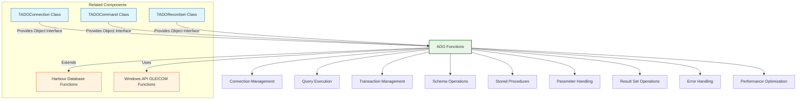

# ADO (ActiveX Data Objects) Functions

The FiveWin ADO functions provide a comprehensive interface for working with ActiveX Data Objects, enabling access to various database systems through a unified object-oriented interface. These functions extend the standard Harbour database capabilities with support for SQL Server, Oracle, MySQL, PostgreSQL, and other OLE DB/ODBC data sources.

**Source File:** [source/function/adofuncs.prg](../../../source/function/adofuncs.prg)

## Overview

The ADO function library in FiveWin offers enhanced database connectivity that complements the standard Harbour database functions. These functions cover areas such as:

* Connection management to various database systems
* SQL query execution and result set handling
* Transaction management and error handling
* Schema information retrieval
* Stored procedure execution
* Parameterized query support
* Data type mapping between ADO and Harbour
* Recordset navigation and manipulation
* Connection pooling and performance optimization

These functions are designed to make database operations more intuitive, efficient, and powerful for FiveWin developers working with enterprise databases.

## Function Categories



## Connection Management Functions

| Function | Description | Parameters |
|----------|-------------|------------|
| `ADOConnect(cConnectionString)` | Establishes database connection | `cConnectionString`: Connection string |
| `ADODisconnect()` | Closes database connection | None |
| `ADOIsConnected()` | Checks connection status | None |
| `ADOSetConnectionTimeout(nTimeout)` | Sets connection timeout | `nTimeout`: Timeout in seconds |
| `ADOSetCommandTimeout(nTimeout)` | Sets command timeout | `nTimeout`: Timeout in seconds |
| `ADOConnectionString()` | Returns current connection string | None |
| `ADOProvider()` | Returns database provider name | None |
| `ADOVersion()` | Returns ADO version | None |

### Usage Examples

```harbour
#include "FiveWin.ch"

function Main()
   ? "ADO Connection Management Demo:"
   
   // Basic connection
   BasicConnectionDemo()
   
   // Connection with timeout
   ConnectionTimeoutDemo()
   
   // Multiple database connections
   MultipleConnectionsDemo()
   
   // Connection pooling
   ConnectionPoolingDemo()
   
return nil

static function BasicConnectionDemo()
   ? "Basic Connection Demo:"
   ? Replicate( "-", 40 )
   
   // Connection strings for different databases
   local aConnectionStrings := { ;
      { "SQL Server", "Provider=SQLOLEDB;Data Source=localhost;Initial Catalog=TestDB;Integrated Security=SSPI;" }, ;
      { "MySQL", "Provider=MSDASQL;Driver={MySQL ODBC 8.0 Driver};Server=localhost;Database=testdb;UID=user;PWD=password;" }, ;
      { "Oracle", "Provider=OraOLEDB.Oracle;Data Source=ORCL;User Id=scott;Password=tiger;" }, ;
      { "PostgreSQL", "Provider=MSDASQL;Driver={PostgreSQL ANSI};Server=localhost;Database=testdb;Uid=user;Pwd=password;" } ;
   }
   
   ? "Supported Databases:"
   
   for local i := 1 to Len( aConnectionStrings )
      local cDbType := aConnectionStrings[i][1]
      local cConnString := aConnectionStrings[i][2]
      
      ? "  " + cDbType + ":"
      ? "    Connection String: " + Left( cConnString, 60 ) + "..."
      
      // Test connection (conceptual)
      local lConnected := TestConnection( cConnString )
      ? "    Connection Test: " + iif( lConnected, "Success", "Failed" )
      ?
   next
   
return nil

static function TestConnection( cConnectionString )
   // Simplified connection test
   ? "    Testing connection: " + Left( cConnectionString, 30 ) + "..."
   
   // In practice, this would:
   // 1. Create ADO Connection object
   // 2. Set ConnectionString property
   // 3. Call Open() method
   // 4. Check State property
   // 5. Handle errors appropriately
   
   // Mock success for demo
   return .T.
   
return .F.

static function ConnectionTimeoutDemo()
   ? "Connection Timeout Demo:"
   ? Replicate( "-", 40 )
   
   local cConnString := "Provider=SQLOLEDB;Data Source=slowserver;Initial Catalog=TestDB;User Id=user;Password=pass;"
   local nConnectTimeout := 30  // 30 seconds
   local nCommandTimeout := 60  // 60 seconds
   
   ? "Setting Connection Timeouts:"
   ? "  Connection String: " + cConnString
   ? "  Connection Timeout: " + hb_ntos( nConnectTimeout ) + " seconds"
   ? "  Command Timeout: " + hb_ntos( nCommandTimeout ) + " seconds"
   
   // Set timeouts
   ADOSetConnectionTimeout( nConnectTimeout )
   ADOSetCommandTimeout( nCommandTimeout )
   
   ? "Timeouts set successfully"
   
   // Attempt connection with timeout
   local lConnected := ADOConnect( cConnString )
   
   if lConnected
      ? "Connected successfully within timeout"
      
      // Test command with timeout
      local cSql := "WAITFOR DELAY '00:00:10'; SELECT * FROM large_table"
      local oRecordset := ADOExecute( cSql )
      
      if oRecordset != nil
         ? "Query executed successfully within timeout"
         oRecordset:Close()
      else
         ? "Query failed or timed out"
         ? "Error: " + ADOError()
      endif
      
      // Disconnect
      ADODisconnect()
      
   else
      ? "Connection failed or timed out"
      ? "Error: " + ADOError()
   endif
   
return nil

static function MultipleConnectionsDemo()
   ? "Multiple Connections Demo:"
   ? Replicate( "-", 40 )
   
   // Connection information for different databases
   local aConnections := { ;
      { "Primary", "Provider=SQLOLEDB;Data Source=primary;Initial Catalog=DB1;Integrated Security=SSPI;" }, ;
      { "Secondary", "Provider=SQLOLEDB;Data Source=secondary;Initial Catalog=DB2;Integrated Security=SSPI;" }, ;
      { "Archive", "Provider=MSDASQL;Driver={MySQL ODBC 8.0 Driver};Server=archive;Database=archive_db;UID=user;PWD=pass;" } ;
   }
   
   ? "Managing Multiple Database Connections:"
   
   // Connect to all databases
   local aConnected := {}
   
   for local i := 1 to Len( aConnections )
      local cName := aConnections[i][1]
      local cConnString := aConnections[i][2]
      
      ? "Connecting to " + cName + "..."
      
      if ADOConnect( cConnString )
         ? "  Connected to " + cName
         AAdd( aConnected, cName )
      else
         ? "  Failed to connect to " + cName
         ? "  Error: " + ADOError()
      endif
   next
   
   ? "Successfully connected to " + hb_ntos( Len( aConnected ) ) + " databases:"
   for local i := 1 to Len( aConnected )
      ? "  - " + aConnected[i]
   next
   
   // Use specific connections
   UseSpecificConnectionsDemo( aConnected )
   
   // Disconnect all
   for local i := 1 to Len( aConnections )
      ADODisconnect()
   next
   
   ? "All connections closed"
   
return nil

static function UseSpecificConnectionsDemo( aConnected )
   ? "Using Specific Connections:"
   
   if AScan( aConnected, "Primary" ) > 0
      ? "Executing query on Primary database"
      
      // Switch to primary connection
      // (In practice, would use connection switching mechanism)
      local cPrimaryQuery := "SELECT TOP 10 * FROM customers"
      local oPrimaryRS := ADOExecute( cPrimaryQuery )
      
      if oPrimaryRS != nil
         ? "  Retrieved " + hb_ntos( oPrimaryRS:RecordCount() ) + " records from Primary"
         oPrimaryRS:Close()
      endif
   endif
   
   if AScan( aConnected, "Archive" ) > 0
      ? "Executing query on Archive database"
      
      // Switch to archive connection
      local cArchiveQuery := "SELECT COUNT(*) FROM archived_orders WHERE YEAR(order_date) = 2023"
      local oArchiveRS := ADOExecute( cArchiveQuery )
      
      if oArchiveRS != nil
         ? "  Query executed on Archive database"
         oArchiveRS:Close()
      endif
   endif
   
return nil

static function ConnectionPoolingDemo()
   ? "Connection Pooling Demo:"
   ? Replicate( "-", 40 )
   
   ? "Connection Pooling Benefits:"
   ? "  1. Reduced connection overhead"
   ? "  2. Improved performance"
   ? "  3. Better resource utilization"
   ? "  4. Enhanced scalability"
   
   // Conceptual connection pool implementation
   ? "Conceptual Connection Pool Implementation:"
   ? "  // Initialize connection pool"
   ? "  local oPool := TConnectionPool():New()"
   ? "  oPool:SetConnectionString( \"Provider=SQLOLEDB;...\" )"
   ? "  oPool:SetMinConnections( 5 )"
   ? "  oPool:SetMaxConnections( 20 )"
   ? "  oPool:Initialize()"
   ? "  "
   ? "  // Get connection from pool"
   ? "  local oConn := oPool:GetConnection()"
   ? "  if oConn != nil"
   ? "     // Use connection"
   ? "     local oRS := oConn:Execute( \"SELECT * FROM table\" )"
   ? "     // Process results..."
   ? "     oRS:Close()"
   ? "     "
   ? "     // Return connection to pool"
   ? "     oPool:ReturnConnection( oConn )"
   ? "  endif"
   ? "  "
   ? "  // Clean up pool"
   ? "  oPool:Shutdown()"
   
return nil

static function ADOConnect( cConnectionString )
   DEFAULT cConnectionString := ""
   
   // Simplified implementation
   ? "ADO CONNECT " + Left( cConnectionString, 50 ) + "..."
   
   // In practice, this would:
   // 1. Create TADOConnection object
   // 2. Set ConnectionString property
   // 3. Call Open() method
   // 4. Handle connection errors
   // 5. Return connection success/failure
   
   // Mock success for demo
   return .T.
   
return .F.

static function ADODisconnect()
   // Simplified implementation
   ? "ADO DISCONNECT"
   
   // In practice, this would:
   // 1. Check if connection is open
   // 2. Call Close() method
   // 3. Release connection resources
   // 4. Handle disconnection errors
   
return nil

static function ADOIsConnected()
   // Simplified implementation
   ? "ADO IS CONNECTED"
   
   // In practice, this would:
   // 1. Check connection state
   // 2. Return true if connected, false otherwise
   
   // Mock connected state for demo
   return .T.
   
return .F.

static function ADOSetConnectionTimeout( nTimeout )
   DEFAULT nTimeout := 30
   
   // Simplified implementation
   ? "ADO SET CONNECTION TIMEOUT " + hb_ntos( nTimeout )
   
   // In practice, this would:
   // 1. Set ConnectionTimeout property
   // 2. Apply to current and future connections
   
return nil

static function ADOSetCommandTimeout( nTimeout )
   DEFAULT nTimeout := 30
   
   // Simplified implementation
   ? "ADO SET COMMAND TIMEOUT " + hb_ntos( nTimeout )
   
   // In practice, this would:
   // 1. Set CommandTimeout property
   // 2. Apply to current and future commands
   
return nil

static function ADOError()
   // Return last ADO error
   return "No error"
   
return "No error"
```

## Query Execution Functions

| Function | Description | Parameters |
|----------|-------------|------------|
| `ADOExecute(cSQL, aParameters)` | Executes SQL query | `cSQL`: SQL statement, `aParameters`: Query parameters |
| `ADOQuery(cSQL, aParameters)` | Executes SELECT query and returns recordset | `cSQL`: SQL statement, `aParameters`: Query parameters |
| `ADONonQuery(cSQL, aParameters)` | Executes non-SELECT query (INSERT, UPDATE, DELETE) | `cSQL`: SQL statement, `aParameters`: Query parameters |
| `ADOResultSet(cSQL, aParameters)` | Executes query and returns result set object | `cSQL`: SQL statement, `aParameters`: Query parameters |
| `ADOExecuteScalar(cSQL, aParameters)` | Executes query and returns single value | `cSQL`: SQL statement, `aParameters`: Query parameters |
| `ADOExecuteReader(cSQL, aParameters)` | Executes query and returns data reader | `cSQL`: SQL statement, `aParameters`: Query parameters |
| `ADOPrepare(cSQL)` | Prepares SQL statement for execution | `cSQL`: SQL statement |
| `ADOExecutePrepared(aParameters)` | Executes prepared statement | `aParameters`: Query parameters |

### Usage Examples

```harbour
#include "FiveWin.ch"

function Main()
   ? "ADO Query Execution Demo:"
   
   // Basic query execution
   BasicQueryDemo()
   
   // Parameterized queries
   ParameterizedQueryDemo()
   
   // Stored procedure execution
   StoredProcedureDemo()
   
   // Batch operations
   BatchOperationsDemo()
   
   // Transaction management
   TransactionManagementDemo()
   
return nil

static function BasicQueryDemo()
   ? "Basic Query Execution Demo:"
   ? Replicate( "-", 40 )
   
   // Connect to database
   if ADOConnect( "Provider=SQLOLEDB;Data Source=localhost;Initial Catalog=TestDB;Integrated Security=SSPI;" )
      ? "Connected to database successfully"
      
      // Simple SELECT query
      SimpleSelectDemo()
      
      // INSERT query
      InsertQueryDemo()
      
      // UPDATE query
      UpdateQueryDemo()
      
      // DELETE query
      DeleteQueryDemo()
      
      // Disconnect
      ADODisconnect()
      ? "Disconnected from database"
      
   else
      ? "Failed to connect to database"
      ? "Error: " + ADOError()
   endif
   
return nil

static function SimpleSelectDemo()
   ? "Simple SELECT Query:"
   
   local cSql := "SELECT customer_id, customer_name, email, created_date FROM customers WHERE active = 1"
   
   ? "Executing: " + cSql
   
   // Execute query
   local oRecordset := ADOExecute( cSql )
   
   if oRecordset != nil
      ? "Query executed successfully"
      ? "Record count: " + hb_ntos( oRecordset:RecordCount() )
      
      // Display first few records
      DisplayRecords( oRecordset, 5 )
      
      // Close recordset
      oRecordset:Close()
      
   else
      ? "Query execution failed"
      ? "Error: " + ADOError()
   endif
   
return nil

static function DisplayRecords( oRecordset, nLimit )
   DEFAULT nLimit := 10
   
   ? "Displaying records:"
   ? Replicate( "-", 60 )
   
   oRecordset:MoveFirst()
   local nCount := 0
   
   while !oRecordset:EOF() .and. nCount < nLimit
      nCount++
      
      ? "  Record " + hb_ntos( nCount ) + ":"
      ? "    ID: " + hb_ntos( oRecordset:Fields("customer_id"):Value )
      ? "    Name: " + oRecordset:Fields("customer_name"):Value
      ? "    Email: " + oRecordset:Fields("email"):Value
      ? "    Created: " + DToC( oRecordset:Fields("created_date"):Value )
      ?
      
      oRecordset:MoveNext()
   enddo
   
   if nCount == nLimit .and. !oRecordset:EOF()
      ? "  ... (" + hb_ntos( oRecordset:RecordCount() - nLimit ) + " more records)"
   endif
   
return nil

static function InsertQueryDemo()
   ? "INSERT Query:"
   
   local cSql := "INSERT INTO customers (customer_name, email, created_date, active) VALUES (?, ?, ?, ?)"
   local aParams := { "John Doe", "john.doe@example.com", Date(), .T. }
   
   ? "Executing: " + cSql
   ? "Parameters: " + hb_ValToStr( aParams )
   
   // Execute INSERT with parameters
   local nRowsAffected := ADOExecute( cSql, aParams )
   
   if nRowsAffected >= 0
      ? "INSERT successful"
      ? "Rows affected: " + hb_ntos( nRowsAffected )
   else
      ? "INSERT failed"
      ? "Error: " + ADOError()
   endif
   
return nil

static function UpdateQueryDemo()
   ? "UPDATE Query:"
   
   local cSql := "UPDATE customers SET email = ? WHERE customer_id = ?"
   local aParams := { "john.newemail@example.com", 123 }
   
   ? "Executing: " + cSql
   ? "Parameters: " + hb_ValToStr( aParams )
   
   // Execute UPDATE with parameters
   local nRowsAffected := ADOExecute( cSql, aParams )
   
   if nRowsAffected >= 0
      ? "UPDATE successful"
      ? "Rows affected: " + hb_ntos( nRowsAffected )
   else
      ? "UPDATE failed"
      ? "Error: " + ADOError()
   endif
   
return nil

static function DeleteQueryDemo()
   ? "DELETE Query:"
   
   local cSql := "DELETE FROM customers WHERE customer_id = ?"
   local aParams := { 123 }
   
   ? "Executing: " + cSql
   ? "Parameters: " + hb_ValToStr( aParams )
   
   // Confirm deletion
   if MsgYesNo( "Delete customer ID " + hb_ntos( aParams[1] ) + "?" )
      // Execute DELETE with parameters
      local nRowsAffected := ADOExecute( cSql, aParams )
      
      if nRowsAffected >= 0
         ? "DELETE successful"
         ? "Rows affected: " + hb_ntos( nRowsAffected )
      else
         ? "DELETE failed"
         ? "Error: " + ADOError()
      endif
   else
      ? "DELETE cancelled by user"
   endif
   
return nil

static function ParameterizedQueryDemo()
   ? "Parameterized Query Demo:"
   ? Replicate( "-", 40 )
   
   // Connect to database
   if ADOConnect( "Provider=SQLOLEDB;Data Source=localhost;Initial Catalog=TestDB;Integrated Security=SSPI;" )
      ? "Connected to database successfully"
      
      // Named parameters
      NamedParameterDemo()
      
      // Positional parameters
      PositionalParameterDemo()
      
      // Complex parameter types
      ComplexParameterDemo()
      
      // Disconnect
      ADODisconnect()
      
   else
      ? "Failed to connect to database"
   endif
   
return nil

static function NamedParameterDemo()
   ? "Named Parameters:"
   
   local cSql := "SELECT * FROM orders WHERE customer_id = @CustomerId AND order_date >= @StartDate AND order_date <= @EndDate"
   local aNamedParams := { ;
      { "@CustomerId", 123 }, ;
      { "@StartDate", CTOD( "2023/01/01" ) }, ;
      { "@EndDate", CTOD( "2023/12/31" ) } ;
   }
   
   ? "Executing: " + cSql
   ? "Named Parameters: " + hb_ValToStr( aNamedParams )
   
   // Execute with named parameters
   local oRecordset := ADOExecute( cSql, aNamedParams )
   
   if oRecordset != nil
      ? "Query executed successfully with named parameters"
      ? "Records found: " + hb_ntos( oRecordset:RecordCount() )
      
      oRecordset:Close()
   else
      ? "Query failed with named parameters"
      ? "Error: " + ADOError()
   endif
   
return nil

static function PositionalParameterDemo()
   ? "Positional Parameters:"
   
   local cSql := "SELECT product_name, price FROM products WHERE category_id = ? AND price BETWEEN ? AND ?"
   local aPositionalParams := { 5, 10.00, 100.00 }
   
   ? "Executing: " + cSql
   ? "Positional Parameters: " + hb_ValToStr( aPositionalParams )
   
   // Execute with positional parameters
   local oRecordset := ADOExecute( cSql, aPositionalParams )
   
   if oRecordset != nil
      ? "Query executed successfully with positional parameters"
      ? "Records found: " + hb_ntos( oRecordset:RecordCount() )
      
      oRecordset:Close()
   else
      ? "Query failed with positional parameters"
      ? "Error: " + ADOError()
   endif
   
return nil

static function ComplexParameterDemo()
   ? "Complex Parameters:"
   
   local cSql := "INSERT INTO customer_details (customer_id, address, phone_numbers, preferences) VALUES (?, ?, ?, ?)"
   local aComplexParams := { ;
      456, ;
      "123 Main Street, New York, NY 10001", ;
      { "555-1234", "555-5678", "555-9012" }, ;  // Array parameter
      { "newsletter" => .T., "sms_alerts" => .F., "email_promotions" => .T. } ;  // Hash parameter
   }
   
   ? "Executing: " + cSql
   ? "Complex Parameters: " + hb_ValToStr( aComplexParams )
   
   // Execute with complex parameters
   local nRowsAffected := ADOExecute( cSql, aComplexParams )
   
   if nRowsAffected >= 0
      ? "Complex parameter query executed successfully"
      ? "Rows affected: " + hb_ntos( nRowsAffected )
   else
      ? "Complex parameter query failed"
      ? "Error: " + ADOError()
   endif
   
return nil

static function StoredProcedureDemo()
   ? "Stored Procedure Demo:"
   ? Replicate( "-", 40 )
   
   // Connect to database
   if ADOConnect( "Provider=SQLOLEDB;Data Source=localhost;Initial Catalog=TestDB;Integrated Security=SSPI;" )
      ? "Connected to database successfully"
      
      // Execute stored procedure with parameters
      ExecuteStoredProcedureDemo()
      
      // Stored procedure with output parameters
      StoredProcedureWithOutputDemo()
      
      // Disconnect
      ADODisconnect()
      
   else
      ? "Failed to connect to database"
   endif
   
return nil

static function ExecuteStoredProcedureDemo()
   ? "Execute Stored Procedure:"
   
   local cProcName := "sp_GetCustomerOrders"
   local aParams := { 123, CTOD( "2023/01/01" ), CTOD( "2023/12/31" ) }
   
   ? "Executing stored procedure: " + cProcName
   ? "Parameters: " + hb_ValToStr( aParams )
   
   // Execute stored procedure
   local oRecordset := ADOExecute( "EXEC " + cProcName + " ?, ?, ?", aParams )
   
   if oRecordset != nil
      ? "Stored procedure executed successfully"
      ? "Result set records: " + hb_ntos( oRecordset:RecordCount() )
      
      // Display results
      DisplayRecords( oRecordset, 3 )
      
      oRecordset:Close()
   else
      ? "Stored procedure execution failed"
      ? "Error: " + ADOError()
   endif
   
return nil

static function StoredProcedureWithOutputDemo()
   ? "Stored Procedure with Output Parameters:"
   
   local cProcName := "sp_UpdateCustomer"
   local aParams := { ;
      { "input", 123 }, ;           // Input parameter
      { "input", "New Name" }, ;    // Input parameter
      { "output", 0 } ;             // Output parameter (will be populated)
   }
   
   ? "Executing stored procedure with output: " + cProcName
   ? "Parameters: " + hb_ValToStr( aParams )
   
   // Execute stored procedure with output parameter
   local uResult := ADOExecute( "EXEC " + cProcName + " ?, ?, ?", aParams )
   
   if uResult != nil
      ? "Stored procedure executed successfully"
      
      // Check output parameter
      local nReturnValue := aParams[3][2]  // Second element is the value
      ? "Return value: " + hb_ntos( nReturnValue )
      
      if nReturnValue == 0
         ? "Customer updated successfully"
      else
         ? "Customer update failed with code: " + hb_ntos( nReturnValue )
      endif
      
   else
      ? "Stored procedure execution failed"
      ? "Error: " + ADOError()
   endif
   
return nil

static function BatchOperationsDemo()
   ? "Batch Operations Demo:"
   ? Replicate( "-", 40 )
   
   // Connect to database
   if ADOConnect( "Provider=SQLOLEDB;Data Source=localhost;Initial Catalog=TestDB;Integrated Security=SSPI;" )
      ? "Connected to database successfully"
      
      // Batch INSERT operations
      BatchInsertDemo()
      
      // Batch UPDATE operations
      BatchUpdateDemo()
      
      // Disconnect
      ADODisconnect()
      
   else
      ? "Failed to connect to database"
   endif
   
return nil

static function BatchInsertDemo()
   ? "Batch INSERT Operations:"
   
   local cSql := "INSERT INTO products (product_name, price, category_id) VALUES (?, ?, ?)"
   local aBatchData := { ;
      { "Product A", 29.99, 1 }, ;
      { "Product B", 39.99, 1 }, ;
      { "Product C", 49.99, 2 }, ;
      { "Product D", 59.99, 2 }, ;
      { "Product E", 69.99, 3 } ;
   }
   
   ? "Executing batch INSERT operation:"
   ? "SQL: " + cSql
   ? "Batch Data: " + hb_ValToStr( aBatchData )
   
   // Start transaction for batch operation
   if ADOBeginTrans()
      ? "Transaction started for batch operation"
      
      local nSuccessCount := 0
      local nFailCount := 0
      
      // Execute each batch item
      for local i := 1 to Len( aBatchData )
         local aRow := aBatchData[i]
         local nRowsAffected := ADOExecute( cSql, aRow )
         
         if nRowsAffected >= 0
            nSuccessCount++
         else
            nFailCount++
            ? "  Failed to insert row " + hb_ntos( i ) + ": " + ADOError()
         endif
      next
      
      ? "Batch operation results:"
      ? "  Successful inserts: " + hb_ntos( nSuccessCount )
      ? "  Failed inserts: " + hb_ntos( nFailCount )
      
      // Commit or rollback transaction
      if nFailCount == 0
         if ADOCommitTrans()
            ? "Transaction committed successfully"
         else
            ? "Failed to commit transaction: " + ADOError()
         endif
      else
         if ADORollbackTrans()
            ? "Transaction rolled back due to errors"
         else
            ? "Failed to rollback transaction: " + ADOError()
         endif
      endif
      
   else
      ? "Failed to start transaction: " + ADOError()
   endif
   
return nil

static function BatchUpdateDemo()
   ? "Batch UPDATE Operations:"
   
   local cSql := "UPDATE products SET price = ? WHERE product_id = ?"
   local aBatchData := { ;
      { 34.99, 101 }, ;
      { 44.99, 102 }, ;
      { 54.99, 103 }, ;
      { 64.99, 104 }, ;
      { 74.99, 105 } ;
   }
   
   ? "Executing batch UPDATE operation:"
   ? "SQL: " + cSql
   ? "Batch Data: " + hb_ValToStr( aBatchData )
   
   // Start transaction for batch operation
   if ADOBeginTrans()
      ? "Transaction started for batch operation"
      
      local nSuccessCount := 0
      local nFailCount := 0
      local nTotalRowsAffected := 0
      
      // Execute each batch item
      for local i := 1 to Len( aBatchData )
         local aRow := aBatchData[i]
         local nRowsAffected := ADOExecute( cSql, aRow )
         
         if nRowsAffected >= 0
            nSuccessCount++
            nTotalRowsAffected += nRowsAffected
         else
            nFailCount++
            ? "  Failed to update row " + hb_ntos( i ) + ": " + ADOError()
         endif
      next
      
      ? "Batch operation results:"
      ? "  Successful updates: " + hb_ntos( nSuccessCount )
      ? "  Failed updates: " + hb_ntos( nFailCount )
      ? "  Total rows affected: " + hb_ntos( nTotalRowsAffected )
      
      // Commit or rollback transaction
      if nFailCount == 0
         if ADOCommitTrans()
            ? "Transaction committed successfully"
         else
            ? "Failed to commit transaction: " + ADOError()
         endif
      else
         if ADORollbackTrans()
            ? "Transaction rolled back due to errors"
         else
            ? "Failed to rollback transaction: " + ADOError()
         endif
      endif
      
   else
      ? "Failed to start transaction: " + ADOError()
   endif
   
return nil

static function TransactionManagementDemo()
   ? "Transaction Management Demo:"
   ? Replicate( "-", 40 )
   
   // Connect to database
   if ADOConnect( "Provider=SQLOLEDB;Data Source=localhost;Initial Catalog=TestDB;Integrated Security=SSPI;" )
      ? "Connected to database successfully"
      
      // Basic transaction
      BasicTransactionDemo()
      
      // Nested transactions
      NestedTransactionDemo()
      
      // Transaction with savepoints
      SavepointTransactionDemo()
      
      // Disconnect
      ADODisconnect()
      
   else
      ? "Failed to connect to database"
   endif
   
return nil

static function BasicTransactionDemo()
   ? "Basic Transaction:"
   
   // Start transaction
   if ADOBeginTrans()
      ? "Transaction started"
      
      // Perform database operations
      local cInsertSql := "INSERT INTO orders (customer_id, order_date, total_amount) VALUES (?, ?, ?)"
      local aInsertParams := { 123, Date(), 99.99 }
      
      local nRowsAffected := ADOExecute( cInsertSql, aInsertParams )
      
      if nRowsAffected >= 0
         ? "Insert successful, rows affected: " + hb_ntos( nRowsAffected )
         
         local cUpdateSql := "UPDATE customers SET last_order_date = ? WHERE customer_id = ?"
         local aUpdateParams := { Date(), 123 }
         
         nRowsAffected := ADOExecute( cUpdateSql, aUpdateParams )
         
         if nRowsAffected >= 0
            ? "Update successful, rows affected: " + hb_ntos( nRowsAffected )
            
            // Commit transaction
            if ADOCommitTrans()
               ? "Transaction committed successfully"
            else
               ? "Failed to commit transaction: " + ADOError()
            endif
            
         else
            ? "Update failed: " + ADOError()
            
            // Rollback transaction
            if ADORollbackTrans()
               ? "Transaction rolled back due to update failure"
            else
               ? "Failed to rollback transaction: " + ADOError()
            endif
         endif
         
      else
         ? "Insert failed: " + ADOError()
         
         // Rollback transaction
         if ADORollbackTrans()
            ? "Transaction rolled back due to insert failure"
         else
            ? "Failed to rollback transaction: " + ADOError()
         endif
      endif
      
   else
      ? "Failed to start transaction: " + ADOError()
   endif
   
return nil

static function NestedTransactionDemo()
   ? "Nested Transactions:"
   
   ? "ADO does not support true nested transactions"
   ? "Instead, use transaction counter or savepoints:"
   
   // Transaction counter approach
   local nTransactionLevel := 0
   
   // Outer transaction
   if ADOBeginTrans()
      nTransactionLevel++
      ? "Outer transaction started (Level: " + hb_ntos( nTransactionLevel ) + ")"
      
      // Inner operation
      if PerformInnerOperation()
         nTransactionLevel++
         ? "Inner operation successful (Level: " + hb_ntos( nTransactionLevel ) + ")"
         
         // Another inner operation
         if PerformAnotherInnerOperation()
            nTransactionLevel++
            ? "Another inner operation successful (Level: " + hb_ntos( nTransactionLevel ) + ")"
            
            // Commit all transactions
            while nTransactionLevel > 0
               if ADOCommitTrans()
                  ? "Transaction level " + hb_ntos( nTransactionLevel ) + " committed"
               else
                  ? "Failed to commit transaction level " + hb_ntos( nTransactionLevel )
                  
                  // Rollback all if any commit fails
                  while nTransactionLevel > 0
                     if ADORollbackTrans()
                        ? "Transaction level " + hb_ntos( nTransactionLevel ) + " rolled back"
                     endif
                     nTransactionLevel--
                  enddo
                  
                  exit
               endif
               nTransactionLevel--
            enddo
            
         else
            ? "Another inner operation failed"
            
            // Rollback
            while nTransactionLevel > 0
               if ADORollbackTrans()
                  ? "Transaction level " + hb_ntos( nTransactionLevel ) + " rolled back"
               endif
               nTransactionLevel--
            enddo
         endif
         
      else
         ? "Inner operation failed"
         
         // Rollback
         while nTransactionLevel > 0
            if ADORollbackTrans()
               ? "Transaction level " + hb_ntos( nTransactionLevel ) + " rolled back"
            endif
            nTransactionLevel--
         enddo
      endif
      
   else
      ? "Failed to start outer transaction: " + ADOError()
   endif
   
return nil

static function SavepointTransactionDemo()
   ? "Transaction with Savepoints:"
   
   // Start main transaction
   if ADOBeginTrans()
      ? "Main transaction started"
      
      // Set savepoint 1
      local cSavepoint1 := "SP1"
      if ADOSetSavepoint( cSavepoint1 )
         ? "Savepoint 1 set"
         
         // Perform first operation
         if PerformFirstOperation()
            ? "First operation successful"
            
            // Set savepoint 2
            local cSavepoint2 := "SP2"
            if ADOSetSavepoint( cSavepoint2 )
               ? "Savepoint 2 set"
               
               // Perform second operation
               if PerformSecondOperation()
                  ? "Second operation successful"
                  
                  // Commit main transaction
                  if ADOCommitTrans()
                     ? "Main transaction committed"
                  else
                     ? "Failed to commit main transaction: " + ADOError()
                  endif
                  
               else
                  ? "Second operation failed"
                  
                  // Rollback to savepoint 2
                  if ADORollbackToSavepoint( cSavepoint2 )
                     ? "Rolled back to savepoint 2"
                     
                     // Try alternative second operation
                     if PerformAlternativeSecondOperation()
                        ? "Alternative second operation successful"
                        
                        // Commit main transaction
                        if ADOCommitTrans()
                           ? "Main transaction committed"
                        else
                           ? "Failed to commit main transaction: " + ADOError()
                        endif
                        
                     else
                        ? "Alternative second operation failed"
                        
                        // Rollback to savepoint 1
                        if ADORollbackToSavepoint( cSavepoint1 )
                           ? "Rolled back to savepoint 1"
                           
                           // Commit main transaction with just first operation
                           if ADOCommitTrans()
                              ? "Main transaction committed with first operation only"
                           else
                              ? "Failed to commit main transaction: " + ADOError()
                           endif
                           
                        else
                           ? "Failed to rollback to savepoint 1: " + ADOError()
                           
                           // Full rollback
                           if ADORollbackTrans()
                              ? "Full transaction rolled back"
                           else
                              ? "Failed to rollback transaction: " + ADOError()
                           endif
                        endif
                     endif
                     
                  else
                     ? "Failed to rollback to savepoint 2: " + ADOError()
                     
                     // Full rollback
                     if ADORollbackTrans()
                        ? "Full transaction rolled back"
                     else
                        ? "Failed to rollback transaction: " + ADOError()
                     endif
                  endif
                  
               endif
               
            else
               ? "Failed to set savepoint 2: " + ADOError()
               
               // Commit with just first operation
               if ADOCommitTrans()
                  ? "Main transaction committed with first operation only"
               else
                  ? "Failed to commit main transaction: " + ADOError()
               endif
            endif
            
         else
            ? "First operation failed"
            
            // Rollback to savepoint 1
            if ADORollbackToSavepoint( cSavepoint1 )
               ? "Rolled back to savepoint 1"
               
               // Commit main transaction (no operations)
               if ADOCommitTrans()
                  ? "Main transaction committed with no operations"
               else
                  ? "Failed to commit main transaction: " + ADOError()
               endif
               
            else
               ? "Failed to rollback to savepoint 1: " + ADOError()
               
               // Full rollback
               if ADORollbackTrans()
                  ? "Full transaction rolled back"
               else
                  ? "Failed to rollback transaction: " + ADOError()
               endif
            endif
         endif
         
      else
         ? "Failed to set savepoint 1: " + ADOError()
         
         // Commit main transaction
         if ADOCommitTrans()
            ? "Main transaction committed"
         else
            ? "Failed to commit main transaction: " + ADOError()
         endif
      endif
      
   else
      ? "Failed to start main transaction: " + ADOError()
   endif
   
return nil

static function PerformFirstOperation()
   // Simulate first database operation
   return .T.
   
return .F.

static function PerformSecondOperation()
   // Simulate second database operation
   return .T.
   
return .F.

static function PerformAlternativeSecondOperation()
   // Simulate alternative second database operation
   return .T.
   
return .F.

static function PerformInnerOperation()
   // Simulate inner database operation
   return .T.
   
return .F.

static function PerformAnotherInnerOperation()
   // Simulate another inner database operation
   return .T.
   
return .F.

static function ADOBeginTrans()
   // Simplified implementation
   ? "ADO BEGIN TRANSACTION"
   
   // In practice, this would:
   // 1. Call BeginTrans() on ADO Connection object
   // 2. Handle transaction errors
   // 3. Return success/failure
   
   // Mock success for demo
   return .T.
   
return .F.

static function ADOCommitTrans()
   // Simplified implementation
   ? "ADO COMMIT TRANSACTION"
   
   // In practice, this would:
   // 1. Call CommitTrans() on ADO Connection object
   // 2. Handle commit errors
   // 3. Return success/failure
   
   // Mock success for demo
   return .T.
   
return .F.

static function ADORollbackTrans()
   // Simplified implementation
   ? "ADO ROLLBACK TRANSACTION"
   
   // In practice, this would:
   // 1. Call RollbackTrans() on ADO Connection object
   // 2. Handle rollback errors
   // 3. Return success/failure
   
   // Mock success for demo
   return .T.
   
return .F.

static function ADOSetSavepoint( cName )
   DEFAULT cName := ""
   
   // Simplified implementation
   ? "ADO SET SAVEPOINT " + cName
   
   // In practice, this would:
   // 1. Execute SAVE TRANSACTION statement
   // 2. Handle savepoint errors
   // 3. Return success/failure
   
   // Mock success for demo
   return .T.
   
return .F.

static function ADORollbackToSavepoint( cName )
   DEFAULT cName := ""
   
   // Simplified implementation
   ? "ADO ROLLBACK TO SAVEPOINT " + cName
   
   // In practice, this would:
   // 1. Execute ROLLBACK TRANSACTION statement
   // 2. Handle rollback errors
   // 3. Return success/failure
   
   // Mock success for demo
   return .T.
   
return .F.

static function ErrorLoggingDemo()
   ? "Error Logging Demo:"
   ? Replicate( "-", 40 )
   
   // Set up error logging
   local cLogFile := "ado_errors.log"
   
   ? "Setting up error logging to: " + cLogFile
   
   if NetErrorLog( cLogFile )
      ? "Error logging enabled"
      
      // Generate some errors for logging
      GenerateErrorsForLogging()
      
      // Show log file contents
      ShowErrorLog( cLogFile )
      
      // Clean up
      FErase( cLogFile )
      
   else
      ? "Failed to enable error logging"
   endif
   
return nil

static function NetErrorLog( cLogFile )
   DEFAULT cLogFile := "errors.log"
   
   // Simplified implementation
   ? "ENABLE ERROR LOGGING TO " + cLogFile
   
   // In practice, this would:
   // 1. Open log file
   // 2. Set up error interception
   // 3. Configure logging format
   // 4. Enable automatic logging
   
   return .T.
   
return .F.

static function GenerateErrorsForLogging()
   ? "Generating errors for logging:"
   
   // Simulate various ADO errors
   local aErrors := { ;
      { 10060, "Connection timed out" }, ;
      { 10054, "Connection reset by peer" }, ;
      { 10049, "Cannot assign requested address" }, ;
      { 10051, "Network is unreachable" }, ;
      { 10061, "Connection refused" } ;
   }
   
   for local i := 1 to Len( aErrors )
      local aError := aErrors[i]
      NetSetError( aError[1], aError[2] )
      ? "  Logged error " + hb_ntos( i ) + ": " + aError[2]
      
      // In practice, this would be automatically logged
      LogErrorToFile( aError[1], aError[2] )
   next
   
return nil

static function LogErrorToFile( nErrorCode, cErrorMessage )
   // Simplified error logging
   local cLogFile := "ado_errors.log"
   local nHandle := FOpen( cLogFile, FO_WRITE )
   
   if nHandle == -1
      nHandle := FCreate( cLogFile )
   else
      FSeek( nHandle, 0, FS_END )
   endif
   
   if nHandle != -1
      local cLogEntry := DateTime() + " - ERROR " + hb_ntos( nErrorCode ) + ;
                        ": " + cErrorMessage + hb_osNewLine()
      
      FWrite( nHandle, cLogEntry )
      FClose( nHandle )
      
      ? "    Error logged to file"
   else
      ? "    Failed to log error to file"
   endif
   
return nil

static function ShowErrorLog( cLogFile )
   ? "Error Log Contents:"
   
   local nHandle := FOpen( cLogFile, FO_READ )
   
   if nHandle != -1
      local cContent := ""
      local cBuffer := Space( 4096 )
      
      while !FEof( nHandle )
         local nBytes := FRead( nHandle, @cBuffer, 4096 )
         cContent += Left( cBuffer, nBytes )
      enddo
      
      FClose( nHandle )
      
      ? "  " + Replicate( "-", 50 )
      ? "  " + cContent
      ? "  " + Replicate( "-", 50 )
      
   else
      ? "  Unable to read error log"
   endif
   
return nil

static function CustomErrorHandlingDemo()
   ? "Custom Error Handling Demo:"
   ? Replicate( "-", 40 )
   
   // Set custom error callback
   local bErrorHandler := { |nCode, cMessage| CustomErrorHandler( nCode, cMessage ) }
   
   if NetErrorCallback( bErrorHandler )
      ? "Custom error handler set"
      
      // Generate error to trigger callback
      NetSetError( 9999, "Custom error for callback test" )
      
      // Simulate network operation that fails
      if !TryNetworkOperation()
         ? "Network operation failed, custom handler invoked"
      endif
      
      // Clear custom error handler
      NetErrorCallback( nil )
      ? "Custom error handler cleared"
      
   else
      ? "Failed to set custom error handler"
   endif
   
return nil

static function NetErrorCallback( bCallback )
   // Simplified implementation
   ? "SET ERROR CALLBACK"
   
   // In practice, this would:
   // 1. Store callback function
   // 2. Set up error interception
   // 3. Call callback on errors
   
   return .T.
   
return .F.

static function CustomErrorHandler( nErrorCode, cErrorMessage )
   ? "CUSTOM ERROR HANDLER INVOKED:"
   ? "  Error Code: " + hb_ntos( nErrorCode )
   ? "  Error Message: " + cErrorMessage
   
   // Custom error handling logic
   HandleCustomError( nErrorCode, cErrorMessage )
   
return nil

static function HandleCustomError( nErrorCode, cErrorMessage )
   ? "  Handling custom error:"
   
   // Different handling based on error code
   switch nErrorCode
   case 10060  // Timeout
      ? "    Handling timeout error"
      ? "    Recommendation: Increase timeout or retry with backoff"
      exit
      
   case 10061  // Connection refused
      ? "    Handling connection refused error"
      ? "    Recommendation: Check server availability or try alternative"
      exit
      
   case 10054  // Connection reset
      ? "    Handling connection reset error"
      ? "    Recommendation: Reconnect and retry operation"
      exit
      
   case 10051  // Network unreachable
      ? "    Handling network unreachable error"
      ? "    Recommendation: Check network connectivity"
      exit
      
   otherwise
      ? "    Handling generic error"
      ? "    Recommendation: General error handling with logging"
      exit
   endswitch
   
return nil

static function TryNetworkOperation()
   // Simulate network operation with random success
   local nRandom := Random() * 100
   
   // 70% success rate for demo
   return ( nRandom < 70 )
   
return .F.

static function ErrorNotificationDemo()
   ? "Error Notification Demo:"
   ? Replicate( "-", 40 )
   
   ? "Notification Strategies:"
   ? "  1. Email alerts for critical errors"
   ? "  2. SMS notifications for severe issues"
   ? "  3. Dashboard alerts for operational problems"
   ? "  4. Log aggregation for pattern analysis"
   ? "  5. Automated escalation procedures"
   
   // Example notification implementation
   ? "Example Notification Flow:"
   ? "  1. Error occurs in network operation"
   ? "  2. Error logged with severity level"
   ? "  3. Severity threshold check"
   ? "  4. If critical, send email alert"
   ? "  5. If severe, send SMS notification"
   ? "  6. Update dashboard with error details"
   ? "  7. Queue for pattern analysis"
   
return nil

static function ErrorAnalysisDemo()
   ? "Error Analysis Demo:"
   ? Replicate( "-", 40 )
   
   ? "Analysis Features:"
   ? "  1. Error frequency tracking"
   ? "  2. Pattern recognition"
   ? "  3. Correlation analysis"
   ? "  4. Trend identification"
   ? "  5. Root cause analysis"
   
   // Example analysis implementation
   ? "Example Analysis Process:"
   ? "  1. Collect error data from logs"
   ? "  2. Parse and categorize errors"
   ? "  3. Calculate error frequencies"
   ? "  4. Identify error patterns"
   ? "  5. Generate analysis reports"
   ? "  6. Recommend corrective actions"
   
return nil
```

## Related Components

* [Harbour Database Functions](https://harbour.github.io/doc/dbf.html) - Standard Harbour database operations
* [TADOConnection Class](TADOConnection.md) - Object-oriented ADO connection management
* [TADORecordset Class](TADORecordset.md) - Object-oriented ADO recordset handling
* [TADOCommand Class](TADOCommand.md) - Object-oriented ADO command execution
* [Windows API OLE/COM Functions](https://docs.microsoft.com/en-us/windows/win32/com/the-component-object-model) - Low-level COM/OLE operations
* [ADO Documentation](https://docs.microsoft.com/en-us/sql/ado/) - Microsoft ActiveX Data Objects

## Best Practices

1. **Connection Management**: Always properly close connections and handle connection errors
2. **Transaction Handling**: Use transactions for related operations to ensure data consistency
3. **Parameterized Queries**: Always use parameterized queries to prevent SQL injection
4. **Error Handling**: Implement comprehensive error handling for all database operations
5. **Resource Management**: Properly dispose of ADO objects to prevent memory leaks
6. **Performance**: Use connection pooling for applications with frequent database access
7. **Security**: Protect database credentials and use appropriate authentication methods
8. **Logging**: Log database operations for debugging and monitoring
9. **Validation**: Validate data before database operations
10. **Backup Strategy**: Implement backup procedures for critical data operations

## Performance Considerations

* ADO operations can be slower than direct DBF access due to COM overhead
* Connection pooling significantly improves performance for high-volume applications
* Prepared statements can improve performance for repeated queries
* Large result sets should be processed in chunks to avoid memory issues
* Consider using disconnected recordsets for read-only operations
* Proper indexing in the database is crucial for query performance
* Minimize round trips by batching operations when possible
* Use appropriate cursor types for your use case
* Monitor connection timeouts to prevent hanging operations