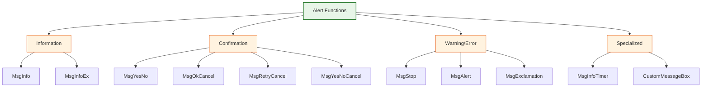
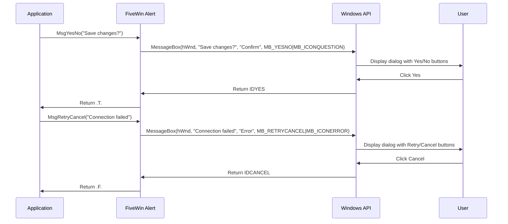
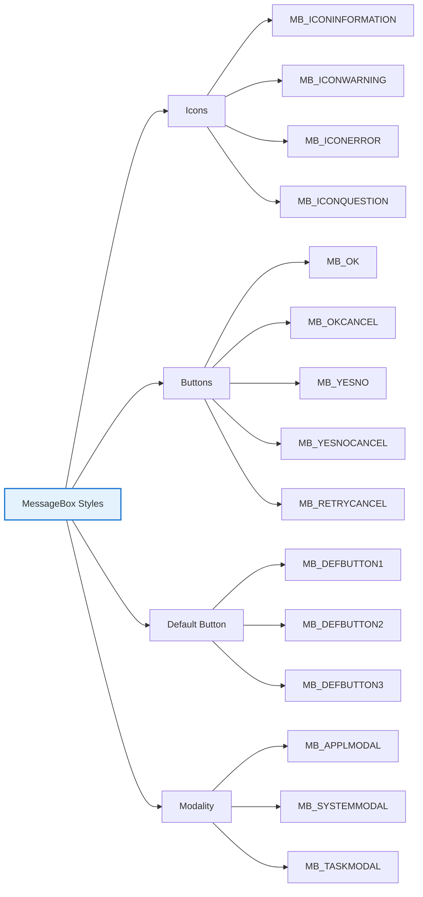

# Alert and Message Functions

FiveWin provides a comprehensive set of functions for displaying message boxes and alerts to users. These functions offer a simple yet powerful way to communicate with users, request input, and provide feedback in your applications.

**Source File:** [source/function/alert.prg](../../../../source/function/alert.prg)

## Overview

The alert and message functions are essential tools for user interaction in FiveWin applications. They provide a standardized way to display information, warnings, errors, and request user decisions through familiar dialog interfaces.

These functions are built on top of the Windows MessageBox API but provide a more convenient and Harbour-friendly interface. They automatically handle localization, proper positioning, and integration with the FiveWin application environment.

## Function Categories



## Core Functions

| Function | Description | Return Value |
|----------|-------------|--------------|
| `MsgInfo(cMessage, cTitle)` | Displays informational message | `.T.` |
| `MsgAlert(cMessage, cTitle)` | Displays warning message with alert icon | `.T.` |
| `MsgStop(cMessage, cTitle)` | Displays error message with stop icon | `.T.` |
| `MsgYesNo(cMessage, cTitle)` | Displays Yes/No dialog | `.T.` (Yes) or `.F.` (No) |
| `MsgOkCancel(cMessage, cTitle)` | Displays OK/Cancel dialog | `.T.` (OK) or `.F.` (Cancel) |
| `MsgRetryCancel(cMessage, cTitle)` | Displays Retry/Cancel dialog | `.T.` (Retry) or `.F.` (Cancel) |
| `MsgYesNoCancel(cMessage, cTitle)` | Displays Yes/No/Cancel dialog | 6 (Yes), 7 (No), 2 (Cancel) |

## Message Dialog Flow



## Detailed Function Reference

### MsgInfo()

Displays a simple informational message box with an OK button and an information icon.

```harbour
#include "FiveWin.ch"

function Main()
   // Basic usage
   MsgInfo( "Operation completed successfully" )
   
   // With custom title
   MsgInfo( "File saved to disk", "Save Complete" )
   
   // Multi-line message
   MsgInfo( "Line 1" + hb_osNewLine() + "Line 2" + hb_osNewLine() + "Line 3" )
   
return nil
```

### MsgAlert()

Displays a warning message with an exclamation icon.

```harbour
#include "FiveWin.ch"

function Main()
   local cFileName := "document.txt"
   
   // Warning about unsaved changes
   MsgAlert( "The file " + cFileName + " has unsaved changes" )
   
   // Warning with custom title
   MsgAlert( "Low disk space detected", "Warning" )
   
return nil
```

### MsgStop()

Displays an error message with a stop/error icon.

```harbour
#include "FiveWin.ch"

function Main()
   local cFilePath := "C:\\nonexistent\\file.txt"
   
   // Error message
   MsgStop( "Cannot access file: " + cFilePath )
   
   // Error with custom title
   MsgStop( "Database connection failed", "Connection Error" )
   
return nil
```

### MsgYesNo()

Displays a dialog with Yes and No buttons, returning `.T.` for Yes and `.F.` for No.

```harbour
#include "FiveWin.ch"

function Main()
   local cFileName := "document.txt"
   
   // Confirmation dialog
   if MsgYesNo( "Do you want to delete " + cFileName + "?" )
      // User clicked Yes
      ? "Deleting file..."
      // DeleteFile( cFileName )
   else
      // User clicked No
      ? "Operation cancelled"
   endif
   
   // With custom title
   if MsgYesNo( "Save changes before closing?", "Confirm Save" )
      // Save logic here
   endif
   
return nil
```

### MsgOkCancel()

Displays a dialog with OK and Cancel buttons, returning `.T.` for OK and `.F.` for Cancel.

```harbour
#include "FiveWin.ch"

function Main()
   local cSettings := "Theme: Dark, Font: Arial"
   
   // Settings confirmation
   if MsgOkCancel( "Apply these settings?" + hb_osNewLine() + cSettings )
      // User clicked OK
      ? "Applying settings..."
      // ApplySettings()
   else
      // User clicked Cancel
      ? "Settings not applied"
   endif
   
return nil
```

### MsgRetryCancel()

Displays a dialog with Retry and Cancel buttons, returning `.T.` for Retry and `.F.` for Cancel.

```harbour
#include "FiveWin.ch"

function Main()
   local cURL := "https://api.example.com/data"
   
   // Network operation with retry
   if !ConnectToServer( cURL )
      if MsgRetryCancel( "Failed to connect to server. Retry?" )
         // User clicked Retry
         ? "Retrying connection..."
         // RetryConnection( cURL )
      else
         // User clicked Cancel
         ? "Connection cancelled"
      endif
   endif
   
return nil

static function ConnectToServer( cURL )
   // Simulate connection attempt
   return .F.  // Always fail for example
```

### MsgYesNoCancel()

Displays a dialog with Yes, No, and Cancel buttons, returning the Windows MessageBox code: 6 (`IDYES`) for Yes, 7 (`IDNO`) for No, and 2 (`IDCANCEL`) for Cancel.

```harbour
#include "FiveWin.ch"

function Main()
   local nChoice
   
   // Three-way decision
   nChoice = MsgYesNoCancel( "Save changes before closing?" )
   
   switch nChoice
   case IDYES  // 6
      ? "Saving changes..."
      // SaveChanges()
      exit
   
   case IDNO  // 7
      ? "Closing without saving"
      // CloseWithoutSaving()
      exit
   
   case IDCANCEL  // 2
      ? "Operation cancelled"
      // CancelClose()
      exit
   endswitch
   
return nil
```

## Advanced Usage Patterns

### Context-Aware Messaging

```harbour
#include "FiveWin.ch"

function ProcessData( cDataFile )
   local nResult
   
   // Check if file exists
   if !File( cDataFile )
      MsgStop( "Data file not found: " + cDataFile, "File Error" )
      return .F.
   endif
   
   // Process with progress indication
   nResult = ProcessFile( cDataFile )
   
   switch nResult
   case 0  // Success
      MsgInfo( "Data processed successfully", "Complete" )
      return .T.
      
   case 1  // Warning
      if MsgYesNo( "Processing completed with warnings. Continue?", "Warning" )
         return .T.
      else
         return .F.
      endif
      
   case 2  // Error
      MsgStop( "Data processing failed", "Error" )
      return .F.
   endswitch
   
return .F.

static function ProcessFile( cFile )
   // Simulate processing
   // Return 0=Success, 1=Warning, 2=Error
   return 0
```

### User Preference Storage

```harbour
#include "FiveWin.ch"

function DeleteFileWithConfirmation( cFileName )
   local lConfirmed
   
   // Check user preference
   if GetGlobalPreference( "ConfirmFileDelete" ) == .F.
      // No confirmation needed
      return DeleteFile( cFileName )
   endif
   
   // Show confirmation dialog
   lConfirmed = MsgYesNo( "Delete file: " + cFileName + "?" + hb_osNewLine() + ;
                         "This action cannot be undone." )
   
   if lConfirmed
      if DeleteFile( cFileName )
         MsgInfo( "File deleted successfully" )
         return .T.
      else
         MsgStop( "Failed to delete file: " + cFileName )
         return .F.
      endif
   else
      MsgInfo( "Delete operation cancelled" )
      return .F.
   endif
   
return .F.

static function GetGlobalPreference( cPref )
   // Simulate preference retrieval
   return .T.  // Always confirm for example
```

### Error Handling with Retry Logic

```harbour
#include "FiveWin.ch"

function ConnectToDatabase( cConnectionString )
   local nAttempts := 0
   local nMaxAttempts := 3
   local lConnected := .F.
   
   while nAttempts < nMaxAttempts .and. !lConnected
      nAttempts++
      
      lConnected = AttemptConnection( cConnectionString )
      
      if !lConnected .and. nAttempts < nMaxAttempts
         if !MsgRetryCancel( "Database connection failed (attempt " + ;
                           hb_ntos(nAttempts) + " of " + ;
                           hb_ntos(nMaxAttempts) + "). Retry?" )
            exit  // User cancelled
         endif
      endif
   enddo
   
   if lConnected
      MsgInfo( "Connected to database successfully" )
   else
      MsgStop( "Failed to connect to database after " + ;
              hb_ntos(nMaxAttempts) + " attempts" )
   endif
   
return lConnected

static function AttemptConnection( cConnStr )
   // Simulate connection attempt
   // Return .T. for success, .F. for failure
   return .F.  // Always fail for example
```

## Integration with FiveWin Components

### Using with TDialog

```harbour
#include "FiveWin.ch"

function Main()
   local oDlg
   
   DEFINE DIALOG oDlg TITLE "Document Editor" ;
      FROM 0, 0 TO 200, 300
   
   @ 10, 10 BUTTON "Close" OF oDlg ;
      ACTION CloseDialog( oDlg )
   
   ACTIVATE DIALOG oDlg
   
return nil

static function CloseDialog( oDlg )
   local cDocument := "Untitled"
   local lModified := .T.  // Simulate modified document
   
   if lModified
      switch MsgYesNoCancel( "Save changes to " + cDocument + "?" )
      case IDYES  // 6
         // SaveDocument()
         MsgInfo( "Document saved" )
         oDlg:End()
         exit
         
      case IDNO  // 7
         oDlg:End()
         exit
         
      case IDCANCEL  // 2
         // Do nothing, keep dialog open
         exit
      endswitch
   else
      oDlg:End()
   endif
   
return nil
```

## Customization Options

### Message Box Styles



## Related Components

* [TDialog Class](../classes/TDialog.md) - Dialog windows that can contain custom message interfaces
* [Windows API MessageBox](https://docs.microsoft.com/en-us/windows/win32/api/winuser/nf-winuser-messagebox) - Underlying Windows function

## Best Practices

1. **Clear Messaging**: Use concise, clear messages that explain what happened and what the user should do
2. **Appropriate Icons**: Choose icons that match the message type (info, warning, error, question)
3. **Consistent Titles**: Use consistent, descriptive titles for message boxes
4. **User Control**: Provide appropriate button options for the context
5. **Error Recovery**: When possible, offer solutions or next steps in error messages
6. **Localization**: Consider internationalization when writing messages
7. **Frequency**: Avoid excessive messaging that might annoy users
8. **Context**: Include relevant context information in messages

## Performance Considerations

* Message boxes are modal and block application execution until dismissed
* Complex messages with many buttons can confuse users
* Frequent message boxes can degrade user experience
* Consider using status bars or inline notifications for non-critical information
* For time-sensitive operations, consider using timed messages or progress dialogs