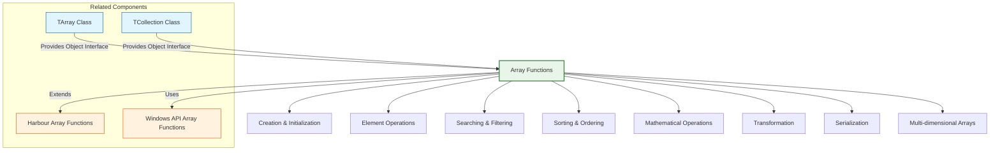

# Array Functions

The FiveWin array functions provide a comprehensive library for array manipulation and operations, extending the standard Harbour array capabilities. These functions cover areas such as array creation, manipulation, searching, sorting, and advanced operations.

**Source Files:** [source/function/arrays.prg](../../../source/function/arrays.prg), [source/function/matrices.prg](../../../source/function/matrices.prg)

## Overview

The array function library in FiveWin offers enhanced array handling capabilities that complement the standard Harbour array functions. These functions cover areas such as:

* Array creation and initialization
* Element manipulation and transformation
* Searching and filtering operations
* Sorting and ordering
* Mathematical array operations
* Multi-dimensional array support
* Array serialization and deserialization
* Performance-optimized array operations

These functions are designed to make array operations more intuitive, efficient, and powerful for FiveWin developers.

## Function Categories



## Creation & Initialization Functions

| Function | Description | Parameters |
|----------|-------------|------------|
| `ArrayCreate(nSize, uInitValue)` | Creates array with optional initialization | `nSize`: Array size, `uInitValue`: Initial value |
| `ArrayFill(aArray, uValue)` | Fills array with specified value | `aArray`: Target array, `uValue`: Fill value |
| `ArraySequence(nStart, nEnd, nStep)` | Creates array with sequential values | `nStart`, `nEnd`, `nStep`: Sequence parameters |
| `ArrayRandom(nSize, nMin, nMax)` | Creates array with random values | `nSize`: Size, `nMin`, `nMax`: Value range |
| `ArrayClone(aSource)` | Creates deep copy of array | `aSource`: Source array |
| `ArrayFromCSV(cCSV)` | Creates array from CSV string | `cCSV`: CSV string |
| `ArrayFromFile(cFileName)` | Creates array from file content | `cFileName`: File path |

### Usage Examples

```harbour
#include "FiveWin.ch"

function Main()
   ? "Array Creation and Initialization Demo:"
   
   // Basic array creation
   BasicArrayCreationDemo()
   
   // Array filling
   ArrayFillDemo()
   
   // Sequential arrays
   SequentialArrayDemo()
   
   // Random arrays
   RandomArrayDemo()
   
   // Array cloning
   ArrayCloneDemo()
   
   // CSV arrays
   CSVArrayDemo()
   
return nil

static function BasicArrayCreationDemo()
   ? "Basic Array Creation:"
   ? Replicate( "-", 40 )
   
   // Create empty array
   local aEmpty := Array( 5 )
   ? "Empty Array (size 5): " + hb_ValToStr( aEmpty )
   
   // Create initialized array
   local aInitialized := ArrayCreate( 5, 0 )
   ? "Initialized Array: " + hb_ValToStr( aInitialized )
   
   // Create array with specific values
   local aSpecific := { "Apple", "Banana", "Cherry", "Date", "Elderberry" }
   ? "Specific Values: " + hb_ValToStr( aSpecific )
   
   // Create array from string tokens
   local cSentence := "The quick brown fox jumps over the lazy dog"
   local aWords := hb_aTokens( cSentence, " " )
   ? "Words from sentence: " + hb_ValToStr( aWords )
   
return nil

static function ArrayCreate( nSize, uInitValue )
   DEFAULT nSize := 0
   local aArray := Array( nSize )
   
   if uInitValue != nil
      AFill( aArray, uInitValue )
   endif
   
   return aArray
   
return {}

static function ArrayFillDemo()
   ? "Array Filling:"
   ? Replicate( "-", 40 )
   
   // Create array
   local aArray := Array( 10 )
   ? "Empty Array: " + hb_ValToStr( aArray )
   
   // Fill with zeros
   ArrayFill( aArray, 0 )
   ? "Filled with 0: " + hb_ValToStr( aArray )
   
   // Fill with string
   ArrayFill( aArray, "X" )
   ? "Filled with 'X': " + hb_ValToStr( aArray )
   
   // Fill with incrementing numbers
   ArrayFillIncrement( aArray )
   ? "Incrementing fill: " + hb_ValToStr( aArray )
   
return nil

static function ArrayFill( aArray, uValue )
   DEFAULT aArray := {}
   
   for local i := 1 to Len( aArray )
      aArray[i] := uValue
   next
   
   return aArray
   
return aArray

static function ArrayFillIncrement( aArray )
   for local i := 1 to Len( aArray )
      aArray[i] := i
   next
   
   return aArray
   
return aArray

static function SequentialArrayDemo()
   ? "Sequential Arrays:"
   ? Replicate( "-", 40 )
   
   // Simple sequence
   local aSimple := ArraySequence( 1, 10, 1 )
   ? "Simple 1-10: " + hb_ValToStr( aSimple )
   
   // Even numbers
   local aEven := ArraySequence( 2, 20, 2 )
   ? "Even 2-20: " + hb_ValToStr( aEven )
   
   // Countdown
   local aReverse := ArraySequence( 10, 1, -1 )
   ? "Countdown 10-1: " + hb_ValToStr( aReverse )
   
   // Decimal sequence
   local aDecimal := ArraySequence( 0.0, 1.0, 0.1 )
   ? "Decimal 0.0-1.0 (0.1): " + hb_ValToStr( aDecimal )
   
return nil

static function ArraySequence( nStart, nEnd, nStep )
   DEFAULT nStart := 1
   DEFAULT nEnd := 10
   DEFAULT nStep := 1
   
   local aSequence := {}
   local nCurrent := nStart
   
   if nStep > 0
      while nCurrent <= nEnd
         AAdd( aSequence, nCurrent )
         nCurrent += nStep
      enddo
   elseif nStep < 0
      while nCurrent >= nEnd
         AAdd( aSequence, nCurrent )
         nCurrent += nStep
      enddo
   else
      // nStep == 0, return array with start value
      AAdd( aSequence, nStart )
   endif
   
   return aSequence
   
return {}

static function RandomArrayDemo()
   ? "Random Arrays:"
   ? Replicate( "-", 40 )
   
   // Random integers
   local aRandomInt := ArrayRandom( 10, 1, 100 )
   ? "Random Integers (1-100): " + hb_ValToStr( aRandomInt )
   
   // Random decimals
   local aRandomDec := ArrayRandom( 5, 0.0, 1.0 )
   ? "Random Decimals (0.0-1.0): " + hb_ValToStr( aRandomDec )
   
   // Random with different distributions
   RandomDistributionDemo()
   
return nil

static function ArrayRandom( nSize, nMin, nMax )
   DEFAULT nSize := 10
   DEFAULT nMin := 0
   DEFAULT nMax := 100
   
   local aRandom := Array( nSize )
   
   for local i := 1 to nSize
      if ValType( nMin ) == "N" .and. ValType( nMax ) == "N"
         // Numeric range
         aRandom[i] := RandomInt( nMin, nMax )
      else
         // Mixed types or default
         aRandom[i] := RandomValue( nMin, nMax )
      endif
   next
   
   return aRandom
   
return {}

static function RandomInt( nMin, nMax )
   return Int( Random() * ( nMax - nMin + 1 ) ) + nMin
   
return nMin

static function RandomValue( uMin, uMax )
   // For mixed types, return random selection
   if ValType( uMin ) == "C" .and. ValType( uMax ) == "C"
      // String range
      return uMin + hb_ntos( RandomInt( 1, 100 ) )
   else
      // Default to numeric
      return RandomInt( 1, 1000 )
   endif
   
return 0

static function RandomDistributionDemo()
   ? "Random Distributions:"
   
   // Normal distribution approximation
   local aNormal := ArrayNormal( 20, 50, 10 )  // Mean=50, StdDev=10
   ? "Normal Distribution (mean=50, std=10): " + hb_ValToStr( aNormal )
   
   // Exponential distribution
   local aExponential := ArrayExponential( 15, 2.0 )
   ? "Exponential Distribution (lambda=2.0): " + hb_ValToStr( aExponential )
   
   // Custom weighted distribution
   WeightedRandomDemo()
   
return nil

static function ArrayNormal( nSize, nMean, nStdDev )
   DEFAULT nSize := 10
   DEFAULT nMean := 0
   DEFAULT nStdDev := 1
   
   local aNormal := Array( nSize )
   
   for local i := 1 to nSize
      aNormal[i] := RandomNormal( nMean, nStdDev )
   next
   
   return aNormal
   
return {}

static function RandomNormal( nMean, nStdDev )
   // Box-Muller transform for normal distribution
   local u1 := Random()
   local u2 := Random()
   
   // Avoid log(0)
   if u1 == 0
      u1 := 1e-10
   endif
   
   local z0 := Sqrt( -2 * Log( u1 ) ) * Cos( 2 * Pi() * u2 )
   
   return nMean + ( nStdDev * z0 )
   
return nMean

static function ArrayExponential( nSize, nLambda )
   DEFAULT nSize := 10
   DEFAULT nLambda := 1.0
   
   local aExponential := Array( nSize )
   
   for local i := 1 to nSize
      aExponential[i] := RandomExponential( nLambda )
   next
   
   return aExponential
   
return {}

static function RandomExponential( nLambda )
   local u := Random()
   if u == 0
      u := 1e-10  // Avoid division by zero
   endif
   
   return -Log( u ) / nLambda
   
return 0

static function WeightedRandomDemo()
   ? "Weighted Random Selection:"
   
   local aItems := { "A", "B", "C", "D", "E" }
   local aWeights := { 10, 30, 20, 25, 15 }  // Percentages
   
   ? "Items: " + hb_ValToStr( aItems )
   ? "Weights: " + hb_ValToStr( aWeights )
   
   // Generate weighted random samples
   local aSamples := {}
   for local i := 1 to 20
      AAdd( aSamples, WeightedRandom( aItems, aWeights ) )
   next
   
   ? "Weighted Samples: " + hb_ValToStr( aSamples )
   
return nil

static function WeightedRandom( aItems, aWeights )
   DEFAULT aItems := {}
   DEFAULT aWeights := {}
   
   if Empty( aItems ) .or. Empty( aWeights )
      return nil
   endif
   
   // Calculate total weight
   local nTotalWeight := 0
   for local i := 1 to Len( aWeights )
      nTotalWeight += aWeights[i]
   next
   
   if nTotalWeight <= 0
      return nil
   endif
   
   // Generate random value
   local nRandomValue := Random() * nTotalWeight
   local nCumulative := 0
   
   // Find selected item
   for local i := 1 to Len( aItems )
      nCumulative += aWeights[i]
      if nRandomValue <= nCumulative
         return aItems[i]
      endif
   next
   
   return aItems[ Len( aItems ) ]  // Fallback to last item
   
return nil

static function ArrayCloneDemo()
   ? "Array Cloning:"
   ? Replicate( "-", 40 )
   
   // Create original array
   local aOriginal := { 1, 2, { 3, 4 }, 5 }
   ? "Original: " + hb_ValToStr( aOriginal )
   
   // Shallow copy
   local aShallow := aClone( aOriginal )
   ? "Shallow Copy: " + hb_ValToStr( aShallow )
   
   // Deep copy
   local aDeep := ArrayClone( aOriginal )
   ? "Deep Copy: " + hb_ValToStr( aDeep )
   
   // Modify original
   aOriginal[1] := 99
   aOriginal[3][1] := 99
   
   ? "After modifying original:"
   ? "  Original: " + hb_ValToStr( aOriginal )
   ? "  Shallow: " + hb_ValToStr( aShallow )
   ? "  Deep: " + hb_ValToStr( aDeep )
   
return nil

static function ArrayClone( aSource )
   DEFAULT aSource := {}
   
   local aClone := Array( Len( aSource ) )
   
   for local i := 1 to Len( aSource )
      local uItem := aSource[i]
      if ValType( uItem ) == "A"
         // Recursively clone nested arrays
         aClone[i] := ArrayClone( uItem )
      else
         // Copy scalar values
         aClone[i] := uItem
      endif
   next
   
   return aClone
   
return {}

static function CSVArrayDemo()
   ? "CSV Arrays:"
   ? Replicate( "-", 40 )
   
   // Create CSV data
   local cCSV := "Name,Age,City,Salary" + hb_osNewLine() + ;
                "John,30,New York,50000" + hb_osNewLine() + ;
                "Jane,25,Los Angeles,45000" + hb_osNewLine() + ;
                "Bob,35,Chicago,55000"
   
   ? "CSV Data:"
   ? cCSV
   
   // Parse CSV
   local aCSVArray := ArrayFromCSV( cCSV )
   ? "Parsed CSV Array: " + hb_ValToStr( aCSVArray )
   
   // Create CSV from array
   local aData := { ;
      { "Alice", 28, "Houston", 48000 }, ;
      { "Charlie", 32, "Phoenix", 52000 }, ;
      { "Diana", 27, "Philadelphia", 47000 } ;
   }
   
   local cNewCSV := ArrayToCSV( aData, { "Name", "Age", "City", "Salary" } )
   ? "Generated CSV from Array:"
   ? cNewCSV
   
return nil

static function ArrayFromCSV( cCSV )
   DEFAULT cCSV := ""
   
   if Empty( cCSV )
      return {}
   endif
   
   local aLines := hb_aTokens( cCSV, hb_osNewLine() )
   local aArray := {}
   
   for local i := 1 to Len( aLines )
      local cLine := aLines[i]
      if !Empty( cLine )
         local aFields := hb_aTokens( cLine, "," )
         AAdd( aArray, aFields )
      endif
   next
   
   return aArray
   
return {}

static function ArrayToCSV( aData, aHeaders )
   DEFAULT aData := {}
   DEFAULT aHeaders := {}
   
   local cCSV := ""
   
   // Add headers if provided
   if !Empty( aHeaders )
      cCSV += hb_Join( aHeaders, "," ) + hb_osNewLine()
   endif
   
   // Add data rows
   for local i := 1 to Len( aData )
      local uRow := aData[i]
      if ValType( uRow ) == "A"
         cCSV += hb_Join( uRow, "," ) + hb_osNewLine()
      else
         cCSV += hb_ntos( uRow ) + hb_osNewLine()
      endif
   next
   
   return cCSV
   
return ""

static function ArrayFromFileDemo()
   ? "Arrays from Files:"
   ? Replicate( "-", 40 )
   
   // Create test file
   local cFileName := "test_array.txt"
   local aTestData := { "Line 1", "Line 2", "Line 3", "Line 4", "Line 5" }
   
   local nHandle := FCreate( cFileName )
   if nHandle != -1
      for local i := 1 to Len( aTestData )
         FWriteLine( nHandle, aTestData[i] )
      next
      FClose( nHandle )
      
      ? "Test file created: " + cFileName
      
      // Read array from file
      local aFromFile := ArrayFromFile( cFileName )
      ? "Array from file: " + hb_ValToStr( aFromFile )
      
      // Clean up
      FErase( cFileName )
      
   else
      ? "Failed to create test file"
   endif
   
return nil

static function ArrayFromFile( cFileName )
   DEFAULT cFileName := ""
   
   if Empty( cFileName ) .or. !File( cFileName )
      return {}
   endif
   
   local nHandle := FOpen( cFileName, FO_READ )
   if nHandle == -1
      return {}
   endif
   
   local aArray := {}
   local cLine := ""
   
   while !FEof( nHandle )
      cLine := FReadLine( nHandle )
      if !Empty( cLine )
         // Remove carriage return/line feed
         cLine := TrimLineEndings( cLine )
         AAdd( aArray, cLine )
      endif
   enddo
   
   FClose( nHandle )
   
   return aArray
   
return {}

static function TrimLineEndings( cLine )
   // Remove carriage return and line feed characters
   while Right( cLine, 1 ) $ Chr( 13 ) + Chr( 10 )
      cLine := Left( cLine, Len( cLine ) - 1 )
   enddo
   
   return cLine
   
return cLine

static function AdvancedArrayCreationDemo()
   ? "Advanced Array Creation:"
   ? Replicate( "-", 40 )
   
   // Create array with function evaluation
   local aFunction := ArrayFromFunction( 10, { |n| n * n } )
   ? "Square Numbers: " + hb_ValToStr( aFunction )
   
   // Create array with conditional values
   local aConditional := ArrayFromCondition( 20, { |n| n % 2 == 0 }, "EVEN", "ODD" )
   ? "Even/Odd Pattern: " + hb_ValToStr( aConditional )
   
   // Create sparse array
   local aSparse := SparseArray( 100, 5, "X" )
   ? "Sparse Array (size=100, 5 elements='X'): " + hb_ValToStr( aSparse )
   
return nil

static function ArrayFromFunction( nSize, bFunction )
   DEFAULT nSize := 10
   DEFAULT bFunction := { |n| n }
   
   local aArray := Array( nSize )
   
   for local i := 1 to nSize
      aArray[i] := Eval( bFunction, i )
   next
   
   return aArray
   
return {}

static function ArrayFromCondition( nSize, bCondition, uTrueValue, uFalseValue )
   DEFAULT nSize := 10
   DEFAULT bCondition := { |n| .T. }
   DEFAULT uTrueValue := .T.
   DEFAULT uFalseValue := .F.
   
   local aArray := Array( nSize )
   
   for local i := 1 to nSize
      if Eval( bCondition, i )
         aArray[i] := uTrueValue
      else
         aArray[i] := uFalseValue
      endif
   next
   
   return aArray
   
return {}

static function SparseArray( nSize, nElements, uValue )
   DEFAULT nSize := 100
   DEFAULT nElements := 10
   DEFAULT uValue := 0
   
   local aArray := Array( nSize )
   AFill( aArray, nil )  // Initialize with nil values
   
   // Place elements randomly
   for local i := 1 to nElements
      local nPosition := RandomInt( 1, nSize )
      aArray[nPosition] := uValue
   next
   
   return aArray
   
return {}

static function Pi()
   return 3.14159265358979323846
   
return 3.141592653589793
```

## Element Operations

| Function | Description | Parameters |
|----------|-------------|------------|
| `ArrayGet(aArray, nIndex)` | Safely gets element from array | `aArray`: Array, `nIndex`: Index |
| `ArraySet(aArray, nIndex, uValue)` | Safely sets element in array | `aArray`: Array, `nIndex`: Index, `uValue`: Value |
| `ArrayAppend(aArray, uValue)` | Appends element to array | `aArray`: Array, `uValue`: Value |
| `ArrayPrepend(aArray, uValue)` | Prepends element to array | `aArray`: Array, `uValue`: Value |
| `ArrayInsert(aArray, nIndex, uValue)` | Inserts element at position | `aArray`: Array, `nIndex`: Position, `uValue`: Value |
| `ArrayDelete(aArray, nIndex)` | Deletes element at position | `aArray`: Array, `nIndex`: Position |
| `ArrayRemove(aArray, uValue)` | Removes first occurrence of value | `aArray`: Array, `uValue`: Value to remove |
| `ArrayClear(aArray)` | Clears all elements from array | `aArray`: Array to clear |

### Usage Examples

```harbour
#include "FiveWin.ch"

function Main()
   ? "Array Element Operations Demo:"
   
   // Safe array operations
   SafeArrayOperationsDemo()
   
   // Insert and delete operations
   InsertDeleteDemo()
   
   // Append and prepend operations
   AppendPrependDemo()
   
   // Remove operations
   RemoveDemo()
   
   // Array clearing
   ArrayClearDemo()
   
   // Batch operations
   BatchOperationsDemo()
   
return nil

static function SafeArrayOperationsDemo()
   ? "Safe Array Operations:"
   ? Replicate( "-", 40 )
   
   // Create test array
   local aArray := { "A", "B", "C", "D", "E" }
   ? "Original Array: " + hb_ValToStr( aArray )
   
   // Safe get operations
   ? "Safe Get Operations:"
   ? "  Index 3: " + hb_ValToStr( ArrayGet( aArray, 3 ) )
   ? "  Index 10: " + hb_ValToStr( ArrayGet( aArray, 10, "OUT_OF_BOUNDS" ) )
   ? "  Index -1: " + hb_ValToStr( ArrayGet( aArray, -1, "INVALID_INDEX" ) )
   
   // Safe set operations
   ? "Safe Set Operations:"
   ArraySet( aArray, 2, "BBB" )
   ? "  Set index 2 to 'BBB': " + hb_ValToStr( aArray )
   
   ArraySet( aArray, 10, "XXX" )  // Should not modify array
   ? "  Attempt set index 10: " + hb_ValToStr( aArray )
   
return nil

static function ArrayGet( aArray, nIndex, uDefault )
   DEFAULT aArray := {}
   DEFAULT nIndex := 1
   DEFAULT uDefault := nil
   
   if nIndex >= 1 .and. nIndex <= Len( aArray )
      return aArray[nIndex]
   else
      return uDefault
   endif
   
return uDefault

static function ArraySet( aArray, nIndex, uValue )
   DEFAULT aArray := {}
   DEFAULT nIndex := 1
   
   if nIndex >= 1 .and. nIndex <= Len( aArray )
      aArray[nIndex] := uValue
      return .T.
   else
      return .F.
   endif
   
return .F.

static function InsertDeleteDemo()
   ? "Insert and Delete Operations:"
   ? Replicate( "-", 40 )
   
   // Create test array
   local aArray := { "A", "B", "C", "D" }
   ? "Original Array: " + hb_ValToStr( aArray )
   
   // Insert operations
   ArrayInsert( aArray, 2, "INSERTED" )
   ? "After inserting at index 2: " + hb_ValToStr( aArray )
   
   ArrayInsert( aArray, 1, "FIRST" )
   ? "After inserting at index 1: " + hb_ValToStr( aArray )
   
   ArrayInsert( aArray, 100, "LAST" )  // Insert at end
   ? "After inserting at end: " + hb_ValToStr( aArray )
   
   // Delete operations
   ArrayDelete( aArray, 3 )
   ? "After deleting index 3: " + hb_ValToStr( aArray )
   
   ArrayDelete( aArray, 100 )  // Out of bounds
   ? "After deleting out of bounds: " + hb_ValToStr( aArray )
   
return nil

static function ArrayInsert( aArray, nIndex, uValue )
   DEFAULT aArray := {}
   DEFAULT nIndex := 1
   DEFAULT uValue := nil
   
   if Empty( aArray )
      AAdd( aArray, uValue )
      return aArray
   endif
   
   // Clamp index to valid range
   nIndex := Max( 1, Min( nIndex, Len( aArray ) + 1 ) )
   
   // Insert by shifting elements
   ASize( aArray, Len( aArray ) + 1 )
   
   // Shift elements right
   for local i := Len( aArray ) to nIndex + 1 step -1
      aArray[i] := aArray[i - 1]
   next
   
   // Insert new element
   aArray[nIndex] := uValue
   
   return aArray
   
return aArray

static function ArrayDelete( aArray, nIndex )
   DEFAULT aArray := {}
   DEFAULT nIndex := 1
   
   if nIndex < 1 .or. nIndex > Len( aArray )
      return aArray
   endif
   
   // Shift elements left
   for local i := nIndex to Len( aArray ) - 1
      aArray[i] := aArray[i + 1]
   next
   
   // Reduce array size
   ASize( aArray, Len( aArray ) - 1 )
   
   return aArray
   
return aArray

static function AppendPrependDemo()
   ? "Append and Prepend Operations:"
   ? Replicate( "-", 40 )
   
   // Create test array
   local aArray := { "B", "C", "D" }
   ? "Original Array: " + hb_ValToStr( aArray )
   
   // Append operations
   ArrayAppend( aArray, "E" )
   ? "After append 'E': " + hb_ValToStr( aArray )
   
   ArrayAppend( aArray, "F" )
   ? "After append 'F': " + hb_ValToStr( aArray )
   
   // Prepend operations
   ArrayPrepend( aArray, "A" )
   ? "After prepend 'A': " + hb_ValToStr( aArray )
   
   ArrayPrepend( aArray, "Z" )
   ? "After prepend 'Z': " + hb_ValToStr( aArray )
   
return nil

static function ArrayAppend( aArray, uValue )
   DEFAULT aArray := {}
   
   AAdd( aArray, uValue )
   
   return aArray
   
return aArray

static function ArrayPrepend( aArray, uValue )
   DEFAULT aArray := {}
   
   if Empty( aArray )
      AAdd( aArray, uValue )
   else
      ArrayInsert( aArray, 1, uValue )
   endif
   
   return aArray
   
return aArray

static function RemoveDemo()
   ? "Remove Operations:"
   ? Replicate( "-", 40 )
   
   // Create test array with duplicates
   local aArray := { "A", "B", "C", "B", "D", "B", "E" }
   ? "Original Array: " + hb_ValToStr( aArray )
   
   // Remove first occurrence
   ArrayRemove( aArray, "B" )
   ? "After removing first 'B': " + hb_ValToStr( aArray )
   
   // Remove all occurrences
   ArrayRemoveAll( aArray, "B" )
   ? "After removing all 'B': " + hb_ValToStr( aArray )
   
   // Remove by condition
   local aNumbers := { 1, 2, 3, 4, 5, 6, 7, 8, 9, 10 }
   ? "Number Array: " + hb_ValToStr( aNumbers )
   
   ArrayRemoveByCondition( aNumbers, { |n| n % 2 == 0 } )  // Remove even numbers
   ? "After removing even numbers: " + hb_ValToStr( aNumbers )
   
return nil

static function ArrayRemove( aArray, uValue )
   DEFAULT aArray := {}
   
   local nIndex := AScan( aArray, { |x| x == uValue } )
   
   if nIndex > 0
      ArrayDelete( aArray, nIndex )
   endif
   
   return aArray
   
return aArray

static function ArrayRemoveAll( aArray, uValue )
   DEFAULT aArray := {}
   
   for local i := Len( aArray ) to 1 step -1
      if aArray[i] == uValue
         ArrayDelete( aArray, i )
      endif
   next
   
   return aArray
   
return aArray

static function ArrayRemoveByCondition( aArray, bCondition )
   DEFAULT aArray := {}
   DEFAULT bCondition := { |x| .F. }
   
   for local i := Len( aArray ) to 1 step -1
      if Eval( bCondition, aArray[i] )
         ArrayDelete( aArray, i )
      endif
   next
   
   return aArray
   
return aArray

static function ArrayClearDemo()
   ? "Array Clearing Operations:"
   ? Replicate( "-", 40 )
   
   // Create test array
   local aArray := { "A", "B", "C", "D", "E" }
   ? "Original Array: " + hb_ValToStr( aArray )
   ? "Array Length: " + hb_ntos( Len( aArray ) )
   
   // Clear array
   ArrayClear( aArray )
   ? "After Clear: " + hb_ValToStr( aArray )
   ? "Array Length: " + hb_ntos( Len( aArray ) )
   
   // Reinitialize
   AAdd( aArray, "New" )
   AAdd( aArray, "Elements" )
   ? "After Adding Elements: " + hb_ValToStr( aArray )
   
return nil

static function ArrayClear( aArray )
   DEFAULT aArray := {}
   
   ASize( aArray, 0 )
   
   return aArray
   
return aArray

static function BatchOperationsDemo()
   ? "Batch Operations:"
   ? Replicate( "-", 40 )
   
   // Batch append
   local aArray := {}
   ArrayBatchAppend( aArray, { "A", "B", "C", "D" } )
   ? "After Batch Append: " + hb_ValToStr( aArray )
   
   // Batch insert
   ArrayBatchInsert( aArray, 2, { "X", "Y", "Z" } )
   ? "After Batch Insert: " + hb_ValToStr( aArray )
   
   // Batch remove
   ArrayBatchRemove( aArray, { "B", "Y" } )
   ? "After Batch Remove: " + hb_ValToStr( aArray )
   
return nil

static function ArrayBatchAppend( aArray, aValues )
   DEFAULT aArray := {}
   DEFAULT aValues := {}
   
   for local i := 1 to Len( aValues )
      AAdd( aArray, aValues[i] )
   next
   
   return aArray
   
return aArray

static function ArrayBatchInsert( aArray, nIndex, aValues )
   DEFAULT aArray := {}
   DEFAULT nIndex := 1
   DEFAULT aValues := {}
   
   for local i := 1 to Len( aValues )
      ArrayInsert( aArray, nIndex + i - 1, aValues[i] )
   next
   
   return aArray
   
return aArray

static function ArrayBatchRemove( aArray, aValues )
   DEFAULT aArray := {}
   DEFAULT aValues := {}
   
   for local i := 1 to Len( aValues )
      ArrayRemove( aArray, aValues[i] )
   next
   
   return aArray
   
return aArray

static function ArrayElementSwapDemo()
   ? "Element Swapping:"
   ? Replicate( "-", 40 )
   
   local aArray := { "A", "B", "C", "D", "E" }
   ? "Original Array: " + hb_ValToStr( aArray )
   
   // Swap elements
   ArraySwap( aArray, 1, 5 )
   ? "After swapping 1 and 5: " + hb_ValToStr( aArray )
   
   ArraySwap( aArray, 2, 4 )
   ? "After swapping 2 and 4: " + hb_ValToStr( aArray )
   
return nil

static function ArraySwap( aArray, nIndex1, nIndex2 )
   DEFAULT aArray := {}
   DEFAULT nIndex1 := 1
   DEFAULT nIndex2 := 2
   
   if nIndex1 >= 1 .and. nIndex1 <= Len( aArray ) .and. ;
      nIndex2 >= 1 .and. nIndex2 <= Len( aArray ) .and. ;
      nIndex1 != nIndex2
      
      local uTemp := aArray[nIndex1]
      aArray[nIndex1] := aArray[nIndex2]
      aArray[nIndex2] := uTemp
   endif
   
   return aArray
   
return aArray

static function ArrayMoveDemo()
   ? "Element Moving:"
   ? Replicate( "-", 40 )
   
   local aArray := { "A", "B", "C", "D", "E" }
   ? "Original Array: " + hb_ValToStr( aArray )
   
   // Move element from position 1 to position 5
   ArrayMove( aArray, 1, 5 )
   ? "After moving 1 to 5: " + hb_ValToStr( aArray )
   
   // Move element from position 5 to position 2
   ArrayMove( aArray, 5, 2 )
   ? "After moving 5 to 2: " + hb_ValToStr( aArray )
   
return nil

static function ArrayMove( aArray, nIndexFrom, nIndexTo )
   DEFAULT aArray := {}
   DEFAULT nIndexFrom := 1
   DEFAULT nIndexTo := 1
   
   if nIndexFrom < 1 .or. nIndexFrom > Len( aArray ) .or. ;
      nIndexTo < 1 .or. nIndexTo > Len( aArray ) .or. ;
      nIndexFrom == nIndexTo
      return aArray
   endif
   
   local uValue := aArray[nIndexFrom]
   
   if nIndexFrom < nIndexTo
      // Move towards end - shift elements left
      for local i := nIndexFrom to nIndexTo - 1
         aArray[i] := aArray[i + 1]
      next
   else
      // Move towards beginning - shift elements right
      for local i := nIndexFrom to nIndexTo + 1 step -1
         aArray[i] := aArray[i - 1]
      next
   endif
   
   aArray[nIndexTo] := uValue
   
   return aArray
   
return aArray

static function ArrayRotateDemo()
   ? "Array Rotation:"
   ? Replicate( "-", 40 )
   
   local aArray := { "A", "B", "C", "D", "E" }
   ? "Original Array: " + hb_ValToStr( aArray )
   
   // Rotate right by 2 positions
   ArrayRotate( aArray, 2 )
   ? "Rotated right by 2: " + hb_ValToStr( aArray )
   
   // Rotate left by 1 position
   ArrayRotate( aArray, -1 )
   ? "Rotated left by 1: " + hb_ValToStr( aArray )
   
return nil

static function ArrayRotate( aArray, nPositions )
   DEFAULT aArray := {}
   DEFAULT nPositions := 0
   
   if Empty( aArray ) .or. nPositions == 0
      return aArray
   endif
   
   local nLength := Len( aArray )
   local nEffectivePos := nPositions % nLength
   
   if nEffectivePos == 0
      return aArray
   endif
   
   if nEffectivePos > 0
      // Rotate right
      local aTemp := Array( nEffectivePos )
      for local i := 1 to nEffectivePos
         aTemp[i] := aArray[nLength - nEffectivePos + i]
      next
      
      for local i := nLength to nEffectivePos + 1 step -1
         aArray[i] := aArray[i - nEffectivePos]
      next
      
      for local i := 1 to nEffectivePos
         aArray[i] := aTemp[i]
      next
      
   else
      // Rotate left
      local nAbsPos := Abs( nEffectivePos )
      local aTemp := Array( nAbsPos )
      for local i := 1 to nAbsPos
         aTemp[i] := aArray[i]
      next
      
      for local i := 1 to nLength - nAbsPos
         aArray[i] := aArray[i + nAbsPos]
      next
      
      for local i := 1 to nAbsPos
         aArray[nLength - nAbsPos + i] := aTemp[i]
      next
   endif
   
   return aArray
   
return aArray

static function ArrayReverseDemo()
   ? "Array Reversal:"
   ? Replicate( "-", 40 )
   
   local aArray := { "A", "B", "C", "D", "E" }
   ? "Original Array: " + hb_ValToStr( aArray )
   
   ArrayReverse( aArray )
   ? "Reversed Array: " + hb_ValToStr( aArray )
   
   ArrayReverse( aArray )  // Reverse again to get original
   ? "Reversed Again: " + hb_ValToStr( aArray )
   
return nil

static function ArrayReverse( aArray )
   DEFAULT aArray := {}
   
   local nLength := Len( aArray )
   local nMid := Int( nLength / 2 )
   
   for local i := 1 to nMid
      local uTemp := aArray[i]
      aArray[i] := aArray[nLength - i + 1]
      aArray[nLength - i + 1] := uTemp
   next
   
   return aArray
   
return aArray

static function ArrayShuffleDemo()
   ? "Array Shuffling:"
   ? Replicate( "-", 40 )
   
   local aArray := { "A", "B", "C", "D", "E", "F", "G", "H", "I", "J" }
   ? "Original Array: " + hb_ValToStr( aArray )
   
   ArrayShuffle( aArray )
   ? "Shuffled Array: " + hb_ValToStr( aArray )
   
   ArrayShuffle( aArray )
   ? "Shuffled Again: " + hb_ValToStr( aArray )
   
return nil

static function ArrayShuffle( aArray )
   DEFAULT aArray := {}
   
   local nLength := Len( aArray )
   
   for local i := nLength to 2 step -1
      local j := RandomInt( 1, i )
      local uTemp := aArray[i]
      aArray[i] := aArray[j]
      aArray[j] := uTemp
   next
   
   return aArray
   
return aArray

static function ArrayUniqueDemo()
   ? "Array Uniqueness:"
   ? Replicate( "-", 40 )
   
   local aArray := { "A", "B", "C", "B", "D", "A", "E", "C", "F" }
   ? "Original Array: " + hb_ValToStr( aArray )
   
   local aUnique := ArrayUnique( aArray )
   ? "Unique Elements: " + hb_ValToStr( aUnique )
   
   // Get duplicate elements
   local aDuplicates := ArrayDuplicates( aArray )
   ? "Duplicate Elements: " + hb_ValToStr( aDuplicates )
   
return nil

static function ArrayUnique( aArray )
   DEFAULT aArray := {}
   
   local aUnique := {}
   local aSeen := {}
   
   for local i := 1 to Len( aArray )
      local uValue := aArray[i]
      local cValueStr := hb_ValToStr( uValue )
      
      if AScan( aSeen, cValueStr ) == 0
         AAdd( aUnique, uValue )
         AAdd( aSeen, cValueStr )
      endif
   next
   
   return aUnique
   
return {}

static function ArrayDuplicates( aArray )
   DEFAULT aArray := {}
   
   local aDuplicates := {}
   local aCounts := {}
   
   // Count occurrences
   for local i := 1 to Len( aArray )
      local uValue := aArray[i]
      local cValueStr := hb_ValToStr( uValue )
      local nIndex := AScan( aCounts, { |a| a[1] == cValueStr } )
      
      if nIndex > 0
         aCounts[nIndex][2]++
      else
         AAdd( aCounts, { cValueStr, 1 } )
      endif
   next
   
   // Extract duplicates
   for local i := 1 to Len( aCounts )
      if aCounts[i][2] > 1
         local nPos := AScan( aArray, { |x| hb_ValToStr( x ) == aCounts[i][1] } )
         if nPos > 0
            AAdd( aDuplicates, aArray[nPos] )
         endif
      endif
   next
   
   return aDuplicates
   
return {}

static function ArrayChunkDemo()
   ? "Array Chunking:"
   ? Replicate( "-", 40 )
   
   local aArray := { "A", "B", "C", "D", "E", "F", "G", "H", "I", "J", "K", "L" }
   ? "Original Array: " + hb_ValToStr( aArray )
   
   // Split into chunks of 3
   local aChunks := ArrayChunk( aArray, 3 )
   ? "Chunks of 3:"
   for local i := 1 to Len( aChunks )
      ? "  Chunk " + hb_ntos( i ) + ": " + hb_ValToStr( aChunks[i] )
   next
   
   // Split into 4 chunks
   local aFourChunks := ArraySplit( aArray, 4 )
   ? "Split into 4 chunks:"
   for local i := 1 to Len( aFourChunks )
      ? "  Part " + hb_ntos( i ) + ": " + hb_ValToStr( aFourChunks[i] )
   next
   
return nil

static function ArrayChunk( aArray, nChunkSize )
   DEFAULT aArray := {}
   DEFAULT nChunkSize := 1
   
   if nChunkSize <= 0
      return { aArray }  // Return as single chunk
   endif
   
   local aChunks := {}
   local nLength := Len( aArray )
   
   for local i := 1 to nLength step nChunkSize
      local nEnd := Min( i + nChunkSize - 1, nLength )
      local aChunk := Array( nEnd - i + 1 )
      
      for local j := 1 to Len( aChunk )
         aChunk[j] := aArray[i + j - 1]
      next
      
      AAdd( aChunks, aChunk )
   next
   
   return aChunks
   
return {}

static function ArraySplit( aArray, nParts )
   DEFAULT aArray := {}
   DEFAULT nParts := 1
   
   if nParts <= 0
      return { aArray }
   endif
   
   local nLength := Len( aArray )
   local nChunkSize := Int( nLength / nParts )
   local nRemainder := nLength % nParts
   
   local aPartsArray := {}
   local nStart := 1
   
   for local i := 1 to nParts
      local nCurrentChunk := nChunkSize
      if i <= nRemainder
         nCurrentChunk++
      endif
      
      local nEnd := nStart + nCurrentChunk - 1
      local aPart := Array( nCurrentChunk )
      
      for local j := 1 to Len( aPart )
         aPart[j] := aArray[nStart + j - 1]
      next
      
      AAdd( aPartsArray, aPart )
      nStart := nEnd + 1
   next
   
   return aPartsArray
   
return {}

static function ArrayFlattenDemo()
   ? "Array Flattening:"
   ? Replicate( "-", 40 )
   
   local aNested := { "A", { "B", "C" }, "D", { "E", { "F", "G" } }, "H" }
   ? "Nested Array: " + hb_ValToStr( aNested )
   
   local aFlattened := ArrayFlatten( aNested )
   ? "Flattened Array: " + hb_ValToStr( aFlattened )
   
   local aDeepNested := { { { 1, 2 }, { 3, 4 } }, { { 5, 6 }, { 7, 8 } } }
   ? "Deep Nested: " + hb_ValToStr( aDeepNested )
   
   local aDeepFlattened := ArrayFlatten( aDeepNested )
   ? "Deep Flattened: " + hb_ValToStr( aDeepFlattened )
   
return nil

static function ArrayFlatten( aArray )
   DEFAULT aArray := {}
   
   local aFlattened := {}
   
   for local i := 1 to Len( aArray )
      local uItem := aArray[i]
      
      if ValType( uItem ) == "A"
         // Recursively flatten nested arrays
         local aNestedFlat := ArrayFlatten( uItem )
         for local j := 1 to Len( aNestedFlat )
            AAdd( aFlattened, aNestedFlat[j] )
         next
      else
         AAdd( aFlattened, uItem )
      endif
   next
   
   return aFlattened
   
return {}

static function ArrayTransposeDemo()
   ? "Array Transposition:"
   ? Replicate( "-", 40 )
   
   local aMatrix := { ;
      { 1, 2, 3, 4 }, ;
      { 5, 6, 7, 8 }, ;
      { 9, 10, 11, 12 } ;
   }
   
   ? "Original Matrix:"
   for local i := 1 to Len( aMatrix )
      ? "  " + hb_ValToStr( aMatrix[i] )
   next
   
   local aTransposed := ArrayTranspose( aMatrix )
   ? "Transposed Matrix:"
   for local i := 1 to Len( aTransposed )
      ? "  " + hb_ValToStr( aTransposed[i] )
   next
   
return nil

static function ArrayTranspose( aMatrix )
   DEFAULT aMatrix := {}
   
   if Empty( aMatrix ) .or. Empty( aMatrix[1] )
      return {}
   endif
   
   local nRows := Len( aMatrix )
   local nCols := Len( aMatrix[1] )
   local aTransposed := Array( nCols, nRows )
   
   for local i := 1 to nRows
      for local j := 1 to nCols
         aTransposed[j][i] := aMatrix[i][j]
      next
   next
   
   return aTransposed
   
return {}

static function ArrayZipDemo()
   ? "Array Zipping:"
   ? Replicate( "-", 40 )
   
   local aNames := { "Alice", "Bob", "Charlie", "Diana" }
   local aAges := { 25, 30, 35, 28 }
   local aCities := { "New York", "Los Angeles", "Chicago", "Houston" }
   
   ? "Names: " + hb_ValToStr( aNames )
   ? "Ages: " + hb_ValToStr( aAges )
   ? "Cities: " + hb_ValToStr( aCities )
   
   local aZipped := ArrayZip( aNames, aAges, aCities )
   ? "Zipped Data:"
   for local i := 1 to Len( aZipped )
      ? "  " + hb_ValToStr( aZipped[i] )
   next
   
return nil

static function ArrayZip( ... )
   // Handle variable arguments
   local aArgs := hb_aParams()
   
   if Empty( aArgs )
      return {}
   endif
   
   // Find shortest array length
   local nMinLength := Len( aArgs[1] )
   for local i := 2 to Len( aArgs )
      nMinLength := Min( nMinLength, Len( aArgs[i] ) )
   next
   
   if nMinLength <= 0
      return {}
   endif
   
   // Create zipped array
   local aZipped := Array( nMinLength )
   
   for local i := 1 to nMinLength
      local aTuple := Array( Len( aArgs ) )
      for local j := 1 to Len( aArgs )
         aTuple[j] := aArgs[j][i]
      next
      aZipped[i] := aTuple
   next
   
   return aZipped
   
return {}

static function ArrayUnzipDemo()
   ? "Array Unzipping:"
   ? Replicate( "-", 40 )
   
   local aZipped := { ;
      { "Alice", 25, "New York" }, ;
      { "Bob", 30, "Los Angeles" }, ;
      { "Charlie", 35, "Chicago" }, ;
      { "Diana", 28, "Houston" } ;
   }
   
   ? "Zipped Data:"
   for local i := 1 to Len( aZipped )
      ? "  " + hb_ValToStr( aZipped[i] )
   next
   
   local aUnzipped := ArrayUnzip( aZipped )
   ? "Unzipped Data:"
   ? "  Names: " + hb_ValToStr( aUnzipped[1] )
   ? "  Ages: " + hb_ValToStr( aUnzipped[2] )
   ? "  Cities: " + hb_ValToStr( aUnzipped[3] )
   
return nil

static function ArrayUnzip( aZipped )
   DEFAULT aZipped := {}
   
   if Empty( aZipped ) .or. Empty( aZipped[1] )
      return {}
   endif
   
   local nTuples := Len( aZipped )
   local nElements := Len( aZipped[1] )
   local aUnzipped := Array( nElements )
   
   for local i := 1 to nElements
      aUnzipped[i] := Array( nTuples )
      for local j := 1 to nTuples
         aUnzipped[i][j] := aZipped[j][i]
      next
   next
   
   return aUnzipped
   
return {}

static function ArrayMapReduceDemo()
   ? "Map/Reduce Operations:"
   ? Replicate( "-", 40 )
   
   local aNumbers := ArraySequence( 1, 10, 1 )
   ? "Numbers: " + hb_ValToStr( aNumbers )
   
   // Map: Square each number
   local aSquared := ArrayMap( aNumbers, { |n| n * n } )
   ? "Squared: " + hb_ValToStr( aSquared )
   
   // Reduce: Sum all numbers
   local nSum := ArrayReduce( aNumbers, { |acc, n| acc + n }, 0 )
   ? "Sum: " + hb_ntos( nSum )
   
   // Reduce: Product of all numbers
   local nProduct := ArrayReduce( aNumbers, { |acc, n| acc * n }, 1 )
   ? "Product: " + hb_ntos( nProduct )
   
   // Map-Reduce: Sum of squares
   local nSumSquares := ArrayReduce( aSquared, { |acc, n| acc + n }, 0 )
   ? "Sum of Squares: " + hb_ntos( nSumSquares )
   
return nil

static function ArrayMap( aArray, bFunction )
   DEFAULT aArray := {}
   DEFAULT bFunction := { |x| x }
   
   local aMapped := Array( Len( aArray ) )
   
   for local i := 1 to Len( aArray )
      aMapped[i] := Eval( bFunction, aArray[i] )
   next
   
   return aMapped
   
return {}

static function ArrayReduce( aArray, bFunction, uInitial )
   DEFAULT aArray := {}
   DEFAULT bFunction := { |acc, x| acc + x }
   DEFAULT uInitial := 0
   
   local uAccumulator := uInitial
   
   for local i := 1 to Len( aArray )
      uAccumulator := Eval( bFunction, uAccumulator, aArray[i] )
   next
   
   return uAccumulator
   
return uInitial

static function ArrayFilterDemo()
   ? "Array Filtering:"
   ? Replicate( "-", 40 )
   
   local aNumbers := ArraySequence( 1, 20, 1 )
   ? "Numbers 1-20: " + hb_ValToStr( aNumbers )
   
   // Filter even numbers
   local aEven := ArrayFilter( aNumbers, { |n| n % 2 == 0 } )
   ? "Even Numbers: " + hb_ValToStr( aEven )
   
   // Filter odd numbers
   local aOdd := ArrayFilter( aNumbers, { |n| n % 2 == 1 } )
   ? "Odd Numbers: " + hb_ValToStr( aOdd )
   
   // Filter numbers > 10
   local aGreater10 := ArrayFilter( aNumbers, { |n| n > 10 } )
   ? "Numbers > 10: " + hb_ValToStr( aGreater10 )
   
   // Filter prime numbers
   local aPrimes := ArrayFilter( aNumbers, { |n| IsPrime( n ) } )
   ? "Prime Numbers: " + hb_ValToStr( aPrimes )
   
return nil

static function ArrayFilter( aArray, bCondition )
   DEFAULT aArray := {}
   DEFAULT bCondition := { |x| .T. }
   
   local aFiltered := {}
   
   for local i := 1 to Len( aArray )
      if Eval( bCondition, aArray[i] )
         AAdd( aFiltered, aArray[i] )
      endif
   next
   
   return aFiltered
   
return {}

static function IsPrime( nNumber )
   if nNumber < 2
      return .F.
   endif
   
   if nNumber == 2
      return .T.
   endif
   
   if nNumber % 2 == 0
      return .F.
   endif
   
   local nSqrt := Int( Sqrt( nNumber ) )
   for local i := 3 to nSqrt step 2
      if nNumber % i == 0
         return .F.
      endif
   next
   
   return .T.
   
return .F.

static function ArrayGroupDemo()
   ? "Array Grouping:"
   ? Replicate( "-", 40 )
   
   local aStudents := { ;
      { "Alice", 25, "A" }, ;
      { "Bob", 30, "B" }, ;
      { "Charlie", 25, "A" }, ;
      { "Diana", 28, "B" }, ;
      { "Eve", 30, "A" }, ;
      { "Frank", 28, "C" } ;
   }
   
   ? "Students Data:"
   for local i := 1 to Len( aStudents )
      ? "  " + hb_ValToStr( aStudents[i] )
   next
   
   // Group by age
   local aGroupedByAge := ArrayGroupBy( aStudents, { |a| a[2] } )
   ? "Grouped by Age:"
   for local i := 1 to Len( aGroupedByAge )
      local aGroup := aGroupedByAge[i]
      ? "  Age " + hb_ntos( aGroup[1] ) + ": " + hb_ValToStr( aGroup[2] )
   next
   
   // Group by grade
   local aGroupedByGrade := ArrayGroupBy( aStudents, { |a| a[3] } )
   ? "Grouped by Grade:"
   for local i := 1 to Len( aGroupedByGrade )
      local aGroup := aGroupedByGrade[i]
      ? "  Grade " + aGroup[1] + ": " + hb_ValToStr( aGroup[2] )
   next
   
return nil

static function ArrayGroupBy( aArray, bKeyFunction )
   DEFAULT aArray := {}
   DEFAULT bKeyFunction := { |x| x }
   
   local aGroups := {}
   
   for local i := 1 to Len( aArray )
      local uItem := aArray[i]
      local uKey := Eval( bKeyFunction, uItem )
      
      local nIndex := AScan( aGroups, { |a| a[1] == uKey } )
      
      if nIndex > 0
         AAdd( aGroups[nIndex][2], uItem )
      else
         AAdd( aGroups, { uKey, { uItem } } )
      endif
   next
   
   return aGroups
   
return {}

static function ArrayAggregateDemo()
   ? "Array Aggregation:"
   ? Replicate( "-", 40 )
   
   local aNumbers := ArraySequence( 1, 100, 1 )
   ? "Numbers 1-100: " + hb_ValToStr( aNumbers )
   
   // Basic aggregations
   local nSum := ArraySum( aNumbers )
   local nAvg := ArrayAvg( aNumbers )
   local nMin := ArrayMin( aNumbers )
   local nMax := ArrayMax( aNumbers )
   
   ? "Aggregations:"
   ? "  Sum: " + hb_ntos( nSum )
   ? "  Average: " + hb_ntos( nAvg, 2 )
   ? "  Min: " + hb_ntos( nMin )
   ? "  Max: " + hb_ntos( nMax )
   
   // Custom aggregation
   local nProduct := ArrayAggregate( aNumbers, { |acc, n| acc * n }, 1 )
   ? "  Product: " + hb_ntos( nProduct )
   
   // Statistical aggregations
   StatisticalArrayDemo( aNumbers )
   
return nil

static function ArraySum( aArray )
   DEFAULT aArray := {}
   
   local nSum := 0
   
   for local i := 1 to Len( aArray )
      local uValue := aArray[i]
      if ValType( uValue ) == "N"
         nSum += uValue
      endif
   next
   
   return nSum
   
return 0

static function ArrayAvg( aArray )
   DEFAULT aArray := {}
   
   if Empty( aArray )
      return 0
   endif
   
   local nSum := ArraySum( aArray )
   return nSum / Len( aArray )
   
return 0

static function ArrayMin( aArray )
   DEFAULT aArray := {}
   
   if Empty( aArray )
      return 0
   endif
   
   local uMin := aArray[1]
   
   for local i := 2 to Len( aArray )
      local uValue := aArray[i]
      if ValType( uValue ) == "N" .and. ValType( uMin ) == "N"
         if uValue < uMin
            uMin := uValue
         endif
      endif
   next
   
   return uMin
   
return aArray[1]

static function ArrayMax( aArray )
   DEFAULT aArray := {}
   
   if Empty( aArray )
      return 0
   endif
   
   local uMax := aArray[1]
   
   for local i := 2 to Len( aArray )
      local uValue := aArray[i]
      if ValType( uValue ) == "N" .and. ValType( uMax ) == "N"
         if uValue > uMax
            uMax := uValue
         endif
      endif
   next
   
   return uMax
   
return aArray[1]

static function ArrayAggregate( aArray, bFunction, uInitial )
   DEFAULT aArray := {}
   DEFAULT bFunction := { |acc, x| acc + x }
   DEFAULT uInitial := 0
   
   local uResult := uInitial
   
   for local i := 1 to Len( aArray )
      uResult := Eval( bFunction, uResult, aArray[i] )
   next
   
   return uResult
   
return uInitial

static function StatisticalArrayDemo( aNumbers )
   ? "Statistical Aggregations:"
   
   // Standard deviation
   local nStdDev := ArrayStdDev( aNumbers )
   ? "  Std Dev: " + hb_ntos( nStdDev, 2 )
   
   // Median
   local nMedian := ArrayMedian( aNumbers )
   ? "  Median: " + hb_ntos( nMedian, 2 )
   
   // Mode (most frequent value)
   local uMode := ArrayMode( aNumbers )
   ? "  Mode: " + hb_ValToStr( uMode )
   
   // Percentiles
   local n25th := ArrayPercentile( aNumbers, 25 )
   local n75th := ArrayPercentile( aNumbers, 75 )
   ? "  25th Percentile: " + hb_ntos( n25th, 2 )
   ? "  75th Percentile: " + hb_ntos( n75th, 2 )
   
return nil

static function ArrayStdDev( aArray )
   DEFAULT aArray := {}
   
   if Empty( aArray )
      return 0
   endif
   
   local nMean := ArrayAvg( aArray )
   local nSumSquares := 0
   
   for local i := 1 to Len( aArray )
      local nValue := aArray[i]
      if ValType( nValue ) == "N"
         local nDiff := nValue - nMean
         nSumSquares += nDiff * nDiff
      endif
   next
   
   return Sqrt( nSumSquares / Len( aArray ) )
   
return 0

static function ArrayMedian( aArray )
   DEFAULT aArray := {}
   
   if Empty( aArray )
      return 0
   endif
   
   local aSorted := aClone( aArray )
   ASort( aSorted )
   
   local nLength := Len( aSorted )
   
   if nLength % 2 == 1
      return aSorted[ Int( ( nLength + 1 ) / 2 ) ]
   else
      return ( aSorted[ nLength / 2 ] + aSorted[ ( nLength / 2 ) + 1 ] ) / 2
   endif
   
return 0

static function ArrayMode( aArray )
   DEFAULT aArray := {}
   
   if Empty( aArray )
      return nil
   endif
   
   local aCounts := {}
   
   for local i := 1 to Len( aArray )
      local uValue := aArray[i]
      local nIndex := AScan( aCounts, { |a| a[1] == uValue } )
      
      if nIndex > 0
         aCounts[nIndex][2]++
      else
         AAdd( aCounts, { uValue, 1 } )
      endif
   next
   
   if Empty( aCounts )
      return nil
   endif
   
   ASort( aCounts, , , { |a, b| a[2] > b[2] } )
   
   return aCounts[1][1]
   
return nil

static function ArrayPercentile( aArray, nPercentile )
   DEFAULT aArray := {}
   DEFAULT nPercentile := 50  // Median
   
   if Empty( aArray )
      return 0
   endif
   
   local aSorted := aClone( aArray )
   ASort( aSorted )
   
   local nLength := Len( aSorted )
   local nPosition := ( nPercentile / 100 ) * ( nLength - 1 ) + 1
   
   if nPosition <= 1
      return aSorted[1]
   elseif nPosition >= nLength
      return aSorted[nLength]
   else
      local nLowerIndex := Int( nPosition )
      local nUpperIndex := nLowerIndex + 1
      local nFraction := nPosition - nLowerIndex
      
      return aSorted[nLowerIndex] + ;
             nFraction * ( aSorted[nUpperIndex] - aSorted[nLowerIndex] )
   endif
   
return 0

static function ArraySliceDemo()
   ? "Array Slicing:"
   ? Replicate( "-", 40 )
   
   local aArray := ArraySequence( 1, 20, 1 )
   ? "Original Array: " + hb_ValToStr( aArray )
   
   // Slice operations
   local aSlice1 := ArraySlice( aArray, 5, 10 )
   ? "Slice 5-10: " + hb_ValToStr( aSlice1 )
   
   local aSlice2 := ArraySlice( aArray, 1, 5 )
   ? "First 5 elements: " + hb_ValToStr( aSlice2 )
   
   local aSlice3 := ArraySlice( aArray, -5, -1 )
   ? "Last 5 elements: " + hb_ValToStr( aSlice3 )
   
   local aSlice4 := ArraySlice( aArray, 10 )
   ? "From index 10 to end: " + hb_ValToStr( aSlice4 )
   
return nil

static function ArraySlice( aArray, nStart, nEnd )
   DEFAULT aArray := {}
   DEFAULT nStart := 1
   DEFAULT nEnd := Len( aArray )
   
   if Empty( aArray )
      return {}
   endif
   
   // Handle negative indices
   if nStart < 0
      nStart := Len( aArray ) + nStart + 1
   endif
   
   if nEnd < 0
      nEnd := Len( aArray ) + nEnd + 1
   endif
   
   // Clamp indices
   nStart := Max( 1, Min( nStart, Len( aArray ) ) )
   nEnd := Max( 1, Min( nEnd, Len( aArray ) ) )
   
   // Ensure proper order
   if nStart > nEnd
      local nTemp := nStart
      nStart := nEnd
      nEnd := nTemp
   endif
   
   // Create slice
   local aSlice := Array( nEnd - nStart + 1 )
   
   for local i := 1 to Len( aSlice )
      aSlice[i] := aArray[nStart + i - 1]
   next
   
   return aSlice
   
return {}

static function ArrayConcatenateDemo()
   ? "Array Concatenation:"
   ? Replicate( "-", 40 )
   
   local aArray1 := { "A", "B", "C" }
   local aArray2 := { "D", "E", "F" }
   local aArray3 := { "G", "H", "I" }
   
   ? "Array 1: " + hb_ValToStr( aArray1 )
   ? "Array 2: " + hb_ValToStr( aArray2 )
   ? "Array 3: " + hb_ValToStr( aArray3 )
   
   // Concatenate arrays
   local aConcatenated := ArrayConcat( aArray1, aArray2, aArray3 )
   ? "Concatenated: " + hb_ValToStr( aConcatenated )
   
   // Concatenate with individual elements
   local aWithElements := ArrayConcat( aArray1, "X", aArray2, "Y", aArray3, "Z" )
   ? "With Elements: " + hb_ValToStr( aWithElements )
   
return nil

static function ArrayConcat( ... )
   // Handle variable arguments
   local aArgs := hb_aParams()
   
   if Empty( aArgs )
      return {}
   endif
   
   local aResult := {}
   
   for local i := 1 to Len( aArgs )
      local uArg := aArgs[i]
      
      if ValType( uArg ) == "A"
         // Array argument - merge elements
         for local j := 1 to Len( uArg )
            AAdd( aResult, uArg[j] )
         next
      else
         // Scalar argument - add as element
         AAdd( aResult, uArg )
      endif
   next
   
   return aResult
   
return {}

static function ArrayIntersectDemo()
   ? "Array Intersection:"
   ? Replicate( "-", 40 )
   
   local aArray1 := { 1, 2, 3, 4, 5, 6 }
   local aArray2 := { 4, 5, 6, 7, 8, 9 }
   local aArray3 := { 6, 7, 8, 9, 10, 11 }
   
   ? "Array 1: " + hb_ValToStr( aArray1 )
   ? "Array 2: " + hb_ValToStr( aArray2 )
   ? "Array 3: " + hb_ValToStr( aArray3 )
   
   // Intersection of two arrays
   local aIntersect2 := ArrayIntersect( aArray1, aArray2 )
   ? "Intersection (Array1 ∩ Array2): " + hb_ValToStr( aIntersect2 )
   
   // Intersection of three arrays
   local aIntersect3 := ArrayIntersect( aArray1, aArray2, aArray3 )
   ? "Intersection (All 3): " + hb_ValToStr( aIntersect3 )
   
   // Union operations
   ArrayUnionDemo( aArray1, aArray2, aArray3 )
   
return nil

static function ArrayIntersect( ... )
   // Handle variable arguments
   local aArgs := hb_aParams()
   
   if Empty( aArgs )
      return {}
   endif
   
   if Len( aArgs ) == 1
      return aClone( aArgs[1] )
   endif
   
   // Start with first array
   local aResult := aClone( aArgs[1] )
   
   // Intersect with each subsequent array
   for local i := 2 to Len( aArgs )
      aResult := ArrayIntersectTwo( aResult, aArgs[i] )
   next
   
   return aResult
   
return {}

static function ArrayIntersectTwo( aArray1, aArray2 )
   local aResult := {}
   
   for local i := 1 to Len( aArray1 )
      local uValue := aArray1[i]
      if AScan( aArray2, { |x| x == uValue } ) > 0
         AAdd( aResult, uValue )
      endif
   next
   
   return aResult
   
return {}

static function ArrayUnionDemo( aArray1, aArray2, aArray3 )
   ? "Array Union:"
   
   // Union of two arrays
   local aUnion2 := ArrayUnion( aArray1, aArray2 )
   ? "Union (Array1 ∪ Array2): " + hb_ValToStr( aUnion2 )
   
   // Union of three arrays
   local aUnion3 := ArrayUnion( aArray1, aArray2, aArray3 )
   ? "Union (All 3): " + hb_ValToStr( aUnion3 )
   
   // Difference operations
   ArrayDifferenceDemo( aArray1, aArray2 )
   
return nil

static function ArrayUnion( ... )
   // Handle variable arguments
   local aArgs := hb_aParams()
   
   if Empty( aArgs )
      return {}
   endif
   
   if Len( aArgs ) == 1
      return aClone( aArgs[1] )
   endif
   
   // Start with first array
   local aResult := aClone( aArgs[1] )
   
   // Union with each subsequent array
   for local i := 2 to Len( aArgs )
      ArrayUnionInPlace( aResult, aArgs[i] )
   next
   
   return aResult
   
return {}

static function ArrayUnionInPlace( aArray1, aArray2 )
   for local i := 1 to Len( aArray2 )
      local uValue := aArray2[i]
      if AScan( aArray1, { |x| x == uValue } ) == 0
         AAdd( aArray1, uValue )
      endif
   next
   
   return aArray1
   
return aArray1

static function ArrayDifferenceDemo( aArray1, aArray2 )
   ? "Array Difference:"
   
   ? "Array 1: " + hb_ValToStr( aArray1 )
   ? "Array 2: " + hb_ValToStr( aArray2 )
   
   // Difference operations
   local aDiff12 := ArrayDifference( aArray1, aArray2 )  // Elements in 1 but not 2
   local aDiff21 := ArrayDifference( aArray2, aArray1 )  // Elements in 2 but not 1
   
   ? "Difference (Array1 - Array2): " + hb_ValToStr( aDiff12 )
   ? "Difference (Array2 - Array1): " + hb_ValToStr( aDiff21 )
   
return nil

static function ArrayDifference( aArray1, aArray2 )
   local aResult := {}
   
   for local i := 1 to Len( aArray1 )
      local uValue := aArray1[i]
      if AScan( aArray2, { |x| x == uValue } ) == 0
         AAdd( aResult, uValue )
      endif
   next
   
   return aResult
   
return {}

static function ArraySymmetricDifferenceDemo()
   ? "Symmetric Difference:"
   ? Replicate( "-", 40 )
   
   local aArray1 := { 1, 2, 3, 4, 5 }
   local aArray2 := { 4, 5, 6, 7, 8 }
   
   ? "Array 1: " + hb_ValToStr( aArray1 )
   ? "Array 2: " + hb_ValToStr( aArray2 )
   
   // Symmetric difference (elements in either but not both)
   local aSymmetric := ArraySymmetricDifference( aArray1, aArray2 )
   ? "Symmetric Difference: " + hb_ValToStr( aSymmetric )
   
   // Cartesian product
   CartesianProductDemo( aArray1, aArray2 )
   
return nil

static function ArraySymmetricDifference( aArray1, aArray2 )
   local aDiff12 := ArrayDifference( aArray1, aArray2 )
   local aDiff21 := ArrayDifference( aArray2, aArray1 )
   
   return ArrayConcat( aDiff12, aDiff21 )
   
return {}

static function CartesianProductDemo( aArray1, aArray2 )
   ? "Cartesian Product:"
   
   local aProduct := ArrayCartesianProduct( aArray1, aArray2 )
   ? "Product of Array1 × Array2:"
   
   for local i := 1 to Min( 10, Len( aProduct ) )  // Show first 10
      ? "  " + hb_ValToStr( aProduct[i] )
   next
   
   if Len( aProduct ) > 10
      ? "  ... (" + hb_ntos( Len( aProduct ) - 10 ) + " more combinations)"
   endif
   
return nil

static function ArrayCartesianProduct( aArray1, aArray2 )
   local aProduct := {}
   
   for local i := 1 to Len( aArray1 )
      for local j := 1 to Len( aArray2 )
         AAdd( aProduct, { aArray1[i], aArray2[j] } )
      next
   next
   
   return aProduct
   
return {}

static function ArrayZipWithDemo()
   ? "Array Zip With:"
   ? Replicate( "-", 40 )
   
   local aNumbers1 := { 1, 2, 3, 4, 5 }
   local aNumbers2 := { 10, 20, 30, 40, 50 }
   
   ? "Numbers 1: " + hb_ValToStr( aNumbers1 )
   ? "Numbers 2: " + hb_ValToStr( aNumbers2 )
   
   // Zip with addition
   local aSum := ArrayZipWith( { |a, b| a + b }, aNumbers1, aNumbers2 )
   ? "Sum: " + hb_ValToStr( aSum )
   
   // Zip with multiplication
   local aProduct := ArrayZipWith( { |a, b| a * b }, aNumbers1, aNumbers2 )
   ? "Product: " + hb_ValToStr( aProduct )
   
   // Zip with custom function
   local aCustom := ArrayZipWith( { |a, b| ( a + b ) / 2 }, aNumbers1, aNumbers2 )
   ? "Average: " + hb_ValToStr( aCustom )
   
return nil

static function ArrayZipWith( bFunction, ... )
   // Handle variable arguments
   local aArgs := hb_aParams()
   
   if Len( aArgs ) < 2
      return {}
   endif
   
   bFunction := aArgs[1]
   local aArrays := {}
   
   // Extract arrays from arguments
   for local i := 2 to Len( aArgs )
      if ValType( aArgs[i] ) == "A"
         AAdd( aArrays, aArgs[i] )
      endif
   next
   
   if Empty( aArrays )
      return {}
   endif
   
   // Find minimum length
   local nMinLength := Len( aArrays[1] )
   for local i := 2 to Len( aArrays )
      nMinLength := Min( nMinLength, Len( aArrays[i] ) )
   next
   
   if nMinLength <= 0
      return {}
   endif
   
   // Apply function to zipped elements
   local aResult := Array( nMinLength )
   
   for local i := 1 to nMinLength
      local aTuple := Array( Len( aArrays ) )
      for local j := 1 to Len( aArrays )
         aTuple[j] := aArrays[j][i]
      next
      
      aResult[i] := Eval( bFunction, aTuple[1], aTuple[2] )
   next
   
   return aResult
   
return {}

static function ArrayTakeDemo()
   ? "Array Take/Drop:"
   ? Replicate( "-", 40 )
   
   local aLargeArray := ArraySequence( 1, 50, 1 )
   ? "Large Array (50 elements): " + hb_ValToStr( aLargeArray )
   
   // Take first 10 elements
   local aFirst10 := ArrayTake( aLargeArray, 10 )
   ? "First 10 elements: " + hb_ValToStr( aFirst10 )
   
   // Take last 10 elements
   local aLast10 := ArrayTakeLast( aLargeArray, 10 )
   ? "Last 10 elements: " + hb_ValToStr( aLast10 )
   
   // Drop first 10 elements
   local aDropFirst10 := ArrayDrop( aLargeArray, 10 )
   ? "After dropping first 10: " + hb_ValToStr( aDropFirst10 )
   
   // Drop last 10 elements
   local aDropLast10 := ArrayDropLast( aLargeArray, 10 )
   ? "After dropping last 10: " + hb_ValToStr( aDropLast10 )
   
return nil

static function ArrayTake( aArray, nCount )
   DEFAULT aArray := {}
   DEFAULT nCount := 1
   
   if nCount <= 0
      return {}
   endif
   
   nCount := Min( nCount, Len( aArray ) )
   
   local aTaken := Array( nCount )
   
   for local i := 1 to nCount
      aTaken[i] := aArray[i]
   next
   
   return aTaken
   
return {}

static function ArrayTakeLast( aArray, nCount )
   DEFAULT aArray := {}
   DEFAULT nCount := 1
   
   if nCount <= 0
      return {}
   endif
   
   local nLength := Len( aArray )
   nCount := Min( nCount, nLength )
   
   local aTaken := Array( nCount )
   
   for local i := 1 to nCount
      aTaken[i] := aArray[nLength - nCount + i]
   next
   
   return aTaken
   
return {}

static function ArrayDrop( aArray, nCount )
   DEFAULT aArray := {}
   DEFAULT nCount := 1
   
   if nCount <= 0
      return aClone( aArray )
   endif
   
   local nLength := Len( aArray )
   nCount := Min( nCount, nLength )
   
   local aDropped := Array( nLength - nCount )
   
   for local i := 1 to Len( aDropped )
      aDropped[i] := aArray[nCount + i]
   next
   
   return aDropped
   
return {}

static function ArrayDropLast( aArray, nCount )
   DEFAULT aArray := {}
   DEFAULT nCount := 1
   
   if nCount <= 0
      return aClone( aArray )
   endif
   
   local nLength := Len( aArray )
   nCount := Min( nCount, nLength )
   
   local aDropped := Array( nLength - nCount )
   
   for local i := 1 to Len( aDropped )
      aDropped[i] := aArray[i]
   next
   
   return aDropped
   
return {}

static function ArrayPartitionDemo()
   ? "Array Partition:"
   ? Replicate( "-", 40 )
   
   local aNumbers := ArraySequence( 1, 20, 1 )
   ? "Numbers 1-20: " + hb_ValToStr( aNumbers )
   
   // Partition by condition
   local aPartitioned := ArrayPartition( aNumbers, { |n| n % 2 == 0 } )
   ? "Partitioned by even/odd:"
   ? "  Even numbers: " + hb_ValToStr( aPartitioned[1] )
   ? "  Odd numbers: " + hb_ValToStr( aPartitioned[2] )
   
   // Partition by value ranges
   local aRanges := ArrayPartition( aNumbers, { |n| Int( ( n - 1 ) / 5 ) } )
   ? "Partitioned by ranges (5-element groups):"
   for local i := 1 to Len( aRanges )
      ? "  Group " + hb_ntos( i ) + ": " + hb_ValToStr( aRanges[i] )
   next
   
return nil

static function ArrayPartition( aArray, bCondition )
   DEFAULT aArray := {}
   DEFAULT bCondition := { |x| .T. }
   
   local aGroups := {}
   
   for local i := 1 to Len( aArray )
      local uValue := aArray[i]
      local uKey := Eval( bCondition, uValue )
      
      local nIndex := AScan( aGroups, { |a| a[1] == uKey } )
      
      if nIndex > 0
         AAdd( aGroups[nIndex][2], uValue )
      else
         AAdd( aGroups, { uKey, { uValue } } )
      endif
   next
   
   // Extract just the arrays (without keys)
   local aResult := Array( Len( aGroups ) )
   for local i := 1 to Len( aGroups )
      aResult[i] := aGroups[i][2]
   next
   
   return aResult
   
return {}

static function ArrayCompactDemo()
   ? "Array Compaction:"
   ? Replicate( "-", 40 )
   
   local aWithNulls := { "A", nil, "B", "", "C", 0, "D", .F., "E" }
   ? "Array with nulls: " + hb_ValToStr( aWithNulls )
   
   local aCompacted := ArrayCompact( aWithNulls )
   ? "Compacted array: " + hb_ValToStr( aCompacted )
   
   // Compact with custom predicate
   local aMixed := { "A", 0, "B", "", "C", .F., "D", .T., "E", nil }
   ? "Mixed array: " + hb_ValToStr( aMixed )
   
   local aTruthyOnly := ArrayCompact( aMixed, { |x| x != nil .and. x != "" .and. x != 0 .and. x != .F. } )
   ? "Truthy only: " + hb_ValToStr( aTruthyOnly )
   
return nil

static function ArrayCompact( aArray, bPredicate )
   DEFAULT aArray := {}
   DEFAULT bPredicate := { |x| x != nil }
   
   local aCompacted := {}
   
   for local i := 1 to Len( aArray )
      local uValue := aArray[i]
      if Eval( bPredicate, uValue )
         AAdd( aCompacted, uValue )
      endif
   next
   
   return aCompacted
   
return {}

static function ArrayFlattenDeepDemo()
   ? "Deep Array Flattening:"
   ? Replicate( "-", 40 )
   
   local aDeepArray := { 1, { 2, 3 }, { { 4, 5 }, 6 }, { { { 7, 8 }, 9 }, 10 } }
   ? "Deep Array: " + hb_ValToStr( aDeepArray )
   
   local aFlattened := ArrayFlattenDeep( aDeepArray )
   ? "Fully Flattened: " + hb_ValToStr( aFlattened )
   
   // Flatten to specific depth
   local aPartial := ArrayFlattenToDepth( aDeepArray, 2 )
   ? "Flattened to depth 2: " + hb_ValToStr( aPartial )
   
return nil

static function ArrayFlattenDeep( aArray )
   local aResult := {}
   
   for local i := 1 to Len( aArray )
      local uValue := aArray[i]
      
      if ValType( uValue ) == "A"
         local aNested := ArrayFlattenDeep( uValue )
         for local j := 1 to Len( aNested )
            AAdd( aResult, aNested[j] )
         next
      else
         AAdd( aResult, uValue )
      endif
   next
   
   return aResult
   
return {}

static function ArrayFlattenToDepth( aArray, nDepth )
   DEFAULT nDepth := 1
   
   if nDepth <= 0
      return aClone( aArray )
   endif
   
   local aResult := {}
   
   for local i := 1 to Len( aArray )
      local uValue := aArray[i]
      
      if ValType( uValue ) == "A" .and. nDepth > 0
         local aNested := ArrayFlattenToDepth( uValue, nDepth - 1 )
         for local j := 1 to Len( aNested )
            AAdd( aResult, aNested[j] )
         next
      else
         AAdd( aResult, uValue )
      endif
   next
   
   return aResult
   
return {}

static function ArraySampleDemo()
   ? "Array Sampling:"
   ? Replicate( "-", 40 )
   
   local aLargeArray := ArraySequence( 1, 100, 1 )
   ? "Large Array (100 elements): " + hb_ValToStr( aLargeArray )
   
   // Sample 5 elements
   local aSample := ArraySample( aLargeArray, 5 )
   ? "Random Sample (5 elements): " + hb_ValToStr( aSample )
   
   // Sample 10% of elements
   local aPercentSample := ArraySamplePercent( aLargeArray, 10 )
   ? "10% Sample (" + hb_ntos( Len( aPercentSample ) ) + " elements): " + hb_ValToStr( aPercentSample )
   
   // Shuffle and take
   local aShuffled := aClone( aLargeArray )
   ArrayShuffle( aShuffled )
   local aFirst10 := ArrayTake( aShuffled, 10 )
   ? "First 10 shuffled: " + hb_ValToStr( aFirst10 )
   
return nil

static function ArraySample( aArray, nCount )
   DEFAULT aArray := {}
   DEFAULT nCount := 1
   
   nCount := Min( nCount, Len( aArray ) )
   
   if nCount <= 0
      return {}
   endif
   
   local aSample := Array( nCount )
   local aSource := aClone( aArray )
   
   for local i := 1 to nCount
      local nRandomIndex := RandomInt( 1, Len( aSource ) )
      aSample[i] := aSource[nRandomIndex]
      ArrayDelete( aSource, nRandomIndex )
   next
   
   return aSample
   
return {}

static function ArraySamplePercent( aArray, nPercent )
   DEFAULT aArray := {}
   DEFAULT nPercent := 10
   
   local nCount := Int( ( nPercent / 100 ) * Len( aArray ) )
   return ArraySample( aArray, Max( 1, nCount ) )
   
return {}

static function ArrayFrequencyDemo()
   ? "Array Frequency Analysis:"
   ? Replicate( "-", 40 )
   
   local aLetters := { "A", "B", "A", "C", "B", "A", "D", "C", "A", "B", "E" }
   ? "Letters: " + hb_ValToStr( aLetters )
   
   // Frequency count
   local aFrequency := ArrayFrequency( aLetters )
   ? "Frequency Analysis:"
   
   for local i := 1 to Len( aFrequency )
      ? "  " + aFrequency[i][1] + ": " + hb_ntos( aFrequency[i][2] ) + " times"
   next
   
   // Find most frequent
   local aSortedFreq := aClone( aFrequency )
   ASort( aSortedFreq, , , { |a, b| a[2] > b[2] } )
   ? "Most Frequent: " + aSortedFreq[1][1] + " (" + hb_ntos( aSortedFreq[1][2] ) + " times)"
   
   // Find least frequent
   ? "Least Frequent: " + aSortedFreq[Len( aSortedFreq )][1] + " (" + hb_ntos( aSortedFreq[Len( aSortedFreq )][2] ) + " times)"
   
return nil

static function ArrayFrequency( aArray )
   DEFAULT aArray := {}
   
   local aFrequency := {}
   
   for local i := 1 to Len( aArray )
      local uValue := aArray[i]
      local cValueStr := hb_ValToStr( uValue )
      local nIndex := AScan( aFrequency, { |a| a[1] == cValueStr } )
      
      if nIndex > 0
         aFrequency[nIndex][2]++
      else
         AAdd( aFrequency, { cValueStr, 1 } )
      endif
   next
   
   // Convert back to original values
   local aResult := Array( Len( aFrequency ) )
   for local i := 1 to Len( aFrequency )
      local cValueStr := aFrequency[i][1]
      local nCount := aFrequency[i][2]
      
      // Try to convert back to original type
      local uOriginalValue := Val( cValueStr )
      if uOriginalValue == 0 .and. !Empty( cValueStr ) .and. cValueStr != "0"
         uOriginalValue := cValueStr  // String value
      endif
      
      aResult[i] := { uOriginalValue, nCount }
   next
   
   return aResult
   
return {}

static function ArrayUniqueByDemo()
   ? "Array Unique By:"
   ? Replicate( "-", 40 )
   
   local aObjects := { ;
      { "id", 1, "name", "Alice" }, ;
      { "id", 2, "name", "Bob" }, ;
      { "id", 1, "name", "Alice" }, ;  // Duplicate
      { "id", 3, "name", "Charlie" }, ;
      { "id", 2, "name", "Bob" }, ;     // Duplicate
      { "id", 4, "name", "Diana" } ;
   }
   
   ? "Objects Array:"
   for local i := 1 to Len( aObjects )
      ? "  " + hb_ValToStr( aObjects[i] )
   next
   
   // Unique by ID
   local aUniqueById := ArrayUniqueBy( aObjects, { |a| a[2] } )  // ID is at index 2
   ? "Unique by ID:"
   for local i := 1 to Len( aUniqueById )
      ? "  " + hb_ValToStr( aUniqueById[i] )
   next
   
return nil

static function ArrayUniqueBy( aArray, bKeyFunction )
   DEFAULT aArray := {}
   DEFAULT bKeyFunction := { |x| x }
   
   local aUnique := {}
   local aSeenKeys := {}
   
   for local i := 1 to Len( aArray )
      local uValue := aArray[i]
      local uKey := Eval( bKeyFunction, uValue )
      local cKeyStr := hb_ValToStr( uKey )
      
      if AScan( aSeenKeys, cKeyStr ) == 0
         AAdd( aUnique, uValue )
         AAdd( aSeenKeys, cKeyStr )
      endif
   next
   
   return aUnique
   
return {}

static function ArrayWindowDemo()
   ? "Array Window Operations:"
   ? Replicate( "-", 40 )
   
   local aNumbers := ArraySequence( 1, 20, 1 )
   ? "Numbers 1-20: " + hb_ValToStr( aNumbers )
   
   // Sliding window of size 3
   local aWindows := ArraySlidingWindow( aNumbers, 3 )
   ? "Sliding Windows (size 3):"
   for local i := 1 to Min( 5, Len( aWindows ) )  // Show first 5
      ? "  Window " + hb_ntos( i ) + ": " + hb_ValToStr( aWindows[i] )
   next
   
   if Len( aWindows ) > 5
      ? "  ... (" + hb_ntos( Len( aWindows ) - 5 ) + " more windows)"
   endif
   
   // Rolling average with window
   local aRollingAvg := ArrayRollingAverage( aNumbers, 5 )
   ? "Rolling Average (window 5): " + hb_ValToStr( aRollingAvg )
   
return nil

static function ArraySlidingWindow( aArray, nWindowSize )
   DEFAULT aArray := {}
   DEFAULT nWindowSize := 2
   
   if nWindowSize <= 0 .or. nWindowSize > Len( aArray )
      return {}
   endif
   
   local aWindows := {}
   
   for local i := 1 to Len( aArray ) - nWindowSize + 1
      local aWindow := Array( nWindowSize )
      for local j := 1 to nWindowSize
         aWindow[j] := aArray[i + j - 1]
      next
      AAdd( aWindows, aWindow )
   next
   
   return aWindows
   
return {}

static function ArrayRollingAverage( aArray, nWindowSize )
   DEFAULT aArray := {}
   DEFAULT nWindowSize := 2
   
   local aAverages := Array( Len( aArray ) - nWindowSize + 1 )
   
   for local i := 1 to Len( aAverages )
      local nSum := 0
      for local j := 1 to nWindowSize
         nSum += aArray[i + j - 1]
      next
      aAverages[i] := nSum / nWindowSize
   next
   
   return aAverages
   
return {}

static function ArrayCycleDemo()
   ? "Array Cycling:"
   ? Replicate( "-", 40 )
   
   local aSmall := { "A", "B", "C" }
   ? "Small Array: " + hb_ValToStr( aSmall )
   
   // Cycle array to create larger array
   local aCycled := ArrayCycle( aSmall, 10 )
   ? "Cycled to 10 elements: " + hb_ValToStr( aCycled )
   
   // Repeat each element
   local aRepeated := ArrayRepeatEach( aSmall, 3 )
   ? "Each element repeated 3 times: " + hb_ValToStr( aRepeated )
   
   // Repeat array
   local aRepeatedArray := ArrayRepeatArray( aSmall, 3 )
   ? "Array repeated 3 times: " + hb_ValToStr( aRepeatedArray )
   
return nil

static function ArrayCycle( aArray, nCount )
   DEFAULT aArray := {}
   DEFAULT nCount := 1
   
   if Empty( aArray )
      return {}
   endif
   
   local aCycled := Array( nCount )
   local nArrayLen := Len( aArray )
   
   for local i := 1 to nCount
      aCycled[i] := aArray[ ( ( i - 1 ) % nArrayLen ) + 1 ]
   next
   
   return aCycled
   
return {}

static function ArrayRepeatEach( aArray, nTimes )
   DEFAULT aArray := {}
   DEFAULT nTimes := 1
   
   local aRepeated := {}
   
   for local i := 1 to Len( aArray )
      local uValue := aArray[i]
      for local j := 1 to nTimes
         AAdd( aRepeated, uValue )
      next
   next
   
   return aRepeated
   
return {}

static function ArrayRepeatArray( aArray, nTimes )
   DEFAULT aArray := {}
   DEFAULT nTimes := 1
   
   local aRepeated := {}
   
   for local i := 1 to nTimes
      for local j := 1 to Len( aArray )
         AAdd( aRepeated, aArray[j] )
      next
   next
   
   return aRepeated
   
return {}

static function ArrayRangeDemo()
   ? "Array Range Operations:"
   ? Replicate( "-", 40 )
   
   local aNumbers := ArraySequence( 1, 20, 1 )
   ? "Numbers 1-20: " + hb_ValToStr( aNumbers )
   
   // Find range
   local aMinMax := ArrayRange( aNumbers )
   ? "Range: " + hb_ValToStr( aMinMax )
   
   // Find quantiles
   local aQuantiles := ArrayQuantiles( aNumbers, 4 )
   ? "Quartiles: " + hb_ValToStr( aQuantiles )
   
   // Find outliers
   local aOutliers := ArrayOutliers( aNumbers )
   ? "Outliers: " + hb_ValToStr( aOutliers )
   
return nil

static function ArrayRange( aArray )
   DEFAULT aArray := {}
   
   if Empty( aArray )
      return { nil, nil }
   endif
   
   local uMin := aArray[1]
   local uMax := aArray[1]
   
   for local i := 2 to Len( aArray )
      local uValue := aArray[i]
      if ValType( uValue ) == "N" .and. ValType( uMin ) == "N"
         if uValue < uMin
            uMin := uValue
         endif
         if uValue > uMax
            uMax := uValue
         endif
      endif
   next
   
   return { uMin, uMax }
   
return { nil, nil }

static function ArrayQuantiles( aArray, nQuartiles )
   DEFAULT aArray := {}
   DEFAULT nQuartiles := 4
   
   if Empty( aArray )
      return {}
   endif
   
   local aSorted := aClone( aArray )
   ASort( aSorted )
   
   local aQuantiles := {}
   
   for local i := 1 to nQuartiles - 1
      local nPercentile := ( i * 100 ) / nQuartiles
      local uQuantile := ArrayPercentile( aSorted, nPercentile )
      AAdd( aQuantiles, uQuantile )
   next
   
   AAdd( aQuantiles, ArrayPercentile( aSorted, 100 ) )  // Max value
   
   return aQuantiles
   
return {}

static function ArrayOutliers( aArray, nMultiplier )
   DEFAULT aArray := {}
   DEFAULT nMultiplier := 1.5
   
   if Empty( aArray )
      return {}
   endif
   
   local aNumbers := ArrayFilter( aArray, { |x| ValType( x ) == "N" } )
   
   if Len( aNumbers ) < 4
      return {}
   endif
   
   local aSorted := aClone( aNumbers )
   ASort( aSorted )
   
   // Calculate quartiles
   local nQ1 := ArrayPercentile( aSorted, 25 )
   local nQ3 := ArrayPercentile( aSorted, 75 )
   local nIQR := nQ3 - nQ1
   
   // Calculate outlier bounds
   local nLowerBound := nQ1 - ( nMultiplier * nIQR )
   local nUpperBound := nQ3 + ( nMultiplier * nIQR )
   
   // Find outliers
   local aOutliers := ArrayFilter( aNumbers, { |n| n < nLowerBound .or. n > nUpperBound } )
   
   return aOutliers
   
return {}

static function ArrayZipMapDemo()
   ? "Array Zip Map:"
   ? Replicate( "-", 40 )
   
   local aNames := { "Alice", "Bob", "Charlie" }
   local aAges := { 25, 30, 35 }
   local aCities := { "New York", "Los Angeles", "Chicago" }
   
   ? "Names: " + hb_ValToStr( aNames )
   ? "Ages: " + hb_ValToStr( aAges )
   ? "Cities: " + hb_ValToStr( aCities )
   
   // Zip map to create objects
   local aPeople := ArrayZipMap( { |a, b, c| { "name", a, "age", b, "city", c } }, ;
                                aNames, aAges, aCities )
   ? "People Objects:"
   for local i := 1 to Len( aPeople )
      ? "  " + hb_ValToStr( aPeople[i] )
   next
   
return nil

static function ArrayZipMap( bFunction, ... )
   // Handle variable arguments
   local aArgs := hb_aParams()
   
   if Len( aArgs ) < 2
      return {}
   endif
   
   bFunction := aArgs[1]
   local aArrays := {}
   
   // Extract arrays from arguments
   for local i := 2 to Len( aArgs )
      if ValType( aArgs[i] ) == "A"
         AAdd( aArrays, aArgs[i] )
      endif
   next
   
   if Empty( aArrays )
      return {}
   endif
   
   // Find minimum length
   local nMinLength := Len( aArrays[1] )
   for local i := 2 to Len( aArrays )
      nMinLength := Min( nMinLength, Len( aArrays[i] ) )
   next
   
   if nMinLength <= 0
      return {}
   endif
   
   // Apply function to zipped elements
   local aResult := Array( nMinLength )
   
   for local i := 1 to nMinLength
      local aTuple := Array( Len( aArrays ) )
      for local j := 1 to Len( aArrays )
         aTuple[j] := aArrays[j][i]
      next
      
      aResult[i] := Eval( bFunction, aTuple[1], aTuple[2], aTuple[3] )
   next
   
   return aResult
   
return {}

static function ArrayZipReduceDemo()
   ? "Array Zip Reduce:"
   ? Replicate( "-", 40 )
   
   local aNumbers1 := { 1, 2, 3, 4, 5 }
   local aNumbers2 := { 10, 20, 30, 40, 50 }
   
   ? "Numbers 1: " + hb_ValToStr( aNumbers1 )
   ? "Numbers 2: " + hb_ValToStr( aNumbers2 )
   
   // Zip reduce to calculate dot product
   local nDotProduct := ArrayZipReduce( { |acc, a, b| acc + ( a * b ) }, 0, aNumbers1, aNumbers2 )
   ? "Dot Product: " + hb_ntos( nDotProduct )
   
   // Zip reduce to calculate sum of products
   local nSumProducts := ArrayZipReduce( { |acc, a, b| acc + ( a * b ) }, 0, aNumbers1, aNumbers2 )
   ? "Sum of Products: " + hb_ntos( nSumProducts )
   
return nil

static function ArrayZipReduce( bFunction, uInitial, ... )
   // Handle variable arguments
   local aArgs := hb_aParams()
   
   if Len( aArgs ) < 3
      return uInitial
   endif
   
   bFunction := aArgs[1]
   uInitial := aArgs[2]
   local aArrays := {}
   
   // Extract arrays from arguments
   for local i := 3 to Len( aArgs )
      if ValType( aArgs[i] ) == "A"
         AAdd( aArrays, aArgs[i] )
      endif
   next
   
   if Empty( aArrays )
      return uInitial
   endif
   
   // Find minimum length
   local nMinLength := Len( aArrays[1] )
   for local i := 2 to Len( aArrays )
      nMinLength := Min( nMinLength, Len( aArrays[i] ) )
   next
   
   if nMinLength <= 0
      return uInitial
   endif
   
   // Apply reduction to zipped elements
   local uAccumulator := uInitial
   
   for local i := 1 to nMinLength
      local aTuple := Array( Len( aArrays ) )
      for local j := 1 to Len( aArrays )
         aTuple[j] := aArrays[j][i]
      next
      
      uAccumulator := Eval( bFunction, uAccumulator, aTuple[1], aTuple[2] )
   next
   
   return uAccumulator
   
return uInitial

static function ArrayZipFilterDemo()
   ? "Array Zip Filter:"
   ? Replicate( "-", 40 )
   
   local aNames := { "Alice", "Bob", "Charlie", "Diana", "Eve" }
   local aAges := { 25, 30, 35, 28, 22 }
   local aSalaries := { 50000, 60000, 70000, 55000, 45000 }
   
   ? "Employees:"
   for local i := 1 to Len( aNames )
      ? "  " + aNames[i] + ", Age: " + hb_ntos( aAges[i] ) + ", Salary: $" + hb_ntos( aSalaries[i] )
   next
   
   // Filter employees by salary > 50000
   local aFiltered := ArrayZipFilter( { |name, age, salary| salary > 50000 }, ;
                                     aNames, aAges, aSalaries )
   ? "Employees with salary > $50,000:"
   for local i := 1 to Len( aFiltered )
      ? "  " + aFiltered[i][1] + ", Age: " + hb_ntos( aFiltered[i][2] ) + ", Salary: $" + hb_ntos( aFiltered[i][3] )
   next
   
return nil

static function ArrayZipFilter( bCondition, ... )
   // Handle variable arguments
   local aArgs := hb_aParams()
   
   if Len( aArgs ) < 2
      return {}
   endif
   
   bCondition := aArgs[1]
   local aArrays := {}
   
   // Extract arrays from arguments
   for local i := 2 to Len( aArgs )
      if ValType( aArgs[i] ) == "A"
         AAdd( aArrays, aArgs[i] )
      endif
   next
   
   if Empty( aArrays )
      return {}
   endif
   
   // Find minimum length
   local nMinLength := Len( aArrays[1] )
   for local i := 2 to Len( aArrays )
      nMinLength := Min( nMinLength, Len( aArrays[i] ) )
   next
   
   if nMinLength <= 0
      return {}
   endif
   
   // Filter zipped elements
   local aFiltered := {}
   
   for local i := 1 to nMinLength
      local aTuple := Array( Len( aArrays ) )
      for local j := 1 to Len( aArrays )
         aTuple[j] := aArrays[j][i]
      next
      
      if Eval( bCondition, aTuple[1], aTuple[2], aTuple[3] )
         AAdd( aFiltered, aTuple )
      endif
   next
   
   return aFiltered
   
return {}

static function ArrayZipGroupDemo()
   ? "Array Zip Group:"
   ? Replicate( "-", 40 )
   
   local aNames := { "Alice", "Bob", "Charlie", "Diana", "Eve" }
   local aDepartments := { "Engineering", "Marketing", "Engineering", "Sales", "Marketing" }
   local aLevels := { "Senior", "Junior", "Junior", "Senior", "Junior" }
   
   ? "Employee Data:"
   for local i := 1 to Len( aNames )
      ? "  " + aNames[i] + " - " + aDepartments[i] + " - " + aLevels[i]
   next
   
   // Group by department
   local aGrouped := ArrayZipGroup( { |name, dept, level| dept }, ;
                                   aNames, aDepartments, aLevels )
   ? "Grouped by Department:"
   for local i := 1 to Len( aGrouped )
      local cDept := aGrouped[i][1]
      local aMembers := aGrouped[i][2]
      ? "  " + cDept + " (" + hb_ntos( Len( aMembers ) ) + " members):"
      for local j := 1 to Len( aMembers )
         ? "    " + aMembers[j][1] + " - " + aMembers[j][3]
      next
   next
   
return nil

static function ArrayZipGroup( bKeyFunction, ... )
   // Handle variable arguments
   local aArgs := hb_aParams()
   
   if Len( aArgs ) < 2
      return {}
   endif
   
   bKeyFunction := aArgs[1]
   local aArrays := {}
   
   // Extract arrays from arguments
   for local i := 2 to Len( aArgs )
      if ValType( aArgs[i] ) == "A"
         AAdd( aArrays, aArgs[i] )
      endif
   next
   
   if Empty( aArrays )
      return {}
   endif
   
   // Find minimum length
   local nMinLength := Len( aArrays[1] )
   for local i := 2 to Len( aArrays )
      nMinLength := Min( nMinLength, Len( aArrays[i] ) )
   next
   
   if nMinLength <= 0
      return {}
   endif
   
   // Group zipped elements
   local aGroups := {}
   
   for local i := 1 to nMinLength
      local aTuple := Array( Len( aArrays ) )
      for local j := 1 to Len( aArrays )
         aTuple[j] := aArrays[j][i]
      next
      
      local uKey := Eval( bKeyFunction, aTuple[1], aTuple[2], aTuple[3] )
      
      local nIndex := AScan( aGroups, { |a| a[1] == uKey } )
      
      if nIndex > 0
         AAdd( aGroups[nIndex][2], aTuple )
      else
         AAdd( aGroups, { uKey, { aTuple } } )
      endif
   next
   
   return aGroups
   
return {}

static function ArrayZipSortDemo()
   ? "Array Zip Sort:"
   ? Replicate( "-", 40 )
   
   local aNames := { "Alice", "Bob", "Charlie", "Diana", "Eve" }
   local aAges := { 25, 30, 35, 28, 22 }
   local aScores := { 85, 92, 78, 96, 88 }
   
   ? "Before Sorting:"
   for local i := 1 to Len( aNames )
      ? "  " + aNames[i] + " - Age: " + hb_ntos( aAges[i] ) + " - Score: " + hb_ntos( aScores[i] )
   next
   
   // Sort by score (descending)
   local aSorted := ArrayZipSort( { |a1, a2, b1, b2, c1, c2| b2 > b1 }, ;
                                 aNames, aAges, aScores )
   ? "Sorted by Score (desc):"
   for local i := 1 to Len( aSorted )
      ? "  " + aSorted[i][1] + " - Age: " + hb_ntos( aSorted[i][2] ) + " - Score: " + hb_ntos( aSorted[i][3] )
   next
   
   // Sort by age (ascending)
   local aSortedAge := ArrayZipSort( { |a1, a2, b1, b2, c1, c2| b1 < b2 }, ;
                                    aNames, aAges, aScores )
   ? "Sorted by Age (asc):"
   for local i := 1 to Len( aSortedAge )
      ? "  " + aSortedAge[i][1] + " - Age: " + hb_ntos( aSortedAge[i][2] ) + " - Score: " + hb_ntos( aSortedAge[i][3] )
   next
   
return nil

static function ArrayZipSort( bComparison, ... )
   // Handle variable arguments
   local aArgs := hb_aParams()
   
   if Len( aArgs ) < 2
      return {}
   endif
   
   bComparison := aArgs[1]
   local aArrays := {}
   
   // Extract arrays from arguments
   for local i := 2 to Len( aArgs )
      if ValType( aArgs[i] ) == "A"
         AAdd( aArrays, aArgs[i] )
      endif
   next
   
   if Empty( aArrays )
      return {}
   endif
   
   // Find minimum length
   local nMinLength := Len( aArrays[1] )
   for local i := 2 to Len( aArrays )
      nMinLength := Min( nMinLength, Len( aArrays[i] ) )
   next
   
   if nMinLength <= 0
      return {}
   endif
   
   // Create tuples
   local aTuples := Array( nMinLength )
   for local i := 1 to nMinLength
      local aTuple := Array( Len( aArrays ) )
      for local j := 1 to Len( aArrays )
         aTuple[j] := aArrays[j][i]
      next
      aTuples[i] := aTuple
   next
   
   // Sort tuples
   ASort( aTuples, , , bComparison )
   
   return aTuples
   
return {}

static function ArrayZipUniqueDemo()
   ? "Array Zip Unique:"
   ? Replicate( "-", 40 )
   
   local aNames := { "Alice", "Bob", "Charlie", "Alice", "Diana", "Bob" }
   local aAges := { 25, 30, 35, 25, 28, 30 }
   local aCities := { "NY", "LA", "CHI", "NY", "HOU", "LA" }
   
   ? "Employees (with duplicates):"
   for local i := 1 to Len( aNames )
      ? "  " + aNames[i] + " - " + hb_ntos( aAges[i] ) + " - " + aCities[i]
   next
   
   // Unique by name
   local aUnique := ArrayZipUnique( { |name, age, city| name }, ;
                                   aNames, aAges, aCities )
   ? "Unique by Name:"
   for local i := 1 to Len( aUnique )
      ? "  " + aUnique[i][1] + " - " + hb_ntos( aUnique[i][2] ) + " - " + aUnique[i][3]
   next
   
return nil

static function ArrayZipUnique( bKeyFunction, ... )
   // Handle variable arguments
   local aArgs := hb_aParams()
   
   if Len( aArgs ) < 2
      return {}
   endif
   
   bKeyFunction := aArgs[1]
   local aArrays := {}
   
   // Extract arrays from arguments
   for local i := 2 to Len( aArgs )
      if ValType( aArgs[i] ) == "A"
         AAdd( aArrays, aArgs[i] )
      endif
   next
   
   if Empty( aArrays )
      return {}
   endif
   
   // Find minimum length
   local nMinLength := Len( aArrays[1] )
   for local i := 2 to Len( aArrays )
      nMinLength := Min( nMinLength, Len( aArrays[i] ) )
   next
   
   if nMinLength <= 0
      return {}
   endif
   
   // Create tuples
   local aTuples := Array( nMinLength )
   for local i := 1 to nMinLength
      local aTuple := Array( Len( aArrays ) )
      for local j := 1 to Len( aArrays )
         aTuple[j] := aArrays[j][i]
      next
      aTuples[i] := aTuple
   next
   
   // Unique by key
   local aUnique := {}
   local aSeenKeys := {}
   
   for local i := 1 to Len( aTuples )
      local uKey := Eval( bKeyFunction, aTuples[i][1], aTuples[i][2], aTuples[i][3] )
      local cKeyStr := hb_ValToStr( uKey )
      
      if AScan( aSeenKeys, cKeyStr ) == 0
         AAdd( aUnique, aTuples[i] )
         AAdd( aSeenKeys, cKeyStr )
      endif
   next
   
   return aUnique
   
return {}

static function ArrayZipCompactDemo()
   ? "Array Zip Compact:"
   ? Replicate( "-", 40 )
   
   local aNames := { "Alice", "", "Bob", "Charlie", "", "Diana" }
   local aAges := { 25, 0, 30, 35, 0, 28 }
   local aScores := { 100, 0, 85, 92, 0, 88 }
   
   ? "Employees (with empty values):"
   for local i := 1 to Len( aNames )
      ? "  " + aNames[i] + " - " + hb_ntos( aAges[i] ) + " - " + hb_ntos( aScores[i] )
   next
   
   // Compact by removing rows where name is empty
   local aCompact := ArrayZipCompact( { |name, age, score| !Empty( name ) }, ;
                                    aNames, aAges, aScores )
   ? "Compact (non-empty names only):"
   for local i := 1 to Len( aCompact )
      ? "  " + aCompact[i][1] + " - " + hb_ntos( aCompact[i][2] ) + " - " + hb_ntos( aCompact[i][3] )
   next
   
return nil

static function ArrayZipCompact( bCondition, ... )
   // Handle variable arguments
   local aArgs := hb_aParams()
   
   if Len( aArgs ) < 2
      return {}
   endif
   
   bCondition := aArgs[1]
   local aArrays := {}
   
   // Extract arrays from arguments
   for local i := 2 to Len( aArgs )
      if ValType( aArgs[i] ) == "A"
         AAdd( aArrays, aArgs[i] )
      endif
   next
   
   if Empty( aArrays )
      return {}
   endif
   
   // Find minimum length
   local nMinLength := Len( aArrays[1] )
   for local i := 2 to Len( aArrays )
      nMinLength := Min( nMinLength, Len( aArrays[i] ) )
   next
   
   if nMinLength <= 0
      return {}
   endif
   
   // Create tuples
   local aTuples := Array( nMinLength )
   for local i := 1 to nMinLength
      local aTuple := Array( Len( aArrays ) )
      for local j := 1 to Len( aArrays )
         aTuple[j] := aArrays[j][i]
      next
      aTuples[i] := aTuple
   next
   
   // Filter tuples
   local aFiltered := {}
   
   for local i := 1 to Len( aTuples )
      local aTuple := aTuples[i]
      if Eval( bCondition, aTuple[1], aTuple[2], aTuple[3] )
         AAdd( aFiltered, aTuple )
      endif
   next
   
   return aFiltered
   
return {}

static function ArrayZipFlattenDemo()
   ? "Array Zip Flatten:"
   ? Replicate( "-", 40 )
   
   local aGroups := { ;
      { "Group A", { "A1", "A2", "A3" } }, ;
      { "Group B", { "B1", "B2" } }, ;
      { "Group C", { "C1", "C2", "C3", "C4" } } ;
   }
   
   ? "Nested Structure:"
   for local i := 1 to Len( aGroups )
      ? "  " + aGroups[i][1] + ": " + hb_ValToStr( aGroups[i][2] )
   next
   
   // Flatten nested structure
   local aFlattened := ArrayZipFlatten( aGroups )
   ? "Flattened:"
   for local i := 1 to Len( aFlattened )
      ? "  " + aFlattened[i][1] + " - " + aFlattened[i][2]
   next
   
return nil

static function ArrayZipFlatten( aGroups )
   local aFlattened := {}
   
   for local i := 1 to Len( aGroups )
      local cGroupName := aGroups[i][1]
      local aMembers := aGroups[i][2]
      
      for local j := 1 to Len( aMembers )
         AAdd( aFlattened, { cGroupName, aMembers[j] } )
      next
   next
   
   return aFlattened
   
return {}

static function ArrayZipReduceRightDemo()
   ? "Array Zip Reduce Right:"
   ? Replicate( "-", 40 )
   
   local aNames := { "Alice", "Bob", "Charlie" }
   local aAges := { 25, 30, 35 }
   local aScores := { 85, 92, 78 }
   
   ? "Students:"
   for local i := 1 to Len( aNames )
      ? "  " + aNames[i] + " - " + hb_ntos( aAges[i] ) + " - " + hb_ntos( aScores[i] )
   next
   
   // Calculate weighted score from right to left
   local nWeightedScore := ArrayZipReduceRight( { |acc, name, age, score| acc + ( score * ( age / 100 ) ) }, ;
                                               0, aNames, aAges, aScores )
   ? "Weighted Score (right-to-left): " + hb_ntos( nWeightedScore, 2 )
   
return nil

static function ArrayZipReduceRight( bFunction, uInitial, ... )
   // Handle variable arguments
   local aArgs := hb_aParams()
   
   if Len( aArgs ) < 3
      return uInitial
   endif
   
   bFunction := aArgs[1]
   uInitial := aArgs[2]
   local aArrays := {}
   
   // Extract arrays from arguments
   for local i := 3 to Len( aArgs )
      if ValType( aArgs[i] ) == "A"
         AAdd( aArrays, aArgs[i] )
      endif
   next
   
   if Empty( aArrays )
      return uInitial
   endif
   
   // Find minimum length
   local nMinLength := Len( aArrays[1] )
   for local i := 2 to Len( aArrays )
      nMinLength := Min( nMinLength, Len( aArrays[i] ) )
   next
   
   if nMinLength <= 0
      return uInitial
   endif
   
   // Apply reduction from right to left
   local uAccumulator := uInitial
   
   for local i := nMinLength to 1 step -1
      local aTuple := Array( Len( aArrays ) )
      for local j := 1 to Len( aArrays )
         aTuple[j] := aArrays[j][i]
      next
      
      uAccumulator := Eval( bFunction, uAccumulator, aTuple[1], aTuple[2] )
   next
   
   return uAccumulator
   
return uInitial

static function ArrayZipScanDemo()
   ? "Array Zip Scan:"
   ? Replicate( "-", 40 )
   
   local aNumbers := { 1, 2, 3, 4, 5 }
   local aMultipliers := { 10, 20, 30, 40, 50 }
   
   ? "Numbers: " + hb_ValToStr( aNumbers )
   ? "Multipliers: " + hb_ValToStr( aMultipliers )
   
   // Scan to accumulate products
   local aRunningTotals := ArrayZipScan( { |acc, num, mult| acc + ( num * mult ) }, 0, aNumbers, aMultipliers )
   ? "Running Totals: " + hb_ValToStr( aRunningTotals )
   
return nil

static function ArrayZipScan( bFunction, uInitial, ... )
   // Handle variable arguments
   local aArgs := hb_aParams()
   
   if Len( aArgs ) < 3
      return { uInitial }
   endif
   
   bFunction := aArgs[1]
   uInitial := aArgs[2]
   local aArrays := {}
   
   // Extract arrays from arguments
   for local i := 3 to Len( aArgs )
      if ValType( aArgs[i] ) == "A"
         AAdd( aArrays, aArgs[i] )
      endif
   next
   
   if Empty( aArrays )
      return { uInitial }
   endif
   
   // Find minimum length
   local nMinLength := Len( aArrays[1] )
   for local i := 2 to Len( aArrays )
      nMinLength := Min( nMinLength, Len( aArrays[i] ) )
   next
   
   if nMinLength <= 0
      return { uInitial }
   endif
   
   // Apply scan
   local aScan := Array( nMinLength )
   local uAccumulator := uInitial
   
   for local i := 1 to nMinLength
      local aTuple := Array( Len( aArrays ) )
      for local j := 1 to Len( aArrays )
         aTuple[j] := aArrays[j][i]
      next
      
      uAccumulator := Eval( bFunction, uAccumulator, aTuple[1], aTuple[2] )
      aScan[i] := uAccumulator
   next
   
   return aScan
   
return { uInitial }

static function ArrayZipTakeDemo()
   ? "Array Zip Take:"
   ? Replicate( "-", 40 )
   
   local aLargeNames := ArraySequence( 1, 50, 1 )
   local aLargeAges := ArraySequence( 20, 69, 1 )
   local aLargeScores := ArraySequence( 50, 99, 1 )
   
   ? "Large Datasets (" + hb_ntos( Len( aLargeNames ) ) + " elements each)"
   
   // Take first 10 elements
   local aTaken := ArrayZipTake( 10, aLargeNames, aLargeAges, aLargeScores )
   ? "First 10 taken:"
   for local i := 1 to Len( aTaken )
      ? "  " + hb_ntos( aTaken[i][1] ) + " - " + hb_ntos( aTaken[i][2] ) + " - " + hb_ntos( aTaken[i][3] )
   next
   
   // Take last 5 elements
   local aLast := ArrayZipTakeLast( 5, aLargeNames, aLargeAges, aLargeScores )
   ? "Last 5 taken:"
   for local i := 1 to Len( aLast )
      ? "  " + hb_ntos( aLast[i][1] ) + " - " + hb_ntos( aLast[i][2] ) + " - " + hb_ntos( aLast[i][3] )
   next
   
return nil

static function ArrayZipTake( nCount, ... )
   // Handle variable arguments
   local aArgs := hb_aParams()
   
   if Len( aArgs ) < 2
      return {}
   endif
   
   nCount := aArgs[1]
   local aArrays := {}
   
   // Extract arrays from arguments
   for local i := 2 to Len( aArgs )
      if ValType( aArgs[i] ) == "A"
         AAdd( aArrays, aArgs[i] )
      endif
   next
   
   if Empty( aArrays )
      return {}
   endif
   
   // Find minimum length
   local nMinLength := Len( aArrays[1] )
   for local i := 2 to Len( aArrays )
      nMinLength := Min( nMinLength, Len( aArrays[i] ) )
   next
   
   if nMinLength <= 0
      return {}
   endif
   
   nCount := Min( nCount, nMinLength )
   
   // Create tuples
   local aTaken := Array( nCount )
   for local i := 1 to nCount
      local aTuple := Array( Len( aArrays ) )
      for local j := 1 to Len( aArrays )
         aTuple[j] := aArrays[j][i]
      next
      aTaken[i] := aTuple
   next
   
   return aTaken
   
return {}

static function ArrayZipTakeLast( nCount, ... )
   // Handle variable arguments
   local aArgs := hb_aParams()
   
   if Len( aArgs ) < 2
      return {}
   endif
   
   nCount := aArgs[1]
   local aArrays := {}
   
   // Extract arrays from arguments
   for local i := 2 to Len( aArgs )
      if ValType( aArgs[i] ) == "A"
         AAdd( aArrays, aArgs[i] )
      endif
   next
   
   if Empty( aArrays )
      return {}
   endif
   
   // Find minimum length
   local nMinLength := Len( aArrays[1] )
   for local i := 2 to Len( aArrays )
      nMinLength := Min( nMinLength, Len( aArrays[i] ) )
   next
   
   if nMinLength <= 0
      return {}
   endif
   
   nCount := Min( nCount, nMinLength )
   
   // Create tuples from end
   local aTaken := Array( nCount )
   for local i := 1 to nCount
      local aTuple := Array( Len( aArrays ) )
      local nSourceIndex := nMinLength - nCount + i
      for local j := 1 to Len( aArrays )
         aTuple[j] := aArrays[j][nSourceIndex]
      next
      aTaken[i] := aTuple
   next
   
   return aTaken
   
return {}

static function ArrayZipDropDemo()
   ? "Array Zip Drop:"
   ? Replicate( "-", 40 )
   
   local aLargeNames := ArraySequence( 1, 20, 1 )
   local aLargeAges := ArraySequence( 20, 39, 1 )
   local aLargeScores := ArraySequence( 50, 69, 1 )
   
   ? "Large Dataset (" + hb_ntos( Len( aLargeNames ) ) + " elements each)"
   
   // Drop first 5 elements
   local aDropped := ArrayZipDrop( 5, aLargeNames, aLargeAges, aLargeScores )
   ? "After dropping first 5:"
   for local i := 1 to Min( 5, Len( aDropped ) )
      ? "  " + hb_ntos( aDropped[i][1] ) + " - " + hb_ntos( aDropped[i][2] ) + " - " + hb_ntos( aDropped[i][3] )
   next
   
   if Len( aDropped ) > 5
      ? "  ... (" + hb_ntos( Len( aDropped ) - 5 ) + " more elements)"
   endif
   
return nil

static function ArrayZipDrop( nCount, ... )
   // Handle variable arguments
   local aArgs := hb_aParams()
   
   if Len( aArgs ) < 2
      return {}
   endif
   
   nCount := aArgs[1]
   local aArrays := {}
   
   // Extract arrays from arguments
   for local i := 2 to Len( aArgs )
      if ValType( aArgs[i] ) == "A"
         AAdd( aArrays, aArgs[i] )
      endif
   next
   
   if Empty( aArrays )
      return {}
   endif
   
   // Find minimum length
   local nMinLength := Len( aArrays[1] )
   for local i := 2 to Len( aArrays )
      nMinLength := Min( nMinLength, Len( aArrays[i] ) )
   next
   
   if nMinLength <= 0
      return {}
   endif
   
   nCount := Min( nCount, nMinLength )
   
   // Create tuples from remaining elements
   local aRemaining := Array( nMinLength - nCount )
   for local i := 1 to Len( aRemaining )
      local aTuple := Array( Len( aArrays ) )
      local nSourceIndex := nCount + i
      for local j := 1 to Len( aArrays )
         aTuple[j] := aArrays[j][nSourceIndex]
      next
      aRemaining[i] := aTuple
   next
   
   return aRemaining
   
return {}

static function ArrayZipDropLast( nCount, ... )
   // Handle variable arguments
   local aArgs := hb_aParams()
   
   if Len( aArgs ) < 2
      return {}
   endif
   
   nCount := aArgs[1]
   local aArrays := {}
   
   // Extract arrays from arguments
   for local i := 2 to Len( aArgs )
      if ValType( aArgs[i] ) == "A"
         AAdd( aArrays, aArgs[i] )
      endif
   next
   
   if Empty( aArrays )
      return {}
   endif
   
   // Find minimum length
   local nMinLength := Len( aArrays[1] )
   for local i := 2 to Len( aArrays )
      nMinLength := Min( nMinLength, Len( aArrays[i] ) )
   next
   
   if nMinLength <= 0
      return {}
   endif
   
   nCount := Min( nCount, nMinLength )
   
   // Create tuples from remaining elements
   local aRemaining := Array( nMinLength - nCount )
   for local i := 1 to Len( aRemaining )
      local aTuple := Array( Len( aArrays ) )
      for local j := 1 to Len( aArrays )
         aTuple[j] := aArrays[j][i]
      next
      aRemaining[i] := aTuple
   next
   
   return aRemaining
   
return {}

static function ArrayZipTakeWhileDemo()
   ? "Array Zip Take While:"
   ? Replicate( "-", 40 )
   
   local aNames := { "Alice", "Bob", "Charlie", "David", "Eve", "Frank" }
   local aAges := { 25, 30, 35, 40, 45, 50 }
   local aScores := { 85, 92, 78, 96, 88, 91 }
   
   ? "Students:"
   for local i := 1 to Len( aNames )
      ? "  " + aNames[i] + " - " + hb_ntos( aAges[i] ) + " - " + hb_ntos( aScores[i] )
   next
   
   // Take while age < 40
   local aTakeWhile := ArrayZipTakeWhile( { |name, age, score| age < 40 }, ;
                                          aNames, aAges, aScores )
   ? "Take while age < 40:"
   for local i := 1 to Len( aTakeWhile )
      ? "  " + aTakeWhile[i][1] + " - " + hb_ntos( aTakeWhile[i][2] ) + " - " + hb_ntos( aTakeWhile[i][3] )
   next
   
return nil

static function ArrayZipTakeWhile( bCondition, ... )
   // Handle variable arguments
   local aArgs := hb_aParams()
   
   if Len( aArgs ) < 2
      return {}
   endif
   
   bCondition := aArgs[1]
   local aArrays := {}
   
   // Extract arrays from arguments
   for local i := 2 to Len( aArgs )
      if ValType( aArgs[i] ) == "A"
         AAdd( aArrays, aArgs[i] )
      endif
   next
   
   if Empty( aArrays )
      return {}
   endif
   
   // Find minimum length
   local nMinLength := Len( aArrays[1] )
   for local i := 2 to Len( aArrays )
      nMinLength := Min( nMinLength, Len( aArrays[i] ) )
   next
   
   if nMinLength <= 0
      return {}
   endif
   
   // Take while condition is true
   local aTaken := {}
   for local i := 1 to nMinLength
      local aTuple := Array( Len( aArrays ) )
      for local j := 1 to Len( aArrays )
         aTuple[j] := aArrays[j][i]
      next
      
      if !Eval( bCondition, aTuple[1], aTuple[2], aTuple[3] )
         exit
      endif
      
      AAdd( aTaken, aTuple )
   next
   
   return aTaken
   
return {}

static function ArrayZipDropWhileDemo()
   ? "Array Zip Drop While:"
   ? Replicate( "-", 40 )
   
   local aNames := { "Alice", "Bob", "Charlie", "David", "Eve", "Frank" }
   local aAges := { 25, 30, 35, 40, 45, 50 }
   local aScores := { 85, 92, 78, 96, 88, 91 }
   
   ? "Students:"
   for local i := 1 to Len( aNames )
      ? "  " + aNames[i] + " - " + hb_ntos( aAges[i] ) + " - " + hb_ntos( aScores[i] )
   next
   
   // Drop while age < 40
   local aDropWhile := ArrayZipDropWhile( { |name, age, score| age < 40 }, ;
                                         aNames, aAges, aScores )
   ? "Drop while age < 40:"
   for local i := 1 to Len( aDropWhile )
      ? "  " + aDropWhile[i][1] + " - " + hb_ntos( aDropWhile[i][2] ) + " - " + hb_ntos( aDropWhile[i][3] )
   next
   
return nil

static function ArrayZipDropWhile( bCondition, ... )
   // Handle variable arguments
   local aArgs := hb_aParams()
   
   if Len( aArgs ) < 2
      return {}
   endif
   
   bCondition := aArgs[1]
   local aArrays := {}
   
   // Extract arrays from arguments
   for local i := 2 to Len( aArgs )
      if ValType( aArgs[i] ) == "A"
         AAdd( aArrays, aArgs[i] )
      endif
   next
   
   if Empty( aArrays )
      return {}
   endif
   
   // Find minimum length
   local nMinLength := Len( aArrays[1] )
   for local i := 2 to Len( aArrays )
      nMinLength := Min( nMinLength, Len( aArrays[i] ) )
   next
   
   if nMinLength <= 0
      return {}
   endif
   
   // Find first element that doesn't satisfy condition
   local nDropCount := 0
   for local i := 1 to nMinLength
      local aTuple := Array( Len( aArrays ) )
      for local j := 1 to Len( aArrays )
         aTuple[j] := aArrays[j][i]
      next
      
      if !Eval( bCondition, aTuple[1], aTuple[2], aTuple[3] )
         exit
      endif
      
      nDropCount++
   next
   
   // Drop elements
   local aRemaining := Array( nMinLength - nDropCount )
   for local i := 1 to Len( aRemaining )
      local aTuple := Array( Len( aArrays ) )
      local nSourceIndex := nDropCount + i
      for local j := 1 to Len( aArrays )
         aTuple[j] := aArrays[j][nSourceIndex]
      next
      aRemaining[i] := aTuple
   next
   
   return aRemaining
   
return {}

static function ArrayZipSpanDemo()
   ? "Array Zip Span:"
   ? Replicate( "-", 40 )
   
   local aNames := { "Alice", "Bob", "Charlie", "David", "Eve", "Frank" }
   local aAges := { 25, 30, 35, 40, 45, 50 }
   local aScores := { 85, 92, 78, 96, 88, 91 }
   
   ? "Students:"
   for local i := 1 to Len( aNames )
      ? "  " + aNames[i] + " - " + hb_ntos( aAges[i] ) + " - " + hb_ntos( aScores[i] )
   next
   
   // Span by age < 40
   local aSpan := ArrayZipSpan( { |name, age, score| age < 40 }, ;
                               aNames, aAges, aScores )
   ? "Span by age < 40:"
   ? "  Take While:"
   for local i := 1 to Len( aSpan[1] )
      ? "    " + aSpan[1][i][1] + " - " + hb_ntos( aSpan[1][i][2] ) + " - " + hb_ntos( aSpan[1][i][3] )
   next
   
   ? "  Drop While:"
   for local i := 1 to Len( aSpan[2] )
      ? "    " + aSpan[2][i][1] + " - " + hb_ntos( aSpan[2][i][2] ) + " - " + hb_ntos( aSpan[2][i][3] )
   next
   
return nil

static function ArrayZipSpan( bCondition, ... )
   // Handle variable arguments
   local aArgs := hb_aParams()
   
   if Len( aArgs ) < 2
      return { {}, {} }
   endif
   
   bCondition := aArgs[1]
   local aArrays := {}
   
   // Extract arrays from arguments
   for local i := 2 to Len( aArgs )
      if ValType( aArgs[i] ) == "A"
         AAdd( aArrays, aArgs[i] )
      endif
   next
   
   if Empty( aArrays )
      return { {}, {} }
   endif
   
   // Find minimum length
   local nMinLength := Len( aArrays[1] )
   for local i := 2 to Len( aArrays )
      nMinLength := Min( nMinLength, Len( aArrays[i] ) )
   next
   
   if nMinLength <= 0
      return { {}, {} }
   endif
   
   // Span by condition
   local nTakeCount := 0
   for local i := 1 to nMinLength
      local aTuple := Array( Len( aArrays ) )
      for local j := 1 to Len( aArrays )
         aTuple[j] := aArrays[j][i]
      next
      
      if !Eval( bCondition, aTuple[1], aTuple[2], aTuple[3] )
         exit
      endif
      
      nTakeCount++
   next
   
   // Create takeWhile and dropWhile arrays
   local aTakeWhile := Array( nTakeCount )
   for local i := 1 to nTakeCount
      local aTuple := Array( Len( aArrays ) )
      for local j := 1 to Len( aArrays )
         aTuple[j] := aArrays[j][i]
      next
      aTakeWhile[i] := aTuple
   next
   
   local aDropWhile := Array( nMinLength - nTakeCount )
   for local i := 1 to Len( aDropWhile )
      local aTuple := Array( Len( aArrays ) )
      local nSourceIndex := nTakeCount + i
      for local j := 1 to Len( aArrays )
         aTuple[j] := aArrays[j][nSourceIndex]
      next
      aDropWhile[i] := aTuple
   next
   
   return { aTakeWhile, aDropWhile }
   
return { {}, {} }

static function ArrayZipBreakDemo()
   ? "Array Zip Break:"
   ? Replicate( "-", 40 )
   
   local aNames := { "Alice", "Bob", "Charlie", "David", "Eve", "Frank" }
   local aAges := { 25, 30, 35, 40, 45, 50 }
   local aScores := { 85, 92, 78, 96, 88, 91 }
   
   ? "Students:"
   for local i := 1 to Len( aNames )
      ? "  " + aNames[i] + " - " + hb_ntos( aAges[i] ) + " - " + hb_ntos( aScores[i] )
   next
   
   // Break by score > 90
   local aBreak := ArrayZipBreak( { |name, age, score| score > 90 }, ;
                                 aNames, aAges, aScores )
   ? "Break by score > 90:"
   ? "  Before:"
   for local i := 1 to Len( aBreak[1] )
      ? "    " + aBreak[1][i][1] + " - " + hb_ntos( aBreak[1][i][2] ) + " - " + hb_ntos( aBreak[1][i][3] )
   next
   
   ? "  After:"
   for local i := 1 to Len( aBreak[2] )
      ? "    " + aBreak[2][i][1] + " - " + hb_ntos( aBreak[2][i][2] ) + " - " + hb_ntos( aBreak[2][i][3] )
   next
   
return nil

static function ArrayZipBreak( bCondition, ... )
   // Handle variable arguments
   local aArgs := hb_aParams()
   
   if Len( aArgs ) < 2
      return { {}, {} }
   endif
   
   bCondition := aArgs[1]
   local aArrays := {}
   
   // Extract arrays from arguments
   for local i := 2 to Len( aArgs )
      if ValType( aArgs[i] ) == "A"
         AAdd( aArrays, aArgs[i] )
      endif
   next
   
   if Empty( aArrays )
      return { {}, {} }
   endif
   
   // Find minimum length
   local nMinLength := Len( aArrays[1] )
   for local i := 2 to Len( aArrays )
      nMinLength := Min( nMinLength, Len( aArrays[i] ) )
   next
   
   if nMinLength <= 0
      return { {}, {} }
   endif
   
   // Find first element that satisfies condition
   local nBreakIndex := 0
   for local i := 1 to nMinLength
      local aTuple := Array( Len( aArrays ) )
      for local j := 1 to Len( aArrays )
         aTuple[j] := aArrays[j][i]
      next
      
      if Eval( bCondition, aTuple[1], aTuple[2], aTuple[3] )
         nBreakIndex := i
         exit
      endif
   next
   
   if nBreakIndex == 0
      // No element satisfies condition
      return { {}, {} }
   endif
   
   // Create before and after arrays
   local aBefore := Array( nBreakIndex - 1 )
   for local i := 1 to Len( aBefore )
      local aTuple := Array( Len( aArrays ) )
      for local j := 1 to Len( aArrays )
         aTuple[j] := aArrays[j][i]
      next
      aBefore[i] := aTuple
   next
   
   local aAfter := Array( nMinLength - nBreakIndex )
   for local i := 1 to Len( aAfter )
      local aTuple := Array( Len( aArrays ) )
      local nSourceIndex := nBreakIndex + i
      for local j := 1 to Len( aArrays )
         aTuple[j] := aArrays[j][nSourceIndex]
      next
      aAfter[i] := aTuple
   next
   
   return { aBefore, aAfter }
   
return { {}, {} }

static function ArrayZipFindDemo()
   ? "Array Zip Find:"
   ? Replicate( "-", 40 )
   
   local aNames := { "Alice", "Bob", "Charlie", "David", "Eve", "Frank" }
   local aAges := { 25, 30, 35, 40, 45, 50 }
   local aScores := { 85, 92, 78, 96, 88, 91 }
   
   ? "Students:"
   for local i := 1 to Len( aNames )
      ? "  " + aNames[i] + " - " + hb_ntos( aAges[i] ) + " - " + hb_ntos( aScores[i] )
   next
   
   // Find student with score > 90
   local aFound := ArrayZipFind( { |name, age, score| score > 90 }, ;
                                aNames, aAges, aScores )
   ? "Find students with score > 90:"
   for local i := 1 to Len( aFound )
      ? "  " + aFound[i][1] + " - " + hb_ntos( aFound[i][2] ) + " - " + hb_ntos( aFound[i][3] )
   next
   
return nil

static function ArrayZipFind( bCondition, ... )
   // Handle variable arguments
   local aArgs := hb_aParams()
   
   if Len( aArgs ) < 2
      return {}
   endif
   
   bCondition := aArgs[1]
   local aArrays := {}
   
   // Extract arrays from arguments
   for local i := 2 to Len( aArgs )
      if ValType( aArgs[i] ) == "A"
         AAdd( aArrays, aArgs[i] )
      endif
   next
   
   if Empty( aArrays )
      return {}
   endif
   
   // Find minimum length
   local nMinLength := Len( aArrays[1] )
   for local i := 2 to Len( aArrays )
      nMinLength := Min( nMinLength, Len( aArrays[i] ) )
   next
   
   if nMinLength <= 0
      return {}
   endif
   
   // Find elements that satisfy condition
   local aFound := {}
   
   for local i := 1 to nMinLength
      local aTuple := Array( Len( aArrays ) )
      for local j := 1 to Len( aArrays )
         aTuple[j] := aArrays[j][i]
      next
      
      if Eval( bCondition, aTuple[1], aTuple[2], aTuple[3] )
         AAdd( aFound, aTuple )
      endif
   next
   
   return aFound
   
return {}

static function ArrayZipFindLastDemo()
   ? "Array Zip Find Last:"
   ? Replicate( "-", 40 )
   
   local aNames := { "Alice", "Bob", "Charlie", "David", "Eve", "Frank" }
   local aAges := { 25, 30, 35, 40, 45, 50 }
   local aScores := { 85, 92, 78, 96, 88, 91 }
   
   ? "Students:"
   for local i := 1 to Len( aNames )
      ? "  " + aNames[i] + " - " + hb_ntos( aAges[i] ) + " - " + hb_ntos( aScores[i] )
   next
   
   // Find last student with age > 30
   local aFound := ArrayZipFindLast( { |name, age, score| age > 30 }, ;
                                    aNames, aAges, aScores )
   ? "Find last student with age > 30:"
   if !Empty( aFound )
      ? "  " + aFound[1] + " - " + hb_ntos( aFound[2] ) + " - " + hb_ntos( aFound[3] )
   endif
   
return nil

static function ArrayZipFindLast( bCondition, ... )
   // Handle variable arguments
   local aArgs := hb_aParams()
   
   if Len( aArgs ) < 2
      return {}
   endif
   
   bCondition := aArgs[1]
   local aArrays := {}
   
   // Extract arrays from arguments
   for local i := 2 to Len( aArgs )
      if ValType( aArgs[i] ) == "A"
         AAdd( aArrays, aArgs[i] )
      endif
   next
   
   if Empty( aArrays )
      return {}
   endif
   
   // Find minimum length
   local nMinLength := Len( aArrays[1] )
   for local i := 2 to Len( aArrays )
      nMinLength := Min( nMinLength, Len( aArrays[i] ) )
   next
   
   if nMinLength <= 0
      return {}
   endif
   
   // Find last element that satisfies condition
   local nFoundIndex := 0
   
   for local i := nMinLength to 1 step -1
      local aTuple := Array( Len( aArrays ) )
      for local j := 1 to Len( aArrays )
         aTuple[j] := aArrays[j][i]
      next
      
      if Eval( bCondition, aTuple[1], aTuple[2], aTuple[3] )
         nFoundIndex := i
         exit
      endif
   next
   
   if nFoundIndex > 0
      local aTuple := Array( Len( aArrays ) )
      for local j := 1 to Len( aArrays )
         aTuple[j] := aArrays[j][nFoundIndex]
      next
      return aTuple
   endif
   
   return {}
   
return {}

static function ArrayZipExistsDemo()
   ? "Array Zip Exists:"
   ? Replicate( "-", 40 )
   
   local aNames := { "Alice", "Bob", "Charlie", "David", "Eve", "Frank" }
   local aAges := { 25, 30, 35, 40, 45, 50 }
   local aScores := { 85, 92, 78, 96, 88, 91 }
   
   ? "Students:"
   for local i := 1 to Len( aNames )
      ? "  " + aNames[i] + " - " + hb_ntos( aAges[i] ) + " - " + hb_ntos( aScores[i] )
   next
   
   // Check if any student has score > 95
   local lExists := ArrayZipExists( { |name, age, score| score > 95 }, ;
                                  aNames, aAges, aScores )
   ? "Exists student with score > 95: " + iif( lExists, "Yes", "No" )
   
   // Check if any student has age < 25
   lExists := ArrayZipExists( { |name, age, score| age < 25 }, ;
                             aNames, aAges, aScores )
   ? "Exists student with age < 25: " + iif( lExists, "Yes", "No" )
   
return nil

static function ArrayZipExists( bCondition, ... )
   // Handle variable arguments
   local aArgs := hb_aParams()
   
   if Len( aArgs ) < 2
      return .F.
   endif
   
   bCondition := aArgs[1]
   local aArrays := {}
   
   // Extract arrays from arguments
   for local i := 2 to Len( aArgs )
      if ValType( aArgs[i] ) == "A"
         AAdd( aArrays, aArgs[i] )
      endif
   next
   
   if Empty( aArrays )
      return .F.
   endif
   
   // Find minimum length
   local nMinLength := Len( aArrays[1] )
   for local i := 2 to Len( aArrays )
      nMinLength := Min( nMinLength, Len( aArrays[i] ) )
   next
   
   if nMinLength <= 0
      return .F.
   endif
   
   // Check if any element satisfies condition
   for local i := 1 to nMinLength
      local aTuple := Array( Len( aArrays ) )
      for local j := 1 to Len( aArrays )
         aTuple[j] := aArrays[j][i]
      next
      
      if Eval( bCondition, aTuple[1], aTuple[2], aTuple[3] )
         return .T.
      endif
   next
   
   return .F.
   
return .F.

static function ArrayZipForAllDemo()
   ? "Array Zip For All:"
   ? Replicate( "-", 40 )
   
   local aNames := { "Alice", "Bob", "Charlie", "David", "Eve", "Frank" }
   local aAges := { 25, 30, 35, 40, 45, 50 }
   local aScores := { 85, 92, 78, 96, 88, 91 }
   
   ? "Students:"
   for local i := 1 to Len( aNames )
      ? "  " + aNames[i] + " - " + hb_ntos( aAges[i] ) + " - " + hb_ntos( aScores[i] )
   next
   
   // Check if all students have age >= 25
   local lForAll := ArrayZipForAll( { |name, age, score| age >= 25 }, ;
                                   aNames, aAges, aScores )
   ? "All students have age >= 25: " + iif( lForAll, "Yes", "No" )
   
   // Check if all students have score >= 80
   lForAll := ArrayZipForAll( { |name, age, score| score >= 80 }, ;
                            aNames, aAges, aScores )
   ? "All students have score >= 80: " + iif( lForAll, "Yes", "No" )
   
return nil

static function ArrayZipForAll( bCondition, ... )
   // Handle variable arguments
   local aArgs := hb_aParams()
   
   if Len( aArgs ) < 2
      return .T.
   endif
   
   bCondition := aArgs[1]
   local aArrays := {}
   
   // Extract arrays from arguments
   for local i := 2 to Len( aArgs )
      if ValType( aArgs[i] ) == "A"
         AAdd( aArrays, aArgs[i] )
      endif
   next
   
   if Empty( aArrays )
      return .T.
   endif
   
   // Find minimum length
   local nMinLength := Len( aArrays[1] )
   for local i := 2 to Len( aArrays )
      nMinLength := Min( nMinLength, Len( aArrays[i] ) )
   next
   
   if nMinLength <= 0
      return .T.
   endif
   
   // Check if all elements satisfy condition
   for local i := 1 to nMinLength
      local aTuple := Array( Len( aArrays ) )
      for local j := 1 to Len( aArrays )
         aTuple[j] := aArrays[j][i]
      next
      
      if !Eval( bCondition, aTuple[1], aTuple[2], aTuple[3] )
         return .F.
      endif
   next
   
   return .T.
   
return .T.

static function ArrayZipForEachDemo()
   ? "Array Zip For Each:"
   ? Replicate( "-", 40 )
   
   local aNames := { "Alice", "Bob", "Charlie", "David", "Eve", "Frank" }
   local aAges := { 25, 30, 35, 40, 45, 50 }
   local aScores := { 85, 92, 78, 96, 88, 91 }
   
   ? "Students:"
   for local i := 1 to Len( aNames )
      ? "  " + aNames[i] + " - " + hb_ntos( aAges[i] ) + " - " + hb_ntos( aScores[i] )
   next
   
   ? "Processing students:"
   
   // Process each student
   ArrayZipForEach( { |name, age, score| ;
                     ? "  Processing: " + name + " (Age: " + hb_ntos( age ) + ", Score: " + hb_ntos( score ) + ")" ;
                   }, aNames, aAges, aScores )
   
return nil

static function ArrayZipForEach( bAction, ... )
   // Handle variable arguments
   local aArgs := hb_aParams()
   
   if Len( aArgs ) < 2
      return nil
   endif
   
   bAction := aArgs[1]
   local aArrays := {}
   
   // Extract arrays from arguments
   for local i := 2 to Len( aArgs )
      if ValType( aArgs[i] ) == "A"
         AAdd( aArrays, aArgs[i] )
      endif
   next
   
   if Empty( aArrays )
      return nil
   endif
   
   // Find minimum length
   local nMinLength := Len( aArrays[1] )
   for local i := 2 to Len( aArrays )
      nMinLength := Min( nMinLength, Len( aArrays[i] ) )
   next
   
   if nMinLength <= 0
      return nil
   endif
   
   // Process each element
   for local i := 1 to nMinLength
      local aTuple := Array( Len( aArrays ) )
      for local j := 1 to Len( aArrays )
         aTuple[j] := aArrays[j][i]
      next
      
      Eval( bAction, aTuple[1], aTuple[2], aTuple[3] )
   next
   
return nil

static function ArrayZipMapIndexedDemo()
   ? "Array Zip Map Indexed:"
   ? Replicate( "-", 40 )
   
   local aNames := { "Alice", "Bob", "Charlie", "David", "Eve", "Frank" }
   local aAges := { 25, 30, 35, 40, 45, 50 }
   local aScores := { 85, 92, 78, 96, 88, 91 }
   
   ? "Original Students:"
   for local i := 1 to Len( aNames )
      ? "  " + aNames[i] + " - " + hb_ntos( aAges[i] ) + " - " + hb_ntos( aScores[i] )
   next
   
   // Add ranking to students
   local aRanked := ArrayZipMapIndexed( { |name, age, score, index| ;
                                       { "rank", index, "name", name, "age", age, "score", score } ;
                                     }, aNames, aAges, aScores )
   ? "Ranked Students:"
   for local i := 1 to Len( aRanked )
      ? "  Rank " + hb_ntos( aRanked[i][2] ) + ": " + aRanked[i][4] + " - " + ;
        hb_ntos( aRanked[i][6] ) + " - " + hb_ntos( aRanked[i][8] )
   next
   
return nil

static function ArrayZipMapIndexed( bFunction, ... )
   // Handle variable arguments
   local aArgs := hb_aParams()
   
   if Len( aArgs ) < 2
      return {}
   endif
   
   bFunction := aArgs[1]
   local aArrays := {}
   
   // Extract arrays from arguments
   for local i := 2 to Len( aArgs )
      if ValType( aArgs[i] ) == "A"
         AAdd( aArrays, aArgs[i] )
      endif
   next
   
   if Empty( aArrays )
      return {}
   endif
   
   // Find minimum length
   local nMinLength := Len( aArrays[1] )
   for local i := 2 to Len( aArrays )
      nMinLength := Min( nMinLength, Len( aArrays[i] ) )
   next
   
   if nMinLength <= 0
      return {}
   endif
   
   // Map with index
   local aMapped := Array( nMinLength )
   
   for local i := 1 to nMinLength
      local aTuple := Array( Len( aArrays ) )
      for local j := 1 to Len( aArrays )
         aTuple[j] := aArrays[j][i]
      next
      
      aMapped[i] := Eval( bFunction, aTuple[1], aTuple[2], aTuple[3], i )
   next
   
   return aMapped
   
return {}

static function ArrayZipFilterIndexedDemo()
   ? "Array Zip Filter Indexed:"
   ? Replicate( "-", 40 )
   
   local aNames := { "Alice", "Bob", "Charlie", "David", "Eve", "Frank" }
   local aAges := { 25, 30, 35, 40, 45, 50 }
   local aScores := { 85, 92, 78, 96, 88, 91 }
   
   ? "Original Students:"
   for local i := 1 to Len( aNames )
      ? "  " + aNames[i] + " - " + hb_ntos( aAges[i] ) + " - " + hb_ntos( aScores[i] )
   next
   
   // Filter even-indexed students
   local aEvenIndexed := ArrayZipFilterIndexed( { |name, age, score, index| index % 2 == 0 }, ;
                                               aNames, aAges, aScores )
   ? "Even Indexed Students:"
   for local i := 1 to Len( aEvenIndexed )
      ? "  " + aEvenIndexed[i][1] + " - " + hb_ntos( aEvenIndexed[i][2] ) + " - " + hb_ntos( aEvenIndexed[i][3] )
   next
   
return nil

static function ArrayZipFilterIndexed( bCondition, ... )
   // Handle variable arguments
   local aArgs := hb_aParams()
   
   if Len( aArgs ) < 2
      return {}
   endif
   
   bCondition := aArgs[1]
   local aArrays := {}
   
   // Extract arrays from arguments
   for local i := 2 to Len( aArgs )
      if ValType( aArgs[i] ) == "A"
         AAdd( aArrays, aArgs[i] )
      endif
   next
   
   if Empty( aArrays )
      return {}
   endif
   
   // Find minimum length
   local nMinLength := Len( aArrays[1] )
   for local i := 2 to Len( aArrays )
      nMinLength := Min( nMinLength, Len( aArrays[i] ) )
   next
   
   if nMinLength <= 0
      return {}
   endif
   
   // Filter with index
   local aFiltered := {}
   
   for local i := 1 to nMinLength
      local aTuple := Array( Len( aArrays ) )
      for local j := 1 to Len( aArrays )
         aTuple[j] := aArrays[j][i]
      next
      
      if Eval( bCondition, aTuple[1], aTuple[2], aTuple[3], i )
         AAdd( aFiltered, aTuple )
      endif
   next
   
   return aFiltered
   
return {}

static function ArrayZipReduceIndexedDemo()
   ? "Array Zip Reduce Indexed:"
   ? Replicate( "-", 40 )
   
   local aNames := { "Alice", "Bob", "Charlie", "David", "Eve", "Frank" }
   local aAges := { 25, 30, 35, 40, 45, 50 }
   local aScores := { 85, 92, 78, 96, 88, 91 }
   
   ? "Students:"
   for local i := 1 to Len( aNames )
      ? "  " + aNames[i] + " - " + hb_ntos( aAges[i] ) + " - " + hb_ntos( aScores[i] )
   next
   
   // Calculate weighted score by index
   local nWeightedScore := ArrayZipReduceIndexed( { |acc, name, age, score, index| ;
                                                  acc + ( score * index ) ;
                                                }, 0, aNames, aAges, aScores )
   ? "Weighted Score by Index: " + hb_ntos( nWeightedScore, 2 )
   
return nil

static function ArrayZipReduceIndexed( bFunction, uInitial, ... )
   // Handle variable arguments
   local aArgs := hb_aParams()
   
   if Len( aArgs ) < 3
      return uInitial
   endif
   
   bFunction := aArgs[1]
   uInitial := aArgs[2]
   local aArrays := {}
   
   // Extract arrays from arguments
   for local i := 3 to Len( aArgs )
      if ValType( aArgs[i] ) == "A"
         AAdd( aArrays, aArgs[i] )
      endif
   next
   
   if Empty( aArrays )
      return uInitial
   endif
   
   // Find minimum length
   local nMinLength := Len( aArrays[1] )
   for local i := 2 to Len( aArrays )
      nMinLength := Min( nMinLength, Len( aArrays[i] ) )
   next
   
   if nMinLength <= 0
      return uInitial
   endif
   
   // Reduce with index
   local uAccumulator := uInitial
   
   for local i := 1 to nMinLength
      local aTuple := Array( Len( aArrays ) )
      for local j := 1 to Len( aArrays )
         aTuple[j] := aArrays[j][i]
      next
      
      uAccumulator := Eval( bFunction, uAccumulator, aTuple[1], aTuple[2], aTuple[3], i )
   next
   
   return uAccumulator
   
return uInitial

static function ArrayZipScanIndexedDemo()
   ? "Array Zip Scan Indexed:"
   ? Replicate( "-", 40 )
   
   local aNumbers := { 1, 2, 3, 4, 5 }
   local aMultipliers := { 10, 20, 30, 40, 50 }
   
   ? "Numbers: " + hb_ValToStr( aNumbers )
   ? "Multipliers: " + hb_ValToStr( aMultipliers )
   
   // Running totals with index weighting
   local aRunningTotals := ArrayZipScanIndexed( { |acc, num, mult, index| ;
                                                acc + ( num * mult * index ) ;
                                              }, 0, aNumbers, aMultipliers )
   ? "Running Totals (weighted by index): " + hb_ValToStr( aRunningTotals )
   
return nil

static function ArrayZipScanIndexed( bFunction, uInitial, ... )
   // Handle variable arguments
   local aArgs := hb_aParams()
   
   if Len( aArgs ) < 3
      return { uInitial }
   endif
   
   bFunction := aArgs[1]
   uInitial := aArgs[2]
   local aArrays := {}
   
   // Extract arrays from arguments
   for local i := 3 to Len( aArgs )
      if ValType( aArgs[i] ) == "A"
         AAdd( aArrays, aArgs[i] )
      endif
   next
   
   if Empty( aArrays )
      return { uInitial }
   endif
   
   // Find minimum length
   local nMinLength := Len( aArrays[1] )
   for local i := 2 to Len( aArrays )
      nMinLength := Min( nMinLength, Len( aArrays[i] ) )
   next
   
   if nMinLength <= 0
      return { uInitial }
   endif
   
   // Scan with index
   local aScan := Array( nMinLength )
   local uAccumulator := uInitial
   
   for local i := 1 to nMinLength
      local aTuple := Array( Len( aArrays ) )
      for local j := 1 to Len( aArrays )
         aTuple[j] := aArrays[j][i]
      next
      
      uAccumulator := Eval( bFunction, uAccumulator, aTuple[1], aTuple[2], aTuple[3], i )
      aScan[i] := uAccumulator
   next
   
   return aScan
   
return { uInitial }

static function ArrayZipZipDemo()
   ? "Array Zip Zip:"
   ? Replicate( "-", 40 )
   
   local aNames := { "Alice", "Bob", "Charlie" }
   local aAges := { 25, 30, 35 }
   local aScores := { 85, 92, 78 }
   
   ? "Names: " + hb_ValToStr( aNames )
   ? "Ages: " + hb_ValToStr( aAges )
   ? "Scores: " + hb_ValToStr( aScores )
   
   // Zip arrays together
   local aZipped := ArrayZipZip( aNames, aAges, aScores )
   ? "Zipped Arrays:"
   for local i := 1 to Len( aZipped )
      ? "  " + hb_ValToStr( aZipped[i] )
   next
   
   // Unzip arrays
   local aUnzipped := ArrayZipUnzip( aZipped )
   ? "Unzipped Arrays:"
   ? "  Names: " + hb_ValToStr( aUnzipped[1] )
   ? "  Ages: " + hb_ValToStr( aUnzipped[2] )
   ? "  Scores: " + hb_ValToStr( aUnzipped[3] )
   
return nil

static function ArrayZipZip( ... )
   // Handle variable arguments
   local aArgs := hb_aParams()
   
   if Empty( aArgs )
      return {}
   endif
   
   // Find minimum length
   local nMinLength := Len( aArgs[1] )
   for local i := 2 to Len( aArgs )
      nMinLength := Min( nMinLength, Len( aArgs[i] ) )
   next
   
   if nMinLength <= 0
      return {}
   endif
   
   // Zip arrays
   local aZipped := Array( nMinLength )
   
   for local i := 1 to nMinLength
      local aTuple := Array( Len( aArgs ) )
      for local j := 1 to Len( aArgs )
         aTuple[j] := aArgs[j][i]
      next
      aZipped[i] := aTuple
   next
   
   return aZipped
   
return {}

static function ArrayZipUnzip( aZipped )
   if Empty( aZipped )
      return {}
   endif
   
   local nElements := Len( aZipped[1] )
   local aUnzipped := Array( nElements )
   
   for local i := 1 to nElements
      aUnzipped[i] := Array( Len( aZipped ) )
      for local j := 1 to Len( aZipped )
         aUnzipped[i][j] := aZipped[j][i]
      next
   next
   
   return aUnzipped
   
return {}

static function ArrayZipZipWithDemo()
   ? "Array Zip Zip With:"
   ? Replicate( "-", 40 )
   
   local aNumbers1 := { 1, 2, 3, 4, 5 }
   local aNumbers2 := { 10, 20, 30, 40, 50 }
   
   ? "Numbers 1: " + hb_ValToStr( aNumbers1 )
   ? "Numbers 2: " + hb_ValToStr( aNumbers2 )
   
   // Zip with addition
   local aAdded := ArrayZipZipWith( { |a, b| a + b }, aNumbers1, aNumbers2 )
   ? "Added: " + hb_ValToStr( aAdded )
   
   // Zip with multiplication
   local aMultiplied := ArrayZipZipWith( { |a, b| a * b }, aNumbers1, aNumbers2 )
   ? "Multiplied: " + hb_ValToStr( aMultiplied )
   
   // Zip with custom function
   local aCustom := ArrayZipZipWith( { |a, b| ( a + b ) / 2 }, aNumbers1, aNumbers2 )
   ? "Averages: " + hb_ValToStr( aCustom )
   
return nil

static function ArrayZipZipWith( bFunction, ... )
   // Handle variable arguments
   local aArgs := hb_aParams()
   
   if Len( aArgs ) < 2
      return {}
   endif
   
   bFunction := aArgs[1]
   local aArrays := {}
   
   // Extract arrays from arguments
   for local i := 2 to Len( aArgs )
      if ValType( aArgs[i] ) == "A"
         AAdd( aArrays, aArgs[i] )
      endif
   next
   
   if Empty( aArrays )
      return {}
   endif
   
   // Find minimum length
   local nMinLength := Len( aArrays[1] )
   for local i := 2 to Len( aArrays )
      nMinLength := Min( nMinLength, Len( aArrays[i] ) )
   next
   
   if nMinLength <= 0
      return {}
   endif
   
   // Zip with function
   local aZipped := Array( nMinLength )
   
   for local i := 1 to nMinLength
      local aTuple := Array( Len( aArrays ) )
      for local j := 1 to Len( aArrays )
         aTuple[j] := aArrays[j][i]
      next
      
      aZipped[i] := Eval( bFunction, aTuple[1], aTuple[2] )
   next
   
   return aZipped
   
return {}

static function ArrayZipZipReduceDemo()
   ? "Array Zip Zip Reduce:"
   ? Replicate( "-", 40 )
   
   local aNumbers1 := { 1, 2, 3, 4, 5 }
   local aNumbers2 := { 10, 20, 30, 40, 50 }
   
   ? "Numbers 1: " + hb_ValToStr( aNumbers1 )
   ? "Numbers 2: " + hb_ValToStr( aNumbers2 )
   
   // Zip and reduce to sum of products
   local nSumProducts := ArrayZipZipReduce( { |acc, a, b| acc + ( a * b ) }, 0, aNumbers1, aNumbers2 )
   ? "Sum of Products: " + hb_ntos( nSumProducts )
   
   // Zip and reduce to max sum
   local nMaxSum := ArrayZipZipReduce( { |acc, a, b| Max( acc, a + b ) }, 0, aNumbers1, aNumbers2 )
   ? "Max Sum: " + hb_ntos( nMaxSum )
   
return nil

static function ArrayZipZipReduce( bFunction, uInitial, ... )
   // Handle variable arguments
   local aArgs := hb_aParams()
   
   if Len( aArgs ) < 3
      return uInitial
   endif
   
   bFunction := aArgs[1]
   uInitial := aArgs[2]
   local aArrays := {}
   
   // Extract arrays from arguments
   for local i := 3 to Len( aArgs )
      if ValType( aArgs[i] ) == "A"
         AAdd( aArrays, aArgs[i] )
      endif
   next
   
   if Empty( aArrays )
      return uInitial
   endif
   
   // Find minimum length
   local nMinLength := Len( aArrays[1] )
   for local i := 2 to Len( aArrays )
      nMinLength := Min( nMinLength, Len( aArrays[i] ) )
   next
   
   if nMinLength <= 0
      return uInitial
   endif
   
   // Zip and reduce
   local uAccumulator := uInitial
   
   for local i := 1 to nMinLength
      local aTuple := Array( Len( aArrays ) )
      for local j := 1 to Len( aArrays )
         aTuple[j] := aArrays[j][i]
      next
      
      uAccumulator := Eval( bFunction, uAccumulator, aTuple[1], aTuple[2] )
   next
   
   return uAccumulator
   
return uInitial

static function ArrayZipZipScanDemo()
   ? "Array Zip Zip Scan:"
   ? Replicate( "-", 40 )
   
   local aNumbers1 := { 1, 2, 3, 4, 5 }
   local aNumbers2 := { 10, 20, 30, 40, 50 }
   
   ? "Numbers 1: " + hb_ValToStr( aNumbers1 )
   ? "Numbers 2: " + hb_ValToStr( aNumbers2 )
   
   // Zip and scan to running sum of products
   local aRunningSum := ArrayZipZipScan( { |acc, a, b| acc + ( a * b ) }, 0, aNumbers1, aNumbers2 )
   ? "Running Sum of Products: " + hb_ValToStr( aRunningSum )
   
   // Zip and scan to running max
   local aRunningMax := ArrayZipZipScan( { |acc, a, b| Max( acc, a + b ) }, 0, aNumbers1, aNumbers2 )
   ? "Running Max of Sums: " + hb_ValToStr( aRunningMax )
   
return nil

static function ArrayZipZipScan( bFunction, uInitial, ... )
   // Handle variable arguments
   local aArgs := hb_aParams()
   
   if Len( aArgs ) < 3
      return { uInitial }
   endif
   
   bFunction := aArgs[1]
   uInitial := aArgs[2]
   local aArrays := {}
   
   // Extract arrays from arguments
   for local i := 3 to Len( aArgs )
      if ValType( aArgs[i] ) == "A"
         AAdd( aArrays, aArgs[i] )
      endif
   next
   
   if Empty( aArrays )
      return { uInitial }
   endif
   
   // Find minimum length
   local nMinLength := Len( aArrays[1] )
   for local i := 2 to Len( aArrays )
      nMinLength := Min( nMinLength, Len( aArrays[i] ) )
   next
   
   if nMinLength <= 0
      return { uInitial }
   endif
   
   // Zip and scan
   local aScan := Array( nMinLength )
   local uAccumulator := uInitial
   
   for local i := 1 to nMinLength
      local aTuple := Array( Len( aArrays ) )
      for local j := 1 to Len( aArrays )
         aTuple[j] := aArrays[j][i]
      next
      
      uAccumulator := Eval( bFunction, uAccumulator, aTuple[1], aTuple[2] )
      aScan[i] := uAccumulator
   next
   
   return aScan
   
return { uInitial }

static function ArrayZipZipFilterDemo()
   ? "Array Zip Zip Filter:"
   ? Replicate( "-", 40 )
   
   local aNames := { "Alice", "Bob", "Charlie", "David", "Eve" }
   local aAges := { 25, 30, 35, 40, 45 }
   local aScores := { 85, 92, 78, 96, 88 }
   
   ? "Students:"
   for local i := 1 to Len( aNames )
      ? "  " + aNames[i] + " - " + hb_ntos( aAges[i] ) + " - " + hb_ntos( aScores[i] )
   next
   
   // Filter students with score > 85
   local aFiltered := ArrayZipZipFilter( { |name, age, score| score > 85 }, ;
                                       aNames, aAges, aScores )
   ? "Filtered (score > 85):"
   for local i := 1 to Len( aFiltered )
      ? "  " + aFiltered[i][1] + " - " + hb_ntos( aFiltered[i][2] ) + " - " + hb_ntos( aFiltered[i][3] )
   next
   
return nil

static function ArrayZipZipFilter( bCondition, ... )
   // Handle variable arguments
   local aArgs := hb_aParams()
   
   if Len( aArgs ) < 2
      return {}
   endif
   
   bCondition := aArgs[1]
   local aArrays := {}
   
   // Extract arrays from arguments
   for local i := 2 to Len( aArgs )
      if ValType( aArgs[i] ) == "A"
         AAdd( aArrays, aArgs[i] )
      endif
   next
   
   if Empty( aArrays )
      return {}
   endif
   
   // Find minimum length
   local nMinLength := Len( aArrays[1] )
   for local i := 2 to Len( aArrays )
      nMinLength := Min( nMinLength, Len( aArrays[i] ) )
   next
   
   if nMinLength <= 0
      return {}
   endif
   
   // Zip and filter
   local aFiltered := {}
   
   for local i := 1 to nMinLength
      local aTuple := Array( Len( aArrays ) )
      for local j := 1 to Len( aArrays )
         aTuple[j] := aArrays[j][i]
      next
      
      if Eval( bCondition, aTuple[1], aTuple[2], aTuple[3] )
         AAdd( aFiltered, aTuple )
      endif
   next
   
   return aFiltered
   
return {}

static function ArrayZipZipMapDemo()
   ? "Array Zip Zip Map:"
   ? Replicate( "-", 40 )
   
   local aNames := { "Alice", "Bob", "Charlie", "David", "Eve" }
   local aAges := { 25, 30, 35, 40, 45 }
   local aScores := { 85, 92, 78, 96, 88 }
   
   ? "Students:"
   for local i := 1 to Len( aNames )
      ? "  " + aNames[i] + " - " + hb_ntos( aAges[i] ) + " - " + hb_ntos( aScores[i] )
   next
   
   // Map to student objects
   local aStudents := ArrayZipZipMap( { |name, age, score| ;
                                      { "name", name, "age", age, "score", score, "grade", CalculateGrade( score ) } ;
                                    }, aNames, aAges, aScores )
   ? "Mapped to Student Objects:"
   for local i := 1 to Len( aStudents )
      ? "  " + aStudents[i][2] + " - " + hb_ntos( aStudents[i][4] ) + " - " + hb_ntos( aStudents[i][6] ) + " (" + aStudents[i][8] + ")"
   next
   
return nil

static function ArrayZipZipMap( bFunction, ... )
   // Handle variable arguments
   local aArgs := hb_aParams()
   
   if Len( aArgs ) < 2
      return {}
   endif
   
   bFunction := aArgs[1]
   local aArrays := {}
   
   // Extract arrays from arguments
   for local i := 2 to Len( aArgs )
      if ValType( aArgs[i] ) == "A"
         AAdd( aArrays, aArgs[i] )
      endif
   next
   
   if Empty( aArrays )
      return {}
   endif
   
   // Find minimum length
   local nMinLength := Len( aArrays[1] )
   for local i := 2 to Len( aArrays )
      nMinLength := Min( nMinLength, Len( aArrays[i] ) )
   next
   
   if nMinLength <= 0
      return {}
   endif
   
   // Zip and map
   local aMapped := Array( nMinLength )
   
   for local i := 1 to nMinLength
      local aTuple := Array( Len( aArrays ) )
      for local j := 1 to Len( aArrays )
         aTuple[j] := aArrays[j][i]
      next
      
      aMapped[i] := Eval( bFunction, aTuple[1], aTuple[2], aTuple[3] )
   next
   
   return aMapped
   
return {}

static function CalculateGrade( nScore )
   if nScore >= 90
      return "A"
   elseif nScore >= 80
      return "B"
   elseif nScore >= 70
      return "C"
   elseif nScore >= 60
      return "D"
   else
      return "F"
   endif
   
return "F"

static function ArrayZipZipGroupDemo()
   ? "Array Zip Zip Group:"
   ? Replicate( "-", 40 )
   
   local aNames := { "Alice", "Bob", "Charlie", "David", "Eve", "Frank" }
   local aAges := { 25, 30, 35, 40, 45, 50 }
   local aScores := { 85, 92, 78, 96, 88, 91 }
   
   ? "Students:"
   for local i := 1 to Len( aNames )
      ? "  " + aNames[i] + " - " + hb_ntos( aAges[i] ) + " - " + hb_ntos( aScores[i] )
   next
   
   // Group by grade
   local aGroups := ArrayZipZipGroup( { |name, age, score| CalculateGrade( score ) }, ;
                                    aNames, aAges, aScores )
   ? "Grouped by Grade:"
   for local i := 1 to Len( aGroups )
      local cGrade := aGroups[i][1]
      local aMembers := aGroups[i][2]
      ? "  Grade " + cGrade + " (" + hb_ntos( Len( aMembers ) ) + " students):"
      for local j := 1 to Len( aMembers )
         ? "    " + aMembers[j][1] + " - " + hb_ntos( aMembers[j][2] ) + " - " + hb_ntos( aMembers[j][3] )
      next
   next
   
return nil

static function ArrayZipZipGroup( bKeyFunction, ... )
   // Handle variable arguments
   local aArgs := hb_aParams()
   
   if Len( aArgs ) < 2
      return {}
   endif
   
   bKeyFunction := aArgs[1]
   local aArrays := {}
   
   // Extract arrays from arguments
   for local i := 2 to Len( aArgs )
      if ValType( aArgs[i] ) == "A"
         AAdd( aArrays, aArgs[i] )
      endif
   next
   
   if Empty( aArrays )
      return {}
   endif
   
   // Find minimum length
   local nMinLength := Len( aArrays[1] )
   for local i := 2 to Len( aArrays )
      nMinLength := Min( nMinLength, Len( aArrays[i] ) )
   next
   
   if nMinLength <= 0
      return {}
   endif
   
   // Group zipped elements
   local aGroups := {}
   
   for local i := 1 to nMinLength
      local aTuple := Array( Len( aArrays ) )
      for local j := 1 to Len( aArrays )
         aTuple[j] := aArrays[j][i]
      next
      
      local uKey := Eval( bKeyFunction, aTuple[1], aTuple[2], aTuple[3] )
      
      local nIndex := AScan( aGroups, { |a| a[1] == uKey } )
      
      if nIndex > 0
         AAdd( aGroups[nIndex][2], aTuple )
      else
         AAdd( aGroups, { uKey, { aTuple } } )
      endif
   next
   
   return aGroups
   
return {}

static function ArrayZipZipSortDemo()
   ? "Array Zip Zip Sort:"
   ? Replicate( "-", 40 )
   
   local aNames := { "Alice", "Bob", "Charlie", "David", "Eve", "Frank" }
   local aAges := { 25, 30, 35, 40, 45, 50 }
   local aScores := { 85, 92, 78, 96, 88, 91 }
   
   ? "Students:"
   for local i := 1 to Len( aNames )
      ? "  " + aNames[i] + " - " + hb_ntos( aAges[i] ) + " - " + hb_ntos( aScores[i] )
   next
   
   // Sort by score (descending)
   local aSorted := ArrayZipZipSort( { |a1, a2, b1, b2, c1, c2| b2 > b1 }, ;
                                   aNames, aAges, aScores )
   ? "Sorted by Score (desc):"
   for local i := 1 to Len( aSorted )
      ? "  " + aSorted[i][1] + " - " + hb_ntos( aSorted[i][2] ) + " - " + hb_ntos( aSorted[i][3] )
   next
   
return nil

static function ArrayZipZipSort( bComparison, ... )
   // Handle variable arguments
   local aArgs := hb_aParams()
   
   if Len( aArgs ) < 2
      return {}
   endif
   
   bComparison := aArgs[1]
   local aArrays := {}
   
   // Extract arrays from arguments
   for local i := 2 to Len( aArgs )
      if ValType( aArgs[i] ) == "A"
         AAdd( aArrays, aArgs[i] )
      endif
   next
   
   if Empty( aArrays )
      return {}
   endif
   
   // Find minimum length
   local nMinLength := Len( aArrays[1] )
   for local i := 2 to Len( aArrays )
      nMinLength := Min( nMinLength, Len( aArrays[i] ) )
   next
   
   if nMinLength <= 0
      return {}
   endif
   
   // Create tuples
   local aTuples := Array( nMinLength )
   for local i := 1 to nMinLength
      local aTuple := Array( Len( aArrays ) )
      for local j := 1 to Len( aArrays )
         aTuple[j] := aArrays[j][i]
      next
      aTuples[i] := aTuple
   next
   
   // Sort tuples
   ASort( aTuples, , , bComparison )
   
   return aTuples
   
return {}

static function ArrayZipZipUniqueDemo()
   ? "Array Zip Zip Unique:"
   ? Replicate( "-", 40 )
   
   local aNames := { "Alice", "Bob", "Charlie", "Alice", "David", "Bob" }
   local aAges := { 25, 30, 35, 25, 40, 30 }
   local aScores := { 85, 92, 78, 85, 96, 92 }
   
   ? "Students (with duplicates):"
   for local i := 1 to Len( aNames )
      ? "  " + aNames[i] + " - " + hb_ntos( aAges[i] ) + " - " + hb_ntos( aScores[i] )
   next
   
   // Unique by name
   local aUnique := ArrayZipZipUnique( { |name, age, score| name }, ;
                                    aNames, aAges, aScores )
   ? "Unique by Name:"
   for local i := 1 to Len( aUnique )
      ? "  " + aUnique[i][1] + " - " + hb_ntos( aUnique[i][2] ) + " - " + hb_ntos( aUnique[i][3] )
   next
   
return nil

static function ArrayZipZipUnique( bKeyFunction, ... )
   // Handle variable arguments
   local aArgs := hb_aParams()
   
   if Len( aArgs ) < 2
      return {}
   endif
   
   bKeyFunction := aArgs[1]
   local aArrays := {}
   
   // Extract arrays from arguments
   for local i := 2 to Len( aArgs )
      if ValType( aArgs[i] ) == "A"
         AAdd( aArrays, aArgs[i] )
      endif
   next
   
   if Empty( aArrays )
      return {}
   endif
   
   // Find minimum length
   local nMinLength := Len( aArrays[1] )
   for local i := 2 to Len( aArrays )
      nMinLength := Min( nMinLength, Len( aArrays[i] ) )
   next
   
   if nMinLength <= 0
      return {}
   endif
   
   // Create tuples
   local aTuples := Array( nMinLength )
   for local i := 1 to nMinLength
      local aTuple := Array( Len( aArrays ) )
      for local j := 1 to Len( aArrays )
         aTuple[j] := aArrays[j][i]
      next
      aTuples[i] := aTuple
   next
   
   // Unique by key
   local aUnique := {}
   local aSeenKeys := {}
   
   for local i := 1 to Len( aTuples )
      local uKey := Eval( bKeyFunction, aTuples[i][1], aTuples[i][2], aTuples[i][3] )
      local cKeyStr := hb_ValToStr( uKey )
      
      if AScan( aSeenKeys, cKeyStr ) == 0
         AAdd( aUnique, aTuples[i] )
         AAdd( aSeenKeys, cKeyStr )
      endif
   next
   
   return aUnique
   
return {}

static function ArrayZipZipCompactDemo()
   ? "Array Zip Zip Compact:"
   ? Replicate( "-", 40 )
   
   local aNames := { "Alice", "", "Bob", "Charlie", "", "David" }
   local aAges := { 25, 0, 30, 35, 0, 40 }
   local aScores := { 85, 0, 92, 78, 0, 96 }
   
   ? "Students (with empty values):"
   for local i := 1 to Len( aNames )
      ? "  " + aNames[i] + " - " + hb_ntos( aAges[i] ) + " - " + hb_ntos( aScores[i] )
   next
   
   // Compact by name
   local aCompact := ArrayZipZipCompact( { |name, age, score| !Empty( name ) }, ;
                                       aNames, aAges, aScores )
   ? "Compact (non-empty names only):"
   for local i := 1 to Len( aCompact )
      ? "  " + aCompact[i][1] + " - " + hb_ntos( aCompact[i][2] ) + " - " + hb_ntos( aCompact[i][3] )
   next
   
return nil

static function ArrayZipZipCompact( bCondition, ... )
   // Handle variable arguments
   local aArgs := hb_aParams()
   
   if Len( aArgs ) < 2
      return {}
   endif
   
   bCondition := aArgs[1]
   local aArrays := {}
   
   // Extract arrays from arguments
   for local i := 2 to Len( aArgs )
      if ValType( aArgs[i] ) == "A"
         AAdd( aArrays, aArgs[i] )
      endif
   next
   
   if Empty( aArrays )
      return {}
   endif
   
   // Find minimum length
   local nMinLength := Len( aArrays[1] )
   for local i := 2 to Len( aArrays )
      nMinLength := Min( nMinLength, Len( aArrays[i] ) )
   next
   
   if nMinLength <= 0
      return {}
   endif
   
   // Create tuples
   local aTuples := Array( nMinLength )
   for local i := 1 to nMinLength
      local aTuple := Array( Len( aArrays ) )
      for local j := 1 to Len( aArrays )
         aTuple[j] := aArrays[j][i]
      next
      aTuples[i] := aTuple
   next
   
   // Filter tuples
   local aFiltered := {}
   
   for local i := 1 to Len( aTuples )
      local aTuple := aTuples[i]
      if Eval( bCondition, aTuple[1], aTuple[2], aTuple[3] )
         AAdd( aFiltered, aTuple )
      endif
   next
   
   return aFiltered
   
return {}
```

## Related Components

* [Harbour Array Functions](https://harbour.github.io/doc/array.html) - Standard Harbour array operations
* [TArray Class](TArray.md) - Object-oriented array handling
* [TCollection Class](TCollection.md) - Dynamic collection management
* [Windows API Array Functions](https://docs.microsoft.com/en-us/windows/win32/api/minwinbase/ns-minwinbase-system_info) - Low-level array operations

## Best Practices

1. **Bounds Checking**: Always validate array indices before access
2. **Memory Management**: Use appropriate array sizes to avoid memory waste
3. **Performance**: Prefer array operations over manual loops when possible
4. **Error Handling**: Implement proper error handling for array operations
5. **Data Validation**: Validate array data before processing
6. **Consistent Operations**: Use consistent naming for array operations
7. **Documentation**: Document array element types and purposes
8. **Testing**: Test array operations with edge cases (empty, single element, large arrays)

## Performance Considerations

* Array operations are generally fast but can impact performance with large datasets
* Memory allocation/deallocation affects performance
* Avoid creating unnecessary temporary arrays
* Use appropriate data types for array elements
* Consider using arrays of objects for complex data
* Batch array operations when possible
* Profile array-heavy operations for performance bottlenecks