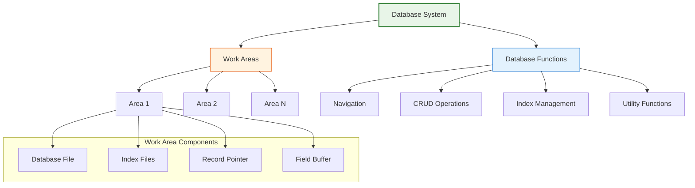
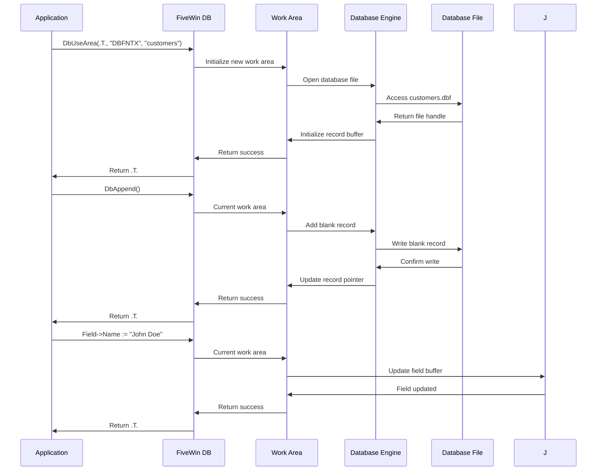
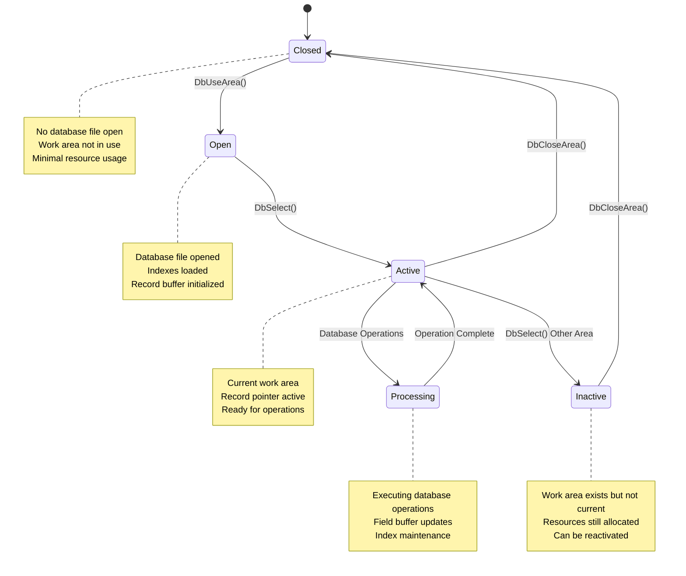

# Database Functions

FiveWin provides a comprehensive set of functions for working with databases, offering a powerful yet simple interface for integrating data access into your applications. These functions maintain compatibility with the standard xBase database model while extending functionality for modern applications.

**Source Files:** [source/function/dbffunc1.prg](../../../../source/function/dbffunc1.prg), [source/function/dbffunc2.prg](../../../../source/function/dbffunc2.prg)

## Overview

The FiveWin database functions provide a complete interface for database operations, supporting all standard xBase operations and extending them with additional capabilities for modern database interactions. These functions work with multiple database formats including DBF/NTX, and can be extended to work with other database systems.

The database system is built around the concept of work areas, where each area represents an open database file with its associated index files. This allows multiple databases to be open simultaneously, each with independent record pointers and operations.

## Database Architecture



## Database Operation Flow



## Core Database Functions

### Work Area Management

| Function | Description | Parameters |
|----------|-------------|------------|
| `DbUseArea(lNew, cDriver, cFile, cAlias, lShare)` | Opens a database in a work area | lNew: Create new area, cDriver: Database driver, cFile: File name, cAlias: Alias name, lShare: Shared access |
| `DbCloseArea()` | Closes the current work area | None |
| `DbSelect(cAlias)` | Selects a work area by alias | cAlias: Work area alias |
| `DbGotop()` | Moves to first record | None |
| `DbGobottom()` | Moves to last record | None |
| `DbSkip(nRecords)` | Moves record pointer | nRecords: Number of records to skip |

### CRUD Operations

| Function | Description | Return Value |
|----------|-------------|--------------|
| `DbAppend()` | Adds new blank record | `.T.` on success |
| `DbDelete()` | Marks current record for deletion | `.T.` on success |
| `DbRecall()` | Recalls deleted record | `.T.` on success |
| `DbPack()` | Permanently removes deleted records | `.T.` on success |
| `DbZap()` | Removes all records from database | `.T.` on success |
| `DbCommit()` | Writes changes to disk | `.T.` on success |

### Record Navigation

| Function | Description | Return Value |
|----------|-------------|--------------|
| `DbGoTop()` | Go to first record | `.T.` on success |
| `DbGoBottom()` | Go to last record | `.T.` on success |
| `DbSkip(n)` | Skip n records | `.T.` on success |
| `DbSeek(xKey, lSoftSeek)` | Search for key value | `.T.` if found |
| `EOF()` | End of file reached | `.T.` if at end |
| `BOF()` | Beginning of file reached | `.T.` if at beginning |

### Index Management

| Function | Description | Parameters |
|----------|-------------|------------|
| `DbCreateIndex(cIndex, cKey, cFor)` | Creates new index | cIndex: Index name, cKey: Key expression, cFor: For condition |
| `DbSetIndex(cIndex)` | Adds index to work area | cIndex: Index file name |
| `DbSetOrder(nOrder)` | Sets current index order | nOrder: Index order number |
| `DbClearIndex()` | Clears all indexes | None |
| `DbReindex()` | Rebuilds all indexes | None |

## Detailed Function Examples

### Opening and Closing Databases

```harbour
#include "FiveWin.ch"

function Main()
   local cDatabase := "customers.dbf"
   
   // Open database with shared access
   if DbUseArea( .T., "DBFNTX", cDatabase, "CUSTOMERS", .T. )
      MsgInfo( "Database opened successfully" )
      
      // Work with database...
      ProcessCustomers()
      
      // Close database
      DbCloseArea()
      MsgInfo( "Database closed" )
   else
      MsgStop( "Failed to open database: " + cDatabase )
   endif
   
return nil

static function ProcessCustomers()
   local nCount := 0
   
   // Count records
   DbGoTop()
   while !EOF()
      nCount++
      DbSkip()
   enddo
   
   MsgInfo( "Processed " + hb_ntos(nCount) + " customer records" )
return nil
```

### Creating New Databases

```harbour
#include "FiveWin.ch"

function CreateCustomerDatabase()
   local aStruct := { ;
      { "ID", "N", 10, 0 }, ;
      { "NAME", "C", 50, 0 }, ;
      { "EMAIL", "C", 100, 0 }, ;
      { "PHONE", "C", 20, 0 }, ;
      { "ACTIVE", "L", 1, 0 } ;
   }
   
   // Create new database
   if DBCREATE( "customers.dbf", aStruct )
      MsgInfo( "Customer database created successfully" )
      
      // Open and populate with sample data
      if DbUseArea( .T., "DBFNTX", "customers.dbf", "CUSTOMERS", .T. )
         AddSampleData()
         DbCloseArea()
      endif
   else
      MsgStop( "Failed to create database" )
   endif
   
return nil

static function AddSampleData()
   local aCustomers := { ;
      { 1, "John Doe", "john@example.com", "555-1234", .T. }, ;
      { 2, "Jane Smith", "jane@example.com", "555-5678", .T. }, ;
      { 3, "Bob Johnson", "bob@example.com", "555-9012", .F. } ;
   }
   
   for local i := 1 to Len( aCustomers )
      DbAppend()
      Field->ID := aCustomers[i][1]
      Field->NAME := aCustomers[i][2]
      Field->EMAIL := aCustomers[i][3]
      Field->PHONE := aCustomers[i][4]
      Field->ACTIVE := aCustomers[i][5]
   next
   
   MsgInfo( "Added " + hb_ntos(Len(aCustomers)) + " sample records" )
return nil
```

### Record Operations

```harbour
#include "FiveWin.ch"

function ManageCustomers()
   // Open database
   if !DbUseArea( .T., "DBFNTX", "customers.dbf", "CUSTOMERS", .T. )
      MsgStop( "Cannot open customer database" )
      return .F.
   endif
   
   // Add new customer
   AddNewCustomer()
   
   // Find and update customer
   UpdateCustomer( "John Doe" )
   
   // Delete inactive customers
   DeleteInactiveCustomers()
   
   // Clean up deleted records
   if MsgYesNo( "Permanently remove deleted records?" )
      DbPack()
      MsgInfo( "Database packed successfully" )
   endif
   
   DbCloseArea()
return .T.

static function AddNewCustomer()
   local cName, cEmail, cPhone
   
   cName := Space(50)
   cEmail := Space(100)
   cPhone := Space(20)
   
   // Dialog to get customer information
   DEFINE DIALOG oDlg TITLE "Add New Customer" ;
      FROM 0, 0 TO 150, 300
   
   @ 10, 10 SAY "Name:" OF oDlg
   @ 10, 30 GET cName OF oDlg SIZE 100, 12
   
   @ 30, 10 SAY "Email:" OF oDlg
   @ 30, 30 GET cEmail OF oDlg SIZE 100, 12
   
   @ 50, 10 SAY "Phone:" OF oDlg
   @ 50, 30 GET cPhone OF oDlg SIZE 100, 12
   
   @ 80, 30 BUTTON "Add" OF oDlg ;
      ACTION ( ValidateAndAdd( cName, cEmail, cPhone ), oDlg:End() )
   
   @ 80, 90 BUTTON "Cancel" OF oDlg ;
      ACTION oDlg:End()
   
   ACTIVATE DIALOG oDlg CENTERED
   
return nil

static function ValidateAndAdd( cName, cEmail, cPhone )
   if Empty( AllTrim(cName) )
      MsgStop( "Name is required" )
      return .F.
   endif
   
   // Add record
   DbAppend()
   Field->ID := GetNextID()
   Field->NAME := AllTrim(cName)
   Field->EMAIL := AllTrim(cEmail)
   Field->PHONE := AllTrim(cPhone)
   Field->ACTIVE := .T.
   
   MsgInfo( "Customer added successfully" )
return .T.

static function GetNextID()
   local nMaxID := 0
   
   DbGoTop()
   while !EOF()
      if Field->ID > nMaxID
         nMaxID := Field->ID
      endif
      DbSkip()
   enddo
   
return nMaxID + 1

static function UpdateCustomer( cName )
   // Search for customer
   if DbSeek( cName )
      // Update email
      Field->EMAIL := "updated@example.com"
      MsgInfo( "Customer updated: " + Field->NAME )
   else
      MsgAlert( "Customer not found: " + cName )
   endif
   
return nil

static function DeleteInactiveCustomers()
   local nDeleted := 0
   
   DbGoTop()
   while !EOF()
      if !Field->ACTIVE
         DbDelete()
         nDeleted++
      endif
      DbSkip()
   enddo
   
   if nDeleted > 0
      MsgInfo( "Deleted " + hb_ntos(nDeleted) + " inactive customers" )
   endif
   
return nil
```

### Index Operations

```harbour
#include "FiveWin.ch"

function WorkWithIndexes()
   // Open database
   if !DbUseArea( .T., "DBFNTX", "customers.dbf", "CUSTOMERS", .T. )
      MsgStop( "Cannot open database" )
      return .F.
   endif
   
   // Create indexes
   CreateIndexes()
   
   // Use indexes for searching
   SearchCustomers()
   
   // Rebuild indexes
   if MsgYesNo( "Rebuild all indexes?" )
      DbReindex()
      MsgInfo( "Indexes rebuilt successfully" )
   endif
   
   DbCloseArea()
return .T.

static function CreateIndexes()
   // Create index on name
   if DbCreateIndex( "custname", "NAME" )
      MsgInfo( "Name index created" )
   else
      MsgAlert( "Failed to create name index" )
   endif
   
   // Create index on active status
   if DbCreateIndex( "custactive", "ACTIVE" )
      MsgInfo( "Active status index created" )
   else
      MsgAlert( "Failed to create active status index" )
   endif
   
   // Set indexes
   DbSetIndex( "custname" )
   DbSetIndex( "custactive" )
   
return nil

static function SearchCustomers()
   local cSearchName
   
   cSearchName := "John"
   
   // Search using index
   if DbSeek( cSearchName )
      MsgInfo( "Found customer: " + Field->NAME )
      
      // Navigate through matching records
      while !EOF() .and. Left( Field->NAME, Len(cSearchName) ) == cSearchName
         ? "Customer:", Field->NAME, Field->EMAIL
         DbSkip()
      enddo
   else
      MsgAlert( "No customers found with name starting with: " + cSearchName )
   endif
   
return nil
```

## Database Work Area Management



## Integration with FiveWin UI Components

### Database Browser with TBrowse

```harbour
#include "FiveWin.ch"

function BrowseCustomers()
   // Open database
   if !DbUseArea( .T., "DBFNTX", "customers.dbf", "CUSTOMERS", .T. )
      MsgStop( "Cannot open customer database" )
      return .F.
   endif
   
   // Create browse window
   local oWnd, oBrowse
   
   DEFINE WINDOW oWnd TITLE "Customer Browser" ;
      FROM 0, 0 TO 400, 600
   
   @ 10, 10 BROWSE oBrowse OF oWnd ;
      SIZE 350, 250 ;
      FONT "Arial", 10
   
   // Configure browse columns
   oBrowse:AddColumn( "ID", { || Field->ID }, 50 )
   oBrowse:AddColumn( "Name", { || Field->NAME }, 150 )
   oBrowse:AddColumn( "Email", { || Field->EMAIL }, 200 )
   oBrowse:AddColumn( "Active", { || iif( Field->ACTIVE, "Yes", "No" ) }, 50 )
   
   // Add toolbar buttons
   @ 270, 10 BUTTON "Add" OF oWnd ;
      ACTION AddCustomerRecord()
   
   @ 270, 60 BUTTON "Edit" OF oWnd ;
      ACTION EditCustomerRecord( oBrowse )
   
   @ 270, 110 BUTTON "Delete" OF oWnd ;
      ACTION DeleteCustomerRecord( oBrowse )
   
   @ 270, 160 BUTTON "Refresh" OF oWnd ;
      ACTION oBrowse:Refresh()
   
   @ 270, 210 BUTTON "Close" OF oWnd ;
      ACTION ( DbCloseArea(), oWnd:End() )
   
   ACTIVATE WINDOW oWnd
   
return nil

static function AddCustomerRecord()
   // Implementation for adding records
   MsgInfo( "Add customer functionality would go here" )
return nil

static function EditCustomerRecord( oBrowse )
   // Implementation for editing records
   if oBrowse:nRecords > 0
      MsgInfo( "Edit customer functionality would go here" )
   else
      MsgAlert( "No record selected" )
   endif
   
return nil

static function DeleteCustomerRecord( oBrowse )
   // Implementation for deleting records
   if oBrowse:nRecords > 0
      if MsgYesNo( "Delete selected customer?" )
         DbDelete()
         oBrowse:Refresh()
         MsgInfo( "Customer deleted" )
      endif
   else
      MsgAlert( "No record selected" )
   endif
   
return nil
```

## Error Handling and Best Practices

### Robust Database Operations

```harbour
#include "FiveWin.ch"

function RobustDatabaseOperation()
   local cDatabase := "customers.dbf"
   local lSuccess := .F.
   
   // Check if database exists
   if !File( cDatabase )
      MsgStop( "Database file not found: " + cDatabase )
      return .F.
   endif
   
   // Backup before major operations
   if !BackupDatabase( cDatabase )
      MsgAlert( "Could not create backup. Proceed with caution." )
      if !MsgYesNo( "Continue without backup?" )
         return .F.
      endif
   endif
   
   // Open database with error handling
   if !DbUseArea( .T., "DBFNTX", cDatabase, "CUSTOMERS", .T. )
      MsgStop( "Failed to open database: " + cDatabase )
      return .F.
   endif
   
   // Perform operations with transaction-like behavior
   BEGIN SEQUENCE
      lSuccess := ProcessDatabaseOperations()
   RECOVER
      MsgStop( "Database operation failed: " + hb_errorDesc() )
      lSuccess := .F.
   END SEQUENCE
   
   // Always close database
   DbCloseArea()
   
   if lSuccess
      MsgInfo( "Database operations completed successfully" )
   endif
   
return lSuccess

static function BackupDatabase( cDatabase )
   local cBackup := hb_FNameReplaceExt( cDatabase, ".bak" )
   
   // Create backup
   return hb_fileCopy( cDatabase, cBackup )
   
return nil

static function ProcessDatabaseOperations()
   local nProcessed := 0
   
   // Example operation: Update all records
   DbGoTop()
   while !EOF()
      // Update record
      Field->ACTIVE := .T.  // Example update
      
      // Check for errors
      if NetErr()
         Break( "Network error during update" )
      endif
      
      nProcessed++
      DbSkip()
   enddo
   
   // Commit changes
   DbCommit()
   
   ? "Processed", nProcessed, "records"
return .T.
```

## Related Components

* [TBrowse Class](../classes/TBrowse.md) - Visual database browsing component
* [TGet Class](../classes/TGet.md) - Data entry control with database integration
* [Harbour Database Commands](https://harbour.github.io/doc/dbf.html) - Underlying Harbour database system
* [xBase Database Tutorial](https://www.itl.nist.gov/div897/odmg/dbtut/xbase.html) - xBase database fundamentals

## Best Practices

1. **Always Close Databases**: Use `DbCloseArea()` to properly close database files
2. **Error Handling**: Check return values of database functions for errors
3. **Index Management**: Create appropriate indexes for frequently searched fields
4. **Record Locking**: Use shared access appropriately for multi-user environments
5. **Backup Strategy**: Implement backup procedures before major database operations
6. **Validation**: Validate data before writing to database
7. **Resource Management**: Close unused work areas to free system resources
8. **Transaction Management**: Group related operations for consistency

## Performance Considerations

* Database operations are I/O intensive and can impact application responsiveness
* Indexes improve search performance but slow down write operations
* Large databases benefit from selective field access rather than full record reads
* Network databases require additional considerations for latency and bandwidth
* Consider using buffered operations for bulk data processing
* Regular maintenance (PACK, REINDEX) improves performance over time