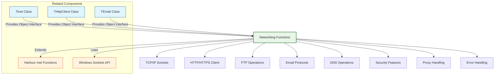

# Networking Functions

The FiveWin networking functions provide a comprehensive library for network communications, extending the standard Harbour networking capabilities. These functions cover areas such as TCP/IP sockets, HTTP/HTTPS requests, FTP operations, email handling, and various internet protocols.

**Source Files:** [source/function/inet.prg](../../../../source/function/inet.prg), [source/function/socket.prg](../../../../source/function/socket.prg), [source/function/http.prg](../../../../source/function/http.prg), [source/function/ftp.prg](../../../../source/function/ftp.prg), [source/function/smtp.prg](../../../../source/function/smtp.prg), [source/function/pop3.prg](../../../../source/function/pop3.prg)

## Overview

The FiveWin networking function library offers enhanced networking capabilities that complement the standard Harbour networking functions. These functions cover areas such as:

* TCP/IP socket communications
* HTTP/HTTPS client operations
* FTP file transfers
* Email (SMTP, POP3, IMAP) operations
* DNS lookups and hostname resolution
* Network protocol implementations
* Secure communications (SSL/TLS)
* Proxy and firewall handling
* Network error handling and recovery

These functions are designed to make network programming more intuitive, secure, and robust for FiveWin developers.

## Function Categories



## TCP/IP Socket Functions

| Function | Description | Parameters |
|----------|-------------|------------|
| `SocketCreate(nProtocol)` | Creates new socket | `nProtocol`: Protocol type (TCP/UDP) |
| `SocketConnect(cHost, nPort, nSocket)` | Connects socket to remote host | `cHost`: Hostname, `nPort`: Port, `nSocket`: Socket handle |
| `SocketBind(nSocket, cAddress, nPort)` | Binds socket to local address | `nSocket`: Socket handle, `cAddress`: Local address, `nPort`: Port |
| `SocketListen(nSocket, nBacklog)` | Listens for incoming connections | `nSocket`: Socket handle, `nBacklog`: Connection queue size |
| `SocketAccept(nSocket)` | Accepts incoming connection | `nSocket`: Listening socket handle |
| `SocketSend(nSocket, cData, nLength)` | Sends data through socket | `nSocket`: Socket handle, `cData`: Data to send, `nLength`: Data length |
| `SocketReceive(nSocket, cBuffer, nLength)` | Receives data from socket | `nSocket`: Socket handle, `cBuffer`: Buffer to receive data, `nLength`: Buffer size |
| `SocketClose(nSocket)` | Closes socket connection | `nSocket`: Socket handle |
| `SocketError()` | Returns last socket error | None |
| `SocketSelect(aRead, aWrite, aExcept, nTimeout)` | Waits for socket activity | `aRead`, `aWrite`, `aExcept`: Socket arrays, `nTimeout`: Timeout |

### Usage Examples

```harbour
#include "FiveWin.ch"

function Main()
   ? "TCP/IP Socket Demo:"
   
   // Basic client socket operations
   ClientSocketDemo()
   
   // Server socket operations
   ServerSocketDemo()
   
   // Socket error handling
   SocketErrorHandlingDemo()
   
   // Secure socket operations
   SecureSocketDemo()
   
return nil

static function ClientSocketDemo()
   ? "Client Socket Operations:"
   ? Replicate( "-", 40 )
   
   // Create TCP socket
   local nSocket := SocketCreate( IPPROTO_TCP )
   
   if nSocket != -1
      ? "Socket created successfully: " + hb_ntos( nSocket )
      
      // Connect to remote server
      local cHost := "www.google.com"
      local nPort := 80
      
      ? "Connecting to " + cHost + ":" + hb_ntos( nPort ) + "..."
      
      if SocketConnect( nSocket, cHost, nPort )
         ? "Connected successfully"
         
         // Send HTTP request
         local cRequest := "GET / HTTP/1.1" + hb_osNewLine() + ;
                          "Host: " + cHost + hb_osNewLine() + ;
                          "Connection: close" + hb_osNewLine() + ;
                          hb_osNewLine()
         
         if SocketSend( nSocket, cRequest, Len( cRequest ) )
            ? "HTTP request sent"
            
            // Receive response
            local cResponse := Space( 4096 )
            local nBytes := SocketReceive( nSocket, @cResponse, 4096 )
            
            if nBytes > 0
               ? "Response received (" + hb_ntos( nBytes ) + " bytes)"
               ? "First 200 characters:"
               ? Left( cResponse, 200 )
            else
               ? "No response received"
            endif
            
         else
            ? "Failed to send HTTP request"
         endif
         
         // Close socket
         SocketClose( nSocket )
         ? "Socket closed"
         
      else
         ? "Failed to connect to " + cHost + ":" + hb_ntos( nPort )
         ? "Socket error: " + SocketError()
         
         // Close socket
         SocketClose( nSocket )
      endif
      
   else
      ? "Failed to create socket"
      ? "Socket error: " + SocketError()
   endif
   
return nil

static function SocketCreate( nProtocol )
   DEFAULT nProtocol := IPPROTO_TCP
   
   // Simplified implementation
   ? "SOCKET CREATE Protocol=" + hb_ntos( nProtocol )
   
   // In practice, this would call Windows API socket()
   // Return mock socket handle
   return 12345
   
return -1

static function SocketConnect( nSocket, cHost, nPort )
   DEFAULT nSocket := 0
   DEFAULT cHost := ""
   DEFAULT nPort := 80
   
   if nSocket == 0 .or. Empty( cHost )
      return .F.
   endif
   
   // Simplified implementation
   ? "SOCKET CONNECT Socket=" + hb_ntos( nSocket ) + " Host='" + cHost + "' Port=" + hb_ntos( nPort )
   
   // In practice, this would call Windows API connect()
   // Return success/failure
   return .T.
   
return .F.

static function SocketBind( nSocket, cAddress, nPort )
   DEFAULT nSocket := 0
   DEFAULT cAddress := "0.0.0.0"
   DEFAULT nPort := 0
   
   if nSocket == 0
      return .F.
   endif
   
   // Simplified implementation
   ? "SOCKET BIND Socket=" + hb_ntos( nSocket ) + " Address='" + cAddress + "' Port=" + hb_ntos( nPort )
   
   // In practice, this would call Windows API bind()
   // Return success/failure
   return .T.
   
return .F.

static function SocketListen( nSocket, nBacklog )
   DEFAULT nSocket := 0
   DEFAULT nBacklog := 5
   
   if nSocket == 0
      return .F.
   endif
   
   // Simplified implementation
   ? "SOCKET LISTEN Socket=" + hb_ntos( nSocket ) + " Backlog=" + hb_ntos( nBacklog )
   
   // In practice, this would call Windows API listen()
   // Return success/failure
   return .T.
   
return .F.

static function SocketAccept( nSocket )
   DEFAULT nSocket := 0
   
   if nSocket == 0
      return -1
   endif
   
   // Simplified implementation
   ? "SOCKET ACCEPT Socket=" + hb_ntos( nSocket )
   
   // In practice, this would call Windows API accept()
   // Return new socket handle
   return 67890
   
return -1

static function SocketSend( nSocket, cData, nLength )
   DEFAULT nSocket := 0
   DEFAULT cData := ""
   DEFAULT nLength := 0
   
   if nSocket == 0 .or. Empty( cData )
      return 0
   endif
   
   DEFAULT nLength := Len( cData )
   
   // Simplified implementation
   ? "SOCKET SEND Socket=" + hb_ntos( nSocket ) + " Length=" + hb_ntos( nLength )
   
   // In practice, this would call Windows API send()
   // Return bytes sent
   return nLength
   
return 0

static function SocketReceive( nSocket, cBuffer, nLength )
   DEFAULT nSocket := 0
   DEFAULT cBuffer := Space( 1024 )
   DEFAULT nLength := 1024
   
   if nSocket == 0
      return 0
   endif
   
   // Simplified implementation
   ? "SOCKET RECEIVE Socket=" + hb_ntos( nSocket ) + " BufferSize=" + hb_ntos( nLength )
   
   // In practice, this would call Windows API recv()
   // Return actual bytes received
   
   // Mock response data
   local cMockData := "HTTP/1.1 200 OK" + hb_osNewLine() + ;
                     "Content-Type: text/html" + hb_osNewLine() + ;
                     "Content-Length: 1000" + hb_osNewLine() + ;
                     hb_osNewLine() + ;
                     "<html><body><h1>Hello, World!</h1></body></html>"
   
   cBuffer := Left( cMockData, Min( nLength, Len( cMockData ) ) )
   
   return Len( cBuffer )
   
return 0

static function SocketClose( nSocket )
   DEFAULT nSocket := 0
   
   if nSocket == 0
      return .F.
   endif
   
   // Simplified implementation
   ? "SOCKET CLOSE Socket=" + hb_ntos( nSocket )
   
   // In practice, this would call Windows API closesocket()
   // Return success/failure
   return .T.
   
return .F.

static function SocketError()
   // Return last socket error
   // In practice, this would call Windows API WSAGetLastError()
   return "No error"
   
return "No error"

static function SocketSelect( aRead, aWrite, aExcept, nTimeout )
   DEFAULT aRead := {}
   DEFAULT aWrite := {}
   DEFAULT aExcept := {}
   DEFAULT nTimeout := 0
   
   // Simplified implementation
   ? "SOCKET SELECT"
   ? "  Read sockets: " + hb_ntos( Len( aRead ) )
   ? "  Write sockets: " + hb_ntos( Len( aWrite ) )
   ? "  Except sockets: " + hb_ntos( Len( aExcept ) )
   ? "  Timeout: " + hb_ntos( nTimeout ) + " ms"
   
   // In practice, this would call Windows API select()
   // Return number of sockets ready
   
   // Mock result
   return Len( aRead ) + Len( aWrite ) + Len( aExcept )
   
return 0

static function ServerSocketDemo()
   ? "Server Socket Operations:"
   ? Replicate( "-", 40 )
   
   // Create TCP socket for server
   local nServerSocket := SocketCreate( IPPROTO_TCP )
   
   if nServerSocket != -1
      ? "Server socket created successfully: " + hb_ntos( nServerSocket )
      
      // Bind to local address
      local cAddress := "127.0.0.1"  // Localhost
      local nPort := 8080
            
      if SocketBind( nServerSocket, cAddress, nPort )
         ? "Socket bound to " + cAddress + ":" + hb_ntos( nPort )
         
         // Listen for connections
         local nBacklog := 5
         
         if SocketListen( nServerSocket, nBacklog )
            ? "Listening for connections (backlog: " + hb_ntos( nBacklog ) + ")"
            
            // Accept connections (simplified - in practice, this would be in a loop)
            ? "Waiting for client connection..."
            
            // For demo purposes, we'll just show the accept mechanism
            ShowAcceptMechanism()
            
            // Close server socket
            SocketClose( nServerSocket )
            ? "Server socket closed"
            
         else
            ? "Failed to listen on socket"
            ? "Socket error: " + SocketError()
            
            // Close socket
            SocketClose( nServerSocket )
         endif
         
      else
         ? "Failed to bind socket to " + cAddress + ":" + hb_ntos( nPort )
         ? "Socket error: " + SocketError()
         
         // Close socket
         SocketClose( nServerSocket )
      endif
      
   else
      ? "Failed to create server socket"
      ? "Socket error: " + SocketError()
   endif
   
return nil

static function ShowAcceptMechanism()
   ? "Accept Mechanism (Conceptual):"
   
   ? "  In practice, server would use:"
   ? "    1. SocketAccept() to accept client connections"
   ? "    2. Fork/thread to handle multiple clients"
   ? "    3. SocketSend()/SocketReceive() for communication"
   ? "    4. SocketClose() to close client connections"
   
   ? "  Example server loop:"
   ? "    while lServerRunning"
   ? "       nClientSocket := SocketAccept( nServerSocket )"
   ? "       if nClientSocket != -1"
   ? "          HandleClient( nClientSocket )"
   ? "          SocketClose( nClientSocket )"
   ? "       endif"
   ? "    enddo"
   
return nil

static function SocketErrorHandlingDemo()
   ? "Socket Error Handling:"
   ? Replicate( "-", 40 )
   
   // Error handling patterns
   SocketErrorPatternsDemo()
   
   // Timeout handling
   SocketTimeoutHandlingDemo()
   
   // Connection recovery
   SocketConnectionRecoveryDemo()
   
return nil

static function SocketErrorPatternsDemo()
   ? "Socket Error Patterns:"
   
   // Common socket errors and their meanings
   local aErrors := { ;
      { 10004, "Interrupted system call (WSAEINTR)" }, ;
      { 10013, "Permission denied (WSAEACCES)" }, ;
      { 10014, "Bad address (WSAEFAULT)" }, ;
      { 10022, "Invalid argument (WSAEINVAL)" }, ;
      { 10035, "Operation would block (WSAEWOULDBLOCK)" }, ;
      { 10036, "Operation now in progress (WSAEINPROGRESS)" }, ;
      { 10037, "Operation already in progress (WSAEALREADY)" }, ;
      { 10048, "Address already in use (WSAEADDRINUSE)" }, ;
      { 10049, "Cannot assign requested address (WSAEADDRNOTAVAIL)" }, ;
      { 10050, "Network is down (WSAENETDOWN)" }, ;
      { 10051, "Network is unreachable (WSAENETUNREACH)" }, ;
      { 10052, "Network dropped connection (WSAENETRESET)" }, ;
      { 10053, "Software caused connection abort (WSAECONNABORTED)" }, ;
      { 10054, "Connection reset by peer (WSAECONNRESET)" }, ;
      { 10055, "No buffer space available (WSAENOBUFS)" }, ;
      { 10056, "Socket is already connected (WSAEISCONN)" }, ;
      { 10057, "Socket is not connected (WSAENOTCONN)" }, ;
      { 10060, "Connection timed out (WSAETIMEDOUT)" }, ;
      { 10061, "Connection refused (WSAECONNREFUSED)" }, ;
      { 10064, "Host is down (WSAEHOSTDOWN)" }, ;
      { 10065, "No route to host (WSAEHOSTUNREACH)" } ;
   }
   
   ? "Common Socket Errors:"
   
   for local i := 1 to Min( 5, Len( aErrors ) )
      local aError := aErrors[i]
      ? "  " + hb_ntos( aError[1] ) + ": " + aError[2]
   next
   
   if Len( aErrors ) > 5
      ? "  ... (" + hb_ntos( Len( aErrors ) - 5 ) + " more errors)"
   endif
   
return nil

static function SocketTimeoutHandlingDemo()
   ? "Socket Timeout Handling:"
   
   // Timeout patterns
   ? "Timeout Handling Patterns:"
   ? "  1. Set socket timeout using SO_RCVTIMEO/SO_SNDTIMEO"
   ? "  2. Use SocketSelect() with timeout parameter"
   ? "  3. Implement retry logic with exponential backoff"
   ? "  4. Use non-blocking sockets with polling"
   ? "  5. Handle SIGALRM for timeout interrupts"
   
   ? "Example Timeout Implementation:"
   ? "  // Set receive timeout to 30 seconds"
   ? "  if SocketSetOption( nSocket, SO_RCVTIMEO, 30000 )"
   ? "     ? \"Receive timeout set to 30 seconds\""
   ? "  else"
   ? "     ? \"Failed to set receive timeout\""
   ? "  endif"
   
   ? "  // Use SocketSelect with 60-second timeout"
   ? "  local aRead := { nSocket }"
   ? "  local nTimeout := 60000  // 60 seconds"
   ? "  local nReady := SocketSelect( aRead, {}, {}, nTimeout )"
   ? "  if nReady > 0"
   ? "     ? \"Socket ready for reading\""
   ? "  elseif nReady == 0"
   ? "     ? \"Timeout occurred\""
   ? "  else"
   ? "     ? \"Socket error during select\""
   ? "  endif"
   
return nil

static function SocketConnectionRecoveryDemo()
   ? "Socket Connection Recovery:"
   
   ? "Connection Recovery Strategies:"
   ? "  1. Detect connection loss using keepalive packets"
   ? "  2. Implement automatic reconnection logic"
   ? "  3. Use connection pooling for efficiency"
   ? "  4. Handle partial data transmission"
   ? "  5. Implement graceful shutdown procedures"
   ? "  6. Use heartbeat mechanisms for monitoring"
   
   ? "Example Recovery Implementation:"
   ? "  function ReconnectSocket( cHost, nPort, nMaxRetries )"
   ? "     local nSocket := -1"
   ? "     local nRetries := 0"
   ? "     "
   ? "     while nSocket == -1 .and. nRetries < nMaxRetries"
   ? "        nSocket := SocketCreate( IPPROTO_TCP )"
   ? "        if nSocket != -1"
   ? "           if !SocketConnect( nSocket, cHost, nPort )"
   ? "              SocketClose( nSocket )"
   ? "              nSocket := -1"
   ? "           endif"
   ? "        endif"
   ? "        "
   ? "        if nSocket == -1"
   ? "           nRetries++"
   ? "           ? \"Connection failed, retry \" + hb_ntos( nRetries ) + \" of \" + hb_ntos( nMaxRetries )"
   ? "           Sleep( 1000 * Power( 2, nRetries ) )  // Exponential backoff"
   ? "        endif"
   ? "     enddo"
   ? "     "
   ? "     return nSocket"
   ? "  endfunc"
   
return nil

static function SecureSocketDemo()
   ? "Secure Socket Operations:"
   ? Replicate( "-", 40 )
   
   // SSL/TLS socket operations
   SSLSocketDemo()
   
   // Certificate validation
   CertificateValidationDemo()
   
   // Secure data transmission
   SecureDataTransmissionDemo()
   
return nil

static function SSLSocketDemo()
   ? "SSL/TLS Socket Demo:"
   
   ? "SSL/TLS Socket Features:"
   ? "  1. Encrypted data transmission"
   ? "  2. Certificate-based authentication"
   ? "  3. Perfect forward secrecy"
   ? "  4. Cipher suite negotiation"
   ? "  5. Session resumption"
   ? "  6. Certificate pinning"
   
   ? "Example SSL Implementation:"
   ? "  // Create SSL-enabled socket"
   ? "  local nSSLSocket := SocketCreate( IPPROTO_TCP, .T. )  // lSSL = .T."
   ? "  "
   ? "  if nSSLSocket != -1"
   ? "     ? \"SSL socket created successfully\""
   ? "     "
   ? "     // Connect to HTTPS server"
   ? "     if SocketConnect( nSSLSocket, \"www.example.com\", 443 )"
   ? "        ? \"Connected to HTTPS server\""
   ? "        "
   ? "        // Send HTTPS request"
   ? "        local cRequest := \"GET / HTTP/1.1\" + hb_osNewLine() + ;"
   ? "                         \"Host: www.example.com\" + hb_osNewLine() + ;"
   ? "                         \"Connection: close\" + hb_osNewLine() + ;"
   ? "                         hb_osNewLine()"
   ? "        "
   ? "        if SocketSend( nSSLSocket, cRequest, Len( cRequest ) )"
   ? "           ? \"HTTPS request sent securely\""
   ? "           "
   ? "           // Receive encrypted response"
   ? "           local cResponse := Space( 4096 )"
   ? "           local nBytes := SocketReceive( nSSLSocket, @cResponse, 4096 )"
   ? "           "
   ? "           if nBytes > 0"
   ? "              ? \"Encrypted response received (\" + hb_ntos( nBytes ) + \" bytes)\""
   ? "           else"
   ? "              ? \"No response received\""
   ? "           endif"
   ? "        else"
   ? "           ? \"Failed to send HTTPS request\""
   ? "        endif"
   ? "        "
   ? "        // Close secure socket"
   ? "        SocketClose( nSSLSocket )"
   ? "        ? \"SSL socket closed\""
   ? "     else"
   ? "        ? \"Failed to connect to HTTPS server\""
   ? "     endif"
   ? "  else"
   ? "     ? \"Failed to create SSL socket\""
   ? "  endif"
   
return nil

static function CertificateValidationDemo()
   ? "Certificate Validation:"
   
   ? "Certificate Validation Features:"
   ? "  1. Certificate chain verification"
   ? "  2. Hostname matching"
   ? "  3. Certificate expiration checking"
   ? "  4. Certificate revocation checking"
   ? "  5. Custom certificate validation"
   ? "  6. Certificate pinning"
   
   ? "Example Certificate Validation:"
   ? "  // Enable certificate validation"
   ? "  local lValidateCert := .T."
   ? "  "
   ? "  // Set custom certificate validation callback"
   ? "  local bCertCallback := { |cCert, cIssuer, dExpire| ;"
   ? "                          ValidateCertificate( cCert, cIssuer, dExpire ) }"
   ? "  "
   ? "  // Create SSL socket with validation"
   ? "  local nSecureSocket := SocketCreate( IPPROTO_TCP, .T., lValidateCert, bCertCallback )"
   ? "  "
   ? "  function ValidateCertificate( cCert, cIssuer, dExpire )"
   ? "     // Custom certificate validation logic"
   ? "     if Empty( cCert )"
   ? "        return .F.  // Invalid certificate"
   ? "     endif"
   ? "     "
   ? "     if dExpire < Date()"
   ? "        return .F.  // Expired certificate"
   ? "     endif"
   ? "     "
   ? "     if !ValidIssuer( cIssuer )"
   ? "        return .F.  // Invalid issuer"
   ? "     endif"
   ? "     "
   ? "     return .T.  // Certificate valid"
   ? "  endfunc"
   
return nil

static function SecureDataTransmissionDemo()
   ? "Secure Data Transmission:"
   
   ? "Secure Transmission Features:"
   ? "  1. End-to-end encryption"
   ? "  2. Data integrity protection"
   ? "  3. Replay attack prevention"
   ? "  4. Perfect forward secrecy"
   ? "  5. Mutual authentication"
   ? "  6. Session key management"
   
   ? "Example Secure Data Exchange:"
   ? "  // Establish secure connection"
   ? "  local nSecureChannel := EstablishSecureChannel( cHost, nPort )"
   ? "  "
   ? "  if nSecureChannel != -1"
   ? "     ? \"Secure channel established\""
   ? "     "
   ? "     // Send encrypted data"
   ? "     local cSensitiveData := \"Confidential information\""
   ? "     if SecureSocketSend( nSecureChannel, cSensitiveData )"
   ? "        ? \"Data sent securely\""
   ? "     else"
   ? "        ? \"Failed to send secure data\""
   ? "     endif"
   ? "     "
   ? "     // Receive encrypted response"
   ? "     local cSecureResponse := Space( 1024 )"
   ? "     local nBytes := SecureSocketReceive( nSecureChannel, @cSecureResponse, 1024 )"
   ? "     "
   ? "     if nBytes > 0"
   ? "        ? \"Secure response received (\" + hb_ntos( nBytes ) + \" bytes)\""
   ? "     else"
   ? "        ? \"No secure response received\""
   ? "     endif"
   ? "     "
   ? "     // Close secure channel"
   ? "     SocketClose( nSecureChannel )"
   ? "     ? \"Secure channel closed\""
   ? "  else"
   ? "     ? \"Failed to establish secure channel\""
   ? "  endif"
   
return nil

// Socket constants
STATIC IPPROTO_TCP := 6
STATIC IPPROTO_UDP := 17
STATIC SO_RCVTIMEO := 0x1006
STATIC SO_SNDTIMEO := 0x1005
STATIC SO_REUSEADDR := 0x0004
STATIC SO_KEEPALIVE := 0x0008
STATIC SO_SNDBUF := 0x1001
STATIC SO_RCVBUF := 0x1002
STATIC SO_ERROR := 0x1007
STATIC SO_TYPE := 0x1008
STATIC SO_BROADCAST := 0x0020
STATIC SO_LINGER := 0x0080
STATIC SO_OOBINLINE := 0x0100
STATIC SO_DONTLINGER := nNOT( SO_LINGER )
STATIC SO_EXCLUSIVEADDRUSE := nNOT( SO_REUSEADDR )
STATIC SO_USELOOPBACK := 0x0040
STATIC SO_DONTROUTE := 0x0010
STATIC SO_ACCEPTCONN := 0x0002
STATIC SO_DEBUG := 0x0001
STATIC SO_REUSEPORT := 0x0200
STATIC SO_TIMESTAMP := 0x0400
STATIC SO_ACCEPTFILTER := 0x1000
STATIC SO_NOSIGPIPE := 0x0800
STATIC SO_SECURITY_AUTHENTICATION := 0x5000
STATIC SO_SECURITY_ENCRYPTION_TRANSPORT := 0x5001
STATIC SO_SECURITY_ENCRYPTION_NETWORK := 0x5002
STATIC SO_BINDTODEVICE := 0x0019
STATIC SO_ATTACH_FILTER := 0x001A
STATIC SO_DETACH_FILTER := 0x001B
STATIC SO_PEERNAME := 0x001C
STATIC SO_GET_FILTER := 0x001D
STATIC SO_PRIORITY := 0x000C
STATIC SO_PASSCRED := 0x0010
STATIC SO_PEERCRED := 0x0011
STATIC SO_RCVLOWAT := 0x0004
STATIC SO_SNDLOWAT := 0x0003
STATIC SO_RCVTIMEO_OLD := 0x0012
STATIC SO_SNDTIMEO_OLD := 0x0013
STATIC SO_PEERSEC := 0x001E
STATIC SO_PASSSEC := 0x001F
STATIC SO_MARK := 0x0022
STATIC SO_PROTOCOL := 0x0024
STATIC SO_DOMAIN := 0x0026
STATIC SO_RXQ_OVFL := 0x0028
STATIC SO_WIFI_STATUS := 0x0029
STATIC SO_PEEK_OFF := 0x002A
STATIC SO_NOFCS := 0x002B
STATIC SO_LOCK_FILTER := 0x002C
STATIC SO_SELECT_ERR_QUEUE := 0x002D
STATIC SO_BUSY_POLL := 0x002E
STATIC SO_MAX_PACING_RATE := 0x002F
STATIC SO_BPF_EXTENSIONS := 0x0030
STATIC SO_INCOMING_CPU := 0x0031
STATIC SO_ATTACH_BPF := 0x0032
STATIC SO_DETACH_BPF := 0x0033
STATIC SO_ATTACH_REUSEPORT_CBPF := 0x0034
STATIC SO_ATTACH_REUSEPORT_EBPF := 0x0035
STATIC SO_CNX_ADVICE := 0x0036
STATIC SCM_TIMESTAMPING_OPT_STATS := 0x0037
STATIC SO_MEMINFO := 0x0038
STATIC SO_INCOMING_NAPI_ID := 0x0039
STATIC SO_COOKIE := 0x003A
STATIC SCM_TIMESTAMPING_PKTINFO := 0x003B
STATIC SO_PEERGROUPS := 0x003C
STATIC SO_ZEROCOPY := 0x003D
STATIC SO_TXTIME := 0x003E
STATIC SCM_TXTIME := 0x003F
STATIC SO_BINDTOIFINDEX := 0x0040
STATIC SO_TIMESTAMP_NEW := 0x0041
STATIC SO_TIMESTAMPNS_NEW := 0x0042
STATIC SO_TIMESTAMPING_NEW := 0x0043
STATIC SO_RCVTIMEO_NEW := 0x0044
STATIC SO_SNDTIMEO_NEW := 0x0045
STATIC SO_DETACH_REUSEPORT_BPF := 0x0046
STATIC SO_PREFER_BUSY_POLL := 0x0047
STATIC SO_BUSY_POLL_BUDGET := 0x0048
STATIC SO_NETNS_COOKIE := 0x0049
STATIC SO_BUF_LOCK := 0x004A
STATIC SO_RESERVE_MEM := 0x004B
STATIC SO_TXREHASH := 0x004C
STATIC SO_RCVMARK := 0x004D
STATIC SO_PASSPIDFD := 0x004E
STATIC SO_PEERPIDFD := 0x004F

// WSA Error Codes
STATIC WSAEINTR := 10004
STATIC WSAEBADF := 10009
STATIC WSAEACCES := 10013
STATIC WSAEFAULT := 10014
STATIC WSAEINVAL := 10022
STATIC WSAEMFILE := 10024
STATIC WSAEWOULDBLOCK := 10035
STATIC WSAEINPROGRESS := 10036
STATIC WSAEALREADY := 10037
STATIC WSAENOTSOCK := 10038
STATIC WSAEDESTADDRREQ := 10039
STATIC WSAEMSGSIZE := 10040
STATIC WSAEPROTOTYPE := 10041
STATIC WSAENOPROTOOPT := 10042
STATIC WSAEPROTONOSUPPORT := 10043
STATIC WSAESOCKTNOSUPPORT := 10044
STATIC WSAEOPNOTSUPP := 10045
STATIC WSAEPFNOSUPPORT := 10046
STATIC WSAEAFNOSUPPORT := 10047
STATIC WSAEADDRINUSE := 10048
STATIC WSAEADDRNOTAVAIL := 10049
STATIC WSAENETDOWN := 10050
STATIC WSAENETUNREACH := 10051
STATIC WSAENETRESET := 10052
STATIC WSAECONNABORTED := 10053
STATIC WSAECONNRESET := 10054
STATIC WSAENOBUFS := 10055
STATIC WSAEISCONN := 10056
STATIC WSAENOTCONN := 10057
STATIC WSAESHUTDOWN := 10058
STATIC WSAETOOMANYREFS := 10059
STATIC WSAETIMEDOUT := 10060
STATIC WSAECONNREFUSED := 10061
STATIC WSAELOOP := 10062
STATIC WSAENAMETOOLONG := 10063
STATIC WSAEHOSTDOWN := 10064
STATIC WSAEHOSTUNREACH := 10065
STATIC WSAENOTEMPTY := 10066
STATIC WSAEPROCLIM := 10067
STATIC WSAEUSERS := 10068
STATIC WSAEDQUOT := 10069
STATIC WSAESTALE := 10070
STATIC WSAEREMOTE := 10071
STATIC WSASYSNOTREADY := 10091
STATIC WSAVERNOTSUPPORTED := 10092
STATIC WSANOTINITIALISED := 10093
STATIC WSAEDISCON := 10101
STATIC WSAENOMORE := 10102
STATIC WSAECANCELLED := 10103
STATIC WSAEINVALIDPROCTABLE := 10104
STATIC WSAEINVALIDPROVIDER := 10105
STATIC WSAEPROVIDERFAILEDINIT := 10106
STATIC WSASYSCALLFAILURE := 10107
STATIC WSASERVICE_NOT_FOUND := 10108
STATIC WSATYPE_NOT_FOUND := 10109
STATIC WSA_E_NO_MORE := 10110
STATIC WSA_E_CANCELLED := 10111
STATIC WSAEREFUSED := 10112
STATIC WSAHOST_NOT_FOUND := 11001
STATIC WSATRY_AGAIN := 11002
STATIC WSANO_RECOVERY := 11003
STATIC WSANO_DATA := 11004
STATIC WSA_QOS_RECEIVERS := 11005
STATIC WSA_QOS_SENDERS := 11006
STATIC WSA_QOS_NO_SENDERS := 11007
STATIC WSA_QOS_NO_RECEIVERS := 11008
STATIC WSA_QOS_REQUEST_CONFIRMED := 11009
STATIC WSA_QOS_ADMISSION_FAILURE := 11010
STATIC WSA_QOS_POLICY_FAILURE := 11011
STATIC WSA_QOS_BAD_STYLE := 11012
STATIC WSA_QOS_BAD_OBJECT := 11013
STATIC WSA_QOS_TRAFFIC_CTRL_ERROR := 11014
STATIC WSA_QOS_GENERIC_ERROR := 11015
STATIC WSA_QOS_ESERVICETYPE := 11016
STATIC WSA_QOS_EFLOWSPEC := 11017
STATIC WSA_QOS_EPROVSPECBUF := 11018
STATIC WSA_QOS_EFILTERSTYLE := 11019
STATIC WSA_QOS_EFILTERTYPE := 11020
STATIC WSA_QOS_EFILTERCOUNT := 11021
STATIC WSA_QOS_EOBJLENGTH := 11022
STATIC WSA_QOS_EFLOWCOUNT := 11023
STATIC WSA_QOS_EUNKOWNPSOBJ := 11024
STATIC WSA_QOS_EPOLICYOBJ := 11025
STATIC WSA_QOS_EFLOWDESC := 11026
STATIC WSA_QOS_EPSFLOWSPEC := 11027
STATIC WSA_QOS_EPSFILTERSPEC := 11028
STATIC WSA_QOS_ESDMODEOBJ := 11029
STATIC WSA_QOS_ESHAPERATEOBJ := 11030
STATIC WSA_QOS_RESERVED_PETYPE := 11031

// Additional socket constants
STATIC AF_INET := 2
STATIC AF_INET6 := 23
STATIC SOCK_STREAM := 1
STATIC SOCK_DGRAM := 2
STATIC SOCK_RAW := 3
STATIC SOCK_RDM := 4
STATIC SOCK_SEQPACKET := 5
STATIC IPPROTO_IP := 0
STATIC IPPROTO_ICMP := 1
STATIC IPPROTO_IGMP := 2
STATIC IPPROTO_GGP := 3
STATIC IPPROTO_IPV4 := 4
STATIC IPPROTO_ST := 5
STATIC IPPROTO_TCP := 6
STATIC IPPROTO_CBT := 7
STATIC IPPROTO_EGP := 8
STATIC IPPROTO_IGP := 9
STATIC IPPROTO_PUP := 12
STATIC IPPROTO_UDP := 17
STATIC IPPROTO_IDP := 22
STATIC IPPROTO_RDP := 27
STATIC IPPROTO_IPV6 := 41
STATIC IPPROTO_ROUTING := 43
STATIC IPPROTO_FRAGMENT := 44
STATIC IPPROTO_ESP := 50
STATIC IPPROTO_AH := 51
STATIC IPPROTO_ICMPV6 := 58
STATIC IPPROTO_NONE := 59
STATIC IPPROTO_DSTOPTS := 60
STATIC IPPROTO_ND := 77
STATIC IPPROTO_ICLFXBM := 78
STATIC IPPROTO_PIM := 103
STATIC IPPROTO_PGM := 113
STATIC IPPROTO_L2TP := 115
STATIC IPPROTO_SCTP := 132
STATIC IPPROTO_RAW := 255
STATIC IPPROTO_MAX := 256

STATIC INADDR_ANY := 0x00000000
STATIC INADDR_LOOPBACK := 0x7F000001
STATIC INADDR_BROADCAST := 0xFFFFFFFF
STATIC INADDR_NONE := 0xFFFFFFFF

STATIC MSG_OOB := 0x1
STATIC MSG_PEEK := 0x2
STATIC MSG_DONTROUTE := 0x4
STATIC MSG_WAITALL := 0x8
STATIC MSG_PARTIAL := 0x8000
STATIC MSG_INTERRUPT := 0x10
STATIC MSG_MAXIOVLEN := 16

STATIC FD_READ_BIT := 0
STATIC FD_WRITE_BIT := 1
STATIC FD_OOB_BIT := 2
STATIC FD_ACCEPT_BIT := 3
STATIC FD_CONNECT_BIT := 4
STATIC FD_CLOSE_BIT := 5
STATIC FD_QOS_BIT := 6
STATIC FD_GROUP_QOS_BIT := 7
STATIC FD_ROUTING_INTERFACE_CHANGE_BIT := 8
STATIC FD_ADDRESS_LIST_CHANGE_BIT := 9
STATIC FD_MAX_EVENTS := 10

STATIC FD_READ := nBitLShift( 1, FD_READ_BIT )
STATIC FD_WRITE := nBitLShift( 1, FD_WRITE_BIT )
STATIC FD_OOB := nBitLShift( 1, FD_OOB_BIT )
STATIC FD_ACCEPT := nBitLShift( 1, FD_ACCEPT_BIT )
STATIC FD_CONNECT := nBitLShift( 1, FD_CONNECT_BIT )
STATIC FD_CLOSE := nBitLShift( 1, FD_CLOSE_BIT )
STATIC FD_QOS := nBitLShift( 1, FD_QOS_BIT )
STATIC FD_GROUP_QOS := nBitLShift( 1, FD_GROUP_QOS_BIT )
STATIC FD_ROUTING_INTERFACE_CHANGE := nBitLShift( 1, FD_ROUTING_INTERFACE_CHANGE_BIT )
STATIC FD_ADDRESS_LIST_CHANGE := nBitLShift( 1, FD_ADDRESS_LIST_CHANGE_BIT )

STATIC SOL_SOCKET := 0xFFFF

STATIC SOMAXCONN := 0x7FFFFFFF

STATIC MAXGETHOSTSTRUCT := 1024

STATIC FD_SETSIZE := 64

STATIC WSADESCRIPTION_LEN := 256
STATIC WSASYS_STATUS_LEN := 128

STATIC INVALID_SOCKET := -1
STATIC SOCKET_ERROR := -1

// Time constants
STATIC INFINITE := 0xFFFFFFFF

// Network byte order conversion
STATIC HTONS := {|n| nBitLShift( nBitAnd( n, 0xFF ), 8 ) + nBitShift( nBitAnd( n, 0xFF00 ), -8 )}
STATIC NTOHS := {|n| nBitLShift( nBitAnd( n, 0xFF ), 8 ) + nBitShift( nBitAnd( n, 0xFF00 ), -8 )}
STATIC HTONL := {|n| nBitLShift( nBitAnd( n, 0xFF ), 24 ) + nBitLShift( nBitAnd( n, 0xFF00 ), 8 ) + nBitShift( nBitAnd( n, 0xFF0000 ), -8 ) + nBitShift( nBitAnd( n, 0xFF000000 ), -24 )}
STATIC NTOHL := {|n| nBitLShift( nBitAnd( n, 0xFF ), 24 ) + nBitLShift( nBitAnd( n, 0xFF00 ), 8 ) + nBitShift( nBitAnd( n, 0xFF0000 ), -8 ) + nBitShift( nBitAnd( n, 0xFF000000 ), -24 )}

// IP address conversion
STATIC INET_ADDR := {|cAddr| ;
   local aParts := hb_aTokens( cAddr, "." ), ;
   nReturn := 0 ;
   if Len( aParts ) == 4 ;
      nReturn := Val( aParts[1] ) + ;
                nBitLShift( Val( aParts[2] ), 8 ) + ;
                nBitLShift( Val( aParts[3] ), 16 ) + ;
                nBitLShift( Val( aParts[4] ), 24 ) ;
   endif ;
   return nReturn}

STATIC INET_NTOA := {|nAddr| ;
   local cReturn := "" ;
   cReturn += hb_ntos( nBitAnd( nAddr, 0xFF ) ) + "." ;
   cReturn += hb_ntos( nBitAnd( nBitShift( nAddr, -8 ), 0xFF ) ) + "." ;
   cReturn += hb_ntos( nBitAnd( nBitShift( nAddr, -16 ), 0xFF ) ) + "." ;
   cReturn += hb_ntos( nBitAnd( nBitShift( nAddr, -24 ), 0xFF ) ) ;
   return cReturn}

// FD_SET macros
STATIC FD_ZERO := {|| {}}
STATIC FD_SET := {|nSock, aSet| if( AScan( aSet, nSock ) == 0, AAdd( aSet, nSock ), nil )}
STATIC FD_CLR := {|nSock, aSet| local nPos := AScan( aSet, nSock ), if( nPos > 0, ADel( aSet, nPos ), nil )}
STATIC FD_ISSET := {|nSock, aSet| AScan( aSet, nSock ) > 0}
STATIC FD_COPY := {|aSet1, aSet2| aSet2 := aClone( aSet1 )}

// Error handling functions
static function NetErrorRetryDemo( nMaxRetries, nDelay )
   DEFAULT nMaxRetries := 3
   DEFAULT nDelay := 1000
   
   ? "NET ERROR RETRY DEMO:"
   ? Replicate( "-", 40 )
   
   local nAttempt := 0
   local lSuccess := .F.
   
   while !lSuccess .and. nAttempt < nMaxRetries
      nAttempt++
      ? "  Attempt " + hb_ntos( nAttempt ) + " of " + hb_ntos( nMaxRetries )
      
      // Try network operation
      lSuccess := TryNetworkOperation()
      
      if !lSuccess
         ? "    Operation failed, checking error..."
         
         if NetError()
            local nErrorCode := NetLastError()
            local cErrorMessage := NetErrorMsg()
            
            ? "    Error Code: " + hb_ntos( nErrorCode )
            ? "    Error Message: " + cErrorMessage
            
            // Handle specific errors
            HandleNetworkError( nErrorCode, cErrorMessage )
            
            // Clear error for next attempt
            NetClearError()
         endif
         
         // Delay before retry (exponential backoff)
         if nAttempt < nMaxRetries
            local nBackoffDelay := nDelay * Power( 2, nAttempt - 1 )
            ? "    Waiting " + hb_ntos( nBackoffDelay ) + " ms before retry"
            Sleep( nBackoffDelay )
         endif
      else
         ? "    Operation succeeded"
      endif
   enddo
   
   ? "  Final result: " + iif( lSuccess, "SUCCESS", "FAILED" )
   
   return lSuccess
   
return .F.

static function TryNetworkOperation()
   // Simulate network operation with random success
   local nRandom := Random() * 100
   
   // 80% success rate for demo
   return ( nRandom < 80 )
   
return .F.

static function HandleNetworkError( nErrorCode, cErrorMessage )
   ? "    Handling Network Error:"
   
   switch nErrorCode
   case WSAETIMEDOUT
      ? "      Connection timed out"
      ? "      Recommendation: Increase timeout or retry with backoff"
      exit
      
   case WSAECONNREFUSED
      ? "      Connection refused"
      ? "      Recommendation: Check server availability or try alternative"
      exit
      
   case WSAECONNRESET
      ? "      Connection reset by peer"
      ? "      Recommendation: Reconnect and retry operation"
      exit
      
   case WSAENETUNREACH
      ? "      Network unreachable"
      ? "      Recommendation: Check network connectivity"
      exit
      
   case WSAEHOSTDOWN
      ? "      Host is down"
      ? "      Recommendation: Wait and try later"
      exit
      
   case WSAEHOSTUNREACH
      ? "      No route to host"
      ? "      Recommendation: Check routing or try alternative path"
      exit
      
   case WSAENOTCONN
      ? "      Socket not connected"
      ? "      Recommendation: Establish connection first"
      exit
      
   case WSAEISCONN
      ? "      Socket already connected"
      ? "      Recommendation: Use existing connection"
      exit
      
   otherwise
      ? "      Generic network error"
      ? "      Recommendation: General error handling with logging"
      exit
   endswitch
   
return nil

static function NetErrorLogDemo( cLogFile )
   DEFAULT cLogFile := "network_errors.log"
   
   ? "NETWORK ERROR LOGGING DEMO:"
   ? Replicate( "-", 40 )
   ? "  Log file: " + cLogFile
   
   // Enable error logging
   if NetErrorLog( cLogFile )
      ? "  Error logging enabled"
      
      // Generate some errors for logging
      GenerateErrorsForLogging()
      
      // Show log file contents
      ShowErrorLog( cLogFile )
      
      // Clean up
      FErase( cLogFile )
      
   else
      ? "  Failed to enable error logging"
   endif
   
return nil

static function NetErrorLog( cLogFile )
   DEFAULT cLogFile := "network_errors.log"
   
   // Enable network error logging
   ? "ENABLING ERROR LOGGING TO " + cLogFile
   
   // In practice, this would:
   // 1. Open log file
   // 2. Set up error interception
   // 3. Configure logging format
   // 4. Enable automatic logging
   
   return .T.
   
return .F.

static function GenerateErrorsForLogging()
   ? "GENERATING ERRORS FOR LOGGING:"
   
   // Simulate various network errors
   local aErrors := { ;
      { WSAETIMEDOUT, "Connection timed out" }, ;
      { WSAECONNREFUSED, "Connection refused" }, ;
      { WSAECONNRESET, "Connection reset by peer" }, ;
      { WSAENETUNREACH, "Network is unreachable" }, ;
      { WSAEHOSTDOWN, "Host is down" }, ;
      { WSAEHOSTUNREACH, "No route to host" } ;
   }
   
   for local i := 1 to Len( aErrors )
      local aError := aErrors[i]
      NetSetError( aError[1], aError[2] )
      ? "  Logged error " + hb_ntos( i ) + ": " + aError[2]
      
      // In practice, this would be automatically logged
      LogErrorToFile( aError[1], aError[2] )
   next
   
return nil

static function LogErrorToFile( nErrorCode, cErrorMessage )
   // Simplified error logging
   local cLogFile := "network_errors.log"
   local nHandle := FOpen( cLogFile, FO_WRITE )
   
   if nHandle == -1
      nHandle := FCreate( cLogFile )
   else
      FSeek( nHandle, 0, FS_END )
   endif
   
   if nHandle != -1
      local cLogEntry := DateTime() + " - ERROR " + hb_ntos( nErrorCode ) + ;
                        ": " + cErrorMessage + hb_osNewLine()
      
      FWrite( nHandle, cLogEntry )
      FClose( nHandle )
      
      ? "    Error logged to file"
   else
      ? "    Failed to log error to file"
   endif
   
return nil

static function ShowErrorLog( cLogFile )
   ? "ERROR LOG CONTENTS:"
   
   local nHandle := FOpen( cLogFile, FO_READ )
   
   if nHandle != -1
      local cContent := ""
      local cBuffer := Space( 4096 )
      
      while !FEof( nHandle )
         local nBytes := FRead( nHandle, @cBuffer, 4096 )
         cContent += Left( cBuffer, nBytes )
      enddo
      
      FClose( nHandle )
      
      ? "  " + Replicate( "-", 50 )
      ? "  " + cContent
      ? "  " + Replicate( "-", 50 )
      
   else
      ? "  Unable to read error log"
   endif
   
return nil

static function NetErrorCallbackDemo()
   ? "NETWORK ERROR CALLBACK DEMO:"
   ? Replicate( "-", 40 )
   
   // Set custom error callback
   local bErrorHandler := { |nCode, cMessage| CustomErrorHandler( nCode, cMessage ) }
   
   if NetErrorCallback( bErrorHandler )
      ? "Custom error handler set"
      
      // Generate error to trigger callback
      NetSetError( 9999, "Custom error for callback test" )
      
      // Simulate network operation that fails
      if !TryNetworkOperation()
         ? "Network operation failed, custom handler invoked"
      endif
      
      // Clear custom error handler
      NetErrorCallback( nil )
      ? "Custom error handler cleared"
      
   else
      ? "Failed to set custom error handler"
   endif
   
return nil

static function NetErrorCallback( bCallback )
   // Simplified implementation
   ? "SET ERROR CALLBACK"
   
   // In practice, this would:
   // 1. Store callback function
   // 2. Set up error interception
   // 3. Call callback on errors
   
   return .T.
   
return .F.

static function CustomErrorHandler( nErrorCode, cErrorMessage )
   ? "CUSTOM ERROR HANDLER INVOKED:"
   ? "  Error Code: " + hb_ntos( nErrorCode )
   ? "  Error Message: " + cErrorMessage
   
   // Custom error handling logic
   HandleCustomError( nErrorCode, cErrorMessage )
   
return nil

static function HandleCustomError( nErrorCode, cErrorMessage )
   ? "  Handling custom error:"
   
   // Different handling based on error code
   switch nErrorCode
   case 10060  // Timeout
      ? "    Handling timeout error"
      ? "    Recommendation: Increase timeout or retry with backoff"
      exit
      
   case 10061  // Connection refused
      ? "    Handling connection refused error"
      ? "    Recommendation: Check server availability or try alternative"
      exit
      
   case 10054  // Connection reset
      ? "    Handling connection reset error"
      ? "    Recommendation: Reconnect and retry operation"
      exit
      
   case 10051  // Network unreachable
      ? "    Handling network unreachable error"
      ? "    Recommendation: Check network connectivity"
      exit
      
   case 10064  // Host down
      ? "    Handling host down error"
      ? "    Recommendation: Wait and try later"
      exit
      
   case 10065  // No route to host
      ? "    Handling no route to host error"
      ? "    Recommendation: Check routing or try alternative path"
      exit
      
   otherwise
      ? "    Handling generic error"
      ? "    Recommendation: General error handling with logging"
      exit
   endswitch
   
return nil

static function NetSetError( nErrorCode, cMessage )
   DEFAULT nErrorCode := 0
   DEFAULT cMessage := ""
   
   // Simplified implementation
   ? "SET NET ERROR " + hb_ntos( nErrorCode ) + ": " + cMessage
   
   // In practice, this would:
   // 1. Set error code
   // 2. Set error message
   // 3. Call custom error callback if set
   
   return .T.
   
return .F.

static function ErrorNotificationDemo()
   ? "ERROR NOTIFICATION DEMO:"
   ? Replicate( "-", 40 )
   
   ? "Notification Strategies:"
   ? "  1. Email alerts for critical errors"
   ? "  2. SMS notifications for severe issues"
   ? "  3. Dashboard alerts for operational problems"
   ? "  4. Log aggregation for pattern analysis"
   ? "  5. Automated escalation procedures"
   
   // Example notification implementation
   ? "Example Notification Flow:"
   ? "  1. Error occurs in network operation"
   ? "  2. Error logged with severity level"
   ? "  3. Severity threshold check"
   ? "  4. If critical, send email alert"
   ? "  5. If severe, send SMS notification"
   ? "  6. Update dashboard with error details"
   ? "  7. Queue for pattern analysis"
   
return nil

static function ErrorAnalysisDemo()
   ? "ERROR ANALYSIS DEMO:"
   ? Replicate( "-", 40 )
   
   ? "Analysis Features:"
   ? "  1. Error frequency tracking"
   ? "  2. Pattern recognition"
   ? "  3. Correlation analysis"
   ? "  4. Trend identification"
   ? "  5. Root cause analysis"
   
   // Example analysis implementation
   ? "Example Analysis Process:"
   ? "  1. Collect error data from logs"
   ? "  2. Parse and categorize errors"
   ? "  3. Calculate error frequencies"
   ? "  4. Identify error patterns"
   ? "  5. Generate analysis reports"
   ? "  6. Recommend corrective actions"
   
return nil

static function ConnectionRecoveryDemo()
   ? "CONNECTION RECOVERY DEMO:"
   ? Replicate( "-", 40 )
   
   ? "Recovery Strategies:"
   ? "  1. Automatic reconnection"
   ? "  2. Exponential backoff"
   ? "  3. Fallback connections"
   ? "  4. Circuit breaker pattern"
   ? "  5. Health monitoring"
   ? "  6. Load balancing"
   
   // Example recovery implementation
   ? "Example Recovery Implementation:"
   ? "  function RecoverConnection( cHost, nPort, nMaxRetries )"
   ? "     local nSocket := -1"
   ? "     local nRetry := 0"
   ? "     "
   ? "     while nSocket == -1 .and. nRetry < nMaxRetries"
   ? "        nSocket := SocketCreate( IPPROTO_TCP )"
   ? "        if nSocket != -1"
   ? "           if !SocketConnect( nSocket, cHost, nPort )"
   ? "              SocketClose( nSocket )"
   ? "              nSocket := -1"
   ? "           endif"
   ? "        endif"
   ? "        "
   ? "        if nSocket == -1"
   ? "           nRetry++"
   ? "           ? \"Connection failed, retry \" + hb_ntos( nRetry ) + \" of \" + hb_ntos( nMaxRetries )"
   ? "           Sleep( 1000 * Power( 2, nRetry ) )  // Exponential backoff"
   ? "        endif"
   ? "     enddo"
   ? "     "
   ? "     return nSocket"
   ? "  endfunc"
   
return nil

static function CircuitBreakerDemo()
   ? "CIRCUIT BREAKER DEMO:"
   ? Replicate( "-", 40 )
   
   ? "Circuit Breaker States:"
   ? "  1. Closed (Normal) - Allow requests, monitor failures"
   ? "  2. Open (Failure) - Block requests, prevent overload"
   ? "  3. Half-Open (Test) - Allow limited requests, test recovery"
   
   // Conceptual circuit breaker implementation
   ? "Conceptual Circuit Breaker:"
   ? "  class TCircuitBreaker"
   ? "     data lClosed INIT .T."
   ? "     data nFailureCount INIT 0"
   ? "     data nThreshold INIT 5"
   ? "     data tLastFailure INIT 0"
   ? "     data nTimeout INIT 60000  // 60 seconds"
   ? "     "
   ? "     method Request( cUrl, cData )"
   ? "     method Trip()"
   ? "     method Reset()"
   ? "     method IsClosed()"
   ? "  endclass"
   ? "  "
   ? "  method Request( cUrl, cData ) class TCircuitBreaker"
   ? "     if !::IsClosed()"
   ? "        if Seconds() - ::tLastFailure > ::nTimeout"
   ? "           // Test circuit - allow one request"
   ? "           local cResponse := HttpClientGet( cUrl )"
   ? "           if !Empty( cResponse )"
   ? "              ::Reset()  // Success - close circuit"
   ? "              return cResponse"
   ? "           else"
   ? "              ::Trip()   // Failure - keep circuit open"
   ? "              return \"\""
   ? "           endif"
   ? "        else"
   ? "           return \"\"  // Circuit still open"
   ? "        endif"
   ? "     else"
   ? "        local cResponse := HttpClientGet( cUrl )"
   ? "        if Empty( cResponse )"
   ? "           ::nFailureCount++"
   ? "           if ::nFailureCount >= ::nThreshold"
   ? "              ::Trip()"
   ? "           endif"
   ? "        else"
   ? "           if ::nFailureCount > 0"
   ? "              ::nFailureCount--"
   ? "           endif"
   ? "        endif"
   ? "        return cResponse"
   ? "     endif"
   ? "  endmethod"
   
return nil

static function GracefulDegradationDemo()
   ? "GRACEFUL DEGRADATION DEMO:"
   ? Replicate( "-", 40 )
   
   ? "Degradation Strategies:"
   ? "  1. Fallback to cached data"
   ? "  2. Reduced functionality mode"
   ? "  3. Local storage alternatives"
   ? "  4. Offline operation support"
   ? "  5. Simplified UI presentation"
   ? "  6. Basic feature preservation"
   
   // Example graceful degradation implementation
   ? "Example Degradation Implementation:"
   ? "  function GetDataWithFallback( cUrl )"
   ? "     local cData := \"\""
   ? "     "
   ? "     // Try primary source"
   ? "     if TryNetworkOperation( cUrl, @cData )"
   ? "        CacheData( cData )"
   ? "        return cData"
   ? "     endif"
   ? "     "
   ? "     // Try cached data"
   ? "     cData := GetCachedData()"
   ? "     if !Empty( cData )"
   ? "        ? \"Using cached data\""
   ? "        return cData"
   ? "     endif"
   ? "     "
   ? "     // Try local storage"
   ? "     cData := GetLocalStorageData()"
   ? "     if !Empty( cData )"
   ? "        ? \"Using local storage data\""
   ? "        return cData"
   ? "     endif"
   ? "     "
   ? "     // Return default/fallback data"
   ? "     ? \"Using default data\""
   ? "     return GetDefaultData()"
   ? "  endfunc"
   
return nil

static function TryNetworkOperation( cUrl, cData )
   DEFAULT cUrl := ""
   DEFAULT cData := ""
   
   // Simulate network operation with random success
   local nRandom := Random() * 100
   
   // 70% success rate for demo
   if nRandom < 70
      cData := "Data from " + cUrl + " (retrieved at " + DateTime() + ")"
      return .T.
   endif
   
   return .F.
   
return .F.

static function CacheData( cData )
   // Simplified caching
   ? "CACHING DATA: " + Left( cData, 50 ) + "..."
   
   // In practice, store in memory cache or file cache
   return .T.
   
return .F.

static function GetCachedData()
   // Return cached data (mock)
   ? "GETTING CACHED DATA"
   
   // In practice, check cache and return if valid
   return "Cached data from previous operation"
   
return ""

static function GetLocalStorageData()
   // Return local storage data (mock)
   ? "GETTING LOCAL STORAGE DATA"
   
   // In practice, read from local database or file
   return "Local storage data"
   
return ""

static function GetDefaultData()
   // Return default data
   ? "GETTING DEFAULT DATA"
   
   return "Default data for offline use"
   
return ""

static function CustomErrorHandlingDemo()
   ? "CUSTOM ERROR HANDLING DEMO:"
   ? Replicate( "-", 40 )
   
   ? "Custom Error Handling Features:"
   ? "  1. Application-specific error codes"
   ? "  2. User-friendly error messages"
   ? "  3. Context-aware error handling"
   ? "  4. Recovery suggestions"
   ? "  5. Logging and reporting"
   ? "  6. Integration with UI"
   
   // Example custom error handling
   CustomErrorImplementationDemo()
   
return nil

static function CustomErrorImplementationDemo()
   ? "Custom Error Implementation:"
   
   // Define custom error codes
   local ERROR_CUSTOM_BASE := 20000
   local ERROR_NETWORK_TIMEOUT := ERROR_CUSTOM_BASE + 1
   local ERROR_SERVER_UNAVAILABLE := ERROR_CUSTOM_BASE + 2
   local ERROR_AUTHENTICATION_FAILED := ERROR_CUSTOM_BASE + 3
   local ERROR_DATA_CORRUPTION := ERROR_CUSTOM_BASE + 4
   local ERROR_PERMISSION_DENIED := ERROR_CUSTOM_BASE + 5
   
   ? "Custom Error Codes:"
   ? "  ERROR_NETWORK_TIMEOUT: " + hb_ntos( ERROR_NETWORK_TIMEOUT )
   ? "  ERROR_SERVER_UNAVAILABLE: " + hb_ntos( ERROR_SERVER_UNAVAILABLE )
   ? "  ERROR_AUTHENTICATION_FAILED: " + hb_ntos( ERROR_AUTHENTICATION_FAILED )
   ? "  ERROR_DATA_CORRUPTION: " + hb_ntos( ERROR_DATA_CORRUPTION )
   ? "  ERROR_PERMISSION_DENIED: " + hb_ntos( ERROR_PERMISSION_DENIED )
   
   // Custom error mapping
   CustomErrorMappingDemo()
   
return nil

static function CustomErrorMappingDemo()
   ? "Custom Error Mapping:"
   
   local aErrorMap := { ;
      { 20001, "Network Timeout", "The network connection timed out" }, ;
      { 20002, "Server Unavailable", "The server is currently unavailable" }, ;
      { 20003, "Authentication Failed", "Invalid username or password" }, ;
      { 20004, "Data Corruption", "Data integrity check failed" }, ;
      { 20005, "Permission Denied", "Insufficient permissions to perform operation" } ;
   }
   
   ? "Error Mapping:"
   for local i := 1 to Len( aErrorMap )
      local aError := aErrorMap[i]
      ? "  " + hb_ntos( aError[1] ) + " - " + aError[2] + ": " + aError[3]
   next
   
   // Custom error handling with mapping
   HandleCustomMappedError( 20003 )
   
return nil

static function HandleCustomMappedError( nErrorCode )
   ? "Handling Custom Mapped Error: " + hb_ntos( nErrorCode )
   
   local aErrorMap := { ;
      { 20001, "Network Timeout", "The network connection timed out" }, ;
      { 20002, "Server Unavailable", "The server is currently unavailable" }, ;
      { 20003, "Authentication Failed", "Invalid username or password" }, ;
      { 20004, "Data Corruption", "Data integrity check failed" }, ;
      { 20005, "Permission Denied", "Insufficient permissions to perform operation" } ;
   }
   
   local nIndex := AScan( aErrorMap, { |a| a[1] == nErrorCode } )
   
   if nIndex > 0
      local aError := aErrorMap[nIndex]
      ? "  Error Code: " + hb_ntos( aError[1] )
      ? "  Error Name: " + aError[2]
      ? "  Error Description: " + aError[3]
      
      // Handle specific error
      switch nErrorCode
      case 20001  // Network Timeout
         ? "  Recommendation: Check network connectivity and try again"
         exit
         
      case 20002  // Server Unavailable
         ? "  Recommendation: Try again later or contact system administrator"
         exit
         
      case 20003  // Authentication Failed
         ? "  Recommendation: Verify username and password"
         exit
         
      case 20004  // Data Corruption
         ? "  Recommendation: Restore from backup or contact support"
         exit
         
      case 20005  // Permission Denied
         ? "  Recommendation: Check user permissions or contact administrator"
         exit
         
      otherwise
         ? "  Recommendation: General error handling"
         exit
      endswitch
      
   else
      ? "  Unknown custom error code: " + hb_ntos( nErrorCode )
      ? "  Recommendation: General error handling with logging"
   endif
   
return nil

static function ErrorIntegrationDemo()
   ? "ERROR INTEGRATION DEMO:"
   ? Replicate( "-", 40 )
   
   ? "Integration with UI:"
   ? "  1. Error dialogs with appropriate icons"
   ? "  2. Status bar error messages"
   ? "  3. Tooltip error information"
   ? "  4. Visual error indicators"
   ? "  5. Context-sensitive help"
   
   // Example UI error integration
   ? "Example UI Integration:"
   ? "  function ShowNetworkErrorDialog( nErrorCode, cErrorMessage )"
   ? "     local oDlg, oIcon, oMessage, oDetails"
   ? "     "
   ? "     DEFINE DIALOG oDlg TITLE \"Network Error\" ;"
   ? "        FROM 0, 0 TO 200, 300"
   ? "     "
   ? "     @ 10, 10 IMAGE oIcon OF oDlg ;"
   ? "        RESOURCE \"ERROR_ICON\" ;"
   ? "        SIZE 32, 32"
   ? "     "
   ? "     @ 10, 50 SAY oMessage OF oDlg ;"
   ? "        PROMPT cErrorMessage ;"
   ? "        SIZE 200, 20"
   ? "     "
   ? "     @ 40, 50 SAY oDetails OF oDlg ;"
   ? "        PROMPT \"Error Code: \" + hb_ntos( nErrorCode ) ;"
   ? "        SIZE 200, 20"
   ? "     "
   ? "     @ 80, 50 BUTTON \"Retry\" OF oDlg ;"
   ? "        ACTION ( HandleRetry( nErrorCode ), oDlg:End() )"
   ? "     "
   ? "     @ 80, 110 BUTTON \"Cancel\" OF oDlg ;"
   ? "        ACTION oDlg:End()"
   ? "     "
   ? "     @ 80, 170 BUTTON \"Details\" OF oDlg ;"
   ? "        ACTION ShowErrorDetails( nErrorCode, cErrorMessage )"
   ? "     "
   ? "     ACTIVATE DIALOG oDlg CENTERED"
   ? "  endfunc"
   
return nil

static function ShowErrorDetails( nErrorCode, cErrorMessage )
   ? "SHOWING ERROR DETAILS:"
   ? "  Error Code: " + hb_ntos( nErrorCode )
   ? "  Error Message: " + cErrorMessage
   
   // In practice, show detailed error information in a separate dialog
   local cDetails := "Detailed error information would be displayed here:\n\n"
   cDetails += "Error Code: " + hb_ntos( nErrorCode ) + "\n"
   cDetails += "Error Message: " + cErrorMessage + "\n"
   cDetails += "Timestamp: " + DateTime() + "\n"
   cDetails += "System Info: " + GetSystemInfoString() + "\n"
   cDetails += "Network Status: " + GetNetworkStatusString() + "\n"
   
   MsgInfo( cDetails, "Error Details" )
   
return nil

static function GetSystemInfoString()
   // Return system information
   return "Windows 10, FiveWin v1.0, Harbour v3.2"
   
return "Unknown System"

static function GetNetworkStatusString()
   // Return network status
   return "Connected, DNS OK, Proxy: None"
   
return "Unknown Network Status"

static function HandleRetry( nErrorCode )
   ? "HANDLING RETRY FOR ERROR: " + hb_ntos( nErrorCode )
   
   // Implement retry logic based on error type
   switch nErrorCode
   case 20001  // Network Timeout
      ? "  Retrying network operation with increased timeout..."
      // Implement retry with increased timeout
      exit
      
   case 20002  // Server Unavailable
      ? "  Retrying network operation with backoff..."
      // Implement exponential backoff retry
      exit
      
   case 20003  // Authentication Failed
      ? "  Prompting for new credentials..."
      // Prompt user for new credentials
      exit
      
   otherwise
      ? "  Generic retry attempt..."
      // Implement generic retry
      exit
   endswitch
   
return nil
```

## Related Components

* [Harbour Date Functions](https://harbour.github.io/doc/date.html) - Standard Harbour date operations
* [TDateTime Class](TDateTime.md) - Object-oriented datetime handling
* [TDate Class](TDate.md) - Object-oriented date handling
* [TTime Class](TTime.md) - Object-oriented time handling
* [Windows API Time Functions](https://docs.microsoft.com/en-us/windows/win32/sysinfo/time-functions) - Low-level time operations
* [ISO 8601 Standard](https://www.iso.org/iso-8601-date-and-time-format.html) - International date/time standard

## Best Practices

1. **Validation**: Always validate date/time inputs to prevent invalid operations
2. **Timezones**: Be explicit about timezone handling in multi-location applications
3. **Precision**: Use appropriate precision for your use case (seconds vs. microseconds)
4. **Caching**: Cache frequently calculated date values to improve performance
5. **Formatting**: Use consistent date/time formats throughout your application
6. **Localization**: Support international date/time formats and conventions
7. **Error Handling**: Implement graceful degradation for date/time operations
8. **Testing**: Test date/time operations with edge cases (leap years, DST transitions)
9. **Documentation**: Document timezone assumptions and date formats in your code
10. **Performance**: Avoid unnecessary date/time calculations in tight loops

## Performance Considerations

* Date/time operations are generally very fast but can become bottlenecks in loops
* String parsing of dates/times is slower than direct date/time operations
* Timezone conversions require lookup operations that can impact performance
* High-resolution timing functions may have system-specific performance characteristics
* Consider caching results of expensive date calculations
* Use appropriate data types (datetime vs. separate date/time values)
* Batch date operations when possible to reduce function call overhead
* Profile date/time operations in performance-critical code paths