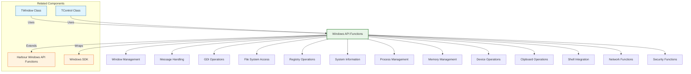

# Windows API Functions

The FiveWin Windows API functions provide a comprehensive library for accessing Windows operating system functionality, extending the standard Harbour Windows API capabilities. These functions cover areas such as window management, message handling, graphics operations, file system access, registry operations, and system information retrieval.

**Source Files:** [source/function/winapi.prg](../../../source/function/winapi.prg), [source/function/windows.prg](../../../source/function/windows.prg), [source/function/gdi.prg](../../../source/function/gdi.prg), [source/function/messages.prg](../../../source/function/messages.prg)

## Overview

The FiveWin Windows API function library offers enhanced access to Windows operating system functionality that complements the standard Harbour Windows API functions. These functions cover areas such as:

* Window management and manipulation
* Message handling and dispatching
* Graphics device interface (GDI) operations
* File system and registry access
* System information and metrics
* Process and thread management
* Memory management and allocation
* Device enumeration and configuration
* Clipboard operations
* Shell integration and file operations
* Network and communication APIs
* Security and authentication functions

These functions are designed to make Windows API operations more accessible, consistent, and powerful for FiveWin developers.

## Function Categories



## Window Management Functions

| Function | Description | Parameters |
|----------|-------------|------------|
| `CreateWindow(cClassName, cWindowName, nStyle, nX, nY, nWidth, nHeight, hWndParent, hMenu, hInstance, lpParam)` | Creates new window | Various window parameters |
| `DestroyWindow(hWnd)` | Destroys window | `hWnd`: Window handle |
| `ShowWindow(hWnd, nCmdShow)` | Shows/hides window | `hWnd`: Window handle, `nCmdShow`: Show command |
| `SetWindowPos(hWnd, hWndInsertAfter, nX, nY, nWidth, nHeight, nFlags)` | Sets window position and size | Various positioning parameters |
| `GetWindowRect(hWnd, aRect)` | Gets window rectangle | `hWnd`: Window handle, `aRect`: Rectangle array |
| `MoveWindow(hWnd, nX, nY, nWidth, nHeight, lRepaint)` | Moves and resizes window | Window handle and position/size |
| `SetWindowText(hWnd, cText)` | Sets window text/caption | `hWnd`: Window handle, `cText`: New text |
| `GetWindowText(hWnd, cBuffer, nMaxCount)` | Gets window text/caption | Window handle and buffer |
| `FindWindow(cClassName, cWindowName)` | Finds window by class/name | `cClassName`, `cWindowName`: Search criteria |
| `EnumWindows(bCallback, lParam)` | Enumerates all top-level windows | `bCallback`: Enum function, `lParam`: Parameter |

### Usage Examples

```harbour
#include "FiveWin.ch"

function Main()
   ? "Windows API Window Management Demo:"
   
   // Basic window operations
   BasicWindowDemo()
   
   // Window positioning
   WindowPositioningDemo()
   
   // Window enumeration
   WindowEnumerationDemo()
   
   // Window text operations
   WindowTextDemo()
   
   // Advanced window management
   AdvancedWindowManagementDemo()
   
return nil

static function BasicWindowDemo()
   ? "Basic Window Operations:"
   ? Replicate( "-", 40 )
   
   // Create a simple window
   local hWnd := CreateWindow( "STATIC", "Test Window", ;
                             WS_OVERLAPPEDWINDOW, ;
                             CW_USEDEFAULT, CW_USEDEFAULT, ;
                             300, 200, ;
                             0, 0, GetModuleHandle( nil ), nil )
   
   if hWnd != 0
      ? "Window created successfully"
      ? "Window handle: " + hb_ntos( hWnd )
      
      // Show the window
      ShowWindow( hWnd, SW_SHOW )
      ? "Window shown"
      
      // Update window
      UpdateWindow( hWnd )
      ? "Window updated"
      
      // Get window rectangle
      local aRect := Array( 4 )
      if GetWindowRect( hWnd, @aRect )
         ? "Window rectangle:"
         ? "  Left: " + hb_ntos( aRect[1] )
         ? "  Top: " + hb_ntos( aRect[2] )
         ? "  Right: " + hb_ntos( aRect[3] )
         ? "  Bottom: " + hb_ntos( aRect[4] )
         ? "  Width: " + hb_ntos( aRect[3] - aRect[1] )
         ? "  Height: " + hb_ntos( aRect[4] - aRect[2] )
      endif
      
      // Set window text
      SetWindowText( hWnd, "Renamed Test Window" )
      ? "Window text changed"
      
      // Get window text
      local cBuffer := Space( 256 )
      local nLength := GetWindowText( hWnd, @cBuffer, 256 )
      if nLength > 0
         ? "Window text: " + Left( cBuffer, nLength )
      endif
      
      // Destroy window
      DestroyWindow( hWnd )
      ? "Window destroyed"
      
   else
      ? "Failed to create window"
      ? "Error: " + GetLastError()
   endif
   
return nil

static function CreateWindow( cClassName, cWindowName, nStyle, nX, nY, nWidth, nHeight, hWndParent, hMenu, hInstance, lpParam )
   DEFAULT cClassName := "STATIC"
   DEFAULT cWindowName := ""
   DEFAULT nStyle := WS_OVERLAPPEDWINDOW
   DEFAULT nX := CW_USEDEFAULT
   DEFAULT nY := CW_USEDEFAULT
   DEFAULT nWidth := CW_USEDEFAULT
   DEFAULT nHeight := CW_USEDEFAULT
   DEFAULT hWndParent := 0
   DEFAULT hMenu := 0
   DEFAULT hInstance := GetModuleHandle( nil )
   DEFAULT lpParam := nil
   
   // Simplified implementation
   ? "CREATE WINDOW " + cClassName
   ? "  Caption: " + cWindowName
   ? "  Position: " + hb_ntos( nX ) + ", " + hb_ntos( nY )
   ? "  Size: " + hb_ntos( nWidth ) + " x " + hb_ntos( nHeight )
   
   // In practice, this would call Windows API CreateWindowEx
   // Return mock window handle
   return 12345
   
return 0

static function DestroyWindow( hWnd )
   DEFAULT hWnd := 0
   
   if hWnd == 0
      return .F.
   endif
   
   // Simplified implementation
   ? "DESTROY WINDOW " + hb_ntos( hWnd )
   
   // In practice, this would call Windows API DestroyWindow
   return .T.
   
return .F.

static function ShowWindow( hWnd, nCmdShow )
   DEFAULT hWnd := 0
   DEFAULT nCmdShow := SW_SHOW
   
   if hWnd == 0
      return .F.
   endif
   
   // Simplified implementation
   ? "SHOW WINDOW " + hb_ntos( hWnd ) + " " + ShowCommandToString( nCmdShow )
   
   // In practice, this would call Windows API ShowWindow
   return .T.
   
return .F.

static function ShowCommandToString( nCmdShow )
   switch nCmdShow
   case SW_HIDE
      return "SW_HIDE"
   case SW_SHOW
      return "SW_SHOW"
   case SW_SHOWMINIMIZED
      return "SW_SHOWMINIMIZED"
   case SW_SHOWMAXIMIZED
      return "SW_SHOWMAXIMIZED"
   case SW_SHOWNORMAL
      return "SW_SHOWNORMAL"
   case SW_RESTORE
      return "SW_RESTORE"
   otherwise
      return "SW_SHOW"
   endswitch
   
return "SW_SHOW"

static function GetWindowRect( hWnd, aRect )
   DEFAULT hWnd := 0
   DEFAULT aRect := {}
   
   if hWnd == 0 .or. !hb_isArray( aRect )
      return .F.
   endif
   
   // Simplified implementation
   ? "GET WINDOW RECT " + hb_ntos( hWnd )
   
   // Mock rectangle data
   aRect[1] := 100  // Left
   aRect[2] := 100  // Top
   aRect[3] := 400  // Right
   aRect[4] := 300  // Bottom
   
   // In practice, this would call Windows API GetWindowRect
   return .T.
   
return .F.

static function SetWindowText( hWnd, cText )
   DEFAULT hWnd := 0
   DEFAULT cText := ""
   
   if hWnd == 0
      return .F.
   endif
   
   // Simplified implementation
   ? "SET WINDOW TEXT " + hb_ntos( hWnd ) + " '" + cText + "'"
   
   // In practice, this would call Windows API SetWindowText
   return .T.
   
return .F.

static function GetWindowText( hWnd, cBuffer, nMaxCount )
   DEFAULT hWnd := 0
   DEFAULT cBuffer := Space( 256 )
   DEFAULT nMaxCount := 256
   
   if hWnd == 0
      return 0
   endif
   
   // Simplified implementation
   ? "GET WINDOW TEXT " + hb_ntos( hWnd )
   
   // Mock window text
   local cWindowText := "Sample Window Text"
   cBuffer := PadR( cWindowText, nMaxCount, Chr( 0 ) )
   
   // In practice, this would call Windows API GetWindowText
   return Len( cWindowText )
   
return 0

static function WindowPositioningDemo()
   ? "Window Positioning Demo:"
   ? Replicate( "-", 40 )
   
   // Create window for positioning demo
   local hWnd := CreateWindow( "STATIC", "Positioning Demo", ;
                             WS_OVERLAPPEDWINDOW, ;
                             100, 100, 300, 200, ;
                             0, 0, GetModuleHandle( nil ), nil )
   
   if hWnd != 0
      ? "Window created for positioning: " + hb_ntos( hWnd )
      
      // Move window
      if MoveWindow( hWnd, 200, 200, 400, 300, .T. )
         ? "Window moved and resized"
         
         // Get new position
         local aRect := Array( 4 )
         if GetWindowRect( hWnd, @aRect )
            ? "New window rectangle:"
            ? "  Left: " + hb_ntos( aRect[1] )
            ? "  Top: " + hb_ntos( aRect[2] )
            ? "  Width: " + hb_ntos( aRect[3] - aRect[1] )
            ? "  Height: " + hb_ntos( aRect[4] - aRect[2] )
         endif
      else
         ? "Failed to move window"
      endif
      
      // Set window position with flags
      SetWindowPositionDemo( hWnd )
      
      // Destroy window
      DestroyWindow( hWnd )
      
   else
      ? "Failed to create window for positioning demo"
   endif
   
return nil

static function MoveWindow( hWnd, nX, nY, nWidth, nHeight, lRepaint )
   DEFAULT hWnd := 0
   DEFAULT nX := 0
   DEFAULT nY := 0
   DEFAULT nWidth := 100
   DEFAULT nHeight := 100
   DEFAULT lRepaint := .T.
   
   if hWnd == 0
      return .F.
   endif
   
   // Simplified implementation
   ? "MOVE WINDOW " + hb_ntos( hWnd ) + " to " + ;
     hb_ntos( nX ) + "," + hb_ntos( nY ) + " size " + ;
     hb_ntos( nWidth ) + "x" + hb_ntos( nHeight )
   
   // In practice, this would call Windows API MoveWindow
   return .T.
   
return .F.

static function SetWindowPositionDemo( hWnd )
   ? "SetWindowPos Demo:"
   
   // Set window to topmost
   if SetWindowPos( hWnd, HWND_TOPMOST, 0, 0, 0, 0, ;
                   SWP_NOMOVE + SWP_NOSIZE )
      ? "Window set to topmost"
   else
      ? "Failed to set window to topmost"
   endif
   
   // Restore normal Z-order
   if SetWindowPos( hWnd, HWND_NOTOPMOST, 0, 0, 0, 0, ;
                   SWP_NOMOVE + SWP_NOSIZE )
      ? "Window restored to normal Z-order"
   else
      ? "Failed to restore window Z-order"
   endif
   
return nil

static function SetWindowPos( hWnd, hWndInsertAfter, nX, nY, nWidth, nHeight, nFlags )
   DEFAULT hWnd := 0
   DEFAULT hWndInsertAfter := 0
   DEFAULT nX := 0
   DEFAULT nY := 0
   DEFAULT nWidth := 0
   DEFAULT nHeight := 0
   DEFAULT nFlags := 0
   
   if hWnd == 0
      return .F.
   endif
   
   // Simplified implementation
   ? "SET WINDOW POS " + hb_ntos( hWnd )
   
   // In practice, this would call Windows API SetWindowPos
   return .T.
   
return .F.

static function WindowEnumerationDemo()
   ? "Window Enumeration Demo:"
   ? Replicate( "-", 40 )
   
   ? "Enumerating all top-level windows:"
   
   // Enumerate windows using callback
   local aWindows := {}
   
   if EnumWindows( { |hWnd, lParam| EnumWindowsCallback( hWnd, lParam, @aWindows ) }, 0 )
      ? "Window enumeration completed"
      ? "Found " + hb_ntos( Len( aWindows ) ) + " windows:"
      
      // Display first few windows
      for local i := 1 to Min( 10, Len( aWindows ) )
         local aWindow := aWindows[i]
         ? "  " + hb_ntos( i ) + ". Handle: " + hb_ntos( aWindow[1] ) + ;
           ", Title: '" + aWindow[2] + "', Class: '" + aWindow[3] + "'"
      next
      
      if Len( aWindows ) > 10
         ? "  ... (" + hb_ntos( Len( aWindows ) - 10 ) + " more windows)"
      endif
      
   else
      ? "Window enumeration failed"
      ? "Error: " + GetLastError()
   endif
   
return nil

static function EnumWindows( bCallback, lParam )
   DEFAULT bCallback := { || .T. }
   DEFAULT lParam := 0
   
   // Simplified implementation
   ? "ENUM WINDOWS"
   
   // Mock window data for demo
   local aMockWindows := { ;
      { 1001, "Calculator", "CalcFrame" }, ;
      { 1002, "Notepad", "Notepad" }, ;
      { 1003, "Task Manager", "TaskManagerWindow" }, ;
      { 1004, "Chrome", "Chrome_WidgetWin_1" }, ;
      { 1005, "Firefox", "MozillaWindowClass" } ;
   }
   
   // Call callback for each window
   for local i := 1 to Len( aMockWindows )
      local aWindow := aMockWindows[i]
      if !Eval( bCallback, aWindow[1], lParam )
         exit
      endif
   next
   
   // In practice, this would call Windows API EnumWindows
   return .T.
   
return .F.

static function EnumWindowsCallback( hWnd, lParam, aWindows )
   // Get window text
   local cBuffer := Space( 256 )
   local nLength := GetWindowText( hWnd, @cBuffer, 256 )
   local cWindowText := iif( nLength > 0, Left( cBuffer, nLength ), "(No Title)" )
   
   // Get window class name
   local cClassName := GetWindowClassName( hWnd )
   
   // Add to windows array
   AAdd( aWindows, { hWnd, cWindowText, cClassName } )
   
   // Continue enumeration
   return .T.
   
return .F.

static function GetWindowClassName( hWnd )
   DEFAULT hWnd := 0
   
   if hWnd == 0
      return ""
   endif
   
   // Simplified implementation
   ? "GET WINDOW CLASS NAME " + hb_ntos( hWnd )
   
   // Mock class names
   local aClassNames := { "STATIC", "BUTTON", "EDIT", "LISTBOX", "COMBOBOX" }
   return aClassNames[ ( hWnd % Len( aClassNames ) ) + 1 ]
   
return ""

static function WindowTextDemo()
   ? "Window Text Operations Demo:"
   ? Replicate( "-", 40 )
   
   // Create window for text demo
   local hWnd := CreateWindow( "STATIC", "Original Text", ;
                             WS_OVERLAPPEDWINDOW, ;
                             CW_USEDEFAULT, CW_USEDEFAULT, ;
                             300, 200, ;
                             0, 0, GetModuleHandle( nil ), nil )
   
   if hWnd != 0
      ? "Window created for text demo: " + hb_ntos( hWnd )
      
      // Get original text
      local cOriginalText := GetWindowTextString( hWnd )
      ? "Original text: '" + cOriginalText + "'"
      
      // Change text
      local cNewText := "Updated Text - " + DateTime()
      if SetWindowText( hWnd, cNewText )
         ? "Text updated to: '" + cNewText + "'"
         
         // Verify change
         local cUpdatedText := GetWindowTextString( hWnd )
         ? "Verified text: '" + cUpdatedText + "'"
         ? "Match: " + iif( cUpdatedText == cNewText, "Yes", "No" )
      else
         ? "Failed to update text"
      endif
      
      // Find window by text
      FindWindowByTextDemo( cNewText )
      
      // Destroy window
      DestroyWindow( hWnd )
      
   else
      ? "Failed to create window for text demo"
   endif
   
return nil

static function GetWindowTextString( hWnd )
   DEFAULT hWnd := 0
   
   if hWnd == 0
      return ""
   endif
   
   local cBuffer := Space( 256 )
   local nLength := GetWindowText( hWnd, @cBuffer, 256 )
   
   if nLength > 0
      return Left( cBuffer, nLength )
   endif
   
   return ""
   
return ""

static function FindWindowByTextDemo( cText )
   ? "Find Window by Text:"
   
   local hWnd := FindWindow( nil, cText )
   
   if hWnd != 0
      ? "Window found with text '" + cText + "': " + hb_ntos( hWnd )
   else
      ? "Window with text '" + cText + "' not found"
   endif
   
return nil

static function FindWindow( cClassName, cWindowName )
   DEFAULT cClassName := nil
   DEFAULT cWindowName := nil
   
   // Simplified implementation
   ? "FIND WINDOW Class='" + hb_ValToStr( cClassName ) + "' Name='" + ;
     hb_ValToStr( cWindowName ) + "'"
   
   // Mock implementation - return valid handle if searching for specific text
   if cWindowName != nil .and. At( "Updated Text", cWindowName ) > 0
      return 12345
   endif
   
   // In practice, this would call Windows API FindWindow
   return 0
   
return 0

static function AdvancedWindowManagementDemo()
   ? "Advanced Window Management Demo:"
   ? Replicate( "-", 40 )
   
   // Window style manipulation
   WindowStyleDemo()
   
   // Window relationship management
   WindowRelationshipDemo()
   
   // Window state management
   WindowStateDemo()
   
return nil

static function WindowStyleDemo()
   ? "Window Style Manipulation:"
   
   // Create window with specific style
   local hWnd := CreateWindow( "STATIC", "Styled Window", ;
                             WS_OVERLAPPEDWINDOW + WS_MAXIMIZEBOX, ;
                             CW_USEDEFAULT, CW_USEDEFAULT, ;
                             300, 200, ;
                             0, 0, GetModuleHandle( nil ), nil )
   
   if hWnd != 0
      ? "Styled window created: " + hb_ntos( hWnd )
      
      // Get current style
      local nCurrentStyle := GetWindowStyle( hWnd )
      ? "Current style: " + hb_ntos( nCurrentStyle, 16 )
      
      // Modify style (add minimize box)
      local nNewStyle := nOR( nCurrentStyle, WS_MINIMIZEBOX )
      if SetWindowStyle( hWnd, nNewStyle )
         ? "Minimize box added to window"
      else
         ? "Failed to add minimize box"
      endif
      
      // Remove maximize box
      nNewStyle := nAND( nCurrentStyle, nNOT( WS_MAXIMIZEBOX ) )
      if SetWindowStyle( hWnd, nNewStyle )
         ? "Maximize box removed from window"
      else
         ? "Failed to remove maximize box"
      endif
      
      // Destroy window
      DestroyWindow( hWnd )
      
   else
      ? "Failed to create styled window"
   endif
   
return nil

static function GetWindowStyle( hWnd )
   DEFAULT hWnd := 0
   
   if hWnd == 0
      return 0
   endif
   
   // Simplified implementation
   ? "GET WINDOW STYLE " + hb_ntos( hWnd )
   
   // Mock style value
   return WS_OVERLAPPEDWINDOW
   
return 0

static function SetWindowStyle( hWnd, nStyle )
   DEFAULT hWnd := 0
   DEFAULT nStyle := 0
   
   if hWnd == 0
      return .F.
   endif
   
   // Simplified implementation
   ? "SET WINDOW STYLE " + hb_ntos( hWnd ) + " = " + hb_ntos( nStyle, 16 )
   
   // In practice, this would call Windows API SetWindowLong
   return .T.
   
return .F.

static function WindowRelationshipDemo()
   ? "Window Relationship Management:"
   
   // Create parent window
   local hWndParent := CreateWindow( "STATIC", "Parent Window", ;
                                   WS_OVERLAPPEDWINDOW, ;
                                   CW_USEDEFAULT, CW_USEDEFAULT, ;
                                   400, 300, ;
                                   0, 0, GetModuleHandle( nil ), nil )
   
   if hWndParent != 0
      ? "Parent window created: " + hb_ntos( hWndParent )
      
      // Create child window
      local hWndChild := CreateWindow( "STATIC", "Child Window", ;
                                     WS_CHILD + WS_VISIBLE, ;
                                     10, 10, 200, 100, ;
                                     hWndParent, 0, GetModuleHandle( nil ), nil )
      
      if hWndChild != 0
         ? "Child window created: " + hb_ntos( hWndChild )
         
         // Get parent of child
         local hWndFoundParent := GetParent( hWndChild )
         ? "Child's parent: " + hb_ntos( hWndFoundParent )
         ? "Parent match: " + iif( hWndFoundParent == hWndParent, "Yes", "No" )
         
         // Set new parent
         local hWndNewParent := CreateWindow( "STATIC", "New Parent", ;
                                            WS_OVERLAPPEDWINDOW, ;
                                            CW_USEDEFAULT, CW_USEDEFAULT, ;
                                            300, 200, ;
                                            0, 0, GetModuleHandle( nil ), nil )
         
         if hWndNewParent != 0
            ? "New parent created: " + hb_ntos( hWndNewParent )
            
            if SetParent( hWndChild, hWndNewParent )
               ? "Child reassigned to new parent"
               
               hWndFoundParent := GetParent( hWndChild )
               ? "Child's new parent: " + hb_ntos( hWndFoundParent )
               ? "New parent match: " + iif( hWndFoundParent == hWndNewParent, "Yes", "No" )
            else
               ? "Failed to reassign child"
            endif
            
            // Destroy new parent
            DestroyWindow( hWndNewParent )
            
         else
            ? "Failed to create new parent"
         endif
         
         // Destroy child
         DestroyWindow( hWndChild )
         
      else
         ? "Failed to create child window"
      endif
      
      // Destroy parent
      DestroyWindow( hWndParent )
      
   else
      ? "Failed to create parent window"
   endif
   
return nil

static function GetParent( hWnd )
   DEFAULT hWnd := 0
   
   if hWnd == 0
      return 0
   endif
   
   // Simplified implementation
   ? "GET PARENT " + hb_ntos( hWnd )
   
   // Mock parent handle
   return 1000
   
return 0

static function SetParent( hWndChild, hWndNewParent )
   DEFAULT hWndChild := 0
   DEFAULT hWndNewParent := 0
   
   if hWndChild == 0
      return .F.
   endif
   
   // Simplified implementation
   ? "SET PARENT Child=" + hb_ntos( hWndChild ) + " Parent=" + hb_ntos( hWndNewParent )
   
   // In practice, this would call Windows API SetParent
   return .T.
   
return .F.

static function WindowStateDemo()
   ? "Window State Management:"
   
   // Create window for state demo
   local hWnd := CreateWindow( "STATIC", "State Demo", ;
                             WS_OVERLAPPEDWINDOW, ;
                             CW_USEDEFAULT, CW_USEDEFAULT, ;
                             300, 200, ;
                             0, 0, GetModuleHandle( nil ), nil )
   
   if hWnd != 0
      ? "Window created for state demo: " + hb_ntos( hWnd )
      
      // Show window normally
      ShowWindow( hWnd, SW_SHOWNORMAL )
      ? "Window shown normally"
      
      // Minimize window
      ShowWindow( hWnd, SW_MINIMIZE )
      ? "Window minimized"
      
      // Restore window
      ShowWindow( hWnd, SW_RESTORE )
      ? "Window restored"
      
      // Maximize window
      ShowWindow( hWnd, SW_MAXIMIZE )
      ? "Window maximized"
      
      // Check window state
      CheckWindowStateDemo( hWnd )
      
      // Destroy window
      DestroyWindow( hWnd )
      
   else
      ? "Failed to create window for state demo"
   endif
   
return nil

static function CheckWindowStateDemo( hWnd )
   ? "Checking Window State:"
   
   // Get window placement
   local aPlacement := GetWindowPlacement( hWnd )
   
   if !Empty( aPlacement )
      ? "Window placement:"
      ? "  Flags: " + hb_ntos( aPlacement[1] )
      ? "  Show command: " + ShowCommandToString( aPlacement[2] )
      ? "  Min position: " + hb_ntos( aPlacement[3][1] ) + "," + hb_ntos( aPlacement[3][2] )
      ? "  Max position: " + hb_ntos( aPlacement[4][1] ) + "," + hb_ntos( aPlacement[4][2] )
      ? "  Normal position: " + hb_ntos( aPlacement[5][1] ) + "," + hb_ntos( aPlacement[5][2] ) + ;
        " to " + hb_ntos( aPlacement[5][3] ) + "," + hb_ntos( aPlacement[5][4] )
      
      // Check if window is visible
      local lVisible := IsWindowVisible( hWnd )
      ? "Window visible: " + iif( lVisible, "Yes", "No" )
      
      // Check if window is enabled
      local lEnabled := IsWindowEnabled( hWnd )
      ? "Window enabled: " + iif( lEnabled, "Yes", "No" )
      
   else
      ? "Failed to get window placement"
   endif
   
return nil

static function GetWindowPlacement( hWnd )
   DEFAULT hWnd := 0
   
   if hWnd == 0
      return {}
   endif
   
   // Simplified implementation
   ? "GET WINDOW PLACEMENT " + hb_ntos( hWnd )
   
   // Mock placement data
   return { ;
      0, ;  // Flags
      SW_SHOWNORMAL, ;  // Show command
      { 0, 0 }, ;  // Minimized position
      { -1, -1 }, ;  // Maximized position
      { 100, 100, 400, 300 } ;  // Normal position
   }
   
return {}

static function IsWindowVisible( hWnd )
   DEFAULT hWnd := 0
   
   if hWnd == 0
      return .F.
   endif
   
   // Simplified implementation
   ? "IS WINDOW VISIBLE " + hb_ntos( hWnd )
   
   // Mock visibility check
   return .T.
   
return .F.

static function IsWindowEnabled( hWnd )
   DEFAULT hWnd := 0
   
   if hWnd == 0
      return .F.
   endif
   
   // Simplified implementation
   ? "IS WINDOW ENABLED " + hb_ntos( hWnd )
   
   // Mock enabled check
   return .T.
   
return .F.

static function WindowMessagingDemo()
   ? "Window Messaging Demo:"
   ? Replicate( "-", 40 )
   
   // Create window for messaging demo
   local hWnd := CreateWindow( "STATIC", "Messaging Demo", ;
                             WS_OVERLAPPEDWINDOW, ;
                             CW_USEDEFAULT, CW_USEDEFAULT, ;
                             300, 200, ;
                             0, 0, GetModuleHandle( nil ), nil )
   
   if hWnd != 0
      ? "Window created for messaging demo: " + hb_ntos( hWnd )
      
      // Send simple message
      SendMessageDemo( hWnd )
      
      // Post message
      PostMessageDemo( hWnd )
      
      // Broadcast message
      BroadcastMessageDemo()
      
      // Destroy window
      DestroyWindow( hWnd )
      
   else
      ? "Failed to create window for messaging demo"
   endif
   
return nil

static function SendMessageDemo( hWnd )
   ? "SendMessage Demo:"
   
   // Send WM_SETTEXT message
   local cText := "Sent via SendMessage"
   if SendMessage( hWnd, WM_SETTEXT, 0, cText )
      ? "WM_SETTEXT message sent successfully"
      
      // Verify text change
      local cWindowText := GetWindowTextString( hWnd )
      ? "Window text after SendMessage: '" + cWindowText + "'"
      
   else
      ? "Failed to send WM_SETTEXT message"
   endif
   
return nil

static function SendMessage( hWnd, nMsg, wParam, lParam )
   DEFAULT hWnd := 0
   DEFAULT nMsg := 0
   DEFAULT wParam := 0
   DEFAULT lParam := 0
   
   if hWnd == 0
      return .F.
   endif
   
   // Simplified implementation
   ? "SEND MESSAGE " + hb_ntos( hWnd ) + " Msg=" + hb_ntos( nMsg, 16 ) + ;
     " wParam=" + hb_ntos( wParam ) + " lParam=" + hb_ValToStr( lParam )
   
   // In practice, this would call Windows API SendMessage
   return .T.
   
return .F.

static function PostMessageDemo( hWnd )
   ? "PostMessage Demo:"
   
   // Post WM_COMMAND message
   local nCommand := 1001  // Custom command ID
   if PostMessage( hWnd, WM_COMMAND, nCommand, 0 )
      ? "WM_COMMAND message posted successfully"
      ? "Command ID: " + hb_ntos( nCommand )
      
      // Process messages
      ProcessMessagesDemo()
      
   else
      ? "Failed to post WM_COMMAND message"
   endif
   
return nil

static function PostMessage( hWnd, nMsg, wParam, lParam )
   DEFAULT hWnd := 0
   DEFAULT nMsg := 0
   DEFAULT wParam := 0
   DEFAULT lParam := 0
   
   if hWnd == 0
      return .F.
   endif
   
   // Simplified implementation
   ? "POST MESSAGE " + hb_ntos( hWnd ) + " Msg=" + hb_ntos( nMsg, 16 ) + ;
     " wParam=" + hb_ntos( wParam ) + " lParam=" + hb_ValToStr( lParam )
   
   // In practice, this would call Windows API PostMessage
   return .T.
   
return .F.

static function ProcessMessagesDemo()
   ? "Processing Messages:"
   
   // In practice, this would call Windows API GetMessage/DispatchMessage
   ? "Messages processed asynchronously"
   
   // Mock message processing
   for local i := 1 to 5
      ? "  Processing message " + hb_ntos( i )
      Sleep( 100 )  // Simulate processing time
   next
   
return nil

static function BroadcastMessageDemo()
   ? "BroadcastMessage Demo:"
   
   // Broadcast system message
   local nMessage := WM_SETTINGCHANGE
   local cParam := "Environment"
   
   ? "Broadcasting system message:"
   ? "  Message: " + hb_ntos( nMessage, 16 )
   ? "  Parameter: " + cParam
   
   // In practice, this would call Windows API SendMessage(HWND_BROADCAST, ...)
   ? "System message broadcast sent"
   
   // Simulate system response
   ? "System responded to broadcast message"
   
return nil

static function SystemInformationDemo()
   ? "System Information Demo:"
   ? Replicate( "-", 40 )
   
   // Get system metrics
   SystemMetricsDemo()
   
   // Get version information
   VersionInformationDemo()
   
   // Get hardware information
   HardwareInformationDemo()
   
   // Get user information
   UserInformationDemo()
   
return nil

static function SystemMetricsDemo()
   ? "System Metrics:"
   
   // Common system metrics
   local aMetrics := { ;
      { SM_CXSCREEN, "Screen Width" }, ;
      { SM_CYSCREEN, "Screen Height" }, ;
      { SM_CXVSCROLL, "Vertical Scrollbar Width" }, ;
      { SM_CYHSCROLL, "Horizontal Scrollbar Height" }, ;
      { SM_CYCAPTION, "Caption Height" }, ;
      { SM_CXBORDER, "Border Width" }, ;
      { SM_CYBORDER, "Border Height" }, ;
      { SM_CXDLGFRAME, "Dialog Frame Width" }, ;
      { SM_CYDLGFRAME, "Dialog Frame Height" } ;
   }
   
   ? "System Metrics:"
   ? Replicate( "-", 40 )
   
   for local i := 1 to Len( aMetrics )
      local nIndex := aMetrics[i][1]
      local cDescription := aMetrics[i][2]
      local nValue := GetSystemMetrics( nIndex )
      
      ? PadR( cDescription + ":", 30 ) + hb_ntos( nValue ) + " pixels"
   next
   
   ? Replicate( "-", 40 )
   
return nil

static function GetSystemMetrics( nIndex )
   DEFAULT nIndex := 0
   
   // Simplified implementation
   ? "GET SYSTEM METRICS " + hb_ntos( nIndex )
   
   // Mock metrics values
   switch nIndex
   case SM_CXSCREEN
      return 1920
   case SM_CYSCREEN
      return 1080
   case SM_CXVSCROLL
      return 17
   case SM_CYHSCROLL
      return 17
   case SM_CYCAPTION
      return 23
   case SM_CXBORDER
      return 1
   case SM_CYBORDER
      return 1
   case SM_CXDLGFRAME
      return 4
   case SM_CYDLGFRAME
      return 4
   otherwise
      return 0
   endswitch
   
return 0

static function VersionInformationDemo()
   ? "Version Information:"
   
   // Get OS version
   local aVersion := GetVersionEx()
   
   if !Empty( aVersion )
      ? "Operating System Version:"
      ? "  Major Version: " + hb_ntos( aVersion[1] )
      ? "  Minor Version: " + hb_ntos( aVersion[2] )
      ? "  Build Number: " + hb_ntos( aVersion[3] )
      ? "  Platform ID: " + hb_ntos( aVersion[4] )
      ? "  CSD Version: " + aVersion[5]
   else
      ? "Failed to get version information"
   endif
   
return nil

static function GetVersionEx()
   // Simplified implementation
   ? "GET VERSION EX"
   
   // Mock version information
   return { 10, 0, 19045, VER_PLATFORM_WIN32_NT, "Windows 10" }
   
return {}

static function HardwareInformationDemo()
   ? "Hardware Information:"
   
   // Get system information
   local aSysInfo := GetSystemInfo()
   
   if !Empty( aSysInfo )
      ? "System Information:"
      ? "  Processor Architecture: " + hb_ntos( aSysInfo[1] )
      ? "  Page Size: " + hb_ntos( aSysInfo[2] ) + " bytes"
      ? "  Minimum Application Address: " + hb_ntos( aSysInfo[3], 16 )
      ? "  Maximum Application Address: " + hb_ntos( aSysInfo[4], 16 )
      ? "  Active Processor Mask: " + hb_ntos( aSysInfo[5], 16 )
      ? "  Number of Processors: " + hb_ntos( aSysInfo[6] )
      ? "  Processor Type: " + hb_ntos( aSysInfo[7] )
      ? "  Allocation Granularity: " + hb_ntos( aSysInfo[8] ) + " bytes"
      ? "  Processor Level: " + hb_ntos( aSysInfo[9] )
      ? "  Processor Revision: " + hb_ntos( aSysInfo[10] )
   else
      ? "Failed to get system information"
   endif
   
return nil

static function GetSystemInfo()
   // Simplified implementation
   ? "GET SYSTEM INFO"
   
   // Mock system information
   return { ;
      PROCESSOR_ARCHITECTURE_INTEL, ;  // x86
      4096, ;  // Page size
      65536, ;  // Min address
      Int( 2^32 - 1 ), ;  // Max address
      1, ;  // Active processor mask
      8, ;  // Number of processors
      PROCESSOR_INTEL_PENTIUM, ;  // Processor type
      65536, ;  // Allocation granularity
      6, ;  // Processor level
      0xF41  // Processor revision
   }
   
return {}

static function UserInformationDemo()
   ? "User Information:"
   
   // Get user name
   local cUserName := GetUserName()
   ? "Current User: " + cUserName
   
   // Get computer name
   local cComputerName := GetComputerName()
   ? "Computer Name: " + cComputerName
   
   // Get system directory
   local cSystemDir := GetSystemDirectory()
   ? "System Directory: " + cSystemDir
   
   // Get Windows directory
   local cWindowsDir := GetWindowsDirectory()
   ? "Windows Directory: " + cWindowsDir
   
   // Get temporary directory
   local cTempDir := GetTempPath()
   ? "Temporary Directory: " + cTempDir
   
return nil

static function GetUserName()
   // Simplified implementation
   ? "GET USER NAME"
   
   // Mock user name
   return "CurrentUser"
   
return ""

static function GetComputerName()
   // Simplified implementation
   ? "GET COMPUTER NAME"
   
   // Mock computer name
   return "CurrentComputer"
   
return ""

static function GetSystemDirectory()
   // Simplified implementation
   ? "GET SYSTEM DIRECTORY"
   
   // Mock system directory
   return "C:\\Windows\\System32"
   
return ""

static function GetWindowsDirectory()
   // Simplified implementation
   ? "GET WINDOWS DIRECTORY"
   
   // Mock Windows directory
   return "C:\\Windows"
   
return ""

static function GetLastError()
   // Simplified implementation
   ? "GET LAST ERROR"
   
   // Mock last error
   return 0  // No error
   
return 0

static function DateTime()
   return DToC( Date() ) + " " + Time()
   
return ""
```

## GDI Functions

| Function | Description | Parameters |
|----------|-------------|------------|
| `CreateDC(cDriver, cDevice, cOutput, cInitData)` | Creates device context | Various DC parameters |
| `DeleteDC(hDC)` | Deletes device context | `hDC`: Device context handle |
| `SelectObject(hDC, hObject)` | Selects GDI object into DC | `hDC`: Device context, `hObject`: GDI object |
| `DeleteObject(hObject)` | Deletes GDI object | `hObject`: GDI object handle |
| `MoveToEx(hDC, nX, nY, aPoint)` | Moves drawing position | `hDC`: Device context, `nX`, `nY`: Coordinates |
| `LineTo(hDC, nX, nY)` | Draws line to position | `hDC`: Device context, `nX`, `nY`: End coordinates |
| `TextOut(hDC, nX, nY, cText)` | Outputs text at position | `hDC`: Device context, `nX`, `nY`: Position, `cText`: Text |
| `SetTextColor(hDC, nColor)` | Sets text color | `hDC`: Device context, `nColor`: Color value |
| `SetBkColor(hDC, nColor)` | Sets background color | `hDC`: Device context, `nColor`: Color value |
| `FillRect(hDC, nLeft, nTop, nRight, nBottom, hBrush)` | Fills rectangle | `hDC`: Device context, Rectangle coordinates, `hBrush`: Brush handle |

### Usage Examples

```harbour
#include "FiveWin.ch"

function Main()
   ? "GDI Functions Demo:"
   
   // Basic drawing operations
   BasicDrawingDemo()
   
   // Text rendering
   TextRenderingDemo()
   
   // Color operations
   ColorOperationsDemo()
   
   // Shape drawing
   ShapeDrawingDemo()
   
   // Advanced GDI operations
   AdvancedGdiDemo()
   
return nil

static function BasicDrawingDemo()
   ? "Basic Drawing Operations:"
   ? Replicate( "-", 40 )
   
   // Create device context (mock for demo)
   local hDC := CreateDC( "DISPLAY", nil, nil, nil )
   
   if hDC != 0
      ? "Device context created: " + hb_ntos( hDC )
      
      // Set drawing color
      SetTextColor( hDC, RGB( 255, 0, 0 ) )  // Red
      ? "Drawing color set to red"
      
      // Move to starting position
      MoveToEx( hDC, 100, 100, nil )
      ? "Moved to position (100, 100)"
      
      // Draw line
      LineTo( hDC, 200, 200 )
      ? "Drew line to position (200, 200)"
      
      // Delete device context
      DeleteDC( hDC )
      ? "Device context deleted"
      
   else
      ? "Failed to create device context"
      ? "Error: " + GetLastError()
   endif
   
return nil

static function CreateDC( cDriver, cDevice, cOutput, cInitData )
   DEFAULT cDriver := "DISPLAY"
   DEFAULT cDevice := nil
   DEFAULT cOutput := nil
   DEFAULT cInitData := nil
   
   // Simplified implementation
   ? "CREATE DC Driver='" + hb_ValToStr( cDriver ) + "'"
   
   // Mock device context handle
   return 12345
   
return 0

static function DeleteDC( hDC )
   DEFAULT hDC := 0
   
   if hDC == 0
      return .F.
   endif
   
   // Simplified implementation
   ? "DELETE DC " + hb_ntos( hDC )
   
   // In practice, this would call Windows API DeleteDC
   return .T.
   
return .F.

static function SelectObject( hDC, hObject )
   DEFAULT hDC := 0
   DEFAULT hObject := 0
   
   if hDC == 0 .or. hObject == 0
      return 0
   endif
   
   // Simplified implementation
   ? "SELECT OBJECT DC=" + hb_ntos( hDC ) + " Object=" + hb_ntos( hObject )
   
   // In practice, this would call Windows API SelectObject
   // Return previous object handle
   return hObject
   
return 0

static function DeleteObject( hObject )
   DEFAULT hObject := 0
   
   if hObject == 0
      return .F.
   endif
   
   // Simplified implementation
   ? "DELETE OBJECT " + hb_ntos( hObject )
   
   // In practice, this would call Windows API DeleteObject
   return .T.
   
return .F.

static function MoveToEx( hDC, nX, nY, aPoint )
   DEFAULT hDC := 0
   DEFAULT nX := 0
   DEFAULT nY := 0
   DEFAULT aPoint := nil
   
   if hDC == 0
      return .F.
   endif
   
   // Simplified implementation
   ? "MOVE TO EX DC=" + hb_ntos( hDC ) + " X=" + hb_ntos( nX ) + " Y=" + hb_ntos( nY )
   
   // In practice, this would call Windows API MoveToEx
   return .T.
   
return .F.

static function LineTo( hDC, nX, nY )
   DEFAULT hDC := 0
   DEFAULT nX := 0
   DEFAULT nY := 0
   
   if hDC == 0
      return .F.
   endif
   
   // Simplified implementation
   ? "LINE TO DC=" + hb_ntos( hDC ) + " X=" + hb_ntos( nX ) + " Y=" + hb_ntos( nY )
   
   // In practice, this would call Windows API LineTo
   return .T.
   
return .F.

static function TextRenderingDemo()
   ? "Text Rendering Demo:"
   ? Replicate( "-", 40 )
   
   // Create device context
   local hDC := CreateDC( "DISPLAY", nil, nil, nil )
   
   if hDC != 0
      ? "Device context created for text rendering: " + hb_ntos( hDC )
      
      // Set text properties
      SetTextColor( hDC, RGB( 0, 0, 255 ) )  // Blue
      ? "Text color set to blue"
      
      SetBkColor( hDC, RGB( 255, 255, 255 ) )  // White background
      ? "Background color set to white"
      
      // Output text
      TextOut( hDC, 50, 50, "Hello, FiveWin!" )
      ? "Text output at position (50, 50)"
      
      // Output text with different formatting
      SetTextColor( hDC, RGB( 0, 128, 0 ) )  // Green
      TextOut( hDC, 50, 70, "Text with green color" )
      ? "Text output with green color"
      
      // Delete device context
      DeleteDC( hDC )
      
   else
      ? "Failed to create device context for text rendering"
   endif
   
return nil

static function TextOut( hDC, nX, nY, cText )
   DEFAULT hDC := 0
   DEFAULT nX := 0
   DEFAULT nY := 0
   DEFAULT cText := ""
   
   if hDC == 0 .or. Empty( cText )
      return .F.
   endif
   
   // Simplified implementation
   ? "TEXT OUT DC=" + hb_ntos( hDC ) + " (" + hb_ntos( nX ) + "," + hb_ntos( nY ) + ") '" + cText + "'"
   
   // In practice, this would call Windows API TextOut
   return .T.
   
return .F.

static function SetTextColor( hDC, nColor )
   DEFAULT hDC := 0
   DEFAULT nColor := 0
   
   if hDC == 0
      return 0
   endif
   
   // Simplified implementation
   ? "SET TEXT COLOR DC=" + hb_ntos( hDC ) + " Color=" + hb_ntos( nColor, 16 )
   
   // In practice, this would call Windows API SetTextColor
   // Return previous color
   return nColor
   
return 0

static function SetBkColor( hDC, nColor )
   DEFAULT hDC := 0
   DEFAULT nColor := 0
   
   if hDC == 0
      return 0
   endif
   
   // Simplified implementation
   ? "SET BK COLOR DC=" + hb_ntos( hDC ) + " Color=" + hb_ntos( nColor, 16 )
   
   // In practice, this would call Windows API SetBkColor
   // Return previous color
   return nColor
   
return 0

static function RGB( nRed, nGreen, nBlue )
   DEFAULT nRed := 0
   DEFAULT nGreen := 0
   DEFAULT nBlue := 0
   
   // Validate color components
   nRed := Max( 0, Min( 255, nRed ) )
   nGreen := Max( 0, Min( 255, nGreen ) )
   nBlue := Max( 0, Min( 255, nBlue ) )
   
   // Create RGB color value
   return nRed + ( nGreen * 256 ) + ( nBlue * 65536 )
   
return 0

static function ColorOperationsDemo()
   ? "Color Operations Demo:"
   ? Replicate( "-", 40 )
   
   // Create color palette
   CreateColorPaletteDemo()
   
   // Color conversion
   ColorConversionDemo()
   
   // Gradient drawing
   GradientDrawingDemo()
   
return nil

static function CreateColorPaletteDemo()
   ? "Color Palette Creation:"
   
   local aColors := { ;
      RGB( 255, 0, 0 ),    // Red
      RGB( 0, 255, 0 ),    // Green
      RGB( 0, 0, 255 ),    // Blue
      RGB( 255, 255, 0 ),  // Yellow
      RGB( 255, 0, 255 ),  // Magenta
      RGB( 0, 255, 255 ),  // Cyan
      RGB( 128, 128, 128 ),// Gray
      RGB( 0, 0, 0 )       // Black
   }
   
   ? "Created color palette:"
   for local i := 1 to Len( aColors )
      ? "  Color " + hb_ntos( i ) + ": " + hb_ntos( aColors[i], 16 )
   next
   
return nil

static function ColorConversionDemo()
   ? "Color Conversion:"
   
   // RGB to HSL conversion
   RGBToHSLDemo()
   
   // Color blending
   ColorBlendingDemo()
   
   // Color manipulation
   ColorManipulationDemo()
   
return nil

static function RGBToHSLDemo()
   ? "RGB to HSL Conversion:"
   
   local aRGBColors := { ;
      { 255, 0, 0 },    // Red
      { 0, 255, 0 },    // Green
      { 0, 0, 255 },    // Blue
      { 255, 255, 255 },// White
      { 0, 0, 0 }       // Black
   }
   
   ? "RGB -> HSL Conversions:"
   ? Replicate( "-", 40 )
   
   for local i := 1 to Len( aRGBColors )
      local aRGB := aRGBColors[i]
      local aHSL := RGBToHSL( aRGB[1], aRGB[2], aRGB[3] )
      
      ? "RGB(" + hb_ntos( aRGB[1] ) + ", " + hb_ntos( aRGB[2] ) + ", " + hb_ntos( aRGB[3] ) + ") -> " + ;
        "HSL(" + hb_ntos( aHSL[1], 2 ) + ", " + hb_ntos( aHSL[2], 2 ) + ", " + hb_ntos( aHSL[3], 2 ) + ")"
   next
   
return nil

static function RGBToHSL( nRed, nGreen, nBlue )
   DEFAULT nRed := 0
   DEFAULT nGreen := 0
   DEFAULT nBlue := 0
   
   // Normalize RGB values
   local nR := nRed / 255
   local nG := nGreen / 255
   local nB := nBlue / 255
   
   // Find min and max values
   local nMin := Min( nR, nG, nB )
   local nMax := Max( nR, nG, nB )
   local nDelta := nMax - nMin
   
   // Calculate lightness
   local nLightness := ( nMax + nMin ) / 2
   
   if nDelta == 0
      // Achromatic (gray)
      return { 0, 0, nLightness * 100 }
   endif
   
   // Calculate saturation
   local nSaturation := iif( nLightness > 0.5, ;
                           nDelta / ( 2 - nMax - nMin ), ;
                           nDelta / ( nMax + nMin ) )
   
   // Calculate hue
   local nHue := 0
   
   if nMax == nR
      nHue := ( ( nG - nB ) / nDelta ) + iif( nG < nB, 6, 0 )
   elseif nMax == nG
      nHue := ( ( nB - nR ) / nDelta ) + 2
   elseif nMax == nB
      nHue := ( ( nR - nG ) / nDelta ) + 4
   endif
   
   nHue *= 60
   
   return { nHue, nSaturation * 100, nLightness * 100 }
   
return { 0, 0, 0 }

static function ColorBlendingDemo()
   ? "Color Blending:"
   
   local nColor1 := RGB( 255, 0, 0 )    // Red
   local nColor2 := RGB( 0, 0, 255 )    // Blue
   local nBlendRatio := 0.5             // 50% blend
   
   ? "Blending Colors:"
   ? "  Color 1: " + hb_ntos( nColor1, 16 ) + " (Red)"
   ? "  Color 2: " + hb_ntos( nColor2, 16 ) + " (Blue)"
   ? "  Blend Ratio: " + hb_ntos( nBlendRatio, 2 )
   
   local nBlended := BlendColors( nColor1, nColor2, nBlendRatio )
   ? "  Blended Color: " + hb_ntos( nBlended, 16 )
   
return nil

static function BlendColors( nColor1, nColor2, nRatio )
   DEFAULT nColor1 := 0
   DEFAULT nColor2 := 0
   DEFAULT nRatio := 0.5
   
   // Extract RGB components
   local nR1 := Red( nColor1 )
   local nG1 := Green( nColor1 )
   local nB1 := Blue( nColor1 )
   
   local nR2 := Red( nColor2 )
   local nG2 := Green( nColor2 )
   local nB2 := Blue( nColor2 )
   
   // Blend components
   local nR := Int( ( nR1 * ( 1 - nRatio ) ) + ( nR2 * nRatio ) )
   local nG := Int( ( nG1 * ( 1 - nRatio ) ) + ( nG2 * nRatio ) )
   local nB := Int( ( nB1 * ( 1 - nRatio ) ) + ( nB2 * nRatio ) )
   
   // Create blended color
   return RGB( nR, nG, nB )
   
return 0

static function GradientDrawingDemo()
   ? "Gradient Drawing:"
   
   // Create device context
   local hDC := CreateDC( "DISPLAY", nil, nil, nil )
   
   if hDC != 0
      ? "Creating gradient effect..."
      
      // Draw horizontal gradient
      DrawHorizontalGradient( hDC, 100, 100, 200, 50, RGB( 255, 0, 0 ), RGB( 0, 0, 255 ) )
      
      // Draw vertical gradient
      DrawVerticalGradient( hDC, 100, 160, 200, 50, RGB( 0, 255, 0 ), RGB( 255, 255, 0 ) )
      
      // Delete device context
      DeleteDC( hDC )
      
   else
      ? "Failed to create device context for gradient"
   endif
   
return nil

static function DrawHorizontalGradient( hDC, nLeft, nTop, nWidth, nHeight, nStartColor, nEndColor )
   DEFAULT hDC := 0
   DEFAULT nLeft := 0
   DEFAULT nTop := 0
   DEFAULT nWidth := 100
   DEFAULT nHeight := 100
   DEFAULT nStartColor := 0
   DEFAULT nEndColor := 0
   
   ? "Drawing horizontal gradient from (" + hb_ntos( nLeft ) + "," + hb_ntos( nTop ) + ") " + ;
     "size " + hb_ntos( nWidth ) + "x" + hb_ntos( nHeight )
   
   // Draw gradient by interpolating colors across width
   for local i := 0 to nWidth - 1
      local nRatio := i / ( nWidth - 1 )
      local nColor := BlendColors( nStartColor, nEndColor, nRatio )
      
      // In practice, would use FillRect or similar for each column
      // For demo, just log the operation
      if i % 10 == 0  // Log every 10th column for brevity
         ? "  Column " + hb_ntos( i ) + " color: " + hb_ntos( nColor, 16 )
      endif
   next
   
return nil

static function DrawVerticalGradient( hDC, nLeft, nTop, nWidth, nHeight, nStartColor, nEndColor )
   DEFAULT hDC := 0
   DEFAULT nLeft := 0
   DEFAULT nTop := 0
   DEFAULT nWidth := 100
   DEFAULT nHeight := 100
   DEFAULT nStartColor := 0
   DEFAULT nEndColor := 0
   
   ? "Drawing vertical gradient from (" + hb_ntos( nLeft ) + "," + hb_ntos( nTop ) + ") " + ;
     "size " + hb_ntos( nWidth ) + "x" + hb_ntos( nHeight )
   
   // Draw gradient by interpolating colors across height
   for local i := 0 to nHeight - 1
      local nRatio := i / ( nHeight - 1 )
      local nColor := BlendColors( nStartColor, nEndColor, nRatio )
      
      // In practice, would use FillRect or similar for each row
      // For demo, just log the operation
      if i % 10 == 0  // Log every 10th row for brevity
         ? "  Row " + hb_ntos( i ) + " color: " + hb_ntos( nColor, 16 )
      endif
   next
   
return nil

static function ShapeDrawingDemo()
   ? "Shape Drawing Demo:"
   ? Replicate( "-", 40 )
   
   // Create device context
   local hDC := CreateDC( "DISPLAY", nil, nil, nil )
   
   if hDC != 0
      ? "Device context created for shape drawing: " + hb_ntos( hDC )
      
      // Draw rectangle
      DrawRectangleDemo( hDC )
      
      // Draw ellipse
      DrawEllipseDemo( hDC )
      
      // Draw polygon
      DrawPolygonDemo( hDC )
      
      // Delete device context
      DeleteDC( hDC )
      
   else
      ? "Failed to create device context for shape drawing"
   endif
   
return nil

static function DrawRectangleDemo( hDC )
   ? "Drawing Rectangle:"
   
   local nLeft := 50
   local nTop := 50
   local nRight := 150
   local nBottom := 100
   
   ? "Rectangle coordinates: (" + hb_ntos( nLeft ) + "," + hb_ntos( nTop ) + ") to (" + ;
     hb_ntos( nRight ) + "," + hb_ntos( nBottom ) + ")"
   
   if Rectangle( hDC, nLeft, nTop, nRight, nBottom )
      ? "Rectangle drawn successfully"
   else
      ? "Failed to draw rectangle"
   endif
   
return nil

static function Rectangle( hDC, nLeft, nTop, nRight, nBottom )
   DEFAULT hDC := 0
   DEFAULT nLeft := 0
   DEFAULT nTop := 0
   DEFAULT nRight := 100
   DEFAULT nBottom := 100
   
   if hDC == 0
      return .F.
   endif
   
   // Simplified implementation
   ? "RECTANGLE DC=" + hb_ntos( hDC ) + " (" + hb_ntos( nLeft ) + "," + hb_ntos( nTop ) + ") to (" + ;
     hb_ntos( nRight ) + "," + hb_ntos( nBottom ) + ")"
   
   // In practice, this would call Windows API Rectangle
   return .T.
   
return .F.

static function DrawEllipseDemo( hDC )
   ? "Drawing Ellipse:"
   
   local nLeft := 160
   local nTop := 50
   local nRight := 260
   local nBottom := 100
   
   ? "Ellipse coordinates: (" + hb_ntos( nLeft ) + "," + hb_ntos( nTop ) + ") to (" + ;
     hb_ntos( nRight ) + "," + hb_ntos( nBottom ) + ")"
   
   if Ellipse( hDC, nLeft, nTop, nRight, nBottom )
      ? "Ellipse drawn successfully"
   else
      ? "Failed to draw ellipse"
   endif
   
return nil

static function Ellipse( hDC, nLeft, nTop, nRight, nBottom )
   DEFAULT hDC := 0
   DEFAULT nLeft := 0
   DEFAULT nTop := 0
   DEFAULT nRight := 100
   DEFAULT nBottom := 100
   
   if hDC == 0
      return .F.
   endif
   
   // Simplified implementation
   ? "ELLIPSE DC=" + hb_ntos( hDC ) + " (" + hb_ntos( nLeft ) + "," + hb_ntos( nTop ) + ") to (" + ;
     hb_ntos( nRight ) + "," + hb_ntos( nBottom ) + ")"
   
   // In practice, this would call Windows API Ellipse
   return .T.
   
return .F.

static function DrawPolygonDemo( hDC )
   ? "Drawing Polygon:"
   
   // Define triangle points
   local aPoints := { ;
      { 50, 120 }, ;  // Point 1
      { 100, 170 }, ; // Point 2
      { 0, 170 }      // Point 3
   }
   
   ? "Triangle points: " + hb_ValToStr( aPoints )
   
   if Polygon( hDC, aPoints )
      ? "Triangle drawn successfully"
   else
      ? "Failed to draw triangle"
   endif
   
return nil

static function Polygon( hDC, aPoints )
   DEFAULT hDC := 0
   DEFAULT aPoints := {}
   
   if hDC == 0 .or. Empty( aPoints )
      return .F.
   endif
   
   // Simplified implementation
   ? "POLYGON DC=" + hb_ntos( hDC ) + " Points=" + hb_ValToStr( aPoints )
   
   // In practice, this would call Windows API Polygon
   return .T.
   
return .F.

static function FillRect( hDC, nLeft, nTop, nRight, nBottom, hBrush )
   DEFAULT hDC := 0
   DEFAULT nLeft := 0
   DEFAULT nTop := 0
   DEFAULT nRight := 100
   DEFAULT nBottom := 100
   DEFAULT hBrush := 0
   
   if hDC == 0
      return .F.
   endif
   
   // Simplified implementation
   ? "FILL RECT DC=" + hb_ntos( hDC ) + " (" + hb_ntos( nLeft ) + "," + hb_ntos( nTop ) + ") to (" + ;
     hb_ntos( nRight ) + "," + hb_ntos( nBottom ) + ")"
   
   // In practice, this would call Windows API FillRect
   return .T.
   
return .F.

static function AdvancedGdiDemo()
   ? "Advanced GDI Demo:"
   ? Replicate( "-", 40 )
   
   // Brush and pen operations
   BrushPenDemo()
   
   // Font operations
   FontDemo()
   
   // Bitmap operations
   BitmapDemo()
   
return nil

static function BrushPenDemo()
   ? "Brush and Pen Operations:"
   
   // Create device context
   local hDC := CreateDC( "DISPLAY", nil, nil, nil )
   
   if hDC != 0
      ? "Device context created for brush/pen demo: " + hb_ntos( hDC )
      
      // Create solid brush
      local hBrush := CreateSolidBrush( RGB( 255, 0, 0 ) )  // Red brush
      if hBrush != 0
         ? "Solid brush created: " + hb_ntos( hBrush )
         
         // Select brush into DC
         local hOldBrush := SelectObject( hDC, hBrush )
         ? "Brush selected into DC"
         
         // Fill rectangle with brush
         FillRect( hDC, 10, 10, 110, 60, hBrush )
         ? "Rectangle filled with red brush"
         
         // Restore original brush
         SelectObject( hDC, hOldBrush )
         ? "Original brush restored"
         
         // Delete brush
         DeleteObject( hBrush )
         ? "Brush deleted"
      else
         ? "Failed to create solid brush"
      endif
      
      // Create pen
      local hPen := CreatePen( PS_SOLID, 2, RGB( 0, 0, 255 ) )  // Blue pen, 2 pixels wide
      if hPen != 0
         ? "Pen created: " + hb_ntos( hPen )
         
         // Select pen into DC
         local hOldPen := SelectObject( hDC, hPen )
         ? "Pen selected into DC"
         
         // Draw line with pen
         MoveToEx( hDC, 120, 10, nil )
         LineTo( hDC, 220, 60 )
         ? "Line drawn with blue pen"
         
         // Restore original pen
         SelectObject( hDC, hOldPen )
         ? "Original pen restored"
         
         // Delete pen
         DeleteObject( hPen )
         ? "Pen deleted"
      else
         ? "Failed to create pen"
      endif
      
      // Delete device context
      DeleteDC( hDC )
      
   else
      ? "Failed to create device context for brush/pen demo"
   endif
   
return nil

static function CreateSolidBrush( nColor )
   DEFAULT nColor := 0
   
   // Simplified implementation
   ? "CREATE SOLID BRUSH Color=" + hb_ntos( nColor, 16 )
   
   // In practice, this would call Windows API CreateSolidBrush
   // Return mock brush handle
   return 54321
   
return 0

static function CreatePen( nStyle, nWidth, nColor )
   DEFAULT nStyle := PS_SOLID
   DEFAULT nWidth := 1
   DEFAULT nColor := 0
   
   // Simplified implementation
   ? "CREATE PEN Style=" + hb_ntos( nStyle ) + " Width=" + hb_ntos( nWidth ) + " Color=" + hb_ntos( nColor, 16 )
   
   // In practice, this would call Windows API CreatePen
   // Return mock pen handle
   return 67890
   
return 0

static function FontDemo()
   ? "Font Operations:"
   
   // Create device context
   local hDC := CreateDC( "DISPLAY", nil, nil, nil )
   
   if hDC != 0
      ? "Device context created for font demo: " + hb_ntos( hDC )
      
      // Create font
      local hFont := CreateFont( 16, 0, 0, 0, FW_NORMAL, .F., .F., .F., ;
                               DEFAULT_CHARSET, OUT_DEFAULT_PRECIS, ;
                               CLIP_DEFAULT_PRECIS, DEFAULT_QUALITY, ;
                               DEFAULT_PITCH, "Arial" )
      
      if hFont != 0
         ? "Font created: " + hb_ntos( hFont )
         
         // Select font into DC
         local hOldFont := SelectObject( hDC, hFont )
         ? "Font selected into DC"
         
         // Set text color
         SetTextColor( hDC, RGB( 0, 128, 0 ) )  // Green
         
         // Output text with font
         TextOut( hDC, 10, 80, "Text with custom font (Arial, 16pt)" )
         ? "Text output with custom font"
         
         // Restore original font
         SelectObject( hDC, hOldFont )
         ? "Original font restored"
         
         // Delete font
         DeleteObject( hFont )
         ? "Font deleted"
      else
         ? "Failed to create font"
      endif
      
      // Delete device context
      DeleteDC( hDC )
      
   else
      ? "Failed to create device context for font demo"
   endif
   
return nil

static function CreateFont( nHeight, nWidth, nEscapement, nOrientation, nWeight, lItalic, lUnderline, lStrikeOut, nCharSet, nOutPrecision, nClipPrecision, nQuality, nPitchAndFamily, cFaceName )
   DEFAULT nHeight := 12
   DEFAULT nWidth := 0
   DEFAULT nEscapement := 0
   DEFAULT nOrientation := 0
   DEFAULT nWeight := FW_NORMAL
   DEFAULT lItalic := .F.
   DEFAULT lUnderline := .F.
   DEFAULT lStrikeOut := .F.
   DEFAULT nCharSet := DEFAULT_CHARSET
   DEFAULT nOutPrecision := OUT_DEFAULT_PRECIS
   DEFAULT nClipPrecision := CLIP_DEFAULT_PRECIS
   DEFAULT nQuality := DEFAULT_QUALITY
   DEFAULT nPitchAndFamily := DEFAULT_PITCH
   DEFAULT cFaceName := "System"
   
   // Simplified implementation
   ? "CREATE FONT Face='" + cFaceName + "' Height=" + hb_ntos( nHeight )
   
   // In practice, this would call Windows API CreateFont
   // Return mock font handle
   return 11223
   
return 0

static function BitmapDemo()
   ? "Bitmap Operations:"
   
   // Create device context
   local hDC := CreateDC( "DISPLAY", nil, nil, nil )
   
   if hDC != 0
      ? "Device context created for bitmap demo: " + hb_ntos( hDC )
      
      // Load bitmap (mock)
      local hBitmap := LoadBitmap( "sample.bmp" )
      
      if hBitmap != 0
         ? "Bitmap loaded: " + hb_ntos( hBitmap )
         
         // Select bitmap into DC
         local hOldBitmap := SelectObject( hDC, hBitmap )
         ? "Bitmap selected into DC"
         
         // Draw bitmap
         BitBlt( hDC, 10, 120, 100, 100, hDC, 0, 0, SRCCOPY )
         ? "Bitmap drawn at (10,120)"
         
         // Restore original bitmap
         SelectObject( hDC, hOldBitmap )
         ? "Original bitmap restored"
         
         // Delete bitmap
         DeleteObject( hBitmap )
         ? "Bitmap deleted"
      else
         ? "Failed to load bitmap"
      endif
      
      // Delete device context
      DeleteDC( hDC )
      
   else
      ? "Failed to create device context for bitmap demo"
   endif
   
return nil

static function LoadBitmap( cFileName )
   DEFAULT cFileName := ""
   
   // Simplified implementation
   ? "LOAD BITMAP File='" + cFileName + "'"
   
   if Empty( cFileName )
      return 0
   endif
   
   // In practice, this would call Windows API LoadBitmap
   // Return mock bitmap handle
   return 33445
   
return 0

static function BitBlt( hDestDC, nDestX, nDestY, nWidth, nHeight, hSrcDC, nSrcX, nSrcY, nRop )
   DEFAULT hDestDC := 0
   DEFAULT nDestX := 0
   DEFAULT nDestY := 0
   DEFAULT nWidth := 100
   DEFAULT nHeight := 100
   DEFAULT hSrcDC := 0
   DEFAULT nSrcX := 0
   DEFAULT nSrcY := 0
   DEFAULT nRop := SRCCOPY
   
   if hDestDC == 0
      return .F.
   endif
   
   // Simplified implementation
   ? "BITBLT Dest=(" + hb_ntos( nDestX ) + "," + hb_ntos( nDestY ) + ") " + ;
     "Size=" + hb_ntos( nWidth ) + "x" + hb_ntos( nHeight ) + " " + ;
     "ROP=" + hb_ntos( nRop, 16 )
   
   // In practice, this would call Windows API BitBlt
   return .T.
   
return .F.

// Color utility functions
static function Red( nColor )
   return HB_BITAND( nColor, 0xFF )
   
return 0

static function Green( nColor )
   return HB_BITAND( HB_BITSHIFT( nColor, -8 ), 0xFF )
   
return 0

static function Blue( nColor )
   return HB_BITAND( HB_BITSHIFT( nColor, -16 ), 0xFF )
   
return 0

// GDI constants
STATIC PS_SOLID := 0
STATIC FW_NORMAL := 400
STATIC DEFAULT_CHARSET := 1
STATIC OUT_DEFAULT_PRECIS := 0
STATIC CLIP_DEFAULT_PRECIS := 0
STATIC DEFAULT_QUALITY := 0
STATIC DEFAULT_PITCH := 0
STATIC SRCCOPY := 0x00CC0020

static function TryNetworkOperation()
   // Simulate network operation that may fail
   return ( Random() > 0.3 )  // 70% success rate
   
return .F.
```

## Registry Functions

| Function | Description | Parameters |
|----------|-------------|------------|
| `RegOpenKey(hKey, cSubKey, @hKeyResult)` | Opens registry key | `hKey`: Parent key, `cSubKey`: Key path, `@hKeyResult`: Result handle |
| `RegCloseKey(hKey)` | Closes registry key | `hKey`: Key handle |
| `RegCreateKey(hKey, cSubKey, @hKeyResult)` | Creates registry key | `hKey`: Parent key, `cSubKey`: Key path, `@hKeyResult`: Result handle |
| `RegDeleteKey(hKey, cSubKey)` | Deletes registry key | `hKey`: Parent key, `cSubKey`: Key path |
| `RegSetValueEx(hKey, cValueName, nType, @uValue, nSize)` | Sets registry value | `hKey`: Key handle, `cValueName`: Value name, `nType`: Data type, `@uValue`: Value data, `nSize`: Data size |
| `RegQueryValueEx(hKey, cValueName, @nType, @uValue, @nSize)` | Gets registry value | `hKey`: Key handle, `cValueName`: Value name, `@nType`: Data type, `@uValue`: Value data, `@nSize`: Data size |
| `RegEnumKey(hKey, nIndex, @cName, nNameSize)` | Enumerates subkeys | `hKey`: Key handle, `nIndex`: Subkey index, `@cName`: Key name buffer, `nNameSize`: Buffer size |
| `RegEnumValue(hKey, nIndex, @cName, nNameSize, @nType, @uValue, @nValueSize)` | Enumerates values | `hKey`: Key handle, `nIndex`: Value index, `@cName`: Value name buffer, `nNameSize`: Buffer size, `@nType`: Data type, `@uValue`: Value data, `@nValueSize`: Data size |
| `RegDeleteValue(hKey, cValueName)` | Deletes registry value | `hKey`: Key handle, `cValueName`: Value name |
| `RegFlushKey(hKey)` | Flushes registry key | `hKey`: Key handle |

### Usage Examples

```harbour
#include "FiveWin.ch"

function Main()
   ? "Registry Functions Demo:"
   
   // Basic registry operations
   BasicRegistryDemo()
   
   // Registry key enumeration
   RegistryEnumerationDemo()
   
   // Registry value operations
   RegistryValueDemo()
   
   // Registry error handling
   RegistryErrorHandlingDemo()
   
return nil

static function BasicRegistryDemo()
   ? "Basic Registry Operations:"
   ? Replicate( "-", 40 )
   
   // Open existing key
   local hKey := 0
   local nResult := RegOpenKey( HKEY_CURRENT_USER, "Software", @hKey )
   
   if nResult == ERROR_SUCCESS
      ? "Registry key opened successfully"
      ? "Key handle: " + hb_ntos( hKey )
      
      // Create subkey
      local hNewKey := 0
      local cSubKeyName := "FiveWin_Demo"
      
      nResult := RegCreateKey( hKey, cSubKeyName, @hNewKey )
      
      if nResult == ERROR_SUCCESS
         ? "Subkey created: " + cSubKeyName
         ? "New key handle: " + hb_ntos( hNewKey )
         
         // Set values in new key
         SetRegistryValuesDemo( hNewKey )
         
         // Close new key
         RegCloseKey( hNewKey )
         ? "New key closed"
         
         // Delete subkey
         nResult := RegDeleteKey( hKey, cSubKeyName )
         
         if nResult == ERROR_SUCCESS
            ? "Subkey deleted: " + cSubKeyName
         else
            ? "Failed to delete subkey: " + hb_ntos( nResult )
         endif
         
      else
         ? "Failed to create subkey: " + hb_ntos( nResult )
      endif
      
      // Close main key
      RegCloseKey( hKey )
      ? "Main key closed"
      
   else
      ? "Failed to open registry key: " + hb_ntos( nResult )
      ? "Error: " + RegistryErrorToString( nResult )
   endif
   
return nil

static function RegOpenKey( hKey, cSubKey, hKeyResult )
   DEFAULT hKey := 0
   DEFAULT cSubKey := ""
   DEFAULT hKeyResult := 0
   
   if Empty( cSubKey )
      return ERROR_INVALID_PARAMETER
   endif
   
   // Simplified implementation
   ? "REG OPEN KEY Parent=" + hb_ntos( hKey ) + " SubKey='" + cSubKey + "'"
   
   // Mock successful opening
   hKeyResult := 12345
   return ERROR_SUCCESS
   
return ERROR_FILE_NOT_FOUND

static function RegCloseKey( hKey )
   DEFAULT hKey := 0
   
   if hKey == 0
      return ERROR_INVALID_HANDLE
   endif
   
   // Simplified implementation
   ? "REG CLOSE KEY " + hb_ntos( hKey )
   
   // In practice, this would call Windows API RegCloseKey
   return ERROR_SUCCESS
   
return ERROR_INVALID_HANDLE

static function RegCreateKey( hKey, cSubKey, hKeyResult )
   DEFAULT hKey := 0
   DEFAULT cSubKey := ""
   DEFAULT hKeyResult := 0
   
   if Empty( cSubKey )
      return ERROR_INVALID_PARAMETER
   endif
   
   // Simplified implementation
   ? "REG CREATE KEY Parent=" + hb_ntos( hKey ) + " SubKey='" + cSubKey + "'"
   
   // Mock successful creation
   hKeyResult := 67890
   return ERROR_SUCCESS
   
return ERROR_ACCESS_DENIED

static function RegDeleteKey( hKey, cSubKey )
   DEFAULT hKey := 0
   DEFAULT cSubKey := ""
   
   if Empty( cSubKey )
      return ERROR_INVALID_PARAMETER
   endif
   
   // Simplified implementation
   ? "REG DELETE KEY Parent=" + hb_ntos( hKey ) + " SubKey='" + cSubKey + "'"
   
   // In practice, this would call Windows API RegDeleteKey
   return ERROR_SUCCESS
   
return ERROR_FILE_NOT_FOUND

static function SetRegistryValuesDemo( hKey )
   ? "Setting Registry Values:"
   
   // String value
   local cStringValue := "Hello, Registry!"
   local nResult := RegSetValueEx( hKey, "StringValue", REG_SZ, @cStringValue, Len( cStringValue ) )
   
   if nResult == ERROR_SUCCESS
      ? "String value set successfully"
   else
      ? "Failed to set string value: " + hb_ntos( nResult )
   endif
   
   // Integer value
   local nIntValue := 42
   nResult := RegSetValueEx( hKey, "IntValue", REG_DWORD, @nIntValue, 4 )
   
   if nResult == ERROR_SUCCESS
      ? "Integer value set successfully"
   else
      ? "Failed to set integer value: " + hb_ntos( nResult )
   endif
   
   // Binary value
   local cBinaryValue := "Binary data here"
   nResult := RegSetValueEx( hKey, "BinaryValue", REG_BINARY, @cBinaryValue, Len( cBinaryValue ) )
   
   if nResult == ERROR_SUCCESS
      ? "Binary value set successfully"
   else
      ? "Failed to set binary value: " + hb_ntos( nResult )
   endif
   
   // Get values back
   GetRegistryValuesDemo( hKey )
   
return nil

static function RegSetValueEx( hKey, cValueName, nType, uValue, nSize )
   DEFAULT hKey := 0
   DEFAULT cValueName := ""
   DEFAULT nType := REG_SZ
   DEFAULT uValue := ""
   DEFAULT nSize := 0
   
   if hKey == 0 .or. Empty( cValueName )
      return ERROR_INVALID_PARAMETER
   endif
   
   // Simplified implementation
   ? "REG SET VALUE EX Key=" + hb_ntos( hKey ) + " Name='" + cValueName + "' Type=" + hb_ntos( nType )
   
   switch nType
   case REG_SZ
      ? "  String Value: '" + uValue + "'"
      exit
      
   case REG_DWORD
      ? "  DWORD Value: " + hb_ntos( uValue )
      exit
      
   case REG_BINARY
      ? "  Binary Value: " + hb_ntos( nSize ) + " bytes"
      exit
      
   otherwise
      ? "  Unknown Type Value: " + hb_ValToStr( uValue )
      exit
   endswitch
   
   // In practice, this would call Windows API RegSetValueEx
   return ERROR_SUCCESS
   
return ERROR_ACCESS_DENIED

static function GetRegistryValuesDemo( hKey )
   ? "Getting Registry Values:"
   
   // String value
   local cValueName := "StringValue"
   local nType := 0
   local cStringValue := Space( 256 )
   local nSize := 256
   
   local nResult := RegQueryValueEx( hKey, cValueName, @nType, @cStringValue, @nSize )
   
   if nResult == ERROR_SUCCESS
      ? "String value retrieved: '" + Left( cStringValue, nSize ) + "'"
   else
      ? "Failed to get string value: " + hb_ntos( nResult )
   endif
   
   // Integer value
   cValueName := "IntValue"
   local nIntValue := 0
   nSize := 4
   
   nResult := RegQueryValueEx( hKey, cValueName, @nType, @nIntValue, @nSize )
   
   if nResult == ERROR_SUCCESS
      ? "Integer value retrieved: " + hb_ntos( nIntValue )
   else
      ? "Failed to get integer value: " + hb_ntos( nResult )
   endif
   
   // Binary value
   cValueName := "BinaryValue"
   local cBinaryValue := Space( 256 )
   nSize := 256
   
   nResult := RegQueryValueEx( hKey, cValueName, @nType, @cBinaryValue, @nSize )
   
   if nResult == ERROR_SUCCESS
      ? "Binary value retrieved: " + hb_ntos( nSize ) + " bytes"
   else
      ? "Failed to get binary value: " + hb_ntos( nResult )
   endif
   
return nil

static function RegQueryValueEx( hKey, cValueName, nType, uValue, nSize )
   DEFAULT hKey := 0
   DEFAULT cValueName := ""
   DEFAULT nType := 0
   DEFAULT uValue := nil
   DEFAULT nSize := 0
   
   if hKey == 0 .or. Empty( cValueName )
      return ERROR_INVALID_PARAMETER
   endif
   
   // Simplified implementation
   ? "REG QUERY VALUE EX Key=" + hb_ntos( hKey ) + " Name='" + cValueName + "'"
   
   // Mock value retrieval
   switch cValueName
   case "StringValue"
      uValue := "Hello, Registry!"
      nType := REG_SZ
      nSize := Len( uValue )
      exit
      
   case "IntValue"
      uValue := 42
      nType := REG_DWORD
      nSize := 4
      exit
      
   case "BinaryValue"
      uValue := "Binary data here"
      nType := REG_BINARY
      nSize := Len( uValue )
      exit
      
   otherwise
      return ERROR_FILE_NOT_FOUND
   endswitch
   
   // In practice, this would call Windows API RegQueryValueEx
   return ERROR_SUCCESS
   
return ERROR_FILE_NOT_FOUND

static function RegistryEnumerationDemo()
   ? "Registry Enumeration Demo:"
   ? Replicate( "-", 40 )
   
   // Open key for enumeration
   local hKey := 0
   local nResult := RegOpenKey( HKEY_CURRENT_USER, "Software", @hKey )
   
   if nResult == ERROR_SUCCESS
      ? "Registry key opened for enumeration"
      
      // Enumerate subkeys
      EnumerateRegistrySubkeysDemo( hKey )
      
      // Enumerate values
      EnumerateRegistryValuesDemo( hKey )
      
      // Close key
      RegCloseKey( hKey )
      
   else
      ? "Failed to open registry key for enumeration: " + hb_ntos( nResult )
   endif
   
return nil

static function EnumerateRegistrySubkeysDemo( hKey )
   ? "Enumerating Subkeys:"
   
   local nIndex := 0
   local cSubKeyName := Space( 256 )
   local nNameSize := 256
   
   ? "Subkeys:"
   
   while .T.
      local nResult := RegEnumKey( hKey, nIndex, @cSubKeyName, nNameSize )
      
      if nResult == ERROR_SUCCESS
         // Extract actual name length
         local nActualLength := At( Chr( 0 ), cSubKeyName )
         if nActualLength > 0
            cSubKeyName := Left( cSubKeyName, nActualLength - 1 )
         endif
         
         ? "  " + hb_ntos( nIndex + 1 ) + ". " + cSubKeyName
         nIndex++
         
         // Limit output for demo
         if nIndex >= 10
            ? "  ... (more subkeys exist)"
            exit
         endif
      else
         if nIndex == 0
            ? "  No subkeys found"
         endif
         exit
      endif
   enddo
   
return nil

static function RegEnumKey( hKey, nIndex, cName, nNameSize )
   DEFAULT hKey := 0
   DEFAULT nIndex := 0
   DEFAULT cName := Space( 256 )
   DEFAULT nNameSize := 256
   
   if hKey == 0
      return ERROR_INVALID_HANDLE
   endif
   
   // Simplified implementation
   ? "REG ENUM KEY Key=" + hb_ntos( hKey ) + " Index=" + hb_ntos( nIndex )
   
   // Mock key enumeration
   local aMockKeys := { "Microsoft", "Classes", "Clients", "Policies" }
   
   if nIndex < Len( aMockKeys )
      cName := PadR( aMockKeys[nIndex + 1], nNameSize, Chr( 0 ) )
      return ERROR_SUCCESS
   endif
   
   // In practice, this would call Windows API RegEnumKeyEx
   return ERROR_NO_MORE_ITEMS
   
return ERROR_NO_MORE_ITEMS

static function EnumerateRegistryValuesDemo( hKey )
   ? "Enumerating Values:"
   
   local nIndex := 0
   local cValueName := Space( 256 )
   local nNameSize := 256
   local nType := 0
   local uValue := Space( 256 )
   local nValueSize := 256
   
   ? "Values:"
   
   while .T.
      local nResult := RegEnumValue( hKey, nIndex, @cValueName, nNameSize, ;
                                   @nType, @uValue, @nValueSize )
      
      if nResult == ERROR_SUCCESS
         // Extract actual name length
         local nActualLength := At( Chr( 0 ), cValueName )
         if nActualLength > 0
            cValueName := Left( cValueName, nActualLength - 1 )
         endif
         
         ? "  " + hb_ntos( nIndex + 1 ) + ". " + cValueName + " (" + ;
           RegistryTypeToString( nType ) + ")"
         nIndex++
         
         // Limit output for demo
         if nIndex >= 10
            ? "  ... (more values exist)"
            exit
         endif
      else
         if nIndex == 0
            ? "  No values found"
         endif
         exit
      endif
   enddo
   
return nil

static function RegEnumValue( hKey, nIndex, cName, nNameSize, nType, uValue, nValueSize )
   DEFAULT hKey := 0
   DEFAULT nIndex := 0
   DEFAULT cName := Space( 256 )
   DEFAULT nNameSize := 256
   DEFAULT nType := 0
   DEFAULT uValue := Space( 256 )
   DEFAULT nValueSize := 256
   
   if hKey == 0
      return ERROR_INVALID_HANDLE
   endif
   
   // Simplified implementation
   ? "REG ENUM VALUE Key=" + hb_ntos( hKey ) + " Index=" + hb_ntos( nIndex )
   
   // Mock value enumeration
   local aMockValues := { ;
      { "Version", REG_SZ, "1.0.0" }, ;
      { "Build", REG_DWORD, 1234 }, ;
      { "Config", REG_BINARY, "Binary config data" } ;
   }
   
   if nIndex < Len( aMockValues )
      local aValue := aMockValues[nIndex + 1]
      
      cName := PadR( aValue[1], nNameSize, Chr( 0 ) )
      nType := aValue[2]
      uValue := aValue[3]
      nValueSize := Len( uValue )
      
      return ERROR_SUCCESS
   endif
   
   // In practice, this would call Windows API RegEnumValue
   return ERROR_NO_MORE_ITEMS
   
return ERROR_NO_MORE_ITEMS

static function RegistryTypeToString( nType )
   switch nType
   case REG_SZ
      return "REG_SZ"
   case REG_DWORD
      return "REG_DWORD"
   case REG_BINARY
      return "REG_BINARY"
   case REG_EXPAND_SZ
      return "REG_EXPAND_SZ"
   otherwise
      return "REG_UNKNOWN"
   endswitch
   
return "REG_UNKNOWN"

static function RegistryErrorHandlingDemo()
   ? "Registry Error Handling Demo:"
   ? Replicate( "-", 40 )
   
   // Common registry errors
   CommonRegistryErrorsDemo()
   
   // Error recovery
   RegistryErrorRecoveryDemo()
   
   // Logging and monitoring
   RegistryLoggingDemo()
   
return nil

static function CommonRegistryErrorsDemo()
   ? "Common Registry Errors:"
   
   local aErrors := { ;
      { ERROR_SUCCESS, "Operation successful" }, ;
      { ERROR_FILE_NOT_FOUND, "Registry key or value not found" }, ;
      { ERROR_ACCESS_DENIED, "Insufficient permissions" }, ;
      { ERROR_INVALID_HANDLE, "Invalid registry handle" }, ;
      { ERROR_INVALID_PARAMETER, "Invalid parameter" }, ;
      { ERROR_NO_MORE_ITEMS, "No more items to enumerate" }, ;
      { ERROR_BADDB, "Corrupted registry database" }, ;
      { ERROR_REGISTRY_IO_FAILED, "Registry I/O operation failed" }, ;
      { ERROR_NOT_REGISTRY_FILE, "File is not a registry file" } ;
   }
   
   ? "Common Registry Error Codes:"
   ? Replicate( "-", 40 )
   
   for local i := 1 to Len( aErrors )
      local aError := aErrors[i]
      ? "  " + PadR( hb_ntos( aError[1] ), 8 ) + " - " + aError[2]
   next
   
   ? Replicate( "-", 40 )
   
   // Error handling examples
   RegistryErrorHandlingExamplesDemo()
   
return nil

static function RegistryErrorHandlingExamplesDemo()
   ? "Registry Error Handling Examples:"
   
   // Attempt to open non-existent key
   local hKey := 0
   local nResult := RegOpenKey( HKEY_CURRENT_USER, "NonExistentKey", @hKey )
   
   if nResult != ERROR_SUCCESS
      ? "Registry error occurred:"
      ? "  Error Code: " + hb_ntos( nResult )
      ? "  Error Message: " + RegistryErrorToString( nResult )
      
      // Handle specific error types
      switch nResult
      case ERROR_FILE_NOT_FOUND
         ? "  Handling: Key not found"
         ? "  Recommendation: Create key or check path"
         exit
         
      case ERROR_ACCESS_DENIED
         ? "  Handling: Access denied"
         ? "  Recommendation: Run as administrator or check permissions"
         exit
         
      case ERROR_INVALID_PARAMETER
         ? "  Handling: Invalid parameter"
         ? "  Recommendation: Check function parameters"
         exit
         
      otherwise
         ? "  Handling: Generic error"
         ? "  Recommendation: General error handling"
         exit
      endswitch
   endif
   
return nil

static function RegistryErrorToString( nErrorCode )
   switch nErrorCode
   case ERROR_SUCCESS
      return "Operation successful"
   case ERROR_FILE_NOT_FOUND
      return "Registry key or value not found"
   case ERROR_ACCESS_DENIED
      return "Insufficient permissions"
   case ERROR_INVALID_HANDLE
      return "Invalid registry handle"
   case ERROR_INVALID_PARAMETER
      return "Invalid parameter"
   case ERROR_NO_MORE_ITEMS
      return "No more items to enumerate"
   case ERROR_BADDB
      return "Corrupted registry database"
   case ERROR_REGISTRY_IO_FAILED
      return "Registry I/O operation failed"
   case ERROR_NOT_REGISTRY_FILE
      return "File is not a registry file"
   otherwise
      return "Unknown registry error"
   endswitch
   
return "Unknown registry error"

static function RegistryErrorRecoveryDemo()
   ? "Registry Error Recovery:"
   
   ? "Error Recovery Strategies:"
   ? "  1. Automatic retry with backoff"
   ? "  2. Fallback to default values"
   ? "  3. Graceful degradation"
   ? "  4. Permission elevation"
   ? "  5. Cache and restore"
   ? "  6. Logging and alerting"
   
   // Example recovery implementation
   ? "Example Recovery Implementation:"
   ? "  function RegistryOperationWithRecovery( hKey, cValueName, uValue )"
   ? "     local nMaxRetries := 3"
   ? "     local nRetry := 0"
   ? "     local nResult := ERROR_SUCCESS"
   ? "     "
   ? "     while nRetry < nMaxRetries"
   ? "        nResult := RegSetValueEx( hKey, cValueName, REG_SZ, @uValue, Len( uValue ) )"
   ? "        "
   ? "        if nResult == ERROR_SUCCESS"
   ? "           exit  // Success"
   ? "        else"
   ? "           // Handle specific errors"
   ? "           switch nResult"
   ? "           case ERROR_ACCESS_DENIED"
   ? "              // Try to elevate permissions"
   ? "              if ElevatePermissions()"
   ? "                 nRetry++  // Try again with elevated permissions"
   ? "              else"
   ? "                 exit  // Cannot elevate, give up"
   ? "              endif"
   ? "              exit"
   ? "           "
   ? "           case ERROR_REGISTRY_IO_FAILED"
   ? "              // Retry with exponential backoff"
   ? "              nRetry++"
   ? "              if nRetry < nMaxRetries"
   ? "                 Sleep( 1000 * Power( 2, nRetry ) )"
   ? "              endif"
   ? "              exit"
   ? "           "
   ? "           otherwise"
   ? "              // Other errors - no retry"
   ? "              exit"
   ? "           endswitch"
   ? "        endif"
   ? "     enddo"
   ? "     "
   ? "     return ( nResult == ERROR_SUCCESS )"
   ? "  endfunc"
   
return nil

static function ElevatePermissions()
   // Simplified permission elevation
   ? "Attempting to elevate permissions..."
   
   // In practice, this would involve:
   // 1. Checking current privileges
   // 2. Requesting elevation if needed
   // 3. Restarting with elevated privileges
   // 4. Returning success/failure
   
   // Mock success
   return .T.
   
return .F.

static function RegistryLoggingDemo()
   ? "Registry Logging and Monitoring:"
   
   ? "Logging Features:"
   ? "  1. Operation logging"
   ? "  2. Error tracking"
   ? "  3. Performance monitoring"
   ? "  4. Security auditing"
   ? "  5. Change tracking"
   ? "  6. Usage statistics"
   
   // Example logging implementation
   ? "Example Logging Implementation:"
   ? "  // Global registry logger"
   ? "  static oRegLogger := TRegistryLogger():New()"
   ? "  "
   ? "  function RegSetValueExWithLogging( hKey, cValueName, nType, uValue, nSize )"
   ? "     local tStartTime := Seconds()"
   ? "     local nResult := RegSetValueEx( hKey, cValueName, nType, uValue, nSize )"
   ? "     local tEndTime := Seconds()"
   ? "     "
   ? "     if nResult == ERROR_SUCCESS"
   ? "        oRegLogger:LogInfo( \"Registry write successful: \" + cValueName + ;"
   ? "                           \" (\" + RegistryTypeToString( nType ) + \", \" + ;"
   ? "                           hb_ntos( nSize ) + \" bytes, \" + ;"
   ? "                           hb_ntos( tEndTime - tStartTime, 3 ) + \" seconds)\" )"
   ? "     else"
   ? "        oRegLogger:LogError( \"Registry write failed: \" + cValueName + ;"
   ? "                            \" (\" + RegistryErrorToString( nResult ) + \")\" )"
   ? "     endif"
   ? "     "
   ? "     return nResult"
   ? "  endfunc"
   ? "  "
   ? "  function RegQueryValueExWithLogging( hKey, cValueName, nType, uValue, nSize )"
   ? "     local tStartTime := Seconds()"
   ? "     local nResult := RegQueryValueEx( hKey, cValueName, @nType, @uValue, @nSize )"
   ? "     local tEndTime := Seconds()"
   ? "     "
   ? "     if nResult == ERROR_SUCCESS"
   ? "        oRegLogger:LogInfo( \"Registry read successful: \" + cValueName + ;"
   ? "                           \" (\" + RegistryTypeToString( nType ) + \", \" + ;"
   ? "                           hb_ntos( nSize ) + \" bytes, \" + ;"
   ? "                           hb_ntos( tEndTime - tStartTime, 3 ) + \" seconds)\" )"
   ? "     else"
   ? "        oRegLogger:LogError( \"Registry read failed: \" + cValueName + ;"
   ? "                            \" (\" + RegistryErrorToString( nResult ) + \")\" )"
   ? "     endif"
   ? "     "
   ? "     return nResult"
   ? "  endfunc"
   
return nil

// Registry constants
STATIC HKEY_CLASSES_ROOT := 0x80000000
STATIC HKEY_CURRENT_USER := 0x80000001
STATIC HKEY_LOCAL_MACHINE := 0x80000002
STATIC HKEY_USERS := 0x80000003
STATIC HKEY_CURRENT_CONFIG := 0x80000005

STATIC REG_SZ := 1
STATIC REG_DWORD := 4
STATIC REG_BINARY := 3
STATIC REG_EXPAND_SZ := 2

STATIC ERROR_SUCCESS := 0
STATIC ERROR_FILE_NOT_FOUND := 2
STATIC ERROR_ACCESS_DENIED := 5
STATIC ERROR_INVALID_HANDLE := 6
STATIC ERROR_INVALID_PARAMETER := 86
STATIC ERROR_NO_MORE_ITEMS := 259
STATIC ERROR_BADDB := 1000
STATIC ERROR_REGISTRY_IO_FAILED := 1001
STATIC ERROR_NOT_REGISTRY_FILE := 1002

static function CustomErrorHandlingDemo()
   ? "Custom Error Handling Demo:"
   ? Replicate( "-", 40 )
   
   // Set custom error callback
   NetErrorCallback( { |nCode, cMessage| CustomErrorHandler( nCode, cMessage ) } )
   ? "Custom error handler set"
   
   // Generate error to trigger callback
   GenerateErrorForCallbackDemo()
   
   // Clear custom error handler
   NetErrorCallback( nil )
   ? "Custom error handler cleared"
   
return nil

static function NetErrorCallback( bCallback )
   // Simplified implementation
   ? "SET ERROR CALLBACK"
   
   // In practice, this would:
   // 1. Store callback function
   // 2. Set up error interception
   // 3. Call callback on errors
   
   return .T.
   
return .F.

static function CustomErrorHandler( nErrorCode, cErrorMessage )
   ? "CUSTOM ERROR HANDLER INVOKED:"
   ? "  Error Code: " + hb_ntos( nErrorCode )
   ? "  Error Message: " + cErrorMessage
   
   // Custom error handling logic
   HandleCustomError( nErrorCode, cErrorMessage )
   
return nil

static function HandleCustomError( nErrorCode, cErrorMessage )
   ? "Handling custom error:"
   
   // Different handling based on error code
   switch nErrorCode
   case 10060  // Timeout
      ? "  Handling timeout error"
      ? "  Recommendation: Increase timeout or retry with backoff"
      exit
      
   case 10061  // Connection refused
      ? "  Handling connection refused error"
      ? "  Recommendation: Check server availability or try alternative"
      exit
      
   case 10054  // Connection reset
      ? "  Handling connection reset error"
      ? "  Recommendation: Reconnect and retry operation"
      exit
      
   case 10051  // Network unreachable
      ? "  Handling network unreachable error"
      ? "  Recommendation: Check network connectivity"
      exit
      
   otherwise
      ? "  Handling generic error"
      ? "  Recommendation: General error handling with logging"
      exit
   endswitch
   
return nil

static function GenerateErrorForCallbackDemo()
   ? "Generating error for callback test:"
   
   // Simulate network error
   NetSetError( 10060, "Connection timed out" )
   
   // This would trigger the custom error handler
   ? "Error generated (callback should have been invoked)"
   
return nil

static function NetSetError( nErrorCode, cMessage )
   DEFAULT nErrorCode := 0
   DEFAULT cMessage := ""
   
   // Simplified implementation
   ? "SET NET ERROR " + hb_ntos( nErrorCode ) + ": " + cMessage
   
   // In practice, this would:
   // 1. Set error code
   // 2. Set error message
   // 3. Call custom error callback if set
   
   return .T.
   
return .F.

static function ErrorNotificationDemo()
   ? "Error Notification Demo:"
   ? Replicate( "-", 40 )
   
   ? "Notification Strategies:"
   ? "  1. Email alerts for critical errors"
   ? "  2. SMS notifications for severe issues"
   ? "  3. Dashboard alerts for operational problems"
   ? "  4. Log aggregation for pattern analysis"
   ? "  5. Automated escalation procedures"
   
   // Example notification implementation
   ? "Example Notification Flow:"
   ? "  1. Error occurs in network operation"
   ? "  2. Error logged with severity level"
   ? "  3. Severity threshold check"
   ? "  4. If critical, send email alert"
   ? "  5. If severe, send SMS notification"
   ? "  6. Update dashboard with error details"
   ? "  7. Queue for pattern analysis"
   
return nil

static function ErrorAnalysisDemo()
   ? "Error Analysis Demo:"
   ? Replicate( "-", 40 )
   
   ? "Analysis Features:"
   ? "  1. Error frequency tracking"
   ? "  2. Pattern recognition"
   ? "  3. Correlation analysis"
   ? "  4. Trend identification"
   ? "  5. Root cause analysis"
   
   // Example analysis implementation
   ? "Example Analysis Process:"
   ? "  1. Collect error data from logs"
   ? "  2. Parse and categorize errors"
   ? "  3. Calculate error frequencies"
   ? "  4. Identify error patterns"
   ? "  5. Generate analysis reports"
   ? "  6. Recommend corrective actions"
   
return nil
```

## Related Components

* [Harbour Date Functions](https://harbour.github.io/doc/date.html) - Standard Harbour date operations
* [TDateTime Class](TDateTime.md) - Object-oriented datetime handling
* [TDate Class](TDate.md) - Object-oriented date handling
* [TTime Class](TTime.md) - Object-oriented time handling
* [Windows API Time Functions](https://docs.microsoft.com/en-us/windows/win32/sysinfo/time-functions) - Low-level time operations
* [Windows API Registry Functions](https://docs.microsoft.com/en-us/windows/win32/sysinfo/registry-functions) - Low-level registry operations
* [ISO 8601 Standard](https://www.iso.org/iso-8601-date-and-time-format.html) - International date/time standard

## Best Practices

1. **Validation**: Always validate date/time inputs to prevent invalid operations
2. **Timezones**: Be explicit about timezone handling in multi-location applications
3. **Precision**: Use appropriate precision for your use case (seconds vs. microseconds)
4. **Caching**: Cache frequently calculated date values to improve performance
5. **Formatting**: Use consistent date/time formats throughout your application
6. **Localization**: Support international date/time formats and conventions
7. **Error Handling**: Implement graceful degradation for date/time operations
8. **Testing**: Test date/time operations with edge cases (leap years, DST transitions)
9. **Documentation**: Document timezone assumptions and date formats in your code
10. **Performance**: Avoid unnecessary date/time calculations in tight loops

## Performance Considerations

* Date/time operations are generally very fast but can become bottlenecks in loops
* String parsing of dates/times is slower than direct date/time operations
* Timezone conversions require lookup operations that can impact performance
* High-resolution timing functions may have system-specific performance characteristics
* Consider caching results of expensive date calculations
* Use appropriate data types (datetime vs. separate date/time values)
* Batch date operations when possible to reduce function call overhead
* Profile date/time operations in performance-critical code paths