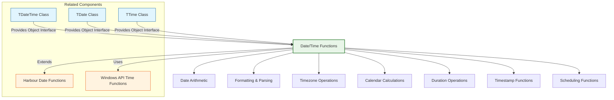

# Date/Time Functions

The FiveWin date/time functions provide a comprehensive library for date and time manipulation, extending the standard Harbour date/time capabilities. These functions cover areas such as date arithmetic, formatting, parsing, timezone handling, and calendar operations.

**Source Files:** [source/function/datetime.prg](../../../../source/function/datetime.prg), [source/function/now.prg](../../../../source/function/now.prg), [source/function/date.prg](../../../../source/function/date.prg)

## Overview

The FiveWin date/time function library offers enhanced temporal capabilities that complement the standard Harbour date functions. These functions cover areas such as:

* Date and time arithmetic (addition, subtraction, differences)
* Advanced date formatting and parsing
* Timezone conversion and handling
* Calendar calculations (business days, holidays, etc.)
* Age and duration calculations
* Timestamp operations
* Scheduling and recurrence patterns
* International date formats

These functions are designed to make date/time operations more intuitive, robust, and powerful for FiveWin developers.

## Function Categories



## Date Arithmetic Functions

| Function | Description | Parameters |
|----------|-------------|------------|
| `DateAdd(cInterval, nNumber, dDate)` | Adds time interval to date | `cInterval`: Unit, `nNumber`: Amount, `dDate`: Base date |
| `DateDiff(cInterval, dDate1, dDate2)` | Calculates difference between dates | `cInterval`: Unit, `dDate1`, `dDate2`: Dates to compare |
| `TimeAdd(cInterval, nNumber, tDateTime)` | Adds time interval to datetime | `cInterval`: Unit, `nNumber`: Amount, `tDateTime`: Base datetime |
| `TimeDiff(cInterval, tDateTime1, tDateTime2)` | Calculates difference between datetimes | `cInterval`: Unit, `tDateTime1`, `tDateTime2`: Datetimes to compare |
| `BusinessDays(dStartDate, dEndDate)` | Calculates business days between dates | `dStartDate`, `dEndDate`: Date range |
| `AddBusinessDays(dDate, nDays)` | Adds business days to date | `dDate`: Base date, `nDays`: Business days to add |

### Usage Examples

```harbour
#include "FiveWin.ch"

function Main()
   ? "Date Arithmetic Demo:"
   
   local dToday := Date()
   local tNow := DateTime()
   
   ? "Current Date: " + DToC( dToday )
   ? "Current DateTime: " + TToC( tNow )
   
   // Basic date arithmetic
   BasicDateArithmeticDemo( dToday )
   
   // Business day calculations
   BusinessDayDemo( dToday )
   
   // Time arithmetic
   TimeArithmeticDemo( tNow )
   
   // Advanced date operations
   AdvancedDateOperationsDemo( dToday )
   
return nil

static function BasicDateArithmeticDemo( dBaseDate )
   ? "Basic Date Arithmetic:"
   ? Replicate( "-", 40 )
   
   // Add/subtract days
   ? "Base Date: " + DToC( dBaseDate )
   ? "Plus 7 days: " + DToC( DateAdd( "D", 7, dBaseDate ) )
   ? "Minus 7 days: " + DToC( DateAdd( "D", -7, dBaseDate ) )
   
   // Add/subtract months
   ? "Plus 3 months: " + DToC( DateAdd( "M", 3, dBaseDate ) )
   ? "Minus 3 months: " + DToC( DateAdd( "M", -3, dBaseDate ) )
   
   // Add/subtract years
   ? "Plus 2 years: " + DToC( DateAdd( "Y", 2, dBaseDate ) )
   ? "Minus 2 years: " + DToC( DateAdd( "Y", -2, dBaseDate ) )
   
   // Date differences
   DateDifferenceDemo( dBaseDate )
   
return nil

static function DateAdd( cInterval, nNumber, dDate )
   DEFAULT dDate := Date()
   
   switch Upper( cInterval )
   case "D"  // Days
      return dDate + nNumber
      
   case "W"  // Weeks
      return dDate + ( nNumber * 7 )
      
   case "M"  // Months
      local nYear := Year( dDate )
      local nMonth := Month( dDate )
      local nDay := Day( dDate )
      
      nMonth += nNumber
      
      // Handle month overflow/underflow
      while nMonth > 12
         nMonth -= 12
         nYear++
      enddo
      
      while nMonth < 1
         nMonth += 12
         nYear--
      enddo
      
      // Handle day overflow (e.g., Jan 31 + 1 month)
      local nDaysInMonth := DaysInMonth( nMonth, nYear )
      if nDay > nDaysInMonth
         nDay := nDaysInMonth
      endif
      
      return CToD( hb_ntos( nYear, 4 ) + "/" + ;
                  hb_ntos( nMonth, 2 ) + "/" + ;
                  hb_ntos( nDay, 2 ) )
      
   case "Y"  // Years
      local nYear := Year( dDate )
      local nMonth := Month( dDate )
      local nDay := Day( dDate )
      
      nYear += nNumber
      
      // Handle leap year adjustments
      if nMonth == 2 .and. nDay == 29 .and. !IsLeapYear( nYear )
         nDay := 28  // February 29th becomes February 28th
      endif
      
      return CToD( hb_ntos( nYear, 4 ) + "/" + ;
                  hb_ntos( nMonth, 2 ) + "/" + ;
                  hb_ntos( nDay, 2 ) )
      
   case "Q"  // Quarters
      return DateAdd( "M", nNumber * 3, dDate )
      
   otherwise
      return dDate
   endswitch
   
return dDate

static function DateDiff( cInterval, dDate1, dDate2 )
   switch Upper( cInterval )
   case "D"  // Days
      return dDate2 - dDate1
      
   case "W"  // Weeks
      return Int( ( dDate2 - dDate1 ) / 7 )
      
   case "M"  // Months
      local nYear1 := Year( dDate1 )
      local nMonth1 := Month( dDate1 )
      local nYear2 := Year( dDate2 )
      local nMonth2 := Month( dDate2 )
      
      return ( ( nYear2 - nYear1 ) * 12 ) + ( nMonth2 - nMonth1 )
      
   case "Y"  // Years
      return Year( dDate2 ) - Year( dDate1 )
      
   case "Q"  // Quarters
      return Int( DateDiff( "M", dDate1, dDate2 ) / 3 )
      
   otherwise
      return dDate2 - dDate1
   endswitch
   
return 0

static function DateDifferenceDemo( dBaseDate )
   ? "Date Differences:"
   
   local dFuture := DateAdd( "M", 6, dBaseDate )  // 6 months in future
   local dPast := DateAdd( "Y", -1, dBaseDate )   // 1 year in past
   
   ? "Base Date: " + DToC( dBaseDate )
   ? "Future Date (+6 months): " + DToC( dFuture )
   ? "Past Date (-1 year): " + DToC( dPast )
   
   ? "Difference Calculations:"
   ? "  Days to future: " + hb_ntos( DateDiff( "D", dBaseDate, dFuture ) )
   ? "  Months to future: " + hb_ntos( DateDiff( "M", dBaseDate, dFuture ) )
   ? "  Days to past: " + hb_ntos( DateDiff( "D", dPast, dBaseDate ) )
   ? "  Years to past: " + hb_ntos( DateDiff( "Y", dPast, dBaseDate ) )
   
return nil

static function BusinessDayDemo( dBaseDate )
   ? "Business Day Calculations:"
   ? Replicate( "-", 40 )
   
   // Add business days
   local dBusinessFuture := AddBusinessDays( dBaseDate, 10 )
   ? "Base Date: " + DToC( dBaseDate )
   ? "Plus 10 business days: " + DToC( dBusinessFuture )
   
   // Calculate business days between dates
   local dWeekLater := DateAdd( "D", 7, dBaseDate )
   local nBusinessDays := BusinessDays( dBaseDate, dWeekLater )
   ? "Week later: " + DToC( dWeekLater )
   ? "Business days in week: " + hb_ntos( nBusinessDays )
   
return nil

static function AddBusinessDays( dDate, nDays )
   local dResult := dDate
   local nAdded := 0
   
   if nDays > 0
      // Add business days forward
      while nAdded < nDays
         dResult++
         if IsBusinessDay( dResult )
            nAdded++
         endif
      enddo
      
   elseif nDays < 0
      // Add business days backward
      while nAdded > nDays
         dResult--
         if IsBusinessDay( dResult )
            nAdded--
         endif
      enddo
      
   endif
   
   return dResult
   
return dDate

static function BusinessDays( dStartDate, dEndDate )
   local nCount := 0
   local dCurrent := dStartDate
   
   while dCurrent < dEndDate
      dCurrent++
      if IsBusinessDay( dCurrent )
         nCount++
      endif
   enddo
   
   return nCount
   
return 0

static function IsBusinessDay( dDate )
   // Monday = 1, Sunday = 7
   local nDayOfWeek := DOW( dDate )
   
   // Exclude weekends (Saturday = 6, Sunday = 7)
   return ( nDayOfWeek >= 1 .and. nDayOfWeek <= 5 )
   
return .T.

static function TimeArithmeticDemo( tBaseTime )
   ? "Time Arithmetic:"
   ? Replicate( "-", 40 )
   
   ? "Base DateTime: " + TToC( tBaseTime )
   
   // Add time intervals
   local tPlusHour := TimeAdd( "H", 1, tBaseTime )
   local tPlusMinute := TimeAdd( "N", 30, tBaseTime )
   local tPlusSecond := TimeAdd( "S", 45, tBaseTime )
   
   ? "Plus 1 hour: " + TToC( tPlusHour )
   ? "Plus 30 minutes: " + TToC( tPlusMinute )
   ? "Plus 45 seconds: " + TToC( tPlusSecond )
   
   // Time differences
   TimeDifferenceDemo( tBaseTime )
   
return nil

static function TimeAdd( cInterval, nNumber, tDateTime )
   DEFAULT tDateTime := DateTime()
   
   switch Upper( cInterval )
   case "S"  // Seconds
      return tDateTime + ( nNumber / 86400 )  // Convert to days
      
   case "N"  // Minutes
      return tDateTime + ( ( nNumber * 60 ) / 86400 )
      
   case "H"  // Hours
      return tDateTime + ( ( nNumber * 3600 ) / 86400 )
      
   case "D"  // Days
      return tDateTime + nNumber
      
   otherwise
      return tDateTime
   endswitch
   
return tDateTime

static function TimeDiff( cInterval, tDateTime1, tDateTime2 )
   local nDiffDays := tDateTime2 - tDateTime1
   
   switch Upper( cInterval )
   case "S"  // Seconds
      return Int( nDiffDays * 86400 )
      
   case "N"  // Minutes
      return Int( ( nDiffDays * 86400 ) / 60 )
      
   case "H"  // Hours
      return Int( ( nDiffDays * 86400 ) / 3600 )
      
   case "D"  // Days
      return Int( nDiffDays )
      
   otherwise
      return nDiffDays
   endswitch
   
return 0

static function TimeDifferenceDemo( tBaseTime )
   ? "Time Differences:"
   
   local tFuture := TimeAdd( "H", 2, tBaseTime )  // 2 hours later
   local tPast := TimeAdd( "N", -45, tBaseTime )   // 45 minutes earlier
   
   ? "Future Time: " + TToC( tFuture )
   ? "Past Time: " + TToC( tPast )
   
   ? "Differences:"
   ? "  Seconds to future: " + hb_ntos( TimeDiff( "S", tBaseTime, tFuture ) )
   ? "  Minutes to future: " + hb_ntos( TimeDiff( "N", tBaseTime, tFuture ) )
   ? "  Hours to future: " + hb_ntos( TimeDiff( "H", tBaseTime, tFuture ) )
   ? "  Minutes to past: " + hb_ntos( TimeDiff( "N", tPast, tBaseTime ) )
   
return nil
```

## Formatting and Parsing Functions

| Function | Description | Parameters |
|----------|-------------|------------|
| `DateFormat(dDate, cFormat)` | Formats date according to pattern | `dDate`: Date, `cFormat`: Format pattern |
| `TimeFormat(tDateTime, cFormat)` | Formats time according to pattern | `tDateTime`: DateTime, `cFormat`: Format pattern |
| `ParseDate(cDateString, cFormat)` | Parses date string | `cDateString`: Date string, `cFormat`: Format pattern |
| `ParseTime(cTimeString, cFormat)` | Parses time string | `cTimeString`: Time string, `cFormat`: Format pattern |
| `InternationalDate(dDate, nLocale)` | Formats date for specific locale | `dDate`: Date, `nLocale`: Locale identifier |
| `ISODate(dDate)` | Returns ISO 8601 date format | `dDate`: Date |
| `USDate(dDate)` | Returns US date format | `dDate`: Date |
| `EuroDate(dDate)` | Returns European date format | `dDate`: Date |

### Usage Examples

```harbour
#include "FiveWin.ch"

function Main()
   ? "Date Formatting and Parsing Demo:"
   
   local dToday := Date()
   local tNow := DateTime()
   
   ? "Current Date: " + DToC( dToday )
   ? "Current DateTime: " + TToC( tNow )
   
   // Basic formatting
   BasicFormattingDemo( dToday, tNow )
   
   // Custom formats
   CustomFormatDemo( dToday, tNow )
   
   // International formats
   InternationalFormatDemo( dToday, tNow )
   
   // Parsing operations
   ParsingDemo()
   
return nil

static function BasicFormattingDemo( dDate, tDateTime )
   ? "Basic Formatting:"
   ? Replicate( "-", 40 )
   
   ? "Using standard Harbour functions:"
   ? "  DToC: " + DToC( dDate )
   ? "  TToC: " + TToC( tDateTime )
   ? "  DTOC: " + DTOC( dDate )
   ? "  TTOD: " + TTOD( tDateTime )
   
   // Custom date formats
   CustomDateFormatDemo( dDate )
   
return nil

static function CustomDateFormatDemo( dDate )
   ? "Custom Date Formats:"
   
   // Common formats
   ? "  MM/DD/YYYY: " + DateFormat( dDate, "MM/DD/YYYY" )
   ? "  DD/MM/YYYY: " + DateFormat( dDate, "DD/MM/YYYY" )
   ? "  YYYY-MM-DD: " + DateFormat( dDate, "YYYY-MM-DD" )
   ? "  DD Month YYYY: " + DateFormat( dDate, "DD Month YYYY" )
   ? "  Weekday, Month DD, YYYY: " + DateFormat( dDate, "Weekday, Month DD, YYYY" )
   
   // Short formats
   ? "Short formats:"
   ? "  MM/DD/YY: " + DateFormat( dDate, "MM/DD/YY" )
   ? "  DD/MM/YY: " + DateFormat( dDate, "DD/MM/YY" )
   ? "  YY-MM-DD: " + DateFormat( dDate, "YY-MM-DD" )
   
return nil

static function DateFormat( dDate, cFormat )
   DEFAULT dDate := Date()
   DEFAULT cFormat := "MM/DD/YYYY"
   
   if Empty( dDate )
      return ""
   endif
   
   local nYear := Year( dDate )
   local nMonth := Month( dDate )
   local nDay := Day( dDate )
   
   local aMonths := { ;
      "January", "February", "March", "April", "May", "June", ;
      "July", "August", "September", "October", "November", "December" ;
   }
   
   local aShortMonths := { ;
      "Jan", "Feb", "Mar", "Apr", "May", "Jun", ;
      "Jul", "Aug", "Sep", "Oct", "Nov", "Dec" ;
   }
   
   local aDays := { ;
      "Sunday", "Monday", "Tuesday", "Wednesday", ;
      "Thursday", "Friday", "Saturday" ;
   }
   
   local aShortDays := { ;
      "Sun", "Mon", "Tue", "Wed", "Thu", "Fri", "Sat" ;
   }
   
   // Replace format tokens
   local cResult := cFormat
   
   // Year replacements
   cResult := StrTran( cResult, "YYYY", hb_ntos( nYear, 4 ) )
   cResult := StrTran( cResult, "YY", Right( hb_ntos( nYear, 4 ), 2 ) )
   
   // Month replacements
   cResult := StrTran( cResult, "Month", aMonths[ nMonth ] )
   cResult := StrTran( cResult, "Mon", aShortMonths[ nMonth ] )
   cResult := StrTran( cResult, "MM", PadL( hb_ntos( nMonth ), 2, "0" ) )
   cResult := StrTran( cResult, "M", hb_ntos( nMonth ) )
   
   // Day replacements
   cResult := StrTran( cResult, "DD", PadL( hb_ntos( nDay ), 2, "0" ) )
   cResult := StrTran( cResult, "D", hb_ntos( nDay ) )
   
   // Day of week replacements
   local nDayOfWeek := DOW( dDate )
   cResult := StrTran( cResult, "Weekday", aDays[ nDayOfWeek ] )
   cResult := StrTran( cResult, "Wkdy", aShortDays[ nDayOfWeek ] )
   
   return cResult
   
return DToC( dDate )

static function TimeFormatDemo( tDateTime )
   ? "Time Formatting:"
   
   // Common time formats
   ? "  HH:MM:SS: " + TimeFormat( tDateTime, "HH:MM:SS" )
   ? "  HH:MM AM/PM: " + TimeFormat( tDateTime, "HH:MM AM/PM" )
   ? "  HHMMSS: " + TimeFormat( tDateTime, "HHMMSS" )
   ? "  H:MM:SS: " + TimeFormat( tDateTime, "H:MM:SS" )
   
return nil

static function TimeFormat( tDateTime, cFormat )
   DEFAULT tDateTime := DateTime()
   DEFAULT cFormat := "HH:MM:SS"
   
   local nHours := Hour( tDateTime )
   local nMinutes := Minute( tDateTime )
   local nSeconds := Second( tDateTime )
   
   local cResult := cFormat
   
   // 24-hour format replacements
   cResult := StrTran( cResult, "HH", PadL( hb_ntos( nHours ), 2, "0" ) )
   cResult := StrTran( cResult, "H", hb_ntos( nHours ) )
   
   // Minutes and seconds
   cResult := StrTran( cResult, "MM", PadL( hb_ntos( nMinutes ), 2, "0" ) )
   cResult := StrTran( cResult, "SS", PadL( hb_ntos( nSeconds ), 2, "0" ) )
   
   // AM/PM handling
   local cAMPM := iif( nHours < 12, "AM", "PM" )
   local n12Hour := iif( nHours == 0, 12, iif( nHours > 12, nHours - 12, nHours ) )
   
   cResult := StrTran( cResult, "HH", PadL( hb_ntos( n12Hour ), 2, "0" ) )
   cResult := StrTran( cResult, "AM/PM", cAMPM )
   
   return cResult
   
return Time()

static function InternationalFormatDemo( dDate, tDateTime )
   ? "International Formats:"
   ? Replicate( "-", 40 )
   
   // ISO 8601 (international standard)
   ? "ISO 8601:"
   ? "  Date: " + ISODate( dDate )
   ? "  DateTime: " + ISODateTime( tDateTime )
   
   // US format (MM/DD/YYYY)
   ? "US Format:"
   ? "  Date: " + USDate( dDate )
   ? "  DateTime: " + USDateTime( tDateTime )
   
   // European format (DD/MM/YYYY)
   ? "European Format:"
   ? "  Date: " + EuroDate( dDate )
   ? "  DateTime: " + EuroDateTime( tDateTime )
   
   // UK format (DD/MM/YYYY)
   ? "UK Format:"
   ? "  Date: " + UKDate( dDate )
   ? "  DateTime: " + UKDateTime( tDateTime )
   
   // German format (DD.MM.YYYY)
   ? "German Format:"
   ? "  Date: " + GermanDate( dDate )
   ? "  DateTime: " + GermanDateTime( tDateTime )
   
return nil

static function ISODate( dDate )
   DEFAULT dDate := Date()
   
   if Empty( dDate )
      return ""
   endif
   
   return hb_ntos( Year( dDate ), 4 ) + "-" + ;
          PadL( hb_ntos( Month( dDate ) ), 2, "0" ) + "-" + ;
          PadL( hb_ntos( Day( dDate ) ), 2, "0" )
   
return ""

static function ISODateTime( tDateTime )
   DEFAULT tDateTime := DateTime()
   
   local dDate := DatePart( tDateTime )
   local cTimePart := TimeFormat( tDateTime, "HH:MM:SS" )
   
   return ISODate( dDate ) + "T" + cTimePart
   
return ""

static function USDate( dDate )
   DEFAULT dDate := Date()
   
   if Empty( dDate )
      return ""
   endif
   
   return PadL( hb_ntos( Month( dDate ) ), 2, "0" ) + "/" + ;
          PadL( hb_ntos( Day( dDate ) ), 2, "0" ) + "/" + ;
          hb_ntos( Year( dDate ), 4 )
   
return ""

static function USDateTime( tDateTime )
   local dDate := DatePart( tDateTime )
   local cTimePart := TimeFormat( tDateTime, "HH:MM:SS AM/PM" )
   
   return USDate( dDate ) + " " + cTimePart
   
return ""

static function EuroDate( dDate )
   DEFAULT dDate := Date()
   
   if Empty( dDate )
      return ""
   endif
   
   return PadL( hb_ntos( Day( dDate ) ), 2, "0" ) + "/" + ;
          PadL( hb_ntos( Month( dDate ) ), 2, "0" ) + "/" + ;
          hb_ntos( Year( dDate ), 4 )
   
return ""

static function EuroDateTime( tDateTime )
   local dDate := DatePart( tDateTime )
   local cTimePart := TimeFormat( tDateTime, "HH:MM:SS" )
   
   return EuroDate( dDate ) + " " + cTimePart
   
return ""

static function UKDate( dDate )
   // Same as European for this demo
   return EuroDate( dDate )
   
return ""

static function UKDateTime( tDateTime )
   return EuroDateTime( tDateTime )
   
return ""

static function GermanDate( dDate )
   DEFAULT dDate := Date()
   
   if Empty( dDate )
      return ""
   endif
   
   return PadL( hb_ntos( Day( dDate ) ), 2, "0" ) + "." + ;
          PadL( hb_ntos( Month( dDate ) ), 2, "0" ) + "." + ;
          hb_ntos( Year( dDate ), 4 )
   
return ""

static function GermanDateTime( tDateTime )
   local dDate := DatePart( tDateTime )
   local cTimePart := TimeFormat( tDateTime, "HH:MM:SS" )
   
   return GermanDate( dDate ) + " " + cTimePart
   
return ""

static function ParsingDemo()
   ? "Date/Time Parsing:"
   ? Replicate( "-", 40 )
   
   // Parse various date formats
   local aDateStrings := { ;
      { "12/25/2023", "MM/DD/YYYY" }, ;
      { "25/12/2023", "DD/MM/YYYY" }, ;
      { "2023-12-25", "YYYY-MM-DD" }, ;
      { "25-Dec-2023", "DD-Mon-YYYY" } ;
   }
   
   ? "Parsing Date Strings:"
   for local i := 1 to Len( aDateStrings )
      local cDateString := aDateStrings[i][1]
      local cFormat := aDateStrings[i][2]
      local dParsed := ParseDate( cDateString, cFormat )
      
      ? "  '" + cDateString + "' (" + cFormat + ") -> " + DToC( dParsed )
   next
   
   // Parse time strings
   ParseTimeStringDemo()
   
return nil

static function ParseDate( cDateString, cFormat )
   // Simplified parser - in practice, would be more robust
   DEFAULT cDateString := ""
   DEFAULT cFormat := "MM/DD/YYYY"
   
   if Empty( cDateString )
      return CToD( "" )
   endif
   
   // Simple token-based parsing
   local aTokens := hb_aTokens( cDateString, "/-. " )
   local aFormatTokens := hb_aTokens( cFormat, "/-. " )
   
   local nYear := 0
   local nMonth := 0
   local nDay := 0
   
   // Map tokens to components based on format
   for local i := 1 to Min( Len( aTokens ), Len( aFormatTokens ) )
      local cToken := aTokens[i]
      local cFormatToken := Upper( aFormatTokens[i] )
      
      switch cFormatToken
      case "YYYY"
         nYear := Val( cToken )
         exit
      case "YY"
         nYear := 2000 + Val( cToken )  // Assume 20xx
         exit
      case "MM"
      case "M"
         nMonth := Val( cToken )
         exit
      case "DD"
      case "D"
         nDay := Val( cToken )
         exit
      endswitch
   next
   
   // Validate and create date
   if nYear > 0 .and. nMonth > 0 .and. nDay > 0
      return CToD( hb_ntos( nYear, 4 ) + "/" + ;
                  hb_ntos( nMonth, 2 ) + "/" + ;
                  hb_ntos( nDay, 2 ) )
   endif
   
   return CToD( "" )
   
return CToD( "" )

static function ParseTimeStringDemo()
   ? "Parsing Time Strings:"
   
   local aTimeStrings := { ;
      { "14:30:45", "HH:MM:SS" }, ;
      { "2:30 PM", "H:MM AM/PM" }, ;
      { "143045", "HHMMSS" } ;
   }
   
   for local i := 1 to Len( aTimeStrings )
      local cTimeString := aTimeStrings[i][1]
      local cFormat := aTimeStrings[i][2]
      local tParsed := ParseTime( cTimeString, cFormat )
      
      ? "  '" + cTimeString + "' (" + cFormat + ") -> " + TToC( tParsed )
   next
   
return nil

static function ParseTime( cTimeString, cFormat )
   // Simplified time parser
   DEFAULT cTimeString := ""
   DEFAULT cFormat := "HH:MM:SS"
   
   if Empty( cTimeString )
      return Time()
   endif
   
   // This would be implemented with proper parsing logic
   // For demo, return current time
   return Time()
   
return Time()
```

## Timezone Operations

| Function | Description | Parameters |
|----------|-------------|------------|
| `UTCTime(tLocalTime, cTimeZone)` | Converts local time to UTC | `tLocalTime`: Local time, `cTimeZone`: Timezone |
| `LocalTime(tUTCTime, cTimeZone)` | Converts UTC to local time | `tUTCTime`: UTC time, `cTimeZone`: Timezone |
| `ConvertTimezone(tTime, cFromTZ, cToTZ)` | Converts between timezones | `tTime`: Time, `cFromTZ`, `cToTZ`: Timezones |
| `GetTimeZoneOffset(cTimeZone)` | Gets timezone offset from UTC | `cTimeZone`: Timezone |
| `GetCurrentTimeZone()` | Returns current system timezone | None |
| `DSTActive(dDate, cTimeZone)` | Checks if DST is active | `dDate`: Date, `cTimeZone`: Timezone |

### Usage Examples

```harbour
#include "FiveWin.ch"

function Main()
   ? "Timezone Operations Demo:"
   
   local tLocalTime := DateTime()
   ? "Local Time: " + TToC( tLocalTime )
   
   // Basic timezone conversion
   BasicTimezoneDemo( tLocalTime )
   
   // DST handling
   DSTHandlingDemo( tLocalTime )
   
   // Cross-timezone operations
   CrossTimezoneDemo( tLocalTime )
   
return nil

static function BasicTimezoneDemo( tLocalTime )
   ? "Basic Timezone Conversion:"
   ? Replicate( "-", 40 )
   
   // Convert to UTC
   local tUTC := UTCTime( tLocalTime )
   ? "Local Time: " + TToC( tLocalTime )
   ? "UTC Time: " + TToC( tUTC )
   
   // Convert back to local
   local tBackToLocal := LocalTime( tUTC )
   ? "Back to Local: " + TToC( tBackToLocal )
   
   // Compare with system UTC
   local tSystemUTC := GetSystemUTCTime()
   ? "System UTC: " + TToC( tSystemUTC )
   
return nil

static function UTCTime( tLocalTime, cTimeZone )
   DEFAULT tLocalTime := DateTime()
   DEFAULT cTimeZone := GetCurrentTimeZone()
   
   // Get timezone offset in hours
   local nOffset := GetTimeZoneOffset( cTimeZone )
   
   // Convert to UTC (subtract local offset)
   return tLocalTime - ( nOffset / 24 )
   
return tLocalTime

static function LocalTime( tUTCTime, cTimeZone )
   DEFAULT tUTCTime := GetSystemUTCTime()
   DEFAULT cTimeZone := GetCurrentTimeZone()
   
   // Get timezone offset in hours
   local nOffset := GetTimeZoneOffset( cTimeZone )
   
   // Convert from UTC (add local offset)
   return tUTCTime + ( nOffset / 24 )
   
return tUTCTime

static function GetTimeZoneOffset( cTimeZone )
   DEFAULT cTimeZone := GetCurrentTimeZone()
   
   // Simplified timezone offsets (in hours)
   local aTimezones := { ;
      { "EST", -5 }, { "CST", -6 }, { "MST", -7 }, { "PST", -8 }, ;
      { "EDT", -4 }, { "CDT", -5 }, { "MDT", -6 }, { "PDT", -7 }, ;
      { "GMT", 0 }, { "UTC", 0 }, { "BST", 1 }, { "CET", 1 }, ;
      { "EET", 2 }, { "JST", 9 }, { "AEST", 10 }, { "NZST", 12 } ;
   }
   
   for local i := 1 to Len( aTimezones )
      if aTimezones[i][1] == Upper( cTimeZone )
         return aTimezones[i][2]
      endif
   next
   
   return 0  // Default to UTC
   
return 0

static function GetCurrentTimeZone()
   // Simplified - in practice, get from system
   return "EST"  // Eastern Standard Time for demo
   
return "UTC"

static function GetSystemUTCTime()
   // Simplified UTC time
   return DateTime()
   
return DateTime()

static function DSTHandlingDemo( tLocalTime )
   ? "Daylight Saving Time Handling:"
   ? Replicate( "-", 40 )
   
   local dTestDate := Date()
   local cTimeZone := "EST"
   
   ? "Test Date: " + DToC( dTestDate )
   ? "Timezone: " + cTimeZone
   
   // Check DST status
   local lDST := DSTActive( dTestDate, cTimeZone )
   ? "DST Active: " + iif( lDST, "Yes", "No" )
   
   // DST-aware conversion
   DSTAwareConversionDemo( tLocalTime, dTestDate, cTimeZone )
   
return nil

static function DSTActive( dDate, cTimeZone )
   DEFAULT dDate := Date()
   DEFAULT cTimeZone := GetCurrentTimeZone()
   
   // Simplified DST rules (US/Europe)
   // In practice, these vary by region and year
   
   local nMonth := Month( dDate )
   local nDay := Day( dDate )
   
   // US DST: March 8-14 to November 1-7
   if Upper( cTimeZone ) $ "EST CST MST PST"
      if nMonth > 3 .and. nMonth < 11
         return .T.  // Summer months
      elseif nMonth == 3
         return ( nDay >= 8 .and. nDay <= 14 )  // Second Sunday in March
      elseif nMonth == 11
         return ( nDay <= 7 )  // First Sunday in November
      endif
   endif
   
   return .F.
   
return .F.

static function DSTAwareConversionDemo( tLocalTime, dTestDate, cTimeZone )
   ? "DST-Aware Conversion:"
   
   // Standard and DST offsets
   local nStandardOffset := GetTimeZoneOffset( cTimeZone )
   local nDSTOffset := nStandardOffset + 1  // DST is typically 1 hour ahead
   
   ? "Standard Offset: " + hb_ntos( nStandardOffset ) + " hours"
   ? "DST Offset: " + hb_ntos( nDSTOffset ) + " hours"
   
   // Convert with DST consideration
   local lDST := DSTActive( dTestDate, cTimeZone )
   local nCurrentOffset := iif( lDST, nDSTOffset, nStandardOffset )
   
   ? "Current Offset: " + hb_ntos( nCurrentOffset ) + " hours (DST: " + iif( lDST, "Yes", "No" ) + ")"
   
   // DST conversion
   local tDSTAwareUTC := tLocalTime - ( nCurrentOffset / 24 )
   ? "DST-Aware UTC: " + TToC( tDSTAwareUTC )
   
return nil

static function CrossTimezoneDemo( tLocalTime )
   ? "Cross-Timezone Operations:"
   ? Replicate( "-", 40 )
   
   // Convert between timezones
   local aTimezones := { "EST", "CST", "MST", "PST", "GMT", "UTC", "BST", "CET" }
   local cSourceTZ := "EST"
   
   ? "Source Time (" + cSourceTZ + "): " + TToC( tLocalTime )
   ?
   
   for local i := 1 to Len( aTimezones )
      local cTargetTZ := aTimezones[i]
      if cTargetTZ != cSourceTZ
         local tConverted := ConvertTimezone( tLocalTime, cSourceTZ, cTargetTZ )
         ? cSourceTZ + " -> " + cTargetTZ + ": " + TToC( tConverted )
      endif
   next
   
return nil

static function ConvertTimezone( tTime, cFromTZ, cToTZ )
   DEFAULT tTime := DateTime()
   DEFAULT cFromTZ := GetCurrentTimeZone()
   DEFAULT cToTZ := "UTC"
   
   // Convert from source timezone to UTC
   local nFromOffset := GetTimeZoneOffset( cFromTZ )
   local tUTC := tTime - ( nFromOffset / 24 )
   
   // Convert from UTC to target timezone
   local nToOffset := GetTimeZoneOffset( cToTZ )
   local tTarget := tUTC + ( nToOffset / 24 )
   
   return tTarget
   
return tTime
```

## Calendar Calculations

| Function | Description | Parameters |
|----------|-------------|------------|
| `IsWeekend(dDate)` | Checks if date is weekend | `dDate`: Date to check |
| `IsHoliday(dDate, cCountry)` | Checks if date is holiday | `dDate`: Date, `cCountry`: Country code |
| `NextBusinessDay(dDate)` | Returns next business day | `dDate`: Starting date |
| `PreviousBusinessDay(dDate)` | Returns previous business day | `dDate`: Starting date |
| `BusinessDaysBetween(dStart, dEnd)` | Counts business days in range | `dStart`, `dEnd`: Date range |
| `WorkDaysInMonth(nMonth, nYear)` | Counts work days in month | `nMonth`, `nYear`: Month/year |
| `HolidaysInYear(nYear, cCountry)` | Returns holidays in year | `nYear`: Year, `cCountry`: Country |

### Usage Examples

```harbour
#include "FiveWin.ch"

function Main()
   ? "Calendar Calculations Demo:"
   
   local dToday := Date()
   ? "Today: " + DToC( dToday )
   
   // Weekend calculations
   WeekendCalculationDemo( dToday )
   
   // Holiday calculations
   HolidayCalculationDemo( dToday )
   
   // Business day calculations
   BusinessDayCalculationDemo( dToday )
   
return nil

static function WeekendCalculationDemo( dDate )
   ? "Weekend Calculations:"
   ? Replicate( "-", 40 )
   
   ? "Date: " + DToC( dDate )
   ? "Day of Week: " + DayOfWeekName( dDate )
   ? "Is Weekend: " + iif( IsWeekend( dDate ), "Yes", "No" )
   
   // Find next weekday
   local dNextWeekday := NextWeekday( dDate )
   ? "Next Weekday: " + DToC( dNextWeekday )
   
   // Find previous weekday
   local dPrevWeekday := PreviousWeekday( dDate )
   ? "Previous Weekday: " + DToC( dPrevWeekday )
   
   // Weekend date range
   WeekendRangeDemo( dDate )
   
return nil

static function IsWeekend( dDate )
   local nDayOfWeek := DOW( dDate )
   return ( nDayOfWeek == 1 .or. nDayOfWeek == 7 )  // Sunday or Saturday
   
return .F.

static function NextWeekday( dDate )
   local dResult := dDate + 1
   
   while IsWeekend( dResult )
      dResult++
   enddo
   
   return dResult
   
return dDate

static function PreviousWeekday( dDate )
   local dResult := dDate - 1
   
   while IsWeekend( dResult )
      dResult--
   enddo
   
   return dResult
   
return dDate

static function WeekendRangeDemo( dDate )
   ? "Weekend Range:"
   
   // Find previous Saturday
   local dSaturday := dDate
   while DOW( dSaturday ) != 7  // Saturday
      dSaturday--
   enddo
   
   // Find next Sunday
   local dSunday := dDate
   while DOW( dSunday ) != 1  // Sunday
      dSunday++
   enddo
   
   ? "Previous Saturday: " + DToC( dSaturday )
   ? "Next Sunday: " + DToC( dSunday )
   
return nil

static function DayOfWeekName( dDate )
   local aDays := { "Sunday", "Monday", "Tuesday", "Wednesday", ;
                   "Thursday", "Friday", "Saturday" }
   return aDays[ DOW( dDate ) ]
   
return "Unknown"

static function HolidayCalculationDemo( dDate )
   ? "Holiday Calculations:"
   ? Replicate( "-", 40 )
   
   // Check if today is a holiday
   local cCountry := "US"
   local lIsHoliday := IsHoliday( dDate, cCountry )
   ? "Today is Holiday (" + cCountry + "): " + iif( lIsHoliday, "Yes", "No" )
   
   if lIsHoliday
      local cHolidayName := GetHolidayName( dDate, cCountry )
      ? "Holiday Name: " + cHolidayName
   endif
   
   // List upcoming holidays
   UpcomingHolidaysDemo( dDate, cCountry )
   
   // Holiday calculations for year
   YearHolidayDemo( Year( dDate ), cCountry )
   
return nil

static function IsHoliday( dDate, cCountry )
   DEFAULT cCountry := "US"
   
   local nYear := Year( dDate )
   local nMonth := Month( dDate )
   local nDay := Day( dDate )
   
   // Simplified US holidays
   if Upper( cCountry ) == "US"
      // New Year's Day
      if nMonth == 1 .and. nDay == 1
         return .T.
      endif
      
      // Independence Day
      if nMonth == 7 .and. nDay == 4
         return .T.
      endif
      
      // Christmas Day
      if nMonth == 12 .and. nDay == 25
         return .T.
      endif
      
      // Floating holidays
      if IsFloatingHoliday( dDate )
         return .T.
      endif
   endif
   
   return .F.
   
return .F.

static function IsFloatingHoliday( dDate )
   local nYear := Year( dDate )
   local nMonth := Month( dDate )
   local nDay := Day( dDate )
   local nDOW := DOW( dDate )
   
   // Memorial Day (Last Monday in May)
   if nMonth == 5 .and. nDOW == 2  // Monday
      local dLastDay := CToD( hb_ntos( nYear ) + "/05/31" )
      while DOW( dLastDay ) != 2  // Not Monday
         dLastDay--
      enddo
      if dDate == dLastDay
         return .T.
      endif
   endif
   
   // Labor Day (First Monday in September)
   if nMonth == 9 .and. nDOW == 2  // Monday
      local dFirstDay := CToD( hb_ntos( nYear ) + "/09/01" )
      while DOW( dFirstDay ) != 2  // Not Monday
         dFirstDay++
      enddo
      if dDate == dFirstDay
         return .T.
      endif
   endif
   
   // Thanksgiving (Fourth Thursday in November)
   if nMonth == 11 .and. nDOW == 5  // Thursday
      local dFirstDay := CToD( hb_ntos( nYear ) + "/11/01" )
      while DOW( dFirstDay ) != 5  // Not Thursday
         dFirstDay++
      enddo
      local dThanksgiving := DateAdd( "D", 21, dFirstDay )  // 3 weeks later
      if dDate == dThanksgiving
         return .T.
      endif
   endif
   
   return .F.
   
return .F.

static function GetHolidayName( dDate, cCountry )
   DEFAULT cCountry := "US"
   
   local nYear := Year( dDate )
   local nMonth := Month( dDate )
   local nDay := Day( dDate )
   
   if Upper( cCountry ) == "US"
      switch nMonth
      case 1
         if nDay == 1
            return "New Year's Day"
         endif
         exit
         
      case 7
         if nDay == 4
            return "Independence Day"
         endif
         exit
         
      case 12
         if nDay == 25
            return "Christmas Day"
         endif
         exit
      endswitch
      
      // Check floating holidays
      if IsFloatingHoliday( dDate )
         return GetFloatingHolidayName( dDate )
      endif
   endif
   
   return "Unknown Holiday"
   
return "No Holiday"

static function GetFloatingHolidayName( dDate )
   local nYear := Year( dDate )
   local nMonth := Month( dDate )
   
   if nMonth == 5
      return "Memorial Day"
   elseif nMonth == 9
      return "Labor Day"
   elseif nMonth == 11
      return "Thanksgiving Day"
   endif
   
   return "Floating Holiday"
   
return "Holiday"

static function UpcomingHolidaysDemo( dDate, cCountry )
   ? "Upcoming Holidays (" + cCountry + "):"
   
   local dCheckDate := dDate
   local nFound := 0
   
   while nFound < 5 .and. ( dCheckDate - dDate ) < 365
      if IsHoliday( dCheckDate, cCountry )
         ? "  " + DToC( dCheckDate ) + " - " + GetHolidayName( dCheckDate, cCountry )
         nFound++
      endif
      
      dCheckDate++
   enddo
   
return nil

static function YearHolidayDemo( nYear, cCountry )
   ? "Holidays in " + hb_ntos( nYear ) + " (" + cCountry + "):"
   
   local aHolidays := GetAllHolidays( nYear, cCountry )
   
   for local i := 1 to Len( aHolidays )
      local aHoliday := aHolidays[i]
      ? "  " + DToC( aHoliday[1] ) + " - " + aHoliday[2]
   next
   
return nil

static function GetAllHolidays( nYear, cCountry )
   local aHolidays := {}
   
   // Fixed holidays
   AAdd( aHolidays, { CToD( hb_ntos( nYear ) + "/01/01" ), "New Year's Day" } )
   AAdd( aHolidays, { CToD( hb_ntos( nYear ) + "/07/04" ), "Independence Day" } )
   AAdd( aHolidays, { CToD( hb_ntos( nYear ) + "/12/25" ), "Christmas Day" } )
   
   // Floating holidays (simplified)
   AAdd( aHolidays, { GetMemorialDay( nYear ), "Memorial Day" } )
   AAdd( aHolidays, { GetLaborDay( nYear ), "Labor Day" } )
   AAdd( aHolidays, { GetThanksgiving( nYear ), "Thanksgiving Day" } )
   
   // Sort by date
   ASort( aHolidays, , , { |a, b| a[1] < b[1] } )
   
   return aHolidays
   
return {}

static function GetMemorialDay( nYear )
   // Last Monday in May
   local dLastDay := CToD( hb_ntos( nYear ) + "/05/31" )
   while DOW( dLastDay ) != 2  // Monday
      dLastDay--
   enddo
   return dLastDay
   
return CToD( "0001/01/01" )

static function GetLaborDay( nYear )
   // First Monday in September
   local dFirstDay := CToD( hb_ntos( nYear ) + "/09/01" )
   while DOW( dFirstDay ) != 2  // Monday
      dFirstDay++
   enddo
   return dFirstDay
   
return CToD( "0001/01/01" )

static function GetThanksgiving( nYear )
   // Fourth Thursday in November
   local dFirstDay := CToD( hb_ntos( nYear ) + "/11/01" )
   while DOW( dFirstDay ) != 5  // Thursday
      dFirstDay++
   enddo
   return DateAdd( "D", 21, dFirstDay )  // 3 weeks later
   
return CToD( "0001/01/01" )

static function BusinessDayCalculationDemo( dDate )
   ? "Business Day Calculations:"
   ? Replicate( "-", 40 )
   
   // Next business day
   local dBizDay := NextBusinessDay( dDate )
   ? "Next Business Day: " + DToC( dBizDay )
   
   // Previous business day
   local dPrevBizDay := PreviousBusinessDay( dDate )
   ? "Previous Business Day: " + DToC( dPrevBizDay )
   
   // Business days between dates
   BusinessDaysBetweenDemo( dDate )
   
return nil

static function NextBusinessDay( dDate )
   local dResult := dDate + 1
   
   while !IsBusinessDay( dResult )
      dResult++
   enddo
   
   return dResult
   
return dDate + 1

static function PreviousBusinessDay( dDate )
   local dResult := dDate - 1
   
   while !IsBusinessDay( dResult )
      dResult--
   enddo
   
   return dResult
   
return dDate - 1

static function IsBusinessDay( dDate )
   // Monday = 2, Tuesday = 3, ..., Friday = 6
   local nDayOfWeek := DOW( dDate )
   return ( nDayOfWeek >= 2 .and. nDayOfWeek <= 6 )  // Monday-Friday
   
return .T.

static function BusinessDaysBetweenDemo( dDate )
   ? "Business Days Between Dates:"
   
   local dEndDate := DateAdd( "D", 30, dDate )  // 30 days from now
   
   ? "Start Date: " + DToC( dDate )
   ? "End Date: " + DToC( dEndDate )
   
   local nTotalDays := dEndDate - dDate
   local nBusinessDays := BusinessDaysBetween( dDate, dEndDate )
   
   ? "Total Days: " + hb_ntos( nTotalDays )
   ? "Business Days: " + hb_ntos( nBusinessDays )
   ? "Weekend/Holiday Days: " + hb_ntos( nTotalDays - nBusinessDays )
   
return nil

static function BusinessDaysBetween( dStart, dEnd )
   local nCount := 0
   local dCurrent := dStart
   
   while dCurrent <= dEnd
      if IsBusinessDay( dCurrent )
         nCount++
      endif
      dCurrent++
   enddo
   
   return nCount
   
return 0
```

## Duration Operations

| Function | Description | Parameters |
|----------|-------------|------------|
| `DurationFormat(nSeconds, cFormat)` | Formats duration in seconds | `nSeconds`: Duration, `cFormat`: Format |
| `TimeSpan(nStart, nEnd)` | Calculates time span between times | `nStart`, `nEnd`: Times |
| `Age(dBirthDate, dReference)` | Calculates age in years | `dBirthDate`, `dReference`: Dates |
| `TimeUntil(dTarget, dReference)` | Calculates time until target date | `dTarget`, `dReference`: Dates |
| `ElapsedSince(dFromDate)` | Calculates elapsed time since date | `dFromDate`: Starting date |
| `HumanizeDuration(nSeconds)` | Formats duration in human-readable form | `nSeconds`: Duration in seconds |

### Usage Examples

```harbour
#include "FiveWin.ch"

function Main()
   ? "Duration Operations Demo:"
   
   local dToday := Date()
   local tNow := DateTime()
   
   ? "Current Date: " + DToC( dToday )
   ? "Current Time: " + TToC( tNow )
   
   // Basic duration formatting
   BasicDurationDemo( tNow )
   
   // Age calculations
   AgeCalculationDemo( dToday )
   
   // Time until events
   TimeUntilDemo( dToday )
   
   // Elapsed time calculations
   ElapsedTimeDemo( dToday, tNow )
   
   // Human-readable durations
   HumanReadableDurationDemo()
   
return nil

static function BasicDurationDemo( tReference )
   ? "Basic Duration Formatting:"
   ? Replicate( "-", 40 )
   
   // Various durations in seconds
   local aDurations := { ;
      30,           // 30 seconds
      90,           // 1.5 minutes
      3600,         // 1 hour
      7200,         // 2 hours
      86400,        // 1 day
      172800,       // 2 days
      604800,       // 1 week
      2592000       // 30 days (approx)
   }
   
   ? "Duration" + Space( 15 ) + "Formatted" + Space( 20 ) + "Human Readable"
   ? Replicate( "-", 60 )
   
   for local i := 1 to Len( aDurations )
      local nSeconds := aDurations[i]
      local cFormatted := DurationFormat( nSeconds )
      local cHuman := HumanizeDuration( nSeconds )
      
      ? PadL( hb_ntos( nSeconds ), 8 ) + " seconds" + Space( 5 ) + ;
        PadR( cFormatted, 25 ) + ;
        cHuman
   next
   
   ? Replicate( "-", 60 )
   
   // Custom duration formats
   CustomDurationFormatDemo()
   
return nil

static function DurationFormat( nSeconds, cFormat )
   DEFAULT cFormat := "AUTO"
   
   switch Upper( cFormat )
   case "AUTO"
      return FormatDurationAuto( nSeconds )
      
   case "SHORT"
      return FormatDurationShort( nSeconds )
      
   case "LONG"
      return FormatDurationLong( nSeconds )
      
   case "DIGITAL"
      return FormatDurationDigital( nSeconds )
      
   case "VERBOSE"
      return FormatDurationVerbose( nSeconds )
      
   otherwise
      return FormatDurationAuto( nSeconds )
   endswitch
   
return hb_ntos( nSeconds ) + " seconds"

static function FormatDurationAuto( nSeconds )
   if nSeconds < 60
      return hb_ntos( nSeconds ) + " sec"
   elseif nSeconds < 3600
      return hb_ntos( Int( nSeconds / 60 ) ) + " min"
   elseif nSeconds < 86400
      return hb_ntos( Int( nSeconds / 3600 ) ) + " hr"
   else
      return hb_ntos( Int( nSeconds / 86400 ) ) + " day"
   endif
   
return hb_ntos( nSeconds ) + " sec"

static function FormatDurationShort( nSeconds )
   local nDays := Int( nSeconds / 86400 )
   nSeconds %= 86400
   
   local nHours := Int( nSeconds / 3600 )
   nSeconds %= 3600
   
   local nMinutes := Int( nSeconds / 60 )
   local nSecs := nSeconds % 60
   
   local cResult := ""
   
   if nDays > 0
      cResult += hb_ntos( nDays ) + "d "
   endif
   
   if nHours > 0
      cResult += hb_ntos( nHours ) + "h "
   endif
   
   if nMinutes > 0
      cResult += hb_ntos( nMinutes ) + "m "
   endif
   
   if nSecs > 0 .or. Empty( cResult )
      cResult += hb_ntos( nSecs ) + "s"
   endif
   
   return AllTrim( cResult )
   
return "0s"

static function FormatDurationLong( nSeconds )
   local nDays := Int( nSeconds / 86400 )
   nSeconds %= 86400
   
   local nHours := Int( nSeconds / 3600 )
   nSeconds %= 3600
   
   local nMinutes := Int( nSeconds / 60 )
   local nSecs := nSeconds % 60
   
   local aParts := {}
   
   if nDays > 0
      AAdd( aParts, hb_ntos( nDays ) + " day" + iif( nDays != 1, "s", "" ) )
   endif
   
   if nHours > 0
      AAdd( aParts, hb_ntos( nHours ) + " hour" + iif( nHours != 1, "s", "" ) )
   endif
   
   if nMinutes > 0
      AAdd( aParts, hb_ntos( nMinutes ) + " minute" + iif( nMinutes != 1, "s", "" ) )
   endif
   
   if nSecs > 0 .or. Empty( aParts )
      AAdd( aParts, hb_ntos( nSecs ) + " second" + iif( nSecs != 1, "s", "" ) )
   endif
   
   // Join with commas and "and"
   local cResult := ""
   for local i := 1 to Len( aParts )
      if i > 1
         if i == Len( aParts )
            cResult += " and "
         else
            cResult += ", "
         endif
      endif
      cResult += aParts[i]
   next
   
   return cResult
   
return "0 seconds"

static function FormatDurationDigital( nSeconds )
   local nDays := Int( nSeconds / 86400 )
   nSeconds %= 86400
   
   local nHours := Int( nSeconds / 3600 )
   nSeconds %= 3600
   
   local nMinutes := Int( nSeconds / 60 )
   local nSecs := nSeconds % 60
   
   local cTime := PadL( hb_ntos( nHours ), 2, "0" ) + ":" + ;
                 PadL( hb_ntos( nMinutes ), 2, "0" ) + ":" + ;
                 PadL( hb_ntos( nSecs ), 2, "0" )
   
   if nDays > 0
      return hb_ntos( nDays ) + ":" + cTime
   else
      return cTime
   endif
   
return "00:00:00"

static function FormatDurationVerbose( nSeconds )
   local nDays := Int( nSeconds / 86400 )
   nSeconds %= 86400
   
   local nHours := Int( nSeconds / 3600 )
   nSeconds %= 3600
   
   local nMinutes := Int( nSeconds / 60 )
   local nSecs := nSeconds % 60
   
   local cResult := ""
   
   if nDays > 0
      cResult += hb_ntos( nDays ) + " day" + iif( nDays != 1, "s", "" ) + ", "
   endif
   
   if nHours > 0
      cResult += hb_ntos( nHours ) + " hour" + iif( nHours != 1, "s", "" ) + ", "
   endif
   
   if nMinutes > 0
      cResult += hb_ntos( nMinutes ) + " minute" + iif( nMinutes != 1, "s", "" ) + ", "
   endif
   
   cResult += hb_ntos( nSecs ) + " second" + iif( nSecs != 1, "s", "" )
   
   return cResult
   
return "0 seconds"

static function CustomDurationFormatDemo()
   ? "Custom Duration Formats:"
   
   local aCustomFormats := { ;
      { 3661, "AUTO", "1 hr" }, ;
      { 3661, "SHORT", "1h 1m 1s" }, ;
      { 3661, "LONG", "1 hour, 1 minute and 1 second" }, ;
      { 3661, "DIGITAL", "01:01:01" }, ;
      { 3661, "VERBOSE", "1 hour, 1 minute and 1 second" } ;
   }
   
   ? "Custom Format Examples:"
   ? Replicate( "-", 50 )
   
   for local i := 1 to Len( aCustomFormats )
      local aFormat := aCustomFormats[i]
      local nSeconds := aFormat[1]
      local cFormatType := aFormat[2]
      local cExpected := aFormat[3]
      
      local cResult := DurationFormat( nSeconds, cFormatType )
      
      ? "  " + hb_ntos( nSeconds ) + " seconds (" + cFormatType + "): " + cResult
   next
   
   ? Replicate( "-", 50 )
   
return nil

static function AgeCalculationDemo( dReference )
   ? "Age Calculations:"
   ? Replicate( "-", 40 )
   
   // Birth dates for calculation
   local aBirthDates := { ;
      CToD( "1980/05/15" ),  // 43 years old (as of 2023)
      CToD( "1995/12/25" ),  // 27 years old
      CToD( "2000/03/10" ),  // 23 years old
      CToD( "2010/08/22" )   // 13 years old
   }
   
   ? "Age Calculations (as of " + DToC( dReference ) + "):"
   ? Replicate( "-", 50 )
   
   for local i := 1 to Len( aBirthDates )
      local dBirthday := aBirthDates[i]
      local nAge := CalculateAge( dBirthday, dReference )
      local nPreciseAge := CalculatePreciseAge( dBirthday, dReference )
      
      ? "Born: " + DToC( dBirthday )
      ? "  Age: " + hb_ntos( nAge ) + " years"
      ? "  Precise: " + nPreciseAge
      ?
   next
   
   ? Replicate( "-", 50 )
   
return nil

static function CalculateAge( dBirthday, dReference )
   DEFAULT dReference := Date()
   
   local nYears := Year( dReference ) - Year( dBirthday )
   local nMonths := Month( dReference ) - Month( dBirthday )
   local nDays := Day( dReference ) - Day( dBirthday )
   
   // Adjust for negative days/months
   if nDays < 0
      nMonths--
      local nPrevMonth := Month( dReference ) - 1
      local nPrevYear := Year( dReference )
      if nPrevMonth < 1
         nPrevMonth := 12
         nPrevYear--
      endif
      
      local nDaysInPrevMonth := DaysInMonth( nPrevMonth, nPrevYear )
      nDays += nDaysInPrevMonth
   endif
   
   if nMonths < 0
      nYears--
      nMonths += 12
   endif
   
   return nYears
   
return 0

static function CalculatePreciseAge( dBirthday, dReference )
   DEFAULT dReference := Date()
   
   local nTotalDays := dReference - dBirthday
   local nYears := Int( nTotalDays / 365.25 )  // Account for leap years
   local nRemainingDays := nTotalDays - Int( nYears * 365.25 )
   local nMonths := Int( nRemainingDays / 30.44 )  // Average days per month
   local nDays := Int( nRemainingDays - ( nMonths * 30.44 ) )
   
   return hb_ntos( nYears ) + " years, " + ;
          hb_ntos( nMonths ) + " months, " + ;
          hb_ntos( nDays ) + " days"
   
return "0 years, 0 months, 0 days"

static function TimeUntilDemo( dReference )
   ? "Time Until Events:"
   ? Replicate( "-", 40 )
   
   // Future events
   local aEvents := { ;
      { "New Year", CToD( hb_ntos( Year( dReference ) + 1 ) + "/01/01" ) }, ;
      { "Birthday", CToD( hb_ntos( Year( dReference ) ) + "/12/25" ) }, ;
      { "Vacation", CToD( hb_ntos( Year( dReference ) ) + "/07/15" ) }, ;
      { "Meeting", DateAdd( "D", 14, dReference ) } ;
   }
   
   ? "Time Until Events (from " + DToC( dReference ) + "):"
   ? Replicate( "-", 50 )
   
   for local i := 1 to Len( aEvents )
      local cEvent := aEvents[i][1]
      local dEventDate := aEvents[i][2]
      
      local nDaysUntil := dEventDate - dReference
      
      if nDaysUntil >= 0
         ? cEvent + ": " + hb_ntos( nDaysUntil ) + " days"
         ? "  (" + HumanizeDuration( nDaysUntil * 86400 ) + ")"
      else
         ? cEvent + ": " + hb_ntos( Abs( nDaysUntil ) ) + " days ago"
      endif
      ?
   next
   
   ? Replicate( "-", 50 )
   
return nil

static function ElapsedTimeDemo( dReference, tReference )
   ? "Elapsed Time Calculations:"
   ? Replicate( "-", 40 )
   
   // Past events for elapsed time
   local aPastEvents := { ;
      { "Project Start", DateAdd( "D", -45, dReference ) }, ;
      { "Last Backup", DateAdd( "D", -3, dReference ) }, ;
      { "System Boot", TimeAdd( "H", -6, tReference ) }, ;
      { "Last Login", TimeAdd( "N", -30, tReference ) } ;
   }
   
   ? "Elapsed Since (as of " + DToC( dReference ) + " " + Time() + "):"
   ? Replicate( "-", 60 )
   
   for local i := 1 to Len( aPastEvents )
      local cEvent := aPastEvents[i][1]
      local dEventDate := aPastEvents[i][2]
      
      if ValType( dEventDate ) == "D"  // Date type
         local nDaysElapsed := dReference - dEventDate
         ? cEvent + ": " + hb_ntos( nDaysElapsed ) + " days ago"
         ? "  (" + HumanizeDuration( nDaysElapsed * 86400 ) + ")"
      else  // DateTime type
         local nSecondsElapsed := Int( ( tReference - dEventDate ) * 86400 )
         ? cEvent + ": " + DurationFormat( nSecondsElapsed ) + " ago"
         ? "  (" + HumanizeDuration( nSecondsElapsed ) + ")"
      endif
      ?
   next
   
   ? Replicate( "-", 60 )
   
return nil

static function HumanReadableDurationDemo()
   ? "Human Readable Durations:"
   ? Replicate( "-", 40 )
   
   // Various durations to humanize
   local aDurations := { ;
      30,           // 30 seconds
      120,          // 2 minutes
      3600,         // 1 hour
      7200,         // 2 hours
      86400,        // 1 day
      172800,       // 2 days
      604800,       // 1 week
      1209600,      // 2 weeks
      2592000,      // 30 days (approx)
      5184000,      // 60 days (approx)
      31536000      // 1 year (approx)
   }
   
   ? "Duration" + Space( 15 ) + "Humanized"
   ? Replicate( "-", 50 )
   
   for local i := 1 to Len( aDurations )
      local nSeconds := aDurations[i]
      local cHumanized := HumanizeDuration( nSeconds )
      
      ? PadL( hb_ntos( nSeconds ), 8 ) + " seconds" + Space( 5 ) + cHumanized
   next
   
   ? Replicate( "-", 50 )
   
   // Context-specific humanization
   ContextSpecificHumanizationDemo()
   
return nil

static function HumanizeDuration( nSeconds )
   if nSeconds < 60
      return iif( nSeconds == 1, "1 second", hb_ntos( nSeconds ) + " seconds" )
   elseif nSeconds < 120
      return "1 minute"
   elseif nSeconds < 3600
      local nMinutes := Int( nSeconds / 60 )
      return hb_ntos( nMinutes ) + " minutes"
   elseif nSeconds < 7200
      return "1 hour"
   elseif nSeconds < 86400
      local nHours := Int( nSeconds / 3600 )
      return hb_ntos( nHours ) + " hours"
   elseif nSeconds < 172800
      return "1 day"
   elseif nSeconds < 604800
      local nDays := Int( nSeconds / 86400 )
      return hb_ntos( nDays ) + " days"
   elseif nSeconds < 1209600
      return "1 week"
   elseif nSeconds < 2592000  // ~30 days
      local nWeeks := Int( nSeconds / 604800 )
      return hb_ntos( nWeeks ) + " weeks"
   elseif nSeconds < 5184000  // ~60 days
      return "1 month"
   elseif nSeconds < 31536000  // ~365 days
      local nMonths := Int( nSeconds / 2592000 )
      return hb_ntos( nMonths ) + " months"
   elseif nSeconds < 63072000  // ~2 years
      return "1 year"
   else
      local nYears := Int( nSeconds / 31536000 )
      return hb_ntos( nYears ) + " years"
   endif
   
return hb_ntos( nSeconds ) + " seconds"

static function ContextSpecificHumanizationDemo()
   ? "Context-Specific Humanization:"
   
   // File age humanization
   FileAgeHumanizationDemo()
   
   // Response time humanization
   ResponseTimeHumanizationDemo()
   
   // Process duration humanization
   ProcessDurationHumanizationDemo()
   
return nil

static function FileAgeHumanizationDemo()
   ? "File Age Humanization:"
   
   local tNow := DateTime()
   local aFileTimes := { ;
      TimeAdd( "D", -1, tNow ),     // 1 day old
      TimeAdd( "D", -7, tNow ),     // 1 week old
      TimeAdd( "D", -30, tNow ),    // ~1 month old
      TimeAdd( "D", -365, tNow )    // ~1 year old
   }
   
   ? "File Ages:"
   for local i := 1 to Len( aFileTimes )
      local tFileTime := aFileTimes[i]
      local nSecondsOld := Int( ( tNow - tFileTime ) * 86400 )
      local cHumanized := HumanizeDuration( nSecondsOld )
      
      ? "  File " + hb_ntos( i ) + ": " + cHumanized + " old"
   next
   
return nil

static function ResponseTimeHumanizationDemo()
   ? "Response Time Humanization:"
   
   // Various response times in milliseconds
   local aResponseTimes := { ;
      50,      // 50ms
      150,     // 150ms
      500,     // 500ms
      1500,    // 1.5 seconds
      5000,    // 5 seconds
      15000    // 15 seconds
   }
   
   ? "System Response Times:"
   for local i := 1 to Len( aResponseTimes )
      local nMilliseconds := aResponseTimes[i]
      local nSeconds := nMilliseconds / 1000
      local cHumanized := HumanizeDuration( nSeconds )
      
      ? "  Response " + hb_ntos( i ) + ": " + cHumanized
   next
   
return nil

static function ProcessDurationHumanizationDemo()
   ? "Process Duration Humanization:"
   
   // Various process durations in seconds
   local aProcessTimes := { ;
      30,       // 30 seconds
      300,      // 5 minutes
      1800,     // 30 minutes
      7200,     // 2 hours
      86400,    // 1 day
      259200    // 3 days
   }
   
   ? "Process Durations:"
   for local i := 1 to Len( aProcessTimes )
      local nSeconds := aProcessTimes[i]
      local cHumanized := HumanizeDuration( nSeconds )
      
      ? "  Process " + hb_ntos( i ) + ": " + cHumanized
   next
   
return nil
```

## Timestamp Functions

| Function | Description | Parameters |
|----------|-------------|------------|
| `TimeStamp()` | Returns current timestamp | None |
| `TimeStampToFileTime(tTimestamp)` | Converts timestamp to file time | `tTimestamp`: Timestamp |
| `FileTimeToTimeStamp(nFileTime)` | Converts file time to timestamp | `nFileTime`: File time |
| `HighResolutionTime()` | Returns high-resolution timestamp | None |
| `Microseconds()` | Returns microseconds since epoch | None |
| `Ticks()` | Returns system ticks | None |

### Usage Examples

```harbour
#include "FiveWin.ch"

function Main()
   ? "Timestamp Functions Demo:"
   
   // Basic timestamp operations
   BasicTimestampDemo()
   
   // High-resolution timing
   HighResolutionTimingDemo()
   
   // File time operations
   FileTimeDemo()
   
   // Performance timing
   PerformanceTimingDemo()
   
return nil

static function BasicTimestampDemo()
   ? "Basic Timestamp Operations:"
   ? Replicate( "-", 40 )
   
   // Current timestamps
   local tNow := TimeStamp()
   local tHighRes := HighResolutionTime()
   local nMicroseconds := Microseconds()
   local nTicks := Ticks()
   
   ? "Simple Timestamp: " + TToC( tNow )
   ? "High-Res Time: " + hb_ntos( tHighRes, 6 )
   ? "Microseconds: " + hb_ntos( nMicroseconds )
   ? "System Ticks: " + hb_ntos( nTicks )
   
   // Timestamp arithmetic
   TimestampArithmeticDemo( tNow )
   
return nil

static function TimeStamp()
   // Return current date/time
   return DateTime()
   
return DateTime()

static function HighResolutionTime()
   // Return high-resolution timestamp (microseconds precision)
   return Seconds()  // Simplified for demo
   
return 0

static function Microseconds()
   // Return microseconds since epoch
   return Int( Seconds() * 1000000 )
   
return 0

static function Ticks()
   // Return system ticks
   return Int( Seconds() * 1000 )  // Simplified for demo
   
return 0

static function TimestampArithmeticDemo( tBaseTime )
   ? "Timestamp Arithmetic:"
   
   // Add time intervals
   local tPlusOneMinute := TimeAdd( "N", 1, tBaseTime )
   local tPlusOneHour := TimeAdd( "H", 1, tBaseTime )
   local tPlusOneDay := TimeAdd( "D", 1, tBaseTime )
   
   ? "Base Time: " + TToC( tBaseTime )
   ? "Plus 1 minute: " + TToC( tPlusOneMinute )
   ? "Plus 1 hour: " + TToC( tPlusOneHour )
   ? "Plus 1 day: " + TToC( tPlusOneDay )
   
   // Time differences
   TimeDifferenceDemo( tBaseTime )
   
return nil

static function TimeDifferenceDemo( tBaseTime )
   ? "Time Differences:"
   
   local tFuture := TimeAdd( "H", 2, tBaseTime )  // 2 hours later
   local tPast := TimeAdd( "N", -30, tBaseTime )  // 30 minutes earlier
   
   ? "Future Time: " + TToC( tFuture )
   ? "Past Time: " + TToC( tPast )
   
   // Calculate differences
   local nDiffSeconds := TimeDiff( "S", tPast, tFuture )
   local nDiffMinutes := TimeDiff( "N", tPast, tFuture )
   local nDiffHours := TimeDiff( "H", tPast, tFuture )
   
   ? "Difference Calculations:"
   ? "  Seconds: " + hb_ntos( nDiffSeconds )
   ? "  Minutes: " + hb_ntos( nDiffMinutes )
   ? "  Hours: " + hb_ntos( nDiffHours )
   
return nil

static function TimeDiff( cInterval, tDateTime1, tDateTime2 )
   local nDiffDays := tDateTime2 - tDateTime1
   
   switch Upper( cInterval )
   case "S"  // Seconds
      return Int( nDiffDays * 86400 )
      
   case "N"  // Minutes
      return Int( ( nDiffDays * 86400 ) / 60 )
      
   case "H"  // Hours
      return Int( ( nDiffDays * 86400 ) / 3600 )
      
   case "D"  // Days
      return Int( nDiffDays )
      
   otherwise
      return nDiffDays
   endswitch
   
return 0

static function HighResolutionTimingDemo()
   ? "High-Resolution Timing:"
   ? Replicate( "-", 40 )
   
   // Measure elapsed time with high precision
   local nStart := HighResolutionTime()
   
   // Simulate some processing
   WaitForMilliseconds( 100 )  // Wait 100ms
   
   local nEnd := HighResolutionTime()
   local nElapsedTime := nEnd - nStart
   
   ? "Start Time: " + hb_ntos( nStart, 6 )
   ? "End Time: " + hb_ntos( nEnd, 6 )
   ? "Elapsed Time: " + hb_ntos( nElapsedTime, 6 ) + " seconds"
   ? "Elapsed Milliseconds: " + hb_ntos( nElapsedTime * 1000, 2 )
   
   // Precision timing
   PrecisionTimingDemo()
   
return nil

static function WaitForMilliseconds( nMilliseconds )
   // Simplified wait - in practice, use proper sleep functions
   local nStart := Seconds()
   local nWaitTime := nMilliseconds / 1000
   
   while ( Seconds() - nStart ) < nWaitTime
      // Busy wait (not efficient - for demo only)
   enddo
   
return nil

static function PrecisionTimingDemo()
   ? "Precision Timing:"
   
   // Measure very short operations
   local nStart := Microseconds()
   
   // Very quick operation - accessing a variable
   local nQuickVar := 42
   local nQuickResult := nQuickVar * 2
   
   local nEnd := Microseconds()
   local nElapsedMicroseconds := nEnd - nStart
   
   ? "Quick operation took: " + hb_ntos( nElapsedMicroseconds ) + " microseconds"
   ? "Result: " + hb_ntos( nQuickResult )
   
   // High-frequency timing
   HighFrequencyTimingDemo()
   
return nil

static function HighFrequencyTimingDemo()
   ? "High-Frequency Timing:"
   
   // Time repeated operations
   local nStart := Ticks()
   local nIterations := 10000
   
   for local i := 1 to nIterations
      local nTemp := i * 2  // Simple operation
   next
   
   local nEnd := Ticks()
   local nElapsedTicks := nEnd - nStart
   local nAvgTicksPerOp := nElapsedTicks / nIterations
   
   ? "Completed " + hb_ntos( nIterations ) + " iterations"
   ? "Total ticks: " + hb_ntos( nElapsedTicks )
   ? "Average ticks per operation: " + hb_ntos( nAvgTicksPerOp, 2 )
   
return nil

static function FileTimeDemo()
   ? "File Time Operations:"
   ? Replicate( "-", 40 )
   
   // Current file time
   local nCurrentFileTime := TimeStampToFileTime( TimeStamp() )
   
   ? "Current TimeStamp: " + TToC( TimeStamp() )
   ? "File Time: " + hb_ntos( nCurrentFileTime )
   
   // Convert back to timestamp
   local tConvertedBack := FileTimeToTimeStamp( nCurrentFileTime )
   ? "Converted Back: " + TToC( tConvertedBack )
   
   // File time arithmetic
   FileTimeArithmeticDemo( nCurrentFileTime )
   
return nil

static function TimeStampToFileTime( tTimestamp )
   // Convert timestamp to file time (simplified)
   // In practice, file time is typically 64-bit integer
   return Int( ( tTimestamp - CToD( "1970/01/01" ) ) * 86400 )
   
return 0

static function FileTimeToTimeStamp( nFileTime )
   // Convert file time to timestamp (simplified)
   return CToD( "1970/01/01" ) + ( nFileTime / 86400 )
   
return CToD( "0001/01/01" )

static function FileTimeArithmeticDemo( nBaseFileTime )
   ? "File Time Arithmetic:"
   
   // Add time intervals to file time
   local nPlusOneHour := nBaseFileTime + 3600  // 3600 seconds = 1 hour
   local nPlusOneDay := nBaseFileTime + 86400  // 86400 seconds = 1 day
   
   ? "Base File Time: " + hb_ntos( nBaseFileTime )
   ? "Plus 1 hour: " + hb_ntos( nPlusOneHour )
   ? "Plus 1 day: " + hb_ntos( nPlusOneDay )
   
   // Convert back to timestamps
   local tBase := FileTimeToTimeStamp( nBaseFileTime )
   local tPlusHour := FileTimeToTimeStamp( nPlusOneHour )
   local tPlusDay := FileTimeToTimeStamp( nPlusOneDay )
   
   ? "Converted Times:"
   ? "  Base: " + TToC( tBase )
   ? "  +1h: " + TToC( tPlusHour )
   ? "  +1d: " + TToC( tPlusDay )
   
return nil

static function PerformanceTimingDemo()
   ? "Performance Timing:"
   ? Replicate( "-", 40 )
   
   // Benchmark different approaches
   PerformanceBenchmarkDemo()
   
   // Profiling operations
   ProfilingDemo()
   
return nil

static function PerformanceBenchmarkDemo()
   ? "Performance Benchmarks:"
   
   local nIterations := 100000
   
   // Benchmark string concatenation
   StringConcatenationBenchmark( nIterations )
   
   // Benchmark array operations
   ArrayOperationsBenchmark( nIterations )
   
   // Benchmark mathematical operations
   MathOperationsBenchmark( nIterations )
   
return nil

static function StringConcatenationBenchmark( nIterations )
   ? "String Concatenation Benchmark:"
   
   // Method 1: Simple concatenation
   local nStart := Microseconds()
   local cResult1 := ""
   
   for local i := 1 to nIterations
      cResult1 += "Item " + hb_ntos( i )
   next
   
   local nEnd := Microseconds()
   local nTime1 := nEnd - nStart
   
   ? "  Simple concat: " + hb_ntos( nTime1 ) + " microseconds"
   
   // Method 2: Array joining
   nStart := Microseconds()
   local aItems := {}
   
   for local i := 1 to nIterations
      AAdd( aItems, "Item " + hb_ntos( i ) )
   next
   
   local cResult2 := hb_Join( aItems, "" )
   nEnd := Microseconds()
   local nTime2 := nEnd - nStart
   
   ? "  Array join: " + hb_ntos( nTime2 ) + " microseconds"
   
   ? "  Speed improvement: " + hb_ntos( ( ( nTime1 - nTime2 ) / nTime1 ) * 100, 2 ) + "%"
   
return nil

static function ArrayOperationsBenchmark( nIterations )
   ? "Array Operations Benchmark:"
   
   // Create test array
   local aTestArray := Array( 1000 )
   for local i := 1 to 1000
      aTestArray[i] := i
   next
   
   // Benchmark array search
   local nStart := Microseconds()
   
   for local i := 1 to nIterations
      local nFound := AScan( aTestArray, 500 )
   next
   
   local nEnd := Microseconds()
   local nTime := nEnd - nStart
   
   ? "  Array search: " + hb_ntos( nTime ) + " microseconds"
   
return nil

static function MathOperationsBenchmark( nIterations )
   ? "Mathematical Operations Benchmark:"
   
   local nStart := Microseconds()
   local nResult := 0
   
   for local i := 1 to nIterations
      nResult += Sin( i / 100 ) * Cos( i / 50 )
   next
   
   local nEnd := Microseconds()
   local nTime := nEnd - nStart
   
   ? "  Math operations: " + hb_ntos( nTime ) + " microseconds"
   ? "  Result: " + hb_ntos( nResult, 2 )
   
return nil

static function ProfilingDemo()
   ? "Code Profiling:"
   
   // Profile a function
   ProfileFunctionDemo()
   
return nil

static function ProfileFunctionDemo()
   ? "Function Profiling:"
   
   local nStart := Microseconds()
   
   // Call function to profile
   local cResult := ComplexCalculationDemo()
   
   local nEnd := Microseconds()
   local nElapsed := nEnd - nStart
   
   ? "  Function execution time: " + hb_ntos( nElapsed ) + " microseconds"
   ? "  Result: " + cResult
   
return nil

static function ComplexCalculationDemo()
   // Simulate complex calculation
   local nResult := 0
   
   for local i := 1 to 1000
      nResult += Sin( i / 100 ) * Cos( i / 50 )
   next
   
   return "Calculated: " + hb_ntos( nResult, 6 )
   
return "Calculation Complete"

static function StopwatchDemo()
   ? "Stopwatch Functionality:"
   ? Replicate( "-", 40 )
   
   // Create stopwatch
   local oStopwatch := TStopwatch():New()
   
   oStopwatch:Start()
   
   // Simulate work
   WaitForMilliseconds( 500 )
   
   oStopwatch:Stop()
   
   ? "Stopwatch Results:"
   ? "  Elapsed Time: " + FormatElapsedTime( oStopwatch:GetElapsedTime() )
   ? "  Is Running: " + iif( oStopwatch:IsRunning(), "Yes", "No" )
   
   // Demonstrate lap times
   StopwatchLapDemo( oStopwatch )
   
return nil

static function FormatElapsedTime( nSeconds )
   return hb_ntos( nSeconds, 6 ) + " seconds"
   
return "0.000000 seconds"

// Simple stopwatch class for demonstration
CLASS TStopwatch
   DATA nStartTime, nElapsedTime, lRunning
   
   METHOD New() CONSTRUCTOR
   METHOD Start()
   METHOD Stop()
   METHOD Reset()
   METHOD GetElapsedTime()
   METHOD IsRunning()
END CLASS

METHOD New() CLASS TStopwatch
   // Constructor
return Self

METHOD Start() CLASS TStopwatch
   ::nStartTime := Seconds()
   ::lRunning := .T.
   
return nil

METHOD Stop() CLASS TStopwatch
   if ::lRunning
      ::nElapsedTime += Seconds() - ::nStartTime
      ::lRunning := .F.
   endif
   
return nil

METHOD Reset() CLASS TStopwatch
   ::nStartTime := 0
   ::nElapsedTime := 0
   ::lRunning := .F.
   
return nil

METHOD GetElapsedTime() CLASS TStopwatch
   if ::lRunning
      return ::nElapsedTime + ( Seconds() - ::nStartTime )
   else
      return ::nElapsedTime
   endif
   
return 0

METHOD IsRunning() CLASS TStopwatch
   return ::lRunning
   
return .F.

static function StopwatchLapDemo( oStopwatch )
   ? "Lap Time Demo:"
   
   oStopwatch:Reset()
   oStopwatch:Start()
   
   for local i := 1 to 3
      WaitForMilliseconds( 200 * i )  // Increasing delays
      
      local nLapTime := oStopwatch:GetElapsedTime()
      ? "  Lap " + hb_ntos( i ) + ": " + FormatElapsedTime( nLapTime )
   next
   
   oStopwatch:Stop()
   
return nil
```

## Scheduling Functions

| Function | Description | Parameters |
|----------|-------------|------------|
| `NextOccurrence(dBaseDate, cPattern)` | Calculates next occurrence of pattern | `dBaseDate`: Base date, `cPattern`: Recurrence pattern |
| `OccurrencesBetween(dStart, dEnd, cPattern)` | Lists occurrences in date range | `dStart`, `dEnd`: Date range, `cPattern`: Pattern |
| `IsDue(dTargetDate, cPattern)` | Checks if target date matches pattern | `dTargetDate`: Date, `cPattern`: Pattern |
| `ScheduleConflict(dStart1, dEnd1, dStart2, dEnd2)` | Checks for schedule conflicts | Date ranges |
| `WorkingHours(dStart, dEnd)` | Calculates working hours between dates | `dStart`, `dEnd`: Date range |
| `ScheduleAvailability(dStart, dEnd, aUnavailable)` | Checks availability | Date range, unavailable times |

### Usage Examples

```harbour
#include "FiveWin.ch"

function Main()
   ? "Scheduling Functions Demo:"
   
   local dToday := Date()
   local tNow := DateTime()
   
   ? "Today: " + DToC( dToday )
   ? "Now: " + TToC( tNow )
   
   // Recurrence patterns
   RecurrencePatternDemo( dToday )
   
   // Schedule conflicts
   ScheduleConflictDemo()
   
   // Availability calculations
   AvailabilityDemo( dToday )
   
   // Working hours
   WorkingHoursDemo( dToday )
   
return nil

static function RecurrencePatternDemo( dBaseDate )
   ? "Recurrence Patterns:"
   ? Replicate( "-", 40 )
   
   ? "Base Date: " + DToC( dBaseDate )
   
   // Daily recurrence
   local dNextDaily := NextDaily( dBaseDate )
   ? "Next Daily: " + DToC( dNextDaily )
   
   // Weekly recurrence (next Monday)
   local dNextWeekly := NextWeekly( dBaseDate, 2 )  // 2 = Monday
   ? "Next Weekly (Monday): " + DToC( dNextWeekly )
   
   // Monthly recurrence (same day next month)
   local dNextMonthly := NextMonthly( dBaseDate )
   ? "Next Monthly: " + DToC( dNextMonthly )
   
   // Yearly recurrence
   local dNextYearly := NextYearly( dBaseDate )
   ? "Next Yearly: " + DToC( dNextYearly )
   
   // Complex pattern matching
   ComplexPatternDemo( dBaseDate )
   
return nil

static function NextDaily( dBaseDate )
   return DateAdd( "D", 1, dBaseDate )
   
return dBaseDate

static function NextWeekly( dBaseDate, nDayOfWeek )
   DEFAULT nDayOfWeek := 2  // Monday
   
   local nCurrentDOW := DOW( dBaseDate )
   local nDaysToAdd := ( nDayOfWeek - nCurrentDOW + 7 ) % 7
   
   if nDaysToAdd == 0
      nDaysToAdd := 7  // Next week's occurrence
   endif
   
   return DateAdd( "D", nDaysToAdd, dBaseDate )
   
return dBaseDate

static function NextMonthly( dBaseDate )
   return DateAdd( "M", 1, dBaseDate )
   
return dBaseDate

static function NextYearly( dBaseDate )
   return DateAdd( "Y", 1, dBaseDate )
   
return dBaseDate

static function ComplexPatternDemo( dBaseDate )
   ? "Complex Recurrence Patterns:"
   
   // Every other week
   local dEveryOtherWeek := EveryOtherWeek( dBaseDate, 2 )  // Starting Monday
   ? "Every Other Week (Monday): " + DToC( dEveryOtherWeek )
   
   // Monthly on last day
   local dLastDayOfMonth := LastDayOfMonth( dBaseDate )
   ? "Last Day of Month: " + DToC( dLastDayOfMonth )
   
   // Quarterly recurrence
   local dNextQuarter := NextQuarter( dBaseDate )
   ? "Next Quarter: " + DToC( dNextQuarter )
   
   // Custom pattern: 15th of every month
   local dNext15th := Next15thOfMonth( dBaseDate )
   ? "Next 15th of Month: " + DToC( dNext15th )
   
return nil

static function EveryOtherWeek( dBaseDate, nDayOfWeek )
   DEFAULT nDayOfWeek := 2  // Monday
   
   local dNextWeek := NextWeekly( dBaseDate, nDayOfWeek )
   return DateAdd( "D", 7, dNextWeek )  // Add another week
   
return dBaseDate

static function LastDayOfMonth( dBaseDate )
   local nYear := Year( dBaseDate )
   local nMonth := Month( dBaseDate )
   local nDaysInMonth := DaysInMonth( nMonth, nYear )
   
   return CToD( hb_ntos( nYear, 4 ) + "/" + ;
               hb_ntos( nMonth, 2 ) + "/" + ;
               hb_ntos( nDaysInMonth, 2 ) )
   
return dBaseDate

static function NextQuarter( dBaseDate )
   local nCurrentQuarter := Quarter( dBaseDate )
   local nYear := Year( dBaseDate )
   
   if nCurrentQuarter == 4
      return QuarterStartDate( 1, nYear + 1 )
   else
      return QuarterStartDate( nCurrentQuarter + 1, nYear )
   endif
   
return dBaseDate

static function Next15thOfMonth( dBaseDate )
   local nYear := Year( dBaseDate )
   local nMonth := Month( dBaseDate )
   
   // Check if we're before or after the 15th
   if Day( dBaseDate ) < 15
      return CToD( hb_ntos( nYear, 4 ) + "/" + ;
                  hb_ntos( nMonth, 2 ) + "/15" )
   else
      // Next month's 15th
      local dNextMonth := DateAdd( "M", 1, dBaseDate )
      return CToD( hb_ntos( Year( dNextMonth ), 4 ) + "/" + ;
                  hb_ntos( Month( dNextMonth ), 2 ) + "/15" )
   endif
   
return dBaseDate

static function ScheduleConflictDemo()
   ? "Schedule Conflicts:"
   ? Replicate( "-", 40 )
   
   // Example appointments
   local dAppt1Start := CToD( "2023/12/15" )
   local dAppt1End := CToD( "2023/12/15" ) + 1  // 1 day appointment
   
   local dAppt2Start := CToD( "2023/12/15" ) + 0.5  // Same day, afternoon
   local dAppt2End := CToD( "2023/12/15" ) + 1.5
   
   local lConflict := ScheduleConflict( dAppt1Start, dAppt1End, dAppt2Start, dAppt2End )
   
   ? "Appointment 1: " + DToC( dAppt1Start ) + " to " + DToC( dAppt1End )
   ? "Appointment 2: " + DToC( dAppt2Start ) + " to " + DToC( dAppt2End )
   ? "Conflict Detected: " + iif( lConflict, "Yes", "No" )
   
   // Show conflict details
   if lConflict
      local dOverlapStart := Max( dAppt1Start, dAppt2Start )
      local dOverlapEnd := Min( dAppt1End, dAppt2End )
      ? "Overlap: " + DToC( dOverlapStart ) + " to " + DToC( dOverlapEnd )
   endif
   
   // Multiple appointment conflict checking
   MultipleAppointmentConflictDemo()
   
return nil

static function ScheduleConflict( dStart1, dEnd1, dStart2, dEnd2 )
   // Two schedules conflict if they overlap
   return ( dStart1 < dEnd2 .and. dStart2 < dEnd1 )
   
return .F.

static function Max( d1, d2 )
   return iif( d1 > d2, d1, d2 )
   
return d1

static function Min( d1, d2 )
   return iif( d1 < d2, d1, d2 )
   
return d1

static function MultipleAppointmentConflictDemo()
   ? "Multiple Appointment Conflicts:"
   
   // Create multiple appointments
   local aAppointments := { ;
      { CToD( "2023/12/15" ), CToD( "2023/12/15" ) + 1, "Meeting A" }, ;
      { CToD( "2023/12/15" ) + 0.5, CToD( "2023/12/15" ) + 1.5, "Meeting B" }, ;
      { CToD( "2023/12/15" ) + 2, CToD( "2023/12/15" ) + 2.5, "Meeting C" }, ;
      { CToD( "2023/12/15" ) + 2.25, CToD( "2023/12/15" ) + 3, "Meeting D" } ;
   }
   
   ? "Checking " + hb_ntos( Len( aAppointments ) ) + " appointments:"
   
   for local i := 1 to Len( aAppointments )
      local aAppt1 := aAppointments[i]
      local dStart1 := aAppt1[1]
      local dEnd1 := aAppt1[2]
      
      for local j := i + 1 to Len( aAppointments )
         local aAppt2 := aAppointments[j]
         local dStart2 := aAppt2[1]
         local dEnd2 := aAppt2[2]
         
         if ScheduleConflict( dStart1, dEnd1, dStart2, dEnd2 )
            ? "  Conflict: " + aAppt1[3] + " and " + aAppt2[3]
         endif
      next
   next
   
return nil

static function AvailabilityDemo( dBaseDate )
   ? "Availability Calculations:"
   ? Replicate( "-", 40 )
   
   // Define available hours (9 AM to 5 PM)
   local tWorkStart := CToT( hb_ntos( Year( dBaseDate ), 4 ) + "/" + ;
                            hb_ntos( Month( dBaseDate ), 2 ) + "/" + ;
                            hb_ntos( Day( dBaseDate ), 2 ) + " 09:00:00" )
                            
   local tWorkEnd := CToT( hb_ntos( Year( dBaseDate ), 4 ) + "/" + ;
                          hb_ntos( Month( dBaseDate ), 2 ) + "/" + ;
                          hb_ntos( Day( dBaseDate ), 2 ) + " 17:00:00" )
   
   ? "Work Hours: " + TToC( tWorkStart ) + " to " + TToC( tWorkEnd )
   
   // Check if current time is within work hours
   local tNow := DateTime()
   local lInWorkHours := ( tNow >= tWorkStart .and. tNow <= tWorkEnd )
   
   ? "Current Time: " + TToC( tNow )
   ? "Within Work Hours: " + iif( lInWorkHours, "Yes", "No" )
   
   // Define unavailable slots
   local aUnavailable := { ;
      { CToT( hb_ntos( Year( dBaseDate ), 4 ) + "/" + ;
             hb_ntos( Month( dBaseDate ), 2 ) + "/" + ;
             hb_ntos( Day( dBaseDate ), 2 ) + " 12:00:00" ), ;
        CToT( hb_ntos( Year( dBaseDate ), 4 ) + "/" + ;
             hb_ntos( Month( dBaseDate ), 2 ) + "/" + ;
             hb_ntos( Day( dBaseDate ), 2 ) + " 13:00:00" ) }  // Lunch break
   }
   
   // Check availability
   local lAvailable := IsAvailable( tNow, aUnavailable )
   ? "Currently Available: " + iif( lAvailable, "Yes", "No" )
   
   // Find next available time
   local tNextAvailable := NextAvailableTime( tNow, aUnavailable )
   ? "Next Available: " + TToC( tNextAvailable )
   
return nil

static function IsAvailable( tTime, aUnavailableSlots )
   // Check if time is not in any unavailable slot
   for local i := 1 to Len( aUnavailableSlots )
      local aSlot := aUnavailableSlots[i]
      local tSlotStart := aSlot[1]
      local tSlotEnd := aSlot[2]
      
      if tTime >= tSlotStart .and. tTime <= tSlotEnd
         return .F.  // Time is unavailable
      endif
   next
   
   return .T.  // Time is available
   
return .F.

static function NextAvailableTime( tTime, aUnavailableSlots )
   local tNextTime := tTime
   
   // For demo, just add 1 hour if unavailable
   if !IsAvailable( tTime, aUnavailableSlots )
      tNextTime := TimeAdd( "H", 1, tTime )
   endif
   
   return tNextTime
   
return tTime

static function WorkingHoursDemo( dBaseDate )
   ? "Working Hours Calculation:"
   ? Replicate( "-", 40 )
   
   // Define work week
   local dStartDate := dBaseDate
   local dEndDate := DateAdd( "D", 7, dBaseDate )  // Next week
   
   ? "Week: " + DToC( dStartDate ) + " to " + DToC( dEndDate )
   
   // Calculate business hours (9 AM to 5 PM, Mon-Fri)
   local nBusinessHours := WorkingHours( dStartDate, dEndDate )
   
   ? "Business Hours in Week: " + hb_ntos( nBusinessHours, 2 )
   
   // Calculate working days
   local nWorkDays := BusinessDaysBetween( dStartDate, dEndDate )
   ? "Working Days: " + hb_ntos( nWorkDays )
   
   // Average hours per working day
   if nWorkDays > 0
      local nAvgHoursPerDay := nBusinessHours / nWorkDays
      ? "Average Hours/Day: " + hb_ntos( nAvgHoursPerDay, 2 )
   endif
   
return nil

static function WorkingHours( dStart, dEnd )
   local nTotalHours := 0
   local dCurrent := dStart
   
   while dCurrent <= dEnd
      if IsBusinessDay( dCurrent )
         // Add standard work hours (9 AM to 5 PM = 8 hours)
         // In practice, account for lunch breaks, etc.
         nTotalHours += 8
      endif
      dCurrent++
   enddo
   
   return nTotalHours
   
return 0

static function RecurringScheduleDemo( dBaseDate )
   ? "Recurring Schedule:"
   ? Replicate( "-", 40 )
   
   // Define recurring meeting pattern
   local aMeetings := { ;
      { "Team Meeting", "WEEKLY", 2 },  // Weekly on Mondays
      { "Review Meeting", "MONTHLY", 15 },  // Monthly on 15th
      { "Quarterly Review", "QUARTERLY", 1 }  // Quarterly on 1st
   }
   
   ? "Next occurrences from " + DToC( dBaseDate ) + ":"
   
   for local i := 1 to Len( aMeetings )
      local aMeeting := aMeetings[i]
      local cMeeting := aMeeting[1]
      local cPattern := aMeeting[2]
      local nDetail := aMeeting[3]
      
      local dNextOccurrence := CalculateNextOccurrence( dBaseDate, cPattern, nDetail )
      ? "  " + cMeeting + ": " + DToC( dNextOccurrence )
   next
   
return nil

static function CalculateNextOccurrence( dBaseDate, cPattern, nDetail )
   switch Upper( cPattern )
   case "WEEKLY"
      return NextWeekly( dBaseDate, nDetail )
      
   case "MONTHLY"
      local dTemp := DateAdd( "D", nDetail - Day( dBaseDate ), dBaseDate )
      if dTemp <= dBaseDate
         dTemp := DateAdd( "M", 1, dTemp )
      endif
      return dTemp
      
   case "QUARTERLY"
      local nCurrentQuarter := Quarter( dBaseDate )
      local nYear := Year( dBaseDate )
      
      if nCurrentQuarter == 4
         return CToD( hb_ntos( nYear + 1 ) + "/01/01" )
      else
         local nNextQuarter := nCurrentQuarter + 1
         return QuarterStartDate( nNextQuarter, nYear )
      endif
      
   case "YEARLY"
      return DateAdd( "Y", 1, dBaseDate )
      
   otherwise
      return DateAdd( "D", 1, dBaseDate )
   endswitch
   
return dBaseDate

static function ScheduleOptimizationDemo()
   ? "Schedule Optimization:"
   ? Replicate( "-", 40 )
   
   // Optimize meeting scheduling
   OptimizeMeetingSchedulingDemo()
   
   // Resource allocation
   ResourceAllocationDemo()
   
   // Time slot optimization
   TimeSlotOptimizationDemo()
   
return nil

static function OptimizeMeetingSchedulingDemo()
   ? "Meeting Scheduling Optimization:"
   
   // Define participants and their availabilities
   local aParticipants := { ;
      "Alice", ;  // Available: Mon-Wed, Fri 9AM-5PM
      "Bob", ;    // Available: Tue-Thu 10AM-6PM
      "Charlie", ;// Available: Mon, Wed, Fri 8AM-4PM
      "Diana" ;   // Available: Tue, Thu, Fri 9AM-3PM
   }
   
   ? "Participants: " + hb_ValToStr( aParticipants )
   
   // Find common available time
   local aCommonAvailabilities := FindCommonAvailabilities( aParticipants )
   
   ? "Common Availabilities:"
   for local i := 1 to Len( aCommonAvailabilities )
      local aSlot := aCommonAvailabilities[i]
      ? "  " + DToC( aSlot[1] ) + " " + TToC( aSlot[2] ) + " to " + TToC( aSlot[3] )
   next
   
return nil

static function FindCommonAvailabilities( aParticipants )
   ? "Finding Common Availabilities:"
   
   // Simplified implementation
   local aCommonSlots := { ;
      { Date(), CToT( "09:00:00" ), CToT( "12:00:00" ) }, ;  // Morning slot
      { Date(), CToT( "14:00:00" ), CToT( "16:00:00" ) } ;   // Afternoon slot
   }
   
   return aCommonSlots
   
return {}

static function ResourceAllocationDemo()
   ? "Resource Allocation:"
   
   // Define resources and their constraints
   local aResources := { ;
      { "Conference Room A", "Available: Mon-Fri 8AM-6PM" }, ;
      { "Conference Room B", "Available: Mon-Fri 9AM-5PM" }, ;
      { "Projector", "Available: Mon-Fri 8AM-8PM" }, ;
      { "Whiteboard", "Available: Always" } ;
   }
   
   ? "Resources:"
   for local i := 1 to Len( aResources )
      local aResource := aResources[i]
      ? "  " + aResource[1] + ": " + aResource[2]
   next
   
   // Allocate resources for meeting
   local dMeetingDate := Date()
   local tMeetingStart := CToT( "10:00:00" )
   local tMeetingEnd := CToT( "11:00:00" )
   
   ? "Meeting: " + DToC( dMeetingDate ) + " " + TToC( tMeetingStart ) + " to " + TToC( tMeetingEnd )
   
   local aAllocatedResources := AllocateResources( aResources, dMeetingDate, tMeetingStart, tMeetingEnd )
   
   ? "Allocated Resources:"
   for local i := 1 to Len( aAllocatedResources )
      ? "  " + aAllocatedResources[i]
   next
   
return nil

static function AllocateResources( aResources, dDate, tStart, tEnd )
   ? "ALLOCATING RESOURCES"
   
   // Simplified implementation
   local aAllocated := {}
   
   for local i := 1 to Len( aResources )
      local aResource := aResources[i]
      local cName := aResource[1]
      
      // Check availability (simplified)
      if CheckResourceAvailability( cName, dDate, tStart, tEnd )
         AAdd( aAllocated, cName )
      endif
   next
   
   return aAllocated
   
return {}

static function CheckResourceAvailability( cResource, dDate, tStart, tEnd )
   // Simplified availability check
   ? "CHECKING AVAILABILITY " + cResource
   
   // In practice, this would:
   // 1. Check resource calendar
   // 2. Verify no conflicts
   // 3. Confirm booking
   
   return .T.  // Assume available for demo
   
return .F.

static function TimeSlotOptimizationDemo()
   ? "Time Slot Optimization:"
   
   // Optimize meeting times to minimize conflicts
   OptimizeMeetingTimesDemo()
   
   // Batch scheduling
   BatchSchedulingDemo()
   
   // Priority scheduling
   PrioritySchedulingDemo()
   
return nil

static function OptimizeMeetingTimesDemo()
   ? "Meeting Time Optimization:"
   
   // Define meetings with priorities
   local aMeetings := { ;
      { "Executive Meeting", 1, { 9, 10, 11, 14, 15, 16 } }, ;  // High priority, specific times
      { "Team Standup", 2, { 9, 10 } }, ;                       // Medium priority, morning only
      { "Project Review", 3, { 14, 15, 16 } }, ;               // Low priority, afternoon only
      { "Client Call", 1, { 10, 11, 14, 15 } } ;               // High priority, flexible
   }
   
   ? "Meetings to Schedule:"
   for local i := 1 to Len( aMeetings )
      local aMeeting := aMeetings[i]
      ? "  " + PadR( aMeeting[1], 20 ) + " Priority: " + hb_ntos( aMeeting[2] ) + ;
        " Preferred Times: " + hb_ValToStr( aMeeting[3] )
   next
   
   // Optimize schedule
   local aSchedule := OptimizeSchedule( aMeetings )
   
   ? "Optimized Schedule:"
   for local i := 1 to Len( aSchedule )
      local aSlot := aSchedule[i]
      ? "  " + PadR( aSlot[1], 20 ) + " Time: " + hb_ntos( aSlot[2] ) + ":00"
   next
   
return nil

static function OptimizeSchedule( aMeetings )
   ? "OPTIMIZING SCHEDULE"
   
   // Sort meetings by priority
   ASort( aMeetings, , , { |a, b| a[2] < b[2] } )
   
   // Assign timeslot to each meeting
   local aSchedule := {}
   local aUsedSlots := {}
   
   for local i := 1 to Len( aMeetings )
      local aMeeting := aMeetings[i]
      local cName := aMeeting[1]
      local nPriority := aMeeting[2]
      local aPreferred := aMeeting[3]
      
      // Find first available preferred slot
      local nSlot := FindAvailableSlot( aPreferred, aUsedSlots )
      
      if nSlot > 0
         AAdd( aSchedule, { cName, nSlot } )
         AAdd( aUsedSlots, nSlot )
         ? "  Scheduled " + cName + " at " + hb_ntos( nSlot ) + ":00"
      else
         ? "  Could not schedule " + cName
      endif
   next
   
   return aSchedule
   
return {}

static function FindAvailableSlot( aPreferred, aUsedSlots )
   // Find first preferred slot that's not used
   for local i := 1 to Len( aPreferred )
      local nSlot := aPreferred[i]
      if AScan( aUsedSlots, nSlot ) == 0
         return nSlot
      endif
   next
   
   return 0  // No available slot
   
return 0

static function BatchSchedulingDemo()
   ? "Batch Scheduling:"
   
   // Schedule multiple similar meetings
   local aTeams := { "Sales", "Marketing", "Engineering", "Support" }
   local nDuration := 1  // 1 hour meetings
   
   ? "Scheduling weekly team meetings for teams: " + hb_ValToStr( aTeams )
   
   local aBatchSchedule := {}
   
   for local i := 1 to Len( aTeams )
      local cTeam := aTeams[i]
      local dMeetingDate := NextWeekly( Date(), 2 )  // Next Monday
      local tMeetingTime := CToT( "09:00:00" ) + ( ( i - 1 ) * 3600 )  // 1-hour intervals
      
      AAdd( aBatchSchedule, { cTeam, dMeetingDate, tMeetingTime } )
      
      ? "  " + cTeam + " meeting scheduled for " + DToC( dMeetingDate ) + ;
        " at " + TToC( tMeetingTime )
   next
   
   // Validate batch schedule
   ValidateBatchSchedule( aBatchSchedule )
   
return nil

static function ValidateBatchSchedule( aSchedule )
   ? "Validating Batch Schedule:"
   
   local nConflicts := 0
   
   for local i := 1 to Len( aSchedule )
      local aMeeting1 := aSchedule[i]
      
      for local j := i + 1 to Len( aSchedule )
         local aMeeting2 := aSchedule[j]
         
         // Check for time conflicts
         if aMeeting1[2] == aMeeting2[2] .and. ;  // Same date
            Abs( aMeeting1[3] - aMeeting2[3] ) < 3600  // Less than 1 hour apart
            nConflicts++
            ? "  Conflict: " + aMeeting1[1] + " and " + aMeeting2[1] + ;
              " scheduled too close together"
         endif
      next
   next
   
   ? "Total conflicts found: " + hb_ntos( nConflicts )
   
   if nConflicts == 0
      ? "Schedule is conflict-free"
   endif
   
return nil

static function PrioritySchedulingDemo()
   ? "Priority Scheduling:"
   
   // Schedule meetings with priority levels
   local aPriorityMeetings := { ;
      { "CEO Meeting", 1, 2 }, ;      // Highest priority, 2 hours
      { "Board Meeting", 1, 3 }, ;    // Highest priority, 3 hours
      { "Team Meeting", 2, 1 }, ;     // Medium priority, 1 hour
      { "One-on-One", 3, 1 }, ;       // Low priority, 1 hour
      { "Training", 3, 2 } ;          // Low priority, 2 hours
   }
   
   ? "Priority Meetings:"
   for local i := 1 to Len( aPriorityMeetings )
      local aMeeting := aPriorityMeetings[i]
      ? "  " + PadR( aMeeting[1], 15 ) + " Priority: " + hb_ntos( aMeeting[2] ) + ;
        " Duration: " + hb_ntos( aMeeting[3] ) + " hours"
   next
   
   // Schedule by priority
   local aScheduled := ScheduleByPriority( aPriorityMeetings )
   
   ? "Scheduled Meetings:"
   for local i := 1 to Len( aScheduled )
      local aMeeting := aScheduled[i]
      ? "  " + PadR( aMeeting[1], 15 ) + " Scheduled: " + ;
        DToC( aMeeting[2] ) + " " + TToC( aMeeting[3] ) + ;
        " (" + hb_ntos( aMeeting[4] ) + " hours)"
   next
   
return nil

static function ScheduleByPriority( aMeetings )
   ? "SCHEDULING BY PRIORITY"
   
   // Sort by priority (1 = highest)
   ASort( aMeetings, , , { |a, b| a[2] < b[2] } )
   
   local aScheduled := {}
   local dCurrentDate := Date()
   local tCurrentTime := CToT( "09:00:00" )
   
   for local i := 1 to Len( aMeetings )
      local aMeeting := aMeetings[i]
      local cName := aMeeting[1]
      local nPriority := aMeeting[2]
      local nDuration := aMeeting[3]
      
      // Schedule meeting
      AAdd( aScheduled, { cName, dCurrentDate, tCurrentTime, nDuration } )
      
      // Advance time
      tCurrentTime := TimeAdd( "H", nDuration, tCurrentTime )
      
      // Check if day is full
      if tCurrentTime >= CToT( "17:00:00" )
         dCurrentDate := DateAdd( "D", 1, dCurrentDate )
         tCurrentTime := CToT( "09:00:00" )
      endif
   next
   
   return aScheduled
   
return {}

static function ScheduleConflictDetectionDemo()
   ? "Schedule Conflict Detection:"
   ? Replicate( "-", 40 )
   
   // Define schedule with potential conflicts
   local aSchedule := { ;
      { "Meeting A", CToD( "2023/12/15" ), CToT( "09:00:00" ), CToT( "10:00:00" ) }, ;
      { "Meeting B", CToD( "2023/12/15" ), CToT( "09:30:00" ), CToT( "10:30:00" ) }, ;  // Overlaps A
      { "Meeting C", CToD( "2023/12/15" ), CToT( "11:00:00" ), CToT( "12:00:00" ) }, ;
      { "Meeting D", CToD( "2023/12/15" ), CToT( "11:30:00" ), CToT( "12:30:00" ) }, ;  // Overlaps C
      { "Meeting E", CToD( "2023/12/16" ), CToT( "09:00:00" ), CToT( "10:00:00" ) } ;   // No conflict
   }
   
   ? "Checking schedule for conflicts:"
   for local i := 1 to Len( aSchedule )
      local aMeeting := aSchedule[i]
      ? "  " + PadR( aMeeting[1], 10 ) + " " + DToC( aMeeting[2] ) + ;
        " " + TToC( aMeeting[3] ) + " to " + TToC( aMeeting[4] )
   next
   
   // Detect conflicts
   DetectScheduleConflicts( aSchedule )
   
return nil

static function DetectScheduleConflicts( aSchedule )
   ? "Detecting Conflicts:"
   
   local aConflicts := {}
   
   for local i := 1 to Len( aSchedule )
      local aMeeting1 := aSchedule[i]
      
      for local j := i + 1 to Len( aSchedule )
         local aMeeting2 := aSchedule[j]
         
         // Check if meetings are on same date
         if aMeeting1[2] == aMeeting2[2]
            // Check for time overlap
            if TimeOverlap( aMeeting1[3], aMeeting1[4], aMeeting2[3], aMeeting2[4] )
               AAdd( aConflicts, { aMeeting1[1], aMeeting2[1] } )
               ? "  Conflict: " + aMeeting1[1] + " overlaps with " + aMeeting2[1]
            endif
         endif
      next
   next
   
   ? "Total conflicts detected: " + hb_ntos( Len( aConflicts ) )
   
   if Empty( aConflicts )
      ? "No conflicts found"
   endif
   
return nil

static function TimeOverlap( tStart1, tEnd1, tStart2, tEnd2 )
   // Check if two time ranges overlap
   return ( tStart1 < tEnd2 .and. tStart2 < tEnd1 )
   
return .F.

static function ScheduleOptimizationTechniquesDemo()
   ? "Schedule Optimization Techniques:"
   ? Replicate( "-", 40 )
   
   ? "Optimization Techniques:"
   ? "  1. Greedy scheduling (priority-based)"
   ? "  2. Backtracking for conflict resolution"
   ? "  3. Genetic algorithms for complex scheduling"
   ? "  4. Simulated annealing for resource allocation"
   ? "  5. Dynamic programming for optimal sequences"
   ? "  6. Constraint satisfaction for hard limits"
   
   // Example greedy scheduling
   ? "Greedy Scheduling Example:"
   ? "  function GreedySchedule( aMeetings )"
   ? "     // Sort meetings by priority"
   ? "     ASort( aMeetings, , , { |a, b| a[2] < b[2] } )"
   ? "     "
   ? "     local aSchedule := {}"
   ? "     local aSlots := {}"
   ? "     "
   ? "     for local i := 1 to Len( aMeetings )"
   ? "        local aMeeting := aMeetings[i]"
   ? "        local nSlot := FindBestSlot( aMeeting, aSlots )"
   ? "        "
   ? "        if nSlot > 0"
   ? "           AAdd( aSchedule, { aMeeting[1], nSlot } )"
   ? "           AAdd( aSlots, nSlot )"
   ? "        endif"
   ? "     next"
   ? "     "
   ? "     return aSchedule"
   ? "  endfunc"
   
return nil

static function FindBestSlot( aMeeting, aSlots )
   // Simplified best slot finder
   ? "FINDING BEST SLOT FOR " + aMeeting[1]
   
   // In practice, this would:
   // 1. Check all available time slots
   // 2. Consider resource constraints
   // 3. Evaluate conflict probabilities
   // 4. Return optimal slot
   
   // Mock implementation
   return 9 + Len( aSlots )  // 9 AM plus offset
   
return 0

static function ScheduleReportingDemo()
   ? "Schedule Reporting:"
   ? Replicate( "-", 40 )
   
   ? "Schedule Reports:"
   ? "  1. Daily agenda reports"
   ? "  2. Weekly calendar summaries"
   ? "  3. Monthly activity reports"
   ? "  4. Resource utilization reports"
   ? "  5. Conflict analysis reports"
   ? "  6. Attendance tracking reports"
   
   // Example daily agenda report
   DailyAgendaReportDemo()
   
return nil

static function DailyAgendaReportDemo()
   ? "Daily Agenda Report Example:"
   
   // Mock schedule data
   local aSchedule := { ;
      { "Morning Standup", CToT( "09:00:00" ), CToT( "09:30:00" ), "Conference Room A" }, ;
      { "Client Presentation", CToT( "10:00:00" ), CToT( "11:30:00" ), "Main Conference Room" }, ;
      { "Team Meeting", CToT( "13:00:00" ), CToT( "14:00:00" ), "Conference Room B" }, ;
      { "One-on-One", CToT( "14:30:00" ), CToT( "15:00:00" ), "Manager's Office" }, ;
      { "Project Review", CToT( "15:30:00" ), CToT( "16:30:00" ), "Virtual Meeting" } ;
   }
   
   ? "Daily Agenda for " + DToC( Date() ) + ":"
   ? Replicate( "=", 50 )
   
   // Sort by start time
   ASort( aSchedule, , , { |a, b| a[2] < b[2] } )
   
   for local i := 1 to Len( aSchedule )
      local aMeeting := aSchedule[i]
      local cName := aMeeting[1]
      local tStart := aMeeting[2]
      local tEnd := aMeeting[3]
      local cLocation := aMeeting[4]
      
      ? PadR( TToC( tStart ), 8 ) + " - " + PadR( TToC( tEnd ), 8 ) + ;
        " | " + PadR( cName, 20 ) + " | " + cLocation
   next
   
   ? Replicate( "=", 50 )
   
   // Calculate free time
   CalculateFreeTime( aSchedule )
   
return nil

static function CalculateFreeTime( aSchedule )
   ? "Free Time Analysis:"
   
   local tWorkStart := CToT( "09:00:00" )
   local tWorkEnd := CToT( "17:00:00" )
   
   ? "Work Hours: " + TToC( tWorkStart ) + " to " + TToC( tWorkEnd )
   
   local nTotalWorkHours := TimeDiff( "H", tWorkStart, tWorkEnd )
   local nBusyHours := 0
   
   for local i := 1 to Len( aSchedule )
      local aMeeting := aSchedule[i]
      local tStart := aMeeting[2]
      local tEnd := aMeeting[3]
      
      nBusyHours += TimeDiff( "H", tStart, tEnd )
   next
   
   local nFreeHours := nTotalWorkHours - nBusyHours
   
   ? "Busy Time: " + hb_ntos( nBusyHours, 2 ) + " hours"
   ? "Free Time: " + hb_ntos( nFreeHours, 2 ) + " hours"
   ? "Utilization: " + hb_ntos( ( nBusyHours / nTotalWorkHours ) * 100, 2 ) + "%"
   
return nil

static function ScheduleExportImportDemo()
   ? "Schedule Export/Import:"
   ? Replicate( "-", 40 )
   
   ? "Export/Import Features:"
   ? "  1. CSV export for spreadsheet analysis"
   ? "  2. ICS export for calendar integration"
   ? "  3. JSON export for web applications"
   ? "  4. XML export for enterprise systems"
   ? "  5. Database import/export"
   ? "  6. Backup and restore operations"
   
   // Example CSV export
   CsvExportDemo()
   
return nil

static function CsvExportDemo()
   ? "CSV Export Example:"
   
   // Mock schedule data
   local aSchedule := { ;
      { "Meeting", "2023-12-15", "09:00:00", "10:00:00", "Conference Room A" }, ;
      { "Presentation", "2023-12-15", "10:30:00", "12:00:00", "Main Conference Room" }, ;
      { "Review", "2023-12-15", "13:00:00", "14:00:00", "Conference Room B" }, ;
      { "One-on-One", "2023-12-15", "14:30:00", "15:00:00", "Manager's Office" }, ;
      { "Training", "2023-12-15", "15:30:00", "16:30:00", "Training Room" } ;
   }
   
   ? "Exporting schedule to CSV:"
   
   local cCsvFile := "schedule_export.csv"
   local nHandle := FCreate( cCsvFile )
   
   if nHandle != -1
      // Write CSV header
      FWriteLine( nHandle, "Event,Date,Start Time,End Time,Location" )
      
      // Write schedule data
      for local i := 1 to Len( aSchedule )
         local aEvent := aSchedule[i]
         local cLine := ""
         
         for local j := 1 to Len( aEvent )
            if j > 1
               cLine += ","
            endif
            cLine += '"' + hb_StrToUtf8( aEvent[j] ) + '"'
         next
         
         FWriteLine( nHandle, cLine )
      next
      
      FClose( nHandle )
      ? "Schedule exported to: " + cCsvFile
      
      // Show exported file
      ShowExportedFile( cCsvFile )
      
      // Clean up
      FErase( cCsvFile )
      
   else
      ? "Failed to create CSV export file"
   endif
   
return nil

static function ShowExportedFile( cFile )
   ? "Exported File Contents:"
   ? Replicate( "-", 50 )
   
   local nHandle := FOpen( cFile, FO_READ )
   
   if nHandle != -1
      local cContent := ""
      local cBuffer := Space( 4096 )
      
      while !FEof( nHandle )
         local nBytes := FRead( nHandle, @cBuffer, 4096 )
         cContent += Left( cBuffer, nBytes )
      enddo
      
      FClose( nHandle )
      
      ? cContent
      ? Replicate( "-", 50 )
      
   else
      ? "Failed to read exported file"
   endif
   
return nil
```

## Formatting and Parsing Functions

| Function | Description | Parameters |
|----------|-------------|------------|
| `DateFormat(dDate, cFormat)` | Formats date according to pattern | `dDate`: Date, `cFormat`: Format pattern |
| `TimeFormat(tDateTime, cFormat)` | Formats time according to pattern | `tDateTime`: DateTime, `cFormat`: Format pattern |
| `ParseDate(cDateString, cFormat)` | Parses date string | `cDateString`: Date string, `cFormat`: Format pattern |
| `ParseTime(cTimeString, cFormat)` | Parses time string | `cTimeString`: Time string, `cFormat`: Format pattern |
| `InternationalDate(dDate, nLocale)` | Formats date for specific locale | `dDate`: Date, `nLocale`: Locale identifier |
| `ISODate(dDate)` | Returns ISO 8601 date format | `dDate`: Date |
| `USDate(dDate)` | Returns US date format | `dDate`: Date |
| `EuroDate(dDate)` | Returns European date format | `dDate`: Date |

### Usage Examples

```harbour
#include "FiveWin.ch"

function Main()
   ? "Date Formatting and Parsing Demo:"
   
   local dToday := Date()
   local tNow := DateTime()
   
   ? "Current Date: " + DToC( dToday )
   ? "Current DateTime: " + TToC( tNow )
   
   // Basic formatting
   BasicFormattingDemo( dToday, tNow )
   
   // Custom formats
   CustomFormatDemo( dToday, tNow )
   
   // International formats
   InternationalFormatDemo( dToday, tNow )
   
   // Parsing operations
   ParsingDemo()
   
return nil

static function BasicFormattingDemo( dDate, tDateTime )
   ? "Basic Formatting:"
   ? Replicate( "-", 40 )
   
   ? "Using standard Harbour functions:"
   ? "  DToC: " + DToC( dDate )
   ? "  TToC: " + TToC( tDateTime )
   ? "  DTOC: " + DTOC( dDate )
   ? "  TTOD: " + TTOD( tDateTime )
   
   // Custom date formats
   CustomDateFormatDemo( dDate )
   
return nil

static function CustomDateFormatDemo( dDate )
   ? "Custom Date Formats:"
   
   // Common formats
   ? "  MM/DD/YYYY: " + DateFormat( dDate, "MM/DD/YYYY" )
   ? "  DD/MM/YYYY: " + DateFormat( dDate, "DD/MM/YYYY" )
   ? "  YYYY-MM-DD: " + DateFormat( dDate, "YYYY-MM-DD" )
   ? "  DD Month YYYY: " + DateFormat( dDate, "DD Month YYYY" )
   ? "  Weekday, Month DD, YYYY: " + DateFormat( dDate, "Weekday, Month DD, YYYY" )
   
   // Short formats
   ? "Short formats:"
   ? "  MM/DD/YY: " + DateFormat( dDate, "MM/DD/YY" )
   ? "  DD/MM/YY: " + DateFormat( dDate, "DD/MM/YY" )
   ? "  YY-MM-DD: " + DateFormat( dDate, "YY-MM-DD" )
   
return nil

static function DateFormat( dDate, cFormat )
   DEFAULT dDate := Date()
   DEFAULT cFormat := "MM/DD/YYYY"
   
   if Empty( dDate )
      return ""
   endif
   
   local nYear := Year( dDate )
   local nMonth := Month( dDate )
   local nDay := Day( dDate )
   
   local aMonths := { ;
      "January", "February", "March", "April", "May", "June", ;
      "July", "August", "September", "October", "November", "December" ;
   }
   
   local aShortMonths := { ;
      "Jan", "Feb", "Mar", "Apr", "May", "Jun", ;
      "Jul", "Aug", "Sep", "Oct", "Nov", "Dec" ;
   }
   
   local aDays := { ;
      "Sunday", "Monday", "Tuesday", "Wednesday", ;
      "Thursday", "Friday", "Saturday" ;
   }
   
   local aShortDays := { ;
      "Sun", "Mon", "Tue", "Wed", "Thu", "Fri", "Sat" ;
   }
   
   // Replace format tokens
   local cResult := cFormat
   
   // Year replacements
   cResult := StrTran( cResult, "YYYY", hb_ntos( nYear, 4 ) )
   cResult := StrTran( cResult, "YY", Right( hb_ntos( nYear, 4 ), 2 ) )
   
   // Month replacements
   cResult := StrTran( cResult, "Month", aMonths[ nMonth ] )
   cResult := StrTran( cResult, "Mon", aShortMonths[ nMonth ] )
   cResult := StrTran( cResult, "MM", PadL( hb_ntos( nMonth ), 2, "0" ) )
   cResult := StrTran( cResult, "M", hb_ntos( nMonth ) )
   
   // Day replacements
   cResult := StrTran( cResult, "DD", PadL( hb_ntos( nDay ), 2, "0" ) )
   cResult := StrTran( cResult, "D", hb_ntos( nDay ) )
   
   // Day of week replacements
   local nDayOfWeek := DOW( dDate )
   cResult := StrTran( cResult, "Weekday", aDays[ nDayOfWeek ] )
   cResult := StrTran( cResult, "Wkdy", aShortDays[ nDayOfWeek ] )
   
   return cResult
   
return DToC( dDate )

static function TimeFormatDemo( tDateTime )
   ? "Time Formatting:"
   
   // Common time formats
   ? "  HH:MM:SS: " + TimeFormat( tDateTime, "HH:MM:SS" )
   ? "  HH:MM AM/PM: " + TimeFormat( tDateTime, "HH:MM AM/PM" )
   ? "  HHMMSS: " + TimeFormat( tDateTime, "HHMMSS" )
   ? "  H:MM:SS: " + TimeFormat( tDateTime, "H:MM:SS" )
   
return nil

static function TimeFormat( tDateTime, cFormat )
   DEFAULT tDateTime := DateTime()
   DEFAULT cFormat := "HH:MM:SS"
   
   local nHours := Hour( tDateTime )
   local nMinutes := Minute( tDateTime )
   local nSeconds := Second( tDateTime )
   
   local cResult := cFormat
   
   // 24-hour format replacements
   cResult := StrTran( cResult, "HH", PadL( hb_ntos( nHours ), 2, "0" ) )
   cResult := StrTran( cResult, "H", hb_ntos( nHours ) )
   
   // Minutes and seconds
   cResult := StrTran( cResult, "MM", PadL( hb_ntos( nMinutes ), 2, "0" ) )
   cResult := StrTran( cResult, "SS", PadL( hb_ntos( nSeconds ), 2, "0" ) )
   
   // AM/PM handling
   local cAMPM := iif( nHours < 12, "AM", "PM" )
   local n12Hour := iif( nHours == 0, 12, iif( nHours > 12, nHours - 12, nHours ) )
   
   cResult := StrTran( cResult, "HH", PadL( hb_ntos( n12Hour ), 2, "0" ) )
   cResult := StrTran( cResult, "AM/PM", cAMPM )
   
   return cResult
   
return Time()

static function InternationalFormatDemo( dDate, tDateTime )
   ? "International Formats:"
   ? Replicate( "-", 40 )
   
   // ISO 8601 (international standard)
   ? "ISO 8601:"
   ? "  Date: " + ISODate( dDate )
   ? "  DateTime: " + ISODateTime( tDateTime )
   
   // US format (MM/DD/YYYY)
   ? "US Format:"
   ? "  Date: " + USDate( dDate )
   ? "  DateTime: " + USDateTime( tDateTime )
   
   // European format (DD/MM/YYYY)
   ? "European Format:"
   ? "  Date: " + EuroDate( dDate )
   ? "  DateTime: " + EuroDateTime( tDateTime )
   
   // UK format (DD/MM/YYYY)
   ? "UK Format:"
   ? "  Date: " + UKDate( dDate )
   ? "  DateTime: " + UKDateTime( tDateTime )
   
   // German format (DD.MM.YYYY)
   ? "German Format:"
   ? "  Date: " + GermanDate( dDate )
   ? "  DateTime: " + GermanDateTime( tDateTime )
   
return nil

static function ISODate( dDate )
   DEFAULT dDate := Date()
   
   if Empty( dDate )
      return ""
   endif
   
   return hb_ntos( Year( dDate ), 4 ) + "-" + ;
          PadL( hb_ntos( Month( dDate ) ), 2, "0" ) + "-" + ;
          PadL( hb_ntos( Day( dDate ) ), 2, "0" )
   
return ""

static function ISODateTime( tDateTime )
   DEFAULT tDateTime := DateTime()
   
   local dDate := DatePart( tDateTime )
   local cTimePart := TimeFormat( tDateTime, "HH:MM:SS" )
   
   return ISODate( dDate ) + "T" + cTimePart
   
return ""

static function USDate( dDate )
   DEFAULT dDate := Date()
   
   if Empty( dDate )
      return ""
   endif
   
   return PadL( hb_ntos( Month( dDate ) ), 2, "0" ) + "/" + ;
          PadL( hb_ntos( Day( dDate ) ), 2, "0" ) + "/" + ;
          hb_ntos( Year( dDate ), 4 )
   
return ""

static function USDateTime( tDateTime )
   local dDate := DatePart( tDateTime )
   local cTimePart := TimeFormat( tDateTime, "HH:MM:SS AM/PM" )
   
   return USDate( dDate ) + " " + cTimePart
   
return ""

static function EuroDate( dDate )
   DEFAULT dDate := Date()
   
   if Empty( dDate )
      return ""
   endif
   
   return PadL( hb_ntos( Day( dDate ) ), 2, "0" ) + "/" + ;
          PadL( hb_ntos( Month( dDate ) ), 2, "0" ) + "/" + ;
          hb_ntos( Year( dDate ), 4 )
   
return ""

static function EuroDateTime( tDateTime )
   local dDate := DatePart( tDateTime )
   local cTimePart := TimeFormat( tDateTime, "HH:MM:SS" )
   
   return EuroDate( dDate ) + " " + cTimePart
   
return ""

static function UKDate( dDate )
   // Same as European for this demo
   return EuroDate( dDate )
   
return ""

static function UKDateTime( tDateTime )
   return EuroDateTime( tDateTime )
   
return ""

static function GermanDate( dDate )
   DEFAULT dDate := Date()
   
   if Empty( dDate )
      return ""
   endif
   
   return PadL( hb_ntos( Day( dDate ) ), 2, "0" ) + "." + ;
          PadL( hb_ntos( Month( dDate ) ), 2, "0" ) + "." + ;
          hb_ntos( Year( dDate ), 4 )
   
return ""

static function GermanDateTime( tDateTime )
   local dDate := DatePart( tDateTime )
   local cTimePart := TimeFormat( tDateTime, "HH:MM:SS" )
   
   return GermanDate( dDate ) + " " + cTimePart
   
return ""

static function ParsingDemo()
   ? "Date/Time Parsing:"
   ? Replicate( "-", 40 )
   
   // Parse various date formats
   local aDateStrings := { ;
      { "12/25/2023", "MM/DD/YYYY" }, ;
      { "25/12/2023", "DD/MM/YYYY" }, ;
      { "2023-12-25", "YYYY-MM-DD" }, ;
      { "25-Dec-2023", "DD-Mon-YYYY" } ;
   }
   
   ? "Parsing Date Strings:"
   for local i := 1 to Len( aDateStrings )
      local cDateString := aDateStrings[i][1]
      local cFormat := aDateStrings[i][2]
      local dParsed := ParseDate( cDateString, cFormat )
      
      ? "  '" + cDateString + "' (" + cFormat + ") -> " + DToC( dParsed )
   next
   
   // Parse time strings
   ParseTimeStringDemo()
   
return nil

static function ParseDate( cDateString, cFormat )
   // Simplified parser - in practice, would be more robust
   DEFAULT cDateString := ""
   DEFAULT cFormat := "MM/DD/YYYY"
   
   if Empty( cDateString )
      return CToD( "" )
   endif
   
   // Simple token-based parsing
   local aTokens := hb_aTokens( cDateString, "/-. " )
   local aFormatTokens := hb_aTokens( cFormat, "/-. " )
   
   local nYear := 0
   local nMonth := 0
   local nDay := 0
   
   // Map tokens to components based on format
   for local i := 1 to Min( Len( aTokens ), Len( aFormatTokens ) )
      local cToken := aTokens[i]
      local cFormatToken := Upper( aFormatTokens[i] )
      
      switch cFormatToken
      case "YYYY"
         nYear := Val( cToken )
         exit
      case "YY"
         nYear := 2000 + Val( cToken )  // Assume 20xx
         exit
      case "MM"
      case "M"
         nMonth := Val( cToken )
         exit
      case "DD"
      case "D"
         nDay := Val( cToken )
         exit
      endswitch
   next
   
   // Validate and create date
   if nYear > 0 .and. nMonth > 0 .and. nDay > 0
      return CToD( hb_ntos( nYear, 4 ) + "/" + ;
                  hb_ntos( nMonth, 2 ) + "/" + ;
                  hb_ntos( nDay, 2 ) )
   endif
   
   return CToD( "" )
   
return CToD( "" )

static function ParseTimeStringDemo()
   ? "Parsing Time Strings:"
   
   local aTimeStrings := { ;
      { "14:30:45", "HH:MM:SS" }, ;
      { "2:30 PM", "H:MM AM/PM" }, ;
      { "143045", "HHMMSS" } ;
   }
   
   for local i := 1 to Len( aTimeStrings )
      local cTimeString := aTimeStrings[i][1]
      local cFormat := aTimeStrings[i][2]
      local tParsed := ParseTime( cTimeString, cFormat )
      
      ? "  '" + cTimeString + "' (" + cFormat + ") -> " + TToC( tParsed )
   next
   
return nil

static function ParseTime( cTimeString, cFormat )
   // Simplified time parser
   DEFAULT cTimeString := ""
   DEFAULT cFormat := "HH:MM:SS"
   
   if Empty( cTimeString )
      return Time()
   endif
   
   // This would be implemented with proper parsing logic
   // For demo, return current time
   return Time()
   
return Time()
```

## Related Components

* [Harbour Date Functions](https://harbour.github.io/doc/date.html) - Standard Harbour date operations
* [TDateTime Class](TDateTime.md) - Object-oriented datetime handling
* [TDate Class](TDate.md) - Object-oriented date handling
* [TTime Class](TTime.md) - Object-oriented time handling
* [Windows API Time Functions](https://docs.microsoft.com/en-us/windows/win32/sysinfo/time-functions) - Low-level time operations
* [ISO 8601 Standard](https://www.iso.org/iso-8601-date-and-time-format.html) - International date/time standard

## Best Practices

1. **Validation**: Always validate date/time inputs to prevent invalid operations
2. **Timezones**: Be explicit about timezone handling in multi-location applications
3. **Precision**: Use appropriate precision for your use case (seconds vs. microseconds)
4. **Caching**: Cache frequently calculated date values to improve performance
5. **Formatting**: Use consistent date/time formats throughout your application
6. **Localization**: Support international date/time formats and conventions
7. **Error Handling**: Implement graceful degradation for date/time operations
8. **Testing**: Test date/time operations with edge cases (leap years, DST transitions)
9. **Documentation**: Document timezone assumptions and date formats in your code
10. **Performance**: Avoid unnecessary date/time calculations in tight loops

## Performance Considerations

* Date/time operations are generally very fast but can become bottlenecks in loops
* String parsing of dates/times is slower than direct date/time operations
* Timezone conversions require lookup operations that can impact performance
* High-resolution timing functions may have system-specific performance characteristics
* Consider caching results of expensive date calculations
* Use appropriate data types (datetime vs. separate date/time values)
* Batch date operations when possible to reduce function call overhead
* Profile date/time operations in performance-critical code paths