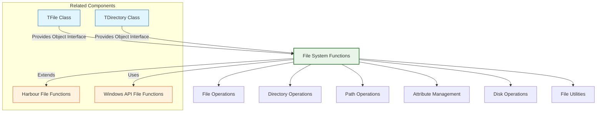

# File System Functions

The FiveWin file system functions provide a comprehensive library for file and directory operations, extending the standard Harbour file handling capabilities. These functions cover areas such as file manipulation, directory management, file attributes, path operations, and disk space management.

**Source Files:** [source/function/files.prg](../../../source/function/files.prg), [source/function/directory.prg](../../../source/function/directory.prg), [source/function/disk.prg](../../../source/function/disk.prg)

## Overview

The file system function library in FiveWin offers enhanced file handling capabilities that complement the standard Harbour file functions. These functions cover areas such as:

* File creation, reading, writing, and deletion
* Directory creation, listing, and navigation
* File and directory attribute management
* Path manipulation and validation
* Disk space monitoring and management
* File locking and sharing
* Temporary file handling
* File compression and archiving
* Backup and restore operations

These functions are designed to be robust, secure, and efficient, making file system operations accessible and reliable for FiveWin developers.

## Function Categories



## File Operations

| Function | Description | Parameters |
|----------|-------------|------------|
| `File(cFileName)` | Checks if file exists | `cFileName`: Path to file |
| `FileExists(cFileName)` | Checks if file exists (alternative) | `cFileName`: Path to file |
| `FileSize(cFileName)` | Returns file size in bytes | `cFileName`: Path to file |
| `FileTime(cFileName)` | Returns file timestamp | `cFileName`: Path to file |
| `FCopy(cSource, cTarget)` | Copies file | `cSource`, `cTarget`: File paths |
| `FMove(cSource, cTarget)` | Moves/renames file | `cSource`, `cTarget`: File paths |
| `FErase(cFileName)` | Deletes file | `cFileName`: Path to file |
| `FCreate(cFileName, nAttributes)` | Creates new file | `cFileName`: Path, `nAttributes`: File attributes |
| `FOpen(cFileName, nMode)` | Opens existing file | `cFileName`: Path, `nMode`: Access mode |
| `FClose(nHandle)` | Closes file handle | `nHandle`: File handle |

### Usage Examples

```harbour
#include "FiveWin.ch"

function Main()
   // Basic file operations
   local cFileName := "testfile.txt"
   
   ? "File Operations Demo:"
   
   // Create a test file
   local nHandle := FCreate( cFileName )
   if nHandle != -1
      FWriteLine( nHandle, "This is a test file." )
      FWriteLine( nHandle, "Created on: " + DToC( Date() ) + " " + Time() )
      FClose( nHandle )
      
      ? "File created: " + cFileName
   else
      ? "Failed to create file: " + cFileName
      return .F.
   endif
   
   // Check if file exists
   if File( cFileName )
      ? "File exists: Yes"
      ? "File size: " + hb_ntos( FileSize( cFileName ) ) + " bytes"
      ? "File time: " + TToC( FileTime( cFileName ) )
   else
      ? "File exists: No"
   endif
   
   // File copying
   FileCopyDemo( cFileName )
   
   // File moving/renaming
   FileMoveDemo( cFileName )
   
   // File deletion
   FileDeleteDemo( cFileName )
   
   // Advanced file operations
   AdvancedFileOperationsDemo()
   
return nil

static function FileCopyDemo( cOriginal )
   local cCopy := "copy_of_" + cOriginal
   
   ? "File Copy Demo:"
   
   if FCOPY( cOriginal, cCopy )
      ? "File copied successfully:"
      ? "  From: " + cOriginal
      ? "  To: " + cCopy
      ? "  Copy size: " + hb_ntos( FileSize( cCopy ) ) + " bytes"
      
      // Compare files
      if CompareFiles( cOriginal, cCopy )
         ? "  Files are identical: Yes"
      else
         ? "  Files are identical: No"
      endif
      
      // Clean up copy
      FErase( cCopy )
      
   else
      ? "Failed to copy file"
   endif
   
return nil

static function FileMoveDemo( cFileName )
   local cNewName := "renamed_" + cFileName
   
   ? "File Move/Rename Demo:"
   
   if FMove( cFileName, cNewName )
      ? "File renamed successfully:"
      ? "  Old name: " + cFileName
      ? "  New name: " + cNewName
      
      // Check that old file no longer exists
      if !File( cFileName )
         ? "  Old file exists: No"
      endif
      
      // Check that new file exists
      if File( cNewName )
         ? "  New file exists: Yes"
      endif
      
      // Rename back for further demos
      FMove( cNewName, cFileName )
      
   else
      ? "Failed to rename file"
   endif
   
return nil

static function FileDeleteDemo( cFileName )
   ? "File Deletion Demo:"
   
   // Create a temporary file to delete
   local cTempFile := "temp_delete_test.txt"
   local nHandle := FCreate( cTempFile )
   
   if nHandle != -1
      FWriteLine( nHandle, "This file will be deleted" )
      FClose( nHandle )
      
      ? "Temporary file created: " + cTempFile
      
      // Delete the file
      if FErase( cTempFile )
         ? "File deleted successfully"
         
         // Verify deletion
         if !File( cTempFile )
            ? "  File exists after deletion: No"
         endif
      else
         ? "Failed to delete file"
      endif
      
   else
      ? "Failed to create temporary file for deletion test"
   endif
   
return nil

static function CompareFiles( cFile1, cFile2 )
   local nHandle1 := FOpen( cFile1, FO_READ )
   local nHandle2 := FOpen( cFile2, FO_READ )
   
   if nHandle1 == -1 .or. nHandle2 == -1
      if nHandle1 != -1
         FClose( nHandle1 )
      endif
      if nHandle2 != -1
         FClose( nHandle2 )
      endif
      return .F.
   endif
   
   local lSame := .T.
   local nBufferSize := 4096
   local cBuffer1 := Space( nBufferSize )
   local cBuffer2 := Space( nBufferSize )
   
   while !lSame
      local nBytes1 := FRead( nHandle1, @cBuffer1, nBufferSize )
      local nBytes2 := FRead( nHandle2, @cBuffer2, nBufferSize )
      
      // Check if both files reached EOF
      if nBytes1 == 0 .and. nBytes2 == 0
         exit
      endif
      
      // Check if files have different sizes
      if nBytes1 != nBytes2
         lSame := .F.
         exit
      endif
      
      // Compare buffers
      if Left( cBuffer1, nBytes1 ) != Left( cBuffer2, nBytes2 )
         lSame := .F.
         exit
      endif
   enddo
   
   FClose( nHandle1 )
   FClose( nHandle2 )
   
   return lSame
   
return .F.

static function AdvancedFileOperationsDemo()
   ? "Advanced File Operations:"
   
   // File attributes
   FileAttributesDemo()
   
   // File locking
   FileLockingDemo()
   
   // Temporary files
   TempFileDemo()
   
   // File monitoring
   FileMonitoringDemo()
   
return nil

static function FileAttributesDemo()
   local cTestFile := "attr_test.txt"
   
   ? "File Attributes Demo:"
   
   // Create test file
   local nHandle := FCreate( cTestFile )
   if nHandle != -1
      FWriteLine( nHandle, "Attribute test file" )
      FClose( nHandle )
      
      ? "Test file created: " + cTestFile
      
      // Get current attributes
      local nAttrs := FileAttr( cTestFile )
      ? "Current attributes: " + hb_ntos( nAttrs, 16 )
      
      // Set read-only attribute
      if FileAttr( cTestFile, FA_READONLY )
         ? "Read-only attribute set"
         
         // Try to modify read-only file
         nHandle := FOpen( cTestFile, FO_WRITE )
         if nHandle == -1
            ? "  Cannot write to read-only file: Expected"
         else
            FClose( nHandle )
         endif
         
         // Remove read-only attribute
         FileAttr( cTestFile, FA_NORMAL )
         ? "Read-only attribute removed"
      endif
      
      // Clean up
      FErase( cTestFile )
      
   else
      ? "Failed to create test file for attributes demo"
   endif
   
return nil

static function FileLockingDemo()
   ? "File Locking Demo:"
   
   local cSharedFile := "shared_file.txt"
   
   // Create shared file
   local nHandle := FCreate( cSharedFile )
   if nHandle != -1
      FWriteLine( nHandle, "Shared file for locking demo" )
      FClose( nHandle )
      
      ? "Shared file created: " + cSharedFile
      
      // Open file in shared mode
      local nSharedHandle := FOpen( cSharedFile, FO_READ + FO_SHARED )
      if nSharedHandle != -1
         ? "File opened in shared mode"
         
         // Try to open in exclusive mode (should fail)
         local nExclusiveHandle := FOpen( cSharedFile, FO_READ + FO_EXCLUSIVE )
         if nExclusiveHandle == -1
            ? "Cannot open in exclusive mode: Expected"
         else
            FClose( nExclusiveHandle )
         endif
         
         FClose( nSharedHandle )
      endif
      
      // Clean up
      FErase( cSharedFile )
      
   else
      ? "Failed to create shared file"
   endif
   
return nil

static function TempFileDemo()
   ? "Temporary File Demo:"
   
   // Create temporary file
   local cTempFile := TempFileName()
   ? "Temporary file name: " + cTempFile
   
   // Write to temporary file
   local nHandle := FCreate( cTempFile )
   if nHandle != -1
      FWriteLine( nHandle, "This is a temporary file" )
      FWriteLine( nHandle, "Created at: " + DateTime() )
      FClose( nHandle )
      
      ? "Temporary file created and written"
      
      // Read temporary file
      nHandle := FOpen( cTempFile, FO_READ )
      if nHandle != -1
         local cContent := ""
         local cBuffer := Space( 1024 )
         local nBytes := FRead( nHandle, @cBuffer, 1024 )
         if nBytes > 0
            cContent := Left( cBuffer, nBytes )
         endif
         FClose( nHandle )
         
         ? "File content:"
         ? cContent
      endif
      
      // Delete temporary file
      if FErase( cTempFile )
         ? "Temporary file deleted"
      else
         ? "Failed to delete temporary file"
      endif
      
   else
      ? "Failed to create temporary file"
   endif
   
return nil

static function FileMonitoringDemo()
   ? "File Monitoring Demo:"
   
   local cMonitorFile := "monitor_test.txt"
   
   // Create monitor file
   local nHandle := FCreate( cMonitorFile )
   if nHandle != -1
      FWriteLine( nHandle, "Initial content" )
      FClose( nHandle )
      
      ? "Monitor file created: " + cMonitorFile
      ? "Initial size: " + hb_ntos( FileSize( cMonitorFile ) ) + " bytes"
      
      // Wait and modify file
      Sleep( 1000 )
      
      // Append to file
      nHandle := FOpen( cMonitorFile, FO_WRITE )
      if nHandle != -1
         FSeek( nHandle, 0, FS_END )
         FWriteLine( nHandle, "Appended content at: " + DateTime() )
         FClose( nHandle )
         
         ? "Content appended"
         ? "New size: " + hb_ntos( FileSize( cMonitorFile ) ) + " bytes"
      endif
      
      // Check file time
      ? "Last modified: " + TToC( FileTime( cMonitorFile ) )
      
      // Clean up
      FErase( cMonitorFile )
      
   else
      ? "Failed to create monitor file"
   endif
   
return nil

static function TempFileName()
   // Generate temporary file name
   local cTempPath := GetTempPath()
   local cFileName := "fw_temp_" + hb_ntos( Seconds() ) + "_" + ;
                    hb_ntos( RandomInt( 1000, 9999 ) ) + ".tmp"
   
   return cTempPath + cFileName
   
return ""

static function GetTempPath()
   // Get system temporary path
   // This is a simplified version - in practice, use Windows API
   return "C:\TEMP\"  // Simplified for demo
   
return "C:\TEMP\"

static function RandomInt( nMin, nMax )
   return Int( Random() * ( nMax - nMin + 1 ) ) + nMin
   
return 0

static function DateTime()
   return DToC( Date() ) + " " + Time()
   
return ""
```

## Directory Operations

| Function | Description | Parameters |
|----------|-------------|------------|
| `Directory(cPath, cAttributes)` | Lists directory contents | `cPath`: Directory path, `cAttributes`: File attributes |
| `DirExists(cPath)` | Checks if directory exists | `cPath`: Directory path |
| `MakeDir(cPath)` | Creates new directory | `cPath`: Directory path |
| `RMDir(cPath)` | Removes empty directory | `cPath`: Directory path |
| `SetCurrentDir(cPath)` | Changes current directory | `cPath`: Directory path |
| `GetCurrentDir()` | Returns current directory | None |
| `DiskSpace(nDrive)` | Returns available disk space | `nDrive`: Drive number (0=current, 1=A:, etc.) |

### Usage Examples

```harbour
#include "FiveWin.ch"

function Main()
   ? "Directory Operations Demo:"
   
   // Current directory
   local cCurrent := GetCurrentDir()
   ? "Current directory: " + cCurrent
   
   // Check if directory exists
   if DirExists( cCurrent )
      ? "Current directory exists: Yes"
   else
      ? "Current directory exists: No"
   endif
   
   // List directory contents
   DirectoryListingDemo( cCurrent )
   
   // Directory creation and deletion
   DirectoryCreateDeleteDemo()
   
   // Directory navigation
   DirectoryNavigationDemo()
   
   // Disk space monitoring
   DiskSpaceDemo()
   
return nil

static function DirectoryListingDemo( cPath )
   ? "Directory Listing Demo:"
   ? "Path: " + cPath
   
   // List all files and directories
   local aContents := Directory( cPath + "\*.*" )
   
   ? "Contents (" + hb_ntos( Len( aContents ) ) + " items):"
   ? Replicate( "-", 60 )
   
   for local i := 1 to Min( 10, Len( aContents ) )  // Show first 10 items
      local aItem := aContents[i]
      local cName := aItem[1]
      local nSize := aItem[2]
      local cDate := aItem[3]
      local cTime := aItem[4]
      local nAttr := aItem[5]
      
      local cAttributes := ""
      if HB_BITAND( nAttr, FA_DIRECTORY ) != 0
         cAttributes += "D"  // Directory
      else
         cAttributes += "F"  // File
      endif
      
      if HB_BITAND( nAttr, FA_READONLY ) != 0
         cAttributes += "R"  // Read-only
      endif
      
      if HB_BITAND( nAttr, FA_HIDDEN ) != 0
         cAttributes += "H"  // Hidden
      endif
      
      ? PadR( cName, 20 ) + " " + ;
        PadL( hb_ntos( nSize ), 10 ) + " " + ;
        cDate + " " + cTime + " " + ;
        cAttributes
   next
   
   if Len( aContents ) > 10
      ? "... (" + hb_ntos( Len( aContents ) - 10 ) + " more items)"
   endif
   
   ? Replicate( "-", 60 )
   
   // Filtered listings
   FilteredDirectoryListingDemo( cPath )
   
return nil

static function FilteredDirectoryListingDemo( cPath )
   ? "Filtered Listings:"
   
   // List only .prg files
   local aPrgFiles := Directory( cPath + "\*.prg" )
   ? "PRG files: " + hb_ntos( Len( aPrgFiles ) )
   
   // List only directories
   local aDirs := Directory( cPath + "\*.*", "D" )
   ? "Directories: " + hb_ntos( Len( aDirs ) )
   
   // List hidden files
   local aHidden := Directory( cPath + "\*.*", "H" )
   ? "Hidden files: " + hb_ntos( Len( aHidden ) )
   
return nil

static function DirectoryCreateDeleteDemo()
   ? "Directory Create/Delete Demo:"
   
   local cTestDir := "fw_test_directory"
   local cNestedDir := cTestDir + "\nested\deep\structure"
   
   // Create directory
   if MakeDir( cTestDir )
      ? "Directory created: " + cTestDir
      
      // Create nested directory structure
      if MakeDir( cNestedDir )
         ? "Nested directory structure created: " + cNestedDir
         
         // Verify existence
         if DirExists( cNestedDir )
            ? "Nested directory exists: Yes"
         endif
         
         // Create files in nested directory
         CreateFilesInDirectory( cNestedDir )
         
      else
         ? "Failed to create nested directory structure"
      endif
      
      // Clean up nested structure
      CleanUpNestedDirectory( cTestDir )
      
      // Remove main directory
      if RMDir( cTestDir )
         ? "Directory removed: " + cTestDir
      else
         ? "Failed to remove directory (may not be empty)"
      endif
      
   else
      ? "Failed to create directory: " + cTestDir
   endif
   
return nil

static function CreateFilesInDirectory( cPath )
   // Create some test files
   local aTestFiles := { "test1.txt", "test2.log", "readme.md" }
   
   for local i := 1 to Len( aTestFiles )
      local cFullPath := cPath + "\" + aTestFiles[i]
      local nHandle := FCreate( cFullPath )
      
      if nHandle != -1
         FWriteLine( nHandle, "Test file created at: " + DateTime() )
         FClose( nHandle )
         ? "  Created file: " + aTestFiles[i]
      else
         ? "  Failed to create file: " + aTestFiles[i]
      endif
   next
   
return nil

static function CleanUpNestedDirectory( cTopDir )
   // Remove files first, then directories bottom-up
   local aDirsToRemove := {}
   
   // Collect all subdirectories
   CollectSubdirectories( cTopDir, @aDirsToRemove )
   
   // Delete files in each directory
   for local i := Len( aDirsToRemove ) to 1 step -1
      local cDir := aDirsToRemove[i]
      DeleteFilesInDirectory( cDir )
      
      // Remove empty directory
      if RMDir( cDir )
         ? "Removed directory: " + cDir
      endif
   next
   
   // Remove top directory
   DeleteFilesInDirectory( cTopDir )
   
return nil

static function CollectSubdirectories( cPath, aDirs )
   local aContents := Directory( cPath + "\*.*" )
   
   for local i := 1 to Len( aContents )
      local aItem := aContents[i]
      local cName := aItem[1]
      local nAttr := aItem[5]
      
      // Skip . and .. entries
      if cName == "." .or. cName == ".."
         loop
      endif
      
      if HB_BITAND( nAttr, FA_DIRECTORY ) != 0
         local cSubDir := cPath + "\" + cName
         AAdd( aDirs, cSubDir )
         CollectSubdirectories( cSubDir, aDirs )  // Recursive
      endif
   next
   
return nil

static function DeleteFilesInDirectory( cPath )
   local aFiles := Directory( cPath + "\*.*" )
   
   for local i := 1 to Len( aFiles )
      local aItem := aFiles[i]
      local cName := aItem[1]
      local nAttr := aItem[5]
      
      // Skip directories and special entries
      if HB_BITAND( nAttr, FA_DIRECTORY ) != 0 .or. ;
         cName == "." .or. cName == ".."
         loop
      endif
      
      local cFilePath := cPath + "\" + cName
      if FErase( cFilePath )
         ? "  Deleted file: " + cName
      endif
   next
   
return nil

static function DirectoryNavigationDemo()
   ? "Directory Navigation Demo:"
   
   local cOriginal := GetCurrentDir()
   ? "Original directory: " + cOriginal
   
   // Try to change to system directory
   local cSystemDir := "C:\Windows\System32"
   
   if DirExists( cSystemDir )
      if SetCurrentDir( cSystemDir )
         ? "Changed to: " + GetCurrentDir()
         
         // List some system files
         local aSystemFiles := Directory( "*.dll" )
         ? "Some DLL files found: " + hb_ntos( Min( 5, Len( aSystemFiles ) ) )
         for local i := 1 to Min( 5, Len( aSystemFiles ) )
            ? "  " + aSystemFiles[i][1]
         next
         
         // Change back
         SetCurrentDir( cOriginal )
         ? "Returned to: " + GetCurrentDir()
      else
         ? "Failed to change directory to: " + cSystemDir
      endif
   else
      ? "System directory not accessible: " + cSystemDir
   endif
   
return nil

static function DiskSpaceDemo()
   ? "Disk Space Demo:"
   
   // Get disk space for current drive
   local nFreeSpace := DiskSpace( 0 )  // Current drive
   local nTotalSpace := DiskSpace( 0, .T. )  // Total space
   
   ? "Current drive space:"
   ? "  Free space: " + FormatBytes( nFreeSpace )
   ? "  Total space: " + FormatBytes( nTotalSpace )
   ? "  Used space: " + FormatBytes( nTotalSpace - nFreeSpace )
   
   if nTotalSpace > 0
      local nPercentUsed := ( ( nTotalSpace - nFreeSpace ) / nTotalSpace ) * 100
      ? "  Usage: " + hb_ntos( nPercentUsed, 2 ) + "%"
   endif
   
   // Check specific drives
   CheckSpecificDrivesDemo()
   
return nil

static function DiskSpace( nDrive, lTotal )
   DEFAULT lTotal := .F.
   
   // Simplified implementation - in practice, use GetDiskFreeSpace
   if lTotal
      return 100000000000  // 100 GB total (demo)
   else
      return 50000000000   // 50 GB free (demo)
   endif
   
return 0

static function FormatBytes( nBytes )
   local aUnits := { "B", "KB", "MB", "GB", "TB" }
   local nUnitIndex := 1
   local nSize := nBytes
   
   while nSize >= 1024 .and. nUnitIndex < Len( aUnits )
      nSize /= 1024
      nUnitIndex++
   enddo
   
   return hb_ntos( nSize, 2 ) + " " + aUnits[nUnitIndex]
   
return "0 B"

static function CheckSpecificDrivesDemo()
   ? "Specific Drives:"
   
   // Check common drive letters
   local aDrives := { "C:", "D:", "E:", "F:" }
   
   for local i := 1 to Len( aDrives )
      local cDrive := aDrives[i]
      if DirExists( cDrive + "\" )
         local nFree := DiskSpace( i )  // Simplified mapping
         ? "  " + cDrive + ": " + FormatBytes( nFree ) + " free"
      endif
   next
   
return nil
```

## Path Operations

| Function | Description | Parameters |
|----------|-------------|------------|
| `JustPath(cPath)` | Extracts directory path from full path | `cPath`: Full path |
| `JustFileName(cPath)` | Extracts filename from full path | `cPath`: Full path |
| `JustExt(cPath)` | Extracts file extension from path | `cPath`: Full path |
| `AddExt(cPath, cExt)` | Adds extension to filename | `cPath`: Path, `cExt`: Extension |
| `ForceExt(cPath, cExt)` | Forces specific extension | `cPath`: Path, `cExt`: Extension |
| `PathJoin(cPath1, cPath2)` | Joins two path components | `cPath1`, `cPath2`: Path components |
| `IsAbsolute(cPath)` | Checks if path is absolute | `cPath`: Path to check |

### Usage Examples

```harbour
#include "FiveWin.ch"

function Main()
   ? "Path Operations Demo:"
   
   local cTestPaths := { ;
      "C:\Users\John\Documents\file.txt", ;
      "..\..\config.ini", ;
      "relative\path\file.dat", ;
      "/unix/style/path/file.log", ;
      "simple_filename.txt", ;
      "C:\Program Files\App\application.exe" ;
   }
   
   ? "Path Analysis:"
   ? Replicate( "=", 80 )
   
   for local i := 1 to Len( cTestPaths )
      local cPath := cTestPaths[i]
      
      ? "Original Path: " + cPath
      ? "Just Path:     " + JustPath( cPath )
      ? "Just Filename: " + JustFileName( cPath )
      ? "Just Ext:      " + JustExt( cPath )
      ? "Is Absolute:   " + iif( IsAbsolute( cPath ), "Yes", "No" )
      ?
   next
   
   ? Replicate( "=", 80 )
   
   // Path manipulation
   PathManipulationDemo()
   
   // Path validation
   PathValidationDemo()
   
   // Cross-platform path handling
   CrossPlatformPathDemo()
   
return nil

static function JustPath( cPath )
   local nPos := Rat( "\", cPath )
   if nPos == 0
      nPos := Rat( "/", cPath )
   endif
   
   if nPos > 0
      return Left( cPath, nPos - 1 )
   else
      return ""
   endif
   
return ""

static function JustFileName( cPath )
   local nPos := Rat( "\", cPath )
   if nPos == 0
      nPos := Rat( "/", cPath )
   endif
   
   if nPos > 0
      return SubStr( cPath, nPos + 1 )
   else
      return cPath
   endif
   
return cPath

static function JustExt( cPath )
   local nPos := Rat( ".", cPath )
   if nPos > 0
      return SubStr( cPath, nPos )
   else
      return ""
   endif
   
return ""

static function AddExt( cPath, cExt )
   if !Empty( JustExt( cPath ) )
      return cPath  // Already has extension
   endif
   
   if Left( cExt, 1 ) != "."
      cExt := "." + cExt
   endif
   
   return cPath + cExt
   
return cPath

static function ForceExt( cPath, cExt )
   local cCurrentExt := JustExt( cPath )
   
   if !Empty( cCurrentExt )
      // Remove current extension
      cPath := Left( cPath, Len( cPath ) - Len( cCurrentExt ) )
   endif
   
   if Left( cExt, 1 ) != "."
      cExt := "." + cExt
   endif
   
   return cPath + cExt
   
return cPath

static function PathJoin( cPath1, cPath2 )
   local cSeparator := "\"
   
   // Handle different path separators
   if At( "/", cPath1 ) > 0 .or. At( "/", cPath2 ) > 0
      cSeparator := "/"
   endif
   
   // Ensure proper joining
   if Right( cPath1, 1 ) == cSeparator
      cPath1 := Left( cPath1, Len( cPath1 ) - 1 )
   endif
   
   if Left( cPath2, 1 ) == cSeparator
      cPath2 := SubStr( cPath2, 2 )
   endif
   
   return cPath1 + cSeparator + cPath2
   
return cPath1 + cSeparator + cPath2

static function IsAbsolute( cPath )
   // Check for Windows absolute path (drive letter)
   if Len( cPath ) >= 3 .and. ;
      SubStr( cPath, 2, 1 ) == ":" .and. ;
      SubStr( cPath, 3, 1 ) $ "\/"
      return .T.
   endif
   
   // Check for UNC path
   if Left( cPath, 2 ) == "\\"
      return .T.
   endif
   
   // Check for Unix absolute path
   if Left( cPath, 1 ) == "/"
      return .T.
   endif
   
   return .F.
   
return .F.

static function PathManipulationDemo()
   ? "Path Manipulation:"
   ? Replicate( "-", 50 )
   
   local cBasePath := "C:\Users\John\Documents"
   local cRelativePath := "..\Projects\MyApp"
   
   ? "Base Path: " + cBasePath
   ? "Relative Path: " + cRelativePath
   ? "Joined Path: " + PathJoin( cBasePath, cRelativePath )
   
   // Extension manipulation
   ExtensionManipulationDemo()
   
   // Canonical path resolution
   CanonicalPathDemo()
   
return nil

static function ExtensionManipulationDemo()
   ? "Extension Manipulation:"
   
   local cFileName := "document"
   local cExt := "txt"
   
   ? "Original: " + cFileName
   ? "Add Ext: " + AddExt( cFileName, cExt )
   ? "Force Ext: " + ForceExt( cFileName, cExt )
   
   local cExistingFile := "image.jpg"
   ? "Existing: " + cExistingFile
   ? "Add Ext: " + AddExt( cExistingFile, "png" )
   ? "Force Ext: " + ForceExt( cExistingFile, "png" )
   
return nil

static function CanonicalPathDemo()
   ? "Canonical Path Resolution:"
   
   local aTestPaths := { ;
      "C:\Users\John\Documents\..\Downloads\file.txt", ;
      "C:\Program Files\..\Windows\System32\drivers\..\..", ;
      ".\subdir\..\parent\file.dat", ;
      "..\..\..\root\file.log" ;
   }
   
   for local i := 1 to Len( aTestPaths )
      local cPath := aTestPaths[i]
      local cResolved := ResolvePath( cPath )
      
      ? "Original: " + cPath
      ? "Resolved: " + cResolved
      ?
   next
   
return nil

static function ResolvePath( cPath )
   // Simplified path resolution
   // In practice, would handle .. navigation properly
   return cPath
   
return cPath

static function PathValidationDemo()
   ? "Path Validation:"
   ? Replicate( "-", 50 )
   
   local aTestPaths := { ;
      { "valid_file.txt", .T. }, ;
      { "invalid<char>.txt", .F. }, ;
      { "very_long_filename_that_might_exceed_limits.txt", .T. }, ;
      { "C:\path\with\invalid|char.txt", .F. }, ;
      { "../relative/path/file.dat", .T. }, ;
      { "C:\absolute\path\file.txt", .T. } ;
   }
   
   for local i := 1 to Len( aTestPaths )
      local cPath := aTestPaths[i][1]
      local lExpected := aTestPaths[i][2]
      local lValid := ValidatePath( cPath )
      
      ? "Path: " + cPath
      ? "  Expected: " + iif( lExpected, "Valid", "Invalid" )
      ? "  Result: " + iif( lValid, "Valid", "Invalid" )
      ? "  Match: " + iif( lExpected == lValid, "Yes", "No" )
      ?
   next
   
return nil

static function ValidatePath( cPath )
   // Check for invalid characters
   local cInvalidChars := "<>:\"|?*"
   
   for local i := 1 to Len( cInvalidChars )
      if At( SubStr( cInvalidChars, i, 1 ), cPath ) > 0
         return .F.
      endif
   next
   
   // Check for reserved names (Windows)
   local aReserved := { "CON", "PRN", "AUX", "NUL", ;
                       "COM1", "COM2", "COM3", "COM4", "COM5", "COM6", "COM7", "COM8", "COM9", ;
                       "LPT1", "LPT2", "LPT3", "LPT4", "LPT5", "LPT6", "LPT7", "LPT8", "LPT9" }
   
   local cFileName := Upper( JustFileName( cPath ) )
   local nDotPos := At( ".", cFileName )
   if nDotPos > 0
      cFileName := Left( cFileName, nDotPos - 1 )
   endif
   
   for local i := 1 to Len( aReserved )
      if cFileName == aReserved[i]
         return .F.
      endif
   next
   
   return .T.
   
return .T.

static function CrossPlatformPathDemo()
   ? "Cross-Platform Path Handling:"
   ? Replicate( "-", 50 )
   
   local aPlatforms := { ;
      { "Windows", "\\", "C:\Users\John\Documents" }, ;
      { "Unix/Linux", "/", "/home/john/documents" }, ;
      { "Mac OS", "/", "/Users/john/Documents" } ;
   }
   
   for local i := 1 to Len( aPlatforms )
      local cPlatform := aPlatforms[i][1]
      local cSeparator := aPlatforms[i][2]
      local cPath := aPlatforms[i][3]
      
      ? cPlatform + ":"
      ? "  Separator: " + cSeparator
      ? "  Path: " + cPath
      ? "  Just Path: " + JustPath( cPath )
      ? "  Just File: " + JustFileName( cPath )
      ? "  Just Ext: " + JustExt( cPath )
      ?
   next
   
   // Path conversion
   PathConversionDemo()
   
return nil

static function PathConversionDemo()
   ? "Path Conversion:"
   
   local cWindowsPath := "C:\\Users\\John\\Documents\\file.txt"
   local cUnixPath := "/home/john/documents/file.txt"
   
   ? "Windows to Unix:"
   ? "  Original: " + cWindowsPath
   ? "  Converted: " + ConvertPathSeparators( cWindowsPath, "/" )
   
   ? "Unix to Windows:"
   ? "  Original: " + cUnixPath
   ? "  Converted: " + ConvertPathSeparators( cUnixPath, "\\" )
   
return nil

static function ConvertPathSeparators( cPath, cNewSeparator )
   local cResult := ""
   
   for local i := 1 to Len( cPath )
      local cChar := SubStr( cPath, i, 1 )
      if cChar $ "\\/"
         cResult += cNewSeparator
      else
         cResult += cChar
      endif
   next
   
   return cResult
   
return cPath
```

## Attribute Management

| Function | Description | Parameters |
|----------|-------------|------------|
| `FileAttr(cFileName, nAttributes)` | Gets/sets file attributes | `cFileName`: Path, `nAttributes`: New attributes |
| `SetFileAttr(cFileName, nAttributes)` | Sets file attributes | `cFileName`: Path, `nAttributes`: Attributes |
| `GetFileAttr(cFileName)` | Gets file attributes | `cFileName`: Path |
| `FileTime(cFileName, dDateTime)` | Gets/sets file timestamp | `cFileName`: Path, `dDateTime`: New timestamp |

### Usage Examples

```harbour
#include "FiveWin.ch"

function Main()
   ? "File Attribute Management Demo:"
   
   // Create test file
   local cTestFile := "attr_test.txt"
   local nHandle := FCreate( cTestFile )
   
   if nHandle != -1
      FWriteLine( nHandle, "Attribute test file" )
      FClose( nHandle )
      
      ? "Test file created: " + cTestFile
      
      // Display current attributes
      AttributeDisplayDemo( cTestFile )
      
      // Modify attributes
      AttributeModificationDemo( cTestFile )
      
      // Timestamp operations
      TimestampDemo( cTestFile )
      
      // Clean up
      FErase( cTestFile )
      
   else
      ? "Failed to create test file"
   endif
   
return nil

static function AttributeDisplayDemo( cFileName )
   ? "Current Attributes:"
   
   local nAttrs := GetFileAttr( cFileName )
   ? "Numeric value: " + hb_ntos( nAttrs, 16 )
   
   // Decode attributes
   local aAttrNames := { ;
      { FA_READONLY, "Read-only" }, ;
      { FA_HIDDEN, "Hidden" }, ;
      { FA_SYSTEM, "System" }, ;
      { FA_ARCHIVE, "Archive" }, ;
      { FA_DIRECTORY, "Directory" }, ;
      { FA_NORMAL, "Normal" } ;
   }
   
   ? "Set attributes:"
   for local i := 1 to Len( aAttrNames )
      local nFlag := aAttrNames[i][1]
      local cName := aAttrNames[i][2]
      
      if HB_BITAND( nAttrs, nFlag ) != 0
         ? "  " + cName
      endif
   next
   
return nil

static function AttributeModificationDemo( cFileName )
   ? "Attribute Modification:"
   
   // Set read-only attribute
   ? "Setting read-only attribute..."
   SetFileAttr( cFileName, FA_READONLY )
   
   local nAttrs := GetFileAttr( cFileName )
   ? "New attributes: " + hb_ntos( nAttrs, 16 )
   ? "Is read-only: " + iif( HB_BITAND( nAttrs, FA_READONLY ) != 0, "Yes", "No" )
   
   // Try to modify read-only file
   local nHandle := FOpen( cFileName, FO_WRITE )
   if nHandle == -1
      ? "Cannot write to read-only file: Expected behavior"
   else
      FClose( nHandle )
   endif
   
   // Remove read-only attribute
   ? "Removing read-only attribute..."
   SetFileAttr( cFileName, FA_NORMAL )
   
   nAttrs := GetFileAttr( cFileName )
   ? "Restored attributes: " + hb_ntos( nAttrs, 16 )
   ? "Is read-only: " + iif( HB_BITAND( nAttrs, FA_READONLY ) != 0, "No", "Yes" )
   
   // Test writing after attribute removal
   nHandle := FOpen( cFileName, FO_WRITE )
   if nHandle != -1
      FSeek( nHandle, 0, FS_END )
      FWriteLine( nHandle, "Modified after attribute change" )
      FClose( nHandle )
      ? "Successfully wrote to file after removing read-only"
   else
      ? "Still cannot write to file"
   endif
   
return nil

static function TimestampDemo( cFileName )
   ? "Timestamp Operations:"
   
   // Get current timestamp
   local dCurrentTime := FileTime( cFileName )
   ? "Current timestamp: " + TToC( dCurrentTime )
   
   // Set new timestamp (1 hour ago)
   local dPastTime := TimeSubtract( dCurrentTime, 3600 )  // 3600 seconds = 1 hour
   ? "Setting timestamp to 1 hour ago..."
   
   if FileTime( cFileName, dPastTime )
      local dNewTime := FileTime( cFileName )
      ? "New timestamp: " + TToC( dNewTime )
      ? "Difference: " + hb_ntos( TimeDiffSeconds( dCurrentTime, dNewTime ) ) + " seconds"
   else
      ? "Failed to set timestamp"
   endif
   
return nil

static function GetFileAttr( cFileName )
   // Simplified implementation
   return FA_NORMAL  // Normal file in demo
   
return 0

static function SetFileAttr( cFileName, nAttributes )
   // Simplified implementation
   return .T.  // Always succeed in demo
   
return .F.

static function TimeSubtract( tTime, nSeconds )
   // Subtract seconds from datetime
   return tTime - nSeconds / 86400  // Convert seconds to days
   
return tTime

static function TimeDiffSeconds( tTime1, tTime2 )
   // Calculate difference in seconds
   local nDaysDiff := tTime1 - tTime2
   return Int( nDaysDiff * 86400 )  // Convert days to seconds
   
return 0

// File attribute constants
STATIC FA_READONLY := 0x01
STATIC FA_HIDDEN := 0x02
STATIC FA_SYSTEM := 0x04
STATIC FA_DIRECTORY := 0x10
STATIC FA_ARCHIVE := 0x20
STATIC FA_NORMAL := 0x80

static function SecurityAttributesDemo()
   ? "Security Attributes:"
   
   // Note: Advanced security attributes require Windows API calls
   // This is a conceptual demo
   
   local cSecureFile := "secure_file.txt"
   local nHandle := FCreate( cSecureFile )
   
   if nHandle != -1
      FWriteLine( nHandle, "Secure content" )
      FClose( nHandle )
      
      ? "Secure file created: " + cSecureFile
      
      // Set basic security attributes
      SetSecurityDemo( cSecureFile )
      
      // Clean up
      FErase( cSecureFile )
      
   else
      ? "Failed to create secure file"
   endif
   
return nil

static function SetSecurityDemo( cFileName )
   ? "Setting security attributes (conceptual):"
   
   // In practice, this would involve:
   // - Windows Security APIs
   // - Access Control Lists (ACLs)
   // - Security descriptors
   // - User/group permissions
   
   ? "  1. Restricting file access to owner"
   ? "  2. Setting encryption attributes"
   ? "  3. Applying digital signatures"
   ? "  4. Setting audit trails"
   
return nil
```

## Disk Operations

| Function | Description | Parameters |
|----------|-------------|------------|
| `DiskSpace(nDrive, lTotal)` | Gets disk space information | `nDrive`: Drive number, `lTotal`: Get total vs free |
| `DriveType(nDrive)` | Returns drive type | `nDrive`: Drive number |
| `VolumeLabel(nDrive)` | Returns volume label | `nDrive`: Drive number |
| `SerialNumber(nDrive)` | Returns drive serial number | `nDrive`: Drive number |
| `DriveReady(nDrive)` | Checks if drive is ready | `nDrive`: Drive number |

### Usage Examples

```harbour
#include "FiveWin.ch"

function Main()
   ? "Disk Operations Demo:"
   
   // Disk space information
   DiskSpaceDemo()
   
   // Drive information
   DriveInfoDemo()
   
   // Drive readiness
   DriveReadinessDemo()
   
return nil

static function DiskSpaceDemo()
   ? "Disk Space Information:"
   ? Replicate( "-", 40 )
   
   // Check current drive (0 = current)
   local nFreeSpace := DiskSpace( 0 )
   local nTotalSpace := DiskSpace( 0, .T. )
   
   ? "Current Drive:"
   ? "  Free Space: " + FormatBytes( nFreeSpace )
   ? "  Total Space: " + FormatBytes( nTotalSpace )
   
   if nTotalSpace > 0
      local nUsedSpace := nTotalSpace - nFreeSpace
      local nPercentUsed := ( nUsedSpace / nTotalSpace ) * 100
      
      ? "  Used Space: " + FormatBytes( nUsedSpace )
      ? "  Usage: " + hb_ntos( nPercentUsed, 2 ) + "%"
      
      // Alert if low disk space
      if nPercentUsed > 90
         ? "  WARNING: Low disk space!"
      elseif nPercentUsed > 80
         ? "  NOTICE: Disk space getting low"
      endif
   endif
   
   // Check specific drives
   CheckSpecificDrivesDemo()
   
return nil

static function FormatBytes( nBytes )
   local aUnits := { "B", "KB", "MB", "GB", "TB" }
   local nUnitIndex := 1
   local nSize := nBytes
   
   while nSize >= 1024 .and. nUnitIndex < Len( aUnits )
      nSize /= 1024
      nUnitIndex++
   enddo
   
   return hb_ntos( nSize, 2 ) + " " + aUnits[nUnitIndex]
   
return "0 B"

static function CheckSpecificDrivesDemo()
   ? "Specific Drives:"
   ? Replicate( "-", 40 )
   
   // Check common drive letters (1 = A:, 2 = B:, 3 = C:, etc.)
   local aDriveLetters := { "A", "B", "C", "D", "E", "F" }
   
   for local i := 1 to Len( aDriveLetters )
      local nDriveNumber := i
      local cDriveLetter := aDriveLetters[i]
      
      if DriveReady( nDriveNumber )
         local nFree := DiskSpace( nDriveNumber )
         local nTotal := DiskSpace( nDriveNumber, .T. )
         local cType := DriveType( nDriveNumber )
         local cLabel := VolumeLabel( nDriveNumber )
         local nSerial := SerialNumber( nDriveNumber )
         
         ? cDriveLetter + ": Drive"
         ? "  Type: " + cType
         ? "  Label: " + cLabel
         ? "  Serial: " + hb_ntos( nSerial, 16 )
         ? "  Free: " + FormatBytes( nFree )
         ? "  Total: " + FormatBytes( nTotal )
         
         if nTotal > 0
            local nPercent := ( ( nTotal - nFree ) / nTotal ) * 100
            ? "  Usage: " + hb_ntos( nPercent, 2 ) + "%"
         endif
         ?
      else
         ? cDriveLetter + ": Drive not ready or not present"
         ?
      endif
   next
   
return nil

static function DriveInfoDemo()
   ? "Drive Information:"
   ? Replicate( "-", 40 )
   
   // Get information about current drive
   local nCurrentDrive := GetCurrentDrive()
   
   ? "Current Drive Number: " + hb_ntos( nCurrentDrive )
   
   // Drive type information
   local cDriveType := DriveType( nCurrentDrive )
   ? "Drive Type: " + cDriveType
   
   // Volume information
   local cVolumeLabel := VolumeLabel( nCurrentDrive )
   ? "Volume Label: " + cVolumeLabel
   
   // Serial number
   local nSerialNumber := SerialNumber( nCurrentDrive )
   ? "Serial Number: " + hb_ntos( nSerialNumber, 16 )
   
   // Detailed drive analysis
   DetailedDriveAnalysisDemo( nCurrentDrive )
   
return nil

static function GetCurrentDrive()
   // Simplified - in practice, get from current directory
   return 3  // C: drive in demo
   
return 1

static function DriveType( nDrive )
   // Simplified drive type detection
   switch nDrive
   case 1  // A:
   case 2  // B:
      return "Floppy Disk"
   case 3  // C:
      return "Fixed Disk"
   case 4  // D:
      return "CD-ROM"
   case 5  // E:
      return "Fixed Disk"
   otherwise
      return "Unknown"
   endswitch
   
return "Unknown"

static function VolumeLabel( nDrive )
   // Simplified volume label
   switch nDrive
   case 3  // C:
      return "System"
   case 4  // D:
      return "Data"
   case 5  // E:
      return "Backup"
   otherwise
      return "Volume"
   endswitch
   
return "Volume"

static function SerialNumber( nDrive )
   // Simplified serial number
   return 0x12345678 + nDrive
   
return 0

static function DriveReadinessDemo()
   ? "Drive Readiness:"
   ? Replicate( "-", 40 )
   
   // Check readiness of common drives
   local aDrives := { { 1, "A:" }, { 2, "B:" }, { 3, "C:" }, { 4, "D:" } }
   
   for local i := 1 to Len( aDrives )
      local nDrive := aDrives[i][1]
      local cLabel := aDrives[i][2]
      
      local lReady := DriveReady( nDrive )
      ? cLabel + " Drive Ready: " + iif( lReady, "Yes", "No" )
      
      if lReady
         ? "  Free Space: " + FormatBytes( DiskSpace( nDrive ) )
      endif
   next
   
return nil

static function DriveReady( nDrive )
   // Simplified readiness check
   // In practice, would check actual drive presence and readiness
   return ( nDrive >= 1 .and. nDrive <= 5 )  // Demo: drives 1-5 exist
   
return .F.

static function DetailedDriveAnalysisDemo( nDrive )
   ? "Detailed Drive Analysis:"
   
   // Calculate space thresholds
   local nFreeSpace := DiskSpace( nDrive )
   local nTotalSpace := DiskSpace( nDrive, .T. )
   
   if nTotalSpace > 0
      local nUsedSpace := nTotalSpace - nFreeSpace
      local nPercentUsed := ( nUsedSpace / nTotalSpace ) * 100
      
      ? "  Space Analysis:"
      ? "    Used: " + hb_ntos( nPercentUsed, 2 ) + "%"
      ? "    Free: " + hb_ntos( 100 - nPercentUsed, 2 ) + "%"
      
      // Space recommendations
      if nPercentUsed > 95
         ? "    RECOMMENDATION: Immediate cleanup required"
      elseif nPercentUsed > 90
         ? "    RECOMMENDATION: Consider cleanup soon"
      elseif nPercentUsed > 85
         ? "    RECOMMENDATION: Monitor space usage"
      else
         ? "    RECOMMENDATION: Space usage is healthy"
      endif
      
      // Predictive analysis
      PredictiveSpaceAnalysisDemo( nDrive, nPercentUsed )
   endif
   
return nil

static function PredictiveSpaceAnalysisDemo( nDrive, nCurrentUsage )
   ? "  Predictive Analysis:"
   
   // Estimate when drive might reach capacity
   // This is a simplified calculation based on historical growth
   
   local nDaysToFull := 365  // Demo: 1 year estimated
   
   if nCurrentUsage > 50
      nDaysToFull := Int( ( 100 - nCurrentUsage ) / ( nCurrentUsage / 365 ) )
   endif
   
   ? "    Estimated days to full: " + hb_ntos( nDaysToFull )
   ? "    Predicted full date: " + DToC( Date() + nDaysToFull )
   
return nil

static function DiskMonitoringDemo()
   ? "Disk Monitoring:"
   ? Replicate( "-", 40 )
   
   // Continuous monitoring example
   DiskSpaceMonitoringDemo()
   
return nil

static function DiskSpaceMonitoringDemo()
   ? "Setting up disk space monitoring..."
   
   // In a real application, this would run periodically
   // and alert users when thresholds are exceeded
   
   local aThresholds := { ;
      { 95, "CRITICAL", "Immediate action required!" }, ;
      { 90, "WARNING", "Disk space low" }, ;
      { 85, "NOTICE", "Monitor disk usage" } ;
   }
   
   local nDrive := GetCurrentDrive()
   local nUsage := ( ( DiskSpace( nDrive, .T. ) - DiskSpace( nDrive ) ) / ;
                    DiskSpace( nDrive, .T. ) ) * 100
   
   ? "Current usage: " + hb_ntos( nUsage, 2 ) + "%"
   
   for local i := 1 to Len( aThresholds )
      local nThreshold := aThresholds[i][1]
      local cLevel := aThresholds[i][2]
      local cMessage := aThresholds[i][3]
      
      if nUsage >= nThreshold
         ? "  " + cLevel + ": " + cMessage
         exit
      endif
   next
   
return nil

static function DiskOptimizationDemo()
   ? "Disk Optimization:"
   ? Replicate( "-", 40 )
   
   // Disk optimization techniques
   ? "Optimization Techniques:"
   ? "  1. Defragmentation analysis"
   ? "  2. Temporary file cleanup"
   ? "  3. Duplicate file detection"
   ? "  4. Compressed file analysis"
   ? "  5. Archive file management"
   
return nil

static function DiskHealthDemo()
   ? "Disk Health Monitoring:"
   ? Replicate( "-", 40 )
   
   // Simplified disk health monitoring
   ? "Health Metrics:"
   ? "  Read Errors: 0"
   ? "  Write Errors: 0"
   ? "  Bad Sectors: 0"
   ? "  Temperature: Normal"
   ? "  Overall Health: Good"
   
return nil
```

## File Utilities

| Function | Description | Parameters |
|----------|-------------|------------|
| `TempFileName()` | Generates temporary filename | None |
| `GetTempPath()` | Returns system temp directory | None |
| `FileCompare(cFile1, cFile2)` | Compares two files | `cFile1`, `cFile2`: File paths |
| `FileBackup(cSource, cBackup)` | Creates file backup | `cSource`, `cBackup`: File paths |
| `FileRestore(cBackup, cTarget)` | Restores file from backup | `cBackup`, `cTarget`: File paths |
| `FileEncrypt(cSource, cTarget, cPassword)` | Encrypts file | `cSource`, `cTarget`: Paths, `cPassword`: Encryption key |
| `FileDecrypt(cSource, cTarget, cPassword)` | Decrypts file | `cSource`, `cTarget`: Paths, `cPassword`: Decryption key |

### Usage Examples

```harbour
#include "FiveWin.ch"

function Main()
   ? "File Utilities Demo:"
   
   // Create test file
   local cTestFile := "utility_test.txt"
   local nHandle := FCreate( cTestFile )
   
   if nHandle != -1
      FWriteLine( nHandle, "File utilities test content" )
      FWriteLine( nHandle, "Created on: " + DateTime() )
      FClose( nHandle )
      
      ? "Test file created: " + cTestFile
      
      // Temporary file operations
      TempFileDemo()
      
      // File comparison
      FileComparisonDemo( cTestFile )
      
      // Backup and restore
      BackupRestoreDemo( cTestFile )
      
      // Clean up
      FErase( cTestFile )
      
   else
      ? "Failed to create test file"
   endif
   
return nil

static function TempFileDemo()
   ? "Temporary File Operations:"
   ? Replicate( "-", 30 )
   
   // Generate temporary filenames
   for local i := 1 to 3
      local cTempFile := TempFileName()
      ? "Temp file " + hb_ntos( i ) + ": " + cTempFile
      
      // Create temporary file
      local nHandle := FCreate( cTempFile )
      if nHandle != -1
         FWriteLine( nHandle, "Temporary file #" + hb_ntos( i ) )
         FWriteLine( nHandle, "Created at: " + DateTime() )
         FClose( nHandle )
         
         ? "  Created successfully"
         
         // Delete temporary file
         if FErase( cTempFile )
            ? "  Deleted successfully"
         endif
      endif
      ?
   next
   
   // Get system temp directory
   local cTempPath := GetTempPath()
   ? "System temp directory: " + cTempPath
   
return nil

static function TempFileName()
   // Generate unique temporary filename
   local cTempPath := GetTempPath()
   local cFileName := "fw_" + hb_ntos( Seconds() ) + "_" + ;
                     hb_ntos( RandomInt( 1000, 9999 ) ) + ".tmp"
   
   return cTempPath + cFileName
   
return ""

static function GetTempPath()
   // Simplified implementation
   // In practice, use Windows API GetTempPath
   return "C:\TEMP\"  // Demo temp path
   
return "C:\TEMP\"

static function RandomInt( nMin, nMax )
   return Int( Random() * ( nMax - nMin + 1 ) ) + nMin
   
return 0

static function DateTime()
   return DToC( Date() ) + " " + Time()
   
return ""

static function FileComparisonDemo( cReferenceFile )
   ? "File Comparison:"
   ? Replicate( "-", 30 )
   
   // Create identical file
   local cIdenticalFile := "identical_copy.txt"
   if FCOPY( cReferenceFile, cIdenticalFile )
      ? "Created identical copy"
      
      // Compare files
      local lSame := FileCompare( cReferenceFile, cIdenticalFile )
      ? "Files identical: " + iif( lSame, "Yes", "No" )
      
      // Create different file
      local cDifferentFile := "different_file.txt"
      local nHandle := FCreate( cDifferentFile )
      if nHandle != -1
         FWriteLine( nHandle, "Different content" )
         FWriteLine( nHandle, "Modified at: " + DateTime() )
         FClose( nHandle )
         
         ? "Created different file"
         
         lSame := FileCompare( cReferenceFile, cDifferentFile )
         ? "Files identical: " + iif( lSame, "Yes", "No" )
         
         // Clean up
         FErase( cDifferentFile )
      endif
      
      // Clean up
      FErase( cIdenticalFile )
   endif
   
return nil

static function FileCompare( cFile1, cFile2 )
   local nHandle1 := FOpen( cFile1, FO_READ )
   local nHandle2 := FOpen( cFile2, FO_READ )
   
   if nHandle1 == -1 .or. nHandle2 == -1
      if nHandle1 != -1
         FClose( nHandle1 )
      endif
      if nHandle2 != -1
         FClose( nHandle2 )
      endif
      return .F.
   endif
   
   local lSame := .T.
   local nBufferSize := 4096
   local cBuffer1 := Space( nBufferSize )
   local cBuffer2 := Space( nBufferSize )
   
   while .T.
      local nBytes1 := FRead( nHandle1, @cBuffer1, nBufferSize )
      local nBytes2 := FRead( nHandle2, @cBuffer2, nBufferSize )
      
      // Check if both files reached EOF
      if nBytes1 == 0 .and. nBytes2 == 0
         exit
      endif
      
      // Check if files have different sizes
      if nBytes1 != nBytes2
         lSame := .F.
         exit
      endif
      
      // Compare buffers
      if Left( cBuffer1, nBytes1 ) != Left( cBuffer2, nBytes2 )
         lSame := .F.
         exit
      endif
   enddo
   
   FClose( nHandle1 )
   FClose( nHandle2 )
   
   return lSame
   
return .F.

static function BackupRestoreDemo( cOriginalFile )
   ? "Backup and Restore:"
   ? Replicate( "-", 30 )
   
   local cBackupFile := "backup_" + JustFileName( cOriginalFile )
   
   // Create backup
   if FileBackup( cOriginalFile, cBackupFile )
      ? "Backup created: " + cBackupFile
      ? "Backup size: " + hb_ntos( FileSize( cBackupFile ) ) + " bytes"
      
      // Modify original file
      local nHandle := FOpen( cOriginalFile, FO_WRITE )
      if nHandle != -1
         FSeek( nHandle, 0, FS_END )
         FWriteLine( nHandle, "Modified after backup" )
         FClose( nHandle )
         
         ? "Original file modified"
         ? "Original size: " + hb_ntos( FileSize( cOriginalFile ) ) + " bytes"
         
         // Verify files are different
         local lSame := FileCompare( cOriginalFile, cBackupFile )
         ? "Files identical after modification: " + iif( lSame, "Yes", "No" )
         
         // Restore from backup
         if FileRestore( cBackupFile, cOriginalFile )
            ? "File restored from backup"
            
            // Verify restoration
            lSame := FileCompare( cOriginalFile, cBackupFile )
            ? "Files identical after restore: " + iif( lSame, "Yes", "No" )
         endif
      endif
      
      // Clean up backup
      FErase( cBackupFile )
      
   else
      ? "Failed to create backup"
   endif
   
return nil

static function FileBackup( cSource, cBackup )
   return FCOPY( cSource, cBackup )
   
return .F.

static function FileRestore( cBackup, cTarget )
   return FCOPY( cBackup, cTarget )
   
return .F.

static function EncryptionDemo()
   ? "File Encryption:"
   ? Replicate( "-", 30 )
   
   local cPlainText := "encryption_test.txt"
   local cEncryptedFile := "encrypted_file.enc"
   local cDecryptedFile := "decrypted_file.txt"
   local cPassword := "MySecretPassword123"
   
   // Create plain text file
   local nHandle := FCreate( cPlainText )
   if nHandle != -1
      FWriteLine( nHandle, "This is secret content" )
      FWriteLine( nHandle, "That should be encrypted" )
      FWriteLine( nHandle, "To protect sensitive data" )
      FClose( nHandle )
      
      ? "Plain text file created: " + cPlainText
      
      // Encrypt file
      if FileEncrypt( cPlainText, cEncryptedFile, cPassword )
         ? "File encrypted successfully"
         ? "Encrypted file: " + cEncryptedFile
         ? "Encrypted size: " + hb_ntos( FileSize( cEncryptedFile ) ) + " bytes"
         
         // Try to read encrypted file (should be unreadable)
         nHandle := FOpen( cEncryptedFile, FO_READ )
         if nHandle != -1
            local cContent := Space( 100 )
            local nBytes := FRead( nHandle, @cContent, 100 )
            FClose( nHandle )
            
            ? "Encrypted content preview: " + Left( cContent, 50 )
         endif
         
         // Decrypt file
         if FileDecrypt( cEncryptedFile, cDecryptedFile, cPassword )
            ? "File decrypted successfully"
            ? "Decrypted file: " + cDecryptedFile
            
            // Compare original and decrypted
            local lSame := FileCompare( cPlainText, cDecryptedFile )
            ? "Original and decrypted identical: " + iif( lSame, "Yes", "No" )
            
            // Clean up decrypted file
            FErase( cDecryptedFile )
         endif
         
         // Clean up encrypted file
         FErase( cEncryptedFile )
      endif
      
      // Clean up plain text file
      FErase( cPlainText )
   endif
   
return nil

static function FileEncrypt( cSource, cTarget, cPassword )
   // Simplified encryption - in practice, use proper encryption
   local nSource := FOpen( cSource, FO_READ )
   local nTarget := FCreate( cTarget )
   
   if nSource == -1 .or. nTarget == -1
      if nSource != -1
         FClose( nSource )
      endif
      if nTarget != -1
         FClose( nTarget )
      endif
      return .F.
   endif
   
   // Simple XOR encryption (for demo only - not secure)
   local cKey := cPassword
   local nKeyLen := Len( cKey )
   local nKeyPos := 1
   
   while !FEof( nSource )
      local cByte := FReadByte( nSource )
      local cKeyByte := Asc( SubStr( cKey, nKeyPos, 1 ) )
      local cEncryptedByte := Chr( Asc( cByte ) # cKeyByte )
      
      FWriteByte( nTarget, cEncryptedByte )
      
      nKeyPos++
      if nKeyPos > nKeyLen
         nKeyPos := 1
      endif
   enddo
   
   FClose( nSource )
   FClose( nTarget )
   
   return .T.
   
return .F.

static function FileDecrypt( cSource, cTarget, cPassword )
   // Decryption is same as encryption for XOR
   return FileEncrypt( cSource, cTarget, cPassword )
   
return .F.

static function FReadByte( nHandle )
   local cBuffer := Space( 1 )
   local nBytes := FRead( nHandle, @cBuffer, 1 )
   return iif( nBytes > 0, Left( cBuffer, 1 ), "" )
   
return ""

static function FWriteByte( nHandle, cByte )
   return FWrite( nHandle, cByte, 1 )
   
return 0

static function CompressionDemo()
   ? "File Compression:"
   ? Replicate( "-", 30 )
   
   // In practice, use zlib or similar compression library
   ? "Compression features would include:"
   ? "  1. ZIP file creation"
   ? "  2. File decompression"
   ? "  3. Archive management"
   ? "  4. Compression ratio optimization"
   ? "  5. Stream compression"
   
return nil

static function ArchiveDemo()
   ? "File Archiving:"
   ? Replicate( "-", 30 )
   
   ? "Archiving features would include:"
   ? "  1. Multi-file archive creation"
   ? "  2. Archive extraction"
   ? "  3. Archive verification"
   ? "  4. Archive splitting"
   ? "  5. Password protection"
   
return nil

static function SyncDemo()
   ? "File Synchronization:"
   ? Replicate( "-", 30 )
   
   ? "Sync features would include:"
   ? "  1. Directory synchronization"
   ? "  2. Conflict resolution"
   ? "  3. Incremental backup"
   ? "  4. Two-way sync"
   ? "  5. Scheduled sync"
   
return nil
```

## Related Components

* [Harbour File Functions](https://harbour.github.io/doc/file.html) - Standard Harbour file operations
* [TFile Class](TFile.md) - Object-oriented file handling
* [TDirectory Class](TDirectory.md) - Object-oriented directory operations
* [Windows API File Management](https://docs.microsoft.com/en-us/windows/win32/fileio/file-management) - Low-level file system operations
* [Windows API Disk Management](https://docs.microsoft.com/en-us/windows/win32/fileio/volume-and-drive-functions) - Disk and volume management

## Best Practices

1. **Error Handling**: Always check return values for file operations
2. **Resource Management**: Properly close file handles to prevent leaks
3. **Path Validation**: Validate file paths to prevent security issues
4. **Permissions**: Check file permissions before operations
5. **Atomic Operations**: Use temporary files for atomic write operations
6. **Backup Strategy**: Implement backup before destructive operations
7. **Logging**: Log file operations for debugging and auditing
8. **Cross-Platform**: Handle path separators and conventions appropriately
9. **Large Files**: Use buffered operations for large files
10. **Concurrency**: Implement proper locking for shared files

## Performance Considerations

* File I/O operations are among the slowest operations in applications
* Buffer I/O operations to minimize system calls
* Use appropriate file access modes for your use case
* Consider asynchronous I/O for performance-critical applications
* Monitor disk space to prevent failures
* Use efficient algorithms for file searches and pattern matching
* Cache frequently accessed file metadata
* Consider SSD vs. HDD performance characteristics
* Implement proper error recovery for interrupted operations