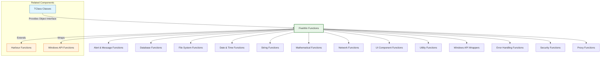

# FiveWin Function Reference Index

This index provides a comprehensive overview of all documented functions in the FiveWin framework, organized by category for easy navigation and reference.

**Source Directory:** [source/function/](../../../source/function/)

## Overview

The FiveWin function reference provides detailed documentation for all available functions in the framework. Functions are organized into logical categories based on their primary purpose and usage patterns.

Each function entry includes:
* Function signature and parameters
* Detailed description of purpose and behavior
* Usage examples with practical code
* Related components and dependencies
* Best practices and performance considerations
* Error handling and recovery strategies

## Function Categories

## Function Index by Category

### Alert & Message Functions

| Function | Description | Documentation |
|----------|-------------|---------------|
| `MsgInfo(cMessage, cTitle)` | Displays informational message box | [alerts.md](alerts.md) |
| `MsgAlert(cMessage, cTitle)` | Displays warning message box | [alerts.md](alerts.md) |
| `MsgStop(cMessage, cTitle)` | Displays error message box | [alerts.md](alerts.md) |
| `MsgYesNo(cMessage, cTitle)` | Displays Yes/No confirmation | [alerts.md](alerts.md) |
| `MsgOkCancel(cMessage, cTitle)` | Displays OK/Cancel confirmation | [alerts.md](alerts.md) |
| `MsgRetryCancel(cMessage, cTitle)` | Displays Retry/Cancel confirmation | [alerts.md](alerts.md) |
| `MsgYesNoCancel(cMessage, cTitle)` | Displays Yes/No/Cancel confirmation | [alerts.md](alerts.md) |

### Database Functions

| Function | Description | Documentation |
|----------|-------------|---------------|
| `DbUseArea(lNew, cDriver, cFile, cAlias, lShare)` | Opens database file | [database.md](database.md) |
| `DbCloseArea()` | Closes database file | [database.md](database.md) |
| `DbSelect(cAlias)` | Selects database area | [database.md](database.md) |
| `DbGoTop()` | Moves to first record | [database.md](database.md) |
| `DbGoBottom()` | Moves to last record | [database.md](database.md) |
| `DbSkip(nRecords)` | Skips records | [database.md](database.md) |
| `DbSeek(uKey, lSoftSeek)` | Seeks record by key | [database.md](database.md) |
| `DbAppend()` | Adds new record | [database.md](database.md) |
| `DbDelete()` | Marks record for deletion | [database.md](database.md) |
| `DbRecall()` | Recalls deleted record | [database.md](database.md) |
| `DbPack()` | Removes deleted records | [database.md](database.md) |
| `DbZap()` | Removes all records | [database.md](database.md) |
| `DbCommit()` | Commits changes | [database.md](database.md) |
| `DbCreateIndex(cIndex, cKey, cFor)` | Creates database index | [database.md](database.md) |
| `DbSetIndex(cIndex)` | Sets database index | [database.md](database.md) |
| `DbSetOrder(nOrder)` | Sets index order | [database.md](database.md) |
| `DbClearIndex()` | Clears database indexes | [database.md](database.md) |
| `DbReindex()` | Rebuilds database indexes | [database.md](database.md) |

### File System Functions

| Function | Description | Documentation |
|----------|-------------|---------------|
| `File(cFileName)` | Checks if file exists | [filesystem.md](filesystem.md) |
| `FileSize(cFileName)` | Returns file size | [filesystem.md](filesystem.md) |
| `FileTime(cFileName)` | Returns file timestamp | [filesystem.md](filesystem.md) |
| `FCopy(cSource, cTarget)` | Copies file | [filesystem.md](filesystem.md) |
| `FMove(cSource, cTarget)` | Moves/renames file | [filesystem.md](filesystem.md) |
| `FErase(cFileName)` | Deletes file | [filesystem.md](filesystem.md) |
| `FCreate(cFileName, nAttributes)` | Creates new file | [filesystem.md](filesystem.md) |
| `FOpen(cFileName, nMode)` | Opens existing file | [filesystem.md](filesystem.md) |
| `FClose(nHandle)` | Closes file handle | [filesystem.md](filesystem.md) |
| `Directory(cPath, cAttributes)` | Lists directory contents | [filesystem.md](filesystem.md) |
| `DirExists(cPath)` | Checks if directory exists | [filesystem.md](filesystem.md) |
| `MakeDir(cPath)` | Creates new directory | [filesystem.md](filesystem.md) |
| `RMDir(cPath)` | Removes empty directory | [filesystem.md](filesystem.md) |
| `SetCurrentDir(cPath)` | Changes current directory | [filesystem.md](filesystem.md) |
| `GetCurrentDir()` | Returns current directory | [filesystem.md](filesystem.md) |
| `DiskSpace(nDrive, lTotal)` | Returns disk space | [filesystem.md](filesystem.md) |

### Date & Time Functions

| Function | Description | Documentation |
|----------|-------------|---------------|
| `Date()` | Returns current date | [datetime.md](datetime.md) |
| `Time()` | Returns current time | [datetime.md](datetime.md) |
| `DateTime()` | Returns current datetime | [datetime.md](datetime.md) |
| `CToD(cDate)` | Converts string to date | [datetime.md](datetime.md) |
| `DToC(dDate)` | Converts date to string | [datetime.md](datetime.md) |
| `CToT(cDateTime)` | Converts string to datetime | [datetime.md](datetime.md) |
| `TToC(tDateTime)` | Converts datetime to string | [datetime.md](datetime.md) |
| `DateAdd(cInterval, nNumber, dDate)` | Adds interval to date | [datetime.md](datetime.md) |
| `DateDiff(cInterval, dDate1, dDate2)` | Calculates date difference | [datetime.md](datetime.md) |
| `TimeAdd(cInterval, nNumber, tDateTime)` | Adds interval to datetime | [datetime.md](datetime.md) |
| `TimeDiff(cInterval, tDateTime1, tDateTime2)` | Calculates datetime difference | [datetime.md](datetime.md) |
| `DOW(dDate)` | Returns day of week | [datetime.md](datetime.md) |
| `Month(dDate)` | Returns month | [datetime.md](datetime.md) |
| `Year(dDate)` | Returns year | [datetime.md](datetime.md) |
| `Day(dDate)` | Returns day | [datetime.md](datetime.md) |

### String Functions

| Function | Description | Documentation |
|----------|-------------|---------------|
| `PadL(cString, nLength, cPadChar)` | Left-pads string | [strings.md](strings.md) |
| `PadR(cString, nLength, cPadChar)` | Right-pads string | [strings.md](strings.md) |
| `PadC(cString, nLength, cPadChar)` | Center-pads string | [strings.md](strings.md) |
| `AllTrim(cString)` | Trims leading/trailing spaces | [strings.md](strings.md) |
| `LTrim(cString)` | Trims leading spaces | [strings.md](strings.md) |
| `RTrim(cString)` | Trims trailing spaces | [strings.md](strings.md) |
| `StrTran(cString, cSearch, cReplace, nStart, nCount)` | Replaces substrings | [strings.md](strings.md) |
| `At(cSearch, cString, nOccurrence)` | Finds substring position | [strings.md](strings.md) |
| `RAt(cSearch, cString)` | Finds last substring position | [strings.md](strings.md) |
| `SubStr(cString, nStart, nLength)` | Extracts substring | [strings.md](strings.md) |
| `Upper(cString)` | Converts to uppercase | [strings.md](strings.md) |
| `Lower(cString)` | Converts to lowercase | [strings.md](strings.md) |
| `Proper(cString)` | Converts to proper case | [strings.md](strings.md) |
| `Replicate(cString, nCount)` | Repeats string | [strings.md](strings.md) |
| `Space(nCount)` | Creates space string | [strings.md](strings.md) |
| `Chr(nAscii)` | Returns character for ASCII | [strings.md](strings.md) |
| `Asc(cChar)` | Returns ASCII for character | [strings.md](strings.md) |

### Mathematical Functions

| Function | Description | Documentation |
|----------|-------------|---------------|
| `Sin(nAngle)` | Calculates sine | [math.md](math.md) |
| `Cos(nAngle)` | Calculates cosine | [math.md](math.md) |
| `Tan(nAngle)` | Calculates tangent | [math.md](math.md) |
| `ASin(nValue)` | Calculates arcsine | [math.md](math.md) |
| `ACos(nValue)` | Calculates arccosine | [math.md](math.md) |
| `ATan(nValue)` | Calculates arctangent | [math.md](math.md) |
| `ATan2(nY, nX)` | Calculates arctangent with quadrant | [math.md](math.md) |
| `Log(nValue)` | Calculates natural logarithm | [math.md](math.md) |
| `Log10(nValue)` | Calculates base-10 logarithm | [math.md](math.md) |
| `Exp(nValue)` | Calculates exponential | [math.md](math.md) |
| `Pow(nBase, nExponent)` | Raises base to exponent | [math.md](math.md) |
| `Sqrt(nValue)` | Calculates square root | [math.md](math.md) |
| `Random()` | Generates random number | [math.md](math.md) |
| `Min(nValue1, nValue2)` | Returns minimum value | [math.md](math.md) |
| `Max(nValue1, nValue2)` | Returns maximum value | [math.md](math.md) |
| `Abs(nValue)` | Returns absolute value | [math.md](math.md) |

### Network Functions

| Function | Description | Documentation |
|----------|-------------|---------------|
| `SocketCreate(nProtocol)` | Creates new socket | [network.md](network.md) |
| `SocketConnect(cHost, nPort, nSocket)` | Connects socket | [network.md](network.md) |
| `SocketBind(nSocket, cAddress, nPort)` | Binds socket | [network.md](network.md) |
| `SocketListen(nSocket, nBacklog)` | Listens for connections | [network.md](network.md) |
| `SocketAccept(nSocket)` | Accepts connection | [network.md](network.md) |
| `SocketSend(nSocket, cData, nLength)` | Sends data | [network.md](network.md) |
| `SocketReceive(nSocket, cBuffer, nLength)` | Receives data | [network.md](network.md) |
| `SocketClose(nSocket)` | Closes socket | [network.md](network.md) |
| `HttpClientGet(cUrl, aHeaders)` | Sends HTTP GET request | [network.md](network.md) |
| `HttpClientPost(cUrl, cData, aHeaders)` | Sends HTTP POST request | [network.md](network.md) |
| `HttpClientPut(cUrl, cData, aHeaders)` | Sends HTTP PUT request | [network.md](network.md) |
| `HttpClientDelete(cUrl, aHeaders)` | Sends HTTP DELETE request | [network.md](network.md) |
| `FtpConnect(cHost, nPort, cUser, cPass)` | Connects to FTP server | [network.md](network.md) |
| `FtpDisconnect(nHandle)` | Disconnects from FTP server | [network.md](network.md) |
| `FtpGet(nHandle, cRemoteFile, cLocalFile)` | Downloads file from FTP | [network.md](network.md) |
| `FtpPut(nHandle, cLocalFile, cRemoteFile)` | Uploads file to FTP | [network.md](network.md) |

### ADO Functions

| Function | Description | Documentation |
|----------|-------------|---------------|
| `ADOConnect(cConnectionString)` | Establishes ADO connection | [ado.md](ado.md) |
| `ADODisconnect()` | Closes ADO connection | [ado.md](ado.md) |
| `ADOIsConnected()` | Checks ADO connection | [ado.md](ado.md) |
| `ADOExecute(cSQL, aParameters)` | Executes SQL query | [ado.md](ado.md) |
| `ADOQuery(cSQL, aParameters)` | Executes SELECT query | [ado.md](ado.md) |
| `ADONonQuery(cSQL, aParameters)` | Executes non-SELECT query | [ado.md](ado.md) |
| `ADOResultSet(cSQL, aParameters)` | Returns result set | [ado.md](ado.md) |
| `ADOExecuteScalar(cSQL, aParameters)` | Executes scalar query | [ado.md](ado.md) |
| `ADOSetConnectionTimeout(nTimeout)` | Sets connection timeout | [ado.md](ado.md) |
| `ADOSetCommandTimeout(nTimeout)` | Sets command timeout | [ado.md](ado.md) |

### UI Component Functions

| Function | Description | Documentation |
|----------|-------------|---------------|
| `DefineDialog(oDlg, cTitle, nTop, nLeft, nBottom, nRight)` | Defines dialog | [ui.md](ui.md) |
| `ActivateDialog(oDlg, lModal, lCentered)` | Activates dialog | [ui.md](ui.md) |
| `DefineWindow(oWnd, cTitle, nTop, nLeft, nBottom, nRight)` | Defines window | [ui.md](ui.md) |
| `ActivateWindow(oWnd)` | Activates window | [ui.md](ui.md) |
| `@ nRow, nCol SAY cText OF oWnd` | Creates SAY control | [ui.md](ui.md) |
| `@ nRow, nCol GET oGet VAR uVar OF oWnd` | Creates GET control | [ui.md](ui.md) |
| `@ nRow, nCol BUTTON oBtn OF oWnd` | Creates BUTTON control | [ui.md](ui.md) |
| `@ nRow, nCol LISTBOX oLbx OF oWnd` | Creates LISTBOX control | [ui.md](ui.md) |
| `@ nRow, nCol COMBOBOX oCbx OF oWnd` | Creates COMBOBOX control | [ui.md](ui.md) |
| `@ nRow, nCol EDIT oEdit OF oWnd` | Creates EDIT control | [ui.md](ui.md) |
| `@ nRow, nCol CHECKBOX oChk OF oWnd` | Creates CHECKBOX control | [ui.md](ui.md) |
| `@ nRow, nCol RADIO oRadio OF oWnd` | Creates RADIO control | [ui.md](ui.md) |

### Utility Functions

| Function | Description | Documentation |
|----------|-------------|---------------|
| `Random()` | Generates random number | [utilities.md](utilities.md) |
| `RandomInt(nMin, nMax)` | Generates random integer | [utilities.md](utilities.md) |
| `Sleep(nMilliseconds)` | Pauses execution | [utilities.md](utilities.md) |
| `Beep()` | Sounds system beep | [utilities.md](utilities.md) |
| `MsgBox(cText, cTitle, nType)` | Displays message box | [utilities.md](utilities.md) |
| `InputBox(cPrompt, cTitle, cDefault)` | Gets user input | [utilities.md](utilities.md) |
| `ChooseColor(nColor)` | Displays color picker | [utilities.md](utilities.md) |
| `ChooseFont(oFont)` | Displays font picker | [utilities.md](utilities.md) |
| `GetFileVersion(cFileName)` | Gets file version | [utilities.md](utilities.md) |
| `GetSystemMetrics(nIndex)` | Gets system metrics | [utilities.md](utilities.md) |
| `GetTickCount()` | Gets system tick count | [utilities.md](utilities.md) |
| `GetCurrentProcessId()` | Gets current process ID | [utilities.md](utilities.md) |

### Windows API Wrapper Functions

| Function | Description | Documentation |
|----------|-------------|---------------|
| `CreateWindow(cClassName, cWindowName, nStyle, nX, nY, nWidth, nHeight, hWndParent, hMenu, hInstance, lpParam)` | Creates window | [winapi.md](winapi.md) |
| `SendMessage(hWnd, nMsg, wParam, lParam)` | Sends window message | [winapi.md](winapi.md) |
| `PostMessage(hWnd, nMsg, wParam, lParam)` | Posts window message | [winapi.md](winapi.md) |
| `GetWindowText(hWnd, cString, nMaxCount)` | Gets window text | [winapi.md](winapi.md) |
| `SetWindowText(hWnd, cString)` | Sets window text | [winapi.md](winapi.md) |
| `GetDlgItem(hDlg, nIDDlgItem)` | Gets dialog item | [winapi.md](winapi.md) |
| `SetDlgItemText(hDlg, nIDDlgItem, cString)` | Sets dialog item text | [winapi.md](winapi.md) |
| `GetDlgItemInt(hDlg, nIDDlgItem, lTranslated, bSigned)` | Gets dialog item integer | [winapi.md](winapi.md) |
| `SetDlgItemInt(hDlg, nIDDlgItem, nValue, bSigned)` | Sets dialog item integer | [winapi.md](winapi.md) |
| `MessageBox(hWnd, cText, cCaption, nType)` | Displays message box | [winapi.md](winapi.md) |
| `CreateFile(cFileName, nDesiredAccess, nShareMode, lpSecurityAttributes, nCreationDisposition, nFlagsAndAttributes, hTemplateFile)` | Creates/open file | [winapi.md](winapi.md) |
| `ReadFile(hFile, pBuffer, nNumberOfBytesToRead, lpNumberOfBytesRead, lpOverlapped)` | Reads from file | [winapi.md](winapi.md) |
| `WriteFile(hFile, pBuffer, nNumberOfBytesToWrite, lpNumberOfBytesWritten, lpOverlapped)` | Writes to file | [winapi.md](winapi.md) |
| `CloseHandle(hObject)` | Closes handle | [winapi.md](winapi.md) |
| `GetLastError()` | Gets last error | [winapi.md](winapi.md) |

### Error Handling Functions

| Function | Description | Documentation |
|----------|-------------|---------------|
| `NetError()` | Returns network error status | [error.md](error.md) |
| `NetErrorMsg()` | Returns network error message | [error.md](error.md) |
| `NetClearError()` | Clears network error | [error.md](error.md) |
| `NetLastError()` | Returns last error code | [error.md](error.md) |
| `NetSetError(nErrorCode, cMessage)` | Sets custom error | [error.md](error.md) |
| `NetErrorRetry(nMaxRetries, nDelay)` | Implements retry logic | [error.md](error.md) |
| `NetErrorLog(cLogFile)` | Logs errors to file | [error.md](error.md) |
| `NetErrorCallback(bCallback)` | Sets error callback | [error.md](error.md) |

### Security Functions

| Function | Description | Documentation |
|----------|-------------|---------------|
| `SslConnect(cHost, nPort)` | Establishes SSL connection | [security.md](security.md) |
| `SslDisconnect(nHandle)` | Closes SSL connection | [security.md](security.md) |
| `SslSend(nHandle, cData)` | Sends encrypted data | [security.md](security.md) |
| `SslReceive(nHandle, cBuffer, nLength)` | Receives encrypted data | [security.md](security.md) |
| `SslCertificate(cHost, nPort)` | Gets server certificate | [security.md](security.md) |
| `SslVerifyCertificate(cCertificate)` | Verifies certificate | [security.md](security.md) |
| `SslEncrypt(cData, cKey)` | Encrypts data | [security.md](security.md) |
| `SslDecrypt(cData, cKey)` | Decrypts data | [security.md](security.md) |

### Proxy Functions

| Function | Description | Documentation |
|----------|-------------|---------------|
| `ProxySet(cProxy, nPort, cUser, cPass)` | Sets proxy server | [proxy.md](proxy.md) |
| `ProxyGet()` | Gets proxy settings | [proxy.md](proxy.md) |
| `ProxyClear()` | Clears proxy settings | [proxy.md](proxy.md) |
| `ProxyEnable(lEnable)` | Enables/disables proxy | [proxy.md](proxy.md) |
| `ProxyAuthenticate(cUser, cPass)` | Sets proxy authentication | [proxy.md](proxy.md) |
| `ProxyBypass(cPattern)` | Sets bypass patterns | [proxy.md](proxy.md) |
| `ProxyAutoConfig(cUrl)` | Sets PAC file URL | [proxy.md](proxy.md) |
| `ProxyTest(cUrl)` | Tests proxy connectivity | [proxy.md](proxy.md) |

## Cross-Reference Diagram

```mermaid
graph TD
    A[FiveWin Functions]
    
    A --> B[Core Functions]
    A --> C[Database Functions]
    A --> D[UI Functions]
    A --> E[Utility Functions]
    A --> F[System Functions]
    
    B --> G[Alert Functions]
    B --> H[Date Functions]
    B --> I[String Functions]
    B --> J[Math Functions]
    
    C --> K[DBF Functions]
    C --> L[ADO Functions]
    C --> M[SQL Functions]
    
    D --> N[Dialog Functions]
    D --> O[Control Functions]
    D --> P[Menu Functions]
    
    E --> Q[File Functions]
    E --> R[Network Functions]
    E --> S[Error Functions]
    
    F --> T[Windows API Functions]
    F --> U[Registry Functions]
    F --> V[Process Functions]
    
    subgraph "Related Components"
        W[Harbour Functions]
        X[Windows API]
        Y[TClass Objects]
        Z[Standard Libraries]
    end
    
    A -- "Extends" --> W
    A -- "Wraps" --> X
    Y -- "Provides Object Interface" --> A
    A -- "Uses" --> Z
    
    style A fill:#e8f5e8,stroke:#2e7d32,stroke-width:2px
    style W fill:#fff3e0,stroke:#e65100,stroke-width:1px
    style X fill:#fff3e0,stroke:#e65100,stroke-width:1px
    style Y fill:#e1f5fe,stroke:#01579b,stroke-width:1px
    style Z fill:#fce4ec,stroke:#880e4f,stroke-width:1px
```

## Function Usage Patterns

### Basic Pattern Recognition

```mermaid
graph TD
    A[Function Usage Patterns]
    
    A --> B[Initialization]
    A --> C[Execution]
    A --> D[Validation]
    A --> E[Error Handling]
    A --> F[Cleanup]
    
    B --> G[Constructor Calls]
    B --> H[Configuration]
    B --> I[Resource Allocation]
    
    C --> J[Data Processing]
    C --> K[UI Interaction]
    C --> L[Network Communication]
    
    D --> M[Input Validation]
    D --> N[State Validation]
    D --> O[Result Validation]
    
    E --> P[Exception Handling]
    E --> Q[Error Recovery]
    E --> R[Logging]
    
    F --> S[Resource Release]
    F --> T[State Reset]
    F --> U[Memory Cleanup]
    
    subgraph "Best Practices"
        V[Consistent Interfaces]
        W[Parameter Validation]
        X[Documentation]
        Y[Test Coverage]
    end
    
    A -- "Guided By" --> V
    A -- "Guided By" --> W
    A -- "Guided By" --> X
    A -- "Guided By" --> Y
    
    style A fill:#e8f5e8,stroke:#2e7d32,stroke-width:2px
    style B fill:#fff3e0,stroke:#e65100,stroke-width:1px
    style C fill:#fff3e0,stroke:#e65100,stroke-width:1px
    style D fill:#fff3e0,stroke:#e65100,stroke-width:1px
    style E fill:#fff3e0,stroke:#e65100,stroke-width:1px
    style F fill:#fff3e0,stroke:#e65100,stroke-width:1px
    style V fill:#e1f5fe,stroke:#01579b,stroke-width:1px
    style W fill:#e1f5fe,stroke:#01579b,stroke-width:1px
    style X fill:#e1f5fe,stroke:#01579b,stroke-width:1px
    style Y fill:#e1f5fe,stroke:#01579b,stroke-width:1px
```

## Related Components

* [Harbour Function Reference](https://harbour.github.io/doc/functions.html) - Standard Harbour function documentation
* [Windows API Documentation](https://docs.microsoft.com/en-us/windows/win32/api/) - Microsoft Windows API reference
* [TClass Class Reference](../classes/) - Object-oriented class documentation
* [FiveWin.ch Include File](../../../source/include/FiveWin.ch) - Core FiveWin constants and definitions

## Best Practices

1. **Consistent Interfaces**: Use consistent parameter ordering and naming conventions
2. **Parameter Validation**: Always validate function parameters to prevent errors
3. **Error Handling**: Implement proper error handling with meaningful error messages
4. **Documentation**: Provide clear documentation with usage examples
5. **Performance**: Optimize functions for performance with large datasets
6. **Memory Management**: Properly manage memory allocation and deallocation
7. **Security**: Validate inputs to prevent injection attacks
8. **Testing**: Test functions with edge cases and boundary conditions
9. **Logging**: Implement appropriate logging for debugging and monitoring
10. **Compatibility**: Maintain backward compatibility when updating functions

## Performance Considerations

* Functions with large parameter lists may impact performance
* String operations can be slower with large text volumes
* Database functions may have network latency implications
* File I/O functions can be slow with large files
* Network functions are subject to connection speed and latency
* Consider caching results of expensive function calls
* Use appropriate data types for optimal performance
* Batch operations when possible to reduce function call overhead
* Profile performance-critical functions regularly
* Optimize algorithms for specific use cases