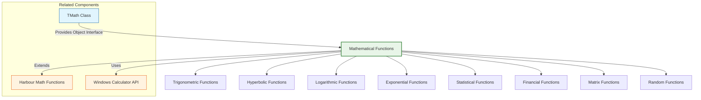

# Mathematical Functions

The FiveWin mathematical functions provide a comprehensive library of mathematical operations that extend the standard Harbour mathematics capabilities. These functions cover areas such as trigonometry, logarithms, exponential functions, statistical calculations, and financial mathematics.

**Source Files:** [source/function/math.prg](../../../../source/function/math.prg), [source/function/matrices.prg](../../../../source/function/matrices.prg)

## Overview

The mathematical function library in FiveWin offers enhanced mathematical capabilities that complement the standard Harbour mathematical functions. These functions cover areas such as:

* Advanced trigonometric operations (sine, cosine, tangent, and inverses)
* Hyperbolic functions
* Logarithmic and exponential calculations
* Statistical functions (mean, median, standard deviation, etc.)
* Financial calculations (interest, annuities, depreciation)
* Matrix operations (addition, multiplication, inversion)
* Random number generation and probability distributions

These functions are designed to be both accurate and efficient, making complex mathematical operations accessible to FiveWin developers.

## Function Categories



## Trigonometric Functions

| Function | Description | Parameters |
|----------|-------------|------------|
| `Sin(nAngle)` | Calculates sine of angle (in radians) | `nAngle`: Angle in radians |
| `Cos(nAngle)` | Calculates cosine of angle (in radians) | `nAngle`: Angle in radians |
| `Tan(nAngle)` | Calculates tangent of angle (in radians) | `nAngle`: Angle in radians |
| `ASin(nValue)` | Calculates arcsine (inverse sine) | `nValue`: Sine value (-1 to 1) |
| `ACos(nValue)` | Calculates arccosine (inverse cosine) | `nValue`: Cosine value (-1 to 1) |
| `ATan(nValue)` | Calculates arctangent (inverse tangent) | `nValue`: Tangent value |
| `ATan2(nY, nX)` | Calculates arctangent of y/x with proper quadrant | `nY`: Y coordinate, `nX`: X coordinate |
| `DegToRad(nDegrees)` | Converts degrees to radians | `nDegrees`: Angle in degrees |
| `RadToDeg(nRadians)` | Converts radians to degrees | `nRadians`: Angle in radians |

### Usage Examples

```harbour
#include "FiveWin.ch"

function Main()
   // Basic trigonometric functions
   local nAngle := 45  // degrees
   local nRadians := DegToRad( nAngle )
   
   ? "Angle: " + hb_ntos( nAngle ) + " degrees"
   ? "In radians: " + hb_ntos( nRadians, 6 )
   ? "Sin: " + hb_ntos( Sin( nRadians ), 6 )
   ? "Cos: " + hb_ntos( Cos( nRadians ), 6 )
   ? "Tan: " + hb_ntos( Tan( nRadians ), 6 )
   
   // Inverse trigonometric functions
   TrigonometricDemo()
   
return nil

static function TrigonometricDemo()
   ? "Inverse Trigonometric Functions:"
   
   local aValue := 0.5
   ? "Value: " + hb_ntos( aValue )
   ? "Arcsine: " + hb_ntos( RadToDeg( ASin( aValue ) ), 2 ) + " degrees"
   ? "Arccosine: " + hb_ntos( RadToDeg( ACos( aValue ) ), 2 ) + " degrees"
   ? "Arctangent: " + hb_ntos( RadToDeg( ATan( aValue ) ), 2 ) + " degrees"
   
   // ATan2 example for proper quadrant determination
   Atan2Demo()
   
return nil

static function Atan2Demo()
   ? "ATan2 Examples (proper quadrant determination):"
   
   // Test points in different quadrants
   local aPoints := { ;
      { 1, 1 },    // Quadrant 1
      { -1, 1 },   // Quadrant 2
      { -1, -1 },  // Quadrant 3
      { 1, -1 }    // Quadrant 4
   }
   
   for local i := 1 to Len( aPoints )
      local nY := aPoints[i][1]
      local nX := aPoints[i][2]
      local nAtan2 := ATan2( nY, nX )
      local nDegrees := RadToDeg( nAtan2 )
      
      ? "Point (" + hb_ntos( nX ) + ", " + hb_ntos( nY ) + "): " + ;
        hb_ntos( nDegrees, 2 ) + " degrees"
   next
   
   // Practical application: Distance and bearing calculation
   DistanceBearingDemo()
   
return nil

static function DistanceBearingDemo()
   local nLat1 := 40.7128  // New York City
   local nLon1 := -74.0060
   local nLat2 := 34.0522  // Los Angeles
   local nLon2 := -118.2437
   
   ? "Distance and Bearing Calculation:"
   ? "From: New York City (" + hb_ntos( nLat1, 4 ) + ", " + hb_ntos( nLon1, 4 ) + ")"
   ? "To: Los Angeles (" + hb_ntos( nLat2, 4 ) + ", " + hb_ntos( nLon2, 4 ) + ")"
   
   // Convert to radians
   local nLat1Rad := DegToRad( nLat1 )
   local nLon1Rad := DegToRad( nLon1 )
   local nLat2Rad := DegToRad( nLat2 )
   local nLon2Rad := DegToRad( nLon2 )
   
   // Calculate distance using haversine formula
   local nDeltaLat := nLat2Rad - nLat1Rad
   local nDeltaLon := nLon2Rad - nLon1Rad
   
   local nA := Sin( nDeltaLat / 2 ) * Sin( nDeltaLat / 2 ) + ;
              Cos( nLat1Rad ) * Cos( nLat2Rad ) * ;
              Sin( nDeltaLon / 2 ) * Sin( nDeltaLon / 2 )
   local nC := 2 * ATan2( Sqrt( nA ), Sqrt( 1 - nA ) )
   
   // Earth radius in kilometers
   local nEarthRadius := 6371
   local nDistance := nEarthRadius * nC
   
   ? "Distance: " + hb_ntos( nDistance, 2 ) + " km"
   
   // Calculate bearing
   local nY := Sin( nDeltaLon ) * Cos( nLat2Rad )
   local nX := Cos( nLat1Rad ) * Sin( nLat2Rad ) - ;
              Sin( nLat1Rad ) * Cos( nLat2Rad ) * Cos( nDeltaLon )
   local nBearing := RadToDeg( ATan2( nY, nX ) )
   
   // Normalize bearing to 0-360 degrees
   if nBearing < 0
      nBearing += 360
   endif
   
   ? "Initial Bearing: " + hb_ntos( nBearing, 2 ) + " degrees"
   
return nil

static function DegToRad( nDegrees )
   return nDegrees * ( Pi() / 180 )
   
return 0

static function RadToDeg( nRadians )
   return nRadians * ( 180 / Pi() )
   
return 0

static function Pi()
   return 3.14159265358979323846
   
return 3.141592653589793
```

## Hyperbolic Functions

| Function | Description | Parameters |
|----------|-------------|------------|
| `Sinh(nValue)` | Calculates hyperbolic sine | `nValue`: Input value |
| `Cosh(nValue)` | Calculates hyperbolic cosine | `nValue`: Input value |
| `Tanh(nValue)` | Calculates hyperbolic tangent | `nValue`: Input value |
| `ASinh(nValue)` | Calculates inverse hyperbolic sine | `nValue`: Input value |
| `ACosh(nValue)` | Calculates inverse hyperbolic cosine | `nValue`: Input value (>= 1) |
| `ATanh(nValue)` | Calculates inverse hyperbolic tangent | `nValue`: Input value (|x| < 1) |

### Usage Examples

```harbour
#include "FiveWin.ch"

function Main()
   local nValue := 1.0
   
   ? "Hyperbolic Functions:"
   ? "Value: " + hb_ntos( nValue )
   ? "Sinh: " + hb_ntos( Sinh( nValue ), 6 )
   ? "Cosh: " + hb_ntos( Cosh( nValue ), 6 )
   ? "Tanh: " + hb_ntos( Tanh( nValue ), 6 )
   
   // Inverse hyperbolic functions
   InverseHyperbolicDemo()
   
return nil

static function InverseHyperbolicDemo()
   ? "Inverse Hyperbolic Functions:"
   
   local aValue := 1.5
   ? "Value: " + hb_ntos( aValue )
   ? "ASinh: " + hb_ntos( ASinh( aValue ), 6 )
   ? "ACosh: " + hb_ntos( ACosh( aValue ), 6 )  // Note: aValue must be >= 1
   ? "ATanh: " + hb_ntos( ATanh( 0.5 ), 6 )     // Note: value must be |x| < 1
   
   // Applications of hyperbolic functions
   HyperbolicApplicationsDemo()
   
return nil

static function HyperbolicApplicationsDemo()
   ? "Applications of Hyperbolic Functions:"
   
   // Catenary curve (shape of hanging cable)
   CatenaryCurveDemo()
   
   // Special relativity calculations
   RelativityDemo()
   
return nil

static function CatenaryCurveDemo()
   ? "Catenary Curve (Hanging Cable):"
   ? "Equation: y = a * cosh(x/a)"
   
   local aParameter := 2.0  // Scale parameter
   local nRange := 5.0      // Range of x values
   
   ? "Parameter a: " + hb_ntos( aParameter )
   ? "x range: -" + hb_ntos( nRange ) + " to " + hb_ntos( nRange )
   
   // Calculate points on the curve
   for local i := -nRange to nRange step 1.0
      local nY := aParameter * Cosh( i / aParameter )
      ? "x=" + hb_ntos( i, 2 ) + ", y=" + hb_ntos( nY, 2 )
   next
   
return nil

static function RelativityDemo()
   ? "Special Relativity (Lorentz Factor):"
   ? "γ = 1 / sqrt(1 - v²/c²) = cosh(φ) where φ is rapidity"
   
   // Speed of light in m/s
   local nSpeedOfLight := 299792458
   
   // Various speeds as fraction of light speed
   local aSpeeds := { ;
      { 0.1, "10% speed of light" }, ;
      { 0.5, "50% speed of light" }, ;
      { 0.9, "90% speed of light" }, ;
      { 0.99, "99% speed of light" } ;
   }
   
   for local i := 1 to Len( aSpeeds )
      local nBeta := aSpeeds[i][1]  // v/c ratio
      local cDescription := aSpeeds[i][2]
      
      // Lorentz factor γ = 1/sqrt(1 - β²)
      local nGamma := 1 / Sqrt( 1 - ( nBeta * nBeta ) )
      
      // Rapidity φ = atanh(β)
      local nRapidity := ATanh( nBeta )
      
      ? cDescription + ":"
      ? "  β = v/c = " + hb_ntos( nBeta, 4 )
      ? "  γ = " + hb_ntos( nGamma, 4 )
      ? "  φ = " + hb_ntos( nRapidity, 4 ) + " (rapidity)"
      ?
   next
   
return nil
```

## Logarithmic and Exponential Functions

| Function | Description | Parameters |
|----------|-------------|------------|
| `Log(nValue)` | Calculates natural logarithm (base e) | `nValue`: Positive number |
| `Log10(nValue)` | Calculates base-10 logarithm | `nValue`: Positive number |
| `Exp(nValue)` | Calculates exponential (e^n) | `nValue`: Exponent |
| `Pow(nBase, nExponent)` | Raises base to exponent power | `nBase`: Base, `nExponent`: Power |
| `Sqrt(nValue)` | Calculates square root | `nValue`: Non-negative number |
| `Power(nBase, nExponent)` | Alternative power function | `nBase`: Base, `nExponent`: Power |

### Usage Examples

```harbour
#include "FiveWin.ch"

function Main()
   local nValue := 100
   
   ? "Logarithmic and Exponential Functions:"
   ? "Value: " + hb_ntos( nValue )
   ? "Natural Log: " + hb_ntos( Log( nValue ), 6 )
   ? "Log base 10: " + hb_ntos( Log10( nValue ), 6 )
   ? "Square Root: " + hb_ntos( Sqrt( nValue ), 6 )
   ? "e^" + hb_ntos( Log( nValue ), 2 ) + " = " + hb_ntos( Exp( Log( nValue ) ), 6 )
   
   // Power calculations
   PowerCalculationsDemo()
   
return nil

static function PowerCalculationsDemo()
   ? "Power Calculations:"
   
   local nBase := 2
   local nExponent := 8
   
   ? "Base: " + hb_ntos( nBase )
   ? "Exponent: " + hb_ntos( nExponent )
   ? "Result: " + hb_ntos( Pow( nBase, nExponent ) )
   
   // Compound interest calculation
   CompoundInterestDemo()
   
   // Exponential growth examples
   ExponentialGrowthDemo()
   
return nil

static function CompoundInterestDemo()
   ? "Compound Interest Calculation:"
   
   local nPrincipal := 1000    // Initial amount
   local nRate := 0.05        // 5% annual interest rate
   local nYears := 10         // Investment period
   local nCompounds := 12     // Monthly compounding
   
   // Formula: A = P(1 + r/n)^(nt)
   local nAmount := nPrincipal * Pow( ( 1 + nRate / nCompounds ), ( nCompounds * nYears ) )
   local nInterest := nAmount - nPrincipal
   
   ? "Principal: $" + hb_ntos( nPrincipal, 2 )
   ? "Interest Rate: " + hb_ntos( nRate * 100, 2 ) + "%"
   ? "Time Period: " + hb_ntos( nYears ) + " years"
   ? "Compounding: " + hb_ntos( nCompounds ) + " times per year"
   ? "Final Amount: $" + hb_ntos( nAmount, 2 )
   ? "Interest Earned: $" + hb_ntos( nInterest, 2 )
   
return nil

static function ExponentialGrowthDemo()
   ? "Exponential Growth Examples:"
   
   // Population growth
   local nInitialPopulation := 1000000  // 1 million
   local nGrowthRate := 0.02           // 2% annual growth
   local nYears := 25
   
   ? "Population Growth:"
   ? "Initial: " + hb_ntos( nInitialPopulation )
   ? "Growth Rate: " + hb_ntos( nGrowthRate * 100, 2 ) + "% per year"
   
   for local i := 0 to nYears step 5
      local nPopulation := nInitialPopulation * Exp( nGrowthRate * i )
      ? "Year " + hb_ntos( i ) + ": " + hb_ntos( nPopulation, 0 )
   next
   
   // Radioactive decay
   RadioactiveDecayDemo()
   
return nil

static function RadioactiveDecayDemo()
   ? "Radioactive Decay (Half-life calculation):"
   
   local nInitialAmount := 100    // grams
   local nHalfLife := 5730        // Carbon-14 half-life in years
   local nTimePeriods := 20000    // years to simulate
   
   ? "Initial Amount: " + hb_ntos( nInitialAmount ) + " grams"
   ? "Half-life: " + hb_ntos( nHalfLife ) + " years"
   
   // Formula: N(t) = N₀ * e^(-λt) where λ = ln(2)/T½
   local nLambda := Log( 2 ) / nHalfLife
   
   for local i := 0 to nTimePeriods step 2000
      local nRemaining := nInitialAmount * Exp( -nLambda * i )
      local nDecayed := nInitialAmount - nRemaining
      local nPercentage := ( nRemaining / nInitialAmount ) * 100
      
      ? "After " + hb_ntos( i ) + " years:"
      ? "  Remaining: " + hb_ntos( nRemaining, 2 ) + " grams"
      ? "  Decayed: " + hb_ntos( nDecayed, 2 ) + " grams"
      ? "  Percentage: " + hb_ntos( nPercentage, 2 ) + "%"
      ?
   next
   
return nil
```

## Statistical Functions

| Function | Description | Parameters |
|----------|-------------|------------|
| `Mean(aValues)` | Calculates arithmetic mean of array | `aValues`: Array of numbers |
| `Median(aValues)` | Calculates median value of array | `aValues`: Array of numbers |
| `Mode(aValues)` | Calculates mode (most frequent value) | `aValues`: Array of numbers |
| `StdDev(aValues)` | Calculates standard deviation | `aValues`: Array of numbers |
| `Variance(aValues)` | Calculates variance | `aValues`: Array of numbers |
| `Min(aValues)` | Finds minimum value in array | `aValues`: Array of numbers |
| `Max(aValues)` | Finds maximum value in array | `aValues`: Array of numbers |
| `Sum(aValues)` | Calculates sum of array elements | `aValues`: Array of numbers |
| `Count(aValues)` | Counts number of elements | `aValues`: Array |

### Usage Examples

```harbour
#include "FiveWin.ch"

function Main()
   // Sample dataset
   local aScores := { 85, 92, 78, 96, 88, 76, 89, 94, 82, 90, 87, 93, 79, 85, 91 }
   
   ? "Statistical Analysis:"
   ? "Dataset: " + hb_ValToStr( aScores )
   ?
   ? "Mean: " + hb_ntos( Mean( aScores ), 2 )
   ? "Median: " + hb_ntos( Median( aScores ), 2 )
   ? "Mode: " + hb_ValToStr( Mode( aScores ) )
   ? "Standard Deviation: " + hb_ntos( StdDev( aScores ), 2 )
   ? "Variance: " + hb_ntos( Variance( aScores ), 2 )
   ? "Minimum: " + hb_ntos( Min( aScores ) )
   ? "Maximum: " + hb_ntos( Max( aScores ) )
   ? "Sum: " + hb_ntos( Sum( aScores ) )
   ? "Count: " + hb_ntos( Len( aScores ) )
   
   // Percentile calculations
   PercentileDemo( aScores )
   
   // Distribution analysis
   DistributionAnalysisDemo( aScores )
   
return nil

static function Mean( aValues )
   if Empty( aValues )
      return 0
   endif
   
   local nSum := 0
   for local i := 1 to Len( aValues )
      nSum += aValues[i]
   next
   
   return nSum / Len( aValues )
   
return 0

static function Median( aValues )
   if Empty( aValues )
      return 0
   endif
   
   // Create sorted copy
   local aSorted := aClone( aValues )
   ASort( aSorted )
   
   local nLength := Len( aSorted )
   
   if nLength % 2 == 1
      // Odd number of elements
      return aSorted[ Int( ( nLength + 1 ) / 2 ) ]
   else
      // Even number of elements
      local nMid1 := aSorted[ nLength / 2 ]
      local nMid2 := aSorted[ ( nLength / 2 ) + 1 ]
      return ( nMid1 + nMid2 ) / 2
   endif
   
return 0

static function Mode( aValues )
   if Empty( aValues )
      return {}
   endif
   
   // Count frequencies
   local aCounts := {}
   
   for local i := 1 to Len( aValues )
      local nValue := aValues[i]
      local nPos := AScan( aCounts, { |a| a[1] == nValue } )
      
      if nPos > 0
         aCounts[nPos][2]++
      else
         AAdd( aCounts, { nValue, 1 } )
      endif
   next
   
   // Sort by frequency
   ASort( aCounts, , , { |a, b| a[2] > b[2] } )
   
   // Return value(s) with highest frequency
   local nMaxFreq := aCounts[1][2]
   local aModes := {}
   
   for local i := 1 to Len( aCounts )
      if aCounts[i][2] == nMaxFreq
         AAdd( aModes, aCounts[i][1] )
      else
         exit
      endif
   next
   
   return aModes
   
return {}

static function StdDev( aValues )
   local nMean := Mean( aValues )
   local nVariance := 0
   
   for local i := 1 to Len( aValues )
      local nDiff := aValues[i] - nMean
      nVariance += nDiff * nDiff
   next
   
   return Sqrt( nVariance / Len( aValues ) )
   
return 0

static function Variance( aValues )
   local nMean := Mean( aValues )
   local nVariance := 0
   
   for local i := 1 to Len( aValues )
      local nDiff := aValues[i] - nMean
      nVariance += nDiff * nDiff
   next
   
   return nVariance / Len( aValues )
   
return 0

static function Min( aValues )
   if Empty( aValues )
      return 0
   endif
   
   local nMin := aValues[1]
   
   for local i := 2 to Len( aValues )
      if aValues[i] < nMin
         nMin := aValues[i]
      endif
   next
   
   return nMin
   
return 0

static function Max( aValues )
   if Empty( aValues )
      return 0
   endif
   
   local nMax := aValues[1]
   
   for local i := 2 to Len( aValues )
      if aValues[i] > nMax
         nMax := aValues[i]
      endif
   next
   
   return nMax
   
return 0

static function Sum( aValues )
   local nSum := 0
   
   for local i := 1 to Len( aValues )
      nSum += aValues[i]
   next
   
   return nSum
   
return 0

static function PercentileDemo( aScores )
   ? "Percentile Calculations:"
   
   // Sort data first
   local aSorted := aClone( aScores )
   ASort( aSorted )
   
   local aPercentiles := { 25, 50, 75, 90, 95, 99 }
   
   for local i := 1 to Len( aPercentiles )
      local nPercentile := aPercentiles[i]
      local nValue := CalculatePercentile( aSorted, nPercentile )
      ? hb_ntos( nPercentile ) + "th percentile: " + hb_ntos( nValue, 2 )
   next
   
return nil

static function CalculatePercentile( aValues, nPercentile )
   if Empty( aValues )
      return 0
   endif
   
   local nCount := Len( aValues )
   local nIndex := ( nPercentile / 100 ) * ( nCount - 1 ) + 1
   
   if nIndex <= 1
      return aValues[1]
   elseif nIndex >= nCount
      return aValues[nCount]
   else
      local nLowerIndex := Int( nIndex )
      local nUpperIndex := nLowerIndex + 1
      local nFraction := nIndex - nLowerIndex
      
      return aValues[nLowerIndex] + ;
             nFraction * ( aValues[nUpperIndex] - aValues[nLowerIndex] )
   endif
   
return 0

static function DistributionAnalysisDemo( aScores )
   ? "Distribution Analysis:"
   
   // Calculate frequency distribution
   local nMinScore := Min( aScores )
   local nMaxScore := Max( aScores )
   local nRange := nMaxScore - nMinScore
   local nBins := 5  // Number of bins
   local nBinWidth := nRange / nBins
   
   ? "Score Range: " + hb_ntos( nMinScore ) + " to " + hb_ntos( nMaxScore )
   ? "Bin Width: " + hb_ntos( nBinWidth, 2 )
   
   // Create bins
   local aBins := {}
   for local i := 1 to nBins
      local nLower := nMinScore + ( ( i - 1 ) * nBinWidth )
      local nUpper := nLower + nBinWidth
      AAdd( aBins, { nLower, nUpper, 0 } )  // Lower, Upper, Count
   next
   
   // Count scores in each bin
   for local i := 1 to Len( aScores )
      local nScore := aScores[i]
      for local j := 1 to Len( aBins )
         if nScore >= aBins[j][1] .and. nScore < aBins[j][2]
            aBins[j][3]++
            exit
         elseif j == Len( aBins ) .and. nScore == aBins[j][2]  // Handle upper boundary
            aBins[j][3]++
         endif
      next
   next
   
   // Display histogram
   ? "Histogram:"
   for local i := 1 to Len( aBins )
      local nLower := aBins[i][1]
      local nUpper := aBins[i][2]
      local nCount := aBins[i][3]
      local cBar := Replicate( "*", nCount )
      
      ? hb_ntos( Int( nLower ) ) + "-" + hb_ntos( Int( nUpper ) ) + ": " + ;
        cBar + " (" + hb_ntos( nCount ) + ")"
   next
   
return nil
```

## Financial Functions

| Function | Description | Parameters |
|----------|-------------|------------|
| `PV(nRate, nPeriods, nPayment, nFuture, nType)` | Calculates present value | `nRate`: Interest rate, `nPeriods`: Number of periods, `nPayment`: Payment amount, `nFuture`: Future value, `nType`: Payment timing |
| `FV(nRate, nPeriods, nPayment, nPresent, nType)` | Calculates future value | `nRate`: Interest rate, `nPeriods`: Number of periods, `nPayment`: Payment amount, `nPresent`: Present value, `nType`: Payment timing |
| `PMT(nRate, nPeriods, nPresent, nFuture, nType)` | Calculates payment amount | `nRate`: Interest rate, `nPeriods`: Number of periods, `nPresent`: Present value, `nFuture`: Future value, `nType`: Payment timing |
| `NPV(nRate, aCashFlows)` | Calculates net present value | `nRate`: Discount rate, `aCashFlows`: Array of cash flows |
| `IRR(aCashFlows)` | Calculates internal rate of return | `aCashFlows`: Array of cash flows |
| `SLN(nCost, nSalvage, nLife)` | Calculates straight-line depreciation | `nCost`: Asset cost, `nSalvage`: Salvage value, `nLife`: Useful life |

### Usage Examples

```harbour
#include "FiveWin.ch"

function Main()
   // Loan calculation example
   local nLoanAmount := 100000    // $100,000 loan
   local nAnnualRate := 0.06      // 6% annual interest rate
   local nMonthlyRate := nAnnualRate / 12
   local nTermMonths := 360      // 30-year loan (360 months)
   
   local nMonthlyPayment := PMT( nMonthlyRate, nTermMonths, nLoanAmount )
   
   ? "Loan Calculation:"
   ? "Loan Amount: $" + hb_ntos( nLoanAmount, 2 )
   ? "Interest Rate: " + hb_ntos( nAnnualRate * 100, 2 ) + "% annually"
   ? "Term: " + hb_ntos( nTermMonths / 12 ) + " years"
   ? "Monthly Payment: $" + hb_ntos( Abs( nMonthlyPayment ), 2 )
   
   // Amortization schedule
   AmortizationScheduleDemo( nLoanAmount, nMonthlyRate, nTermMonths, nMonthlyPayment )
   
   // Investment analysis
   InvestmentAnalysisDemo()
   
return nil

static function PMT( nRate, nPeriods, nPresent, nFuture, nType )
   DEFAULT nFuture := 0, nType := 0
   
   if nRate == 0
      return -( nPresent + nFuture ) / nPeriods
   endif
   
   local nPayment := ( nPresent * Pow( 1 + nRate, nPeriods ) + nFuture ) * ;
                    nRate / ( Pow( 1 + nRate, nPeriods ) - 1 )
   
   if nType == 1  // Payments at beginning of period
      nPayment := nPayment / ( 1 + nRate )
   endif
   
   return nPayment
   
return 0

static function AmortizationScheduleDemo( nLoanAmount, nMonthlyRate, nTermMonths, nMonthlyPayment )
   ? "Amortization Schedule (First 12 months):"
   ? Replicate( "-", 70 )
   ? "Month Principal Interest   Balance"
   ? Replicate( "-", 70 )
   
   local nBalance := nLoanAmount
   
   for local i := 1 to Min( 12, nTermMonths )
      local nInterest := nBalance * nMonthlyRate
      local nPrincipal := Abs( nMonthlyPayment ) - nInterest
      nBalance -= nPrincipal
      
      ? PadL( hb_ntos( i ), 5 ) + " " + ;
        PadL( hb_ntos( nPrincipal, 2 ), 9 ) + " " + ;
        PadL( hb_ntos( nInterest, 2 ), 8 ) + " " + ;
        PadL( hb_ntos( nBalance, 2 ), 10 )
      
      if nBalance <= 0
         exit
      endif
   next
   
   ? Replicate( "-", 70 )
   
return nil

static function InvestmentAnalysisDemo()
   ? "Investment Analysis:"
   
   // Net Present Value (NPV) calculation
   NPVDemo()
   
   // Internal Rate of Return (IRR) calculation
   IRRDemo()
   
   // Depreciation calculations
   DepreciationDemo()
   
return nil

static function NPVDemo()
   ? "Net Present Value (NPV) Calculation:"
   
   local nDiscountRate := 0.10  // 10% discount rate
   local aCashFlows := { -10000, 3000, 4000, 5000, 6000 }  // Initial investment negative
   
   ? "Initial Investment: $" + hb_ntos( aCashFlows[1], 2 )
   ? "Discount Rate: " + hb_ntos( nDiscountRate * 100, 2 ) + "%"
   ? "Cash Flows: " + hb_ValToStr( aCashFlows )
   
   local nNPV := 0
   for local i := 1 to Len( aCashFlows )
      nNPV += aCashFlows[i] / Pow( 1 + nDiscountRate, i - 1 )
   next
   
   ? "NPV: $" + hb_ntos( nNPV, 2 )
   ? "Decision: " + iif( nNPV > 0, "Accept (Positive NPV)", "Reject (Negative NPV)" )
   
return nil

static function IRRDemo()
   ? "Internal Rate of Return (IRR) Calculation:"
   
   // Cash flows for an investment
   local aCashFlows := { -50000, 15000, 20000, 25000, 30000 }
   
   ? "Investment Cash Flows: " + hb_ValToStr( aCashFlows )
   
   // Simple IRR approximation using trial and error
   local nIRR := CalculateIRR( aCashFlows )
   
   ? "IRR: " + hb_ntos( nIRR * 100, 2 ) + "%"
   ? "Decision: " + iif( nIRR > 0.10, "Accept (IRR > 10%)", "Consider (IRR <= 10%)" )
   
return nil

static function CalculateIRR( aCashFlows )
   // Simple Newton-Raphson method for IRR calculation
   local nGuess := 0.10  // 10% initial guess
   local nTolerance := 0.0001
   local nMaxIterations := 100
   local nIteration := 0
   
   while nIteration < nMaxIterations
      local nNPV := 0
      local nNPVDerivative := 0
      
      for local i := 1 to Len( aCashFlows )
         local nPeriod := i - 1
         local nCashFlow := aCashFlows[i]
         
         if nPeriod == 0
            nNPV += nCashFlow
         else
            nNPV += nCashFlow / Pow( 1 + nGuess, nPeriod )
            nNPVDerivative -= nPeriod * nCashFlow / Pow( 1 + nGuess, nPeriod + 1 )
         endif
      next
      
      if Abs( nNPVDerivative ) < 1e-10
         exit  // Avoid division by zero
      endif
      
      local nNewGuess := nGuess - nNPV / nNPVDerivative
      
      if Abs( nNewGuess - nGuess ) < nTolerance
         return nNewGuess
      endif
      
      nGuess := nNewGuess
      nIteration++
   enddo
   
   return nGuess  // Return best estimate
   
return 0.10

static function DepreciationDemo()
   ? "Depreciation Calculations:"
   
   local nAssetCost := 50000      // $50,000 asset
   local nSalvageValue := 5000    // $5,000 salvage value
   local nUsefulLife := 5         // 5 years useful life
   
   ? "Asset Cost: $" + hb_ntos( nAssetCost, 2 )
   ? "Salvage Value: $" + hb_ntos( nSalvageValue, 2 )
   ? "Useful Life: " + hb_ntos( nUsefulLife ) + " years"
   
   // Straight-line depreciation
   local nAnnualSLN := SLN( nAssetCost, nSalvageValue, nUsefulLife )
   ? "Straight-line Annual Depreciation: $" + hb_ntos( nAnnualSLN, 2 )
   
   // Double-declining balance depreciation
   DoubleDecliningBalanceDemo( nAssetCost, nSalvageValue, nUsefulLife )
   
return nil

static function SLN( nCost, nSalvage, nLife )
   return ( nCost - nSalvage ) / nLife
   
return 0

static function DoubleDecliningBalanceDemo( nCost, nSalvage, nLife )
   ? "Double-Declining Balance Method:"
   
   local nRate := 2 / nLife  // Double the straight-line rate
   local nBookValue := nCost
   
   for local i := 1 to nLife
      local nDepreciation := nBookValue * nRate
      
      // Don't depreciate below salvage value
      if nBookValue - nDepreciation < nSalvage
         nDepreciation := nBookValue - nSalvage
      endif
      
      nBookValue -= nDepreciation
      
      ? "Year " + hb_ntos( i ) + ": $" + hb_ntos( nDepreciation, 2 ) + ;
        " (Book Value: $" + hb_ntos( nBookValue, 2 ) + ")"
      
      if nBookValue <= nSalvage
         exit
      endif
   next
   
return nil
```

## Matrix Functions

| Function | Description | Parameters |
|----------|-------------|------------|
| `MatAdd(aMatrix1, aMatrix2)` | Adds two matrices | `aMatrix1`, `aMatrix2`: Matrices to add |
| `MatMul(aMatrix1, aMatrix2)` | Multiplies two matrices | `aMatrix1`, `aMatrix2`: Matrices to multiply |
| `MatTranspose(aMatrix)` | Transposes matrix | `aMatrix`: Matrix to transpose |
| `MatInverse(aMatrix)` | Calculates matrix inverse | `aMatrix`: Matrix to invert |
| `MatDet(aMatrix)` | Calculates matrix determinant | `aMatrix`: Matrix |
| `MatIdentity(nSize)` | Creates identity matrix | `nSize`: Matrix dimensions |
| `MatZero(nRows, nCols)` | Creates zero matrix | `nRows`, `nCols`: Dimensions |

### Usage Examples

```harbour
#include "FiveWin.ch"

function Main()
   // Create sample matrices
   local aMatrix2x2 := { { 1, 2 }, { 3, 4 } }
   local aMatrix2x2B := { { 5, 6 }, { 7, 8 } }
   
   ? "Matrix Operations Demo:"
   ? "Matrix A:"
   PrintMatrix( aMatrix2x2 )
   
   ? "Matrix B:"
   PrintMatrix( aMatrix2x2B )
   
   // Matrix addition
   local aSum := MatAdd( aMatrix2x2, aMatrix2x2B )
   ? "A + B:"
   PrintMatrix( aSum )
   
   // Matrix multiplication
   local aProduct := MatMul( aMatrix2x2, aMatrix2x2B )
   ? "A × B:"
   PrintMatrix( aProduct )
   
   // Matrix transpose
   local aTranspose := MatTranspose( aMatrix2x2 )
   ? "Transpose of A:"
   PrintMatrix( aTranspose )
   
   // Identity matrix
   local aIdentity := MatIdentity( 3 )
   ? "3×3 Identity Matrix:"
   PrintMatrix( aIdentity )
   
   // Determinant and inverse
   MatrixAnalysisDemo()
   
return nil

static function MatAdd( aMatrix1, aMatrix2 )
   if Empty( aMatrix1 ) .or. Empty( aMatrix2 )
      return {}
   endif
   
   local nRows := Len( aMatrix1 )
   local nCols := Len( aMatrix1[1] )
   
   if nRows != Len( aMatrix2 ) .or. nCols != Len( aMatrix2[1] )
      ? "Error: Matrix dimensions don't match for addition"
      return {}
   endif
   
   local aResult := Array( nRows, nCols )
   
   for local i := 1 to nRows
      for local j := 1 to nCols
         aResult[i][j] := aMatrix1[i][j] + aMatrix2[i][j]
      next
   next
   
   return aResult
   
return {}

static function MatMul( aMatrix1, aMatrix2 )
   if Empty( aMatrix1 ) .or. Empty( aMatrix2 )
      return {}
   endif
   
   local nRows1 := Len( aMatrix1 )
   local nCols1 := Len( aMatrix1[1] )
   local nRows2 := Len( aMatrix2 )
   local nCols2 := Len( aMatrix2[1] )
   
   if nCols1 != nRows2
      ? "Error: Matrix dimensions incompatible for multiplication"
      return {}
   endif
   
   local aResult := Array( nRows1, nCols2 )
   
   for local i := 1 to nRows1
      for local j := 1 to nCols2
         aResult[i][j] := 0
         for local k := 1 to nCols1
            aResult[i][j] += aMatrix1[i][k] * aMatrix2[k][j]
         next
      next
   next
   
   return aResult
   
return {}

static function MatTranspose( aMatrix )
   if Empty( aMatrix )
      return {}
   endif
   
   local nRows := Len( aMatrix )
   local nCols := Len( aMatrix[1] )
   
   local aResult := Array( nCols, nRows )
   
   for local i := 1 to nRows
      for local j := 1 to nCols
         aResult[j][i] := aMatrix[i][j]
      next
   next
   
   return aResult
   
return {}

static function MatIdentity( nSize )
   local aMatrix := Array( nSize, nSize )
   
   for local i := 1 to nSize
      for local j := 1 to nSize
         aMatrix[i][j] := iif( i == j, 1, 0 )
      next
   next
   
   return aMatrix
   
return {}

static function PrintMatrix( aMatrix )
   if Empty( aMatrix )
      ? "  [Empty Matrix]"
      return
   endif
   
   for local i := 1 to Len( aMatrix )
      local cRow := "  ["
      for local j := 1 to Len( aMatrix[i] )
         cRow += hb_ntos( aMatrix[i][j], 4 )
         if j < Len( aMatrix[i] )
            cRow += ", "
         endif
      next
      cRow += "]"
      ? cRow
   next
   
return nil

static function MatrixAnalysisDemo()
   ? "Matrix Analysis (3×3 system):"
   
   // Solve system of linear equations using matrix methods
   // 2x + 3y + z = 1
   // x + 4y + 2z = 2
   // 3x + y + 5z = 3
   
   local aCoefficients := { ;
      { 2, 3, 1 }, ;
      { 1, 4, 2 }, ;
      { 3, 1, 5 } ;
   }
   
   local aConstants := { 1, 2, 3 }
   
   ? "Coefficient Matrix:"
   PrintMatrix( aCoefficients )
   
   ? "Constants Vector: " + hb_ValToStr( aConstants )
   
   // Calculate determinant
   local nDet := MatDet( aCoefficients )
   ? "Determinant: " + hb_ntos( nDet, 6 )
   
   if nDet != 0
      // Calculate inverse and solve
      local aInverse := MatInverse( aCoefficients )
      if !Empty( aInverse )
         ? "Inverse Matrix:"
         PrintMatrix( aInverse )
         
         // Solution = Inverse × Constants
         local aSolution := MatVectorMul( aInverse, aConstants )
         ? "Solution Vector: " + hb_ValToStr( aSolution )
         ? "x = " + hb_ntos( aSolution[1], 4 )
         ? "y = " + hb_ntos( aSolution[2], 4 )
         ? "z = " + hb_ntos( aSolution[3], 4 )
      endif
   else
      ? "Matrix is singular (no unique solution)"
   endif
   
return nil

static function MatDet( aMatrix )
   if Empty( aMatrix )
      return 0
   endif
   
   local nSize := Len( aMatrix )
   
   if nSize == 1
      return aMatrix[1][1]
   elseif nSize == 2
      return aMatrix[1][1] * aMatrix[2][2] - aMatrix[1][2] * aMatrix[2][1]
   else
      // For larger matrices, use cofactor expansion
      local nDet := 0
      for local j := 1 to nSize
         local aMinor := GetMinor( aMatrix, 1, j )
         local nCofactor := Pow( -1, 1 + j ) * MatDet( aMinor )
         nDet += aMatrix[1][j] * nCofactor
      next
      return nDet
   endif
   
return 0

static function GetMinor( aMatrix, nRow, nCol )
   local nSize := Len( aMatrix )
   local aMinor := Array( nSize - 1, nSize - 1 )
   local nMinorRow := 1
   
   for local i := 1 to nSize
      if i != nRow
         local nMinorCol := 1
         for local j := 1 to nSize
            if j != nCol
               aMinor[nMinorRow][nMinorCol] := aMatrix[i][j]
               nMinorCol++
            endif
         next
         nMinorRow++
      endif
   next
   
   return aMinor
   
return {}

static function MatInverse( aMatrix )
   local nDet := MatDet( aMatrix )
   
   if nDet == 0
      ? "Matrix is singular (determinant = 0)"
      return {}
   endif
   
   local nSize := Len( aMatrix )
   local aInverse := Array( nSize, nSize )
   
   // Calculate adjugate matrix
   for local i := 1 to nSize
      for local j := 1 to nSize
         local aMinor := GetMinor( aMatrix, i, j )
         local nCofactor := Pow( -1, i + j ) * MatDet( aMinor )
         aInverse[j][i] := nCofactor / nDet  // Note: transposed (adjugate)
      next
   next
   
   return aInverse
   
return {}

static function MatVectorMul( aMatrix, aVector )
   local nRows := Len( aMatrix )
   local nCols := Len( aMatrix[1] )
   
   if nCols != Len( aVector )
      ? "Error: Matrix and vector dimensions incompatible"
      return {}
   endif
   
   local aResult := Array( nRows )
   
   for local i := 1 to nRows
      aResult[i] := 0
      for local j := 1 to nCols
         aResult[i] += aMatrix[i][j] * aVector[j]
      next
   next
   
   return aResult
   
return {}
```

## Random Functions

| Function | Description | Parameters |
|----------|-------------|------------|
| `Random()` | Generates random number between 0 and 1 | None |
| `RandomInt(nMin, nMax)` | Generates random integer in range | `nMin`, `nMax`: Range bounds |
| `RandomSeed(nSeed)` | Sets random number generator seed | `nSeed`: Seed value |
| `RandNormal(nMean, nStdDev)` | Generates normally distributed random number | `nMean`: Mean, `nStdDev`: Standard deviation |
| `RandChoice(aChoices)` | Randomly selects element from array | `aChoices`: Array of choices |

### Usage Examples

```harbour
#include "FiveWin.ch"

function Main()
   ? "Random Number Generation:"
   
   // Basic random numbers
   ? "Random numbers between 0 and 1:"
   for local i := 1 to 5
      ? "  " + hb_ntos( Random(), 6 )
   next
   
   // Random integers
   ? "Random integers between 1 and 100:"
   for local i := 1 to 5
      ? "  " + hb_ntos( RandomInt( 1, 100 ) )
   next
   
   // Seeded random numbers
   RandomSeedingDemo()
   
   // Statistical distributions
   StatisticalDistributionDemo()
   
   // Practical applications
   RandomApplicationsDemo()
   
return nil

static function RandomInt( nMin, nMax )
   return Int( Random() * ( nMax - nMin + 1 ) ) + nMin
   
return 0

static function RandomSeedingDemo()
   ? "Random Seeding Demo:"
   
   // Set seed for reproducible results
   RandomSeed( 12345 )
   
   ? "First sequence (seed = 12345):"
   for local i := 1 to 3
      ? "  " + hb_ntos( RandomInt( 1, 100 ) )
   next
   
   // Reset seed to same value
   RandomSeed( 12345 )
   
   ? "Second sequence (same seed):"
   for local i := 1 to 3
      ? "  " + hb_ntos( RandomInt( 1, 100 ) )
   next
   
   // Different seed
   RandomSeed( 67890 )
   
   ? "Third sequence (different seed):"
   for local i := 1 to 3
      ? "  " + hb_ntos( RandomInt( 1, 100 ) )
   next
   
return nil

static function StatisticalDistributionDemo()
   ? "Statistical Distributions:"
   
   // Normal distribution simulation
   NormalDistributionDemo()
   
   // Monte Carlo simulation
   MonteCarloDemo()
   
return nil

static function NormalDistributionDemo()
   ? "Normal Distribution Simulation:"
   
   local nMean := 100
   local nStdDev := 15
   local nSamples := 1000
   
   ? "Generating " + hb_ntos( nSamples ) + " samples with mean=" + ;
     hb_ntos( nMean ) + ", std dev=" + hb_ntos( nStdDev )
   
   local aSamples := {}
   local nSum := 0
   local nSumSquares := 0
   
   for local i := 1 to nSamples
      local nSample := RandNormal( nMean, nStdDev )
      AAdd( aSamples, nSample )
      nSum += nSample
      nSumSquares += nSample * nSample
   next
   
   // Calculate statistics
   local nCalculatedMean := nSum / nSamples
   local nVariance := ( nSumSquares / nSamples ) - ( nCalculatedMean * nCalculatedMean )
   local nCalculatedStdDev := Sqrt( nVariance )
   
   ? "Calculated Mean: " + hb_ntos( nCalculatedMean, 2 )
   ? "Calculated Std Dev: " + hb_ntos( nCalculatedStdDev, 2 )
   
   // Show histogram of samples
   ShowNormalHistogram( aSamples, nMean, nStdDev )
   
return nil

static function RandNormal( nMean, nStdDev )
   // Box-Muller transform for normal distribution
   local u1 := Random()
   local u2 := Random()
   
   // Avoid log(0)
   if u1 == 0
      u1 := 1e-10
   endif
   
   local z0 := Sqrt( -2 * Log( u1 ) ) * Cos( 2 * Pi() * u2 )
   
   return nMean + ( nStdDev * z0 )
   
return nMean

static function ShowNormalHistogram( aSamples, nMean, nStdDev )
   ? "Histogram (first 50 samples):"
   
   local nCount := Min( 50, Len( aSamples ) )
   
   for local i := 1 to nCount
      local nValue := aSamples[i]
      local nZScore := ( nValue - nMean ) / nStdDev
      local nBars := Int( Abs( nZScore ) * 2 )
      local cBar := Replicate( iif( nZScore >= 0, "+", "-" ), nBars )
      
      ? PadL( hb_ntos( nValue, 2 ), 8 ) + ": " + cBar
   next
   
return nil

static function MonteCarloDemo()
   ? "Monte Carlo Simulation (Estimating π):"
   
   local nTotalPoints := 100000
   local nInsideCircle := 0
   
   for local i := 1 to nTotalPoints
      local x := Random() * 2 - 1  // -1 to 1
      local y := Random() * 2 - 1  // -1 to 1
      
      // Check if point is inside unit circle
      if x * x + y * y <= 1
         nInsideCircle++
      endif
   next
   
   local nPiEstimate := 4 * nInsideCircle / nTotalPoints
   
   ? "Total points: " + hb_ntos( nTotalPoints )
   ? "Points inside circle: " + hb_ntos( nInsideCircle )
   ? "Estimated π: " + hb_ntos( nPiEstimate, 6 )
   ? "Actual π: " + hb_ntos( Pi(), 6 )
   ? "Error: " + hb_ntos( Abs( nPiEstimate - Pi() ), 6 )
   
return nil

static function RandomApplicationsDemo()
   ? "Random Applications:"
   
   // Password generation
   PasswordGenerationDemo()
   
   // Game simulation
   GameSimulationDemo()
   
return nil

static function PasswordGenerationDemo()
   ? "Password Generation:"
   
   local cCharset := "ABCDEFGHIJKLMNOPQRSTUVWXYZabcdefghijklmnopqrstuvwxyz0123456789!@#$%^&*"
   local nLength := 12
   
   for local i := 1 to 5
      local cPassword := ""
      for local j := 1 to nLength
         local nRandomIndex := RandomInt( 1, Len( cCharset ) )
         cPassword += SubStr( cCharset, nRandomIndex, 1 )
      next
      ? "  " + cPassword
   next
   
return nil

static function GameSimulationDemo()
   ? "Game Simulation (Dice Rolls):"
   
   local aRolls := {}
   local nRolls := 1000
   
   // Simulate rolling two dice
   for local i := 1 to nRolls
      local nDie1 := RandomInt( 1, 6 )
      local nDie2 := RandomInt( 1, 6 )
      local nSum := nDie1 + nDie2
      AAdd( aRolls, nSum )
   next
   
   // Calculate frequency distribution
   local aFreq := Array( 11 )  // Sums 2-12
   AFill( aFreq, 0 )
   
   for local i := 1 to Len( aRolls )
      local nSum := aRolls[i]
      aFreq[nSum - 1]++  // Adjust for 1-based indexing
   next
   
   ? "Dice Roll Frequency Distribution (1000 rolls):"
   for local i := 2 to 12
      local nCount := aFreq[i - 1]
      local nPercent := ( nCount / nRolls ) * 100
      local cBar := Replicate( "*", Int( nPercent ) )
      ? PadL( hb_ntos( i ), 2 ) + ": " + PadL( hb_ntos( nCount ), 4 ) + " " + ;
        cBar + " (" + hb_ntos( nPercent, 1 ) + "%)"
   next
   
return nil

static function Pi()
   return 3.14159265358979323846
   
return 3.141592653589793
```

## Related Components

* [Harbour Mathematics Functions](https://harbour.github.io/doc/math.html) - Standard Harbour mathematical operations
* [TMath Class](TMath.md) - Object-oriented mathematical operations
* [Windows Calculator API](https://docs.microsoft.com/en-us/windows/win32/api/calculator/) - System calculator functions
* [Numerical Analysis Libraries](https://www.netlib.org/) - Advanced numerical computation

## Best Practices

1. **Precision**: Be aware of floating-point precision limitations in calculations
2. **Validation**: Always validate input parameters to prevent mathematical errors
3. **Performance**: Use appropriate algorithms for the scale of data being processed
4. **Error Handling**: Implement proper error handling for edge cases (division by zero, etc.)
5. **Documentation**: Document complex mathematical operations for maintainability
6. **Testing**: Test mathematical functions with known values and edge cases
7. **Optimization**: Consider algorithmic optimization for performance-critical calculations
8. **Security**: Validate inputs to prevent mathematical injection attacks

## Performance Considerations

* Complex mathematical operations can impact performance with large datasets
* Matrix operations have O(n³) complexity for multiplication
* Trigonometric functions may require more processing than basic arithmetic
* Statistical calculations benefit from efficient algorithms and data structures
* Financial calculations should use appropriate precision for monetary values
* Random number generation can impact performance in simulations
* Consider caching results of expensive calculations when used repeatedly
* Use appropriate data types (integer vs. floating-point) for optimal performance