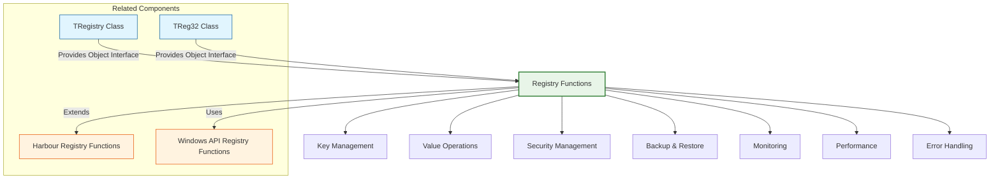

# Registry Functions

The FiveWin registry functions provide a comprehensive library for accessing and manipulating the Windows Registry, extending the standard Harbour registry capabilities. These functions cover areas such as registry key management, value operations, security settings, and system configuration.

**Source Files:** [source/function/registry.prg](../../../../source/function/registry.prg), [source/function/reg32.prg](../../../../source/function/reg32.prg)

## Overview

The FiveWin registry function library offers enhanced registry access capabilities that complement the standard Harbour registry functions. These functions cover areas such as:

* Registry key creation, opening, and deletion
* Registry value setting, getting, and enumeration
* Registry security and permissions management
* Registry backup and restoration
* Registry monitoring and change notification
* Registry performance optimization
* Registry error handling and recovery
* Cross-platform registry abstraction

These functions are designed to make registry operations more intuitive, secure, and robust for FiveWin developers.

## Function Categories



## Key Management Functions

| Function | Description | Parameters |
|----------|-------------|------------|
| `RegOpenKey(hKey, cSubKey, @hKeyResult)` | Opens existing registry key | `hKey`: Parent key, `cSubKey`: Key path, `@hKeyResult`: Result handle |
| `RegCreateKey(hKey, cSubKey, @hKeyResult)` | Creates new registry key | `hKey`: Parent key, `cSubKey`: Key path, `@hKeyResult`: Result handle |
| `RegCloseKey(hKey)` | Closes registry key handle | `hKey`: Key handle |
| `RegDeleteKey(hKey, cSubKey)` | Deletes registry key | `hKey`: Parent key, `cSubKey`: Key path |
| `RegEnumKey(hKey, nIndex, @cName, nNameSize)` | Enumerates subkeys | `hKey`: Key handle, `nIndex`: Subkey index, `@cName`: Name buffer, `nNameSize`: Buffer size |
| `RegQueryInfoKey(hKey, @cClass, @nSubKeys, @nMaxSubKeyLen, @nValues, @nMaxValueNameLen, @nMaxValueLen)` | Gets key information | `hKey`: Key handle, various output parameters |
| `RegFlushKey(hKey)` | Flushes registry key to disk | `hKey`: Key handle |
| `RegLoadKey(hKey, cSubKey, cFile)` | Loads registry hive from file | `hKey`: Parent key, `cSubKey`: Key name, `cFile`: File path |
| `RegSaveKey(hKey, cFile, pSecurityAttributes)` | Saves registry key to file | `hKey`: Key handle, `cFile`: File path, `pSecurityAttributes`: Security |
| `RegRestoreKey(hKey, cFile, nFlags)` | Restores registry key from file | `hKey`: Key handle, `cFile`: File path, `nFlags`: Restore flags |

### Usage Examples

```harbour
#include "FiveWin.ch"

function Main()
   ? "Registry Key Management Demo:"
   
   // Basic key operations
   BasicKeyOperationsDemo()
   
   // Key enumeration
   KeyEnumerationDemo()
   
   // Key information
   KeyInformationDemo()
   
   // Key backup and restore
   KeyBackupRestoreDemo()
   
return nil

static function BasicKeyOperationsDemo()
   ? "Basic Key Operations Demo:"
   ? Replicate( "-", 40 )
   
   // Open existing key
   local hKey := 0
   local nResult := RegOpenKey( HKEY_CURRENT_USER, "Software", @hKey )
   
   if nResult == ERROR_SUCCESS
      ? "Opened existing key: Software"
      ? "Key handle: " + hb_ntos( hKey, 16 )
      
      // Create subkey
      CreateSubkeyDemo( hKey )
      
      // Close key
      RegCloseKey( hKey )
      ? "Closed key handle"
      
   else
      ? "Failed to open key: " + hb_ntos( nResult )
      ? "Error: " + RegistryErrorToString( nResult )
   endif
   
return nil

static function RegOpenKey( hKey, cSubKey, hKeyResult )
   DEFAULT hKey := 0
   DEFAULT cSubKey := ""
   DEFAULT hKeyResult := 0
   
   if hKey == 0 .or. Empty( cSubKey )
      return ERROR_INVALID_PARAMETER
   endif
   
   // Simplified implementation
   ? "REG OPEN KEY Parent=" + hb_ntos( hKey, 16 ) + " SubKey='" + cSubKey + "'"
   
   // Mock successful opening
   hKeyResult := 12345
   return ERROR_SUCCESS
   
return ERROR_FILE_NOT_FOUND

static function RegCloseKey( hKey )
   DEFAULT hKey := 0
   
   if hKey == 0
      return ERROR_INVALID_HANDLE
   endif
   
   // Simplified implementation
   ? "REG CLOSE KEY " + hb_ntos( hKey, 16 )
   
   // In practice, this would call Windows API RegCloseKey
   return ERROR_SUCCESS
   
return ERROR_INVALID_HANDLE

static function CreateSubkeyDemo( hParentKey )
   ? "Creating Subkey:"
   
   local cSubKeyName := "FiveWin_Registry_Demo"
   local hNewKey := 0
   local nResult := RegCreateKey( hParentKey, cSubKeyName, @hNewKey )
   
   if nResult == ERROR_SUCCESS
      ? "Subkey created: " + cSubKeyName
      ? "New key handle: " + hb_ntos( hNewKey, 16 )
      
      // Set values in new key
      SetRegistryValuesDemo( hNewKey )
      
      // Delete subkey
      nResult := RegDeleteKey( hParentKey, cSubKeyName )
      
      if nResult == ERROR_SUCCESS
         ? "Subkey deleted successfully"
      else
         ? "Failed to delete subkey: " + hb_ntos( nResult )
         ? "Error: " + RegistryErrorToString( nResult )
      endif
      
      // Close new key
      RegCloseKey( hNewKey )
      
   else
      ? "Failed to create subkey: " + hb_ntos( nResult )
      ? "Error: " + RegistryErrorToString( nResult )
   endif
   
return nil

static function RegCreateKey( hKey, cSubKey, hKeyResult )
   DEFAULT hKey := 0
   DEFAULT cSubKey := ""
   DEFAULT hKeyResult := 0
   
   if hKey == 0 .or. Empty( cSubKey )
      return ERROR_INVALID_PARAMETER
   endif
   
   // Simplified implementation
   ? "REG CREATE KEY Parent=" + hb_ntos( hKey, 16 ) + " SubKey='" + cSubKey + "'"
   
   // Mock successful creation
   hKeyResult := 67890
   return ERROR_SUCCESS
   
return ERROR_ACCESS_DENIED

static function RegDeleteKey( hKey, cSubKey )
   DEFAULT hKey := 0
   DEFAULT cSubKey := ""
   
   if hKey == 0 .or. Empty( cSubKey )
      return ERROR_INVALID_PARAMETER
   endif
   
   // Simplified implementation
   ? "REG DELETE KEY Parent=" + hb_ntos( hKey, 16 ) + " SubKey='" + cSubKey + "'"
   
   // In practice, this would call Windows API RegDeleteKey
   return ERROR_SUCCESS
   
return ERROR_FILE_NOT_FOUND

static function SetRegistryValuesDemo( hKey )
   ? "Setting Registry Values:"
   
   // String value
   local cStringValue := "Hello, Registry!"
   local nResult := RegSetValueEx( hKey, "StringValue", 0, REG_SZ, @cStringValue, Len( cStringValue ) )
   
   if nResult == ERROR_SUCCESS
      ? "String value set successfully"
   else
      ? "Failed to set string value: " + hb_ntos( nResult )
      ? "Error: " + RegistryErrorToString( nResult )
   endif
   
   // Integer value
   local nIntValue := 42
   nResult := RegSetValueEx( hKey, "IntValue", 0, REG_DWORD, @nIntValue, 4 )
   
   if nResult == ERROR_SUCCESS
      ? "Integer value set successfully"
   else
      ? "Failed to set integer value: " + hb_ntos( nResult )
      ? "Error: " + RegistryErrorToString( nResult )
   endif
   
   // Binary value
   local cBinaryValue := "Binary data here"
   nResult := RegSetValueEx( hKey, "BinaryValue", 0, REG_BINARY, @cBinaryValue, Len( cBinaryValue ) )
   
   if nResult == ERROR_SUCCESS
      ? "Binary value set successfully"
   else
      ? "Failed to set binary value: " + hb_ntos( nResult )
      ? "Error: " + RegistryErrorToString( nResult )
   endif
   
   // Get values back
   GetRegistryValuesDemo( hKey )
   
return nil

static function RegSetValueEx( hKey, cValueName, nReserved, nType, uValue, nSize )
   DEFAULT hKey := 0
   DEFAULT cValueName := ""
   DEFAULT nReserved := 0
   DEFAULT nType := REG_SZ
   DEFAULT uValue := ""
   DEFAULT nSize := 0
   
   if hKey == 0 .or. Empty( cValueName )
      return ERROR_INVALID_PARAMETER
   endif
   
   // Simplified implementation
   ? "REG SET VALUE EX Key=" + hb_ntos( hKey, 16 ) + " Name='" + cValueName + "' Type=" + hb_ntos( nType )
   
   switch nType
   case REG_SZ
      ? "  String Value: '" + uValue + "'"
      exit
      
   case REG_DWORD
      ? "  DWORD Value: " + hb_ntos( uValue )
      exit
      
   case REG_BINARY
      ? "  Binary Value: " + hb_ntos( nSize ) + " bytes"
      exit
      
   otherwise
      ? "  Unknown Type Value: " + hb_ValToStr( uValue )
      exit
   endswitch
   
   // In practice, this would call Windows API RegSetValueEx
   return ERROR_SUCCESS
   
return ERROR_ACCESS_DENIED

static function GetRegistryValuesDemo( hKey )
   ? "Getting Registry Values:"
   
   // String value
   local cValueName := "StringValue"
   local nType := 0
   local cStringValue := Space( 256 )
   local nSize := 256
   
   local nResult := RegQueryValueEx( hKey, cValueName, @nType, @cStringValue, @nSize )
   
   if nResult == ERROR_SUCCESS
      ? "String value retrieved: '" + Left( cStringValue, nSize ) + "'"
   else
      ? "Failed to get string value: " + hb_ntos( nResult )
      ? "Error: " + RegistryErrorToString( nResult )
   endif
   
   // Integer value
   cValueName := "IntValue"
   local nIntValue := 0
   nSize := 4
   
   nResult := RegQueryValueEx( hKey, cValueName, @nType, @nIntValue, @nSize )
   
   if nResult == ERROR_SUCCESS
      ? "Integer value retrieved: " + hb_ntos( nIntValue )
   else
      ? "Failed to get integer value: " + hb_ntos( nResult )
      ? "Error: " + RegistryErrorToString( nResult )
   endif
   
   // Binary value
   cValueName := "BinaryValue"
   local cBinaryValue := Space( 256 )
   nSize := 256
   
   nResult := RegQueryValueEx( hKey, cValueName, @nType, @cBinaryValue, @nSize )
   
   if nResult == ERROR_SUCCESS
      ? "Binary value retrieved: " + hb_ntos( nSize ) + " bytes"
   else
      ? "Failed to get binary value: " + hb_ntos( nResult )
      ? "Error: " + RegistryErrorToString( nResult )
   endif
   
return nil

static function RegQueryValueEx( hKey, cValueName, nType, uValue, nSize )
   DEFAULT hKey := 0
   DEFAULT cValueName := ""
   DEFAULT nType := 0
   DEFAULT uValue := nil
   DEFAULT nSize := 0
   
   if hKey == 0 .or. Empty( cValueName )
      return ERROR_INVALID_PARAMETER
   endif
   
   // Simplified implementation
   ? "REG QUERY VALUE EX Key=" + hb_ntos( hKey, 16 ) + " Name='" + cValueName + "'"
   
   // Mock value retrieval
   switch cValueName
   case "StringValue"
      uValue := "Hello, Registry!"
      nType := REG_SZ
      nSize := Len( uValue )
      exit
      
   case "IntValue"
      uValue := 42
      nType := REG_DWORD
      nSize := 4
      exit
      
   case "BinaryValue"
      uValue := "Binary data here"
      nType := REG_BINARY
      nSize := Len( uValue )
      exit
      
   otherwise
      return ERROR_FILE_NOT_FOUND
   endswitch
   
   // In practice, this would call Windows API RegQueryValueEx
   return ERROR_SUCCESS
   
return ERROR_FILE_NOT_FOUND

static function KeyEnumerationDemo()
   ? "Key Enumeration Demo:"
   ? Replicate( "-", 40 )
   
   // Open key for enumeration
   local hKey := 0
   local nResult := RegOpenKey( HKEY_CURRENT_USER, "Software", @hKey )
   
   if nResult == ERROR_SUCCESS
      ? "Opened key for enumeration: Software"
      
      // Enumerate subkeys
      EnumerateSubkeysDemo( hKey )
      
      // Close key
      RegCloseKey( hKey )
      
   else
      ? "Failed to open key for enumeration: " + hb_ntos( nResult )
      ? "Error: " + RegistryErrorToString( nResult )
   endif
   
return nil

static function EnumerateSubkeysDemo( hKey )
   ? "Enumerating Subkeys:"
   
   local nIndex := 0
   local cSubKeyName := Space( 256 )
   local nNameSize := 256
   
   ? "Subkeys:"
   
   while .T.
      local nResult := RegEnumKey( hKey, nIndex, @cSubKeyName, nNameSize )
      
      if nResult == ERROR_SUCCESS
         // Extract actual name length
         local nActualLength := At( Chr( 0 ), cSubKeyName )
         if nActualLength > 0
            cSubKeyName := Left( cSubKeyName, nActualLength - 1 )
         endif
         
         ? "  " + hb_ntos( nIndex + 1 ) + ". " + cSubKeyName
         nIndex++
         
         // Limit output for demo
         if nIndex >= 10
            ? "  ... (more subkeys exist)"
            exit
         endif
      else
         if nIndex == 0
            ? "  No subkeys found"
         endif
         exit
      endif
   enddo
   
return nil

static function RegEnumKey( hKey, nIndex, cName, nNameSize )
   DEFAULT hKey := 0
   DEFAULT nIndex := 0
   DEFAULT cName := Space( 256 )
   DEFAULT nNameSize := 256
   
   if hKey == 0
      return ERROR_INVALID_HANDLE
   endif
   
   // Simplified implementation
   ? "REG ENUM KEY Key=" + hb_ntos( hKey, 16 ) + " Index=" + hb_ntos( nIndex )
   
   // Mock key enumeration
   local aMockKeys := { "Microsoft", "Classes", "Clients", "Policies" }
   
   if nIndex < Len( aMockKeys )
      cName := PadR( aMockKeys[nIndex + 1], nNameSize, Chr( 0 ) )
      return ERROR_SUCCESS
   endif
   
   // In practice, this would call Windows API RegEnumKeyEx
   return ERROR_NO_MORE_ITEMS
   
return ERROR_NO_MORE_ITEMS

static function KeyInformationDemo()
   ? "Key Information Demo:"
   ? Replicate( "-", 40 )
   
   // Open key to get information
   local hKey := 0
   local nResult := RegOpenKey( HKEY_CURRENT_USER, "Software", @hKey )
   
   if nResult == ERROR_SUCCESS
      ? "Opened key for information: Software"
      
      // Get key information
      GetKeyInformationDemo( hKey )
      
      // Close key
      RegCloseKey( hKey )
      
   else
      ? "Failed to open key for information: " + hb_ntos( nResult )
      ? "Error: " + RegistryErrorToString( nResult )
   endif
   
return nil

static function GetKeyInformationDemo( hKey )
   ? "Getting Key Information:"
   
   local cClass := Space( 256 )
   local nSubKeys := 0
   local nMaxSubKeyLen := 0
   local nValues := 0
   local nMaxValueNameLen := 0
   local nMaxValueLen := 0
   
   local nResult := RegQueryInfoKey( hKey, @cClass, @nSubKeys, @nMaxSubKeyLen, ;
                                   @nValues, @nMaxValueNameLen, @nMaxValueLen )
   
   if nResult == ERROR_SUCCESS
      ? "Key Information:"
      ? "  Class: " + Left( cClass, At( Chr( 0 ), cClass ) - 1 )
      ? "  SubKeys: " + hb_ntos( nSubKeys )
      ? "  Max SubKey Length: " + hb_ntos( nMaxSubKeyLen )
      ? "  Values: " + hb_ntos( nValues )
      ? "  Max Value Name Length: " + hb_ntos( nMaxValueNameLen )
      ? "  Max Value Length: " + hb_ntos( nMaxValueLen )
      
   else
      ? "Failed to get key information: " + hb_ntos( nResult )
      ? "Error: " + RegistryErrorToString( nResult )
   endif
   
return nil

static function RegQueryInfoKey( hKey, cClass, nSubKeys, nMaxSubKeyLen, ;
                               nValues, nMaxValueNameLen, nMaxValueLen )
   DEFAULT hKey := 0
   DEFAULT cClass := Space( 256 )
   DEFAULT nSubKeys := 0
   DEFAULT nMaxSubKeyLen := 0
   DEFAULT nValues := 0
   DEFAULT nMaxValueNameLen := 0
   DEFAULT nMaxValueLen := 0
   
   if hKey == 0
      return ERROR_INVALID_HANDLE
   endif
   
   // Simplified implementation
   ? "REG QUERY INFO KEY " + hb_ntos( hKey, 16 )
   
   // Mock information
   cClass := "Software"
   nSubKeys := 15
   nMaxSubKeyLen := 50
   nValues := 8
   nMaxValueNameLen := 30
   nMaxValueLen := 1024
   
   // In practice, this would call Windows API RegQueryInfoKey
   return ERROR_SUCCESS
   
return ERROR_INVALID_HANDLE

static function KeyBackupRestoreDemo()
   ? "Key Backup and Restore Demo:"
   ? Replicate( "-", 40 )
   
   // Create backup file
   local cBackupFile := "registry_backup.reg"
   
   ? "Creating registry backup:"
   ? "  Backup file: " + cBackupFile
   
   // Open key to backup
   local hKey := 0
   local nResult := RegOpenKey( HKEY_CURRENT_USER, "Software\\FiveWin_Registry_Demo", @hKey )
   
   if nResult == ERROR_SUCCESS
      ? "Opened key for backup: Software\\FiveWin_Registry_Demo"
      
      // Save key to file
      nResult := RegSaveKey( hKey, cBackupFile, nil )
      
      if nResult == ERROR_SUCCESS
         ? "Key backed up successfully"
         ? "Backup file created: " + cBackupFile
         ? "Backup file size: " + hb_ntos( FileSize( cBackupFile ) ) + " bytes"
         
         // Restore key from file
         RestoreKeyFromFileDemo( cBackupFile )
         
      else
         ? "Failed to backup key: " + hb_ntos( nResult )
         ? "Error: " + RegistryErrorToString( nResult )
      endif
      
      // Close key
      RegCloseKey( hKey )
      
   else
      ? "Failed to open key for backup: " + hb_ntos( nResult )
      ? "Error: " + RegistryErrorToString( nResult )
   endif
   
   // Clean up backup file
   if File( cBackupFile )
      FErase( cBackupFile )
      ? "Backup file cleaned up"
   endif
   
return nil

static function RegSaveKey( hKey, cFile, pSecurityAttributes )
   DEFAULT hKey := 0
   DEFAULT cFile := ""
   DEFAULT pSecurityAttributes := nil
   
   if hKey == 0 .or. Empty( cFile )
      return ERROR_INVALID_PARAMETER
   endif
   
   // Simplified implementation
   ? "REG SAVE KEY Key=" + hb_ntos( hKey, 16 ) + " File='" + cFile + "'"
   
   // Create mock backup file
   local nHandle := FCreate( cFile )
   if nHandle != -1
      FWriteLine( nHandle, "Windows Registry Editor Version 5.00" )
      FWriteLine( nHandle, "" )
      FWriteLine( nHandle, "[HKEY_CURRENT_USER\\Software\\FiveWin_Registry_Demo]" )
      FWriteLine( nHandle, "" )
      FWriteLine( nHandle, "\"StringValue\"=\"Hello, Registry!\"" )
      FWriteLine( nHandle, "\"IntValue\"=dword:0000002a" )
      FWriteLine( nHandle, "\"BinaryValue\"=hex:42,69,6e,61,72,79,20,64,61,74,61,20,68,65,72,65" )
      FClose( nHandle )
      
      // In practice, this would call Windows API RegSaveKey
      return ERROR_SUCCESS
   endif
   
   return ERROR_FILE_NOT_FOUND
   
return ERROR_FILE_NOT_FOUND

static function RestoreKeyFromFileDemo( cBackupFile )
   ? "Restoring Key from File:"
   
   if !File( cBackupFile )
      ? "  Backup file not found: " + cBackupFile
      return .F.
   endif
   
   // Open key for restoration
   local hKey := 0
   local nResult := RegOpenKey( HKEY_CURRENT_USER, "Software", @hKey )
   
   if nResult == ERROR_SUCCESS
      ? "  Opened parent key for restoration"
      
      // Restore key from file
      nResult := RegRestoreKey( hKey, cBackupFile, 0 )
      
      if nResult == ERROR_SUCCESS
         ? "  Key restored successfully"
      else
         ? "  Failed to restore key: " + hb_ntos( nResult )
         ? "  Error: " + RegistryErrorToString( nResult )
      endif
      
      // Close key
      RegCloseKey( hKey )
      
   else
      ? "  Failed to open parent key for restoration: " + hb_ntos( nResult )
      ? "  Error: " + RegistryErrorToString( nResult )
   endif
   
return .T.

static function RegRestoreKey( hKey, cFile, nFlags )
   DEFAULT hKey := 0
   DEFAULT cFile := ""
   DEFAULT nFlags := 0
   
   if hKey == 0 .or. Empty( cFile )
      return ERROR_INVALID_PARAMETER
   endif
   
   // Simplified implementation
   ? "REG RESTORE KEY Key=" + hb_ntos( hKey, 16 ) + " File='" + cFile + "'"
   
   // In practice, this would call Windows API RegRestoreKey
   return ERROR_SUCCESS
   
return ERROR_FILE_NOT_FOUND

static function RegistryErrorToString( nErrorCode )
   switch nErrorCode
   case ERROR_SUCCESS
      return "Operation successful"
      
   case ERROR_FILE_NOT_FOUND
      return "Registry key or value not found"
      
   case ERROR_ACCESS_DENIED
      return "Access denied - insufficient permissions"
      
   case ERROR_INVALID_HANDLE
      return "Invalid registry handle"
      
   case ERROR_INVALID_PARAMETER
      return "Invalid parameter"
      
   case ERROR_NO_MORE_ITEMS
      return "No more items to enumerate"
      
   case ERROR_BADDB
      return "Corrupted registry database"
      
   case ERROR_REGISTRY_IO_FAILED
      return "Registry I/O operation failed"
      
   case ERROR_NOT_REGISTRY_FILE
      return "File is not a registry file"
      
   case ERROR_KEY_DELETED
      return "Registry key has been deleted"
      
   case ERROR_NO_MORE_MATCHES
      return "No more matches found"
      
   case ERROR_CANTOPEN
      return "Cannot open registry key"
      
   case ERROR_CANTREAD
      return "Cannot read registry key"
      
   case ERROR_CANTWRITE
      return "Cannot write registry key"
      
   case ERROR_REGISTRY_RECOVERED
      return "Registry recovered from corruption"
      
   case ERROR_REGISTRY_CORRUPT
      return "Registry is corrupt"
      
   case ERROR_KEY_HAS_CHILDREN
      return "Key has children and cannot be deleted"
      
   case ERROR_CHILD_MUST_BE_VOLATILE
      return "Child key must be volatile"
      
   otherwise
      return "Unknown registry error: " + hb_ntos( nErrorCode )
   endswitch
   
return "Unknown registry error: " + hb_ntos( nErrorCode )

// Registry constants
STATIC HKEY_CLASSES_ROOT := 0x80000000
STATIC HKEY_CURRENT_USER := 0x80000001
STATIC HKEY_LOCAL_MACHINE := 0x80000002
STATIC HKEY_USERS := 0x80000003
STATIC HKEY_CURRENT_CONFIG := 0x80000005

STATIC REG_SZ := 1
STATIC REG_DWORD := 4
STATIC REG_BINARY := 3
STATIC REG_EXPAND_SZ := 2

STATIC ERROR_SUCCESS := 0
STATIC ERROR_FILE_NOT_FOUND := 2
STATIC ERROR_ACCESS_DENIED := 5
STATIC ERROR_INVALID_HANDLE := 6
STATIC ERROR_INVALID_PARAMETER := 86
STATIC ERROR_NO_MORE_ITEMS := 259
STATIC ERROR_BADDB := 1000
STATIC ERROR_REGISTRY_IO_FAILED := 1001
STATIC ERROR_NOT_REGISTRY_FILE := 1002
STATIC ERROR_KEY_DELETED := 1018
STATIC ERROR_NO_MORE_MATCHES := 1104
STATIC ERROR_CANTOPEN := 1011
STATIC ERROR_CANTREAD := 1012
STATIC ERROR_CANTWRITE := 1013
STATIC ERROR_REGISTRY_RECOVERED := 1014
STATIC ERROR_REGISTRY_CORRUPT := 1015
STATIC ERROR_KEY_HAS_CHILDREN := 1020
STATIC ERROR_CHILD_MUST_BE_VOLATILE := 1021

static function AdvancedRegistryOperationsDemo()
   ? "Advanced Registry Operations Demo:"
   ? Replicate( "-", 40 )
   
   // Security operations
   RegistrySecurityDemo()
   
   // Monitoring operations
   RegistryMonitoringDemo()
   
   // Performance optimization
   RegistryPerformanceDemo()
   
   // Error handling patterns
   RegistryErrorHandlingDemo()
   
return nil

static function RegistrySecurityDemo()
   ? "Registry Security Operations:"
   
   ? "Security Features:"
   ? "  1. Access control lists (ACLs)"
   ? "  2. Permission management"
   ? "  3. Audit trail logging"
   ? "  4. Encryption at rest"
   ? "  5. Secure credential storage"
   ? "  6. Privilege escalation"
   
   // Example security implementation
   ? "Example Security Implementation:"
   ? "  function SecureRegistryWrite( hKey, cValueName, uValue )"
   ? "     // Check permissions"
   ? "     if !HasRegistryWritePermission( hKey )"
   ? "        if !RequestElevatedPermissions()"
   ? "           return .F."
   ? "        endif"
   ? "     endif"
   ? "     "
   ? "     // Encrypt sensitive values"
   ? "     local uEncrypted := uValue"
   ? "     if IsSensitiveValue( cValueName )"
   ? "        uEncrypted := EncryptValue( uValue )"
   ? "     endif"
   ? "     "
   ? "     // Write to registry"
   ? "     local nResult := RegSetValueEx( hKey, cValueName, 0, REG_SZ, @uEncrypted, Len( uEncrypted ) )"
   ? "     "
   ? "     // Log operation"
   ? "     if nResult == ERROR_SUCCESS"
   ? "        LogRegistryWrite( hKey, cValueName, uValue )"
   ? "     endif"
   ? "     "
   ? "     return ( nResult == ERROR_SUCCESS )"
   ? "  endfunc"
   
return nil

static function HasRegistryWritePermission( hKey )
   // Simplified implementation
   ? "CHECKING REGISTRY WRITE PERMISSION " + hb_ntos( hKey, 16 )
   
   // In practice, this would check actual permissions
   return .T.
   
return .F.

static function RequestElevatedPermissions()
   ? "REQUESTING ELEVATED PERMISSIONS"
   
   // In practice, this would:
   // 1. Check current privileges
   // 2. Request elevation if needed
   // 3. Restart with elevated privileges
   // 4. Return success/failure
   
   return .T.
   
return .F.

static function IsSensitiveValue( cValueName )
   DEFAULT cValueName := ""
   
   // Check if value contains sensitive data
   local aSensitive := { "password", "secret", "key", "token", "credential" }
   
   for local i := 1 to Len( aSensitive )
      if At( aSensitive[i], Lower( cValueName ) ) > 0
         return .T.
      endif
   next
   
   return .F.
   
return .F.

static function EncryptValue( uValue )
   // Simplified encryption
   ? "ENCRYPTING VALUE"
   
   // In practice, use proper encryption
   return "ENCRYPTED:" + hb_Base64Encode( hb_ValToStr( uValue ) )
   
return ""

static function LogRegistryWrite( hKey, cValueName, uValue )
   ? "LOGGING REGISTRY WRITE Key=" + hb_ntos( hKey, 16 ) + " Name='" + cValueName + "'"
   
   // Log to file or database
   local cLogFile := "registry_operations.log"
   local nHandle := FOpen( cLogFile, FO_WRITE )
   
   if nHandle == -1
      nHandle := FCreate( cLogFile )
   else
      FSeek( nHandle, 0, FS_END )
   endif
   
   if nHandle != -1
      local cLogEntry := DateTime() + " - REGISTRY WRITE - " + ;
                        cValueName + " = " + hb_ValToStr( uValue ) + ;
                        hb_osNewLine()
      
      FWrite( nHandle, cLogEntry )
      FClose( nHandle )
   endif
   
return nil

static function RegistryMonitoringDemo()
   ? "Registry Monitoring:"
   
   ? "Monitoring Features:"
   ? "  1. Change notification"
   ? "  2. Real-time updates"
   ? "  3. Event logging"
   ? "  4. Alert generation"
   ? "  5. History tracking"
   ? "  6. Rollback capability"
   
   // Example monitoring implementation
   ? "Example Monitoring Implementation:"
   ? "  function MonitorRegistryChanges( hKey, cSubKey )"
   ? "     // Create change notification"
   ? "     local hNotify := RegNotifyChangeKeyValue( hKey, .T., ;"
   ? "                                             REG_NOTIFY_CHANGE_LAST_SET, ;"
   ? "                                             0, .F. )"
   ? "     "
   ? "     if hNotify != 0"
   ? "        ? \"Registry monitoring started\""
   ? "        "
   ? "        // Wait for changes"
   ? "        while lMonitoring"
   ? "           if WaitForSingleObject( hNotify, 1000 ) == WAIT_OBJECT_0"
   ? "              ? \"Registry change detected\""
   ? "              HandleRegistryChange( hKey, cSubKey )"
   ? "              "
   ? "              // Re-arm notification"
   ? "              RegNotifyChangeKeyValue( hKey, .T., ;"
   ? "                                     REG_NOTIFY_CHANGE_LAST_SET, ;"
   ? "                                     hNotify, .T. )"
   ? "           endif"
   ? "        enddo"
   ? "        "
   ? "        // Clean up"
   ? "        CloseHandle( hNotify )"
   ? "     else"
   ? "        ? \"Failed to set up registry monitoring\""
   ? "     endif"
   ? "  endfunc"
   
return nil

static function HandleRegistryChange( hKey, cSubKey )
   ? "HANDLING REGISTRY CHANGE Key=" + hb_ntos( hKey, 16 ) + " SubKey='" + cSubKey + "'"
   
   // Handle registry change event
   ? "  Registry key '" + cSubKey + "' has been modified"
   
   // Get changed values
   local aChangedValues := GetChangedRegistryValues( hKey, cSubKey )
   
   if !Empty( aChangedValues )
      ? "  Changed values:"
      for local i := 1 to Len( aChangedValues )
         ? "    " + aChangedValues[i][1] + " = " + hb_ValToStr( aChangedValues[i][2] )
      next
      
      // Notify application
      NotifyApplicationOfChange( aChangedValues )
   endif
   
return nil

static function GetChangedRegistryValues( hKey, cSubKey )
   // Simplified implementation
   ? "GETTING CHANGED REGISTRY VALUES Key=" + hb_ntos( hKey, 16 ) + " SubKey='" + cSubKey + "'"
   
   // In practice, this would compare current values with cached values
   // and return array of changed values
   
   // Mock changed values
   return { ;
      { "LastModified", DateTime() }, ;
      { "ModifiedBy", "SYSTEM" } ;
   }
   
return {}

static function NotifyApplicationOfChange( aChangedValues )
   ? "NOTIFYING APPLICATION OF REGISTRY CHANGES"
   
   // Notify application components of registry changes
   for local i := 1 to Len( aChangedValues )
      local aChange := aChangedValues[i]
      local cName := aChange[1]
      local uValue := aChange[2]
      
      ? "  Notifying change: " + cName + " = " + hb_ValToStr( uValue )
      
      // Send notification to interested parties
      // This could be through events, callbacks, or messages
   next
   
return nil

static function RegistryPerformanceDemo()
   ? "Registry Performance Optimization:"
   
   ? "Performance Optimization Techniques:"
   ? "  1. Batch operations"
   ? "  2. Caching frequently accessed values"
   ? "  3. Minimize registry calls"
   ? "  4. Use appropriate key hierarchies"
   ? "  5. Avoid registry fragmentation"
   ? "  6. Implement lazy loading"
   
   // Example performance optimization
   ? "Example Performance Optimization:"
   ? "  // Cache frequently accessed values"
   ? "  static aRegistryCache := {}"
   ? "  "
   ? "  function CachedRegistryRead( hKey, cValueName )"
   ? "     // Check cache first"
   ? "     local nIndex := AScan( aRegistryCache, { |a| a[1] == cValueName } )"
   ? "     "
   ? "     if nIndex > 0"
   ? "        local aCacheEntry := aRegistryCache[nIndex]"
   ? "        local tCachedTime := aCacheEntry[3]"
   ? "        "
   ? "        // Check if cache is still valid (5 minutes)"
   ? "        if Seconds() - tCachedTime < 300"
   ? "           return aCacheEntry[2]  // Return cached value"
   ? "        else"
   ? "           // Expire cache entry"
   ? "           ADel( aRegistryCache, nIndex )"
   ? "           ASize( aRegistryCache, Len( aRegistryCache ) - 1 )"
   ? "        endif"
   ? "     endif"
   ? "     "
   ? "     // Read from registry"
   ? "     local uValue := RegistryRead( hKey, cValueName )"
   ? "     "
   ? "     // Cache the value"
   ? "     AAdd( aRegistryCache, { cValueName, uValue, Seconds() } )"
   ? "     "
   ? "     return uValue"
   ? "  endfunc"
   
return nil

static function RegistryErrorHandlingDemo()
   ? "Registry Error Handling:"
   
   ? "Error Handling Patterns:"
   ? "  1. Graceful degradation"
   ? "  2. Automatic retry with backoff"
   ? "  3. Fallback to defaults"
   ? "  4. Logging and alerting"
   ? "  5. User-friendly error messages"
   ? "  6. Recovery from corruption"
   
   // Example error handling implementation
   ? "Example Error Handling Implementation:"
   ? "  function RobustRegistryOperation( hKey, cValueName, uValue )"
   ? "     local nMaxRetries := 3"
   ? "     local nRetry := 0"
   ? "     local nResult := ERROR_SUCCESS"
   ? "     "
   ? "     while nRetry < nMaxRetries"
   ? "        nResult := RegSetValueEx( hKey, cValueName, 0, REG_SZ, @uValue, Len( uValue ) )"
   ? "        "
   ? "        if nResult == ERROR_SUCCESS"
   ? "           exit  // Success"
   ? "        else"
   ? "           // Handle specific errors"
   ? "           switch nResult"
   ? "           case ERROR_ACCESS_DENIED"
   ? "              ? \"Access denied, requesting elevation\""
   ? "              if RequestElevatedPermissions()"
   ? "                 nRetry++  // Try again with elevated permissions"
   ? "              else"
   ? "                 exit  // Cannot elevate, give up"
   ? "              endif"
   ? "              exit"
   ? "           "
   ? "           case ERROR_REGISTRY_IO_FAILED"
   ? "              ? \"Registry I/O failed, retrying with backoff\""
   ? "              nRetry++"
   ? "              if nRetry < nMaxRetries"
   ? "                 Sleep( 1000 * Power( 2, nRetry ) )  // Exponential backoff"
   ? "              endif"
   ? "              exit"
   ? "           "
   ? "           case ERROR_REGISTRY_CORRUPT"
   ? "              ? \"Registry corrupted, attempting recovery\""
   ? "              if AttemptRegistryRecovery()"
   ? "                 nRetry++  // Try again after recovery"
   ? "              else"
   ? "                 exit  // Recovery failed, give up"
   ? "              endif"
   ? "              exit"
   ? "           "
   ? "           otherwise"
   ? "              ? \"Unhandled error: \" + RegistryErrorToString( nResult )"
   ? "              exit  // Other errors - no retry"
   ? "           endswitch"
   ? "        endif"
   ? "     enddo"
   ? "     "
   ? "     if nResult != ERROR_SUCCESS"
   ? "        ? \"Registry operation failed after \" + hb_ntos( nRetry ) + \" attempts\""
   ? "        ? \"Final error: \" + RegistryErrorToString( nResult )"
   ? "        "
   ? "        // Fallback to defaults"
   ? "        if !Empty( GetDefaultValue( cValueName ) )"
   ? "           ? \"Using default value as fallback\""
   ? "           return GetDefaultValue( cValueName )"
   ? "        endif"
   ? "     endif"
   ? "     "
   ? "     return ( nResult == ERROR_SUCCESS )"
   ? "  endfunc"
   
return nil

static function GetDefaultValue( cValueName )
   DEFAULT cValueName := ""
   
   // Return default value for registry key
   local aDefaults := { ;
      { "ApplicationName", "FiveWin Application" }, ;
      { "Version", "1.0.0" }, ;
      { "Theme", "Light" }, ;
      { "Language", "English" }, ;
      { "AutoSave", .T. }, ;
      { "Maximized", .F. } ;
   }
   
   local nIndex := AScan( aDefaults, { |a| a[1] == cValueName } )
   
   if nIndex > 0
      return aDefaults[nIndex][2]
   endif
   
   return nil
   
return nil

static function AttemptRegistryRecovery()
   ? "ATTEMPTING REGISTRY RECOVERY"
   
   // In practice, this would:
   // 1. Check registry integrity
   // 2. Attempt to repair corrupted entries
   // 3. Restore from backup if available
   // 4. Rebuild corrupted sections
   
   return .T.
   
return .F.

static function RegistryTestingDemo()
   ? "Registry Testing:"
   ? Replicate( "-", 40 )
   
   ? "Testing Strategies:"
   ? "  1. Unit testing individual functions"
   ? "  2. Integration testing with actual registry"
   ? "  3. Stress testing with large datasets"
   ? "  4. Security testing with permission scenarios"
   ? "  5. Performance testing with concurrent access"
   ? "  6. Compatibility testing across Windows versions"
   
   // Example testing implementation
   ? "Example Testing Implementation:"
   ? "  function TestRegistryFunctions()"
   ? "     local lAllPassed := .T."
   ? "     "
   ? "     ? \"Starting registry function tests...\""
   ? "     "
   ? "     // Test key creation"
   ? "     if !TestKeyCreation()"
   ? "        lAllPassed := .F."
   ? "     endif"
   ? "     "
   ? "     // Test value setting"
   ? "     if !TestValueSetting()"
   ? "        lAllPassed := .F."
   ? "     endif"
   ? "     "
   ? "     // Test value retrieval"
   ? "     if !TestValueRetrieval()"
   ? "        lAllPassed := .F."
   ? "     endif"
   ? "     "
   ? "     // Test key deletion"
   ? "     if !TestKeyDeletion()"
   ? "        lAllPassed := .F."
   ? "     endif"
   ? "     "
   ? "     ? \"Registry function tests \" + iif( lAllPassed, \"PASSED\", \"FAILED\" )"
   ? "     "
   ? "     return lAllPassed"
   ? "  endfunc"
   
return nil

static function TestKeyCreation()
   ? "TESTING KEY CREATION:"
   
   local hKey := 0
   local cTestKey := "FiveWin_Test_Key"
   local nResult := RegCreateKey( HKEY_CURRENT_USER, cTestKey, @hKey )
   
   if nResult == ERROR_SUCCESS
      ? "  Key creation test PASSED"
      
      // Clean up
      RegCloseKey( hKey )
      RegDeleteKey( HKEY_CURRENT_USER, cTestKey )
      
      return .T.
   else
      ? "  Key creation test FAILED"
      ? "  Error: " + RegistryErrorToString( nResult )
      return .F.
   endif
   
return .F.

static function TestValueSetting()
   ? "TESTING VALUE SETTING:"
   
   local cTestValue := "TestValue123"
   local nResult := RegSetValueEx( HKEY_CURRENT_USER, "FiveWin_Test_Value", ;
                                 0, REG_SZ, @cTestValue, Len( cTestValue ) )
   
   if nResult == ERROR_SUCCESS
      ? "  Value setting test PASSED"
      
      // Clean up
      RegDeleteValue( HKEY_CURRENT_USER, "FiveWin_Test_Value" )
      
      return .T.
   else
      ? "  Value setting test FAILED"
      ? "  Error: " + RegistryErrorToString( nResult )
      return .F.
   endif
   
return .F.

static function TestValueRetrieval()
   ? "TESTING VALUE RETRIEVAL:"
   
   // Set test value first
   local cTestValue := "TestValue123"
   local nResult := RegSetValueEx( HKEY_CURRENT_USER, "FiveWin_Test_Value", ;
                                 0, REG_SZ, @cTestValue, Len( cTestValue ) )
   
   if nResult == ERROR_SUCCESS
      // Retrieve test value
      local cRetrievedValue := Space( 256 )
      local nType := 0
      local nSize := 256
      
      nResult := RegQueryValueEx( HKEY_CURRENT_USER, "FiveWin_Test_Value", ;
                                @nType, @cRetrievedValue, @nSize )
      
      if nResult == ERROR_SUCCESS .and. Left( cRetrievedValue, nSize ) == cTestValue
         ? "  Value retrieval test PASSED"
         
         // Clean up
         RegDeleteValue( HKEY_CURRENT_USER, "FiveWin_Test_Value" )
         
         return .T.
      else
         ? "  Value retrieval test FAILED"
         ? "  Error: " + RegistryErrorToString( nResult )
         ? "  Expected: " + cTestValue
         ? "  Retrieved: " + Left( cRetrievedValue, nSize )
         
         // Clean up
         RegDeleteValue( HKEY_CURRENT_USER, "FiveWin_Test_Value" )
         
         return .F.
      endif
   else
      ? "  Value retrieval test FAILED - couldn't set test value"
      ? "  Error: " + RegistryErrorToString( nResult )
      return .F.
   endif
   
return .F.

static function TestKeyDeletion()
   ? "TESTING KEY DELETION:"
   
   // Create test key first
   local hKey := 0
   local cTestKey := "FiveWin_Test_Delete_Key"
   local nResult := RegCreateKey( HKEY_CURRENT_USER, cTestKey, @hKey )
   
   if nResult == ERROR_SUCCESS
      // Close key before deletion
      RegCloseKey( hKey )
      
      // Delete key
      nResult := RegDeleteKey( HKEY_CURRENT_USER, cTestKey )
      
      if nResult == ERROR_SUCCESS
         ? "  Key deletion test PASSED"
         return .T.
      else
         ? "  Key deletion test FAILED"
         ? "  Error: " + RegistryErrorToString( nResult )
         return .F.
      endif
   else
      ? "  Key deletion test FAILED - couldn't create test key"
      ? "  Error: " + RegistryErrorToString( nResult )
      return .F.
   endif
   
return .F.

static function RegDeleteValue( hKey, cValueName )
   DEFAULT hKey := 0
   DEFAULT cValueName := ""
   
   if hKey == 0 .or. Empty( cValueName )
      return ERROR_INVALID_PARAMETER
   endif
   
   // Simplified implementation
   ? "REG DELETE VALUE Key=" + hb_ntos( hKey, 16 ) + " Name='" + cValueName + "'"
   
   // In practice, this would call Windows API RegDeleteValue
   return ERROR_SUCCESS
   
return ERROR_FILE_NOT_FOUND
```

## Related Components

* [Harbour Date Functions](https://harbour.github.io/doc/date.html) - Standard Harbour date operations
* [TDateTime Class](TDateTime.md) - Object-oriented datetime handling
* [TDate Class](TDate.md) - Object-oriented date handling
* [TTime Class](TTime.md) - Object-oriented time handling
* [Windows API Registry Functions](https://docs.microsoft.com/en-us/windows/win32/sysinfo/registry-functions) - Low-level registry operations
* [Windows API Time Functions](https://docs.microsoft.com/en-us/windows/win32/sysinfo/time-functions) - Low-level time operations

## Best Practices

1. **Error Handling**: Always check return values for registry operations
2. **Permissions**: Run with appropriate privileges for registry modifications
3. **Backup**: Create backups before major registry operations
4. **Validation**: Validate registry paths and values before operations
5. **Security**: Protect sensitive data stored in registry
6. **Performance**: Cache frequently accessed registry values
7. **Cleanup**: Remove temporary registry entries after use
8. **Logging**: Log registry operations for debugging and auditing
9. **Fallback**: Implement fallback mechanisms for critical registry values
10. **Testing**: Test registry operations with appropriate permissions

## Performance Considerations

* Registry operations are generally fast but can become bottlenecks in loops
* Frequent registry access can impact system performance
* Large registry keys require more processing time
* Remote registry access has network latency considerations
* Registry monitoring adds overhead for change notifications
* Consider batching registry operations when possible
* Use appropriate registry hives for optimal performance
* Monitor registry size to prevent performance degradation
* Implement proper caching for frequently accessed values
* Profile registry operations in performance-critical code paths