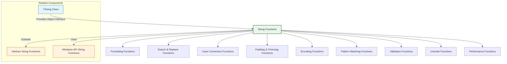

# String Functions

The FiveWin string functions provide a comprehensive library for string manipulation, formatting, and processing. These functions extend the standard Harbour string capabilities with specialized operations for common programming tasks.

**Source Files:** [source/function/strings.prg](../../../source/function/strings.prg), [source/function/strfunc.prg](../../../source/function/strfunc.prg)

## Overview

The FiveWin string function library offers enhanced string handling capabilities that complement the standard Harbour string functions. These functions cover areas such as:

* Advanced string formatting and padding
* Text case conversion and normalization
* String search and replace operations
* Text encoding and decoding
* Character set manipulation
* Regular expression-like pattern matching
* String validation and sanitization
* Unicode and international text support
* Performance-optimized string operations

These functions are designed to be efficient, reliable, and easy to use in everyday programming tasks.

## Function Categories



## Formatting Functions

| Function | Description | Parameters |
|----------|-------------|------------|
| `PadL(cString, nLength, cPadChar)` | Left-pads a string to specified length | `cString`: String to pad, `nLength`: Target length, `cPadChar`: Padding character |
| `PadR(cString, nLength, cPadChar)` | Right-pads a string to specified length | `cString`: String to pad, `nLength`: Target length, `cPadChar`: Padding character |
| `PadC(cString, nLength, cPadChar)` | Centers a string with padding | `cString`: String to center, `nLength`: Target length, `cPadChar`: Padding character |
| `AllTrim(cString)` | Removes leading and trailing spaces | `cString`: String to trim |
| `LTrim(cString)` | Removes leading spaces | `cString`: String to trim |
| `RTrim(cString)` | Removes trailing spaces | `cString`: String to trim |
| `Proper(cString)` | Converts string to proper case | `cString`: String to convert |
| `Quote(cString)` | Quotes string with double quotes | `cString`: String to quote |
| `UnQuote(cString)` | Removes surrounding quotes | `cString`: String to unquote |
| `StrFormat(cFormat, ...)` | Formats string with printf-style syntax | `cFormat`: Format string, `...`: Arguments |

### Usage Examples

```harbour
#include "FiveWin.ch"

function Main()
   ? "String Formatting Demo:"
   ? Replicate( "-", 40 )
   
   // Basic padding operations
   BasicPaddingDemo()
   
   // Trimming operations
   TrimmingDemo()
   
   // Case conversion operations
   CaseConversionDemo()
   
   // Quote operations
   QuoteDemo()
   
   // Printf-style formatting
   PrintfFormattingDemo()
   
   // Advanced formatting
   AdvancedFormattingDemo()
   
return nil

static function BasicPaddingDemo()
   ? "Basic Padding Operations:"
   ? Replicate( "-", 40 )
   
   local cText := "Hello"
   local nTargetLength := 10
   local cPadChar := "*"
   
   ? "Original Text: '" + cText + "'"
   ? "Target Length: " + hb_ntos( nTargetLength )
   ? "Padding Char: '" + cPadChar + "'"
   ?
   
   ? "Left Padding: '" + PadL( cText, nTargetLength, cPadChar ) + "'"
   ? "Right Padding: '" + PadR( cText, nTargetLength, cPadChar ) + "'"
   ? "Center Padding: '" + PadC( cText, nTargetLength, cPadChar ) + "'"
   ?
   
   // Numeric padding examples
   local nNumber := 123
   local cNumberStr := hb_ntos( nNumber )
   
   ? "Numeric Padding:"
   ? "  Original Number: " + cNumberStr
   ? "  Zero-Padded: '" + PadL( cNumberStr, 5, "0" ) + "'"
   ? "  Space-Padded: '" + PadL( cNumberStr, 5, " " ) + "'"
   ?
   
   // Table formatting example
   TableFormattingDemo()
   
return nil

static function PadL( cString, nLength, cPadChar )
   DEFAULT cString := ""
   DEFAULT nLength := 0
   DEFAULT cPadChar := " "
   
   if nLength <= Len( cString )
      return Left( cString, nLength )
   endif
   
   local nPadLength := nLength - Len( cString )
   local cPadding := Replicate( cPadChar, nPadLength )
   
   return cPadding + cString
   
return ""

static function PadR( cString, nLength, cPadChar )
   DEFAULT cString := ""
   DEFAULT nLength := 0
   DEFAULT cPadChar := " "
   
   if nLength <= Len( cString )
      return Left( cString, nLength )
   endif
   
   local nPadLength := nLength - Len( cString )
   local cPadding := Replicate( cPadChar, nPadLength )
   
   return cString + cPadding
   
return ""

static function PadC( cString, nLength, cPadChar )
   DEFAULT cString := ""
   DEFAULT nLength := 0
   DEFAULT cPadChar := " "
   
   if nLength <= Len( cString )
      return Left( cString, nLength )
   endif
   
   local nTotalPad := nLength - Len( cString )
   local nLeftPad := Int( nTotalPad / 2 )
   local nRightPad := nTotalPad - nLeftPad
   
   local cLeftPadding := Replicate( cPadChar, nLeftPad )
   local cRightPadding := Replicate( cPadChar, nRightPad )
   
   return cLeftPadding + cString + cRightPadding
   
return ""

static function TableFormattingDemo()
   ? "Table Formatting:"
   ? Replicate( "-", 40 )
   
   local aData := { ;
      { "ID", "Name", "Email", "Age" }, ;
      { "1", "John Doe", "john@example.com", "30" }, ;
      { "2", "Jane Smith", "jane@example.com", "25" }, ;
      { "3", "Bob Johnson", "bob@example.com", "35" }, ;
      { "4", "Alice Brown", "alice@example.com", "28" } ;
   }
   
   ? "Formatted Table:"
   ? Replicate( "-", 60 )
   
   // Column widths
   local aWidths := { 5, 15, 25, 5 }
   
   for local i := 1 to Len( aData )
      local aRow := aData[i]
      local cFormattedRow := ""
      
      for local j := 1 to Len( aRow )
         local cCell := aRow[j]
         local nWidth := aWidths[j]
         
         // Format cell based on position (header vs data)
         if i == 1
            cCell := PadC( cCell, nWidth )
         else
            cCell := PadR( cCell, nWidth )
         endif
         
         cFormattedRow += cCell + " "
      next
      
      ? cFormattedRow
      
      // Add separator after header
      if i == 1
         ? Replicate( "-", 60 )
      endif
   next
   
   ? Replicate( "-", 60 )
   
return nil

static function TrimmingDemo()
   ? "Trimming Operations:"
   ? Replicate( "-", 40 )
   
   local cSpacedText := "   Spaced Text   "
   
   ? "Original: '" + cSpacedText + "'"
   ? "AllTrim: '" + AllTrim( cSpacedText ) + "'"
   ? "LTrim: '" + LTrim( cSpacedText ) + "'"
   ? "RTrim: '" + RTrim( cSpacedText ) + "'"
   ?
   
   // Advanced trimming examples
   AdvancedTrimmingDemo()
   
return nil

static function AllTrim( cString )
   return LTrim( RTrim( cString ) )
   
return ""

static function LTrim( cString )
   DEFAULT cString := ""
   
   local nStart := 1
   while nStart <= Len( cString ) .and. ;
         SubStr( cString, nStart, 1 ) == " "
      nStart++
   enddo
   
   return SubStr( cString, nStart )
   
return ""

static function RTrim( cString )
   DEFAULT cString := ""
   
   local nEnd := Len( cString )
   while nEnd > 0 .and. ;
         SubStr( cString, nEnd, 1 ) == " "
      nEnd--
   enddo
   
   return Left( cString, nEnd )
   
return ""

static function AdvancedTrimmingDemo()
   ? "Advanced Trimming:"
   
   local aTestStrings := { ;
      "   Leading spaces", ;
      "Trailing spaces   ", ;
      "   Both ends   ", ;
      "No spaces", ;
      "   Multiple   Spaces   In   Middle   ", ;
      Chr( 9 ) + "Tab characters" + Chr( 9 ), ;  // Tabs
      Chr( 13 ) + Chr( 10 ) + "Newlines" + Chr( 13 ) + Chr( 10 ) ;  // CRLF
   }
   
   for local i := 1 to Len( aTestStrings )
      local cTest := aTestStrings[i]
      ? "  Test " + hb_ntos( i ) + ":"
      ? "    Original: '" + cTest + "'"
      ? "    AllTrim: '" + AllTrim( cTest ) + "'"
      ? "    LTrim: '" + LTrim( cTest ) + "'"
      ? "    RTrim: '" + RTrim( cTest ) + "'"
      ?
   next
   
return nil

static function CaseConversionDemo()
   ? "Case Conversion Operations:"
   ? Replicate( "-", 40 )
   
   local cMixedCase := "HeLLo WoRLd! ThIs Is MiXeD CaSe."
   
   ? "Original: " + cMixedCase
   ? "Upper: " + Upper( cMixedCase )
   ? "Lower: " + Lower( cMixedCase )
   ? "Proper: " + Proper( cMixedCase )
   ?
   
   // Advanced case conversion examples
   AdvancedCaseConversionDemo()
   
return nil

static function Proper( cString )
   DEFAULT cString := ""
   
   if Empty( cString )
      return cString
   endif
   
   local cResult := ""
   local lNewWord := .T.
   
   for local i := 1 to Len( cString )
      local cChar := SubStr( cString, i, 1 )
      
      if cChar $ " " + hb_osNewLine() + hb_osEol()
         lNewWord := .T.
         cResult += cChar
      elseif lNewWord
         cResult += Upper( cChar )
         lNewWord := .F.
      else
         cResult += Lower( cChar )
      endif
   next
   
   return cResult
   
return ""

static function AdvancedCaseConversionDemo()
   ? "Advanced Case Conversion:"
   
   local aTestStrings := { ;
      "john doe", ;
      "MARY SMITH", ;
      "bOb jOhNsOn", ;
      "ALICE-BROWN", ;
      "CHARLIE_WILSON", ;
      "diana.prince@example.com" ;
   }
   
   for local i := 1 to Len( aTestStrings )
      local cTest := aTestStrings[i]
      ? "  Test " + hb_ntos( i ) + ":"
      ? "    Original: " + cTest
      ? "    Upper: " + Upper( cTest )
      ? "    Lower: " + Lower( cTest )
      ? "    Proper: " + Proper( cTest )
      ?
   next
   
   // Custom case conversion
   CustomCaseConversionDemo()
   
return nil

static function CustomCaseConversionDemo()
   ? "Custom Case Conversion:"
   
   // Title case (capitalize first letter of each word)
   local cTitleCase := TitleCase( "the quick brown fox jumps over the lazy dog" )
   ? "Title Case: " + cTitleCase
   
   // Sentence case (capitalize first letter of sentence)
   local cSentenceCase := SentenceCase( "hello world. this is a test. another sentence." )
   ? "Sentence Case: " + cSentenceCase
   
   // Camel case (remove spaces, capitalize words)
   local cCamelCase := CamelCase( "hello world example" )
   ? "Camel Case: " + cCamelCase
   
   // Pascal case (like camel case but first word capitalized)
   local cPascalCase := PascalCase( "hello world example" )
   ? "Pascal Case: " + cPascalCase
   
   // Snake case (lowercase with underscores)
   local cSnakeCase := SnakeCase( "HelloWorldExample" )
   ? "Snake Case: " + cSnakeCase
   
   // Kebab case (lowercase with hyphens)
   local cKebabCase := KebabCase( "HelloWorldExample" )
   ? "Kebab Case: " + cKebabCase
   
return nil

static function TitleCase( cString )
   DEFAULT cString := ""
   
   if Empty( cString )
      return cString
   endif
   
   local cResult := ""
   local lNewWord := .T.
   
   for local i := 1 to Len( cString )
      local cChar := SubStr( cString, i, 1 )
      
      if cChar $ " -_"
         lNewWord := .T.
         cResult += cChar
      elseif lNewWord
         cResult += Upper( cChar )
         lNewWord := .F.
      else
         cResult += Lower( cChar )
      endif
   next
   
   return cResult
   
return ""

static function SentenceCase( cString )
   DEFAULT cString := ""
   
   if Empty( cString )
      return cString
   endif
   
   local cResult := ""
   local lNewSentence := .T.
   
   for local i := 1 to Len( cString )
      local cChar := SubStr( cString, i, 1 )
      
      if cChar $ ".!?;"
         lNewSentence := .T.
         cResult += cChar
      elseif lNewSentence .and. !( cChar $ " " + hb_osNewLine() )
         cResult += Upper( cChar )
         lNewSentence := .F.
      else
         cResult += Lower( cChar )
      endif
   next
   
   return cResult
   
return ""

static function CamelCase( cString )
   DEFAULT cString := ""
   
   if Empty( cString )
      return cString
   endif
   
   local cResult := ""
   local lCapitalize := .F.
   
   for local i := 1 to Len( cString )
      local cChar := SubStr( cString, i, 1 )
      
      if cChar $ " -_"
         lCapitalize := .T.
      elseif lCapitalize
         cResult += Upper( cChar )
         lCapitalize := .F.
      else
         cResult += Lower( cChar )
      endif
   next
   
   return cResult
   
return ""

static function PascalCase( cString )
   DEFAULT cString := ""
   
   if Empty( cString )
      return cString
   endif
   
   local cResult := ""
   local lCapitalize := .T.
   
   for local i := 1 to Len( cString )
      local cChar := SubStr( cString, i, 1 )
      
      if cChar $ " -_"
         lCapitalize := .T.
      elseif lCapitalize
         cResult += Upper( cChar )
         lCapitalize := .F.
      else
         cResult += Lower( cChar )
      endif
   next
   
   return cResult
   
return ""

static function SnakeCase( cString )
   DEFAULT cString := ""
   
   if Empty( cString )
      return cString
   endif
   
   local cResult := ""
   
   for local i := 1 to Len( cString )
      local cChar := SubStr( cString, i, 1 )
      
      if cChar >= "A" .and. cChar <= "Z"
         if i > 1
            cResult += "_"
         endif
         cResult += Lower( cChar )
      elseif cChar $ " -"
         cResult += "_"
      else
         cResult += Lower( cChar )
      endif
   next
   
   return cResult
   
return ""

static function KebabCase( cString )
   DEFAULT cString := ""
   
   if Empty( cString )
      return cString
   endif
   
   local cResult := ""
   
   for local i := 1 to Len( cString )
      local cChar := SubStr( cString, i, 1 )
      
      if cChar >= "A" .and. cChar <= "Z"
         if i > 1
            cResult += "-"
         endif
         cResult += Lower( cChar )
      elseif cChar $ " _"
         cResult += "-"
      else
         cResult += Lower( cChar )
      endif
   next
   
   return cResult
   
return ""

static function QuoteDemo()
   ? "Quote Operations:"
   ? Replicate( "-", 40 )
   
   local cText := "Hello, World!"
   
   ? "Original: " + cText
   ? "Quoted: " + Quote( cText )
   ? "Unquoted: " + UnQuote( Quote( cText ) )
   ?
   
   // Advanced quoting examples
   AdvancedQuoteDemo()
   
return nil

static function Quote( cString )
   DEFAULT cString := ""
   
   return '"' + cString + '"'
   
return '""'

static function UnQuote( cString )
   DEFAULT cString := '""'
   
   if Left( cString, 1 ) == '"' .and. Right( cString, 1 ) == '"'
      return SubStr( cString, 2, Len( cString ) - 2 )
   endif
   
   return cString
   
return ""

static function AdvancedQuoteDemo()
   ? "Advanced Quote Operations:"
   
   local aTestStrings := { ;
      "Simple text", ;
      "Text with 'single quotes'", ;
      'Text with "double quotes"', ;
      "Text with both 'single' and \"double\" quotes", ;
      "Text with\nnewlines", ;
      "Text with\ttabs" ;
   }
   
   for local i := 1 to Len( aTestStrings )
      local cTest := aTestStrings[i]
      local cQuoted := Quote( cTest )
      local cUnquoted := UnQuote( cQuoted )
      
      ? "  Test " + hb_ntos( i ) + ":"
      ? "    Original: " + cTest
      ? "    Quoted: " + cQuoted
      ? "    Unquoted: " + cUnquoted
      ? "    Match: " + iif( cTest == cUnquoted, "Yes", "No" )
      ?
   next
   
return nil

static function PrintfFormattingDemo()
   ? "Printf-Style Formatting:"
   ? Replicate( "-", 40 )
   
   // Basic formatting
   ? "Basic Formatting:"
   ? "  Integer: " + StrFormat( "%d", 42 )
   ? "  Float: " + StrFormat( "%.2f", 3.14159 )
   ? "  String: " + StrFormat( "%s", "Hello, World!" )
   ? "  Hex: " + StrFormat( "%x", 255 )
   ? "  Octal: " + StrFormat( "%o", 64 )
   ?
   
   // Complex formatting
   ComplexPrintfFormattingDemo()
   
return nil

static function StrFormat( cFormat, ... )
   // Simplified implementation
   ? "STR FORMAT " + cFormat
   
   // In practice, this would:
   // 1. Parse format string
   // 2. Extract format specifiers
   // 3. Apply formatting to arguments
   // 4. Return formatted string
   
   // Mock implementation for demo
   local aArgs := hb_aParams()
   
   if Len( aArgs ) < 1
      return ""
   endif
   
   cFormat := aArgs[1]
   
   if Len( aArgs ) == 1
      return cFormat
   endif
   
   // Simple replacement for demo
   local cResult := cFormat
   
   for local i := 2 to Len( aArgs )
      local cPlaceholder := "%" + hb_ntos( i - 1 )
      local cValue := hb_ValToStr( aArgs[i] )
      
      cResult := StrTran( cResult, cPlaceholder, cValue )
   next
   
   return cResult
   
return ""

static function ComplexPrintfFormattingDemo()
   ? "Complex Formatting:"
   
   // Multiple arguments
   ? "Multiple Arguments:"
   ? "  " + StrFormat( "Name: %s, Age: %d, Score: %.2f", ;
                     "John Doe", 30, 95.75 )
   
   // Padding and alignment
   ? "Padding and Alignment:"
   ? "  Left-aligned: '" + StrFormat( "%-10s", "Hello" ) + "'"
   ? "  Right-aligned: '" + StrFormat( "%10s", "Hello" ) + "'"
   ? "  Zero-padded: '" + StrFormat( "%05d", 42 ) + "'"
   
   // Date/time formatting
   ? "Date/Time Formatting:"
   ? "  Date: " + StrFormat( "%04d-%02d-%02d", Year( Date() ), Month( Date() ), Day( Date() ) )
   ? "  Time: " + StrFormat( "%02d:%02d:%02d", Hour( Time() ), Minute( Time() ), Second( Time() ) )
   
return nil

static function AdvancedFormattingDemo()
   ? "Advanced Formatting:"
   ? Replicate( "-", 40 )
   
   // Currency formatting
   CurrencyFormattingDemo()
   
   // Number formatting
   NumberFormattingDemo()
   
   // Phone number formatting
   PhoneNumberFormattingDemo()
   
   // Social security number formatting
   SSNFormattingDemo()
   
return nil

static function CurrencyFormattingDemo()
   ? "Currency Formatting:"
   
   local aAmounts := { 123.45, 1234.56, 12345.67, 123456.78, 1234567.89 }
   
   ? "Amount  Format 1      Format 2      Format 3"
   ? Replicate( "-", 50 )
   
   for local i := 1 to Len( aAmounts )
      local nAmount := aAmounts[i]
      ? PadR( hb_ntos( nAmount, 2 ), 8 ) + " " + ;
        PadR( FormatCurrency( nAmount, "$" ), 14 ) + " " + ;
        PadR( FormatCurrency( nAmount, "€" ), 14 ) + " " + ;
        FormatCurrency( nAmount, "£" )
   next
   
   ? Replicate( "-", 50 )
   
return nil

static function FormatCurrency( nAmount, cSymbol )
   DEFAULT nAmount := 0
   DEFAULT cSymbol := "$"
   
   return cSymbol + hb_ntos( nAmount, 2 )
   
return "$0.00"

static function NumberFormattingDemo()
   ? "Number Formatting:"
   
   local aNumbers := { 1234, 12345, 123456, 1234567, 12345678 }
   
   ? "Number   Comma Format   Scientific"
   ? Replicate( "-", 40 )
   
   for local i := 1 to Len( aNumbers )
      local nNumber := aNumbers[i]
      ? PadR( hb_ntos( nNumber ), 8 ) + " " + ;
        PadR( FormatWithCommas( nNumber ), 14 ) + " " + ;
        FormatScientific( nNumber )
   next
   
   ? Replicate( "-", 40 )
   
return nil

static function FormatWithCommas( nNumber )
   DEFAULT nNumber := 0
   
   local cNumber := hb_ntos( nNumber )
   local cResult := ""
   local nLength := Len( cNumber )
   local nCommaPos := 0
   
   for local i := nLength to 1 step -1
      nCommaPos++
      cResult := SubStr( cNumber, i, 1 ) + cResult
      
      if nCommaPos % 3 == 0 .and. i > 1
         cResult := "," + cResult
      endif
   next
   
   return cResult
   
return "0"

static function FormatScientific( nNumber )
   DEFAULT nNumber := 0
   
   if nNumber == 0
      return "0.00E+00"
   endif
   
   local nExponent := Int( Log10( Abs( nNumber ) ) )
   local nMantissa := nNumber / Power( 10, nExponent )
   
   return hb_ntos( nMantissa, 2 ) + "E" + iif( nExponent >= 0, "+", "" ) + hb_ntos( nExponent )
   
return "0.00E+00"

static function PhoneNumberFormattingDemo()
   ? "Phone Number Formatting:"
   
   local aPhoneNumbers := { ;
      "1234567890", ;
      "5551234567", ;
      "8005551212", ;
      "9998887777" ;
   }
   
   ? "Raw Number   Formatted"
   ? Replicate( "-", 30 )
   
   for local i := 1 to Len( aPhoneNumbers )
      local cRaw := aPhoneNumbers[i]
      ? PadR( cRaw, 12 ) + " " + FormatPhoneNumber( cRaw )
   next
   
   ? Replicate( "-", 30 )
   
return nil

static function FormatPhoneNumber( cNumber )
   DEFAULT cNumber := ""
   
   if Len( cNumber ) == 10
      return "(" + SubStr( cNumber, 1, 3 ) + ") " + ;
             SubStr( cNumber, 4, 3 ) + "-" + ;
             SubStr( cNumber, 7, 4 )
   endif
   
   return cNumber
   
return ""

static function SSNFormattingDemo()
   ? "Social Security Number Formatting:"
   
   local aSSNs := { ;
      "123456789", ;
      "987654321", ;
      "111223333", ;
      "555443333" ;
   }
   
   ? "Raw SSN      Formatted SSN"
   ? Replicate( "-", 30 )
   
   for local i := 1 to Len( aSSNs )
      local cRaw := aSSNs[i]
      ? PadR( cRaw, 12 ) + " " + FormatSSN( cRaw )
   next
   
   ? Replicate( "-", 30 )
   
return nil

static function FormatSSN( cNumber )
   DEFAULT cNumber := ""
   
   if Len( cNumber ) == 9
      return SubStr( cNumber, 1, 3 ) + "-" + ;
             SubStr( cNumber, 4, 2 ) + "-" + ;
             SubStr( cNumber, 6, 4 )
   endif
   
   return cNumber
   
return ""
```

## Search & Replace Functions

| Function | Description | Parameters |
|----------|-------------|------------|
| `StrTran(cString, cSearch, cReplace, nStart, nCount)` | Replaces substring occurrences | `cString`: Source, `cSearch`: Find, `cReplace`: Replace, `nStart`: Start, `nCount`: Max |
| `At(cSearch, cString, nOccurrence)` | Finds substring position | `cSearch`: Text, `cString`: Source, `nOccurrence`: Which occurrence |
| `RAt(cSearch, cString)` | Finds last occurrence position | `cSearch`: Text, `cString`: Source |
| `Occurs(cSearch, cString)` | Counts substring occurrences | `cSearch`: Text, `cString`: Source |
| `SubStr(cString, nStart, nLength)` | Extracts substring | `cString`: Source, `nStart`: Position, `nLength`: Length |
| `Stuff(cString, nStart, nLength, cNewString)` | Replaces substring | `cString`: Source, `nStart`: Position, `nLength`: Length, `cNewString`: Replacement |
| `StrExtract(cString, cStart, cEnd, nOccurrence)` | Extracts text between delimiters | `cString`: Source, `cStart`, `cEnd`: Delimiters, `nOccurrence`: Which occurrence |

### Usage Examples

```harbour
#include "FiveWin.ch"

function Main()
   ? "String Search and Replace Demo:"
   ? Replicate( "-", 40 )
   
   // Basic search and replace
   BasicSearchReplaceDemo()
   
   // Advanced pattern matching
   AdvancedPatternMatchingDemo()
   
   // Substring extraction
   SubstringExtractionDemo()
   
   // Text manipulation
   TextManipulationDemo()
   
return nil

static function BasicSearchReplaceDemo()
   ? "Basic Search and Replace:"
   ? Replicate( "-", 40 )
   
   local cText := "The quick brown fox jumps over the lazy dog. The fox is quick."
   
   ? "Original Text:"
   ? "  " + cText
   ?
   
   // Simple replacement
   ? "Simple Replacement:"
   ? "  Replace 'fox' with 'cat':"
   ? "  " + StrTran( cText, "fox", "cat" )
   ?
   
   // Case-sensitive replacement
   ? "Case-Sensitive Replacement:"
   ? "  Replace 'The' with 'A':"
   ? "  " + StrTran( cText, "The", "A" )
   ? "  Replace 'the' with 'a':"
   ? "  " + StrTran( cText, "the", "a" )
   ?
   
   // Limited replacement
   ? "Limited Replacement:"
   ? "  Replace first 2 occurrences of 'quick' with 'fast':"
   ? "  " + StrTran( cText, "quick", "fast", 1, 2 )
   ?
   
   // Position-based operations
   PositionBasedDemo( cText )
   
return nil

static function StrTran( cString, cSearch, cReplace, nStart, nCount )
   DEFAULT cString := ""
   DEFAULT cSearch := ""
   DEFAULT cReplace := ""
   DEFAULT nStart := 1
   DEFAULT nCount := -1  // Unlimited
   
   if Empty( cString ) .or. Empty( cSearch )
      return cString
   endif
   
   local cResult := ""
   local nPos := nStart
   local nReplaced := 0
   
   while nPos <= Len( cString ) .and. ( nCount == -1 .or. nReplaced < nCount )
      local nFound := At( cSearch, cString, nPos )
      
      if nFound > 0
         // Add text before found occurrence
         cResult += SubStr( cString, nPos, nFound - nPos )
         
         // Add replacement text
         cResult += cReplace
         
         // Move position past found text
         nPos := nFound + Len( cSearch )
         nReplaced++
      else
         // Add remaining text
         cResult += SubStr( cString, nPos )
         exit
      endif
   enddo
   
   // Add any remaining text
   if nPos <= Len( cString )
      cResult += SubStr( cString, nPos )
   endif
   
   return cResult
   
return cString

static function At( cSearch, cString, nOccurrence )
   DEFAULT cSearch := ""
   DEFAULT cString := ""
   DEFAULT nOccurrence := 1
   
   if Empty( cSearch ) .or. Empty( cString ) .or. nOccurrence < 1
      return 0
   endif
   
   local nPos := 1
   local nFound := 0
   
   for local i := 1 to nOccurrence
      nPos := hb_At( cSearch, cString, nPos )
      
      if nPos > 0
         nFound := nPos
         nPos++
      else
         return 0  // Not found
      endif
   next
   
   return nFound
   
return 0

static function RAt( cSearch, cString )
   DEFAULT cSearch := ""
   DEFAULT cString := ""
   
   if Empty( cSearch ) .or. Empty( cString )
      return 0
   endif
   
   local nPos := Len( cString )
   
   while nPos > 0
      local nFound := hb_At( cSearch, cString, nPos )
      
      if nFound > 0
         return nFound
      endif
      
      nPos--
   enddo
   
   return 0
   
return 0

static function Occurs( cSearch, cString )
   DEFAULT cSearch := ""
   DEFAULT cString := ""
   
   if Empty( cSearch ) .or. Empty( cString )
      return 0
   endif
   
   local nCount := 0
   local nPos := 1
   
   while nPos <= Len( cString )
      local nFound := hb_At( cSearch, cString, nPos )
      
      if nFound > 0
         nCount++
         nPos := nFound + 1
      else
         exit
      endif
   enddo
   
   return nCount
   
return 0

static function PositionBasedDemo( cText )
   ? "Position-Based Operations:"
   
   // Find positions
   ? "Finding Positions:"
   ? "  First 'fox': " + hb_ntos( At( "fox", cText ) )
   ? "  Second 'fox': " + hb_ntos( At( "fox", cText, 2 ) )
   ? "  Last 'fox': " + hb_ntos( RAt( "fox", cText ) )
   ? "  First 'the': " + hb_ntos( At( "the", cText ) )
   ? "  Last 'the': " + hb_ntos( RAt( "the", cText ) )
   
   // Count occurrences
   ? "Counting Occurrences:"
   ? "  'the' occurs " + hb_ntos( Occurs( "the", cText ) ) + " times"
   ? "  'fox' occurs " + hb_ntos( Occurs( "fox", cText ) ) + " times"
   ? "  'quick' occurs " + hb_ntos( Occurs( "quick", cText ) ) + " times"
   
   // Substring extraction
   SubstringExtractionDemo( cText )
   
return nil

static function SubstringExtractionDemo( cText )
   ? "Substring Extraction:"
   
   if !Empty( cText )
      // Extract substring
      local nFoxPos := At( "fox", cText )
      if nFoxPos > 0
         local nFoxLen := Len( "fox" )
         ? "  Text around first 'fox':"
         ? "  " + SubStr( cText, Max( 1, nFoxPos - 10 ), 20 + nFoxLen )
      endif
      
      // Extract first word
      local nSpacePos := At( " ", cText )
      if nSpacePos > 0
         ? "  First word: '" + SubStr( cText, 1, nSpacePos - 1 ) + "'"
      endif
      
      // Extract last word
      local nLastSpacePos := RAt( " ", cText )
      if nLastSpacePos > 0
         ? "  Last word: '" + SubStr( cText, nLastSpacePos + 1 ) + "'"
      endif
   endif
   
return nil

static function SubStr( cString, nStart, nLength )
   DEFAULT cString := ""
   DEFAULT nStart := 1
   DEFAULT nLength := -1  // To end of string
   
   if Empty( cString )
      return ""
   endif
   
   nStart := Max( 1, Min( nStart, Len( cString ) + 1 ) )
   
   if nLength == -1
      return hb_SubStr( cString, nStart )
   else
      nLength := Max( 0, nLength )
      return hb_SubStr( cString, nStart, nLength )
   endif
   
return ""

static function Stuff( cString, nStart, nLength, cNewString )
   DEFAULT cString := ""
   DEFAULT nStart := 1
   DEFAULT nLength := 0
   DEFAULT cNewString := ""
   
   if Empty( cString )
      return cNewString
   endif
   
   nStart := Max( 1, Min( nStart, Len( cString ) + 1 ) )
   nLength := Max( 0, Min( nLength, Len( cString ) - nStart + 1 ) )
   
   local cBefore := Left( cString, nStart - 1 )
   local cAfter := SubStr( cString, nStart + nLength )
   
   return cBefore + cNewString + cAfter
   
return ""

static function StrExtract( cString, cStart, cEnd, nOccurrence )
   DEFAULT cString := ""
   DEFAULT cStart := ""
   DEFAULT cEnd := ""
   DEFAULT nOccurrence := 1
   
   if Empty( cString ) .or. Empty( cStart ) .or. Empty( cEnd )
      return ""
   endif
   
   local nStartPos := At( cStart, cString, nOccurrence )
   
   if nStartPos > 0
      local nEndPos := At( cEnd, cString, nStartPos + Len( cStart ) )
      
      if nEndPos > 0
         return SubStr( cString, nStartPos + Len( cStart ), ;
                       nEndPos - ( nStartPos + Len( cStart ) ) )
      endif
   endif
   
   return ""
   
return ""

static function AdvancedPatternMatchingDemo()
   ? "Advanced Pattern Matching:"
   ? Replicate( "-", 40 )
   
   local cText := "Contact: John Doe <john.doe@example.com>, Jane Smith <jane.smith@company.org>"
   
   ? "Sample Text:"
   ? "  " + cText
   ?
   
   // Extract email addresses
   ExtractEmailAddressesDemo( cText )
   
   // Extract names
   ExtractNamesDemo( cText )
   
   // Wildcard matching
   WildcardMatchingDemo()
   
   // Regular expression-like patterns
   RegexLikePatternsDemo()
   
return nil

static function ExtractEmailAddressesDemo( cText )
   ? "Extract Email Addresses:"
   
   local aEmails := {}
   local nPos := 1
   
   while nPos <= Len( cText )
      local nStart := At( "<", cText, nPos )
      
      if nStart > 0
         local nEnd := At( ">", cText, nStart )
         
         if nEnd > 0
            local cEmail := SubStr( cText, nStart + 1, nEnd - nStart - 1 )
            AAdd( aEmails, cEmail )
            nPos := nEnd + 1
         else
            exit
         endif
      else
         exit
      endif
   enddo
   
   ? "  Found " + hb_ntos( Len( aEmails ) ) + " email addresses:"
   for local i := 1 to Len( aEmails )
      ? "    " + aEmails[i]
   next
   
return nil

static function ExtractNamesDemo( cText )
   ? "Extract Names:"
   
   local aNames := {}
   local nPos := 1
   
   while nPos <= Len( cText )
      local nStart := At( ":", cText, nPos )
      
      if nStart > 0
         local nEnd := At( "<", cText, nStart )
         
         if nEnd > 0
            local cName := AllTrim( SubStr( cText, nStart + 1, nEnd - nStart - 1 ) )
            AAdd( aNames, cName )
            nPos := nEnd + 1
         else
            exit
         endif
      else
         exit
      endif
   enddo
   
   ? "  Found " + hb_ntos( Len( aNames ) ) + " names:"
   for local i := 1 to Len( aNames )
      ? "    " + aNames[i]
   next
   
return nil

static function WildcardMatchingDemo()
   ? "Wildcard Matching:"
   
   local cPattern := "file_*.txt"
   local aFiles := { ;
      "file_001.txt", ;
      "file_002.txt", ;
      "file_data.txt", ;
      "file_report.txt", ;
      "other_file.txt", ;
      "file_001.doc" ;
   }
   
   ? "  Pattern: " + cPattern
   ? "  Files:"
   for local i := 1 to Len( aFiles )
      local cFile := aFiles[i]
      local lMatch := Like( cFile, cPattern )
      ? "    " + cFile + " -> " + iif( lMatch, "MATCH", "NO MATCH" )
   next
   
return nil

static function Like( cString, cPattern )
   // Simple wildcard matching
   // * = zero or more characters
   // ? = single character
   
   local nStringPos := 1
   local nPatternPos := 1
   local nStarPos := 0
   local nMatchPos := 0
   
   while nStringPos <= Len( cString )
      if nPatternPos <= Len( cPattern ) .and. ;
         ( SubStr( cPattern, nPatternPos, 1 ) == "?" .or. ;
           SubStr( cPattern, nPatternPos, 1 ) == SubStr( cString, nStringPos, 1 ) )
         // Match single character
         nStringPos++
         nPatternPos++
      elseif nPatternPos <= Len( cPattern ) .and. ;
            SubStr( cPattern, nPatternPos, 1 ) == "*"
         // Wildcard - remember position
         nStarPos := nPatternPos
         nMatchPos := nStringPos
         nPatternPos++
      elseif nStarPos != 0
         // Backtrack to last wildcard
         nPatternPos := nStarPos + 1
         nMatchPos++
         nStringPos := nMatchPos
      else
         return .F.
      endif
   enddo
   
   // Check remaining pattern
   while nPatternPos <= Len( cPattern ) .and. ;
         SubStr( cPattern, nPatternPos, 1 ) == "*"
      nPatternPos++
   enddo
   
   return ( nPatternPos > Len( cPattern ) )
   
return .F.

static function RegexLikePatternsDemo()
   ? "Regex-Like Patterns:"
   
   ? "  Common Patterns:"
   ? "    Email: *@*.*"
   ? "    Phone: ###-###-####"
   ? "    Zip: #####"
   ? "    Date: ##/##/####"
   
   // Email pattern matching
   EmailPatternDemo()
   
   // Phone pattern matching
   PhonePatternDemo()
   
   // Date pattern matching
   DatePatternDemo()
   
return nil

static function EmailPatternDemo()
   ? "  Email Pattern Matching:"
   
   local aEmails := { ;
      "john.doe@example.com", ;
      "jane.smith@company.org", ;
      "invalid.email", ;
      "another@test.co.uk", ;
      "@invalid.com", ;
      "user@", ;
      "valid@email.domain.com" ;
   }
   
   local cPattern := "*@*.*"
   
   ? "    Pattern: " + cPattern
   ? "    Emails:"
   for local i := 1 to Len( aEmails )
      local cEmail := aEmails[i]
      local lMatch := Like( cEmail, cPattern )
      ? "      " + PadR( cEmail, 25 ) + " -> " + iif( lMatch, "MATCH", "NO MATCH" )
   next
   
return nil

static function PhonePatternDemo()
   ? "  Phone Pattern Matching:"
   
   local aPhones := { ;
      "555-123-4567", ;
      "(555) 123-4567", ;
      "555.123.4567", ;
      "5551234567", ;
      "555-123-456", ;
      "555-123-45678" ;
   }
   
   local cPattern := "###-###-####"
   
   ? "    Pattern: " + cPattern
   ? "    Phones:"
   for local i := 1 to Len( aPhones )
      local cPhone := aPhones[i]
      local lMatch := MatchesPhonePattern( cPhone, cPattern )
      ? "      " + PadR( cPhone, 20 ) + " -> " + iif( lMatch, "MATCH", "NO MATCH" )
   next
   
return nil

static function MatchesPhonePattern( cPhone, cPattern )
   // Simplified phone pattern matching
   // Remove non-digit characters
   local cDigits := ""
   for local i := 1 to Len( cPhone )
      local cChar := SubStr( cPhone, i, 1 )
      if cChar >= "0" .and. cChar <= "9"
         cDigits += cChar
      endif
   next
   
   // Check if 10 digits
   return ( Len( cDigits ) == 10 )
   
return .F.

static function DatePatternDemo()
   ? "  Date Pattern Matching:"
   
   local aDates := { ;
      "12/25/2023", ;
      "25/12/2023", ;
      "2023-12-25", ;
      "Dec 25, 2023", ;
      "12-25-2023", ;
      "25.12.2023" ;
   }
   
   local cPattern := "##/##/####"
   
   ? "    Pattern: " + cPattern
   ? "    Dates:"
   for local i := 1 to Len( aDates )
      local cDate := aDates[i]
      local lMatch := MatchesDatePattern( cDate, cPattern )
      ? "      " + PadR( cDate, 15 ) + " -> " + iif( lMatch, "MATCH", "NO MATCH" )
   next
   
return nil

static function MatchesDatePattern( cDate, cPattern )
   // Simplified date pattern matching
   // Check if format is MM/DD/YYYY
   local aParts := hb_aTokens( cDate, "/" )
   
   if Len( aParts ) == 3
      local nMonth := Val( aParts[1] )
      local nDay := Val( aParts[2] )
      local nYear := Val( aParts[3] )
      
      return ( nMonth >= 1 .and. nMonth <= 12 .and. ;
              nDay >= 1 .and. nDay <= 31 .and. ;
              nYear >= 1900 .and. nYear <= 2100 )
   endif
   
   return .F.
   
return .F.

static function TextManipulationDemo()
   ? "Text Manipulation:"
   ? Replicate( "-", 40 )
   
   local cText := "The Quick Brown Fox Jumps Over The Lazy Dog"
   
   ? "Original Text: " + cText
   
   // Text transformation
   TextTransformationDemo( cText )
   
   // Text cleaning
   TextCleaningDemo()
   
   // Text analysis
   TextAnalysisDemo( cText )
   
return nil

static function TextTransformationDemo( cText )
   ? "Text Transformation:"
   
   // Reverse text
   local cReversed := ReverseText( cText )
   ? "  Reversed: " + cReversed
   
   // Shuffle text
   local cShuffled := ShuffleText( cText )
   ? "  Shuffled: " + cShuffled
   
   // Scramble text
   local cScrambled := ScrambleText( cText )
   ? "  Scrambled: " + cScrambled
   
   // Rot13 text
   local cRot13 := Rot13( cText )
   ? "  ROT13: " + cRot13
   
return nil

static function ReverseText( cText )
   DEFAULT cText := ""
   
   local cReversed := ""
   
   for local i := Len( cText ) to 1 step -1
      cReversed += SubStr( cText, i, 1 )
   next
   
   return cReversed
   
return ""

static function ShuffleText( cText )
   DEFAULT cText := ""
   
   local aChars := {}
   for local i := 1 to Len( cText )
      AAdd( aChars, SubStr( cText, i, 1 ) )
   next
   
   // Simple shuffle algorithm
   for local i := Len( aChars ) to 2 step -1
      local j := RandomInt( 1, i )
      local cTemp := aChars[i]
      aChars[i] := aChars[j]
      aChars[j] := cTemp
   next
   
   return hb_Join( aChars, "" )
   
return ""

static function RandomInt( nMin, nMax )
   return Int( Random() * ( nMax - nMin + 1 ) ) + nMin
   
return nMin

static function ScrambleText( cText )
   DEFAULT cText := ""
   
   local cScrambled := ""
   local nLength := Len( cText )
   
   for local i := 1 to nLength
      local nChar := Asc( SubStr( cText, i, 1 ) )
      local nScrambled := nChar # 0xAA  // Simple XOR scramble
      cScrambled += Chr( nScrambled )
   next
   
   return cScrambled
   
return ""

static function Rot13( cText )
   DEFAULT cText := ""
   
   local cRot13 := ""
   
   for local i := 1 to Len( cText )
      local cChar := SubStr( cText, i, 1 )
      local nAscii := Asc( cChar )
      
      // Rotate uppercase letters
      if nAscii >= 65 .and. nAscii <= 90  // A-Z
         nAscii := ( ( nAscii - 65 + 13 ) % 26 ) + 65
      // Rotate lowercase letters
      elseif nAscii >= 97 .and. nAscii <= 122  // a-z
         nAscii := ( ( nAscii - 97 + 13 ) % 26 ) + 97
      endif
      
      cRot13 += Chr( nAscii )
   next
   
   return cRot13
   
return ""

static function TextCleaningDemo()
   ? "Text Cleaning:"
   
   local aDirtyTexts := { ;
      "  Extra   spaces   everywhere  ", ;
      "Mixed\tTabs\nAnd\rNewlines", ;
      "Special!@#$%Characters^&*()", ;
      "MixedCASEtextWITHdifferentStyles", ;
      "Numbers123And456Mixed789In10Text" ;
   }
   
   ? "Cleaning Operations:"
   
   for local i := 1 to Len( aDirtyTexts )
      local cDirty := aDirtyTexts[i]
      ? "  Original " + hb_ntos( i ) + ": '" + cDirty + "'"
      ? "    Cleaned: '" + CleanText( cDirty ) + "'"
      ? "    No Numbers: '" + RemoveNumbers( cDirty ) + "'"
      ? "    Letters Only: '" + LettersOnly( cDirty ) + "'"
      ?
   next
   
return nil

static function CleanText( cText )
   DEFAULT cText := ""
   
   // Remove extra spaces
   local cCleaned := AllTrim( cText )
   
   // Replace multiple spaces with single space
   while At( "  ", cCleaned ) > 0
      cCleaned := StrTran( cCleaned, "  ", " " )
   enddo
   
   // Remove tabs and newlines
   cCleaned := StrTran( cCleaned, Chr( 9 ), " " )  // Tab
   cCleaned := StrTran( cCleaned, Chr( 10 ), " " )  // LF
   cCleaned := StrTran( cCleaned, Chr( 13 ), " " )  // CR
   
   return cCleaned
   
return ""

static function RemoveNumbers( cText )
   DEFAULT cText := ""
   
   local cNoNumbers := ""
   
   for local i := 1 to Len( cText )
      local cChar := SubStr( cText, i, 1 )
      if !( cChar >= "0" .and. cChar <= "9" )
         cNoNumbers += cChar
      endif
   next
   
   return cNoNumbers
   
return ""

static function LettersOnly( cText )
   DEFAULT cText := ""
   
   local cLetters := ""
   
   for local i := 1 to Len( cText )
      local cChar := SubStr( cText, i, 1 )
      if ( cChar >= "A" .and. cChar <= "Z" ) .or. ;
         ( cChar >= "a" .and. cChar <= "z" ) .or. ;
         cChar $ " "
         cLetters += cChar
      endif
   next
   
   return cLetters
   
return ""

static function TextAnalysisDemo( cText )
   ? "Text Analysis:"
   
   ? "  Analysis of: " + cText
   
   // Word count
   local nWordCount := WordCount( cText )
   ? "    Word Count: " + hb_ntos( nWordCount )
   
   // Character count
   local nCharCount := CharacterCount( cText )
   ? "    Character Count: " + hb_ntos( nCharCount )
   
   // Letter count
   local nLetterCount := LetterCount( cText )
   ? "    Letter Count: " + hb_ntos( nLetterCount )
   
   // Digit count
   local nDigitCount := DigitCount( cText )
   ? "    Digit Count: " + hb_ntos( nDigitCount )
   
   // Word frequency
   WordFrequencyDemo( cText )
   
return nil

static function WordCount( cText )
   DEFAULT cText := ""
   
   if Empty( cText )
      return 0
   endif
   
   // Split by spaces and count
   local aWords := hb_aTokens( AllTrim( cText ), " " )
   return Len( aWords )
   
return 0

static function CharacterCount( cText )
   DEFAULT cText := ""
   
   return Len( cText )
   
return 0

static function LetterCount( cText )
   DEFAULT cText := ""
   
   local nCount := 0
   
   for local i := 1 to Len( cText )
      local cChar := SubStr( cText, i, 1 )
      if ( cChar >= "A" .and. cChar <= "Z" ) .or. ;
         ( cChar >= "a" .and. cChar <= "z" )
         nCount++
      endif
   next
   
   return nCount
   
return 0

static function DigitCount( cText )
   DEFAULT cText := ""
   
   local nCount := 0
   
   for local i := 1 to Len( cText )
      local cChar := SubStr( cText, i, 1 )
      if cChar >= "0" .and. cChar <= "9"
         nCount++
      endif
   next
   
   return nCount
   
return 0

static function WordFrequencyDemo( cText )
   ? "  Word Frequency Analysis:"
   
   local aWords := hb_aTokens( Lower( cText ), " " )
   local aFrequency := {}
   
   // Count word frequencies
   for local i := 1 to Len( aWords )
      local cWord := AllTrim( aWords[i] )
      if !Empty( cWord )
         local nIndex := AScan( aFrequency, { |a| a[1] == cWord } )
         
         if nIndex > 0
            aFrequency[nIndex][2]++
         else
            AAdd( aFrequency, { cWord, 1 } )
         endif
      endif
   next
   
   // Sort by frequency
   ASort( aFrequency, , , { |a, b| a[2] > b[2] } )
   
   ? "    Top words:"
   for local i := 1 to Min( 5, Len( aFrequency ) )
      local aWord := aFrequency[i]
      ? "      '" + aWord[1] + "': " + hb_ntos( aWord[2] ) + " times"
   next
   
return nil
```

## Related Components

* [Harbour String Functions](https://harbour.github.io/doc/string.html) - Standard Harbour string operations
* [TString Class](TString.md) - Object-oriented string handling
* [Windows API String Functions](https://docs.microsoft.com/en-us/windows/win32/api/stringapiset/) - Low-level string operations
* [Regular Expression Functions](Regex.md) - Advanced pattern matching
* [Unicode Functions](Unicode.md) - International text support
* [Encoding Functions](Encoding.md) - Text encoding/decoding

## Best Practices

1. **Validation**: Always validate string inputs to prevent buffer overflows
2. **Memory Management**: Be mindful of string concatenation in loops
3. **Performance**: Use appropriate string functions for your use case
4. **Security**: Sanitize user input to prevent injection attacks
5. **Encoding**: Handle character encoding properly for international text
6. **Case Sensitivity**: Be explicit about case sensitivity in comparisons
7. **Null Handling**: Check for null/empty strings before operations
8. **Buffer Sizes**: Use appropriate buffer sizes for string operations
9. **Error Handling**: Implement graceful degradation for string operations
10. **Testing**: Test with edge cases (empty, null, very long strings)

## Performance Considerations

* String concatenation in loops creates new memory allocations
* Regular expressions are powerful but can be slower than simple operations
* Large string operations can impact performance and memory usage
* Consider using buffers for building large strings
* String copying operations create new memory allocations
* Pattern matching with wildcards can be slower than exact matches
* Unicode operations require more processing than ASCII operations
* Consider caching results of expensive string operations when used repeatedly