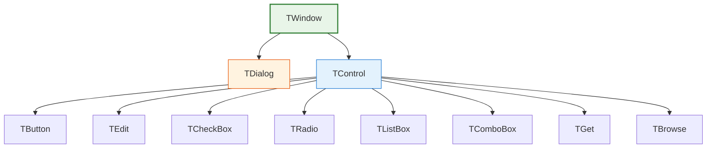
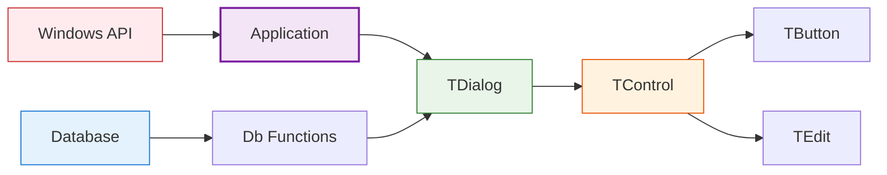

# FiveWin API Reference

This comprehensive reference provides detailed information about all FiveWin classes, functions, and methods. Each entry includes descriptions, parameters, return values, usage examples, and related components.

## Class Reference

### Core Classes

| Class | Description | Key Features |
|-------|-------------|--------------|
| [TWindow](classes/TWindow.md) | Base window class for all FiveWin windows | Window management, message handling, event processing |
| [TDialog](classes/TDialog.md) | Specialized window class for dialog boxes | Modal/modeless support, control containment, MDI child support |
| [TControl](classes/TControl.md) | Base class for all UI controls | Data binding, validation, design mode, focus management |

### UI Control Classes

| Class | Description | Specialized Features |
|-------|-------------|---------------------|
| [TButton](classes/TButton.md) | Push button control | Default/cancel buttons, action execution |
| [TEdit](classes/TEdit.md) | Text input control | Password masking, multiline support |
| [TCheckBox](classes/TCheckBox.md) | Checkbox control | Binary state selection |
| [TRadio](classes/TRadio.md) | Radio button control | Grouped exclusive selection |
| [TListBox](classes/TListBox.md) | List box control | Item selection, scrolling |
| [TComboBox](classes/TComboBox.md) | Combo box control | Drop-down selection |
| [TGet](classes/TGet.md) | Data entry control | Validation, data binding |
| [TBrowse](classes/TBrowse.md) | Data browsing control | Grid display, navigation |

## Function Reference

### Alert and Message Functions

| Function | Description | Return Value |
|----------|-------------|--------------|
| [MsgInfo()](functions/alerts.md#msginfo) | Informational message box | `.T.` |
| [MsgAlert()](functions/alerts.md#msgalert) | Warning message box | `.T.` |
| [MsgStop()](functions/alerts.md#msgstop) | Error message box | `.T.` |
| [MsgYesNo()](functions/alerts.md#msgyesno) | Yes/No confirmation | `.T.` (Yes) or `.F.` (No) |
| [MsgOkCancel()](functions/alerts.md#msgokcancel) | OK/Cancel confirmation | `.T.` (OK) or `.F.` (Cancel) |
| [MsgRetryCancel()](functions/alerts.md#msgretrycancel) | Retry/Cancel confirmation | `.T.` (Retry) or `.F.` (Cancel) |
| [MsgYesNoCancel()](functions/alerts.md#msgyesnocancel) | Yes/No/Cancel confirmation | 1 (Yes), 2 (No), 3 (Cancel) |

### Database Functions

| Function | Description | Parameters |
|----------|-------------|------------|
| [DbUseArea()](functions/database.md#work-area-management) | Opens database in work area | lNew, cDriver, cFile, cAlias, lShare |
| [DbCloseArea()](functions/database.md#work-area-management) | Closes current work area | None |
| [DbSelect()](functions/database.md#work-area-management) | Selects work area | cAlias |
| [DbGoTop()](functions/database.md#record-navigation) | Go to first record | None |
| [DbGoBottom()](functions/database.md#record-navigation) | Go to last record | None |
| [DbSkip()](functions/database.md#record-navigation) | Skip records | nRecords |
| [DbAppend()](functions/database.md#crud-operations) | Add new record | None |
| [DbDelete()](functions/database.md#crud-operations) | Mark record for deletion | None |
| [DbRecall()](functions/database.md#crud-operations) | Recall deleted record | None |
| [DbPack()](functions/database.md#crud-operations) | Remove deleted records | None |
| [DbSeek()](functions/database.md#record-navigation) | Search for key | xKey, lSoftSeek |

## Method Cross-Reference

### TWindow Methods

| Method | Description | Class |
|--------|-------------|-------|
| `New()` | Window constructor | [TWindow](classes/TWindow.md) |
| `Create()` | Creates window handle | [TWindow](classes/TWindow.md) |
| `HandleEvent()` | Message dispatcher | [TWindow](classes/TWindow.md) |
| `Show()` | Displays window | [TWindow](classes/TWindow.md) |
| `End()` | Closes window | [TWindow](classes/TWindow.md) |

### TDialog Methods

| Method | Description | Class |
|--------|-------------|-------|
| `New()` | Dialog constructor | [TDialog](classes/TDialog.md) |
| `Activate()` | Starts dialog | [TDialog](classes/TDialog.md) |
| `End()` | Closes dialog | [TDialog](classes/TDialog.md) |
| `DefControl()` | Adds control | [TDialog](classes/TDialog.md) |
| `Initiate()` | Initializes dialog | [TDialog](classes/TDialog.md) |
| `Command()` | Handles control notifications | [TDialog](classes/TDialog.md) |

### TControl Methods

| Method | Description | Class |
|--------|-------------|-------|
| `New()` | Control constructor | [TControl](classes/TControl.md) |
| `HandleEvent()` | Message dispatcher | [TControl](classes/TControl.md) |
| `SetFocus()` | Sets input focus | [TControl](classes/TControl.md) |
| `lValid()` | Executes validation | [TControl](classes/TControl.md) |
| `GotFocus()` | Focus received | [TControl](classes/TControl.md) |
| `KillFocus()` | Focus lost | [TControl](classes/TControl.md) |
| `ShowDots()` | Design mode handles | [TControl](classes/TControl.md) |

### TButton Methods

| Method | Description | Class |
|--------|-------------|-------|
| `New()` | Button constructor | [TButton](classes/TButton.md) |
| `Click()` | Executes button action | [TButton](classes/TButton.md) |
| `KeyDown()` | Handles key events | [TButton](classes/TButton.md) |
| `ReDefine()` | Associates with existing control | [TButton](classes/TButton.md) |

## Property Cross-Reference

### Core Properties

| Property | Description | Classes |
|----------|-------------|---------|
| `hWnd` | Window handle | [TWindow](classes/TWindow.md), [TDialog](classes/TDialog.md), [TControl](classes/TControl.md) |
| `oWnd` | Parent window | [TDialog](classes/TDialog.md), [TControl](classes/TControl.md) |
| `aControls` | Control collection | [TDialog](classes/TDialog.md) |
| `lModal` | Modal dialog flag | [TDialog](classes/TDialog.md) |
| `bAction` | Action codeblock | [TButton](classes/TButton.md) |
| `bSetGet` | Data binding | [TControl](classes/TControl.md) |
| `bValid` | Validation logic | [TControl](classes/TControl.md) |
| `lDrag` | Design mode flag | [TControl](classes/TControl.md) |

## Event Cross-Reference

### Window Events

| Event | Description | Classes |
|-------|-------------|---------|
| `WM_CREATE` | Window creation | [TWindow](classes/TWindow.md) |
| `WM_DESTROY` | Window destruction | [TWindow](classes/TWindow.md) |
| `WM_PAINT` | Window painting | [TWindow](classes/TWindow.md) |
| `WM_COMMAND` | Command notification | [TDialog](classes/TDialog.md) |
| `WM_INITDIALOG` | Dialog initialization | [TDialog](classes/TDialog.md) |

### Control Events

| Event | Description | Classes |
|-------|-------------|---------|
| `WM_LBUTTONDOWN` | Left mouse button | [TControl](classes/TControl.md) |
| `WM_KEYDOWN` | Key press | [TControl](classes/TControl.md) |
| `WM_SETFOCUS` | Focus received | [TControl](classes/TControl.md) |
| `WM_KILLFOCUS` | Focus lost | [TControl](classes/TControl.md) |
| `BN_CLICKED` | Button clicked | [TButton](classes/TButton.md) |

## Architecture Diagrams

### Class Hierarchy

### Component Interaction

## Best Practices Summary

### UI Development

1. **Use appropriate control types** for different input scenarios
2. **Implement proper validation** with `bValid` and `bWhen` properties
3. **Provide clear navigation** with `oJump` and focus management
4. **Enable design mode** with `lDrag` for flexible layouts
5. **Handle events properly** by overriding specific methods

### Database Operations

1. **Always check return values** for database functions
2. **Use appropriate indexes** for performance optimization
3. **Implement error handling** with try/catch blocks
4. **Backup data** before major operations
5. **Close databases properly** to free resources

### Performance Optimization

1. **Minimize database I/O** with efficient queries
2. **Use buffering** for bulk operations
3. **Implement lazy loading** for large datasets
4. **Optimize painting** in custom controls
5. **Use appropriate modality** for dialogs

## Related Resources

* [FiveWin Documentation Index](../index.md) - Main documentation entry point
* [Installation Guide](../installation.md) - Setting up FiveWin
* [Architecture Overview](../architecture.md) - Framework design principles
* [Tutorials](../tutorials/) - Step-by-step learning guides
* [Windows API Documentation](https://docs.microsoft.com/en-us/windows/win32/api/) - Underlying Windows functionality
* [Harbour Language Reference](https://harbour.github.io/doc/) - Harbour programming language