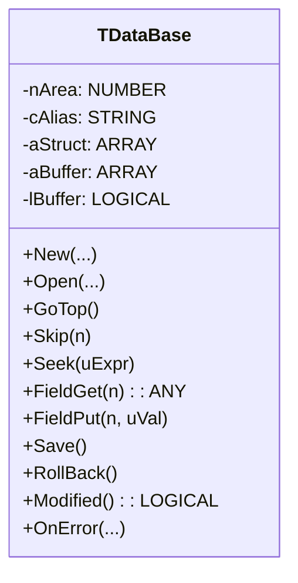
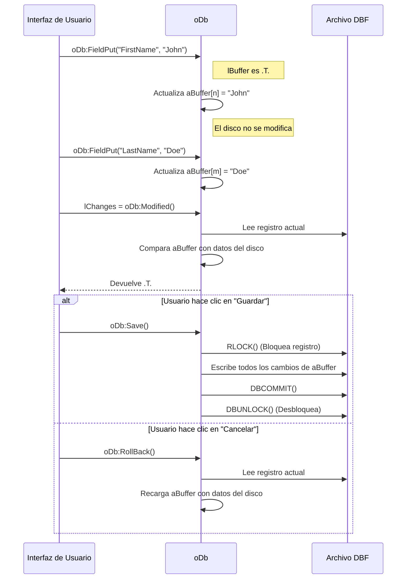

# Análisis del archivo: database.prg

## 1. Descripción general del archivo

El archivo `database.prg` define la clase `TDataBase`, una poderosa abstracción orientada a objetos sobre el sistema de base de datos de Harbour/xBase. Su propósito es encapsular las operaciones con tablas (archivos `.dbf`), índices y registros en un solo objeto, facilitando enormemente el desarrollo de aplicaciones de base de datos y alejándose del antiguo estilo procedural (comandos `USE`, `SKIP`, `SEEK`, etc.).

Esta clase proporciona una interfaz coherente para abrir tablas, navegar por los registros, buscar, filtrar, editar datos a través de un búfer, manejar relaciones y mucho más. Es una de las clases más fundamentales para cualquier aplicación FiveWin que maneje datos. El lenguaje utilizado es **Harbour**.

## 2. Explicación línea por línea

```harbour
#include "FiveWin.ch"
#include "dbinfo.ch"
#include "dbstruct.ch"
// ...
```
- **Líneas 3-8**: Inclusión de múltiples archivos de cabecera. `dbinfo.ch` y `dbstruct.ch` son especialmente importantes, ya que contienen constantes para acceder a la estructura y metadatos de las tablas.

```harbour
CLASS TDataBase
```
- **Línea 45**: Inicio de la definición de la clase `TDataBase`.

```harbour
   DATA   nArea                  AS NUMERIC INIT 0 READONLY
   DATA   cAlias, cFile          AS String INIT "" READONLY
   DATA   aStruct                AS ARRAY
   DATA   hRec                   AS HASH
   DATA   aBuffer                AS ARRAY
   DATA   lBuffer                AS LOGICAL
```
- **Líneas 47-80**: Propiedades clave de la clase:
    - `nArea`, `cAlias`, `cFile`: Almacenan el área de trabajo, el alias y el nombre del archivo de la tabla abierta.
    - `aStruct`: Un array de arrays que contiene la estructura completa de la tabla (nombre de campo, tipo, longitud, decimales, etc.).
    - `hRec`: Un hash (array asociativo) que contiene los datos del registro actual, usando los nombres de campo como claves. Facilita el acceso a los datos por nombre.
    - `aBuffer`, `lBuffer`: `aBuffer` es un array que actúa como un **búfer de registro**. Cuando `lBuffer` es `.T.`, las modificaciones de los campos se realizan en este array en memoria, no directamente en el disco. Los datos se guardan en el disco solo cuando se llama a `::Save()`.

```harbour
   METHOD New(...) CONSTRUCTOR
   METHOD Open(...) CONSTRUCTOR
   METHOD Create(...) CONSTRUCTOR
```
- **Líneas 88-90**: Tres constructores diferentes:
    - `New`: Crea un objeto pero no abre la tabla. Prepara la configuración.
    - `Open`: Crea el objeto y abre inmediatamente la tabla.
    - `Create`: Crea un nuevo archivo de tabla (`.dbf`) en el disco.

```harbour
   METHOD GoTop(), GoBottom(), Skip(n), Seek(uExpr), GoTo(n)
```
- **Líneas 200-202, 234, 255**: Métodos que encapsulan los comandos de navegación y búsqueda estándar de xBase. Por ejemplo, `oDb:GoTop()` es el equivalente orientado a objetos de `(cAlias)->(DBGoTop())`.

```harbour
   MESSAGE FieldGet METHOD _FieldGet( cnCol )
   MESSAGE FieldPut METHOD _FieldPut( cnField, uValue )
```
- **Líneas 178, 195**: `FieldGet` y `FieldPut` son los métodos principales para leer y escribir datos de un campo. El uso de `MESSAGE` permite que se puedan llamar como si fueran propiedades dinámicas del objeto (ej. `oDb:FirstName`), lo que es gestionado por el manejador de errores `OnError`.

```harbour
   METHOD Save()
   METHOD RollBack()
   METHOD Modified()
```
- **Líneas 229, 1315, 1334**: Métodos para gestionar el búfer de registro.
    - `Save()`: Escribe los datos del `aBuffer` al registro actual en el disco. Se encarga de bloquear el registro, escribir y desbloquearlo.
    - `RollBack()`: Descarta los cambios en el búfer, recargando los datos originales desde el disco.
    - `Modified()`: Compara el contenido del búfer con el del disco para determinar si se han realizado cambios.

```harbour
   METHOD SetRelation( uChild, cRelation, lScoped )
   METHOD SetFilter( cFilter, aParams )
```
- **Líneas 238, 240**: Encapsulan `DBSETRELATION()` y `DBSETFILTER()`, permitiendo crear relaciones entre tablas y aplicar filtros a los registros de una manera orientada a objetos.

```harbour
   METHOD OnError(...)
```
- **Línea 311**: Un manejador de errores. Este método es una pieza de metaprogramación muy potente. Se dispara cuando se intenta acceder a un método o propiedad que no existe en la clase. `TDataBase` lo usa para permitir el acceso a los campos de la tabla como si fueran propiedades del objeto. Por ejemplo, si se escribe `cNombre := oDb:FirstName`, el `OnError` se dispara con el mensaje "FIRSTNAME", busca si "FIRSTNAME" es un campo de la tabla, y si lo es, llama internamente a `::FieldGet("FIRSTNAME")`.

```harbour
METHOD SetArea( nWorkArea ) CLASS TDataBase
   ...
   ::aStruct   = ( ::cAlias )->( DbStruct() )
   ::hFlds := {=>}
   ::hRec  := {=>}
   for n = 1 to ( ::cAlias )->( FCount() )
      cCol  := ::aStruct[ n, 1 ]
      ::hFlds[ cCol ] := n
      ::hRec[ cCol ] := ( ::cAlias )->( FieldGet( n ) )
   next
```
- **Líneas 498-568**: El método `SetArea` es llamado internamente después de abrir una tabla. Es responsable de la **introspección**: lee la estructura de la tabla (`DbStruct()`), itera sobre todos los campos, y puebla las propiedades `aStruct`, `aFldNames`, `hFlds` (un hash para búsquedas rápidas de campos) y `hRec`. Este es el proceso que "conecta" el objeto `TDataBase` a la tabla física.

## 3. Funcionalidad principal

`TDataBase` actúa como un **ORM (Object-Relational Mapper)** ligero para el mundo xBase. Transforma el paradigma de comandos procedurales en un modelo de objetos con estado.

- **Abstracción del Área de Trabajo**: El programador ya no necesita gestionar áreas de trabajo (`SELECT 1`, `SELECT 2`, ...). El objeto `TDataBase` encapsula su propia área y alias, y todas las operaciones se realizan a través de métodos del objeto.
- **Acceso a Datos por Nombre**: Gracias al método `OnError`, se puede acceder a los campos por su nombre como si fueran propiedades (ej. `oDb:Price * oDb:Quantity`), lo que hace el código mucho más legible y menos propenso a errores que usar `FIELD->PRICE`.
- **Edición en Búfer (Buffered Editing)**: El mecanismo de `lBuffer` es una de sus características más potentes. Permite realizar múltiples cambios en un registro en memoria y luego guardarlos todos a la vez con `::Save()` o descartarlos con `::RollBack()`. Esto es fundamental para las interfaces de usuario, donde un usuario puede editar varios campos en un formulario antes de decidir si guarda o cancela.
- **Gestión de Relaciones y Filtros**: Simplifica la creación de relaciones maestro-detalle y la aplicación de filtros complejos.
- **Integración con `TXBrowse`**: Proporciona métodos (`Browse`, `SetXBrowse`) para vincularse fácilmente con la potente clase `TXBrowse`, permitiendo crear grids de datos complejos con muy poco código.
- **Replicación**: Incluye una funcionalidad básica para replicar cambios (inserciones, actualizaciones, borrados) a un servidor SQL (MariaDB en este caso), actuando como un puente entre el mundo DBF y el mundo SQL.

## 4. Diagramas Mermaid

### Diagrama de Clases (Class Diagram)



### Diagrama de Secuencia de Edición en Búfer



### Diagrama de Flujo del Acceso a Campos con `OnError`

```mermaid
flowchart TD
    A[Inicio: Código intenta acceder a oDb:FirstName] --> B{¿Existe una propiedad/método llamado "FirstName"?};
    B -- Sí --> C[Se llama al método/propiedad existente];
    B -- No --> D{Se dispara el método OnError("FIRSTNAME")};
    D --> E{¿"FIRSTNAME" es un campo válido en la tabla? (::FieldPos > 0)};
    E -- Sí --> F[Llama a ::FieldGet("FIRSTNAME") y devuelve el valor];
    E -- No --> G{¿Es un comando de función de DBF? (ej. oDb:RecNo())};
    G -- Sí --> H[Ejecuta la función DBF correspondiente y devuelve el resultado];
    G -- No --> I[Genera un error estándar: "Variable no existe"];
    C --> Z[Fin];
    F --> Z;
    H --> Z;
    I --> Z;
```

## 5. Relaciones con otros módulos

- **Dependencias**:
    - **Funciones de base de datos de Harbour**: Es una envoltura directa sobre las funciones `DBUSEAREA()`, `DBSKIP()`, `DBSEEK()`, `DBCOMMIT()`, `DBSTRUCT()`, etc. del RDD (Replaceable Database Driver) de Harbour.
    - **`xbrowse.ch` (`TXBrowse`)**: Aunque no es una dependencia estricta, está diseñado para trabajar en estrecha colaboración con `TXBrowse`, proporcionando los métodos `_xBrowse` y `SetXBrowse` para una integración perfecta.
    - **`tdatarow.prg` (`TDataRow`)**: La clase `TDataBase` se usa como fuente de datos para `TDataRow`, que representa un único registro como un objeto editable. Los métodos `RowGet` y `RowPut` son la interfaz para esta interacción.

- **Módulos que lo llaman**:
    - **Cualquier módulo de la aplicación que necesite acceso a datos**. Es la capa de acceso a datos (DAL - Data Access Layer) del framework.
    - Clases de UI como `TXBrowse`, `TDataRow`, y a menudo los propios diálogos de la aplicación, contendrán una instancia de `TDataBase` para obtener y modificar los datos que muestran.

- **Módulos que él llama**:
    - Llama a las **funciones del RDD de Harbour** para todas las operaciones de base de datos.
    - Puede llamar a un objeto de conexión SQL (`FWMARIACONNECTION`) si la replicación está activada.

- **Integración en la arquitectura**:
    - `TDataBase` es el pilar de la arquitectura de acceso a datos de FiveWin. Actúa como la capa de abstracción que aísla al resto de la aplicación de los detalles de bajo nivel del manejo de archivos DBF.
    - Promueve un diseño de **separación de intereses**: la interfaz de usuario (las ventanas y controles) no necesita saber cómo se abren o leen los archivos; simplemente interactúa con el objeto `TDataBase` a través de su interfaz pública (métodos y propiedades virtuales). Esto hace que el código sea más modular, más fácil de probar y más mantenible.
