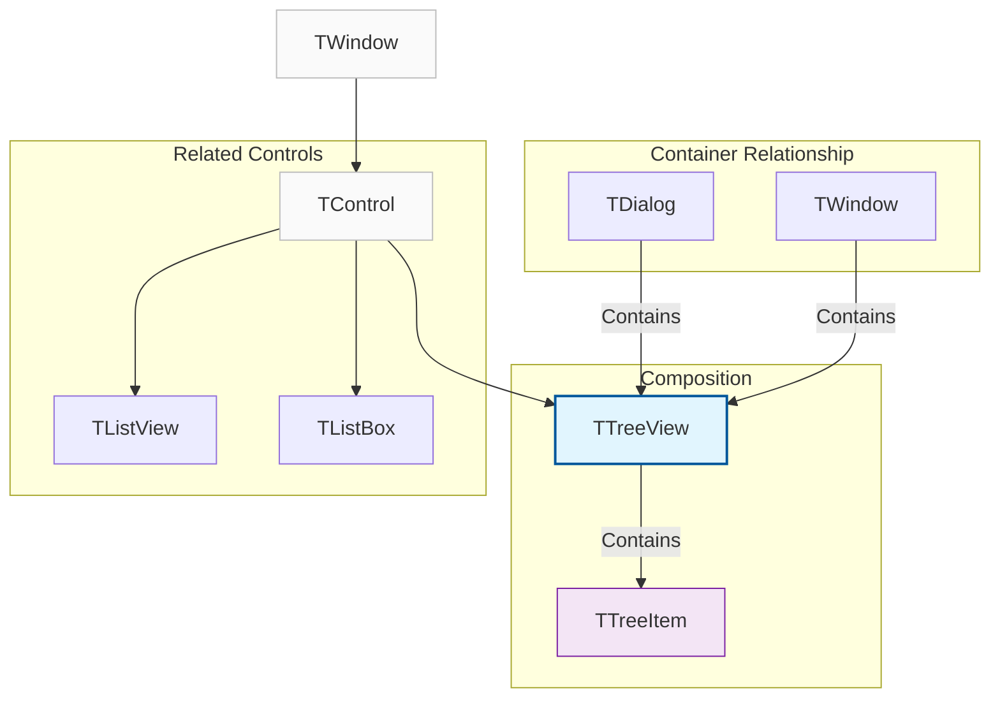
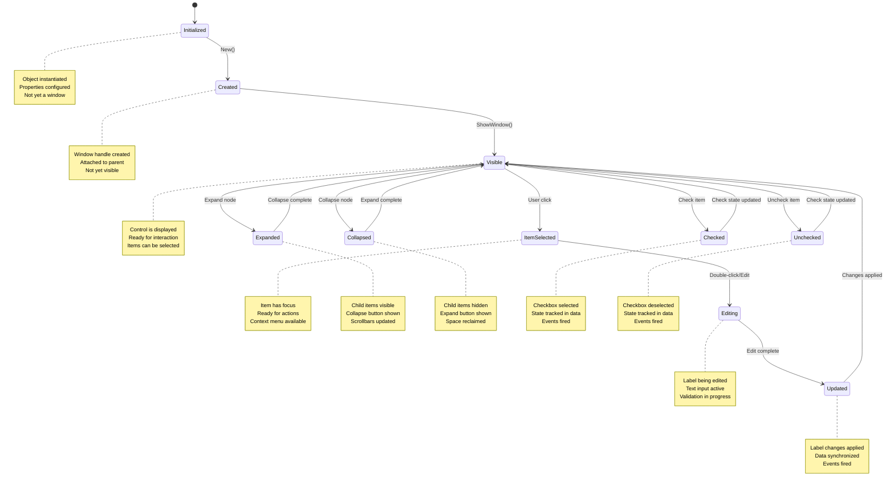
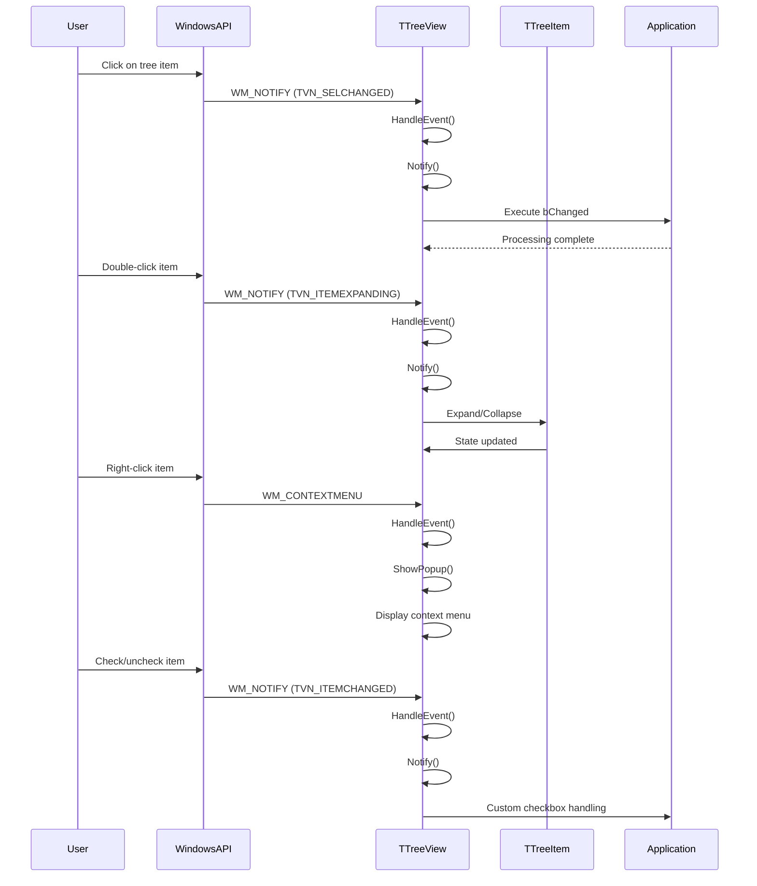

# TTreeView Class

The `TTreeView` class provides a comprehensive implementation of a tree view control that displays hierarchical data in a collapsible tree structure. It supports advanced features including checkboxes, editable labels, custom images, and extensive event handling.

**Source File:** [source/classes/ttreevie.prg](../../../source/classes/ttreevie.prg)

## Overview

The `TTreeView` class encapsulates the Windows TreeView control, providing a high-level interface for managing hierarchical data structures. As a subclass of `TControl`, it inherits all standard control functionality while adding specialized behavior for tree navigation, item management, and user interaction.

Tree views are essential UI components for displaying hierarchical data such as file systems, organizational charts, navigation menus, and structured data with parent-child relationships.

## Class Hierarchy



## Tree View States



## Key Properties

| Property | Type | Description |
|----------|------|-------------|
| `aItems` | `Array` | Array of root-level `TTreeItem` objects |
| `oImageList` | `TImageList` | Image list for item icons |
| `bChanged` | `Codeblock` | Executed when selection changes |
| `bExpanded` | `Codeblock` | Executed when item is expanded/collapsed |
| `hEdit` | `Handle` | Handle to edit control during label editing |
| `lCheckBoxes` | `Logical` | If `.T.`, displays checkboxes for items |
| `lEditable` | `Logical` | If `.T.`, allows label editing |

## Key Methods

| Method | Description |
|--------|-------------|
| `New()` | Constructor for creating a new tree view |
| `ReDefine()` | Associates with existing tree view from dialog resources |
| `Add(cPrompt, nImage, nValue)` | Adds a new root item to the tree |
| `InsertAfter(oItem, cPrompt, nImage, nValue)` | Inserts item after specified item |
| `GetSelected()` | Returns currently selected item |
| `Select(oItem)` | Selects specified item |
| `Expand()` | Expands all items in the tree |
| `CollapseAll()` | Collapses all items in the tree |
| `EditLabel(oItem)` | Begins editing of item's label |
| `SetImageList(oImageList)` | Sets image list for item icons |
| `DeleteAll()` | Removes all items from the tree |
| `HitTest(nRow, nCol)` | Returns item at specified coordinates |
| `GetCheck(oItem)` | Gets checkbox state for item |
| `SetCheck(oItem, lOnOff)` | Sets checkbox state for item |
| `Toggle()` | Toggles expansion state of all items |
| `Scan(bAction)` | Executes action on all items recursively |

## Event Processing Flow



> **Nota sobre modo Unicode:** Cuando `FW_SetUnicode(.T.)` está activo, el control TreeView
> envía `TVN_SELCHANGEDW` (-456) en lugar de `TVN_SELCHANGEDA` (-402). El framework
> maneja ambas notificaciones automáticamente, por lo que los callbacks `bChanged`
> funcionan correctamente en ambos modos ANSI y Unicode.

## Usage Patterns

### Basic Tree View

```harbour
#include "FiveWin.ch"

function Main()
   local oDlg, oTreeView
   
   DEFINE DIALOG oDlg TITLE "File Explorer" ;
      FROM 0, 0 TO 300, 400

   @ 10, 10 TREEVIEW oTreeView OF oDlg ;
      SIZE 250, 200 ;
      ON CHANGE { || ShowSelectedItem( oTreeView ) }

   // Add root items
   oTreeView:Add( "My Computer" )
   oTreeView:Add( "Documents" )
   oTreeView:Add( "Pictures" )
   oTreeView:Add( "Music" )

   // Add sub-items to Documents
   local oDocuments := oTreeView:aItems[2]  // Documents is second item
   oDocuments:Add( "Work" )
   oDocuments:Add( "Personal" )
   oDocuments:Add( "Projects" )

   // Add sub-items to Work folder
   local oWork := oDocuments:aItems[1]  // Work is first sub-item
   oWork:Add( "Reports" )
   oWork:Add( "Presentations" )
   oWork:Add( "Spreadsheets" )

   @ 220, 10 BUTTON "Expand All" OF oDlg ;
      ACTION oTreeView:Expand()

   @ 220, 70 BUTTON "Collapse All" OF oDlg ;
      ACTION oTreeView:CollapseAll()

   @ 220, 130 BUTTON "Close" OF oDlg ;
      ACTION oDlg:End()

   ACTIVATE DIALOG oDlg CENTERED

return nil

static function ShowSelectedItem( oTreeView )
   local oItem := oTreeView:GetSelected()
   
   if oItem != nil
      MsgInfo( "Selected: " + oItem:cText )
   endif
   
return nil
```

### Tree View with Checkboxes

```harbour
#include "FiveWin.ch"

function Main()
   local oDlg, oTreeView
   
   DEFINE DIALOG oDlg TITLE "Feature Selection" ;
      FROM 0, 0 TO 300, 400

   @ 10, 10 TREEVIEW oTreeView OF oDlg ;
      SIZE 250, 200 ;
      CHECKBOXES ;
      ON CHANGE { || UpdateCheckState( oTreeView ) }

   // Create feature hierarchy
   CreateFeatureTree( oTreeView )

   @ 220, 10 BUTTON "Check All" OF oDlg ;
      ACTION CheckAllItems( oTreeView )

   @ 220, 70 BUTTON "Uncheck All" OF oDlg ;
      ACTION UncheckAllItems( oTreeView )

   @ 220, 130 BUTTON "Get Selected" OF oDlg ;
      ACTION ShowCheckedItems( oTreeView )

   @ 220, 190 BUTTON "Close" OF oDlg ;
      ACTION oDlg:End()

   ACTIVATE DIALOG oDlg CENTERED

return nil

static function CreateFeatureTree( oTreeView )
   // Main categories
   local oCore := oTreeView:Add( "Core Features" )
   local oAdvanced := oTreeView:Add( "Advanced Features" )
   local oExperimental := oTreeView:Add( "Experimental Features" )

   // Core features
   oCore:Add( "User Management" )
   oCore:Add( "Data Storage" )
   oCore:Add( "Reporting" )

   // Advanced features
   oAdvanced:Add( "Analytics" )
   local oSecurity := oAdvanced:Add( "Security" )
   oSecurity:Add( "Encryption" )
   oSecurity:Add( "Authentication" )
   oSecurity:Add( "Access Control" )

   // Experimental features
   oExperimental:Add( "AI Integration" )
   oExperimental:Add( "Cloud Sync" )
   oExperimental:Add( "Mobile Support" )

   // Initially check some items
   oTreeView:SetCheck( oCore, .T. )
   oTreeView:SetCheck( oCore:aItems[1], .T. )  // User Management
   oTreeView:SetCheck( oAdvanced:aItems[1], .T. )  // Analytics

return nil

static function UpdateCheckState( oTreeView )
   local oItem := oTreeView:GetSelected()
   
   if oItem != nil
      local lChecked := oTreeView:GetCheck( oItem )
      ? "Item '" + oItem:cText + "' is now " + iif( lChecked, "checked", "unchecked" )
   endif
   
return nil

static function CheckAllItems( oTreeView )
   ScanItems( oTreeView:aItems, .T. )
   MsgInfo( "All items checked" )
return nil

static function UncheckAllItems( oTreeView )
   ScanItems( oTreeView:aItems, .F. )
   MsgInfo( "All items unchecked" )
return nil

static function ShowCheckedItems( oTreeView )
   local aChecked := {}
   CollectCheckedItems( oTreeView:aItems, aChecked )
   
   local cMessage := "Checked items:" + hb_osNewLine()
   for local i := 1 to Len( aChecked )
      cMessage += "- " + aChecked[i] + hb_osNewLine()
   next
   
   if Empty( aChecked )
      cMessage += "None"
   endif
   
   MsgInfo( cMessage )
return nil

static function ScanItems( aItems, lCheck )
   for local i := 1 to Len( aItems )
      local oItem := aItems[i]
      oTreeView:SetCheck( oItem, lCheck )
      if Len( oItem:aItems ) > 0
         ScanItems( oItem:aItems, lCheck )
      endif
   next
return nil

static function CollectCheckedItems( aItems, aChecked )
   for local i := 1 to Len( aItems )
      local oItem := aItems[i]
      if oTreeView:GetCheck( oItem )
         AAdd( aChecked, oItem:cText )
      endif
      if Len( oItem:aItems ) > 0
         CollectCheckedItems( oItem:aItems, aChecked )
      endif
   next
return nil
```

### Tree View with Custom Images

```harbour
#include "FiveWin.ch"

function Main()
   local oDlg, oTreeView, oImageList
   
   DEFINE DIALOG oDlg TITLE "Project Explorer" ;
      FROM 0, 0 TO 300, 400

   // Create image list
   oImageList := TImageList():New( 16, 16 )
   // Add images: folder, file, project, solution, etc.
   // oImageList:Add( LoadBitmap( "folder.bmp" ) )
   // oImageList:Add( LoadBitmap( "file.bmp" ) )
   // oImageList:Add( LoadBitmap( "project.bmp" ) )

   @ 10, 10 TREEVIEW oTreeView OF oDlg ;
      SIZE 250, 200 ;
      ON CHANGE { || ShowItemInfo( oTreeView ) }

   // Set image list
   oTreeView:SetImageList( oImageList )

   // Create project structure
   CreateProjectTree( oTreeView )

   @ 220, 10 BUTTON "Expand Branch" OF oDlg ;
      ACTION ExpandSelectedBranch( oTreeView )

   @ 220, 70 BUTTON "Collapse Branch" OF oDlg ;
      ACTION CollapseSelectedBranch( oTreeView )

   @ 220, 130 BUTTON "Refresh" OF oDlg ;
      ACTION RefreshTree( oTreeView )

   @ 220, 190 BUTTON "Close" OF oDlg ;
      ACTION oDlg:End()

   ACTIVATE DIALOG oDlg CENTERED

return nil

static function CreateProjectTree( oTreeView )
   // Solution node
   local oSolution := oTreeView:Add( "MySolution.sln", 2 )  // Project icon

   // Project nodes
   local oProject1 := oSolution:Add( "WebApplication1.csproj", 2 )
   local oProject2 := oSolution:Add( "BusinessLogic.csproj", 2 )

   // WebApplication1 structure
   local oWebFolder := oProject1:Add( "wwwroot", 0 )  // Folder icon
   oWebFolder:Add( "index.html", 1 )  // File icon
   oWebFolder:Add( "style.css", 1 )
   oWebFolder:Add( "script.js", 1 )

   local oControllers := oProject1:Add( "Controllers", 0 )
   oControllers:Add( "HomeController.cs", 1 )
   oControllers:Add( "AccountController.cs", 1 )

   local oModels := oProject1:Add( "Models", 0 )
   oModels:Add( "User.cs", 1 )
   oModels:Add( "Product.cs", 1 )

   // BusinessLogic structure
   local oServices := oProject2:Add( "Services", 0 )
   oServices:Add( "UserService.cs", 1 )
   oServices:Add( "ProductService.cs", 1 )

   local oData := oProject2:Add( "Data", 0 )
   oData:Add( "DataContext.cs", 1 )
   oData:Add( "Migrations", 0 )

return nil

static function ShowItemInfo( oTreeView )
   local oItem := oTreeView:GetSelected()
   
   if oItem != nil
      local cInfo := "Item: " + oItem:cText + hb_osNewLine()
      cInfo += "Level: " + hb_ntos( oItem:nLevel ) + hb_osNewLine()
      cInfo += "Children: " + hb_ntos( Len( oItem:aItems ) )
      ? cInfo
   endif
   
return nil

static function ExpandSelectedBranch( oTreeView )
   local oItem := oTreeView:GetSelected()
   
   if oItem != nil
      oItem:Expand()
      oTreeView:ExpandBranch( oItem )
      MsgInfo( "Branch expanded: " + oItem:cText )
   endif
   
return nil

static function CollapseSelectedBranch( oTreeView )
   local oItem := oTreeView:GetSelected()
   
   if oItem != nil
      oItem:Collapse()
      oTreeView:CollapseBranch( oItem )
      MsgInfo( "Branch collapsed: " + oItem:cText )
   endif
   
return nil

static function RefreshTree( oTreeView )
   // In a real application, this would reload data from source
   MsgInfo( "Tree refreshed" )
return nil
```

### Editable Tree View

```harbour
#include "FiveWin.ch"

function Main()
   local oDlg, oTreeView
   
   DEFINE DIALOG oDlg TITLE "Editable Categories" ;
      FROM 0, 0 TO 300, 400

   @ 10, 10 TREEVIEW oTreeView OF oDlg ;
      SIZE 250, 200 ;
      EDITLABELS ;
      ON CHANGE { || ShowItemSelected( oTreeView ) }

   // Create initial category structure
   CreateCategoryTree( oTreeView )

   @ 220, 10 BUTTON "Add Category" OF oDlg ;
      ACTION AddNewCategory( oTreeView )

   @ 220, 70 BUTTON "Edit Label" OF oDlg ;
      ACTION EditSelectedItem( oTreeView )

   @ 220, 130 BUTTON "Delete Item" OF oDlg ;
      ACTION DeleteSelectedItem( oTreeView )

   @ 220, 190 BUTTON "Close" OF oDlg ;
      ACTION oDlg:End()

   ACTIVATE DIALOG oDlg CENTERED

return nil

static function CreateCategoryTree( oTreeView )
   local oElectronics := oTreeView:Add( "Electronics" )
   local oComputers := oElectronics:Add( "Computers" )
   oComputers:Add( "Laptops" )
   oComputers:Add( "Desktops" )
   oComputers:Add( "Tablets" )
   
   local oPhones := oElectronics:Add( "Phones" )
   oPhones:Add( "Smartphones" )
   oPhones:Add( "Feature Phones" )
   
   local oClothing := oTreeView:Add( "Clothing" )
   oClothing:Add( "Men's" )
   oClothing:Add( "Women's" )
   oClothing:Add( "Children's" )

return nil

static function ShowItemSelected( oTreeView )
   local oItem := oTreeView:GetSelected()
   
   if oItem != nil
      ? "Selected: " + oItem:cText
   endif
   
return nil

static function AddNewCategory( oTreeView )
   local oItem := oTreeView:GetSelected()
   local cNewName := Space(50)
   
   if oItem == nil
      // Add to root
      DEFINE DIALOG oDlg TITLE "Add Root Category" ;
         FROM 0, 0 TO 100, 250
      
      @ 10, 10 SAY "Category Name:" OF oDlg
      @ 10, 40 GET cNewName OF oDlg SIZE 100, 12
      
      @ 40, 40 BUTTON "Add" OF oDlg ;
         ACTION ( AddRootCategory( oTreeView, cNewName ), oDlg:End() )
      
      @ 40, 100 BUTTON "Cancel" OF oDlg ;
         ACTION oDlg:End()
      
      ACTIVATE DIALOG oDlg CENTERED
   else
      // Add as child
      DEFINE DIALOG oDlg TITLE "Add Subcategory" ;
         FROM 0, 0 TO 100, 250
      
      @ 10, 10 SAY "Subcategory Name:" OF oDlg
      @ 10, 40 GET cNewName OF oDlg SIZE 100, 12
      
      @ 40, 40 BUTTON "Add" OF oDlg ;
         ACTION ( AddSubCategory( oTreeView, oItem, cNewName ), oDlg:End() )
      
      @ 40, 100 BUTTON "Cancel" OF oDlg ;
         ACTION oDlg:End()
      
      ACTIVATE DIALOG oDlg CENTERED
   endif
   
return nil

static function AddRootCategory( oTreeView, cName )
   local cTrimmed := AllTrim( cName )
   
   if !Empty( cTrimmed )
      oTreeView:Add( cTrimmed )
      MsgInfo( "Category added: " + cTrimmed )
   else
      MsgAlert( "Please enter a category name" )
   endif
   
return nil

static function AddSubCategory( oTreeView, oParent, cName )
   local cTrimmed := AllTrim( cName )
   
   if !Empty( cTrimmed )
      oParent:Add( cTrimmed )
      MsgInfo( "Subcategory added: " + cTrimmed )
   else
      MsgAlert( "Please enter a subcategory name" )
   endif
   
return nil

static function EditSelectedItem( oTreeView )
   local oItem := oTreeView:GetSelected()
   
   if oItem != nil
      oTreeView:EditLabel( oItem )
   else
      MsgAlert( "Please select an item to edit" )
   endif
   
return nil

static function DeleteSelectedItem( oTreeView )
   local oItem := oTreeView:GetSelected()
   
   if oItem == nil
      MsgAlert( "Please select an item to delete" )
      return .F.
   endif
   
   if Len( oItem:aItems ) > 0
      if !MsgYesNo( "This item has sub-items. Delete anyway?" )
         return .F.
      endif
   endif
   
   if MsgYesNo( "Delete item: " + oItem:cText + "?" )
      // Remove from parent's item list
      local oParent := oItem:oParent
      if oParent == nil
         // Root item
         local nIndex := AScan( oTreeView:aItems, { |o| o == oItem } )
         if nIndex > 0
            ADEL( oTreeView:aItems, nIndex )
            ASize( oTreeView:aItems, Len( oTreeView:aItems ) - 1 )
         endif
      else
         // Child item
         local nIndex := AScan( oParent:aItems, { |o| o == oItem } )
         if nIndex > 0
            ADEL( oParent:aItems, nIndex )
            ASize( oParent:aItems, Len( oParent:aItems ) - 1 )
         endif
      endif
      
      // Refresh the tree view
      oTreeView:DeleteAll()
      // In a real app, you'd rebuild from data source
      CreateCategoryTree( oTreeView )
      
      MsgInfo( "Item deleted" )
   endif
   
return nil
```

## Advanced Features

### Tree Navigation and Search

```harbour
#include "FiveWin.ch"

function Main()
   local oDlg, oTreeView, oSearch
   
   DEFINE DIALOG oDlg TITLE "Advanced Tree Navigation" ;
      FROM 0, 0 TO 350, 450

   @ 10, 10 SAY "Search:" OF oDlg
   @ 10, 30 GET oSearch OF oDlg SIZE 100, 12 ;
      ON CHANGE { || SearchTree( oTreeView, oSearch:VarGet() ) }

   @ 30, 10 TREEVIEW oTreeView OF oDlg ;
      SIZE 250, 200 ;
      ON CHANGE { || ShowItemPath( oTreeView ) }

   // Create complex tree structure
   CreateComplexTree( oTreeView )

   @ 240, 10 BUTTON "Find Next" OF oDlg ;
      ACTION FindNextItem( oTreeView )

   @ 240, 70 BUTTON "Go Top" OF oDlg ;
      ACTION oTreeView:GoTop()

   @ 240, 130 BUTTON "Go Bottom" OF oDlg ;
      ACTION oTreeView:GoBottom()

   @ 240, 190 BUTTON "Expand All" OF oDlg ;
      ACTION oTreeView:Expand()

   @ 240, 250 BUTTON "Close" OF oDlg ;
      ACTION oDlg:End()

   ACTIVATE DIALOG oDlg CENTERED

return nil

static function CreateComplexTree( oTreeView )
   // Create a complex hierarchical structure for demonstration
   local oRoot1 := oTreeView:Add( "Root Node 1" )
   local oRoot2 := oTreeView:Add( "Root Node 2" )
   local oRoot3 := oTreeView:Add( "Root Node 3" )

   // Add children to Root Node 1
   for local i := 1 to 5
      local oChild := oRoot1:Add( "Child " + hb_ntos(i) )
      for local j := 1 to 3
         oChild:Add( "Grandchild " + hb_ntos(i) + "." + hb_ntos(j) )
      next
   next

   // Add children to Root Node 2
   for local i := 1 to 3
      local oChild := oRoot2:Add( "Section " + hb_ntos(i) )
      for local j := 1 to 4
         oChild:Add( "Item " + hb_ntos(i) + "." + hb_ntos(j) )
      next
   next

   // Add children to Root Node 3
   local oSpecial := oRoot3:Add( "Special Items" )
   oSpecial:Add( "Important Document" )
   oSpecial:Add( "Critical File" )
   oSpecial:Add( "Essential Resource" )

return nil

static function SearchTree( oTreeView, cSearch )
   if Empty( cSearch )
      return .T.
   endif
   
   cSearch := Upper( AllTrim( cSearch ) )
   
   // Search through all items
   local oFound := FindItemByText( oTreeView:aItems, cSearch )
   
   if oFound != nil
      oTreeView:Select( oFound )
      oFound:MakeVisible()
      MsgInfo( "Found: " + oFound:cText )
   else
      MsgAlert( "Item not found: " + cSearch )
   endif
   
return nil

static function FindItemByText( aItems, cSearch )
   for local i := 1 to Len( aItems )
      local oItem := aItems[i]
      if At( cSearch, Upper( oItem:cText ) ) > 0
         return oItem
      endif
      
      if Len( oItem:aItems ) > 0
         local oFound := FindItemByText( oItem:aItems, cSearch )
         if oFound != nil
            return oFound
         endif
      endif
   next
   
return nil

static function FindNextItem( oTreeView )
   local oCurrent := oTreeView:GetSelected()
   
   if oCurrent == nil
      MsgAlert( "Please select an item first" )
      return .F.
   endif
   
   // Simple next item navigation
   local oNext := GetNextItem( oTreeView, oCurrent )
   
   if oNext != nil
      oTreeView:Select( oNext )
      oNext:MakeVisible()
   else
      MsgInfo( "No more items" )
   endif
   
return nil

static function GetNextItem( oTreeView, oCurrent )
   // This is a simplified implementation
   // In a real application, you'd implement proper tree traversal
   ? "Current item: " + oCurrent:cText
   return nil
```

### Tree Data Binding and Persistence

```harbour
#include "FiveWin.ch"

function Main()
   local oDlg, oTreeView
   
   DEFINE DIALOG oDlg TITLE "Persistent Tree Data" ;
      FROM 0, 0 TO 300, 400

   @ 10, 10 TREEVIEW oTreeView OF oDlg ;
      SIZE 250, 200 ;
      ON CHANGE { || ShowItemData( oTreeView ) }

   // Load tree data from file or database
   LoadTreeData( oTreeView )

   @ 220, 10 BUTTON "Add Item" OF oDlg ;
      ACTION AddTreeItem( oTreeView )

   @ 220, 70 BUTTON "Save Data" OF oDlg ;
      ACTION SaveTreeData( oTreeView )

   @ 220, 130 BUTTON "Load Data" OF oDlg ;
      ACTION ( oTreeView:DeleteAll(), LoadTreeData( oTreeView ) )

   @ 220, 190 BUTTON "Close" OF oDlg ;
      ACTION oDlg:End()

   ACTIVATE DIALOG oDlg CENTERED

return nil

static function LoadTreeData( oTreeView )
   // In a real application, this would load from file or database
   // For demonstration, we'll create sample data
   
   // Check if data file exists
   if File( "tree_data.txt" )
      LoadTreeFromFile( oTreeView, "tree_data.txt" )
   else
      CreateSampleTreeData( oTreeView )
   endif
   
return nil

static function CreateSampleTreeData( oTreeView )
   local oProjects := oTreeView:Add( "Projects" )
   local oProject1 := oProjects:Add( "Website Redesign" )
   oProject1:Add( "Planning" )
   oProject1:Add( "Design" )
   oProject1:Add( "Development" )
   oProject1:Add( "Testing" )
   
   local oProject2 := oProjects:Add( "Mobile App" )
   oProject2:Add( "Research" )
   oProject2:Add( "Prototyping" )
   oProject2:Add( "Implementation" )
   
   local oTasks := oTreeView:Add( "Tasks" )
   oTasks:Add( "Daily Standup" )
   oTasks:Add( "Code Review" )
   oTasks:Add( "Documentation" )

return nil

static function LoadTreeFromFile( oTreeView, cFileName )
   local oFile := FOpen( cFileName, FO_READ )
   
   if oFile == -1
      MsgAlert( "Cannot open file: " + cFileName )
      return .F.
   endif
   
   local cLine
   local aStack := {}  // Stack to track parent items
   
   while !FEof( oFile )
      cLine := FReadLine( oFile )
      if !Empty( cLine )
         cLine := AllTrim( cLine )
         local nLevel := CountLeadingSpaces( cLine )
         local cText := LTrim( cLine )
         
         // Adjust stack to correct level
         while Len( aStack ) > nLevel
            ASize( aStack, Len( aStack ) - 1 )
         enddo
         
         // Add item
         local oItem
         if Empty( aStack )
            // Root item
            oItem := oTreeView:Add( cText )
         else
            // Child item
            local oParent := ATail( aStack )
            oItem := oParent:Add( cText )
         endif
         
         // Push to stack
         AAdd( aStack, oItem )
      endif
   enddo
   
   FClose( oFile )
   MsgInfo( "Tree data loaded from " + cFileName )
   
return .T.

static function CountLeadingSpaces( cLine )
   local nCount := 0
   for local i := 1 to Len( cLine )
      if SubStr( cLine, i, 1 ) == " "
         nCount++
      else
         exit
      endif
   next
return nCount

static function SaveTreeData( oTreeView )
   local oFile := FCreate( "tree_data.txt" )
   
   if oFile == -1
      MsgAlert( "Cannot create file: tree_data.txt" )
      return .F.
   endif
   
   // Save tree data recursively
   SaveTreeItems( oFile, oTreeView:aItems, 0 )
   
   FClose( oFile )
   MsgInfo( "Tree data saved to tree_data.txt" )
   
return .T.

static function SaveTreeItems( oFile, aItems, nLevel )
   local cIndent := Replicate( " ", nLevel * 2 )
   
   for local i := 1 to Len( aItems )
      local oItem := aItems[i]
      FWriteLine( oFile, cIndent + oItem:cText )
      
      if Len( oItem:aItems ) > 0
         SaveTreeItems( oFile, oItem:aItems, nLevel + 1 )
      endif
   next
   
return nil

static function AddTreeItem( oTreeView )
   local oItem := oTreeView:GetSelected()
   local cNewItem := Space(50)
   
   DEFINE DIALOG oDlg TITLE "Add Item" ;
      FROM 0, 0 TO 100, 250
   
   @ 10, 10 SAY "Item Name:" OF oDlg
   @ 10, 40 GET cNewItem OF oDlg SIZE 100, 12
   
   @ 40, 40 BUTTON "Add" OF oDlg ;
      ACTION ( AddItemToTree( oTreeView, oItem, cNewItem ), oDlg:End() )
   
   @ 40, 100 BUTTON "Cancel" OF oDlg ;
      ACTION oDlg:End()
   
   ACTIVATE DIALOG oDlg CENTERED
   
return nil

static function AddItemToTree( oTreeView, oParent, cName )
   local cTrimmed := AllTrim( cName )
   
   if Empty( cTrimmed )
      MsgAlert( "Please enter an item name" )
      return .F.
   endif
   
   if oParent == nil
      // Add root item
      oTreeView:Add( cTrimmed )
   else
      // Add child item
      oParent:Add( cTrimmed )
   endif
   
   MsgInfo( "Item added: " + cTrimmed )
   
return .T.

static function ShowItemData( oTreeView )
   local oItem := oTreeView:GetSelected()
   
   if oItem != nil
      local cInfo := "Item: " + oItem:cText + hb_osNewLine()
      cInfo += "Level: " + hb_ntos( oItem:nLevel ) + hb_osNewLine()
      cInfo += "Children: " + hb_ntos( Len( oItem:aItems ) )
      ? cInfo
   endif
   
return nil
```

## Related Components

* [TControl Class](TControl.md) - Base control class that TTreeView inherits from
* [TTreeItem Class](TTreeItem.md) - Individual items within the tree view
* [TListView Class](TListView.md) - Alternative data display control
* [TImageList Class](TImageList.md) - Image management for tree icons
* [TDialog Class](TDialog.md) - Container for tree view controls

## Windows API References

* [Tree-View Control](https://docs.microsoft.com/en-us/windows/win32/controls/tree-view-control-reference)
* [TreeView Messages](https://docs.microsoft.com/en-us/windows/win32/controls/bumper-tree-view-control-reference-messages)
* [TVN_* Notifications](https://docs.microsoft.com/en-us/windows/win32/controls/bumper-tree-view-control-reference-notifications)
* [TV_* Styles](https://docs.microsoft.com/en-us/windows/win32/controls/tree-view-control-window-styles)

## Best Practices

1. **Data Structure**: Organize hierarchical data logically before creating tree
2. **Performance**: Use virtual mode for very large trees
3. **User Experience**: Provide clear visual feedback for selection and expansion
4. **Memory Management**: Clean up tree items when no longer needed
5. **Validation**: Validate user input during label editing
6. **Persistence**: Implement save/load functionality for tree state
7. **Accessibility**: Ensure keyboard navigation works properly
8. **Customization**: Use images and colors to enhance visual hierarchy

## Performance Considerations

* Large trees with many items can impact performance
* Image lists consume memory for icon storage
* Checkbox state tracking adds overhead for complex trees
* Label editing requires additional UI elements
* Recursive operations on large trees can be processor-intensive
* Consider lazy loading for very large datasets
* Virtual mode can improve performance for massive trees
* Proper indexing can speed up item searches